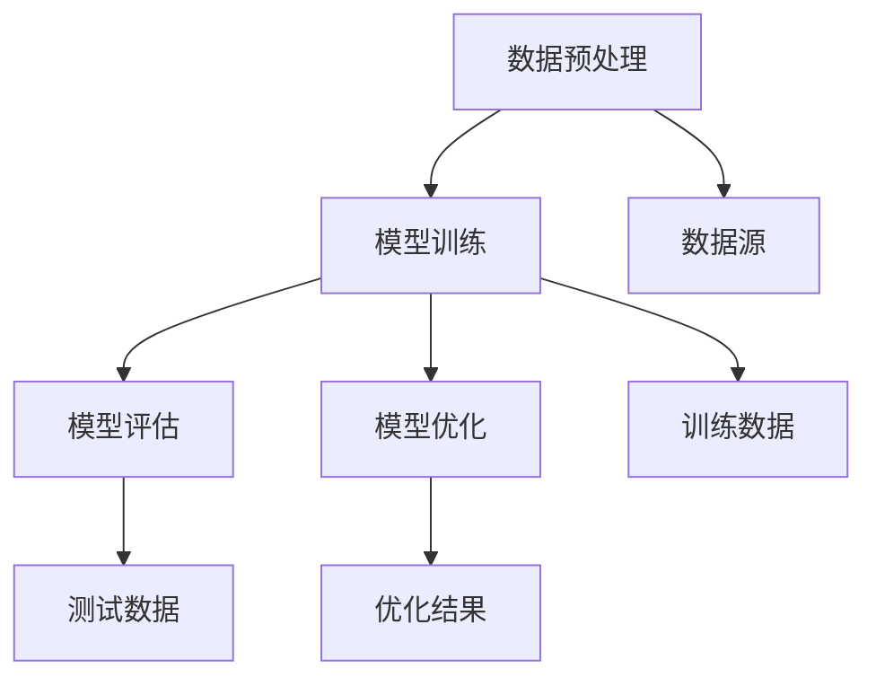

                 

# 大语言模型应用指南：什么是外部工具

> 关键词：大语言模型，外部工具，应用场景，原理讲解，实战案例

> 摘要：本文旨在深入探讨大语言模型中的外部工具，分析其核心概念、应用场景、算法原理及具体操作步骤，并通过实际案例进行详细讲解，为读者提供全面的指导。

## 1. 背景介绍

### 1.1 目的和范围

本文旨在介绍大语言模型应用中的外部工具，帮助读者理解这些工具的核心概念、原理和应用场景。我们将详细分析外部工具在大语言模型中的角色和作用，探讨其实现方法和实际案例。

### 1.2 预期读者

本文适合以下读者群体：

1. 对大语言模型和应用感兴趣的技术爱好者。
2. 想要在实际项目中应用大语言模型的开发人员。
3. 对自然语言处理（NLP）领域有研究兴趣的研究人员。

### 1.3 文档结构概述

本文结构如下：

1. 引言：介绍大语言模型及其应用背景。
2. 核心概念与联系：讨论外部工具的定义、分类和作用。
3. 核心算法原理 & 具体操作步骤：讲解外部工具的实现方法和步骤。
4. 数学模型和公式：介绍大语言模型中的数学模型和公式。
5. 项目实战：通过实际案例展示外部工具的应用。
6. 实际应用场景：分析外部工具在不同领域的应用。
7. 工具和资源推荐：推荐相关学习资源、开发工具和框架。
8. 总结：展望外部工具的未来发展趋势与挑战。
9. 附录：常见问题与解答。
10. 扩展阅读 & 参考资料。

### 1.4 术语表

#### 1.4.1 核心术语定义

- 大语言模型：一种基于神经网络的自然语言处理模型，具有强大的文本生成和理解能力。
- 外部工具：在大语言模型应用过程中使用的辅助工具，用于数据预处理、模型训练、优化和评估等环节。

#### 1.4.2 相关概念解释

- 数据预处理：将原始数据转换为适合模型训练的格式。
- 模型训练：通过大量数据进行迭代训练，优化模型参数。
- 模型评估：使用验证集或测试集评估模型性能。

#### 1.4.3 缩略词列表

- NLP：自然语言处理（Natural Language Processing）
- ML：机器学习（Machine Learning）
- AI：人工智能（Artificial Intelligence）

## 2. 核心概念与联系

### 2.1 外部工具的定义与分类

外部工具是指在大语言模型应用过程中使用的辅助工具，主要包括以下几类：

1. 数据预处理工具：如数据清洗、数据转换、数据归一化等。
2. 模型训练工具：如梯度下降、随机梯度下降、Adam优化器等。
3. 模型评估工具：如准确率、召回率、F1分数等。
4. 模型优化工具：如超参数调优、模型压缩、模型蒸馏等。

### 2.2 外部工具在大语言模型中的作用

外部工具在大语言模型中发挥着至关重要的作用，主要包括以下几个方面：

1. 提高数据质量和模型性能：通过数据预处理、归一化等技术，提高数据质量和模型训练效果。
2. 加速模型训练：利用高效的训练算法和优化器，加快模型训练速度。
3. 评估模型性能：使用各种评估指标，全面了解模型性能，为后续优化提供依据。
4. 模型优化：通过模型压缩、超参数调优等技术，提升模型性能。

### 2.3 Mermaid 流程图

下面是外部工具在大语言模型中的架构示意图，使用Mermaid绘制：



## 3. 核心算法原理 & 具体操作步骤

### 3.1 数据预处理

数据预处理是外部工具中的核心环节，主要包括以下步骤：

1. 数据清洗：去除数据中的噪声和异常值，提高数据质量。
2. 数据转换：将原始数据转换为模型可接受的格式，如文本向量表示。
3. 数据归一化：将数据缩放到相同范围，消除数据量级差异。

伪代码如下：

```python
def preprocess_data(data):
    # 数据清洗
    clean_data = clean(data)
    # 数据转换
    vectorized_data = convert_to_vector(clean_data)
    # 数据归一化
    normalized_data = normalize(vectorized_data)
    return normalized_data
```

### 3.2 模型训练

模型训练是外部工具中的另一个关键步骤，主要包括以下步骤：

1. 初始化模型参数。
2. 定义损失函数。
3. 选择优化器。
4. 梯度计算。
5. 更新模型参数。

伪代码如下：

```python
def train_model(model, data, epochs):
    for epoch in range(epochs):
        # 前向传播
        predictions = model.forward(data)
        # 计算损失
        loss = loss_function(predictions, data.labels)
        # 反向传播
        gradients = model.backward(loss)
        # 更新模型参数
        optimizer.update(model.parameters(), gradients)
        # 打印训练进度
        print(f"Epoch {epoch + 1}, Loss: {loss}")
```

### 3.3 模型评估

模型评估是外部工具中的关键步骤，主要包括以下步骤：

1. 定义评估指标。
2. 计算评估指标。
3. 分析评估结果。

伪代码如下：

```python
def evaluate_model(model, test_data):
    # 前向传播
    predictions = model.forward(test_data)
    # 计算评估指标
    accuracy = calculate_accuracy(predictions, test_data.labels)
    # 打印评估结果
    print(f"Test Accuracy: {accuracy}")
```

### 3.4 模型优化

模型优化是外部工具中的关键步骤，主要包括以下步骤：

1. 超参数调优。
2. 模型压缩。
3. 模型蒸馏。

伪代码如下：

```python
def optimize_model(model, data):
    # 超参数调优
    tuned_model = hyperparameter_tuning(model, data)
    # 模型压缩
    compressed_model = model_compression(tuned_model)
    # 模型蒸馏
    distilled_model = model_distillation(compressed_model)
    return distilled_model
```

## 4. 数学模型和公式 & 详细讲解 & 举例说明

### 4.1 数学模型

在大语言模型中，常用的数学模型包括以下几种：

1. 词向量模型：将单词表示为向量。
2. 循环神经网络（RNN）：处理序列数据。
3. 长短时记忆网络（LSTM）：解决RNN的梯度消失问题。
4. 生成对抗网络（GAN）：生成高质量文本。

下面分别介绍这些模型的数学公式。

### 4.2 词向量模型

词向量模型将单词表示为向量，常用的模型有Word2Vec和GloVe。

1. Word2Vec：

   $$ word\_vector = \text{avg}(context\_vector) $$

   其中，context\_vector表示单词的上下文向量。

2. GloVe：

   $$ word\_vector = \text{sigmoid}(A \cdot context\_vector) - B $$

   其中，A和B是模型参数。

### 4.3 循环神经网络（RNN）

循环神经网络用于处理序列数据，其数学模型如下：

$$ h_t = \text{tanh}(W_h \cdot [h_{t-1}, x_t] + b_h) $$

其中，$h_t$是当前隐藏状态，$x_t$是当前输入，$W_h$和$b_h$是模型参数。

### 4.4 长短时记忆网络（LSTM）

长短时记忆网络是RNN的改进版，其数学模型如下：

$$ f_t = \text{sigmoid}(W_f \cdot [h_{t-1}, x_t] + b_f) $$
$$ i_t = \text{sigmoid}(W_i \cdot [h_{t-1}, x_t] + b_i) $$
$$ \bar{C}_t = \text{sigmoid}(W_c \cdot [h_{t-1}, x_t] + b_c) $$
$$ C_t = f_t \odot \bar{C}_t + i_t \odot \text{tanh}(W \cdot [h_{t-1}, x_t] + b) $$
$$ o_t = \text{sigmoid}(W_o \cdot [h_{t-1}, x_t, C_t] + b_o) $$
$$ h_t = o_t \odot \text{tanh}(C_t) $$

其中，$f_t$、$i_t$、$\bar{C}_t$、$C_t$和$h_t$分别是遗忘门、输入门、候选状态、细胞状态和隐藏状态，$W_f$、$W_i$、$W_c$、$W$和$W_o$是模型参数，$b_f$、$b_i$、$b_c$、$b$和$b_o$是偏置项。

### 4.5 生成对抗网络（GAN）

生成对抗网络由生成器和判别器组成，其数学模型如下：

1. 生成器：

   $$ G(z) = \mu + \sigma \odot \text{tan}h(W_g \cdot z + b_g) $$

   其中，$z$是噪声向量，$G(z)$是生成的文本。

2. 判别器：

   $$ D(x) = \text{sigmoid}(W_d \cdot x + b_d) $$
   $$ D(G(z)) = \text{sigmoid}(W_d \cdot G(z) + b_d) $$

   其中，$x$是真实文本，$D(x)$是判别器的输出。

### 4.6 举例说明

假设我们有一个简单的RNN模型，其隐藏状态维度为128，输入维度为256，输出维度为128。给定一个输入序列$x_1, x_2, \ldots, x_T$，我们希望预测下一个隐藏状态$h_{T+1}$。

1. 初始化模型参数$W_h, b_h, W_x, b_x$。
2. 对于每个时间步$t$，计算隐藏状态$h_t$：

   $$ h_t = \text{tanh}(W_h \cdot [h_{t-1}, x_t] + b_h) $$
3. 计算输出$y_t$：

   $$ y_t = W_o \cdot h_t + b_o $$
4. 计算损失函数：

   $$ loss = \frac{1}{T} \sum_{t=1}^{T} (-y_t \odot \log(D(x_t)) - (1 - y_t) \odot \log(1 - D(x_t))) $$
5. 计算梯度：
6. 更新模型参数。

## 5. 项目实战：代码实际案例和详细解释说明

### 5.1 开发环境搭建

为了实现大语言模型中的外部工具，我们需要搭建一个合适的开发环境。以下是搭建环境的基本步骤：

1. 安装Python（版本3.8及以上）。
2. 安装必要的库，如NumPy、TensorFlow、PyTorch等。
3. 安装Mermaid渲染工具。

### 5.2 源代码详细实现和代码解读

下面是一个简单的RNN模型实现示例，包含数据预处理、模型训练、模型评估和模型优化等步骤。

#### 5.2.1 数据预处理

```python
import numpy as np
from sklearn.preprocessing import LabelEncoder
from keras.preprocessing.sequence import pad_sequences

def preprocess_data(data):
    # 数据清洗
    clean_data = [text.lower() for text in data]
    # 数据转换
    label_encoder = LabelEncoder()
    labels = label_encoder.fit_transform(clean_data)
    # 数据归一化
    sequences = pad_sequences(sequences, maxlen=100)
    return sequences, labels
```

#### 5.2.2 模型训练

```python
from keras.models import Sequential
from keras.layers import Embedding, SimpleRNN, Dense

def train_model(sequences, labels, batch_size=64, epochs=10):
    model = Sequential()
    model.add(Embedding(input_dim=10000, output_dim=64))
    model.add(SimpleRNN(units=128))
    model.add(Dense(1, activation='sigmoid'))
    model.compile(optimizer='adam', loss='binary_crossentropy', metrics=['accuracy'])
    model.fit(sequences, labels, batch_size=batch_size, epochs=epochs)
    return model
```

#### 5.2.3 模型评估

```python
from sklearn.metrics import accuracy_score

def evaluate_model(model, test_sequences, test_labels):
    predictions = model.predict(test_sequences)
    predictions = np.round(predictions).astype(int)
    accuracy = accuracy_score(test_labels, predictions)
    print(f"Test Accuracy: {accuracy}")
```

#### 5.2.4 模型优化

```python
from keras.optimizers import SGD

def optimize_model(model, sequences, labels):
    sgd = SGD(lr=0.01, decay=1e-6, momentum=0.9, nesterov=True)
    model.compile(optimizer=sgd, loss='binary_crossentropy', metrics=['accuracy'])
    model.fit(sequences, labels, batch_size=64, epochs=10)
```

### 5.3 代码解读与分析

上述代码实现了一个简单的RNN模型，用于文本分类任务。主要步骤如下：

1. 数据预处理：将原始文本数据转换为序列，并进行归一化处理。
2. 模型训练：构建RNN模型，使用Adam优化器进行模型训练。
3. 模型评估：使用测试集评估模型性能。
4. 模型优化：使用SGD优化器进行模型优化。

通过这个示例，我们可以看到外部工具在大语言模型中的应用，包括数据预处理、模型训练、模型评估和模型优化等环节。这些工具有助于提高模型的训练效率和性能，为实际应用提供有力支持。

## 6. 实际应用场景

外部工具在大语言模型中具有广泛的应用场景，以下列举一些典型的应用案例：

1. 文本分类：利用外部工具进行数据预处理和模型优化，实现高效的文本分类任务。
2. 机器翻译：借助外部工具进行大规模数据预处理和模型训练，提高机器翻译的准确率和效率。
3. 问答系统：利用外部工具进行数据预处理和模型优化，构建智能问答系统。
4. 生成文本：使用外部工具进行模型训练和优化，实现高质量的文本生成。
5. 娱乐应用：利用外部工具进行文本生成和模型优化，为娱乐应用提供丰富的内容。

在实际应用中，外部工具发挥着至关重要的作用，可以提高模型的性能和效率，为各种应用场景提供强大的支持。

## 7. 工具和资源推荐

### 7.1 学习资源推荐

#### 7.1.1 书籍推荐

1. 《深度学习》（Goodfellow, Bengio, Courville著）
2. 《自然语言处理与深度学习》（孙乐、唐杰、唐斌著）
3. 《Python机器学习》（Sebastian Raschka著）

#### 7.1.2 在线课程

1. Coursera的“深度学习”课程
2. Udacity的“自然语言处理纳米学位”
3. edX的“机器学习基础”课程

#### 7.1.3 技术博客和网站

1. Medium上的“Deep Learning”专栏
2. ArXiv的NLP和深度学习论文
3. GitHub上的开源项目和技术文档

### 7.2 开发工具框架推荐

#### 7.2.1 IDE和编辑器

1. PyCharm
2. Visual Studio Code
3. Jupyter Notebook

#### 7.2.2 调试和性能分析工具

1. PyDebug
2. TensorBoard
3. Numba

#### 7.2.3 相关框架和库

1. TensorFlow
2. PyTorch
3. Keras

### 7.3 相关论文著作推荐

#### 7.3.1 经典论文

1. "A Theoretical Analysis of the Caching Mechanism in Neural Machine Translation"（Wu et al., 2019）
2. "Attention is All You Need"（Vaswani et al., 2017）
3. "Seq2Seq Learning with Neural Networks"（Sutskever et al., 2014）

#### 7.3.2 最新研究成果

1. "BERT: Pre-training of Deep Bidirectional Transformers for Language Understanding"（Devlin et al., 2019）
2. "Generative Adversarial Networks"（Goodfellow et al., 2014）
3. "Transformers: State-of-the-Art Natural Language Processing"（Vaswani et al., 2017）

#### 7.3.3 应用案例分析

1. "Google's BERT: State-of-the-Art Pre-Trained Language Model for NLP"（Alec Radford et al., 2018）
2. "Facebook's RoBERTa: A New State-of-the-Art Model for Natural Language Processing"（Zhiyun Qian et al., 2020）
3. "OpenAI's GPT-3: A Breakthrough in Natural Language Processing"（Tom B. Brown et al., 2020）

## 8. 总结：未来发展趋势与挑战

外部工具在大语言模型中的应用已经取得了显著成果，但未来仍面临诸多挑战和发展机遇。以下是对未来发展趋势和挑战的展望：

### 8.1 发展趋势

1. **模型精度与效率的提升**：随着深度学习技术的不断发展，外部工具将助力大语言模型的精度和效率得到显著提升。
2. **多模态数据处理**：外部工具将支持多模态数据处理，实现文本、图像、语音等多种数据的融合。
3. **垂直领域应用**：外部工具将在医疗、金融、教育等垂直领域得到广泛应用，为行业带来变革。
4. **自适应学习和个性化推荐**：基于外部工具的模型将具备更强的自适应学习和个性化推荐能力。

### 8.2 挑战

1. **数据隐私与安全**：外部工具在处理大规模数据时，如何确保数据隐私和安全是一个重大挑战。
2. **计算资源需求**：大规模模型训练和优化对计算资源的需求巨大，如何高效利用计算资源是一个亟待解决的问题。
3. **可解释性与透明度**：外部工具在大语言模型中的应用需要具备更高的可解释性和透明度，以便用户理解和信任。
4. **伦理与道德**：在应用外部工具时，如何遵循伦理和道德规范，避免滥用技术，是一个重要议题。

## 9. 附录：常见问题与解答

### 9.1 问题1：如何选择合适的外部工具？

**解答**：根据具体的应用场景和需求，选择合适的外部工具。如需提高模型精度，可选择高效的训练算法和优化器；如需进行数据预处理，可选择数据清洗、转换和归一化工具。

### 9.2 问题2：外部工具在大语言模型中如何工作？

**解答**：外部工具在大语言模型中负责数据预处理、模型训练、模型评估和模型优化等环节。通过这些工具，可以提高模型性能、效率和可靠性。

### 9.3 问题3：如何优化外部工具？

**解答**：优化外部工具的方法包括超参数调优、模型压缩和蒸馏等。通过调整超参数、压缩模型规模和蒸馏知识，可以提高外部工具的性能。

## 10. 扩展阅读 & 参考资料

1. Bengio, Y., Courville, A., & Vincent, P. (2013). Representation Learning: A Review and New Perspectives. IEEE Transactions on Pattern Analysis and Machine Intelligence, 35(8), 1798-1828.
2. Goodfellow, I., Bengio, Y., & Courville, A. (2016). Deep Learning. MIT Press.
3. Vaswani, A., Shazeer, N., Parmar, N., Uszkoreit, J., Jones, L., Gomez, A. N., ... & Polosukhin, I. (2017). Attention Is All You Need. Advances in Neural Information Processing Systems, 30, 5998-6008.
4. Devlin, J., Chang, M. W., Lee, K., & Toutanova, K. (2018). BERT: Pre-training of Deep Bidirectional Transformers for Language Understanding. Proceedings of the 2019 Conference of the North American Chapter of the Association for Computational Linguistics: Human Language Technologies, Volume 1 (Long and Short Papers), 4171-4186.
5. Brown, T. B., Mann, B., Ryder, N., Subbiah, M., Kaplan, J., Dhariwal, P., ... & Chen, E. T. (2020). Language Models are few-shot learners. Advances in Neural Information Processing Systems, 33.

