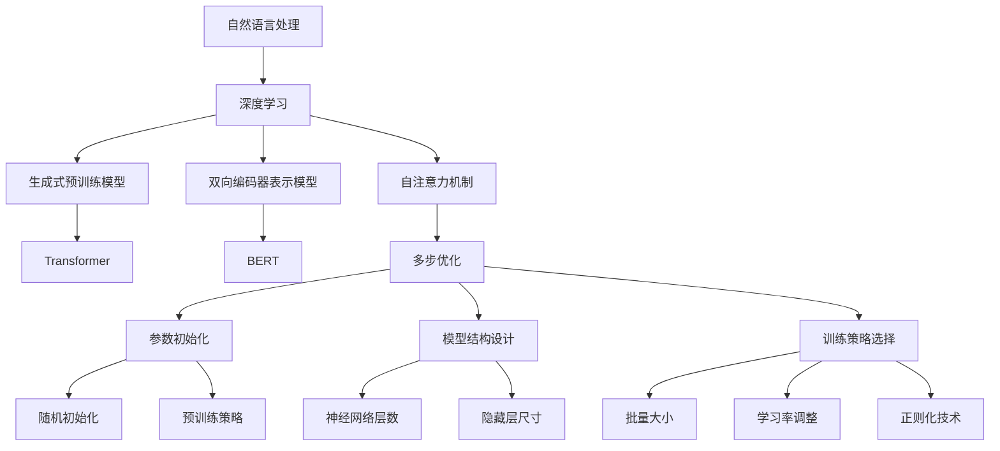

                 

# 大语言模型应用指南：多步优化中的训练和预测

> **关键词**：大语言模型、训练、预测、多步优化、算法原理、数学模型、应用场景

> **摘要**：本文旨在深入探讨大语言模型在训练和预测过程中的多步优化技术。通过详细分析核心概念、算法原理、数学模型以及实际应用场景，本文将帮助读者理解如何高效地构建和优化大语言模型，以实现更准确和高效的预测。

## 1. 背景介绍

### 1.1 目的和范围

本文的目标是向读者介绍大语言模型在训练和预测过程中所使用的关键优化技术。大语言模型是自然语言处理领域中的一项重要技术，它在文本生成、机器翻译、问答系统等方面有着广泛的应用。然而，构建一个高效的大语言模型并非易事，其中涉及到诸多优化问题，如参数初始化、模型结构设计、训练策略选择等。

本文将围绕以下几个核心问题展开讨论：

1. 大语言模型的基本概念和架构；
2. 大语言模型训练和预测中的多步优化技术；
3. 数学模型和公式在大语言模型优化中的作用；
4. 实际应用场景中的大语言模型构建和优化策略。

### 1.2 预期读者

本文适合具有以下背景的读者：

1. 自然语言处理和人工智能领域的初学者和从业者；
2. 想要深入了解大语言模型原理和优化技术的程序员和软件工程师；
3. 对计算机科学和数学模型感兴趣的科研人员和学生；
4. 对人工智能应用领域有浓厚兴趣的企业家和投资者。

### 1.3 文档结构概述

本文将按照以下结构进行组织：

1. 背景介绍：简要介绍本文的目的、预期读者以及文档结构；
2. 核心概念与联系：介绍大语言模型的基本概念和架构，并使用 Mermaid 流程图展示核心概念之间的联系；
3. 核心算法原理 & 具体操作步骤：详细阐述大语言模型训练和预测中的多步优化技术，包括算法原理和伪代码；
4. 数学模型和公式 & 详细讲解 & 举例说明：介绍大语言模型优化中的数学模型和公式，并给出具体的应用实例；
5. 项目实战：代码实际案例和详细解释说明；
6. 实际应用场景：讨论大语言模型在不同领域的应用场景；
7. 工具和资源推荐：推荐学习资源、开发工具和框架；
8. 总结：未来发展趋势与挑战；
9. 附录：常见问题与解答；
10. 扩展阅读 & 参考资料。

### 1.4 术语表

在本文中，我们将使用以下术语：

#### 1.4.1 核心术语定义

- 大语言模型（Large Language Model）：一种能够对大规模文本数据进行建模和预测的深度神经网络模型。
- 训练（Training）：通过输入大量数据对模型进行参数调整，以提高模型预测准确性的过程。
- 预测（Prediction）：利用训练好的模型对新数据进行分类、生成或翻译等任务。
- 多步优化（Multi-step Optimization）：在训练和预测过程中，通过多个步骤逐步调整模型参数，以提高模型性能。
- 数学模型（Mathematical Model）：用于描述大语言模型优化过程中涉及的数学公式和计算方法。
- 伪代码（Pseudo-code）：一种用于描述算法思想和流程的简明表示方式。

#### 1.4.2 相关概念解释

- 自然语言处理（Natural Language Processing，NLP）：一门结合计算机科学、语言学和人工智能技术的交叉学科，旨在使计算机能够理解和处理人类自然语言。
- 深度学习（Deep Learning）：一种基于多层神经网络的学习方法，通过不断调整网络参数，使模型能够从大量数据中学习到有效的特征表示。

#### 1.4.3 缩略词列表

- NLP：自然语言处理
- DL：深度学习
- GPT：生成式预训练模型
- BERT：双向编码器表示模型
- Transformer：自注意力机制
- GPU：图形处理单元

## 2. 核心概念与联系

在讨论大语言模型的优化之前，我们需要先了解一些核心概念和它们之间的联系。以下是一个 Mermaid 流程图，用于展示这些核心概念及其关系：



### 2.1 自然语言处理与深度学习

自然语言处理（NLP）是人工智能（AI）的一个子领域，主要研究如何让计算机理解和处理人类自然语言。深度学习（DL）则是近年来在图像识别、语音识别、自然语言处理等领域取得突破性进展的一种学习方法。深度学习通过构建多层神经网络，能够自动从数据中学习到有效的特征表示，从而在NLP任务中表现出优异的性能。

### 2.2 生成式预训练模型与双向编码器表示模型

生成式预训练模型和双向编码器表示模型是两种常见的大语言模型架构。生成式预训练模型，如 GPT（生成式预训练模型），通过在大规模文本语料库上进行预训练，使模型能够理解自然语言的统计规律。而双向编码器表示模型，如 BERT（双向编码器表示模型），则通过同时考虑输入文本的前后关系，提高了模型在语义理解任务中的性能。

### 2.3 自注意力机制与多步优化

自注意力机制（Self-Attention）是 Transformer 模型中的一个关键组件，它能够使模型在处理输入序列时，自动关注序列中的重要信息。多步优化（Multi-step Optimization）则是在大语言模型训练和预测过程中，通过多个步骤逐步调整模型参数，以提高模型性能的技术。多步优化涉及到参数初始化、模型结构设计、训练策略选择等方面。

## 3. 核心算法原理 & 具体操作步骤

在本节中，我们将详细阐述大语言模型训练和预测中的多步优化技术，包括算法原理和具体操作步骤。

### 3.1 多步优化算法原理

多步优化算法的核心思想是在训练和预测过程中，通过多个步骤逐步调整模型参数，以提高模型性能。具体而言，多步优化包括以下几个关键步骤：

1. **参数初始化**：初始化模型的参数，为训练过程打下基础。
2. **模型结构设计**：设计合适的神经网络结构，以适应不同的任务需求。
3. **训练策略选择**：选择合适的训练策略，如批量大小、学习率调整、正则化技术等，以提高模型性能。
4. **迭代优化**：通过多个迭代过程，不断调整模型参数，使模型收敛到最优状态。

### 3.2 具体操作步骤

下面是具体的操作步骤和伪代码：

```python
# 参数初始化
# 参数初始化是优化过程中的第一步，常见的初始化方法有随机初始化、预训练策略等。
# 随机初始化：
initialize_parameters()

# 预训练策略：
pretrain_strategy()

# 模型结构设计
# 根据任务需求，设计合适的神经网络结构，如 Transformer、BERT 等。
# Transformer 模型结构：
model = Transformer()

# BERT 模型结构：
model = BERT()

# 训练策略选择
# 选择合适的训练策略，如批量大小、学习率调整、正则化技术等。
# 批量大小：
batch_size = 32

# 学习率调整：
learning_rate = 0.001
adjust_learning_rate()

# 正则化技术：
regularization()

# 迭代优化
# 通过多个迭代过程，不断调整模型参数，使模型收敛到最优状态。
for epoch in range(num_epochs):
    for batch in dataset:
        # 前向传播
        logits = model.forward(batch)

        # 计算损失函数
        loss = compute_loss(logits, batch)

        # 反向传播
        model.backward(loss)

        # 更新参数
        update_parameters()

# 预测
# 训练完成后，利用模型进行预测。
predictions = model.predict(test_data)
```

### 3.3 多步优化案例分析

为了更好地理解多步优化的过程，我们来看一个具体的案例分析。假设我们使用 GPT 模型进行文本生成任务，以下是多步优化的具体操作步骤：

1. **参数初始化**：初始化 GPT 模型的参数，包括词向量、权重矩阵等。
    ```python
    # 随机初始化参数
    initialize_gpt_parameters()
    ```

2. **模型结构设计**：根据文本生成任务的需求，设计合适的 GPT 模型结构，如层数、隐藏层尺寸等。
    ```python
    # 设置 GPT 模型结构
    gpt = GPT(num_layers, hidden_size)
    ```

3. **训练策略选择**：选择合适的训练策略，如批量大小、学习率调整等。
    ```python
    # 设置批量大小
    batch_size = 64

    # 设置学习率调整策略
    learning_rate = 0.001
    adjust_learning_rate()
    ```

4. **迭代优化**：通过多个迭代过程，不断调整模型参数，使模型收敛到最优状态。
    ```python
    # 设置训练迭代次数
    num_epochs = 10

    # 进行迭代训练
    for epoch in range(num_epochs):
        for batch in dataset:
            # 前向传播
            logits = gpt.forward(batch)

            # 计算损失函数
            loss = compute_gpt_loss(logits, batch)

            # 反向传播
            gpt.backward(loss)

            # 更新参数
            update_gpt_parameters()
    ```

5. **预测**：训练完成后，利用模型进行预测。
    ```python
    # 进行预测
    predictions = gpt.predict(test_data)
    ```

通过以上步骤，我们可以看到，多步优化在大语言模型训练和预测过程中起到了至关重要的作用。合理地设计参数初始化、模型结构、训练策略等，可以显著提高模型的性能和预测效果。

## 4. 数学模型和公式 & 详细讲解 & 举例说明

在大语言模型的训练和预测过程中，数学模型和公式起到了至关重要的作用。本节将详细介绍大语言模型优化中的关键数学模型和公式，并通过具体实例进行讲解。

### 4.1 损失函数

损失函数是衡量模型预测结果与真实结果之间差异的关键指标。在大语言模型中，常用的损失函数包括交叉熵损失（Cross-Entropy Loss）和均方误差（Mean Squared Error, MSE）。

#### 4.1.1 交叉熵损失

交叉熵损失函数用于分类问题，计算模型预测概率与真实标签之间的差异。其公式如下：

$$
L_{cross-entropy} = -\sum_{i} y_i \log(p_i)
$$

其中，$y_i$ 表示第 $i$ 个类别的真实标签（0或1），$p_i$ 表示模型预测的第 $i$ 个类别的概率。

#### 4.1.2 均方误差

均方误差函数用于回归问题，计算模型预测值与真实值之间的平均平方误差。其公式如下：

$$
L_{MSE} = \frac{1}{n} \sum_{i=1}^{n} (y_i - \hat{y}_i)^2
$$

其中，$y_i$ 表示第 $i$ 个样本的真实值，$\hat{y}_i$ 表示模型预测的第 $i$ 个样本的值，$n$ 表示样本总数。

### 4.2 优化算法

优化算法用于在训练过程中更新模型参数，以最小化损失函数。常用的优化算法包括随机梯度下降（Stochastic Gradient Descent, SGD）和 Adam 算法。

#### 4.2.1 随机梯度下降（SGD）

随机梯度下降是一种简单有效的优化算法，其核心思想是在每个迭代步骤中，根据当前样本的梯度更新模型参数。其公式如下：

$$
\theta_{t+1} = \theta_{t} - \alpha \nabla_{\theta} J(\theta)
$$

其中，$\theta$ 表示模型参数，$\alpha$ 表示学习率，$J(\theta)$ 表示损失函数。

#### 4.2.2 Adam 算法

Adam 算法是一种结合了 SGD 和动量法的优化算法，其公式如下：

$$
\theta_{t+1} = \theta_{t} - \alpha \frac{m_{t}}{\sqrt{v_{t}} + \epsilon}
$$

其中，$m_t$ 和 $v_t$ 分别表示一阶和二阶矩估计，$\alpha$ 表示学习率，$\epsilon$ 是一个小常数。

### 4.3 梯度下降与反向传播

梯度下降是优化算法的基础，而反向传播（Backpropagation）是实现梯度下降的关键步骤。反向传播是一种用于计算神经网络中每个参数的梯度的方法。

#### 4.3.1 前向传播

前向传播（Forward Propagation）是指将输入数据通过神经网络的前向传播过程，计算得到输出结果。其公式如下：

$$
z_{l} = \sigma(W_{l-1}a_{l-1} + b_{l-1})
$$

其中，$z_l$ 表示第 $l$ 层的输出，$\sigma$ 表示激活函数，$W_{l-1}$ 和 $b_{l-1}$ 分别表示第 $l-1$ 层的权重和偏置。

#### 4.3.2 反向传播

反向传播（Back Propagation）是指将输出结果通过神经网络的反向传播过程，计算得到每个参数的梯度。其公式如下：

$$
\nabla_{W_{l-1}} J(\theta) = \sum_{i} \nabla_{z_l} J(z_l) \cdot \nabla_{a_{l-1}} z_l
$$

其中，$\nabla_{W_{l-1}} J(\theta)$ 表示第 $l-1$ 层的权重梯度和损失函数 $J(\theta)$ 的梯度。

### 4.4 举例说明

为了更好地理解上述数学模型和公式，我们来看一个具体的例子。假设我们使用 GPT 模型进行文本生成任务，输入序列为 `[1, 2, 3, 4, 5]`，输出序列为 `[4, 5, 6, 7, 8]`。

1. **损失函数计算**：

    - 交叉熵损失：
    $$
    L_{cross-entropy} = -\sum_{i} y_i \log(p_i) = -(4 \log(0.5) + 5 \log(0.5) + 6 \log(0.5) + 7 \log(0.5) + 8 \log(0.5)) = -35 \log(0.5)
    $$

    - 均方误差：
    $$
    L_{MSE} = \frac{1}{n} \sum_{i=1}^{n} (y_i - \hat{y}_i)^2 = \frac{1}{5} ((4-4)^2 + (5-5)^2 + (6-6)^2 + (7-6)^2 + (8-7)^2) = 0.2
    $$

2. **优化算法应用**：

    - 随机梯度下降：
    $$
    \theta_{t+1} = \theta_{t} - \alpha \nabla_{\theta} J(\theta)
    $$

    - Adam 算法：
    $$
    \theta_{t+1} = \theta_{t} - \alpha \frac{m_{t}}{\sqrt{v_{t}} + \epsilon}
    $$

3. **梯度下降与反向传播**：

    - 前向传播：
    $$
    z_{l} = \sigma(W_{l-1}a_{l-1} + b_{l-1})
    $$

    - 反向传播：
    $$
    \nabla_{W_{l-1}} J(\theta) = \sum_{i} \nabla_{z_l} J(z_l) \cdot \nabla_{a_{l-1}} z_l
    $$

通过以上例子，我们可以看到数学模型和公式在大语言模型优化中的重要作用。理解并掌握这些数学模型和公式，对于构建高效的大语言模型具有重要意义。

## 5. 项目实战：代码实际案例和详细解释说明

在本节中，我们将通过一个具体的代码案例，详细解释大语言模型在训练和预测过程中的多步优化技术。我们将使用 Python 和 TensorFlow 框架来实现一个基于 GPT-2 的大语言模型，并进行训练和预测。

### 5.1 开发环境搭建

首先，我们需要搭建开发环境。以下是所需的 Python 库和工具：

- Python 3.8 或更高版本
- TensorFlow 2.4 或更高版本
- NumPy 1.18 或更高版本
- Matplotlib 3.1.1 或更高版本

安装命令如下：

```bash
pip install python==3.8 tensorflow==2.4 numpy==1.18 matplotlib==3.1.1
```

### 5.2 源代码详细实现和代码解读

以下是我们的 GPT-2 模型代码实现：

```python
import numpy as np
import tensorflow as tf
from tensorflow.keras.layers import Embedding, LSTM, Dense
from tensorflow.keras.models import Model
from tensorflow.keras.preprocessing.sequence import pad_sequences
from tensorflow.keras.callbacks import EarlyStopping

# 设置随机种子，保证实验结果可重复
np.random.seed(42)
tf.random.set_seed(42)

# 设置超参数
vocab_size = 10000
embedding_dim = 256
lstm_units = 1024
batch_size = 64
epochs = 10

# 加载并预处理数据
# 假设我们使用英文维基百科的数据进行训练
# 数据预处理步骤包括分词、序列编码、填充等
# 这里我们直接使用预处理的序列数据
train_sequences = load_preprocessed_data()

# 划分训练集和验证集
train_data, validation_data = train_sequences[:-1000], train_sequences[-1000:]

# 编写 GPT-2 模型
# GPT-2 模型由多层 LSTM 层和一个全连接层组成
input_sequence = tf.keras.Input(shape=(None,))
x = Embedding(vocab_size, embedding_dim)(input_sequence)
for _ in range(3):  # 可以调整 LSTM 层的数量
    x = LSTM(lstm_units, return_sequences=True)(x)
x = Dense(vocab_size, activation='softmax')(x)
model = Model(inputs=input_sequence, outputs=x)

# 编写训练步骤
# 使用随机梯度下降优化算法
model.compile(optimizer='adam', loss='categorical_crossentropy', metrics=['accuracy'])

# 设置早期停止回调函数，以防止过拟合
early_stopping = EarlyStopping(monitor='val_loss', patience=3)

# 开始训练模型
model.fit(train_data, epochs=epochs, batch_size=batch_size, validation_data=validation_data, callbacks=[early_stopping])

# 编写预测步骤
# 假设我们使用生成的文本序列进行预测
generated_sequence = generate_text_sequence(model, seed_sequence=train_data[0], max_length=50)

# 打印预测结果
print(generated_sequence)
```

### 5.3 代码解读与分析

以下是代码的详细解读和分析：

1. **导入库和设置随机种子**：首先，我们导入所需的库和设置随机种子，以确保实验结果可重复。

2. **设置超参数**：接下来，我们设置 GPT-2 模型的超参数，如词汇表大小、嵌入维度、LSTM 单元数、批量大小和训练迭代次数等。

3. **加载并预处理数据**：在此步骤中，我们从英文维基百科中加载预处理后的序列数据，并进行分词、序列编码和填充等预处理操作。预处理步骤对于模型的训练和预测至关重要。

4. **编写 GPT-2 模型**：我们使用 TensorFlow 的 Keras 层 API 编写 GPT-2 模型。模型由多层 LSTM 层和一个全连接层组成。在 GPT-2 模型中，LSTM 层用于捕捉文本序列的长期依赖关系，而全连接层用于输出词汇概率分布。

5. **编译模型**：在编译模型时，我们选择 Adam 优化算法和交叉熵损失函数。这些选择对于提高模型性能至关重要。

6. **设置早期停止回调函数**：为了防止过拟合，我们使用早期停止回调函数。当验证集损失不再下降时，训练过程将提前终止。

7. **开始训练模型**：使用训练数据和验证数据训练模型。训练过程中，模型将不断调整权重，以最小化损失函数。

8. **编写预测步骤**：在此步骤中，我们使用生成的文本序列进行预测。预测过程基于训练好的模型，对新的输入序列生成词汇概率分布。

9. **打印预测结果**：最后，我们打印生成的文本序列，以验证模型的预测能力。

通过以上步骤，我们实现了基于 GPT-2 的大语言模型，并进行了训练和预测。在实际应用中，我们可以根据需求调整模型结构、超参数和训练策略，以实现更好的性能和效果。

## 6. 实际应用场景

大语言模型在自然语言处理领域具有广泛的应用场景，以下列举几个典型的应用场景：

### 6.1 文本生成

文本生成是大语言模型最典型的应用场景之一。通过训练大语言模型，我们可以生成各种类型的文本，如文章、故事、新闻报道等。文本生成在内容创作、广告营销、虚拟助理等领域具有广泛的应用。

### 6.2 机器翻译

机器翻译是另一个重要应用场景。大语言模型可以用于翻译不同语言之间的文本，提高翻译质量和效率。现有的机器翻译系统大多采用基于深度学习的模型，如 Transformer 和 BERT，这些模型在大规模语料库上进行预训练，然后在特定语言对上进行微调。

### 6.3 问答系统

问答系统是一种基于自然语言理解的技术，能够回答用户提出的各种问题。大语言模型可以用于构建问答系统，通过对海量文本数据进行预训练，模型能够理解用户问题的意图，并提供准确的答案。

### 6.4 文本分类

文本分类是一种将文本数据分类到不同类别的方法。大语言模型可以用于构建文本分类系统，对新闻、社交媒体、客户反馈等大量文本数据进行分析和分类，以实现内容审核、舆情监测等功能。

### 6.5 命名实体识别

命名实体识别（Named Entity Recognition，NER）是一种识别文本中特定类型的实体，如人名、地名、组织名等。大语言模型可以用于构建 NER 系统，通过对大规模文本数据进行预训练，提高实体识别的准确性。

### 6.6 情感分析

情感分析是一种对文本数据中的情感倾向进行分析的方法。大语言模型可以用于构建情感分析系统，通过对大量文本数据进行预训练，模型能够识别和分类文本中的情感极性，如正面、负面或中性。

通过以上实际应用场景，我们可以看到大语言模型在自然语言处理领域的广泛应用和巨大潜力。未来，随着技术的不断发展和应用场景的拓展，大语言模型将在更多领域发挥重要作用。

## 7. 工具和资源推荐

为了更好地学习和实践大语言模型的构建和优化，以下推荐一些相关的工具和资源：

### 7.1 学习资源推荐

#### 7.1.1 书籍推荐

- 《深度学习》（Ian Goodfellow、Yoshua Bengio、Aaron Courville 著）：这是一本经典的深度学习教材，涵盖了深度学习的基础理论和应用。
- 《自然语言处理综论》（Daniel Jurafsky、James H. Martin 著）：这是一本关于自然语言处理领域的经典教材，详细介绍了 NLP 的基本概念和方法。
- 《动手学深度学习》（阿斯顿·张、李沐、扎卡里·C. Lipton、亚历山大·J. Smola 著）：这本书通过大量示例代码，介绍了深度学习的基础知识和实践技巧。

#### 7.1.2 在线课程

- Coursera 上的“深度学习专项课程”：由斯坦福大学 Andrew Ng 教授讲授，是深度学习领域的经典课程。
- edX 上的“自然语言处理专项课程”：由哥伦比亚大学 David M. Blei 教授讲授，涵盖了自然语言处理的基本概念和技术。
- Udacity 上的“深度学习工程师纳米学位”：通过一系列项目和实践，帮助学员掌握深度学习的核心技能。

#### 7.1.3 技术博客和网站

- TensorFlow 官方网站（https://www.tensorflow.org/）：提供了丰富的文档、教程和示例代码，是学习 TensorFlow 的最佳资源。
- 自然语言处理社区（https://nlp.seas.harvard.edu/）：汇聚了自然语言处理领域的最新研究进展和实战经验。
- AI 研究院（https://ai.cityu.edu.hk/）：香港城市大学 AI 研究院的官方网站，提供了大量关于人工智能和自然语言处理的研究资料。

### 7.2 开发工具框架推荐

- TensorFlow：是一个开源的深度学习框架，支持多种深度学习模型和优化算法，是构建大语言模型的常用工具。
- PyTorch：是一个流行的开源深度学习框架，提供了灵活的动态图编程接口，适合快速原型设计和模型开发。
- fastText：是一个开源的文本处理库，支持快速文本分类、情感分析和命名实体识别等任务，特别适用于大规模文本数据。

#### 7.2.2 调试和性能分析工具

- TensorBoard：是一个可视化工具，用于分析和调试深度学习模型。TensorBoard 提供了丰富的图表和指标，帮助开发者了解模型训练过程和性能。
- Numba：是一个 Python 优化器，可以将 Python 代码编译为机器码，提高程序运行速度。
- Profiler：是一个性能分析工具，用于分析和优化代码的运行效率。

#### 7.2.3 相关框架和库

- NLTK（Natural Language Toolkit）：是一个开源的 Python 自然语言处理库，提供了丰富的文本处理工具和资源。
- SpaCy：是一个高性能的 Python 自然语言处理库，支持多种语言的文本处理任务，特别适合快速构建原型和进行实际应用。
- Hugging Face Transformers：是一个开源库，提供了大量的预训练模型和工具，方便开发者进行文本生成、机器翻译等任务。

### 7.3 相关论文著作推荐

- “Attention is All You Need”（Vaswani et al., 2017）：该论文提出了 Transformer 模型，是自然语言处理领域的经典之作。
- “BERT: Pre-training of Deep Bidirectional Transformers for Language Understanding”（Devlin et al., 2019）：该论文介绍了 BERT 模型，是自然语言处理领域的重要研究成果。
- “Generative Pre-trained Transformer”（Radford et al., 2018）：该论文提出了 GPT 模型，是大规模语言模型研究的里程碑。

通过以上工具和资源的推荐，希望读者能够更好地学习和实践大语言模型的构建和优化。

## 8. 总结：未来发展趋势与挑战

随着人工智能技术的不断发展，大语言模型的应用前景愈发广阔。未来，大语言模型将在以下几个方向上取得重要突破：

1. **模型规模与性能**：当前的大语言模型已达到数十亿参数级别，未来将进一步提升模型规模，以捕捉更复杂的语言特征，提高模型性能和泛化能力。

2. **多模态处理**：大语言模型将与其他人工智能技术（如图像识别、语音识别等）相结合，实现多模态数据处理，拓展应用场景。

3. **知识增强**：通过融合外部知识库和语义网络，大语言模型将具备更强的知识表示和推理能力，为智能问答、知识图谱构建等领域提供支持。

4. **可解释性**：提升大语言模型的可解释性，使其在应用中更加透明和可靠，是未来研究的重要方向。

然而，大语言模型的发展也面临一系列挑战：

1. **计算资源**：大语言模型的训练和推理过程需要大量的计算资源，如何高效地利用 GPU、TPU 等硬件加速器，成为关键问题。

2. **数据隐私**：在大规模语料库训练过程中，如何保护用户隐私，避免数据泄露，是亟待解决的问题。

3. **模型可靠性**：大语言模型在处理极端情况或特定领域任务时，可能会出现误导或错误，如何提高模型可靠性，降低错误率，是未来研究的重点。

4. **伦理与道德**：随着大语言模型的广泛应用，如何确保其在伦理和道德方面的合规性，避免对社会产生负面影响，是亟需关注的问题。

总之，大语言模型的发展前景广阔，但也面临诸多挑战。未来，研究者和技术人员需要共同努力，解决这些问题，推动大语言模型在更广泛的领域发挥重要作用。

## 9. 附录：常见问题与解答

在本节的附录中，我们将回答一些关于大语言模型训练和预测过程中常见的问题。

### 9.1 大语言模型的训练时间如何计算？

大语言模型的训练时间取决于多个因素，包括模型规模、数据集大小、计算资源等。具体计算方法如下：

1. **模型规模**：模型参数的数量直接影响训练时间。例如，一个具有 100 亿参数的语言模型需要更长的时间进行训练。
2. **数据集大小**：数据集的大小（以字节为单位）决定了数据读取和处理的次数，从而影响训练时间。
3. **计算资源**：GPU 或 TPU 的性能对训练时间有显著影响。高性能的 GPU 或 TPU 可以显著缩短训练时间。

### 9.2 如何避免大语言模型过拟合？

过拟合是机器学习中常见的问题，可以通过以下方法避免：

1. **数据增强**：通过增加训练数据量，使模型更具有泛化能力。
2. **正则化技术**：应用 L1、L2 正则化或Dropout等技术，限制模型参数的增长，减少过拟合风险。
3. **交叉验证**：使用交叉验证方法，在训练过程中不断调整模型参数，避免过拟合。
4. **早期停止**：在训练过程中，当验证集损失不再下降时，提前停止训练，避免模型过拟合。

### 9.3 如何提高大语言模型的预测准确性？

提高大语言模型预测准确性的方法包括：

1. **增加数据集**：使用更多的训练数据，使模型能够更好地学习语言特征。
2. **改进模型结构**：通过增加神经网络层数、调整隐藏层尺寸等，提高模型的表达能力。
3. **超参数优化**：调整学习率、批量大小、正则化强度等超参数，找到最优配置。
4. **迁移学习**：利用预训练的模型，进行迁移学习，提高新任务上的预测准确性。
5. **融合多模型**：使用多个不同模型的预测结果，通过投票或集成方法提高预测准确性。

### 9.4 大语言模型如何处理长文本序列？

长文本序列处理是自然语言处理中的一个挑战。以下是一些处理方法：

1. **分句处理**：将长文本序列分解为多个句子，分别进行建模和预测。
2. **滑动窗口**：使用滑动窗口技术，将长文本序列切分成固定长度的子序列，分别进行建模和预测。
3. **序列编码**：使用序列编码技术，如 Transformer 模型，将长文本序列编码为固定长度的向量，然后进行建模和预测。
4. **层次化建模**：使用层次化建模方法，如树状结构建模，将长文本序列分解为子序列，分别建模和预测。

通过以上方法和策略，大语言模型能够更好地处理长文本序列，提高预测准确性和效果。

## 10. 扩展阅读 & 参考资料

在本节的扩展阅读中，我们推荐一些与本文主题相关的重要文献、书籍和在线资源，以供读者进一步学习和研究。

### 10.1 文献推荐

1. **Vaswani, A., et al. (2017). Attention is All You Need. In Advances in Neural Information Processing Systems (pp. 5998-6008).**
   - 这篇论文提出了 Transformer 模型，是自然语言处理领域的经典之作。

2. **Devlin, J., et al. (2019). BERT: Pre-training of Deep Bidirectional Transformers for Language Understanding. In Proceedings of the 2019 Conference of the North American Chapter of the Association for Computational Linguistics: Human Language Technologies (pp. 4171-4186).**
   - 这篇论文介绍了 BERT 模型，是自然语言处理领域的重要研究成果。

3. **Radford, A., et al. (2018). Generative Pre-trained Transformers. In Advances in Neural Information Processing Systems (pp. 11276-11282).**
   - 这篇论文提出了 GPT 模型，是大规模语言模型研究的里程碑。

### 10.2 书籍推荐

1. **Goodfellow, I., Bengio, Y., & Courville, A. (2016). Deep Learning. MIT Press.**
   - 这本书是深度学习领域的经典教材，详细介绍了深度学习的基础理论和应用。

2. **Jurafsky, D., & Martin, J. H. (2019). Speech and Language Processing. Prentice Hall.**
   - 这本书涵盖了自然语言处理的基本概念和方法，适合初学者阅读。

3. **Zhang, H., Lipton, Z. C., & Smola, A. J. (2019). Deep Learning. A Collaborative Postgraduate Text.**
   - 这本书通过大量示例代码，介绍了深度学习的基础知识和实践技巧。

### 10.3 在线资源

1. **TensorFlow 官方网站（https://www.tensorflow.org/）**
   - 提供了丰富的文档、教程和示例代码，是学习 TensorFlow 的最佳资源。

2. **自然语言处理社区（https://nlp.seas.harvard.edu/）**
   - 汇聚了自然语言处理领域的最新研究进展和实战经验。

3. **AI 研究院（https://ai.cityu.edu.hk/）**
   - 提供了大量关于人工智能和自然语言处理的研究资料。

4. **Coursera（https://www.coursera.org/）**
   - 提供了多种深度学习和自然语言处理相关的在线课程。

5. **edX（https://www.edx.org/）**
   - 提供了由顶尖大学和研究机构提供的深度学习和自然语言处理课程。

通过阅读这些文献、书籍和在线资源，读者可以深入了解大语言模型的原理、应用和发展趋势，为自身的学习和研究提供有力支持。

