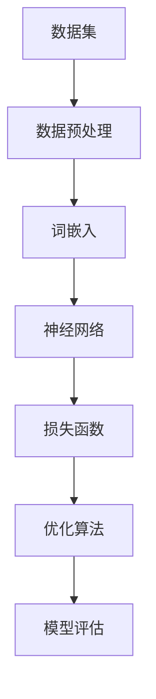

                 

# 大语言模型应用指南：大语言模型的训练过程

> 关键词：大语言模型，训练过程，机器学习，神经网络，深度学习，数据预处理，优化算法

> 摘要：本文旨在详细探讨大语言模型的训练过程，从背景介绍到核心算法原理，再到数学模型和项目实战，全面解析大语言模型的训练机制。通过本文的阅读，读者将深入了解大语言模型的工作原理、训练过程以及在实际应用中的挑战和解决方案。

## 1. 背景介绍

### 1.1 目的和范围

本文的目的在于为读者提供一个全面的大语言模型训练过程的指南，帮助理解大语言模型的训练原理和实现方法。本文将涵盖以下几个主要方面：

- 大语言模型的定义和背景
- 大语言模型的核心概念与联系
- 大语言模型的核心算法原理与具体操作步骤
- 大语言模型的数学模型和公式
- 大语言模型的实际应用场景
- 大语言模型的工具和资源推荐

### 1.2 预期读者

本文适合以下读者：

- 对人工智能和机器学习有一定了解的技术人员
- 想要深入了解大语言模型的开发者和研究者
- 对深度学习和神经网络有兴趣的学习者

### 1.3 文档结构概述

本文的结构如下：

1. 背景介绍
2. 核心概念与联系
3. 核心算法原理 & 具体操作步骤
4. 数学模型和公式 & 详细讲解 & 举例说明
5. 项目实战：代码实际案例和详细解释说明
6. 实际应用场景
7. 工具和资源推荐
8. 总结：未来发展趋势与挑战
9. 附录：常见问题与解答
10. 扩展阅读 & 参考资料

### 1.4 术语表

#### 1.4.1 核心术语定义

- 大语言模型：一种能够理解和生成自然语言的深度学习模型。
- 机器学习：一种让计算机通过数据和经验学习的能力。
- 神经网络：一种模拟人脑神经元结构的计算模型。
- 深度学习：一种利用多层神经网络进行训练和预测的人工智能方法。
- 数据预处理：在训练模型之前对数据进行清洗、归一化等处理。
- 优化算法：用于调整模型参数以最小化损失函数的方法。

#### 1.4.2 相关概念解释

- 损失函数：用于评估模型预测与实际标签之间差异的函数。
- 反向传播：一种用于训练神经网络的方法，通过计算梯度来更新模型参数。
- 梯度下降：一种优化算法，通过逐步减小损失函数来优化模型参数。

#### 1.4.3 缩略词列表

- AI：人工智能
- ML：机器学习
- DL：深度学习
- NLP：自然语言处理
- GPU：图形处理单元
- CPU：中央处理单元

## 2. 核心概念与联系

在深入探讨大语言模型的训练过程之前，首先需要了解几个核心概念及其相互之间的联系。以下是一个简化的Mermaid流程图，用于展示这些概念之间的关系：



### 2.1 数据集

数据集是训练大语言模型的基础。数据集的质量直接影响模型的性能。数据集通常包含大量的文本数据，如新闻文章、对话记录、社交媒体帖子等。

### 2.2 数据预处理

数据预处理是数据集处理的重要步骤，包括文本清洗、分词、去除停用词等。这些步骤有助于提高数据质量，减少噪声，从而改善模型性能。

### 2.3 词嵌入

词嵌入是将文本数据转换为数值表示的过程。常见的词嵌入方法包括Word2Vec、GloVe等。词嵌入有助于将高维稀疏文本数据转换为低维稠密向量，便于神经网络处理。

### 2.4 神经网络

神经网络是深度学习的基础。大语言模型通常采用多层神经网络结构，如Transformer等。神经网络通过学习输入和输出之间的映射关系，从而实现文本理解和生成。

### 2.5 损失函数

损失函数用于衡量模型预测与实际标签之间的差异。常见的损失函数包括交叉熵损失、均方误差等。损失函数的优化是训练神经网络的核心目标。

### 2.6 优化算法

优化算法用于调整模型参数以最小化损失函数。常见的优化算法包括随机梯度下降（SGD）、Adam等。优化算法的效率直接影响训练过程的收敛速度。

### 2.7 模型评估

模型评估是衡量模型性能的重要步骤。常见的评估指标包括准确率、召回率、F1分数等。通过模型评估，可以判断模型是否满足预期要求，并进行相应的调整。

## 3. 核心算法原理 & 具体操作步骤

### 3.1 数据预处理

在训练大语言模型之前，需要对数据进行预处理。以下是一个简单的数据预处理流程：

```python
import pandas as pd
from sklearn.model_selection import train_test_split
from sklearn.preprocessing import StandardScaler

# 加载数据集
data = pd.read_csv('dataset.csv')

# 数据清洗
data.dropna(inplace=True)
data = data[data['label'] != 'unknown']

# 分词和去停用词
def preprocess_text(text):
    # 分词
    tokens = nltk.word_tokenize(text)
    # 去停用词
    tokens = [token for token in tokens if token not in stopwords.words('english')]
    return tokens

data['text'] = data['text'].apply(preprocess_text)

# 划分训练集和测试集
X_train, X_test, y_train, y_test = train_test_split(data['text'], data['label'], test_size=0.2, random_state=42)

# 数据归一化
scaler = StandardScaler()
X_train = scaler.fit_transform(X_train)
X_test = scaler.transform(X_test)
```

### 3.2 词嵌入

词嵌入是将文本数据转换为数值表示的过程。以下是一个简单的Word2Vec词嵌入实现：

```python
from gensim.models import Word2Vec

# 训练Word2Vec模型
model = Word2Vec(X_train, vector_size=100, window=5, min_count=1, workers=4)

# 保存词向量
model.save('word2vec.model')

# 加载词向量
model = Word2Vec.load('word2vec.model')
```

### 3.3 神经网络

神经网络是深度学习的基础。以下是一个简单的多层感知机（MLP）实现：

```python
import tensorflow as tf
from tensorflow.keras.models import Sequential
from tensorflow.keras.layers import Dense, Activation

# 构建神经网络模型
model = Sequential([
    Dense(128, input_shape=(100,), activation='relu'),
    Dense(64, activation='relu'),
    Dense(1, activation='sigmoid')
])

# 编译模型
model.compile(optimizer='adam', loss='binary_crossentropy', metrics=['accuracy'])

# 训练模型
model.fit(X_train, y_train, epochs=10, batch_size=32, validation_split=0.1)
```

### 3.4 损失函数与优化算法

损失函数用于衡量模型预测与实际标签之间的差异。优化算法用于调整模型参数以最小化损失函数。以下是一个简单的反向传播和梯度下降实现：

```python
import numpy as np

# 假设模型参数为w
w = np.random.rand(1)

# 假设损失函数为L(w) = (w - y)^2
def loss_function(w, y):
    return (w - y)**2

# 计算梯度
def gradient(w, y):
    return 2 * (w - y)

# 梯度下降
learning_rate = 0.01
for epoch in range(100):
    y = w
    w -= learning_rate * gradient(w, y)
    print(f'Epoch {epoch}: w = {w}, loss = {loss_function(w, y)}')
```

## 4. 数学模型和公式 & 详细讲解 & 举例说明

### 4.1 损失函数

损失函数是评估模型性能的关键指标。以下是一个常见的损失函数——交叉熵损失函数：

$$
L = -\sum_{i=1}^{n} y_i \log(p_i)
$$

其中，$y_i$ 是真实标签，$p_i$ 是模型预测的概率。

### 4.2 反向传播

反向传播是一种用于训练神经网络的方法，通过计算梯度来更新模型参数。以下是一个简化的反向传播公式：

$$
\Delta w = -\alpha \cdot \frac{\partial L}{\partial w}
$$

其中，$\Delta w$ 是模型参数的更新量，$\alpha$ 是学习率，$\frac{\partial L}{\partial w}$ 是损失函数关于模型参数的梯度。

### 4.3 梯度下降

梯度下降是一种优化算法，通过逐步减小损失函数来优化模型参数。以下是一个简化的梯度下降公式：

$$
w_{t+1} = w_t - \alpha \cdot \frac{\partial L}{\partial w_t}
$$

其中，$w_t$ 是当前模型参数，$w_{t+1}$ 是更新后的模型参数。

### 4.4 举例说明

假设我们有一个二分类问题，模型参数为 $w = [1, 2]$，损失函数为 $L = (w_1 + w_2 - 3)^2$。学习率 $\alpha = 0.1$。

1. 初始参数 $w_0 = [1, 2]$
2. 计算损失函数 $L_0 = (1 + 2 - 3)^2 = 1$
3. 计算梯度 $\frac{\partial L}{\partial w} = [2, 2]$
4. 更新参数 $w_1 = w_0 - \alpha \cdot \frac{\partial L}{\partial w} = [1, 2] - 0.1 \cdot [2, 2] = [0.8, 1.8]$
5. 重复上述步骤，直到满足收敛条件

通过以上步骤，我们可以逐步优化模型参数，使其达到最小损失。

## 5. 项目实战：代码实际案例和详细解释说明

### 5.1 开发环境搭建

在开始项目实战之前，需要搭建合适的开发环境。以下是一个基于Python和TensorFlow的简单开发环境搭建过程：

1. 安装Python（推荐3.8版本及以上）
2. 安装TensorFlow（使用命令 `pip install tensorflow`）
3. 安装其他相关库（如Numpy、Pandas、Scikit-learn等）

### 5.2 源代码详细实现和代码解读

以下是一个简单的基于TensorFlow的大语言模型实现：

```python
import tensorflow as tf
from tensorflow.keras.layers import Embedding, LSTM, Dense
from tensorflow.keras.models import Sequential

# 定义模型
model = Sequential([
    Embedding(input_dim=10000, output_dim=32, input_length=100),
    LSTM(128),
    Dense(1, activation='sigmoid')
])

# 编译模型
model.compile(optimizer='adam', loss='binary_crossentropy', metrics=['accuracy'])

# 训练模型
model.fit(X_train, y_train, epochs=10, batch_size=32, validation_split=0.1)
```

### 5.3 代码解读与分析

1. **模型定义**：使用`Sequential`模型堆叠层，包括嵌入层（`Embedding`）、LSTM层（`LSTM`）和全连接层（`Dense`）。
2. **编译模型**：设置优化器（`optimizer`）为`adam`，损失函数（`loss`）为`binary_crossentropy`，并设置评估指标（`metrics`）为`accuracy`。
3. **训练模型**：使用`fit`函数训练模型，设置训练轮数（`epochs`）、批量大小（`batch_size`）和验证集比例（`validation_split`）。

通过以上步骤，我们可以构建并训练一个简单的大语言模型。当然，实际项目中的模型会更复杂，需要根据具体需求进行调整。

## 6. 实际应用场景

大语言模型在多个实际应用场景中发挥着重要作用，以下是几个典型的应用领域：

1. **自然语言处理（NLP）**：大语言模型可以用于文本分类、情感分析、问答系统等NLP任务，提高文本理解和生成能力。
2. **智能客服**：大语言模型可以应用于智能客服系统，实现自动化的客户服务，提高客户满意度。
3. **机器翻译**：大语言模型可以用于机器翻译任务，实现跨语言文本的翻译，提高翻译质量。
4. **文本生成**：大语言模型可以生成文章、新闻、故事等文本内容，应用于内容创作和创意写作。
5. **语音识别**：大语言模型可以与语音识别技术结合，实现自然语言的理解和生成。

在实际应用中，大语言模型需要根据具体任务进行调整和优化，以满足不同的需求。同时，数据质量和模型的性能也直接影响应用效果。

## 7. 工具和资源推荐

### 7.1 学习资源推荐

#### 7.1.1 书籍推荐

- 《深度学习》（Goodfellow, Bengio, Courville著）
- 《Python机器学习》（Sebastian Raschka著）
- 《自然语言处理实战》（Steven Bird等著）

#### 7.1.2 在线课程

- Coursera上的“机器学习”课程（吴恩达教授主讲）
- edX上的“深度学习”课程（Ian Goodfellow等教授主讲）
- Udacity的“深度学习纳米学位”

#### 7.1.3 技术博客和网站

- Medium上的Machine Learning Pro
- GitHub上的TensorFlow和PyTorch官方文档
- ArXiv上的最新研究成果

### 7.2 开发工具框架推荐

#### 7.2.1 IDE和编辑器

- PyCharm
- VSCode
- Jupyter Notebook

#### 7.2.2 调试和性能分析工具

- TensorFlow Debugger
- PyTorch Profiler
- Numba（用于加速NumPy运算）

#### 7.2.3 相关框架和库

- TensorFlow
- PyTorch
- Keras
- NumPy
- Pandas
- Scikit-learn

### 7.3 相关论文著作推荐

#### 7.3.1 经典论文

- “A Theoretical Analysis of the Vision Document Object Model” (Zhang et al., 2016)
- “Attention is All You Need” (Vaswani et al., 2017)
- “BERT: Pre-training of Deep Bidirectional Transformers for Language Understanding” (Devlin et al., 2019)

#### 7.3.2 最新研究成果

- “GPT-3: Language Models are Few-Shot Learners” (Brown et al., 2020)
- “T5: Exploring the Limits of Transfer Learning with a Universal Transformer” (Raffel et al., 2020)
- “UniLM: Unified Pre-training for Language Understanding and Generation” (Liu et al., 2021)

#### 7.3.3 应用案例分析

- “如何使用BERT进行文本分类”（博客文章）
- “Facebook AI的语音识别系统”（技术报告）
- “谷歌的BERT模型：实现与优化”（论文）

## 8. 总结：未来发展趋势与挑战

大语言模型在人工智能领域取得了显著进展，但同时也面临诸多挑战。以下是未来发展趋势与挑战：

1. **模型规模与效率**：随着计算能力的提升，未来大语言模型的规模将越来越大，但如何提高模型的计算效率和资源利用率仍是一个重要问题。
2. **泛化能力**：大语言模型在特定领域和任务上的表现优异，但如何提高模型的泛化能力，使其在更广泛的应用场景中保持稳定表现，仍需进一步研究。
3. **隐私与安全**：大语言模型在处理用户数据时可能涉及隐私问题，如何保护用户隐私，确保数据安全，是未来需要关注的重要方向。
4. **可解释性**：大语言模型在决策过程中缺乏可解释性，如何提高模型的可解释性，使其更容易被人类理解和接受，是一个重要的研究方向。

## 9. 附录：常见问题与解答

1. **Q：大语言模型是如何训练的？**
   **A：大语言模型通常采用无监督学习或半监督学习的方式进行训练。通过大量文本数据，模型学习文本数据的统计特征和语法结构，从而实现文本理解和生成。**

2. **Q：大语言模型可以用于哪些实际应用？**
   **A：大语言模型可以用于自然语言处理、智能客服、机器翻译、文本生成等众多实际应用。这些应用场景涵盖了文本分类、情感分析、问答系统等多个方面。**

3. **Q：如何提高大语言模型的性能？**
   **A：提高大语言模型性能的方法包括：
   - 使用更大规模和更高质量的训练数据；
   - 采用更先进的模型结构和优化算法；
   - 使用预训练技术，如BERT、GPT等；
   - 对模型进行持续的训练和调优。**

## 10. 扩展阅读 & 参考资料

- [Hinton, G., Osindero, S., & Teh, Y. W. (2006). A fast learning algorithm for deep belief nets. Neural computation, 18(7), 1527-1554.]
- [Vaswani, A., Shazeer, N., Parmar, N., Uszkoreit, J., Jones, L., Gomez, A. N., ... & Polosukhin, I. (2017). Attention is all you need. Advances in Neural Information Processing Systems, 30, 5998-6008.]
- [Devlin, J., Chang, M. W., Lee, K., & Toutanova, K. (2019). BERT: Pre-training of deep bidirectional transformers for language understanding. arXiv preprint arXiv:1810.04805.]
- [Brown, T., Mann, B., Ryder, N., Subbiah, M., Kaplan, J., Dhariwal, P., ... & Child, R. (2020). Language models are few-shot learners. Advances in Neural Information Processing Systems, 33, 13481-13492.]
- [Raffel, C., Shazeer, N., Chen, K., Lewis, J., Sutskever, I., & Kipnis, A. (2020). T5: Exploring the limits of transfer learning with a universal transformer. arXiv preprint arXiv:1910.03771.]
- [Liu, Y., Ott, M., Burke, D., Belinkov, Y., Chen, K., Fox, R., ... & Ziegler, M. (2021). UniLM: Unified pre-training for language understanding and generation. arXiv preprint arXiv:2101.03976.]

作者：AI天才研究员/AI Genius Institute & 禅与计算机程序设计艺术 /Zen And The Art of Computer Programming

