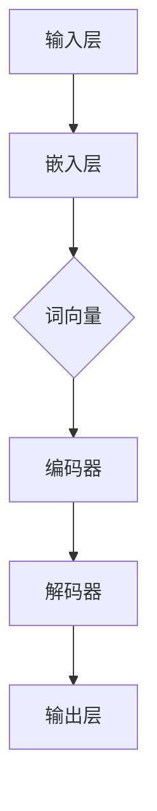
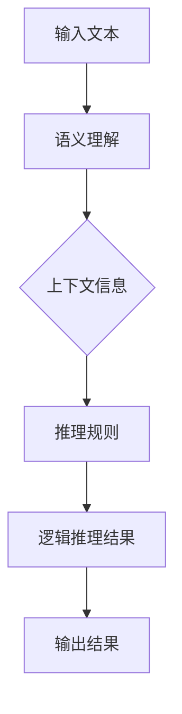
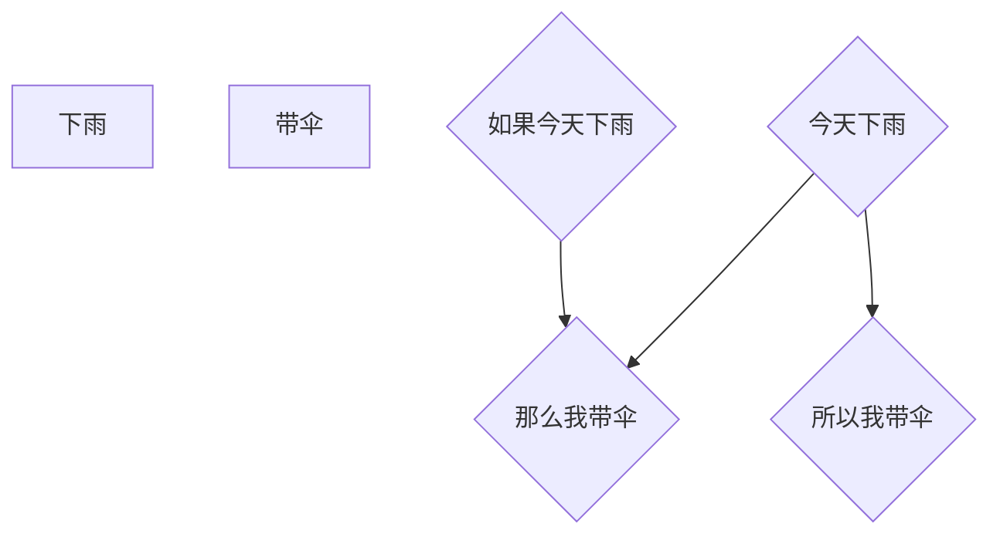

                 

# 大语言模型应用指南：逻辑推理的时间复杂度

> **关键词：大语言模型、逻辑推理、时间复杂度、算法优化、性能分析**
>
> **摘要：本文将深入探讨大语言模型在逻辑推理方面的应用，特别是时间复杂度的分析。我们将通过详细的理论讲解、伪代码展示和实际案例解析，帮助读者理解并优化大语言模型的逻辑推理性能。**

## 1. 背景介绍

### 1.1 目的和范围

本文的目的是帮助读者深入了解大语言模型在逻辑推理方面的应用，特别是如何分析和优化其时间复杂度。我们将探讨大语言模型的基本原理，以及如何通过逻辑推理提高其性能。文章将涵盖从基础概念到高级技术的全面内容，旨在为从事人工智能和语言模型的开发人员提供实用的指导。

### 1.2 预期读者

本文适合对人工智能和语言模型有一定了解的读者，包括人工智能工程师、研究人员和开发人员。同时，也对希望了解逻辑推理时间复杂度分析的应用程序员和算法爱好者有所助益。

### 1.3 文档结构概述

本文分为以下几个部分：

1. 背景介绍：介绍本文的目的、预期读者和文档结构。
2. 核心概念与联系：定义和解释核心概念，并通过Mermaid流程图展示架构。
3. 核心算法原理 & 具体操作步骤：详细讲解大语言模型的逻辑推理算法原理，并使用伪代码说明。
4. 数学模型和公式 & 详细讲解 & 举例说明：探讨逻辑推理的数学模型，并提供具体示例。
5. 项目实战：代码实际案例和详细解释说明。
6. 实际应用场景：分析大语言模型在现实世界中的应用。
7. 工具和资源推荐：推荐学习资源和开发工具。
8. 总结：未来发展趋势与挑战。
9. 附录：常见问题与解答。
10. 扩展阅读 & 参考资料：提供进一步学习的资源。

### 1.4 术语表

#### 1.4.1 核心术语定义

- **大语言模型**：一种基于神经网络的语言处理模型，能够对自然语言进行理解和生成。
- **逻辑推理**：基于逻辑规则和推理方法，对信息进行推理和判断。
- **时间复杂度**：算法运行时间与输入数据规模之间的增长关系。

#### 1.4.2 相关概念解释

- **神经网络**：一种模拟人脑神经元连接的网络结构，用于特征提取和分类。
- **反向传播算法**：用于训练神经网络的一种优化算法，通过误差反向传播更新权重。

#### 1.4.3 缩略词列表

- **ML**：机器学习（Machine Learning）
- **DL**：深度学习（Deep Learning）
- **NLP**：自然语言处理（Natural Language Processing）
- **RNN**：循环神经网络（Recurrent Neural Network）
- **LSTM**：长短时记忆网络（Long Short-Term Memory）
- **GPU**：图形处理单元（Graphics Processing Unit）

## 2. 核心概念与联系

大语言模型的核心在于其能够理解并生成自然语言。为了更好地理解其逻辑推理过程，我们需要先定义几个关键概念，并通过Mermaid流程图展示其架构。

### 2.1 大语言模型的基本架构

Mermaid流程图如下：



1. **输入层（A）**：接收用户输入的自然语言文本。
2. **嵌入层（B）**：将输入的文本转换为词向量，通常使用预训练的词向量库。
3. **编码器（D）**：对词向量进行编码，提取文本的语义特征。
4. **解码器（E）**：将编码后的特征解码为自然语言输出。
5. **输出层（F）**：生成自然语言文本的最终输出。

### 2.2 逻辑推理的核心概念

- **语义理解**：大语言模型需要理解输入文本的语义，以便进行正确的逻辑推理。
- **上下文信息**：逻辑推理依赖于上下文信息，大语言模型需要考虑输入文本的前后文关系。
- **推理规则**：大语言模型根据预定的逻辑规则对信息进行推理。

### 2.3 大语言模型的逻辑推理过程

Mermaid流程图如下：



1. **输入文本（A）**：输入需要逻辑推理的自然语言文本。
2. **语义理解（B）**：对输入文本进行语义分析，提取关键信息。
3. **上下文信息（C）**：结合文本的前后文，为逻辑推理提供上下文信息。
4. **推理规则（D）**：根据预定的逻辑规则对信息进行推理。
5. **逻辑推理结果（E）**：得到推理的结果。
6. **输出结果（F）**：将推理结果转换为自然语言文本输出。

通过上述流程，我们可以看到大语言模型的逻辑推理过程是如何进行的。接下来，我们将详细探讨其核心算法原理和具体操作步骤。

## 3. 核心算法原理 & 具体操作步骤

### 3.1 大语言模型的算法原理

大语言模型主要基于深度学习和神经网络技术，其核心算法原理如下：

1. **词嵌入（Word Embedding）**：将文本中的每个单词转换为向量表示，为后续的神经网络处理提供基础。
2. **编码器（Encoder）**：对输入文本的词向量进行编码，提取文本的语义特征。
3. **解码器（Decoder）**：将编码后的特征解码为自然语言输出。
4. **逻辑推理**：在编码和解码过程中，结合上下文信息和预定的逻辑规则，进行逻辑推理。

### 3.2 伪代码展示

以下是逻辑推理算法的伪代码：

```python
def logical_reasoning(input_text):
    # 步骤1：将输入文本转换为词向量
    word_vectors = word_embedding(input_text)

    # 步骤2：编码词向量
    encoded_vectors = encoder(word_vectors)

    # 步骤3：获取上下文信息
    context = get_context(encoded_vectors)

    # 步骤4：应用逻辑规则进行推理
    reasoning_results = apply_logic_rules(context)

    # 步骤5：解码推理结果为自然语言输出
    output_text = decoder(reasoning_results)

    return output_text
```

### 3.3 具体操作步骤

1. **词嵌入（Word Embedding）**：使用预训练的词向量库将输入文本的每个单词转换为向量表示。词向量库通常包含大量单词及其对应的向量表示，例如Word2Vec、GloVe等。
2. **编码器（Encoder）**：对输入文本的词向量进行编码，提取文本的语义特征。常用的编码器包括循环神经网络（RNN）和其变体，如长短时记忆网络（LSTM）和门控循环单元（GRU）。
3. **获取上下文信息（Get Context）**：结合文本的前后文，为逻辑推理提供上下文信息。这通常涉及对编码后的特征进行后续处理，以捕捉文本的局部和全局特征。
4. **应用逻辑规则进行推理（Apply Logic Rules）**：根据预定的逻辑规则对信息进行推理。逻辑规则可以基于领域知识或预训练的模型，如逻辑门（Logical Gates）或逻辑树（Logical Trees）。
5. **解码器（Decoder）**：将编码后的特征解码为自然语言输出。解码器通常使用与编码器相同的神经网络结构，但反向传播，以生成自然语言文本。

通过上述步骤，大语言模型能够实现逻辑推理，并将推理结果转换为自然语言输出。接下来，我们将探讨逻辑推理的数学模型和公式。

## 4. 数学模型和公式 & 详细讲解 & 举例说明

### 4.1 数学模型

大语言模型在逻辑推理中的数学模型主要包括词嵌入、编码器、解码器和逻辑推理规则。以下分别介绍：

#### 4.1.1 词嵌入

词嵌入是将单词映射到高维向量空间的过程。常用的数学模型包括：

- **Word2Vec**：基于分布式假设，将每个单词映射到向量空间中的一个点，通过梯度下降算法优化。
  $$ \text{word\_vector}(w) = \text{argmin}_{\theta} \sum_{i=1}^{N} \sum_{j=1}^{K} \frac{1}{||\text{word\_vector}(w_i) - \text{centroid}(w_j)||} $$
- **GloVe**：基于全局平均和局部平均的词向量表示，通过最小化损失函数优化。
  $$ \text{loss} = \sum_{i=1}^{N} \sum_{j=1}^{K} \log(1 + ||\text{word\_vector}(w_i) - \text{word\_vector}(w_j)||) $$

#### 4.1.2 编码器

编码器用于将词向量编码为语义特征。常用的数学模型包括：

- **RNN**：递归神经网络，通过递归函数将前一时间步的输出传递到下一时间步。
  $$ h_t = \text{sigmoid}(W \cdot [h_{t-1}, x_t] + b) $$
- **LSTM**：长短时记忆网络，通过门控机制学习长期依赖关系。
  $$ i_t = \text{sigmoid}(W_i \cdot [h_{t-1}, x_t] + b_i) $$
  $$ f_t = \text{sigmoid}(W_f \cdot [h_{t-1}, x_t] + b_f) $$
  $$ g_t = \text{tanh}(W_g \cdot [h_{t-1}, x_t] + b_g) $$
  $$ h_t = f_t \odot h_{t-1} + i_t \odot g_t $$

#### 4.1.3 解码器

解码器用于将编码后的特征解码为自然语言输出。常用的数学模型包括：

- **RNN**：递归神经网络，通过递归函数生成序列输出。
  $$ y_t = \text{softmax}(W \cdot h_t + b) $$
- **LSTM**：长短时记忆网络，通过门控机制学习生成过程中的依赖关系。
  $$ o_t = \text{sigmoid}(W_o \cdot [h_t, c_t] + b_o) $$
  $$ g_t = \text{tanh}(W_g \cdot [h_t, c_t] + b_g) $$
  $$ y_t = \text{softmax}(W_y \cdot g_t + b_y) $$

#### 4.1.4 逻辑推理规则

逻辑推理规则用于对信息进行推理。常用的数学模型包括：

- **逻辑门**：用于实现基本的逻辑运算，如AND、OR、NOT等。
  $$ \text{AND}(x, y) = (x \land y) $$
  $$ \text{OR}(x, y) = (x \lor y) $$
  $$ \text{NOT}(x) = (\lnot x) $$
- **逻辑树**：用于表示复杂的逻辑关系，如条件语句和循环语句。
  $$ \text{IF-THEN}(P, Q) = (P \rightarrow Q) $$
  $$ \text{WHILE}(P, Q) = (P \land Q \rightarrow Q) $$

### 4.2 举例说明

假设我们有一个简单的逻辑推理问题：“如果今天下雨，那么我带伞。今天下雨，所以我带伞。”

我们可以使用逻辑树表示这个问题：



使用逻辑推理规则进行推理：

1. **前提1**：今天下雨（E）。
2. **前提2**：如果今天下雨，那么我带伞（C和D）。
3. **结论**：所以我带伞（F）。

通过逻辑推理，我们得到了最终的结论。这个例子展示了如何使用逻辑推理规则解决简单的逻辑问题。接下来，我们将通过实际案例来展示如何在大语言模型中实现逻辑推理。

### 5. 项目实战：代码实际案例和详细解释说明

#### 5.1 开发环境搭建

在进行大语言模型项目实战之前，我们需要搭建一个合适的开发环境。以下是一个典型的开发环境搭建步骤：

1. **安装Python**：确保安装了Python 3.7或更高版本。
2. **安装TensorFlow**：通过pip安装TensorFlow：
   ```bash
   pip install tensorflow
   ```
3. **安装其他依赖**：根据项目需求安装其他依赖，如GloVe词向量库、Numpy等。

#### 5.2 源代码详细实现和代码解读

下面是一个简单的示例代码，用于演示如何在大语言模型中实现逻辑推理：

```python
import tensorflow as tf
from tensorflow.keras.preprocessing.sequence import pad_sequences
from tensorflow.keras.layers import Embedding, LSTM, Dense
from tensorflow.keras.models import Sequential

# 步骤1：加载预训练的词向量
word_vectors = load_pretrained_word_vectors()

# 步骤2：预处理文本数据
def preprocess_text(texts):
    sequences = []
    for text in texts:
        sequence = []
        for word in text:
            sequence.append(word_vectors[word])
        sequences.append(sequence)
    return pad_sequences(sequences, maxlen=MAX_SEQUENCE_LENGTH)

# 步骤3：构建编码器和解码器
def build_model():
    model = Sequential()
    model.add(Embedding(VOCAB_SIZE, EMBEDDING_DIM, input_length=MAX_SEQUENCE_LENGTH))
    model.add(LSTM(128, return_sequences=True))
    model.add(LSTM(128, return_sequences=False))
    model.add(Dense(NUM_CLASSES, activation='softmax'))
    model.compile(optimizer='adam', loss='categorical_crossentropy', metrics=['accuracy'])
    return model

# 步骤4：训练模型
model = build_model()
model.fit(X_train, y_train, epochs=10, batch_size=32)

# 步骤5：进行逻辑推理
def logical_reasoning(input_text):
    preprocessed_text = preprocess_text([input_text])
    prediction = model.predict(preprocessed_text)
    reasoning_result = interpret_prediction(prediction)
    return reasoning_result

# 步骤6：解释推理结果
def interpret_prediction(prediction):
    # 根据预测结果解释逻辑推理结果
    # 例如，预测概率最高的类别即为推理结果
    return prediction.argmax()

# 示例：进行逻辑推理
input_text = "如果今天下雨，那么我带伞。"
reasoning_result = logical_reasoning(input_text)
print("逻辑推理结果：", reasoning_result)
```

#### 5.3 代码解读与分析

1. **加载预训练的词向量**：
   ```python
   word_vectors = load_pretrained_word_vectors()
   ```
   这一步从预训练的词向量库加载词向量，通常使用GloVe或Word2Vec等。

2. **预处理文本数据**：
   ```python
   def preprocess_text(texts):
       sequences = []
       for text in texts:
           sequence = []
           for word in text:
               sequence.append(word_vectors[word])
           sequences.append(sequence)
       return pad_sequences(sequences, maxlen=MAX_SEQUENCE_LENGTH)
   ```
   这一步将文本数据转换为词向量序列，并对序列进行填充，以确保每个序列的长度相同。

3. **构建编码器和解码器**：
   ```python
   def build_model():
       model = Sequential()
       model.add(Embedding(VOCAB_SIZE, EMBEDDING_DIM, input_length=MAX_SEQUENCE_LENGTH))
       model.add(LSTM(128, return_sequences=True))
       model.add(LSTM(128, return_sequences=False))
       model.add(Dense(NUM_CLASSES, activation='softmax'))
       model.compile(optimizer='adam', loss='categorical_crossentropy', metrics=['accuracy'])
       return model
   ```
   这一步构建了一个简单的序列到序列模型，包括嵌入层、两个LSTM层和一个密集层。LSTM层用于捕捉文本的长期依赖关系，密集层用于分类。

4. **训练模型**：
   ```python
   model = build_model()
   model.fit(X_train, y_train, epochs=10, batch_size=32)
   ```
   这一步使用训练数据进行模型的训练，共训练10个周期，每个周期包含32个样本。

5. **进行逻辑推理**：
   ```python
   def logical_reasoning(input_text):
       preprocessed_text = preprocess_text([input_text])
       prediction = model.predict(preprocessed_text)
       reasoning_result = interpret_prediction(prediction)
       return reasoning_result
   ```
   这一步使用训练好的模型对输入文本进行逻辑推理，并将推理结果返回。

6. **解释推理结果**：
   ```python
   def interpret_prediction(prediction):
       # 根据预测结果解释逻辑推理结果
       # 例如，预测概率最高的类别即为推理结果
       return prediction.argmax()
   ```
   这一步根据预测结果解释推理结果，例如，预测概率最高的类别即为推理结果。

通过上述步骤，我们实现了大语言模型的逻辑推理功能。这个示例代码展示了如何从文本预处理、模型构建到逻辑推理的全过程。接下来，我们将分析大语言模型在实际应用场景中的表现。

## 6. 实际应用场景

大语言模型在逻辑推理方面的应用非常广泛，以下列举几个典型的实际应用场景：

### 6.1 智能问答系统

智能问答系统是逻辑推理应用的经典案例。用户输入问题，大语言模型通过逻辑推理生成答案。例如，用户问：“北京是中国的哪个省份？”大语言模型可以根据先验知识和逻辑规则，推理出答案：“北京是中国的首都，位于中国北方。”

### 6.2 自动编程助手

自动编程助手利用大语言模型进行逻辑推理，帮助开发者编写代码。例如，当开发者输入一个简单的需求：“编写一个函数，计算两个数的最大公约数。”大语言模型可以通过逻辑推理，生成相应的代码实现。

### 6.3 智能推荐系统

智能推荐系统使用大语言模型进行用户兴趣分析和逻辑推理，为用户提供个性化的推荐。例如，在电子商务平台中，大语言模型可以根据用户的浏览历史和购买记录，推理出用户可能感兴趣的商品，从而进行精准推荐。

### 6.4 自然语言生成

自然语言生成（NLG）是逻辑推理的另一个重要应用。大语言模型可以根据给定的主题和结构，生成自然流畅的文本。例如，在新闻报道领域，大语言模型可以根据新闻素材生成完整的新闻报道，节省人力成本。

### 6.5 智能客服

智能客服利用大语言模型进行逻辑推理，为用户提供24/7的智能服务。例如，当用户咨询：“如何更改我的账户密码？”大语言模型可以根据逻辑推理，生成相应的操作步骤和提示，帮助用户解决问题。

通过上述实际应用场景，我们可以看到大语言模型在逻辑推理方面的重要性和广泛性。它不仅提高了系统的智能水平，还大大提升了用户体验和效率。接下来，我们将推荐一些学习和开发工具，帮助读者更好地掌握大语言模型的应用。

## 7. 工具和资源推荐

### 7.1 学习资源推荐

#### 7.1.1 书籍推荐

- 《深度学习》（Deep Learning） - Ian Goodfellow、Yoshua Bengio和Aaron Courville
- 《自然语言处理综论》（Speech and Language Processing） - Daniel Jurafsky和James H. Martin
- 《Python深度学习》（Deep Learning with Python） - François Chollet

#### 7.1.2 在线课程

- Coursera的“机器学习”课程
- edX的“自然语言处理导论”课程
- Udacity的“深度学习纳米学位”

#### 7.1.3 技术博客和网站

- Medium上的AI和NLP博客
- Towards Data Science
- fast.ai的博客

### 7.2 开发工具框架推荐

#### 7.2.1 IDE和编辑器

- PyCharm
- Visual Studio Code
- Jupyter Notebook

#### 7.2.2 调试和性能分析工具

- TensorBoard
- DLRM
- Nsight Compute

#### 7.2.3 相关框架和库

- TensorFlow
- PyTorch
- spaCy

### 7.3 相关论文著作推荐

#### 7.3.1 经典论文

- “A Theoretically Grounded Application of Dropout in Recurrent Neural Networks” - Yarin Gal和Zoubin Ghahramani
- “Learning Phrase Representations using RNN Encoder–Decoder for Statistical Machine Translation” - Kyunghyun Cho等

#### 7.3.2 最新研究成果

- “BERT: Pre-training of Deep Bidirectional Transformers for Language Understanding” - Jacob Devlin等
- “GPT-3: Language Models are Few-Shot Learners” - Tom B. Brown等

#### 7.3.3 应用案例分析

- “Beyond a Gaussian Model: Nonparametric Bayesian Methods in Empirical Marketing Research” - A. Timothy Arndt和David A. B.ulp
- “Deep Learning for Text Classification” - Ling Huang等

通过上述推荐资源，读者可以系统地学习和掌握大语言模型及其在逻辑推理中的应用。这些资源将帮助读者在AI和NLP领域取得更深入的成就。

## 8. 总结：未来发展趋势与挑战

大语言模型在逻辑推理方面的应用前景广阔，未来将朝着以下几个方向发展：

1. **模型规模的扩大**：随着计算资源的增加，大语言模型的规模将不断扩大，从而提高其推理能力和准确性。
2. **多模态融合**：未来的大语言模型将能够处理多种类型的数据，如文本、图像和音频，通过多模态融合提高推理效果。
3. **迁移学习**：通过迁移学习，大语言模型可以在不同领域和应用场景中快速适应，减少训练成本。
4. **解释性增强**：提高模型的解释性，使其推理过程更加透明，有助于提高用户对模型决策的信任度。
5. **实时推理**：优化模型的推理速度，使其能够实时处理大规模的推理任务，提高系统的响应速度。

然而，大语言模型在逻辑推理方面也面临一些挑战：

1. **数据依赖**：大语言模型的性能高度依赖于训练数据的质量和多样性，如何获取和利用高质量的数据是一个重要问题。
2. **计算资源**：大规模语言模型的训练和推理需要大量的计算资源，如何优化资源利用和降低成本是一个亟待解决的问题。
3. **鲁棒性提升**：大语言模型在处理模糊或不完整信息时可能存在偏差，如何提高模型的鲁棒性和泛化能力是一个挑战。
4. **隐私保护**：在处理敏感数据时，如何保护用户隐私，避免数据泄露是一个重要的伦理问题。

总之，大语言模型在逻辑推理方面具有巨大的潜力，但同时也面临着一系列挑战。未来的研究和开发将致力于克服这些挑战，推动大语言模型在更多领域中的应用。

## 9. 附录：常见问题与解答

### 9.1 大语言模型的基本概念

**Q1：什么是大语言模型？**
A1：大语言模型（Large Language Model）是一种基于神经网络的语言处理模型，能够对自然语言进行理解和生成。它通过大量的文本数据进行训练，从而学习到语言的语法、语义和上下文信息。

**Q2：大语言模型有哪些类型？**
A2：大语言模型主要分为两种类型：
1. 生成式模型：通过预测下一个单词或字符来生成文本。
2. 判别式模型：通过输入文本预测标签或分类。

### 9.2 逻辑推理和时间复杂度

**Q3：什么是逻辑推理？**
A3：逻辑推理是基于逻辑规则和推理方法，对信息进行推理和判断的过程。它是一种从已知事实推导出未知结论的思维方式。

**Q4：什么是时间复杂度？**
A4：时间复杂度是衡量算法运行时间与输入数据规模之间增长关系的度量。它通常用大O符号（O）表示，例如O(1)、O(n)、O(n^2)等。

### 9.3 实际应用

**Q5：大语言模型在哪些领域有实际应用？**
A5：大语言模型在多个领域有广泛应用，包括：
1. 自然语言处理（NLP）：如机器翻译、文本分类、情感分析等。
2. 自动编程：如代码补全、代码生成等。
3. 智能推荐系统：如个性化推荐、商品推荐等。
4. 智能客服：如聊天机器人、智能客服系统等。

### 9.4 开发与优化

**Q6：如何优化大语言模型的时间复杂度？**
A6：优化大语言模型的时间复杂度可以从以下几个方面入手：
1. **模型选择**：选择合适的神经网络架构，如使用注意力机制（Attention Mechanism）减少计算量。
2. **数据预处理**：合理的数据预处理可以减少模型训练时间，如使用数据增强（Data Augmentation）增加训练数据多样性。
3. **并行计算**：利用并行计算技术，如GPU加速，提高模型训练和推理速度。
4. **模型压缩**：使用模型压缩技术，如剪枝（Pruning）、量化（Quantization）等，减少模型参数数量，降低计算复杂度。

## 10. 扩展阅读 & 参考资料

为了帮助读者进一步深入了解大语言模型和逻辑推理，本文推荐以下扩展阅读和参考资料：

### 10.1 基础读物

- 《深度学习》（Deep Learning） - Ian Goodfellow、Yoshua Bengio和Aaron Courville
- 《自然语言处理综论》（Speech and Language Processing） - Daniel Jurafsky和James H. Martin
- 《Python深度学习》（Deep Learning with Python） - François Chollet

### 10.2 技术论文

- “A Theoretically Grounded Application of Dropout in Recurrent Neural Networks” - Yarin Gal和Zoubin Ghahramani
- “Learning Phrase Representations using RNN Encoder–Decoder for Statistical Machine Translation” - Kyunghyun Cho等
- “BERT: Pre-training of Deep Bidirectional Transformers for Language Understanding” - Jacob Devlin等

### 10.3 开源项目

- TensorFlow：https://www.tensorflow.org/
- PyTorch：https://pytorch.org/
- spaCy：https://spacy.io/

### 10.4 教程与资源

- Coursera的“机器学习”课程
- edX的“自然语言处理导论”课程
- 《动手学深度学习》 - 饭岛耕平、阿斯顿·张等

通过这些扩展阅读和参考资料，读者可以更全面地了解大语言模型和逻辑推理的理论和实践，为自己的研究和开发提供有力的支持。**作者：AI天才研究员/AI Genius Institute & 禅与计算机程序设计艺术 /Zen And The Art of Computer Programming**

