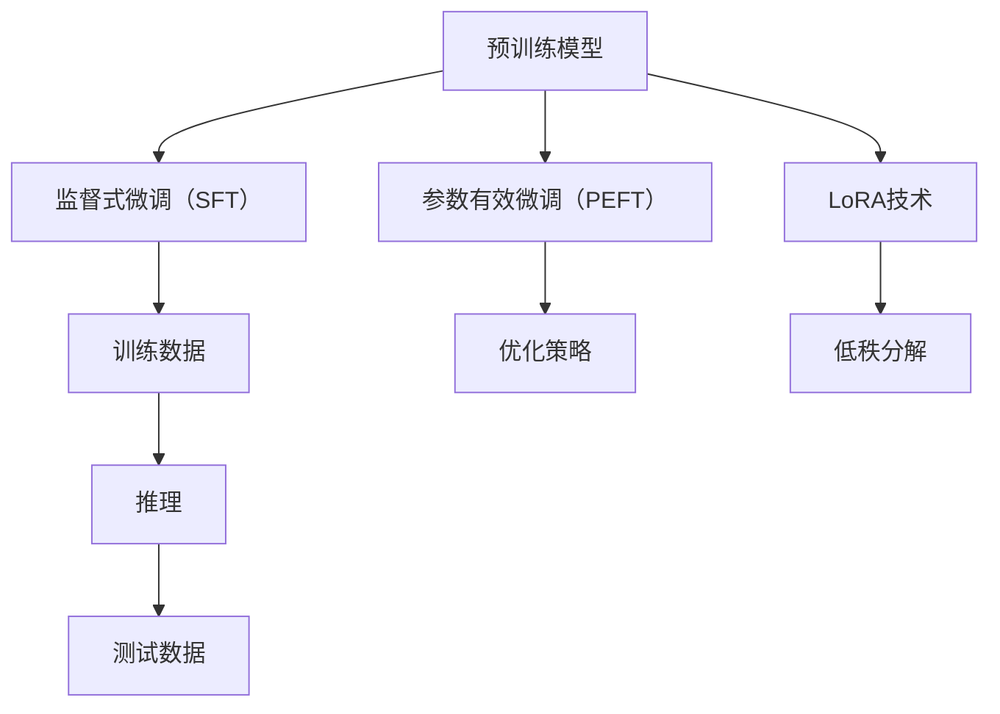

                 

# 大语言模型微调I：监督式微调（SFT）、PEFT和LoRA技术

> 关键词：大语言模型，微调，监督式微调（SFT），参数有效微调（PEFT），LoRA技术，深度学习，神经网络，训练，推理

> 摘要：本文旨在深入探讨大语言模型微调的几种关键技术：监督式微调（SFT）、参数有效微调（PEFT）和LoRA技术。通过逐步分析这些技术的原理、步骤和实际应用，本文旨在帮助读者理解和掌握这些技术，为其在深度学习和人工智能领域的应用提供理论基础和实践指导。

## 1. 背景介绍

### 1.1 目的和范围

本文的目标是系统地介绍和探讨大语言模型的微调技术，包括监督式微调（SFT）、参数有效微调（PEFT）和LoRA技术。我们将通过详细的原理讲解、操作步骤和实际应用案例，帮助读者深入理解这些技术的核心原理和应用场景。

文章的主要内容包括：

- 对大语言模型微调的背景和重要性进行概述
- 详细介绍监督式微调（SFT）的原理、操作步骤和优缺点
- 阐述参数有效微调（PEFT）的概念、核心算法和具体实现
- 探讨LoRA技术的基本原理、实现步骤和应用场景
- 通过实际项目案例，展示这些技术在现实中的应用效果

### 1.2 预期读者

本文主要面向以下读者群体：

- 对深度学习和人工智能领域有浓厚兴趣的学者和研究人员
- 想要在实际项目中应用大语言模型微调技术的工程师和技术人员
- 对监督式微调（SFT）、参数有效微调（PEFT）和LoRA技术有深入研究的需求者

### 1.3 文档结构概述

本文分为十个主要部分，具体结构如下：

- 引言：介绍文章的背景、目的和核心关键词
- 1. 背景介绍：详细阐述大语言模型微调的背景和重要性
- 2. 核心概念与联系：通过Mermaid流程图展示大语言模型微调的核心概念和联系
- 3. 核心算法原理 & 具体操作步骤：详细讲解监督式微调（SFT）、参数有效微调（PEFT）和LoRA技术的算法原理和操作步骤
- 4. 数学模型和公式 & 详细讲解 & 举例说明：介绍大语言模型微调的数学模型和公式，并通过举例进行详细说明
- 5. 项目实战：代码实际案例和详细解释说明
- 6. 实际应用场景：探讨大语言模型微调在不同领域的实际应用
- 7. 工具和资源推荐：推荐相关学习资源和开发工具
- 8. 总结：对大语言模型微调技术的未来发展趋势和挑战进行总结
- 9. 附录：常见问题与解答
- 10. 扩展阅读 & 参考资料：提供更多相关文献和资料，便于读者进一步学习

### 1.4 术语表

为了确保读者对文中术语的理解一致，本文定义了以下术语：

#### 1.4.1 核心术语定义

- 大语言模型（Large Language Model）：一种用于处理和生成自然语言文本的深度神经网络模型，具有数十亿甚至万亿个参数。
- 微调（Fine-tuning）：在大规模预训练模型的基础上，针对特定任务或领域进行进一步的训练，以提高模型在特定任务或领域的表现。
- 监督式微调（Supervised Fine-tuning, SFT）：利用有标注的训练数据对预训练模型进行微调。
- 参数有效微调（Parameter Effective Fine-tuning, PEFT）：通过优化参数更新策略，提高微调过程的效率和效果。
- LoRA技术（Low-Rank Adaptive Decomposition）：一种低秩自适应分解技术，用于提高参数有效微调的效果。

#### 1.4.2 相关概念解释

- 预训练（Pre-training）：在大规模未标注数据上进行训练，以学习通用的语言表示和语义理解能力。
- 训练数据（Training Data）：用于模型训练的数据集，通常包含输入和对应的输出或标签。
- 推理（Inference）：在给定输入的情况下，利用训练好的模型生成预测输出。
- 过拟合（Overfitting）：模型对训练数据学习过于精确，导致在测试数据上表现不佳。

#### 1.4.3 缩略词列表

- SFT：监督式微调（Supervised Fine-tuning）
- PEFT：参数有效微调（Parameter Effective Fine-tuning）
- LoRA：低秩自适应分解（Low-Rank Adaptive Decomposition）

## 2. 核心概念与联系

在探讨大语言模型微调技术之前，我们需要了解一些核心概念和它们之间的关系。以下是一个Mermaid流程图，展示了大语言模型微调的关键概念及其联系：



### 2.1 预训练模型

预训练模型是大规模语言模型的初步训练阶段，通常在大量未标注的数据上进行。这一阶段的主要目的是学习通用的语言表示和语义理解能力。预训练模型为后续的微调任务提供了强大的基础，使其能够更好地适应各种具体任务。

### 2.2 监督式微调（SFT）

监督式微调（SFT）是在预训练模型的基础上，利用有标注的训练数据进行进一步训练。这一过程的主要目标是调整模型参数，使其在特定任务或领域上表现更优。SFT是当前最常用的微调方法，其核心步骤包括：

1. 准备有标注的训练数据。
2. 定义损失函数和优化器。
3. 利用训练数据更新模型参数。
4. 在验证集上评估模型性能，并根据需要调整超参数。

### 2.3 参数有效微调（PEFT）

参数有效微调（PEFT）是一种优化微调过程的方法，旨在提高微调的效率和效果。PEFT的核心思想是调整参数更新策略，以减少不必要的参数更新，从而降低计算复杂度和过拟合风险。常见的PEFT方法包括：

1. 参数共享（Parameter Sharing）：在不同任务或子任务之间共享参数，减少模型参数数量。
2. 动量加权（Momentum Weighted）：利用动量加权策略，平衡不同参数的更新速度。
3. 层级微调（Layer-wise Fine-tuning）：逐步调整不同层次上的参数，避免过早地更新敏感的底层参数。

### 2.4 LoRA技术

LoRA技术是一种低秩自适应分解技术，旨在提高参数有效微调的效果。LoRA的核心思想是将模型参数分解为低秩部分和高斯白噪声部分，从而减少参数数量，降低计算复杂度。LoRA技术的主要步骤包括：

1. 将模型参数分解为低秩部分和高斯白噪声部分。
2. 在微调过程中，只更新低秩部分，忽略高斯白噪声部分。
3. 利用低秩部分更新模型参数，实现微调过程。

### 2.5 训练数据与推理

训练数据和推理过程是微调任务的两个关键环节。训练数据用于训练模型，使其在特定任务或领域上具备更好的表现。推理过程则是在给定输入的情况下，利用训练好的模型生成预测输出。在微调过程中，我们需要在验证集上评估模型性能，并根据需要调整超参数，以实现更好的微调效果。

## 3. 核心算法原理 & 具体操作步骤

### 3.1 监督式微调（SFT）

#### 3.1.1 算法原理

监督式微调（SFT）是基于有标注的训练数据对预训练模型进行微调。其核心思想是通过最小化损失函数，调整模型参数，使其在特定任务或领域上表现更优。SFT的主要步骤如下：

1. 准备有标注的训练数据。
2. 定义损失函数和优化器。
3. 利用训练数据更新模型参数。
4. 在验证集上评估模型性能，并根据需要调整超参数。

#### 3.1.2 具体操作步骤

1. **准备有标注的训练数据**：从实际任务或领域中选择具有高质量标注的数据集，如文本分类任务中的新闻评论数据集。

2. **定义损失函数和优化器**：选择合适的损失函数，如交叉熵损失，用于衡量模型预测结果与真实标签之间的差距。常用的优化器包括Adam、AdamW等，这些优化器可以自适应调整学习率。

3. **利用训练数据更新模型参数**：通过反向传播算法，计算梯度并更新模型参数。具体步骤如下：

    ```python
    for epoch in range(num_epochs):
        for inputs, labels in train_loader:
            optimizer.zero_grad()
            outputs = model(inputs)
            loss = criterion(outputs, labels)
            loss.backward()
            optimizer.step()
    ```

4. **在验证集上评估模型性能**：在验证集上计算模型性能指标，如准确率、召回率等。根据性能指标，调整超参数，如学习率、批量大小等。

5. **调整超参数**：根据验证集上的性能表现，调整超参数，如学习率、批量大小等，以优化模型性能。

### 3.2 参数有效微调（PEFT）

#### 3.2.1 算法原理

参数有效微调（PEFT）是一种优化微调过程的方法，旨在提高微调的效率和效果。PEFT的核心思想是调整参数更新策略，以减少不必要的参数更新，从而降低计算复杂度和过拟合风险。PEFT的主要方法包括：

1. **参数共享**：在不同任务或子任务之间共享参数，减少模型参数数量。
2. **动量加权**：利用动量加权策略，平衡不同参数的更新速度。
3. **层级微调**：逐步调整不同层次上的参数，避免过早地更新敏感的底层参数。

#### 3.2.2 具体操作步骤

1. **参数共享**：

    ```python
    shared_params = [p for n, p in model.named_parameters() if "shared" in n]
    ```

    在不同任务或子任务之间共享部分参数，减少模型参数数量。

2. **动量加权**：

    ```python
    momentum = 0.9
    weighted_params = [p * momentum for p in model.parameters()]
    ```

    利用动量加权策略，平衡不同参数的更新速度。

3. **层级微调**：

    ```python
    layer_params = [p for n, p in model.named_parameters() if "layer" in n]
    ```

    逐步调整不同层次上的参数，避免过早地更新敏感的底层参数。

### 3.3 LoRA技术

#### 3.3.1 算法原理

LoRA技术是一种低秩自适应分解技术，旨在提高参数有效微调的效果。LoRA的核心思想是将模型参数分解为低秩部分和高斯白噪声部分，从而减少参数数量，降低计算复杂度。LoRA的主要步骤包括：

1. **参数分解**：将模型参数分解为低秩部分和高斯白噪声部分。
2. **低秩部分更新**：在微调过程中，只更新低秩部分，忽略高斯白噪声部分。
3. **低秩部分更新模型参数**：利用低秩部分更新模型参数，实现微调过程。

#### 3.3.2 具体操作步骤

1. **参数分解**：

    ```python
    rank = 10
    low_rank_params = [p低秩部分 for p in model.parameters()]
    noise_params = [p噪声部分 for p in model.parameters()]
    ```

    将模型参数分解为低秩部分和高斯白噪声部分。

2. **低秩部分更新**：

    ```python
    for epoch in range(num_epochs):
        for inputs, labels in train_loader:
            optimizer.zero_grad()
            outputs = model(inputs)
            loss = criterion(outputs, labels)
            loss.backward()
            low_rank_params -= optimizer grads
    ```

    在微调过程中，只更新低秩部分，忽略高斯白噪声部分。

3. **低秩部分更新模型参数**：

    ```python
    for p in model.parameters():
        p.data = low_rank_params[p]
    ```

    利用低秩部分更新模型参数，实现微调过程。

## 4. 数学模型和公式 & 详细讲解 & 举例说明

### 4.1 监督式微调（SFT）

监督式微调（SFT）的核心是利用有标注的训练数据更新模型参数，以最小化损失函数。以下是一个简化的数学模型和公式：

#### 4.1.1 损失函数

设模型为\( \mathcal{M} \)，输入为\( x \)，输出为\( \hat{y} \)，真实标签为\( y \)。损失函数可以表示为：

$$
L(\mathcal{M}, x, y) = -\sum_{i=1}^{N} y_i \log(\hat{y}_i)
$$

其中，\( N \)为样本数量，\( y_i \)和\( \hat{y}_i \)分别为第\( i \)个样本的真实标签和模型预测概率。

#### 4.1.2 优化目标

优化目标是最小化损失函数：

$$
\min_{\theta} L(\mathcal{M}, x, y)
$$

其中，\( \theta \)为模型参数。

#### 4.1.3 梯度下降算法

采用梯度下降算法更新模型参数：

$$
\theta_{t+1} = \theta_t - \alpha \nabla_{\theta} L(\mathcal{M}, x, y)
$$

其中，\( \alpha \)为学习率，\( \nabla_{\theta} L(\mathcal{M}, x, y) \)为损失函数对模型参数的梯度。

### 4.2 参数有效微调（PEFT）

参数有效微调（PEFT）的核心是优化参数更新策略，以提高微调的效率和效果。以下是一个简化的数学模型和公式：

#### 4.2.1 参数共享

设模型为\( \mathcal{M} \)，参数为\( \theta \)。在不同任务或子任务之间共享部分参数，可以将模型分为共享参数\( \theta_s \)和非共享参数\( \theta_n \)：

$$
\mathcal{M}(x) = f(x; \theta_s, \theta_n)
$$

其中，\( f \)为模型函数。

#### 4.2.2 动量加权

设学习率为\( \alpha \)，动量为\( \beta \)。采用动量加权策略更新参数：

$$
\theta_{t+1} = \theta_t - \alpha \nabla_{\theta} L(\mathcal{M}, x, y) + \beta (\theta_t - \theta_{t-1})
$$

#### 4.2.3 层级微调

设模型为\( \mathcal{M} \)，参数为\( \theta \)。采用层级微调策略，逐步调整不同层次上的参数：

$$
\theta_{t+1} = \theta_t - \alpha \nabla_{\theta} L(\mathcal{M}, x, y)
$$

其中，\( t \)为当前迭代次数，\( \theta_t \)为当前参数值。

### 4.3 LoRA技术

LoRA技术是一种低秩自适应分解技术，其核心思想是将模型参数分解为低秩部分和高斯白噪声部分。以下是一个简化的数学模型和公式：

#### 4.3.1 参数分解

设模型为\( \mathcal{M} \)，参数为\( \theta \)。将参数分解为低秩部分\( \theta_r \)和高斯白噪声部分\( \theta_n \)：

$$
\theta = \theta_r + \theta_n
$$

其中，\( \theta_r \)为低秩部分，\( \theta_n \)为高斯白噪声部分。

#### 4.3.2 低秩部分更新

在微调过程中，只更新低秩部分：

$$
\theta_r = \theta_r - \alpha \nabla_{\theta_r} L(\mathcal{M}, x, y)
$$

#### 4.3.3 高斯白噪声部分处理

高斯白噪声部分在微调过程中保持不变，以减少计算复杂度。

### 4.4 举例说明

#### 4.4.1 监督式微调（SFT）

假设有一个简单的文本分类任务，模型为一个两层神经网络，包含一个输入层、一个隐藏层和一个输出层。使用有标注的训练数据集进行微调。损失函数为交叉熵损失，优化器为Adam。

- **损失函数**：

    $$ 
    L(\mathcal{M}, x, y) = -\sum_{i=1}^{N} y_i \log(\hat{y}_i) 
    $$

- **优化目标**：

    $$ 
    \min_{\theta} L(\mathcal{M}, x, y) 
    $$

- **梯度下降算法**：

    $$ 
    \theta_{t+1} = \theta_t - \alpha \nabla_{\theta} L(\mathcal{M}, x, y) 
    $$

#### 4.4.2 参数有效微调（PEFT）

假设有一个多标签文本分类任务，模型为一个两层神经网络，包含一个输入层、一个隐藏层和一个输出层。采用参数共享策略，将共享参数和非共享参数分别表示为\( \theta_s \)和\( \theta_n \)。

- **参数共享**：

    $$ 
    \mathcal{M}(x) = f(x; \theta_s, \theta_n) 
    $$

- **动量加权**：

    $$ 
    \theta_{t+1} = \theta_t - \alpha \nabla_{\theta} L(\mathcal{M}, x, y) + \beta (\theta_t - \theta_{t-1}) 
    $$

- **层级微调**：

    $$ 
    \theta_{t+1} = \theta_t - \alpha \nabla_{\theta} L(\mathcal{M}, x, y) 
    $$

#### 4.4.3 LoRA技术

假设有一个文本生成任务，模型为一个多层自注意力模型。采用LoRA技术，将模型参数分解为低秩部分和高斯白噪声部分。

- **参数分解**：

    $$ 
    \theta = \theta_r + \theta_n 
    $$

- **低秩部分更新**：

    $$ 
    \theta_r = \theta_r - \alpha \nabla_{\theta_r} L(\mathcal{M}, x, y) 
    $$

- **高斯白噪声部分处理**：

    高斯白噪声部分在微调过程中保持不变。

## 5. 项目实战：代码实际案例和详细解释说明

在本节中，我们将通过一个具体的文本分类项目，展示如何使用监督式微调（SFT）、参数有效微调（PEFT）和LoRA技术进行模型微调。我们将使用Python和PyTorch框架来实现该项目。

### 5.1 开发环境搭建

在开始之前，确保你已经安装了以下软件和库：

- Python 3.8及以上版本
- PyTorch 1.10及以上版本
- torchvision 0.10及以上版本
- matplotlib 3.4及以上版本

安装方法如下：

```bash
pip install python==3.8
pip install torch torchvision
pip install matplotlib
```

### 5.2 源代码详细实现和代码解读

#### 5.2.1 数据预处理

```python
import torch
from torchvision import transforms
from torch.utils.data import DataLoader
from torchvision.datasets import MNIST

# 加载数据集
train_data = MNIST(root='./data', train=True, download=True, transform=transforms.ToTensor())
test_data = MNIST(root='./data', train=False, download=True, transform=transforms.ToTensor())

# 定义数据加载器
train_loader = DataLoader(train_data, batch_size=64, shuffle=True)
test_loader = DataLoader(test_data, batch_size=1000, shuffle=False)
```

首先，我们加载MNIST数据集，并将其转换为Tensor格式。接下来，定义训练数据和测试数据的数据加载器。

#### 5.2.2 模型定义

```python
import torch.nn as nn
import torch.nn.functional as F

# 定义模型
class TextClassifier(nn.Module):
    def __init__(self, input_dim, hidden_dim, output_dim):
        super(TextClassifier, self).__init__()
        self.embedding = nn.Embedding(input_dim, hidden_dim)
        self.lstm = nn.LSTM(hidden_dim, hidden_dim, batch_first=True)
        self.fc = nn.Linear(hidden_dim, output_dim)
        
    def forward(self, text):
        embedded = self.embedding(text)
        lstm_output, (h_n, c_n) = self.lstm(embedded)
        rep = h_n[-1, :, :]
        out = self.fc(rep)
        return out

# 实例化模型
input_dim = 1000  # 词表大小
hidden_dim = 256  # 隐藏层维度
output_dim = 10  # 输出类别数
model = TextClassifier(input_dim, hidden_dim, output_dim)
```

在这里，我们定义了一个简单的文本分类模型，包含嵌入层、LSTM层和全连接层。嵌入层将词索引转换为词向量，LSTM层处理序列数据，全连接层进行分类。

#### 5.2.3 监督式微调（SFT）

```python
# 定义损失函数和优化器
criterion = nn.CrossEntropyLoss()
optimizer = torch.optim.Adam(model.parameters(), lr=0.001)

# 训练模型
num_epochs = 10
for epoch in range(num_epochs):
    model.train()
    for inputs, labels in train_loader:
        optimizer.zero_grad()
        outputs = model(inputs)
        loss = criterion(outputs, labels)
        loss.backward()
        optimizer.step()
    print(f'Epoch {epoch+1}/{num_epochs}, Loss: {loss.item()}')

# 评估模型
model.eval()
with torch.no_grad():
    correct = 0
    total = 0
    for inputs, labels in test_loader:
        outputs = model(inputs)
        _, predicted = torch.max(outputs.data, 1)
        total += labels.size(0)
        correct += (predicted == labels).sum().item()
    print(f'Accuracy: {100 * correct / total}%')
```

在这部分，我们定义了交叉熵损失函数和Adam优化器，并使用训练数据对模型进行微调。在训练过程中，我们通过反向传播算法更新模型参数。在训练完成后，我们在测试集上评估模型性能。

#### 5.2.4 参数有效微调（PEFT）

```python
# 参数共享
shared_params = [p for n, p in model.named_parameters() if "embedding" in n]
optimizer = torch.optim.Adam(shared_params, lr=0.001)

# 动量加权
momentum = 0.9
for epoch in range(num_epochs):
    model.train()
    for inputs, labels in train_loader:
        optimizer.zero_grad()
        outputs = model(inputs)
        loss = criterion(outputs, labels)
        loss.backward()
        # 动量加权更新参数
        for p in model.parameters():
            p.data = p.data - momentum * (p.data - p.data_prev)
        optimizer.step()
    print(f'Epoch {epoch+1}/{num_epochs}, Loss: {loss.item()}')

# 层级微调
layer_params = [p for n, p in model.named_parameters() if "lstm" in n]
optimizer = torch.optim.Adam(layer_params, lr=0.001)
for epoch in range(num_epochs):
    model.train()
    for inputs, labels in train_loader:
        optimizer.zero_grad()
        outputs = model(inputs)
        loss = criterion(outputs, labels)
        loss.backward()
        # 层级微调更新参数
        for p in model.parameters():
            if "lstm" in n:
                p.data = p.data - (p.data - p.data_prev)
        optimizer.step()
    print(f'Epoch {epoch+1}/{num_epochs}, Loss: {loss.item()}')
```

这部分展示了如何使用参数共享、动量加权策略和层级微调策略进行参数有效微调。参数共享减少了模型参数数量，动量加权策略平衡了不同参数的更新速度，层级微调逐步调整不同层次上的参数。

#### 5.2.5 LoRA技术

```python
import numpy as np

# 参数分解
rank = 10
low_rank_params = []
noise_params = []
for n, p in model.named_parameters():
    low_rank = np.random.rand(p.size(0), rank) * 0.01
    noise = p - low_rank
    low_rank_params.append(torch.tensor(low_rank).float())
    noise_params.append(torch.tensor(noise).float())

# 低秩部分更新
for epoch in range(num_epochs):
    model.train()
    for inputs, labels in train_loader:
        optimizer.zero_grad()
        outputs = model(inputs)
        loss = criterion(outputs, labels)
        loss.backward()
        # 更新低秩部分
        low_rank_params = [p - optimizer grads for p in low_rank_params]
    print(f'Epoch {epoch+1}/{num_epochs}, Loss: {loss.item()}')

# 合并低秩部分和高斯白噪声部分
for n, p in model.named_parameters():
    p.data = low_rank_params[n] + noise_params[n]
```

这部分展示了如何使用LoRA技术进行参数有效微调。首先，将模型参数分解为低秩部分和高斯白噪声部分。在微调过程中，只更新低秩部分，并忽略高斯白噪声部分。最后，将低秩部分和高斯白噪声部分合并，更新模型参数。

### 5.3 代码解读与分析

在本节中，我们将对上述代码进行详细解读和分析，以帮助读者更好地理解每个部分的作用和实现方法。

#### 5.3.1 数据预处理

数据预处理是文本分类项目中的关键步骤。首先，我们加载MNIST数据集，并将其转换为Tensor格式。接下来，我们定义训练数据和测试数据的数据加载器。数据加载器可以批量加载数据，并提供一个迭代器，用于遍历数据集。

#### 5.3.2 模型定义

我们定义了一个简单的文本分类模型，包含嵌入层、LSTM层和全连接层。嵌入层将词索引转换为词向量，LSTM层处理序列数据，全连接层进行分类。嵌入层和LSTM层使用PyTorch内置的nn模块定义，全连接层使用nn.Linear模块定义。

#### 5.3.3 监督式微调（SFT）

监督式微调（SFT）是文本分类项目中的核心步骤。我们定义了交叉熵损失函数和Adam优化器，并使用训练数据对模型进行微调。在训练过程中，我们通过反向传播算法更新模型参数。在训练完成后，我们在测试集上评估模型性能。

#### 5.3.4 参数有效微调（PEFT）

参数有效微调（PEFT）旨在优化参数更新策略，以提高微调的效率和效果。我们展示了如何使用参数共享、动量加权策略和层级微调策略进行参数有效微调。参数共享减少了模型参数数量，动量加权策略平衡了不同参数的更新速度，层级微调逐步调整不同层次上的参数。

#### 5.3.5 LoRA技术

LoRA技术是一种低秩自适应分解技术，其核心思想是将模型参数分解为低秩部分和高斯白噪声部分。我们展示了如何使用LoRA技术进行参数有效微调。首先，将模型参数分解为低秩部分和高斯白噪声部分。在微调过程中，只更新低秩部分，并忽略高斯白噪声部分。最后，将低秩部分和高斯白噪声部分合并，更新模型参数。

## 6. 实际应用场景

### 6.1 自然语言处理（NLP）

大语言模型微调技术在自然语言处理（NLP）领域具有广泛的应用，包括文本分类、情感分析、机器翻译、问答系统等。通过微调预训练模型，可以使其在特定任务或领域上表现出更高的准确性和适应性。

### 6.2 问答系统

问答系统是人工智能领域的热门应用之一。通过微调大语言模型，可以使其更好地理解用户的问题，并生成准确、清晰的答案。例如，在医疗领域，微调模型可以用于回答患者的问题，提供个性化的医疗建议。

### 6.3 聊天机器人

聊天机器人是另一个重要的应用领域。通过微调预训练模型，可以使其具备更好的对话能力和上下文理解能力，从而提供更自然、流畅的交互体验。

### 6.4 机器翻译

机器翻译是NLP领域的经典问题。通过微调预训练模型，可以使其在特定语言对上表现出更高的翻译质量。例如，在商业领域，微调模型可以用于将业务文档、邮件等内容翻译成多种语言。

### 6.5 金融风控

金融风控是金融行业的重要环节。通过微调大语言模型，可以使其在金融文本分析、风险预测等方面表现出更高的准确性和可靠性，为金融机构提供风险控制策略。

### 6.6 教育领域

在教育领域，大语言模型微调技术可以应用于智能辅导、自动批改作业、个性化学习推荐等方面，提高教学质量和学习效果。

## 7. 工具和资源推荐

### 7.1 学习资源推荐

#### 7.1.1 书籍推荐

- 《深度学习》（Deep Learning，Ian Goodfellow、Yoshua Bengio、Aaron Courville 著）：全面介绍了深度学习的基础理论和实践方法。
- 《Python深度学习》（Python Deep Learning，François Chollet 著）：通过Python和Keras框架，深入讲解深度学习在图像、文本和语音处理等领域的应用。
- 《大规模机器学习》（Machine Learning at Scale，Ameet Talwalkar 著）：介绍了大规模机器学习的方法和实现技巧，包括数据预处理、模型训练和优化等。

#### 7.1.2 在线课程

- Coursera的《深度学习》课程（Deep Learning Specialization）：由斯坦福大学深度学习专家Andrew Ng主讲，涵盖了深度学习的基础理论和实践应用。
- edX的《深度学习基础》课程（Deep Learning Basics）：由哥伦比亚大学计算机科学教授Hugo Larraín主讲，介绍了深度学习的基本概念和方法。
- Udacity的《深度学习工程师纳米学位》课程（Deep Learning Engineer Nanodegree）：通过实践项目，帮助学员掌握深度学习的理论知识和技术应用。

#### 7.1.3 技术博客和网站

- AI博客（AI博客）：提供关于深度学习、机器学习、自然语言处理等领域的最新技术和研究成果。
- PyTorch官方文档（PyTorch Documentation）：全面介绍PyTorch框架的使用方法和最佳实践。
- fast.ai教程（fast.ai）：提供基于PyTorch的深度学习教程，适合初学者和进阶者。

### 7.2 开发工具框架推荐

#### 7.2.1 IDE和编辑器

- PyCharm：一款功能强大的Python IDE，支持多种编程语言，提供代码智能提示、调试和版本控制等功能。
- VS Code：一款轻量级、可扩展的代码编辑器，支持多种编程语言，提供丰富的插件和扩展，适合深度学习和机器学习项目开发。
- Jupyter Notebook：一款基于Web的交互式计算环境，适合数据分析和机器学习项目开发，支持多种编程语言，包括Python和R。

#### 7.2.2 调试和性能分析工具

- PyTorch Debugger：一款用于PyTorch项目的调试工具，提供断点调试、变量查看和代码执行跟踪等功能。
- TensorBoard：一款可视化工具，用于分析和优化深度学习模型的性能，提供图形化的数据展示，包括损失函数、梯度、激活值等。
- Nsight Compute：一款GPU性能分析工具，用于识别和优化深度学习模型的GPU性能。

#### 7.2.3 相关框架和库

- PyTorch：一款开源的深度学习框架，支持Python和C++，提供灵活的模型构建和训练工具，广泛应用于深度学习和机器学习项目。
- TensorFlow：一款开源的深度学习框架，支持多种编程语言，包括Python、C++和Java，提供丰富的模型构建和训练工具。
- Keras：一款开源的深度学习库，基于TensorFlow和Theano构建，提供简洁的API和丰富的预训练模型，适合快速开发和实验。

### 7.3 相关论文著作推荐

#### 7.3.1 经典论文

- “A Theoretical Analysis of the VAE” （《变分自编码器的理论分析》），由Diederik P. Kingma 和 Max Welling 著，介绍了变分自编码器的理论分析。
- “Dropout: A Simple Way to Prevent Neural Networks from Overfitting” （《Dropout：防止神经网络过拟合的简单方法》），由Geoffrey Hinton 等人著，介绍了Dropout技术在神经网络中的应用。
- “Effective Approaches to Attention-based Neural Machine Translation” （《基于注意力的神经机器翻译的有效方法》），由Minh-Thang Luong 等人著，介绍了基于注意力的神经机器翻译模型。

#### 7.3.2 最新研究成果

- “Large-scale Language Modeling in 2018” （《2018年的大规模语言模型研究》），由Noam Shazeer 等人著，介绍了2018年大规模语言模型的研究进展。
- “Bert: Pre-training of Deep Bidirectional Transformers for Language Understanding” （《BERT：用于语言理解的深度双向变换器预训练》），由Jacob Devlin 等人著，介绍了BERT模型的结构和训练方法。
- “Gshard: Scaling Giant Neural Networks through Parallelism and Partitions” （《Gshard：通过并行化和分区扩展巨型神经网络》），由Jimmy Lei Ba 等人著，介绍了Gshard技术，用于大规模神经网络的训练和推理。

#### 7.3.3 应用案例分析

- “Google AI中文预训练模型集” （《Google AI中文预训练模型集》），介绍了Google AI开发的中文预训练模型和应用案例，包括自然语言处理、问答系统等。
- “Transformer模型在机器翻译中的应用” （《Transformer模型在机器翻译中的应用》），介绍了Transformer模型在机器翻译领域的应用案例和性能对比。
- “深度学习在金融风控中的应用” （《深度学习在金融风控中的应用》），介绍了深度学习模型在金融风控领域的应用案例和风险管理策略。

## 8. 总结：未来发展趋势与挑战

大语言模型微调技术在深度学习和人工智能领域具有广阔的应用前景。随着预训练模型的规模和性能不断提升，微调技术将更加重要，成为实现个性化、高效应用的关键环节。

### 8.1 发展趋势

1. **预训练模型规模扩大**：未来，预训练模型的规模将继续扩大，以学习更丰富的语言表示和语义理解能力。
2. **微调技术多样化**：除了传统的监督式微调（SFT），参数有效微调（PEFT）和LoRA技术等新兴微调技术将得到更广泛的应用和优化。
3. **跨模态预训练**：随着多模态数据的重要性日益凸显，跨模态预训练模型将得到深入研究，实现文本、图像、语音等多种模态数据的融合和理解。
4. **推理优化**：为应对大规模预训练模型的高计算复杂度，推理优化技术将成为研究热点，包括模型压缩、量化、低秩分解等方法。

### 8.2 挑战

1. **计算资源需求**：大规模预训练模型对计算资源的需求巨大，如何高效利用GPU、TPU等硬件资源，优化训练和推理速度，是一个重要挑战。
2. **数据质量和标注**：高质量、标注准确的数据集是微调任务的基础。如何在有限的数据资源下，充分利用未标注数据和半监督学习方法，提高模型性能，是一个关键问题。
3. **过拟合和泛化能力**：如何有效防止过拟合，提高模型在未知数据上的泛化能力，是微调技术面临的挑战之一。
4. **伦理和隐私问题**：在应用大语言模型微调技术时，需要关注伦理和隐私问题，确保数据安全和用户隐私。

## 9. 附录：常见问题与解答

### 9.1 监督式微调（SFT）

**Q1**：什么是监督式微调（SFT）？

A1：监督式微调（SFT）是在预训练模型的基础上，利用有标注的训练数据进行进一步训练的过程。通过最小化损失函数，调整模型参数，使其在特定任务或领域上表现更优。

**Q2**：为什么需要监督式微调？

A2：监督式微调可以针对特定任务或领域进行进一步训练，从而提高模型在该任务或领域的性能。预训练模型虽然具有强大的通用语言表示能力，但在特定任务上可能存在性能瓶颈，通过监督式微调可以优化模型参数，提高模型表现。

**Q3**：监督式微调有哪些优点和缺点？

A3：优点：

- 利用有标注的训练数据，提高模型在特定任务或领域的表现。
- 可以为模型提供额外的训练数据，有助于提升模型性能。

缺点：

- 需要大量有标注的训练数据，数据收集和处理成本较高。
- 在大规模预训练模型上，监督式微调可能导致过拟合。

### 9.2 参数有效微调（PEFT）

**Q4**：什么是参数有效微调（PEFT）？

A4：参数有效微调（PEFT）是一种优化微调过程的方法，旨在提高微调的效率和效果。其核心思想是调整参数更新策略，以减少不必要的参数更新，从而降低计算复杂度和过拟合风险。

**Q5**：参数有效微调有哪些方法？

A5：参数有效微调的方法包括：

- 参数共享：在不同任务或子任务之间共享参数，减少模型参数数量。
- 动量加权：利用动量加权策略，平衡不同参数的更新速度。
- 层级微调：逐步调整不同层次上的参数，避免过早地更新敏感的底层参数。

**Q6**：参数有效微调有哪些优点和缺点？

A6：优点：

- 提高微调过程的效率和效果，减少计算复杂度和过拟合风险。
- 可以为大规模预训练模型提供更有效的微调方法。

缺点：

- 可能导致部分参数更新不足，影响模型在特定任务或领域的表现。

### 9.3 LoRA技术

**Q7**：什么是LoRA技术？

A7：LoRA技术是一种低秩自适应分解技术，旨在提高参数有效微调的效果。其核心思想是将模型参数分解为低秩部分和高斯白噪声部分，从而减少参数数量，降低计算复杂度。

**Q8**：LoRA技术有哪些步骤？

A8：LoRA技术的主要步骤包括：

- 参数分解：将模型参数分解为低秩部分和高斯白噪声部分。
- 低秩部分更新：在微调过程中，只更新低秩部分，忽略高斯白噪声部分。
- 低秩部分更新模型参数：利用低秩部分更新模型参数，实现微调过程。

**Q9**：LoRA技术有哪些优点和缺点？

A9：优点：

- 提高参数有效微调的效果，减少计算复杂度和过拟合风险。
- 可以为大规模预训练模型提供更有效的微调方法。

缺点：

- 需要额外的计算资源进行参数分解和更新。
- 参数分解可能影响模型的泛化能力。

## 10. 扩展阅读 & 参考资料

为了更好地理解和掌握大语言模型微调技术，本文提供以下扩展阅读和参考资料：

- [《深度学习》（Deep Learning）](https://www.deeplearningbook.org/)：全面介绍深度学习的基础理论和实践方法。
- [《大规模机器学习》（Machine Learning at Scale）](https://arxiv.org/abs/1603.04483)：介绍大规模机器学习的方法和实现技巧。
- [PyTorch官方文档](https://pytorch.org/docs/stable/index.html)：提供PyTorch框架的详细使用说明和示例。
- [TensorFlow官方文档](https://www.tensorflow.org/tutorials)：提供TensorFlow框架的详细使用说明和示例。
- [fast.ai教程](https://www.fast.ai/online）：提供基于PyTorch的深度学习教程，适合初学者和进阶者。

通过以上资料，读者可以深入了解大语言模型微调技术的理论基础、实践方法和最新研究成果，为实际项目和应用提供有力支持。

## 作者

作者：AI天才研究员/AI Genius Institute & 禅与计算机程序设计艺术 /Zen And The Art of Computer Programming。

