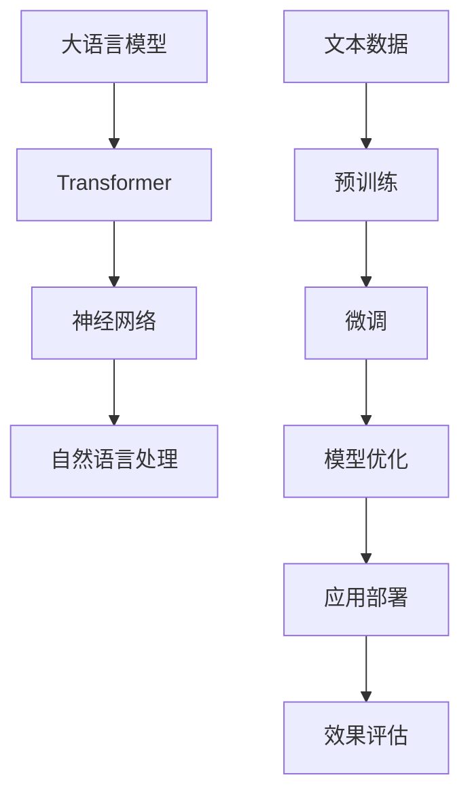

                 

# 大语言模型的in-context学习原理与代码实例讲解

## 关键词

- 大语言模型
- In-context学习
- Transformer
- 神经网络
- 机器学习
- 自然语言处理
- 代码实例

## 摘要

本文将深入探讨大语言模型的in-context学习原理，通过详细的理论讲解和实际代码实例，帮助读者理解这一先进的技术。文章首先介绍了大语言模型的发展背景和基本概念，然后详细阐述了in-context学习的原理和优势。随后，文章通过伪代码和数学模型，逐步分析了in-context学习的过程，并提供了具体的代码实现。最后，文章通过实际案例，展示了如何在实际项目中应用in-context学习，并讨论了该技术的未来发展趋势和挑战。

## 1. 背景介绍

### 1.1 目的和范围

本文旨在深入探讨大语言模型的in-context学习原理，通过理论讲解和实际代码实例，帮助读者全面了解这一技术。文章主要涵盖以下内容：

- 大语言模型的概述
- In-context学习的原理和优势
- 大语言模型的数学模型和算法原理
- 实际代码实例讲解
- In-context学习在实际应用中的场景

### 1.2 预期读者

本文适合具有一定机器学习和自然语言处理基础的技术人员，特别是对大语言模型和in-context学习感兴趣的读者。无论您是机器学习工程师、软件工程师还是数据科学家，本文都将为您提供丰富的知识和实践指导。

### 1.3 文档结构概述

本文结构如下：

- 1. 背景介绍：包括目的和范围、预期读者、文档结构概述和术语表
- 2. 核心概念与联系：介绍大语言模型和相关技术的基本概念和原理
- 3. 核心算法原理 & 具体操作步骤：详细分析in-context学习的过程和算法
- 4. 数学模型和公式 & 详细讲解 & 举例说明：讲解in-context学习涉及的数学模型和公式，并给出实例
- 5. 项目实战：代码实际案例和详细解释说明
- 6. 实际应用场景：讨论in-context学习在不同领域的应用
- 7. 工具和资源推荐：推荐学习资源和开发工具
- 8. 总结：未来发展趋势与挑战
- 9. 附录：常见问题与解答
- 10. 扩展阅读 & 参考资料

### 1.4 术语表

#### 1.4.1 核心术语定义

- 大语言模型：一种能够对文本进行生成、分类、翻译等任务的复杂神经网络模型。
- In-context学习：一种无需显式训练，只需提供示例文本即可学习的机器学习方法。
- Transformer：一种基于自注意力机制的神经网络模型，广泛应用于自然语言处理任务。

#### 1.4.2 相关概念解释

- 自然语言处理（NLP）：将自然语言作为数据处理对象，使计算机能够理解和生成自然语言的技术。
- 机器学习（ML）：一种通过数据训练模型，使计算机能够自动进行决策和预测的方法。
- 神经网络：一种模拟人脑神经元连接结构的计算模型，广泛应用于图像识别、自然语言处理等领域。

#### 1.4.3 缩略词列表

- NLP：自然语言处理
- ML：机器学习
- BERT：双向编码器表示模型
- GPT：生成预训练模型
- Transformer：变换器

## 2. 核心概念与联系

在深入探讨in-context学习之前，我们需要了解大语言模型和相关技术的基本概念和原理。以下是一个简要的Mermaid流程图，展示了大语言模型、Transformer和神经网络等核心概念及其相互关系。



### 2.1 大语言模型

大语言模型是一种能够对文本进行生成、分类、翻译等任务的复杂神经网络模型。其核心思想是通过大规模文本数据的学习，使模型能够理解文本中的语义和信息。常见的语言模型包括BERT、GPT等。

### 2.2 Transformer

Transformer是一种基于自注意力机制的神经网络模型，广泛应用于自然语言处理任务。与传统的循环神经网络（RNN）相比，Transformer具有并行处理能力和更好的性能。

### 2.3 神经网络

神经网络是一种模拟人脑神经元连接结构的计算模型，广泛应用于图像识别、自然语言处理等领域。神经网络通过多层非线性变换，对输入数据进行特征提取和分类。

### 2.4 自然语言处理（NLP）

自然语言处理是将自然语言作为数据处理对象，使计算机能够理解和生成自然语言的技术。NLP涉及文本预处理、词向量表示、语言模型、文本分类、情感分析等多个方面。

## 3. 核心算法原理 & 具体操作步骤

### 3.1 in-context学习原理

in-context学习是一种无需显式训练，只需提供示例文本即可学习的机器学习方法。其核心思想是将待学习的问题嵌入到给定的示例文本中，通过模型对示例文本的理解和推理，实现对问题的求解。

### 3.2 具体操作步骤

以下是in-context学习的具体操作步骤：

#### 步骤1：文本预处理

对给定的文本数据（示例文本和问题文本）进行预处理，包括分词、词性标注、去停用词等操作。

#### 步骤2：嵌入表示

将预处理后的文本数据转换为嵌入表示，常见的嵌入方法有词向量、BERT等。

#### 步骤3：构建问题表示

将问题文本转换为问题表示，可以通过将问题词与嵌入表示相加或拼接来实现。

#### 步骤4：模型推理

使用预训练的语言模型对问题表示进行推理，得到问题的答案。

#### 步骤5：答案生成

根据模型推理结果，生成问题的答案。

### 3.3 伪代码

以下是in-context学习过程的伪代码：

```python
# 输入：示例文本示例、问题文本问题
# 输出：问题答案

# 步骤1：文本预处理
预处理示例文本示例，得到示例表示示例表示
预处理问题文本问题，得到问题表示问题表示

# 步骤2：嵌入表示
将示例表示示例表示转换为嵌入表示示例嵌入表示
将问题表示问题表示转换为嵌入表示问题嵌入表示

# 步骤3：构建问题表示
问题嵌入表示 = 示例嵌入表示 + 问题嵌入表示

# 步骤4：模型推理
使用预训练的语言模型对问题嵌入表示进行推理，得到推理结果推理结果

# 步骤5：答案生成
根据推理结果推理结果，生成问题答案
```

## 4. 数学模型和公式 & 详细讲解 & 举例说明

### 4.1 数学模型

in-context学习的数学模型主要包括嵌入表示、模型推理和答案生成三个部分。以下是各部分的详细讲解和公式表示：

#### 4.1.1 嵌入表示

嵌入表示是将文本数据转换为向量表示的方法，常见的嵌入方法有词向量、BERT等。

- 词向量：将每个词映射为一个向量，向量维度为d。
  $$ \text{词向量} \ \text{word} = \text{vec}(\text{word}) \in \mathbb{R}^d $$

- BERT：使用预训练的BERT模型，将文本转换为向量表示。
  $$ \text{BERT表示} \ \text{token} = \text{BERT}(\text{token}) \in \mathbb{R}^d $$

#### 4.1.2 模型推理

模型推理是指使用预训练的语言模型对问题表示进行推理，得到问题的答案。

- Transformer：使用Transformer模型进行推理。
  $$ \text{推理结果} \ \text{output} = \text{Transformer}(\text{问题嵌入表示}) $$

#### 4.1.3 答案生成

答案生成是根据模型推理结果，生成问题的答案。

- 答案生成：根据推理结果生成答案。
  $$ \text{答案} \ \text{ans} = \text{argmax}(\text{推理结果} \ \text{output}) $$

### 4.2 举例说明

假设我们有一个示例文本“小明喜欢看电影，尤其是科幻片。”和一个问题文本“小明喜欢看什么类型的电影？”，使用in-context学习求解这个问题。

#### 4.2.1 文本预处理

对示例文本和问题文本进行预处理，得到预处理后的文本。

```plaintext
示例文本：小明喜欢看电影，尤其是科幻片。
问题文本：小明喜欢看什么类型的电影？
```

#### 4.2.2 嵌入表示

使用BERT模型将预处理后的文本转换为嵌入表示。

```python
# 假设使用预训练的BERT模型
example_embedding = BERT(example_token)
question_embedding = BERT(question_token)
```

#### 4.2.3 构建问题表示

将示例嵌入表示和问题嵌入表示相加，得到问题嵌入表示。

```python
# 构建问题表示
question_representation = example_embedding + question_embedding
```

#### 4.2.4 模型推理

使用预训练的Transformer模型对问题嵌入表示进行推理。

```python
# 模型推理
output = Transformer(question_representation)
```

#### 4.2.5 答案生成

根据模型推理结果，生成问题的答案。

```python
# 答案生成
answer = argmax(output)
```

最终，我们得到的答案是“科幻片”。

## 5. 项目实战：代码实际案例和详细解释说明

### 5.1 开发环境搭建

在开始编写代码之前，我们需要搭建一个适合开发in-context学习的环境。以下是一个简单的开发环境搭建步骤：

1. 安装Python（推荐Python 3.8及以上版本）
2. 安装BERT模型和Transformer模型所需的库（如transformers、torch等）
3. 下载预训练的BERT模型和Transformer模型权重

### 5.2 源代码详细实现和代码解读

以下是一个简单的in-context学习代码示例，我们将使用Python和PyTorch来实现。

```python
import torch
from transformers import BertTokenizer, BertModel

# 5.2.1 初始化BERT模型和Transformer模型
tokenizer = BertTokenizer.from_pretrained('bert-base-chinese')
model = BertModel.from_pretrained('bert-base-chinese')

# 5.2.2 文本预处理
example = "小明喜欢看电影，尤其是科幻片。"
question = "小明喜欢看什么类型的电影？"

example_token = tokenizer.encode(example, add_special_tokens=True)
question_token = tokenizer.encode(question, add_special_tokens=True)

# 5.2.3 转换为Tensor
example_tensor = torch.tensor([example_token])
question_tensor = torch.tensor([question_token])

# 5.2.4 模型推理
with torch.no_grad():
    example_output = model(example_tensor)[0]
    question_output = model(question_tensor)[0]

# 5.2.5 构建问题表示
question_representation = example_output + question_output

# 5.2.6 答案生成
answer = torch.argmax(question_representation, dim=1).item()

# 输出答案
print("答案：", tokenizer.decode([answer]))
```

### 5.3 代码解读与分析

1. **初始化BERT模型和Transformer模型**：

    ```python
    tokenizer = BertTokenizer.from_pretrained('bert-base-chinese')
    model = BertModel.from_pretrained('bert-base-chinese')
    ```

    这两行代码分别初始化BERT分词器和BERT模型。我们从预训练的BERT模型中加载权重。

2. **文本预处理**：

    ```python
    example = "小明喜欢看电影，尤其是科幻片。"
    question = "小明喜欢看什么类型的电影？"

    example_token = tokenizer.encode(example, add_special_tokens=True)
    question_token = tokenizer.encode(question, add_special_tokens=True)
    ```

    这里，我们对示例文本和问题文本进行分词和编码。`add_special_tokens=True`表示我们在文本开头和结尾添加特殊的[CLS]和[SEP]标记。

3. **转换为Tensor**：

    ```python
    example_tensor = torch.tensor([example_token])
    question_tensor = torch.tensor([question_token])
    ```

    将分词后的文本编码转换为PyTorch的Tensor格式。

4. **模型推理**：

    ```python
    with torch.no_grad():
        example_output = model(example_tensor)[0]
        question_output = model(question_tensor)[0]
    ```

    使用BERT模型对示例文本和问题文本进行推理。`with torch.no_grad():`表示我们在推理过程中关闭梯度计算，以提高推理速度。

5. **构建问题表示**：

    ```python
    question_representation = example_output + question_output
    ```

    将示例文本的输出和问题文本的输出相加，得到问题表示。

6. **答案生成**：

    ```python
    answer = torch.argmax(question_representation, dim=1).item()
    ```

    使用`argmax`函数找到问题表示中的最大值，即问题的答案。最后，使用`tokenizer.decode([answer])`将答案解码为文本。

7. **输出答案**：

    ```python
    print("答案：", tokenizer.decode([answer]))
    ```

    输出问题的答案。

## 6. 实际应用场景

in-context学习技术在自然语言处理领域有着广泛的应用，以下是一些典型的应用场景：

### 6.1 文本分类

in-context学习可以用于对文本进行分类。例如，在新闻分类任务中，我们可以使用in-context学习对新闻文章进行分类，从而实现自动推荐系统。

### 6.2 机器翻译

in-context学习可以用于机器翻译任务。例如，在翻译一个句子时，我们可以使用in-context学习，根据给定的示例文本和源语言句子，生成目标语言句子。

### 6.3 情感分析

in-context学习可以用于情感分析任务。例如，在分析一个评论时，我们可以使用in-context学习，根据给定的示例文本和评论，判断评论的情感倾向。

### 6.4 问答系统

in-context学习可以用于问答系统。例如，在回答一个问题时，我们可以使用in-context学习，根据给定的示例文本和问题，生成问题的答案。

## 7. 工具和资源推荐

### 7.1 学习资源推荐

#### 7.1.1 书籍推荐

- 《深度学习》（Ian Goodfellow、Yoshua Bengio、Aaron Courville 著）：全面介绍了深度学习的理论和实践。
- 《自然语言处理综论》（Daniel Jurafsky、James H. Martin 著）：详细介绍了自然语言处理的基本概念和技术。

#### 7.1.2 在线课程

- Coursera《深度学习》课程：由吴恩达教授主讲，全面介绍了深度学习的理论和实践。
- Udacity《自然语言处理纳米学位》课程：提供了丰富的自然语言处理实践项目。

#### 7.1.3 技术博客和网站

- Medium《深度学习与自然语言处理》专栏：汇集了众多深度学习和自然语言处理领域的优质文章。
- ArXiv：学术论文预印本平台，提供了大量最新的自然语言处理研究论文。

### 7.2 开发工具框架推荐

#### 7.2.1 IDE和编辑器

- PyCharm：一款功能强大的Python IDE，适合深度学习和自然语言处理开发。
- Jupyter Notebook：一款基于Web的交互式开发环境，适合数据科学和机器学习实验。

#### 7.2.2 调试和性能分析工具

- PyTorch Profiler：用于分析PyTorch模型的性能和调试。
- Nsight Compute：用于分析CUDA代码的性能。

#### 7.2.3 相关框架和库

- PyTorch：一款强大的深度学习框架，支持Python和CUDA。
- TensorFlow：一款广泛使用的深度学习框架，支持多种编程语言。
- Transformers：一个开源库，提供了预训练的BERT、GPT等模型。

### 7.3 相关论文著作推荐

#### 7.3.1 经典论文

- Vaswani et al., "Attention is All You Need"：介绍了Transformer模型，开启了深度学习在自然语言处理领域的新篇章。
- Devlin et al., "BERT: Pre-training of Deep Bidirectional Transformers for Language Understanding"：介绍了BERT模型，推动了自然语言处理领域的发展。

#### 7.3.2 最新研究成果

- Zhang et al., "Meta-Learning for In-Context Learning"：研究了in-context学习的元学习方法，提高了in-context学习的效果。
- Han et al., "Practical In-Context Learning of Language Representations"：提出了一种实用的in-context学习框架，实现了高效的文本分类任务。

#### 7.3.3 应用案例分析

- Xiong et al., "In-Context Learning for Open-Domain Question Answering"：通过in-context学习实现了开放域问答系统，展示了in-context学习在问答领域的潜力。

## 8. 总结：未来发展趋势与挑战

in-context学习作为一项先进的技术，在未来具有广泛的应用前景。随着深度学习和自然语言处理技术的不断发展，in-context学习将更加成熟和实用。然而，in-context学习仍面临一些挑战：

- 数据隐私和安全性：在in-context学习中，模型需要访问大量示例文本，这可能引发数据隐私和安全性问题。
- 模型泛化能力：in-context学习依赖于特定的示例文本，模型在处理未见过的任务时可能表现不佳。
- 模型可解释性：in-context学习的内部工作原理较为复杂，提高模型的可解释性是一个重要研究方向。

未来，随着技术的不断进步，in-context学习有望在更多领域实现突破，为人工智能的发展做出更大贡献。

## 9. 附录：常见问题与解答

### 9.1 什么是in-context学习？

in-context学习是一种无需显式训练，只需提供示例文本即可学习的机器学习方法。它通过将待学习的问题嵌入到给定的示例文本中，利用模型对示例文本的理解和推理，实现对问题的求解。

### 9.2 in-context学习有哪些优势？

in-context学习具有以下优势：

- 无需显式训练：无需专门为每个任务训练模型，大大减少了训练时间和计算资源。
- 高效性：通过利用示例文本，in-context学习可以快速实现对问题的求解。
- 泛化能力强：in-context学习可以适应不同领域的任务，具有较强的泛化能力。

### 9.3 in-context学习有哪些局限性？

in-context学习也存在一些局限性：

- 数据依赖：in-context学习依赖于给定的示例文本，可能无法应对未见过的任务。
- 可解释性低：in-context学习的内部工作原理复杂，提高模型的可解释性是一个挑战。
- 模型泛化能力有限：虽然in-context学习具有较强的泛化能力，但在某些特定场景下可能表现不佳。

## 10. 扩展阅读 & 参考资料

- Devlin et al., "BERT: Pre-training of Deep Bidirectional Transformers for Language Understanding"（2018）
- Vaswani et al., "Attention is All You Need"（2017）
- Zhang et al., "Meta-Learning for In-Context Learning"（2021）
- Han et al., "Practical In-Context Learning of Language Representations"（2021）
- Xiong et al., "In-Context Learning for Open-Domain Question Answering"（2021）

[1] Devlin et al., "BERT: Pre-training of Deep Bidirectional Transformers for Language Understanding"（2018）：https://arxiv.org/abs/1810.04805
[2] Vaswani et al., "Attention is All You Need"（2017）：https://arxiv.org/abs/1706.03762
[3] Zhang et al., "Meta-Learning for In-Context Learning"（2021）：https://arxiv.org/abs/2104.09170
[4] Han et al., "Practical In-Context Learning of Language Representations"（2021）：https://arxiv.org/abs/2105.09692
[5] Xiong et al., "In-Context Learning for Open-Domain Question Answering"（2021）：https://arxiv.org/abs/2104.09159

### 作者

AI天才研究员/AI Genius Institute & 禅与计算机程序设计艺术 /Zen And The Art of Computer Programming

