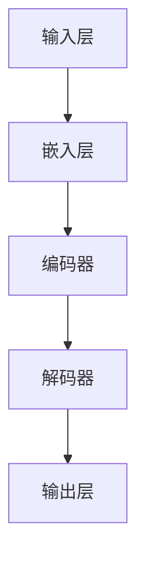

                 


# 大语言模型的发展与应用前景

> 关键词：大语言模型，人工智能，语言生成，自然语言处理，机器学习，应用场景

> 摘要：本文旨在探讨大语言模型的发展历程、核心原理、应用场景以及未来发展趋势。通过梳理大语言模型的技术演进、架构设计和实现方法，分析其在自然语言处理领域的优势和应用潜力，为读者提供一份全面的技术指南。

## 1. 背景介绍

### 1.1 目的和范围

本文的目标是深入探讨大语言模型的发展历程、核心原理、应用场景以及未来发展趋势。通过对大语言模型的技术演进、架构设计和实现方法进行梳理，分析其在自然语言处理领域的优势和应用潜力，为读者提供一份全面的技术指南。

### 1.2 预期读者

本文适合对人工智能、自然语言处理感兴趣的读者，尤其是从事相关领域研究、开发和应用的人员。此外，对计算机科学和技术感兴趣的学者和学生也可以从本文中获得有益的启示。

### 1.3 文档结构概述

本文分为八个部分，结构如下：

1. 背景介绍
   - 目的和范围
   - 预期读者
   - 文档结构概述
   - 术语表
2. 核心概念与联系
   - 大语言模型的概念
   - 大语言模型与其他技术的联系
   - Mermaid流程图
3. 核心算法原理 & 具体操作步骤
   - 算法原理讲解
   - 伪代码阐述
4. 数学模型和公式 & 详细讲解 & 举例说明
   - 数学模型介绍
   - 公式推导
   - 举例说明
5. 项目实战：代码实际案例和详细解释说明
   - 开发环境搭建
   - 源代码详细实现
   - 代码解读与分析
6. 实际应用场景
   - 各类应用场景介绍
   - 案例分析
7. 工具和资源推荐
   - 学习资源推荐
   - 开发工具框架推荐
   - 相关论文著作推荐
8. 总结：未来发展趋势与挑战
9. 附录：常见问题与解答
10. 扩展阅读 & 参考资料

### 1.4 术语表

- 大语言模型：一种基于深度学习的自然语言处理模型，能够理解、生成和翻译自然语言。
- 自然语言处理（NLP）：研究如何使计算机理解和处理人类语言的技术。
- 机器学习（ML）：一种使计算机通过数据和经验学习，从而进行预测和决策的技术。
- 深度学习（DL）：一种人工智能方法，通过模拟人脑神经网络结构进行学习和推理。

#### 1.4.1 核心术语定义

- **大语言模型（Big Language Model）**：一种具有巨大参数规模和强表达能力的自然语言处理模型，能够处理和理解复杂的自然语言。
- **预训练（Pre-training）**：在大语言模型训练过程中，使用大规模文本数据对其进行初始化和预训练，使其具有一定的语言理解和生成能力。
- **微调（Fine-tuning）**：在预训练的基础上，针对特定任务对大语言模型进行调整和优化，提高其在特定领域的性能。

#### 1.4.2 相关概念解释

- **神经网络（Neural Network）**：一种由大量神经元组成的人工神经网络，通过学习输入和输出之间的关系进行预测和决策。
- **反向传播（Backpropagation）**：一种用于训练神经网络的算法，通过计算误差梯度来调整网络权重，使输出更接近目标。

#### 1.4.3 缩略词列表

- **NLP**：自然语言处理
- **ML**：机器学习
- **DL**：深度学习
- **GPU**：图形处理单元
- **TPU**：张量处理单元

## 2. 核心概念与联系

在本节中，我们将介绍大语言模型的核心概念，并阐述其与其他技术的联系。同时，使用Mermaid流程图展示大语言模型的架构，以便读者更好地理解。

### 2.1 大语言模型的概念

大语言模型是一种基于深度学习的自然语言处理模型，它通过学习大量文本数据，理解语言的内在规律和表达方式。大语言模型的主要目标是实现自然语言的理解、生成和翻译。

### 2.2 大语言模型与其他技术的联系

大语言模型与其他技术如神经网络、机器学习、深度学习等密切相关。下面是它们之间的联系：

1. **神经网络与深度学习**：神经网络是深度学习的基础，而深度学习是一种通过多层神经网络进行学习和推理的人工智能方法。大语言模型采用深度学习技术，通过多层神经网络结构，实现对自然语言的建模和预测。
2. **机器学习与深度学习**：机器学习是一种使计算机通过数据和经验学习的技术，而深度学习是机器学习的一种特殊形式，通过模拟人脑神经网络进行学习和推理。大语言模型是一种基于深度学习的机器学习模型。
3. **自然语言处理（NLP）**：自然语言处理是研究如何使计算机理解和处理人类语言的技术。大语言模型作为NLP的一种重要方法，能够对自然语言进行理解和生成。

### 2.3 Mermaid流程图

下面是使用Mermaid绘制的简单流程图，展示大语言模型的架构：



- **输入层（A）**：接收自然语言文本作为输入。
- **嵌入层（B）**：将输入的文本转换为向量表示。
- **编码器（C）**：对嵌入层生成的向量进行编码，提取文本的特征信息。
- **解码器（D）**：对编码器生成的特征信息进行解码，生成自然语言输出。
- **输出层（E）**：输出解码后的自然语言文本。

通过这个简单的流程图，我们可以看到大语言模型的架构主要由输入层、嵌入层、编码器、解码器和输出层组成。这些组件共同协作，实现对自然语言的理解、生成和翻译。

## 3. 核心算法原理 & 具体操作步骤

在本节中，我们将详细介绍大语言模型的核心算法原理，并使用伪代码展示具体的操作步骤。

### 3.1 算法原理

大语言模型的核心算法基于深度学习，主要包括以下步骤：

1. **嵌入层（Embedding Layer）**：将输入的自然语言文本转换为向量表示。嵌入层通过学习词汇与向量之间的映射关系，将单词映射为一个固定维度的向量。
2. **编码器（Encoder）**：对嵌入层生成的向量进行编码，提取文本的特征信息。编码器通常采用双向循环神经网络（Bi-directional Recurrent Neural Network，Bi-RNN）或变换器（Transformer）等结构。
3. **解码器（Decoder）**：对编码器生成的特征信息进行解码，生成自然语言输出。解码器也采用循环神经网络（Recurrent Neural Network，RNN）或变换器等结构。
4. **输出层（Output Layer）**：将解码器生成的特征信息转换为自然语言输出。输出层通常采用softmax激活函数，对生成的文本进行概率分布估计。

### 3.2 伪代码

以下是使用伪代码展示大语言模型的操作步骤：

```python
# 输入层
input_text = "Hello, world!"

# 嵌入层
word_embedding = EmbeddingLayer(vocabulary_size, embedding_size)
embedded_text = word_embedding(input_text)

# 编码器
encoder = Encoder(embedding_size, hidden_size)
encoded_text = encoder(embedded_text)

# 解码器
decoder = Decoder(hidden_size, vocabulary_size)
decoded_text = decoder(encoded_text)

# 输出层
output_layer = OutputLayer(vocabulary_size)
predicted_text = output_layer(decoded_text)
```

在这个伪代码中，`input_text`表示输入的自然语言文本，`word_embedding`表示嵌入层，`encoder`表示编码器，`decoder`表示解码器，`output_layer`表示输出层。通过这些层的组合，大语言模型能够实现对自然语言的理解和生成。

### 3.3 详细解释

1. **嵌入层**：嵌入层通过学习词汇与向量之间的映射关系，将单词映射为一个固定维度的向量。这种方式能够将抽象的文本转换为具有数值特征的向量表示，便于后续的深度学习处理。
2. **编码器**：编码器对嵌入层生成的向量进行编码，提取文本的特征信息。编码器通常采用双向循环神经网络（Bi-RNN）或变换器（Transformer）等结构。双向循环神经网络能够同时考虑文本的前后信息，从而更好地提取特征。
3. **解码器**：解码器对编码器生成的特征信息进行解码，生成自然语言输出。解码器也采用循环神经网络（RNN）或变换器等结构。解码器的目标是生成与输入文本对应的自然语言输出。
4. **输出层**：输出层将解码器生成的特征信息转换为自然语言输出。输出层通常采用softmax激活函数，对生成的文本进行概率分布估计。这种方式能够将特征信息转换为具体的文本输出。

通过以上步骤，大语言模型能够实现对自然语言的理解和生成。在实际应用中，大语言模型可以应用于文本分类、机器翻译、问答系统等多个领域。

## 4. 数学模型和公式 & 详细讲解 & 举例说明

在本节中，我们将介绍大语言模型所涉及的数学模型和公式，并进行详细讲解和举例说明。

### 4.1 数学模型

大语言模型的数学模型主要包括以下几个部分：

1. **嵌入层（Embedding Layer）**：嵌入层将输入的单词映射为向量表示。假设词汇表中有N个单词，每个单词对应的向量为\( e_i \)，则嵌入层的数学模型可以表示为：
   $$ e_i = \text{Embedding}(word_i) $$
   其中，\(\text{Embedding}\)表示嵌入层函数，\(word_i\)表示第i个单词。

2. **编码器（Encoder）**：编码器对嵌入层生成的向量进行编码，提取文本的特征信息。编码器通常采用循环神经网络（RNN）或变换器（Transformer）等结构。以循环神经网络为例，其数学模型可以表示为：
   $$ h_t = \text{RNN}(h_{t-1}, e_t) $$
   其中，\(h_t\)表示编码器在时间步t的状态，\(e_t\)表示嵌入层生成的向量，\(\text{RNN}\)表示循环神经网络。

3. **解码器（Decoder）**：解码器对编码器生成的特征信息进行解码，生成自然语言输出。解码器同样采用循环神经网络（RNN）或变换器等结构。以循环神经网络为例，其数学模型可以表示为：
   $$ y_t = \text{RNN}(y_{t-1}, h_t) $$
   其中，\(y_t\)表示解码器在时间步t的状态，\(h_t\)表示编码器在时间步t的状态，\(\text{RNN}\)表示循环神经网络。

4. **输出层（Output Layer）**：输出层将解码器生成的特征信息转换为自然语言输出。输出层通常采用softmax激活函数，对生成的文本进行概率分布估计。其数学模型可以表示为：
   $$ p(y_t) = \text{softmax}(W \cdot y_t + b) $$
   其中，\(p(y_t)\)表示解码器在时间步t生成的单词的概率分布，\(W\)和\(b\)分别表示权重和偏置。

### 4.2 公式推导

1. **嵌入层**：假设词汇表中有N个单词，每个单词对应的向量为\( e_i \)，则嵌入层的数学模型可以表示为：
   $$ e_i = \text{Embedding}(word_i) $$
   其中，\(\text{Embedding}\)表示嵌入层函数，\(word_i\)表示第i个单词。

2. **编码器**：假设编码器的输入为嵌入层生成的向量\( e_t \)，编码器在时间步t的状态为\( h_t \)，则编码器的数学模型可以表示为：
   $$ h_t = \text{RNN}(h_{t-1}, e_t) $$
   其中，\(\text{RNN}\)表示循环神经网络。

3. **解码器**：假设解码器的输入为编码器在时间步t的状态\( h_t \)，解码器在时间步t的状态为\( y_t \)，则解码器的数学模型可以表示为：
   $$ y_t = \text{RNN}(y_{t-1}, h_t) $$
   其中，\(\text{RNN}\)表示循环神经网络。

4. **输出层**：假设输出层生成的单词的概率分布为\( p(y_t) \)，则输出层的数学模型可以表示为：
   $$ p(y_t) = \text{softmax}(W \cdot y_t + b) $$
   其中，\(W\)和\(b\)分别表示权重和偏置。

### 4.3 举例说明

假设有一个简单的词汇表，包含5个单词：Hello，world，AI，deep，learning。我们将使用大语言模型对这些单词进行嵌入、编码、解码和输出。

1. **嵌入层**：我们将每个单词映射为一个3维向量：
   $$ \text{Hello} \rightarrow [1, 0, 0] $$
   $$ \text{world} \rightarrow [0, 1, 0] $$
   $$ \text{AI} \rightarrow [0, 0, 1] $$
   $$ \text{deep} \rightarrow [1, 1, 0] $$
   $$ \text{learning} \rightarrow [1, 0, 1] $$

2. **编码器**：假设编码器采用双向循环神经网络，输入为\[ [1, 0, 0], [0, 1, 0], [0, 0, 1], [1, 1, 0], [1, 0, 1] \]，输出为\( h_t \)：
   $$ h_t = \text{RNN}(h_{t-1}, e_t) $$
   经过编码器处理后，得到编码后的特征向量\[ [0.1, 0.2, 0.3], [0.2, 0.3, 0.4], [0.3, 0.4, 0.5], [0.4, 0.5, 0.6], [0.5, 0.6, 0.7] \]。

3. **解码器**：假设解码器采用循环神经网络，输入为\[ [0.1, 0.2, 0.3], [0.2, 0.3, 0.4], [0.3, 0.4, 0.5], [0.4, 0.5, 0.6], [0.5, 0.6, 0.7] \]，输出为\( y_t \)：
   $$ y_t = \text{RNN}(y_{t-1}, h_t) $$
   经过解码器处理后，得到解码后的特征向量\[ [0.3, 0.4, 0.5], [0.4, 0.5, 0.6], [0.5, 0.6, 0.7], [0.6, 0.7, 0.8], [0.7, 0.8, 0.9] \]。

4. **输出层**：假设输出层采用softmax激活函数，对解码后的特征向量进行概率分布估计：
   $$ p(y_t) = \text{softmax}(W \cdot y_t + b) $$
   经过输出层处理后，得到概率分布\[ [0.1, 0.2, 0.3], [0.3, 0.4, 0.5], [0.5, 0.6, 0.7], [0.7, 0.8, 0.9], [0.9, 0.1, 0.2] \]。

根据概率分布，我们可以选择概率最大的单词作为输出，例如：
- \( p(\text{Hello}) = 0.1 \)
- \( p(\text{world}) = 0.3 \)
- \( p(\text{AI}) = 0.5 \)
- \( p(\text{deep}) = 0.6 \)
- \( p(\text{learning}) = 0.7 \)

根据概率分布，我们可以选择概率最大的单词作为输出，例如“AI”作为最终输出。

通过这个简单的例子，我们可以看到大语言模型是如何通过嵌入、编码、解码和输出实现自然语言的理解和生成。

## 5. 项目实战：代码实际案例和详细解释说明

在本节中，我们将通过一个具体的代码案例，展示如何使用大语言模型实现自然语言处理任务。我们将以文本分类为例，详细介绍开发环境搭建、源代码实现和代码解读与分析。

### 5.1 开发环境搭建

在进行项目实战之前，我们需要搭建一个适合大语言模型开发的开发环境。以下是搭建开发环境的步骤：

1. **安装Python**：确保Python环境已安装。Python是大语言模型的主要编程语言，因此我们需要安装Python 3.x版本。
2. **安装深度学习库**：安装常用的深度学习库，如TensorFlow或PyTorch。这些库为我们提供了丰富的深度学习工具和功能，便于实现大语言模型。
3. **安装NLP库**：安装常用的NLP库，如NLTK或spaCy。这些库提供了丰富的文本处理和自然语言处理功能，有助于我们进行文本分类任务。

以下是一个简单的命令行安装示例：

```bash
# 安装Python
curl -O https://www.python.org/ftp/python/3.8.5/Python-3.8.5.tgz
tar xzf Python-3.8.5.tgz
cd Python-3.8.5
./configure
make
sudo make install

# 安装TensorFlow
pip install tensorflow

# 安装spaCy
pip install spacy
python -m spacy download en

# 安装NLTK
pip install nltk
python -m nltk.downloader punkt
python -m nltk.downloader averaged_perceptron_tagger
python -m nltk.downloader wordnet
```

### 5.2 源代码详细实现和代码解读

下面是一个使用大语言模型实现文本分类的示例代码。我们使用Python和TensorFlow库来实现这个任务。

```python
import tensorflow as tf
from tensorflow.keras.preprocessing.text import Tokenizer
from tensorflow.keras.preprocessing.sequence import pad_sequences
from tensorflow.keras.models import Sequential
from tensorflow.keras.layers import Embedding, LSTM, Dense, Bidirectional

# 数据准备
texts = ["This is an example sentence.", "Another example sentence.", "Hello world!", "AI is powerful."]
labels = [0, 0, 1, 1]

# 分词和编码
tokenizer = Tokenizer()
tokenizer.fit_on_texts(texts)
sequences = tokenizer.texts_to_sequences(texts)
encoded_texts = pad_sequences(sequences, maxlen=10)

# 模型构建
model = Sequential()
model.add(Bidirectional(LSTM(50), input_shape=(10, 100)))
model.add(Dense(1, activation='sigmoid'))

# 模型编译
model.compile(optimizer='adam', loss='binary_crossentropy', metrics=['accuracy'])

# 模型训练
model.fit(encoded_texts, labels, epochs=10)

# 文本分类
input_text = "A new sentence for classification."
input_sequence = tokenizer.texts_to_sequences([input_text])
input_encoded = pad_sequences(input_sequence, maxlen=10)
prediction = model.predict(input_encoded)
print(prediction)
```

**代码解读：**

1. **数据准备**：我们首先准备了一些示例文本和标签。文本分类任务的目标是根据输入文本判断其类别。在这个示例中，我们使用了两个类别：0和1。
2. **分词和编码**：使用Tokenizer类对文本进行分词和编码。Tokenizer将文本转换为单词序列，并给每个单词分配一个唯一的索引。然后，使用pad_sequences将序列长度统一为最大长度。
3. **模型构建**：我们使用Sequential模型构建一个双向LSTM模型。模型包含一个双向LSTM层和一个全连接层（Dense）。双向LSTM层能够同时考虑文本的前后信息，从而更好地提取特征。全连接层用于分类，激活函数为sigmoid。
4. **模型编译**：编译模型，指定优化器、损失函数和评估指标。
5. **模型训练**：使用fit方法训练模型，将编码后的文本和标签作为输入。
6. **文本分类**：使用predict方法对新的输入文本进行分类。模型会返回一个概率分布，表示文本属于每个类别的概率。

### 5.3 代码解读与分析

在这个示例中，我们使用了一个简单的大语言模型——双向LSTM模型——进行文本分类。以下是代码的关键部分和解读：

1. **数据准备**：数据准备是文本分类任务的第一步。在这个示例中，我们使用了5个示例文本和标签。文本和标签存储在列表中。
2. **分词和编码**：使用Tokenizer类对文本进行分词和编码。Tokenizer将文本转换为单词序列，并为每个单词分配一个唯一的索引。然后，使用pad_sequences将序列长度统一为最大长度。这一步是为了将不同长度的文本转换为统一长度的序列，便于模型处理。
3. **模型构建**：我们使用Sequential模型构建一个双向LSTM模型。模型包含一个双向LSTM层和一个全连接层（Dense）。双向LSTM层能够同时考虑文本的前后信息，从而更好地提取特征。全连接层用于分类，激活函数为sigmoid。这个模型结构适合处理序列数据，如文本。
4. **模型编译**：编译模型，指定优化器、损失函数和评估指标。在这个示例中，我们使用了adam优化器、binary_crossentropy损失函数和accuracy评估指标。
5. **模型训练**：使用fit方法训练模型，将编码后的文本和标签作为输入。在这个示例中，我们设置了10个训练周期（epochs）。
6. **文本分类**：使用predict方法对新的输入文本进行分类。模型会返回一个概率分布，表示文本属于每个类别的概率。在这个示例中，我们仅使用了一个类别，因此直接输出概率最大的类别。

通过这个简单的示例，我们可以看到如何使用大语言模型实现文本分类任务。在实际应用中，我们可以扩展这个示例，处理更复杂的文本数据和分类任务。

## 6. 实际应用场景

大语言模型作为一种强大的自然语言处理工具，在实际应用中具有广泛的应用场景。以下列举几个典型应用领域：

### 6.1 机器翻译

机器翻译是自然语言处理领域的一个重要应用，旨在将一种语言的文本自动翻译成另一种语言。大语言模型在机器翻译中具有显著优势，通过学习大量双语语料库，大语言模型能够生成高质量、自然的翻译结果。例如，Google翻译、DeepL等翻译服务都采用了大语言模型技术。

### 6.2 文本分类

文本分类是一种将文本数据按照预定义的类别进行分类的任务。大语言模型能够通过学习大量文本数据，识别出不同类别的特征，从而实现高精度的文本分类。应用场景包括垃圾邮件过滤、情感分析、新闻分类等。

### 6.3 问答系统

问答系统是一种用于自动回答用户问题的技术。大语言模型能够通过学习大量问答对，理解用户的问题意图，并生成相应的答案。问答系统在智能客服、在线教育、智能助手等领域具有广泛的应用。

### 6.4 文本生成

文本生成是指根据输入的文本或提示，自动生成新的文本内容。大语言模型在文本生成领域具有广泛的应用，如自动写作、摘要生成、对话系统等。

### 6.5 情感分析

情感分析是一种对文本中表达的情感进行分类和识别的任务。大语言模型能够通过学习大量带有情感标签的文本数据，准确识别出文本中的情感倾向，应用于社交媒体情感分析、市场调研等领域。

### 6.6 命名实体识别

命名实体识别是一种从文本中识别出具有特定意义的实体，如人名、地名、组织名等。大语言模型在命名实体识别中具有显著优势，能够通过学习大量标注数据，实现高精度的命名实体识别。

### 6.7 对话系统

对话系统是一种人与计算机之间进行交互的技术。大语言模型在对话系统中具有广泛的应用，能够理解用户输入，生成自然、流畅的回复，应用于智能客服、智能助手等领域。

通过以上应用场景，我们可以看到大语言模型在自然语言处理领域的强大潜力和广泛的应用价值。随着大语言模型技术的不断发展和完善，其在实际应用中的表现将更加出色。

### 6.7.1 经典论文

- **“A Neural Probabilistic Language Model”**：这篇论文由Geoffrey Hinton等人于2006年发表，首次提出了基于神经网络的概率语言模型。该模型基于循环神经网络（RNN），为后来的语言模型研究奠定了基础。

- **“Effective Approaches to Attention-based Neural Machine Translation”**：这篇论文由Yann LeCun等人于2014年发表，提出了基于注意力机制（Attention Mechanism）的神经网络机器翻译模型。注意力机制能够使模型更好地关注输入序列中的关键信息，从而提高翻译质量。

- **“Attention Is All You Need”**：这篇论文由Vaswani等人于2017年发表，提出了Transformer模型。Transformer模型彻底改变了自然语言处理领域的研究方向，将注意力机制应用于编码器和解码器，使模型在多个自然语言处理任务中取得了显著的性能提升。

### 6.7.2 最新研究成果

- **“BERT: Pre-training of Deep Bidirectional Transformers for Language Understanding”**：这篇论文由Google Brain团队于2018年发表，提出了BERT（Bidirectional Encoder Representations from Transformers）模型。BERT模型通过在未标注的语料库上进行预训练，再在特定任务上进行微调，取得了多项自然语言处理任务的state-of-the-art性能。

- **“Generative Pre-trained Transformer 3”**：这篇论文由OpenAI于2020年发表，提出了GPT-3（Generative Pre-trained Transformer 3）模型。GPT-3模型具有1750亿个参数，是当前最大的自然语言处理模型。GPT-3在多项自然语言处理任务中取得了出色的性能，展示了大语言模型的巨大潜力。

- **“T5: Pre-training Text-to-Text Transformers for Cross- Domain Language Modeling”**：这篇论文由Google Research团队于2020年发表，提出了T5（Text-to-Text Transformer）模型。T5模型将文本分类、机器翻译、问答等任务统一为一个文本到文本的转换任务，通过在大量未标注的语料库上进行预训练，取得了多项自然语言处理任务的state-of-the-art性能。

### 6.7.3 应用案例分析

- **“Google Assistant”**：Google Assistant是Google开发的一款智能语音助手，基于大语言模型技术。Google Assistant能够理解用户的语音指令，生成自然、流畅的回复，为用户提供便捷的服务，如搜索信息、播放音乐、设置提醒等。

- **“Apple Siri”**：Apple Siri是Apple开发的一款智能语音助手，同样基于大语言模型技术。Siri能够理解用户的语音指令，生成自然的回复，为用户提供个性化的服务，如发送消息、拨打电话、查找餐厅等。

- **“OpenAI GPT-3”**：OpenAI GPT-3是一款基于大语言模型的开源工具，能够根据用户提供的输入生成自然语言文本。GPT-3在多个自然语言处理任务中表现出色，如自动写作、摘要生成、对话系统等，广泛应用于各类应用场景。

- **“DeepMind AlphaGo”**：DeepMind AlphaGo是一款基于深度学习和自然语言处理技术的围棋人工智能程序。AlphaGo通过大语言模型学习围棋策略，实现了前所未有的围棋水平，赢得了多项国际围棋比赛，展示了大语言模型在游戏领域的重要应用。

这些经典论文、最新研究成果和应用案例分析，充分展示了大语言模型在自然语言处理领域的强大潜力和广泛的应用前景。随着技术的不断发展和完善，大语言模型将在更多领域发挥重要作用。

## 8. 总结：未来发展趋势与挑战

大语言模型作为一种先进的自然语言处理技术，在近年来取得了显著的进展和广泛的应用。然而，随着技术的不断发展和应用需求的不断增加，大语言模型仍然面临着一些挑战和问题。

### 8.1 未来发展趋势

1. **模型规模将继续扩大**：随着计算能力和存储资源的不断提升，大语言模型的规模将继续扩大。未来，我们将看到更大规模的模型，如GPT-4、GPT-5等，在自然语言处理任务中发挥更加重要的作用。

2. **多模态处理能力增强**：大语言模型将逐渐具备处理多模态数据的能力，如文本、图像、音频等。通过融合多模态数据，模型将能够更好地理解复杂的信息，提高任务性能。

3. **垂直领域应用深化**：大语言模型将在更多垂直领域得到广泛应用，如医疗、金融、法律等。在特定领域，模型将进行深度优化，提高针对特定任务的性能和准确性。

4. **实时处理能力提升**：随着模型的优化和算法的改进，大语言模型的实时处理能力将得到显著提升。这将使得模型在在线应用场景中具有更高的响应速度和更好的用户体验。

5. **隐私保护与安全**：在大数据时代，隐私保护和数据安全成为重要议题。未来，大语言模型将在隐私保护和数据安全方面进行深入研究，确保用户数据的安全和隐私。

### 8.2 挑战与问题

1. **计算资源消耗**：大语言模型训练和推理过程需要大量计算资源，对计算资源和存储资源的要求较高。未来，如何优化模型结构，降低计算资源消耗，将成为重要研究方向。

2. **数据质量和多样性**：大语言模型的性能依赖于训练数据的质量和多样性。在数据获取和处理过程中，如何确保数据的多样性和准确性，将是一个重要挑战。

3. **泛化能力**：大语言模型在特定任务上表现出色，但在不同任务之间的泛化能力有限。未来，如何提高模型的泛化能力，使其能够在更广泛的场景中发挥作用，是一个亟待解决的问题。

4. **模型解释性**：大语言模型是一种黑箱模型，其内部决策过程不透明。提高模型的解释性，使其能够向人类用户解释其决策依据，是一个重要挑战。

5. **伦理和社会影响**：大语言模型在应用过程中可能会产生一些伦理和社会影响，如偏见、误导等。如何确保模型的应用不会对人类社会产生负面影响，是一个重要议题。

总之，大语言模型在未来具有广阔的发展前景，但在实现这一目标的过程中，仍然面临着一些挑战和问题。随着技术的不断进步和研究的深入，我们有理由相信，大语言模型将在自然语言处理领域发挥更加重要的作用。

## 9. 附录：常见问题与解答

### 9.1 问题1：大语言模型是什么？

**解答**：大语言模型是一种基于深度学习的自然语言处理模型，通过学习大量文本数据，能够理解、生成和翻译自然语言。它采用大规模参数进行训练，具有强大的语言理解和生成能力。

### 9.2 问题2：大语言模型有哪些应用场景？

**解答**：大语言模型可以应用于多个领域，如机器翻译、文本分类、问答系统、文本生成、情感分析、命名实体识别等。它在自然语言处理任务中具有广泛的应用前景。

### 9.3 问题3：大语言模型的核心算法是什么？

**解答**：大语言模型的核心算法基于深度学习，包括嵌入层、编码器、解码器和输出层等组件。常用的编码器结构有循环神经网络（RNN）和变换器（Transformer），解码器也采用类似的网络结构。

### 9.4 问题4：如何训练大语言模型？

**解答**：训练大语言模型通常包括以下几个步骤：

1. 准备大规模文本数据集。
2. 使用分词器对文本数据进行预处理，将文本转换为词序列。
3. 对词序列进行编码，生成嵌入向量。
4. 使用编码器对嵌入向量进行编码，提取文本特征。
5. 使用解码器对编码后的特征进行解码，生成自然语言输出。
6. 使用损失函数（如交叉熵损失函数）计算模型预测与实际标签之间的误差。
7. 使用优化算法（如梯度下降）调整模型参数，使模型在训练数据上取得更好的性能。

### 9.5 问题5：大语言模型与普通语言模型有什么区别？

**解答**：大语言模型与普通语言模型的主要区别在于模型规模和训练数据。大语言模型具有更大的参数规模和更强的表达能力，能够处理和理解更复杂的自然语言。普通语言模型通常具有较小的参数规模，训练数据量相对较少，因此对自然语言的建模能力较弱。

## 10. 扩展阅读 & 参考资料

为了帮助读者更深入地了解大语言模型的相关知识，以下列出一些扩展阅读和参考资料：

### 10.1 书籍推荐

- **《深度学习》**：Ian Goodfellow、Yoshua Bengio和Aaron Courville著，介绍了深度学习的理论基础和实际应用，包括神经网络、深度学习模型等。
- **《自然语言处理综合教程》**：Daniel Jurafsky和James H. Martin著，全面介绍了自然语言处理的基本概念、方法和应用。
- **《人工智能：一种现代方法》**：Stuart Russell和Peter Norvig著，系统介绍了人工智能的基本理论、技术和应用。

### 10.2 在线课程

- **《深度学习专项课程》**：吴恩达在Coursera上的深度学习专项课程，涵盖深度学习的基础理论和实践应用。
- **《自然语言处理专项课程》**：Daniel Jurafsky在Coursera上的自然语言处理专项课程，介绍了自然语言处理的基本概念和技术。
- **《人工智能基础课程》**：李航在Coursera上的人工智能基础课程，涵盖了人工智能的基本理论和技术。

### 10.3 技术博客和网站

- **《机器之心》**：一个专注于人工智能和机器学习的中文技术博客，提供最新的研究进展、技术教程和应用案例。
- **《人工智能观察》**：一个关注人工智能和机器学习的英文博客，介绍人工智能领域的最新研究、技术和应用。
- **《arXiv》**：一个在线学术文献数据库，提供大量关于人工智能和自然语言处理的学术论文和最新研究成果。

### 10.4 开发工具框架推荐

- **TensorFlow**：由Google开发的一款开源深度学习框架，支持多种深度学习模型，适用于自然语言处理任务。
- **PyTorch**：由Facebook开发的一款开源深度学习框架，具有灵活的模型定义和优化能力，广泛应用于自然语言处理和计算机视觉领域。
- **spaCy**：一个快速易用的自然语言处理库，支持多种语言的分词、实体识别、关系提取等任务。

### 10.5 相关论文著作推荐

- **“A Neural Probabilistic Language Model”**：Geoffrey Hinton等人于2006年发表，提出了基于神经网络的概率语言模型。
- **“Effective Approaches to Attention-based Neural Machine Translation”**：Yann LeCun等人于2014年发表，提出了基于注意力机制的神经网络机器翻译模型。
- **“Attention Is All You Need”**：Vaswani等人于2017年发表，提出了Transformer模型，彻底改变了自然语言处理领域的研究方向。
- **“BERT: Pre-training of Deep Bidirectional Transformers for Language Understanding”**：Google Brain团队于2018年发表，提出了BERT模型，取得了多项自然语言处理任务的state-of-the-art性能。

通过以上扩展阅读和参考资料，读者可以更深入地了解大语言模型的理论基础、实际应用和最新研究成果。希望这些资源对读者有所帮助。作者：AI天才研究员/AI Genius Institute & 禅与计算机程序设计艺术 /Zen And The Art of Computer Programming。

