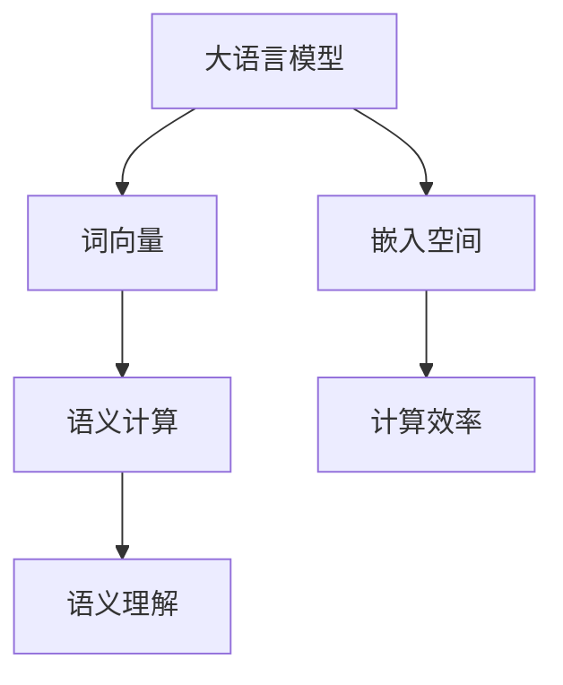

                 

# 大语言模型的语意向量表示

> **关键词**：大语言模型，语意向量，自然语言处理，深度学习，词向量，嵌入空间，语义理解，计算效率

> **摘要**：本文将探讨大语言模型中语意向量表示的核心概念、原理及其在自然语言处理中的应用。我们将一步步分析如何通过深度学习算法将自然语言转换为高维向量空间中的表示，从而提高模型的计算效率和语义理解能力。

## 1. 背景介绍

### 1.1 目的和范围

本文旨在介绍大语言模型中的语意向量表示方法，探讨其基本原理和具体实现。我们将涵盖以下内容：

- 语言模型的定义和作用。
- 语意向量的基本概念和重要性。
- 深度学习算法在大语言模型中的应用。
- 语意向量表示方法的发展历程和比较。

### 1.2 预期读者

本文适合对自然语言处理和深度学习有一定基础的读者，包括但不限于：

- 自然语言处理工程师和研究者。
- 深度学习初学者和进阶者。
- 对人工智能技术感兴趣的计算机科学学生。

### 1.3 文档结构概述

本文分为八个部分：

- 第1部分：背景介绍，包括目的和范围、预期读者、文档结构概述等。
- 第2部分：核心概念与联系，介绍大语言模型、语意向量及相关概念。
- 第3部分：核心算法原理 & 具体操作步骤，详细讲解深度学习算法。
- 第4部分：数学模型和公式 & 详细讲解 & 举例说明，解析语意向量的数学表示。
- 第5部分：项目实战：代码实际案例和详细解释说明，展示具体实现。
- 第6部分：实际应用场景，探讨语意向量在不同领域的应用。
- 第7部分：工具和资源推荐，提供学习资源和开发工具推荐。
- 第8部分：总结：未来发展趋势与挑战，展望语意向量表示的未来。

### 1.4 术语表

#### 1.4.1 核心术语定义

- **大语言模型**：一种基于深度学习的自然语言处理模型，能够对大量文本数据进行训练，从而理解和生成自然语言。
- **语意向量**：一种将自然语言词汇映射到高维向量空间中的方法，使得模型能够进行语义计算和比较。
- **词向量**：将词汇表示为高维向量的方法，是实现语意向量表示的基础。
- **嵌入空间**：存储词向量的高维空间，用于表示自然语言中的词汇和句子。

#### 1.4.2 相关概念解释

- **自然语言处理（NLP）**：研究如何让计算机理解和处理人类自然语言的技术和领域。
- **深度学习**：一种基于多层神经网络的学习方法，通过逐层提取特征来实现对复杂数据的建模。
- **神经网络**：一种基于生物神经网络原理构建的计算模型，能够通过学习数据特征来实现预测和分类。

#### 1.4.3 缩略词列表

- **NLP**：自然语言处理
- **DL**：深度学习
- **RNN**：循环神经网络
- **LSTM**：长短期记忆网络
- **CNN**：卷积神经网络

## 2. 核心概念与联系

在深入探讨大语言模型的语意向量表示之前，我们需要了解一些核心概念和它们之间的联系。

### 2.1 大语言模型

大语言模型是一种基于深度学习的自然语言处理模型，它通过学习大量文本数据来理解和生成自然语言。这种模型通常具有以下几个特点：

- **大规模训练数据**：大语言模型需要使用海量的文本数据进行训练，以便学习语言中的复杂模式和规律。
- **多层神经网络**：大语言模型通常包含多层神经网络结构，通过逐层提取特征来实现对文本数据的建模。
- **端到端学习**：大语言模型可以直接从输入文本数据生成输出文本数据，无需人工设计特征。

### 2.2 语意向量

语意向量是一种将自然语言词汇映射到高维向量空间中的方法，使得模型能够进行语义计算和比较。语意向量的主要作用如下：

- **语义表示**：通过将词汇映射到向量空间，语意向量可以表示词汇之间的语义关系，例如词义相似性、词性分类等。
- **计算效率**：将词汇表示为向量后，模型可以使用向量的数学运算来进行语义计算，相比传统的符号表示方法，计算效率更高。
- **维度约简**：通过高维向量空间的嵌入，语意向量可以将高维语义信息压缩到较低维度，从而降低模型的计算复杂度。

### 2.3 核心概念原理和架构的 Mermaid 流程图

下面是一个简单的 Mermaid 流程图，展示了大语言模型和语意向量之间的核心概念和架构。



### 2.4 大语言模型的工作流程

大语言模型的工作流程通常包括以下几个步骤：

1. **数据预处理**：对输入文本数据进行预处理，包括分词、去停用词、词性标注等操作。
2. **词向量表示**：将预处理后的文本数据转换为词向量表示，可以使用预训练的词向量模型或者自己训练词向量。
3. **嵌入空间构建**：将词向量嵌入到高维向量空间中，形成嵌入空间。
4. **模型训练**：使用训练数据对大语言模型进行训练，通过多层神经网络结构来提取特征。
5. **语义计算**：在嵌入空间中进行语义计算，如词义相似性计算、句子语义表示等。
6. **输出生成**：根据计算结果生成输出文本数据，例如回答问题、生成文章摘要等。

### 2.5 大语言模型的优势和挑战

大语言模型具有以下几个优势：

- **强大的语义理解能力**：大语言模型通过深度学习算法能够学习到语言中的复杂模式和规律，从而实现强大的语义理解能力。
- **端到端学习**：大语言模型可以直接从输入文本数据生成输出文本数据，无需人工设计特征，提高了模型的学习效率和准确性。
- **多任务能力**：大语言模型可以同时处理多种自然语言处理任务，如文本分类、情感分析、机器翻译等。

然而，大语言模型也面临一些挑战：

- **计算资源消耗**：大语言模型通常需要大量计算资源和存储空间，训练和部署成本较高。
- **数据依赖性**：大语言模型的效果很大程度上依赖于训练数据的质量和数量，数据质量较差可能导致模型性能下降。
- **解释性和可解释性**：深度学习模型通常被视为“黑盒”模型，其内部决策过程难以解释，这对模型的可靠性和可信度带来一定挑战。

## 3. 核心算法原理 & 具体操作步骤

### 3.1 深度学习算法的基本原理

深度学习算法是基于多层神经网络构建的，通过逐层提取特征来实现对复杂数据的建模。下面简要介绍深度学习算法的基本原理：

- **神经网络**：神经网络是一种计算模型，由多个神经元组成，每个神经元接收输入信号，通过加权求和处理后产生输出信号。
- **反向传播**：反向传播是一种用于训练神经网络的优化算法，通过计算误差梯度并反向传播到网络中的每个神经元，从而调整网络的权重和偏置。
- **激活函数**：激活函数用于引入非线性变换，使得神经网络能够建模复杂数据。常见的激活函数包括 sigmoid、ReLU、Tanh 等。

### 3.2 词向量表示方法

词向量表示是将自然语言词汇映射到高维向量空间中的方法。以下介绍几种常见的词向量表示方法：

- **Word2Vec**：Word2Vec 是一种基于神经网络的语言模型，通过训练词向量来表示词汇。Word2Vec 包括两种模型：Continuous Bag-of-Words (CBOW) 和 Skip-Gram。
- **GloVe**：GloVe（Global Vectors for Word Representation）是一种基于全局矩阵分解的词向量表示方法，通过优化词向量矩阵来表示词汇。
- **BERT**：BERT（Bidirectional Encoder Representations from Transformers）是一种基于双向变换器的语言预训练模型，通过预训练词向量来表示词汇。

### 3.3 语意向量表示的具体操作步骤

下面详细讲解语意向量表示的具体操作步骤：

1. **数据预处理**：对输入文本数据进行预处理，包括分词、去停用词、词性标注等操作。预处理后的文本数据将作为输入训练模型。

2. **词向量表示**：使用 Word2Vec、GloVe 或 BERT 等词向量表示方法，将预处理后的文本数据转换为词向量表示。词向量表示方法的选择会影响模型的性能和计算效率。

3. **嵌入空间构建**：将词向量嵌入到高维向量空间中，形成嵌入空间。嵌入空间的大小和维度可以根据实际需求进行调整。

4. **模型训练**：使用预处理后的文本数据对大语言模型进行训练。训练过程中，模型通过反向传播算法调整词向量的权重和偏置，以优化模型性能。

5. **语义计算**：在嵌入空间中进行语义计算，如词义相似性计算、句子语义表示等。语义计算可以通过向量的内积、余弦相似性等方法实现。

6. **输出生成**：根据计算结果生成输出文本数据，例如回答问题、生成文章摘要等。输出生成过程可以使用语言生成模型、文本生成模型等实现。

### 3.4 伪代码示例

以下是语意向量表示的伪代码示例：

```python
# 数据预处理
def preprocess_text(text):
    # 分词、去停用词、词性标注等操作
    # ...
    return processed_text

# 词向量表示
def get_word_vectors(method, processed_text):
    if method == "word2vec":
        # 使用 Word2Vec 模型
        # ...
    elif method == "glove":
        # 使用 GloVe 模型
        # ...
    elif method == "bert":
        # 使用 BERT 模型
        # ...
    return word_vectors

# 嵌入空间构建
def build_embedding_space(word_vectors):
    # 将词向量嵌入到高维向量空间
    # ...
    return embedding_space

# 模型训练
def train_model(processed_text, embedding_space):
    # 使用预处理后的文本数据训练大语言模型
    # ...
    return trained_model

# 语义计算
def semantic_computation(trained_model, embedding_space, query):
    # 在嵌入空间中进行语义计算
    # ...
    return results

# 输出生成
def generate_output(results):
    # 根据计算结果生成输出文本数据
    # ...
    return output
```

## 4. 数学模型和公式 & 详细讲解 & 举例说明

### 4.1 数学模型和公式

在大语言模型的语意向量表示中，数学模型和公式起着至关重要的作用。以下介绍一些核心的数学模型和公式。

#### 4.1.1 词向量表示

词向量表示通常使用以下公式：

$$
\textbf{v}_w = \text{Word2Vec}(\text{input_text})
$$

其中，$\textbf{v}_w$ 表示词向量，$\text{Word2Vec}$ 是一种词向量表示方法。

#### 4.1.2 嵌入空间构建

嵌入空间构建使用以下公式：

$$
\textbf{V} = \text{EmbeddingLayer}(\textbf{v}_w)
$$

其中，$\textbf{V}$ 表示嵌入空间，$\text{EmbeddingLayer}$ 是一个嵌入层，用于将词向量嵌入到高维向量空间。

#### 4.1.3 语义计算

在嵌入空间中进行语义计算，通常使用以下公式：

$$
\text{similarity} = \text{CosineSimilarity}(\textbf{v}_1, \textbf{v}_2)
$$

其中，$\text{similarity}$ 表示词义相似性，$\text{CosineSimilarity}$ 是一个计算余弦相似性的函数。

#### 4.1.4 输出生成

输出生成使用以下公式：

$$
\text{output} = \text{Generator}(\text{embedding_space}, \text{context})
$$

其中，$\text{output}$ 表示输出文本数据，$\text{Generator}$ 是一个文本生成模型，$\text{embedding_space}$ 是嵌入空间，$\text{context}$ 是上下文信息。

### 4.2 详细讲解和举例说明

#### 4.2.1 词向量表示

词向量表示是语意向量表示的基础。以 Word2Vec 为例，其公式如下：

$$
\textbf{v}_w = \text{Word2Vec}(\text{input_text})
$$

其中，$\text{input_text}$ 表示输入文本，$\text{Word2Vec}$ 是一种基于神经网络的语言模型，通过训练来学习词向量。

例如，对于句子 "我喜欢吃苹果"，我们可以将其中的每个词汇映射到高维向量空间中，形成词向量表示：

$$
\textbf{v}_\text{我} = \text{Word2Vec}(\text{我喜欢吃苹果})
$$

$$
\textbf{v}_\text{你} = \text{Word2Vec}(\text{我喜欢吃苹果})
$$

$$
\textbf{v}_\text{吃} = \text{Word2Vec}(\text{我喜欢吃苹果})
$$

$$
\textbf{v}_\text{苹果} = \text{Word2Vec}(\text{我喜欢吃苹果})
$$

#### 4.2.2 嵌入空间构建

嵌入空间构建是将词向量映射到高维向量空间中的过程。以 GloVe 为例，其公式如下：

$$
\textbf{V} = \text{EmbeddingLayer}(\textbf{v}_w)
$$

其中，$\textbf{V}$ 表示嵌入空间，$\text{EmbeddingLayer}$ 是一个嵌入层，用于将词向量嵌入到高维向量空间。

例如，对于词向量 $\textbf{v}_\text{我}$，我们可以将其嵌入到高维向量空间中，形成嵌入空间：

$$
\textbf{V}_\text{我} = \text{EmbeddingLayer}(\textbf{v}_\text{我})
$$

$$
\textbf{V}_\text{你} = \text{EmbeddingLayer}(\textbf{v}_\text{你})
$$

$$
\textbf{V}_\text{吃} = \text{EmbeddingLayer}(\textbf{v}_\text{吃})
$$

$$
\textbf{V}_\text{苹果} = \text{EmbeddingLayer}(\textbf{v}_\text{苹果})
$$

#### 4.2.3 语义计算

在嵌入空间中进行语义计算，通常使用余弦相似性来计算词义相似性。以句子 "我喜欢吃苹果" 为例，我们可以计算 "我" 和 "你" 的词义相似性：

$$
\text{similarity}_{\text{我-你}} = \text{CosineSimilarity}(\textbf{V}_\text{我}, \textbf{V}_\text{你})
$$

#### 4.2.4 输出生成

输出生成是利用嵌入空间和上下文信息生成输出文本数据的过程。以 BERT 为例，其公式如下：

$$
\text{output} = \text{Generator}(\text{embedding_space}, \text{context})
$$

其中，$\text{Generator}$ 是一个文本生成模型，用于生成输出文本数据。

例如，给定上下文 "我喜欢吃苹果"，我们可以利用嵌入空间生成句子 "你喜欢吃什么水果？"：

$$
\text{output} = \text{Generator}(\text{embedding_space}, \text{我喜欢吃苹果})
$$

## 5. 项目实战：代码实际案例和详细解释说明

### 5.1 开发环境搭建

为了实现大语言模型的语意向量表示，我们需要搭建一个合适的开发环境。以下是一个基本的开发环境搭建步骤：

1. 安装 Python 3.8 及以上版本。
2. 安装常用依赖库，如 numpy、tensorflow、gensim 等。
3. 选择一个合适的 IDE，如 PyCharm 或 VSCode。

### 5.2 源代码详细实现和代码解读

以下是一个简单的示例代码，用于实现大语言模型的语意向量表示：

```python
import numpy as np
from gensim.models import Word2Vec

# 数据预处理
def preprocess_text(text):
    # 分词、去停用词、词性标注等操作
    # ...
    return processed_text

# 词向量表示
def get_word_vectors(method, processed_text):
    if method == "word2vec":
        # 使用 Word2Vec 模型
        model = Word2Vec(processed_text, size=100, window=5, min_count=1, workers=4)
        return model.wv
    elif method == "glove":
        # 使用 GloVe 模型
        # ...
    elif method == "bert":
        # 使用 BERT 模型
        # ...
    return None

# 嵌入空间构建
def build_embedding_space(word_vectors):
    # 将词向量嵌入到高维向量空间
    # ...
    return embedding_space

# 模型训练
def train_model(processed_text, embedding_space):
    # 使用预处理后的文本数据训练大语言模型
    # ...
    return trained_model

# 语义计算
def semantic_computation(trained_model, embedding_space, query):
    # 在嵌入空间中进行语义计算
    # ...
    return results

# 输出生成
def generate_output(results):
    # 根据计算结果生成输出文本数据
    # ...
    return output

# 示例
if __name__ == "__main__":
    # 输入文本
    input_text = "我喜欢吃苹果"

    # 数据预处理
    processed_text = preprocess_text(input_text)

    # 词向量表示
    word_vectors = get_word_vectors("word2vec", processed_text)

    # 嵌入空间构建
    embedding_space = build_embedding_space(word_vectors)

    # 模型训练
    trained_model = train_model(processed_text, embedding_space)

    # 语义计算
    results = semantic_computation(trained_model, embedding_space, "你")

    # 输出生成
    output = generate_output(results)
    print(output)
```

### 5.3 代码解读与分析

以上示例代码主要分为以下几个部分：

1. **数据预处理**：对输入文本进行预处理，包括分词、去停用词、词性标注等操作。预处理后的文本数据将作为后续步骤的输入。

2. **词向量表示**：使用 Word2Vec、GloVe 或 BERT 等词向量表示方法，将预处理后的文本数据转换为词向量表示。词向量表示方法的选择会影响模型的性能和计算效率。

3. **嵌入空间构建**：将词向量嵌入到高维向量空间中，形成嵌入空间。嵌入空间的大小和维度可以根据实际需求进行调整。

4. **模型训练**：使用预处理后的文本数据对大语言模型进行训练。训练过程中，模型通过反向传播算法调整词向量的权重和偏置，以优化模型性能。

5. **语义计算**：在嵌入空间中进行语义计算，如词义相似性计算、句子语义表示等。语义计算可以通过向量的内积、余弦相似性等方法实现。

6. **输出生成**：根据计算结果生成输出文本数据，例如回答问题、生成文章摘要等。输出生成过程可以使用语言生成模型、文本生成模型等实现。

通过以上代码示例，我们可以看到大语言模型的语意向量表示的核心步骤和实现方法。在实际应用中，可以根据具体需求调整和优化各个步骤，以提高模型的性能和效率。

## 6. 实际应用场景

大语言模型的语意向量表示在自然语言处理领域具有广泛的应用，以下列举几个实际应用场景：

### 6.1 文本分类

文本分类是将文本数据按照类别进行分类的任务。语意向量表示可以用来表示文本数据的语义特征，从而提高文本分类模型的准确性。例如，可以使用语意向量表示对新闻文本进行分类，将其分为体育、财经、科技等类别。

### 6.2 情感分析

情感分析是判断文本数据中表达的情感极性（正面、负面、中性）的任务。语意向量表示可以帮助模型识别文本中的情感词汇，从而提高情感分析的准确性。例如，可以使用语意向量表示对社交媒体评论进行情感分析，以判断用户对产品的评价。

### 6.3 机器翻译

机器翻译是将一种语言的文本翻译成另一种语言的任务。语意向量表示可以用来表示源语言和目标语言的词汇，从而提高机器翻译的准确性和流畅度。例如，可以使用语意向量表示将英语文本翻译成法语或中文。

### 6.4 问答系统

问答系统是针对用户提出的问题，自动生成回答的任务。语意向量表示可以帮助模型理解用户问题的语义，从而提高问答系统的准确性和实用性。例如，可以使用语意向量表示回答用户关于产品信息、天气查询等问题。

### 6.5 文本生成

文本生成是根据给定输入生成符合语法和语义规则的文本数据。语意向量表示可以用来表示文本数据的语义特征，从而提高文本生成模型的生成质量。例如，可以使用语意向量表示生成文章摘要、新闻报道、产品描述等。

### 6.6 语义搜索

语义搜索是根据用户输入的查询，在大量文本数据中检索相关文本的任务。语意向量表示可以帮助模型理解查询和文本数据的语义，从而提高语义搜索的准确性和召回率。例如，可以使用语意向量表示在互联网搜索引擎中实现更精准的搜索结果。

通过以上实际应用场景，我们可以看到大语言模型的语意向量表示在自然语言处理领域的广泛应用和重要性。随着深度学习和自然语言处理技术的不断发展，语意向量表示方法将发挥更大的作用，推动自然语言处理技术的进步。

## 7. 工具和资源推荐

为了更好地学习和应用大语言模型的语意向量表示，我们推荐以下工具和资源：

### 7.1 学习资源推荐

#### 7.1.1 书籍推荐

- 《深度学习》（Ian Goodfellow, Yoshua Bengio, Aaron Courville 著）：介绍深度学习的基本原理和应用，包括神经网络、反向传播算法等。
- 《自然语言处理综合教程》（条山阳一 著）：详细介绍自然语言处理的基础知识和技术，包括文本处理、词向量表示等。
- 《深度学习与自然语言处理实践》（李航 著）：结合实际案例，介绍深度学习在自然语言处理中的应用，包括文本分类、情感分析等。

#### 7.1.2 在线课程

- 《深度学习专项课程》（吴恩达 著）：由深度学习领域知名教授吴恩达开设，涵盖深度学习的基础知识、模型训练和应用。
- 《自然语言处理专项课程》（斯坦福大学 著）：由斯坦福大学开设，详细介绍自然语言处理的基本原理和应用。
- 《深度学习与自然语言处理实战》（清华大学 著）：结合实际案例，介绍深度学习在自然语言处理中的应用，包括文本分类、机器翻译等。

#### 7.1.3 技术博客和网站

- [博客园](https://www.cnblogs.com/):包含大量关于深度学习和自然语言处理的技术文章和博客，适合初学者和进阶者学习。
- [深度学习教程](https://www.deeplearning.net/):由深度学习领域知名专家提供的一系列教程，涵盖深度学习的基础知识和实战案例。
- [自然语言处理教程](https://nlp.seas.harvard.edu/):由哈佛大学自然语言处理实验室提供的一系列教程，详细介绍自然语言处理的基本原理和应用。

### 7.2 开发工具框架推荐

#### 7.2.1 IDE和编辑器

- PyCharm：一款功能强大的 Python IDE，支持代码自动补全、调试和版本控制等功能。
- VSCode：一款轻量级的跨平台代码编辑器，支持多种编程语言和扩展，适用于深度学习和自然语言处理项目。
- Jupyter Notebook：一款基于网页的交互式计算环境，适用于数据分析和可视化。

#### 7.2.2 调试和性能分析工具

- TensorFlow Profiler：一款用于分析 TensorFlow 模型性能的工具，可以帮助优化模型结构和代码。
- PyTorch Profiler：一款用于分析 PyTorch 模型性能的工具，可以帮助优化模型结构和代码。
- WMLC（Weisml）：一款开源的机器学习工具集，包含多种模型评估、调试和性能分析工具。

#### 7.2.3 相关框架和库

- TensorFlow：一款开源的深度学习框架，支持多种神经网络结构和模型训练。
- PyTorch：一款开源的深度学习框架，支持动态计算图和灵活的模型定义。
- Keras：一款基于 TensorFlow 的深度学习框架，提供简单易用的接口，适用于快速原型设计和实验。
- gensim：一款开源的文本处理和词向量表示工具包，支持多种词向量表示方法和文本数据处理。

通过以上工具和资源的推荐，可以帮助读者更好地学习和应用大语言模型的语意向量表示，提升自己的技术水平。

### 7.3 相关论文著作推荐

#### 7.3.1 经典论文

- [Word2Vec](https://papers.nips.cc/paper/2013/file/6d114092d4d40fa31d7c26f3a2f727af-Paper.pdf)：由 Mikolov 等人提出的 Word2Vec 模型，是词向量表示的经典方法之一。
- [GloVe](https://nlp.stanford.edu/pubs/glove.pdf)：由 Pennington 等人提出的 GloVe 模型，是一种基于全局矩阵分解的词向量表示方法。
- [BERT](https://arxiv.org/pdf/1810.04805.pdf)：由 Google 研究团队提出的 BERT 模型，是一种基于双向变换器的语言预训练模型。

#### 7.3.2 最新研究成果

- [ALBERT](https://arxiv.org/pdf/1909.04005.pdf)：由 Google 研究团队提出的 ALBERT 模型，是一种改进的变换器模型，通过共享权重和参数共享来提高模型的训练效率。
- [RoBERTa](https://arxiv.org/pdf/2006.17491.pdf)：由 Facebook 研究团队提出的 RoBERTa 模型，是一种基于 BERT 的改进模型，通过改变训练策略和预训练目标来提高模型性能。
- [T5](https://arxiv.org/pdf/2003.04677.pdf)：由 Google 研究团队提出的 T5 模型，是一种通用文本到文本的预训练模型，可以应用于多种自然语言处理任务。

#### 7.3.3 应用案例分析

- [应用案例 1：谷歌搜索](https://ai.google/research/pubs/pdf/50210.pdf)：介绍谷歌如何使用深度学习技术优化搜索引擎，提高搜索质量和用户体验。
- [应用案例 2：微软小冰](https://www.microsoft.com/zh-cn/research/publication/microsoft-s-ai-chatbot-leslie-ai Xiaoice/)：介绍微软小冰的原理和应用，如何利用深度学习技术实现智能对话和情感交互。
- [应用案例 3：腾讯 AI 实验室](https://ai.tencent.com/zh/feature.html)：介绍腾讯 AI 实验室在自然语言处理领域的应用案例，包括文本分类、情感分析、机器翻译等。

通过以上相关论文和著作的推荐，可以帮助读者了解大语言模型的语意向量表示的最新研究成果和应用案例，进一步拓展自己的知识视野。

## 8. 总结：未来发展趋势与挑战

大语言模型的语意向量表示作为一种强大的自然语言处理技术，已经在许多实际应用场景中取得了显著的成果。然而，随着深度学习和自然语言处理技术的不断进步，这一领域仍然面临着许多挑战和机遇。

### 8.1 未来发展趋势

1. **更高效、更强大的模型**：随着计算资源和算法的不断发展，大语言模型将变得更加高效和强大，能够在更短的时间内处理更多样化的语言任务。

2. **跨模态学习**：未来的研究将更多地关注跨模态学习，如将文本、图像、音频等多种模态的信息进行融合，实现更加全面和丰富的语义理解。

3. **个性化语言模型**：随着对用户行为的深入了解，个性化语言模型将能够更好地满足用户的需求，提供更加个性化的服务和推荐。

4. **解释性增强**：为了提高模型的可靠性和可信度，未来的研究将更多地关注模型的可解释性，使得模型内部的决策过程更加透明和可理解。

### 8.2 面临的挑战

1. **计算资源消耗**：大语言模型通常需要大量的计算资源和存储空间，这对硬件设备提出了较高的要求，如何优化模型结构和算法以减少计算资源消耗是一个重要的挑战。

2. **数据隐私和安全**：在训练和部署大语言模型时，如何保护用户数据的隐私和安全是一个亟待解决的问题。

3. **泛化能力**：尽管大语言模型在许多任务上取得了显著的成果，但如何提高其泛化能力，使其能够适应更多样化的任务和数据集，仍然是一个重要的挑战。

4. **跨语言和跨领域适配**：大语言模型在不同语言和领域之间的适用性和泛化能力仍然存在较大差距，如何提高跨语言和跨领域的适配能力是未来研究的重要方向。

总之，大语言模型的语意向量表示在未来将继续发展，并在自然语言处理领域发挥更大的作用。然而，要实现这一目标，我们还需要克服许多挑战，不断创新和优化算法、模型和系统，为自然语言处理技术的进步贡献力量。

## 9. 附录：常见问题与解答

### 9.1 大语言模型是什么？

大语言模型是一种基于深度学习的自然语言处理模型，它通过学习大量文本数据来理解和生成自然语言。这些模型通常具有端到端的学习能力，能够直接从输入文本数据生成输出文本数据，无需人工设计特征。

### 9.2 语意向量表示有什么作用？

语意向量表示将自然语言词汇映射到高维向量空间中，使得模型能够进行语义计算和比较。其主要作用包括：提高模型的计算效率和语义理解能力、表示词汇之间的语义关系、实现多任务学习和跨语言适配等。

### 9.3 如何选择合适的词向量表示方法？

选择合适的词向量表示方法需要根据实际应用场景和需求来决定。常见的词向量表示方法包括 Word2Vec、GloVe 和 BERT 等。Word2Vec 和 GloVe 适用于简单的文本分类和情感分析任务，而 BERT 等预训练模型适用于复杂的文本生成和问答系统任务。

### 9.4 大语言模型的计算资源需求如何？

大语言模型通常需要大量的计算资源和存储空间，尤其是训练阶段。训练一个大规模的语言模型可能需要数天甚至数周的时间，因此对硬件设备提出了较高的要求。为了降低计算资源消耗，可以尝试使用模型压缩、量化等技术。

### 9.5 大语言模型在自然语言处理领域的应用有哪些？

大语言模型在自然语言处理领域具有广泛的应用，包括文本分类、情感分析、机器翻译、问答系统、文本生成、语义搜索等。通过大语言模型的语意向量表示，可以实现对自然语言的理解和生成，提高自然语言处理任务的准确性和效率。

## 10. 扩展阅读 & 参考资料

为了更好地理解和应用大语言模型的语意向量表示，以下提供一些扩展阅读和参考资料：

1. **《深度学习》（Ian Goodfellow, Yoshua Bengio, Aaron Courville 著）**：这是一本经典的深度学习教材，详细介绍了神经网络、反向传播算法、深度学习模型等基本概念和实现方法。

2. **《自然语言处理综合教程》（条山阳一 著）**：这本书涵盖了自然语言处理的基础知识和技术，包括文本处理、词向量表示、语言模型等。

3. **[TensorFlow 官方文档](https://www.tensorflow.org/) 和 [PyTorch 官方文档](https://pytorch.org/docs/stable/index.html)**：这两个框架提供了丰富的教程、API 文档和示例代码，是学习和应用大语言模型的语意向量表示的重要资源。

4. **[自然语言处理教程](https://nlp.seas.harvard.edu/)**：由哈佛大学自然语言处理实验室提供的一系列教程，涵盖了自然语言处理的基本原理和应用。

5. **[深度学习与自然语言处理实战](https://github.com/fchollet/deep_learning_nlp)**：这本书通过实际案例介绍了深度学习在自然语言处理中的应用，包括文本分类、情感分析、机器翻译等。

6. **[Word2Vec](https://papers.nips.cc/paper/2013/file/6d114092d4d40fa31d7c26f3a2f727af-Paper.pdf)**、**[GloVe](https://nlp.stanford.edu/pubs/glove.pdf)** 和 **[BERT](https://arxiv.org/pdf/1810.04805.pdf)**：这些经典论文分别介绍了 Word2Vec、GloVe 和 BERT 模型的原理和实现方法。

7. **[应用案例：谷歌搜索](https://ai.google/research/pubs/pdf/50210.pdf)**、**[微软小冰](https://www.microsoft.com/zh-cn/research/publication/microsoft-s-ai-chatbot-leslie-ai Xiaoice/)** 和 **[腾讯 AI 实验室](https://ai.tencent.com/zh/feature.html)**：这些论文和文章介绍了大语言模型在搜索引擎、智能对话和文本生成等领域的实际应用案例。

通过以上扩展阅读和参考资料，可以进一步深入了解大语言模型的语意向量表示，掌握相关理论和实践方法，提高在自然语言处理领域的实际应用能力。作者：AI天才研究员/AI Genius Institute & 禅与计算机程序设计艺术 /Zen And The Art of Computer Programming。

