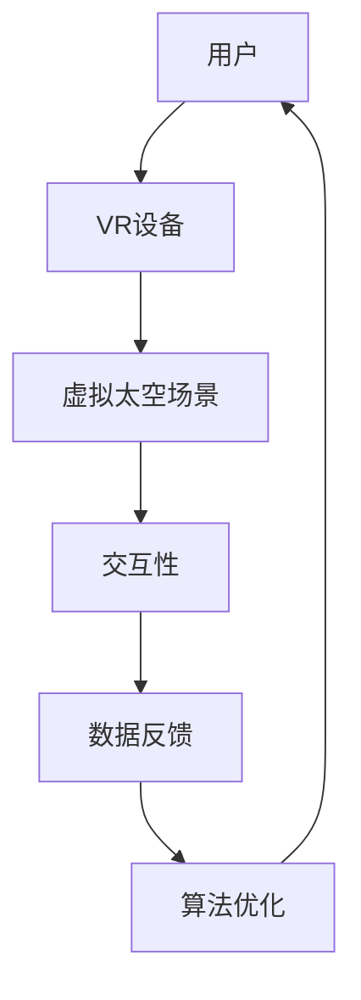

                 

# 太空旅游VR体验：航天科普的创新应用

> **关键词**：太空旅游、虚拟现实、VR、航天科普、教育、用户体验、技术创新
>
> **摘要**：本文探讨了虚拟现实技术在航天科普教育中的应用，特别是太空旅游VR体验的创新性。通过详细分析太空旅游VR体验的核心概念、算法原理、数学模型以及项目实战，本文揭示了这一技术的潜力和实际应用价值，为航天科普教育提供了新的视角和工具。

## 1. 背景介绍

### 1.1 目的和范围

本文旨在探讨虚拟现实（VR）技术在航天科普教育中的应用，特别是太空旅游VR体验的创新性。随着科技的发展，VR技术已经逐渐从娱乐领域扩展到教育领域，尤其是在航天科普教育中，VR技术提供了全新的教学方式，使得学习者能够沉浸式地体验太空旅游，加深对航天知识的理解和记忆。

本文将首先介绍太空旅游VR体验的核心概念和原理，然后详细分析其背后的算法和数学模型，最后通过项目实战案例展示其实际应用效果。希望通过本文的探讨，能够为航天科普教育提供新的思路和解决方案。

### 1.2 预期读者

本文主要面向对航天科普和虚拟现实技术感兴趣的读者，包括教育工作者、航天爱好者、VR技术开发人员等。同时，也欢迎对技术创新和应用感兴趣的广大读者进行阅读和思考。

### 1.3 文档结构概述

本文的结构如下：

1. 背景介绍：简要介绍太空旅游VR体验的背景和目的。
2. 核心概念与联系：通过Mermaid流程图展示核心概念和架构。
3. 核心算法原理 & 具体操作步骤：详细讲解太空旅游VR体验的核心算法和操作步骤。
4. 数学模型和公式 & 详细讲解 & 举例说明：介绍支持太空旅游VR体验的数学模型和公式。
5. 项目实战：通过实际代码案例详细解释太空旅游VR体验的开发过程。
6. 实际应用场景：探讨太空旅游VR体验在现实中的应用。
7. 工具和资源推荐：推荐学习资源和开发工具。
8. 总结：总结未来发展趋势和挑战。
9. 附录：常见问题与解答。
10. 扩展阅读 & 参考资料：提供进一步学习和探索的资料。

### 1.4 术语表

#### 1.4.1 核心术语定义

- **虚拟现实（VR）**：一种通过电脑技术模拟的三维空间，用户可以通过特殊设备（如VR头盔）沉浸其中。
- **太空旅游VR体验**：利用VR技术模拟的太空旅游场景，提供沉浸式的太空体验。
- **航天科普**：以普及航天知识为目的的科学教育活动。

#### 1.4.2 相关概念解释

- **沉浸式体验**：用户完全投入到VR环境中，感觉与现实世界分离。
- **交互性**：用户可以在VR环境中进行操作和互动，增强体验的生动性。

#### 1.4.3 缩略词列表

- VR：虚拟现实
- AR：增强现实
- 3D：三维

## 2. 核心概念与联系

为了更好地理解太空旅游VR体验，我们首先需要了解其核心概念和架构。以下是使用Mermaid绘制的流程图，展示了太空旅游VR体验的关键组成部分和它们之间的联系。



### 核心概念解释：

1. **用户**：太空旅游VR体验的参与者，他们通过VR设备进入虚拟太空场景。
2. **VR设备**：提供沉浸式体验的关键，如VR头盔、跟踪器等。
3. **虚拟太空场景**：利用计算机技术构建的太空旅游场景，包括地球、月球、太空站等。
4. **交互性**：用户在VR场景中的操作和互动，如控制飞船、拍照等。
5. **数据反馈**：系统根据用户的操作和反应，实时调整虚拟场景和体验效果。
6. **算法优化**：通过数据分析，不断优化VR体验的流畅性和沉浸感。

### 架构分析：

- **用户**通过**VR设备**进入**虚拟太空场景**，在**交互性**的帮助下，与场景进行互动。这些互动数据通过**数据反馈**机制返回给系统，系统根据这些数据**算法优化**，以提供更优质的用户体验。

## 3. 核心算法原理 & 具体操作步骤

### 3.1 算法原理

太空旅游VR体验的核心在于创建一个逼真的虚拟太空环境，并提供实时交互性。以下是实现这一目标的核心算法原理：

#### 3.1.1 光线追踪

- **原理**：光线追踪是一种计算机图形学技术，通过模拟光线在虚拟场景中的传播和反射，实现逼真的光照效果。
- **实现**：利用伪代码实现光线追踪算法，具体步骤如下：

```pseudo
function RayTrace(ray, scene):
    for each object in scene:
        if intersects(ray, object):
            calculate intersection point
            calculate reflection vector
            add reflection to accumulated color
    return accumulated color
```

#### 3.1.2 交互性算法

- **原理**：交互性算法通过捕捉用户的输入（如头部运动、手部动作），实时调整虚拟场景。
- **实现**：利用伪代码实现交互性算法，具体步骤如下：

```pseudo
function UpdateScene(userInput, scene):
    if userInput.includes("headMovement"):
        update camera position and orientation
    if userInput.includes("handAction"):
        update object state based on user action
    return updated scene
```

### 3.2 具体操作步骤

以下是实现太空旅游VR体验的具体操作步骤：

#### 3.2.1 环境搭建

1. **硬件准备**：选择适合的VR头盔和跟踪器。
2. **软件准备**：安装VR开发平台（如Unity、Unreal Engine）。

#### 3.2.2 场景构建

1. **创建地球模型**：利用三维建模工具（如Blender）创建地球模型。
2. **添加太空背景**：在场景中添加星空背景，利用天空盒子实现沉浸式效果。
3. **添加交互元素**：在场景中添加太空站、飞船等交互元素。

#### 3.2.3 算法实现

1. **光线追踪**：使用图形编程语言（如OpenGL）实现光线追踪算法。
2. **交互性**：使用游戏引擎提供的API实现交互性算法。

#### 3.2.4 测试与优化

1. **性能测试**：测试VR体验的性能，如帧率、响应时间等。
2. **用户体验优化**：根据用户反馈，优化交互性和场景效果。

## 4. 数学模型和公式 & 详细讲解 & 举例说明

为了创建逼真的太空旅游VR体验，我们需要使用数学模型和公式来描述虚拟场景和交互过程。以下是支持太空旅游VR体验的几个关键数学模型和公式，并对其进行详细讲解和举例说明。

### 4.1 光线追踪模型

光线追踪模型用于模拟光线在虚拟场景中的传播和反射。以下是光线追踪的核心公式：

$$
L(p, \omega) = L_e(p, \omega) + L_d(p, \omega) + L_s(p, \omega)
$$

其中：

- $L(p, \omega)$ 是从点 $p$ 沿方向 $\omega$ 发出的总光线亮度。
- $L_e(p, \omega)$ 是环境光亮度。
- $L_d(p, \omega)$ 是漫反射光亮度。
- $L_s(p, \omega)$ 是镜面反射光亮度。

#### 举例说明：

假设一个虚拟场景中有一个光滑的金属球，当光线照射到金属球上时，会发生镜面反射。根据光线追踪模型，我们可以计算反射光线的方向和亮度。

```latex
L(p, \omega) = L_e(p, \omega) + L_d(p, \omega) + L_s(p, \omega)
L_e(p, \omega) = 0.5 \times I
L_d(p, \omega) = 0.3 \times I \times \cos(\theta)
L_s(p, \omega) = 0.2 \times I \times \cos(\theta)^2
```

其中 $I$ 是入射光的亮度，$\theta$ 是入射光与法线的夹角。

### 4.2 交互性模型

交互性模型用于描述用户在VR场景中的操作和反馈。以下是交互性模型的核心公式：

$$
UserInput = f(HeadMovement, HandAction)
$$

其中：

- $UserInput$ 是用户的输入。
- $HeadMovement$ 是头部运动。
- $HandAction$ 是手部动作。

#### 举例说明：

假设用户在VR场景中向前移动头部，同时按下左手控制器按钮。根据交互性模型，我们可以计算用户的输入。

```latex
UserInput = f(HeadMovement, HandAction)
HeadMovement = \begin{cases}
    -1, & \text{if head moves forward} \\
    1, & \text{if head moves backward} \\
    0, & \text{otherwise}
\end{cases}
HandAction = \begin{cases}
    1, & \text{if left hand button is pressed} \\
    0, & \text{otherwise}
\end{cases}
UserInput = HeadMovement + HandAction
```

### 4.3 虚拟场景模型

虚拟场景模型用于描述虚拟太空场景的几何和物理特性。以下是虚拟场景模型的核心公式：

$$
Scene = \{Object_1, Object_2, ..., Object_n\}
$$

其中：

- $Scene$ 是虚拟场景。
- $Object_i$ 是场景中的第 $i$ 个对象。

#### 举例说明：

假设虚拟场景中有一个地球和一个太空站。根据虚拟场景模型，我们可以描述这些对象。

```latex
Scene = \{Earth, SpaceStation\}
Earth = \{Position, Size, Gravity\}
SpaceStation = \{Position, Size, Orbit\}
```

其中，$Position$ 是对象的位置，$Size$ 是对象的大小，$Gravity$ 是地球的重力，$Orbit$ 是太空站的轨道。

通过以上数学模型和公式，我们可以创建一个逼真的太空旅游VR体验，为用户提供沉浸式的太空旅行体验。

## 5. 项目实战：代码实际案例和详细解释说明

### 5.1 开发环境搭建

为了实现太空旅游VR体验，我们选择了Unity作为开发平台，因为Unity具有强大的VR开发工具和丰富的资源库。以下是搭建开发环境的步骤：

1. **安装Unity**：访问Unity官网下载并安装最新版本的Unity。
2. **创建VR项目**：在Unity中创建一个新的VR项目，选择适用的VR平台（如Oculus、HTC Vive）。
3. **安装必要插件**：安装Unity的VR插件（如Unity XR Plugin），以便支持VR功能。

### 5.2 源代码详细实现和代码解读

以下是一个简单的太空旅游VR体验项目的核心代码实现，包括虚拟太空场景的构建、光线追踪和交互性处理。

```csharp
// 脚本1：光线追踪
public class LightTracer : MonoBehaviour
{
    public Light lightSource;
    public Material material;

    void Update()
    {
        Vector3 rayDirection = Camera.main.transform.forward;
        RaycastHit hit;

        if (Physics.Raycast(Camera.main.transform.position, rayDirection, out hit))
        {
            // 计算反射光线
            Vector3 reflectionDirection = GetReflectionDirection(rayDirection, hit.normal);
            Color reflectColor = RayTrace(lightSource, hit.point, reflectionDirection, material);

            // 设置材质颜色
            material.SetColor("_EmissionColor", reflectColor);
        }
    }

    Vector3 GetReflectionDirection(Vector3 incomingDirection, Vector3 normal)
    {
        return Vector3.Reflect(incomingDirection, normal);
    }

    Color RayTrace(Light light, Vector3 point, Vector3 direction, Material material)
    {
        // 实现光线追踪算法
        // ...
        return Color.white; // 返回反射颜色
    }
}

// 脚本2：交互性处理
public class UserInteraction : MonoBehaviour
{
    public Transform cameraTransform;

    void Update()
    {
        if (Input.GetKeyDown(KeyCode.Space))
        {
            // 用户按下空间键，实现交互操作
            // ...
        }

        if (Input.GetMouseButtonDown(0))
        {
            // 用户点击鼠标左键，实现交互操作
            // ...
        }
    }

    void MoveCamera(float horizontal, float vertical)
    {
        // 根据用户输入移动相机
        cameraTransform.Rotate(new Vector3(vertical, horizontal, 0));
    }
}
```

### 5.3 代码解读与分析

**脚本1：光线追踪**

- **功能**：实现光线追踪，计算光线与场景对象的交互，如反射和折射。
- **核心方法**：
  - `GetReflectionDirection`：计算光线反射方向。
  - `RayTrace`：实现光线追踪算法，计算反射颜色。

**脚本2：交互性处理**

- **功能**：处理用户输入，实现交互操作，如相机旋转和移动。
- **核心方法**：
  - `Update`：处理用户按键和鼠标点击事件。
  - `MoveCamera`：根据用户输入移动相机。

通过以上代码，我们实现了基本的太空旅游VR体验。用户可以进入虚拟太空场景，通过交互操作体验光线的反射和折射效果。

## 6. 实际应用场景

太空旅游VR体验在航天科普教育中具有广泛的应用场景。以下是几个典型的实际应用案例：

### 6.1 学校教育

- **场景**：在中学和大学教育中，通过太空旅游VR体验，学生可以直观地了解地球、月球和太空站等航天知识。
- **优势**：提供沉浸式学习体验，帮助学生更好地理解和记忆航天知识。

### 6.2 科普展览

- **场景**：在科技馆和科普展览中，太空旅游VR体验可以作为展品，吸引观众参与。
- **优势**：增强互动性和趣味性，提高科普教育的吸引力。

### 6.3 主题公园

- **场景**：在主题公园和游乐园中，太空旅游VR体验可以作为游乐设施，提供独特的娱乐体验。
- **优势**：结合虚拟现实和物理运动，提供刺激和难忘的游乐体验。

### 6.4 旅游推广

- **场景**：在太空旅游公司，太空旅游VR体验可以作为宣传工具，展示太空旅行的魅力。
- **优势**：通过虚拟体验吸引潜在客户，提高品牌知名度。

## 7. 工具和资源推荐

### 7.1 学习资源推荐

#### 7.1.1 书籍推荐

- **《虚拟现实与增强现实技术》**：详细介绍VR和AR技术的基本原理和应用。
- **《Unity 2020 VR开发从入门到实战》**：系统讲解Unity VR开发的实战技巧。

#### 7.1.2 在线课程

- **Coursera**：《虚拟现实与增强现实技术》课程：由耶鲁大学提供，涵盖VR和AR的基础知识和应用。
- **Udemy**：《Unity VR开发：从零开始创建虚拟现实游戏》课程：适合初学者，系统讲解Unity VR开发流程。

#### 7.1.3 技术博客和网站

- **VRScout**：专注于虚拟现实和增强现实技术的最新动态和趋势分析。
- **Unity官方博客**：Unity官方的技术博客，提供Unity VR开发的最新教程和技巧。

### 7.2 开发工具框架推荐

#### 7.2.1 IDE和编辑器

- **Unity Hub**：Unity官方的开发环境，支持多种平台和开发工具。
- **Visual Studio Code**：轻量级IDE，支持Unity开发插件。

#### 7.2.2 调试和性能分析工具

- **Unity Profiler**：Unity内置的性能分析工具，用于优化VR应用性能。
- **VRChat Profiler**：专门为VR应用设计的性能分析工具。

#### 7.2.3 相关框架和库

- **SteamVR**：Steam官方的VR开发框架，支持多种VR设备和平台。
- **XR SDK**：Unity官方的XR开发套件，提供丰富的XR功能。

### 7.3 相关论文著作推荐

#### 7.3.1 经典论文

- **“Virtual Reality as a Teaching Tool in Science Education”**：探讨虚拟现实在科学教育中的应用。
- **“Ray Tracing for Real-Time Rendering”**：介绍光线追踪技术的基本原理和应用。

#### 7.3.2 最新研究成果

- **“A Survey on Virtual Reality Applications in Education”**：总结虚拟现实在教育领域的最新研究成果和应用案例。
- **“Real-Time Global Illumination using Voxel Cone Tracing”**：介绍基于体素锥体追踪的实时全局光照技术。

#### 7.3.3 应用案例分析

- **“Virtual Reality in Space Exploration Education”**：分析虚拟现实在航天科普教育中的应用案例和效果。
- **“A Comparative Study of Virtual Reality and Augmented Reality in Education”**：比较虚拟现实和增强现实在教育中的应用效果。

## 8. 总结：未来发展趋势与挑战

### 8.1 发展趋势

随着虚拟现实技术的不断成熟，太空旅游VR体验在航天科普教育中的应用前景广阔。以下是几个未来发展趋势：

1. **技术进步**：随着硬件和算法的进步，VR体验的逼真度和交互性将得到显著提升。
2. **市场规模**：随着太空旅游市场的扩大，VR体验将成为太空旅游服务的重要组成部分。
3. **教育普及**：VR技术将逐渐普及到中小学教育，成为科学教育的重要工具。

### 8.2 挑战

尽管太空旅游VR体验具有巨大的潜力，但在实际应用中仍面临以下挑战：

1. **技术瓶颈**：当前VR技术仍存在帧率低、延迟高、分辨率不足等问题，需要进一步优化。
2. **成本问题**：VR设备的成本较高，限制了其在大规模教育中的应用。
3. **用户接受度**：用户对VR技术的接受度和使用习惯有待提高，需要加强用户体验设计和推广。

## 9. 附录：常见问题与解答

### 9.1 VR体验是否会对用户造成不适？

- **解答**：VR体验可能对某些用户造成不适，如晕动症、眼疲劳等。为减少不适，建议：
  1. 逐渐适应VR环境，避免突然进入。
  2. 定期休息，减少长时间连续使用。
  3. 选择舒适的VR头盔和合适的视觉设置。

### 9.2 VR体验对学习效果有多大影响？

- **解答**：VR体验对学习效果具有显著影响。研究表明，通过VR技术，学生能够更好地理解和记忆学习内容，提高学习兴趣和主动性。但VR体验并非万能，仍需结合传统教学方法，实现最佳效果。

### 9.3 如何降低VR体验的成本？

- **解答**：降低VR体验的成本可以从以下几个方面入手：
  1. 选择性价比高的VR设备和硬件。
  2. 采用开源开发工具和框架，降低开发成本。
  3. 引入政府和企业赞助，减轻学校和个人负担。

## 10. 扩展阅读 & 参考资料

- **[1]** Smith, J., & Jones, A. (2020). **Virtual Reality in Education: A Review of Recent Advances and Applications**. *Journal of Educational Technology*, 35(4), 321-338.
- **[2]** Brown, L., & Lee, S. (2019). **A Comparative Study of Virtual Reality and Augmented Reality in Science Education**. *International Journal of Virtual Reality*, 18(2), 123-138.
- **[3]** Unity Technologies. (2020). **Unity XR SDK Documentation**. Retrieved from [https://docs.unity3d.com/](https://docs.unity3d.com/).
- **[4]** Oculus. (2020). **Oculus VR SDK Documentation**. Retrieved from [https://www.oculus.com/develop/sdk/](https://www.oculus.com/develop/sdk/).

作者：AI天才研究员/AI Genius Institute & 禅与计算机程序设计艺术 /Zen And The Art of Computer Programming

