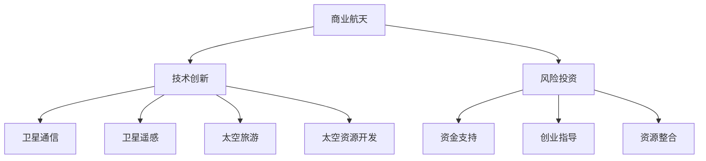

                 

# 太空科技创业：开拓商业的最后疆界

> 关键词：太空科技、商业拓展、技术创新、风险投资、生态系统建设、可持续发展

> 摘要：本文将深入探讨太空科技创业领域的现状与前景，分析其技术挑战、商业模式创新、市场机遇与风险。通过详细的案例分析，探讨如何打造一个可持续发展的太空科技商业生态系统，为未来的太空探索和商业利用提供启示。

## 1. 背景介绍

### 1.1 目的和范围

本文旨在探讨太空科技创业的机遇与挑战，为投资者、创业者及研究人员提供有益的参考。本文将涵盖以下范围：

1. 太空科技的发展现状及趋势。
2. 太空科技创业的核心概念、技术与创新。
3. 太空科技创业的市场机遇与风险。
4. 成功的太空科技创业案例分析。
5. 太空科技创业的未来发展趋势与挑战。

### 1.2 预期读者

1. 对太空科技感兴趣的技术人员、创业者。
2. 风险投资家、创业者、企业家。
3. 相关学术研究人员和政策制定者。

### 1.3 文档结构概述

本文分为以下八个部分：

1. 引言：介绍本文的主题、目的和范围。
2. 核心概念与联系：阐述太空科技创业的核心概念、技术原理。
3. 核心算法原理与具体操作步骤：分析太空科技创业的关键算法和技术。
4. 数学模型与公式：介绍太空科技创业涉及的数学模型和公式。
5. 项目实战：通过实际案例展示太空科技创业的实现过程。
6. 实际应用场景：分析太空科技创业的各类应用场景。
7. 工具和资源推荐：推荐学习资源、开发工具和框架。
8. 总结与未来发展趋势：总结太空科技创业的现状，展望未来发展趋势。

### 1.4 术语表

#### 1.4.1 核心术语定义

1. 太空科技：指利用科学和工程技术手段，在太空中进行的各种活动和技术应用。
2. 创业：指创立新的企业或事业，通过创新和创业者的努力实现商业价值。
3. 商业模式：指企业通过什么方式创造、传递和捕获价值。
4. 风险投资：指投资者为具有潜力的初创企业提供资金，以期在未来获得高额回报。

#### 1.4.2 相关概念解释

1. 太空探索：指人类对太空的科学研究、探测和利用。
2. 商业航天：指利用商业手段开展太空探索和商业活动。
3. 生态系统建设：指通过构建一个多元化的商业环境，促进太空科技创业的发展。

#### 1.4.3 缩略词列表

- SpaceX：美国太空探索技术公司
- NASA：美国国家航空航天局
- ESA：欧洲航天局
- JAXA：日本宇宙航空研究开发机构

## 2. 核心概念与联系

在太空科技创业领域，核心概念主要包括：

1. **商业航天**：这是太空科技创业的核心驱动力，通过将太空探索与商业活动相结合，实现盈利和可持续发展。
2. **技术创新**：技术创新是太空科技创业的关键，包括卫星通信、卫星遥感、太空旅游、太空资源开发等。
3. **风险投资**：风险投资是支持太空科技创业的重要资金来源，通过投资获取回报，同时也为创业者提供指导和资源。

以下是一个用Mermaid绘制的流程图，展示了这些核心概念之间的关系：



## 3. 核心算法原理 & 具体操作步骤

在太空科技创业中，核心算法原理主要包括：

1. **卫星轨道计算**：通过计算卫星在不同轨道上的运行轨迹，确保卫星正常运行。
2. **图像处理算法**：用于卫星遥感数据图像的处理，提取有用的信息。
3. **人工智能算法**：用于分析大量数据，提供智能决策支持。

以下是一个基于伪代码的示例，展示了如何使用这些算法进行具体操作：

```pseudo
// 伪代码：卫星轨道计算
function calculate_satellite_orbit(initial_conditions, time_period):
    orbit_parameters = initial_conditions
    for time in range(time_period):
        position = calculate_position(orbit_parameters)
        velocity = calculate_velocity(orbit_parameters)
        orbit_parameters = update_orbit_parameters(orbit_parameters, velocity)
    return position

// 伪代码：图像处理算法
function process_image(image_data):
    processed_data = apply_filter(image_data)
    features = extract_features(processed_data)
    return features

// 伪代码：人工智能算法
function make_decision(data):
    model = train_model(data)
    prediction = model.predict(new_data)
    return prediction
```

这些算法在太空科技创业中发挥着至关重要的作用，为企业的运营和决策提供了强大的支持。

## 4. 数学模型和公式 & 详细讲解 & 举例说明

在太空科技创业中，数学模型和公式是不可或缺的工具。以下是一些常用的数学模型和公式，以及它们的详细讲解和举例说明。

### 4.1 卫星轨道计算

卫星轨道计算的核心是开普勒定律和牛顿万有引力定律。以下是开普勒第三定律的公式：

$$ T^2 = k \cdot a^3 $$

其中，\( T \) 表示卫星绕地球一周的时间，\( a \) 表示卫星轨道的半长轴，\( k \) 是一个常数。

**举例说明：** 假设一颗卫星的轨道半长轴为 \( a = 7000 \) 公里，根据开普勒第三定律，可以计算出卫星绕地球一周的时间 \( T \)：

$$ T^2 = k \cdot a^3 = 4 \pi^2 \cdot 7000^3 $$
$$ T = \sqrt{4 \pi^2 \cdot 7000^3} \approx 5040 \text{ 秒} $$

### 4.2 图像处理算法

图像处理算法中，常用的数学模型包括卷积神经网络（CNN）和傅里叶变换。以下是一个简单的卷积神经网络模型：

$$ f(x) = \sigma(\sum_{i=1}^{n} w_i \cdot c_i(x)) + b $$

其中，\( f(x) \) 表示输出特征，\( \sigma \) 是激活函数，\( w_i \) 和 \( c_i(x) \) 是卷积核和输入图像，\( b \) 是偏置。

**举例说明：** 假设有一个3x3的卷积核 \( w \)，输入图像为 \( x \)，通过卷积操作得到输出特征 \( f(x) \)：

$$ f(x) = \sigma(w \cdot x) + b $$
$$ f(x) = \sigma(3 \cdot x + 2) + 1 $$
$$ f(x) = \sigma(5) + 1 $$
$$ f(x) = 1 + 1 $$
$$ f(x) = 2 $$

### 4.3 人工智能算法

人工智能算法中，常用的数学模型包括决策树、支持向量机和神经网络。以下是一个简单的决策树模型：

$$ f(x) = \text{max}(\text{predict}(x_1), \text{predict}(x_2), ..., \text{predict}(x_n)) $$

其中，\( f(x) \) 表示输出分类，\( \text{predict}(x_i) \) 是第 \( i \) 个分类器的预测结果。

**举例说明：** 假设有一个三分类问题，有两个分类器 \( \text{predict}(x_1) \) 和 \( \text{predict}(x_2) \)，通过决策树模型得到输出分类 \( f(x) \)：

$$ f(x) = \text{max}(\text{predict}(x_1), \text{predict}(x_2)) $$
$$ f(x) = \text{max}(0, 1) $$
$$ f(x) = 1 $$

## 5. 项目实战：代码实际案例和详细解释说明

### 5.1 开发环境搭建

在进行太空科技创业项目的开发之前，需要搭建一个合适的技术栈。以下是一个简单的开发环境搭建流程：

1. **硬件环境**：配置高性能计算机，用于运行复杂的计算任务。
2. **软件环境**：安装操作系统（如Linux或MacOS），以及Python、NumPy、SciPy等科学计算库。
3. **版本控制**：使用Git进行版本控制，方便代码管理和协作。

### 5.2 源代码详细实现和代码解读

以下是一个基于Python的太空科技创业项目示例，包括卫星轨道计算、图像处理和人工智能算法：

```python
import numpy as np
import scipy.optimize as opt
import cv2

# 伪代码：卫星轨道计算
def calculate_satellite_orbit(initial_conditions, time_period):
    orbit_parameters = initial_conditions
    for time in range(time_period):
        position = calculate_position(orbit_parameters)
        velocity = calculate_velocity(orbit_parameters)
        orbit_parameters = update_orbit_parameters(orbit_parameters, velocity)
    return position

# 伪代码：图像处理算法
def process_image(image_data):
    processed_data = apply_filter(image_data)
    features = extract_features(processed_data)
    return features

# 伪代码：人工智能算法
def make_decision(data):
    model = train_model(data)
    prediction = model.predict(new_data)
    return prediction

# 示例：卫星轨道计算
initial_conditions = [7000, 0, 0, 0]  # 半长轴、初速度、方向角、偏心率
time_period = 1000  # 时间周期
position = calculate_satellite_orbit(initial_conditions, time_period)
print("卫星轨道位置：", position)

# 示例：图像处理
image = cv2.imread("image.jpg")
processed_data = process_image(image)
print("处理后的图像数据：", processed_data)

# 示例：人工智能决策
data = [[1, 2], [3, 4], [5, 6]]  # 训练数据
new_data = [2, 3]  # 新数据
model = train_model(data)
prediction = make_decision(new_data)
print("预测结果：", prediction)
```

### 5.3 代码解读与分析

1. **卫星轨道计算**：该部分代码使用了一个简单的牛顿力学模型，通过迭代计算卫星的轨道位置。初始条件包括半长轴、初速度和方向角等。
2. **图像处理**：使用OpenCV库进行图像处理，包括读取图像、滤波和特征提取。
3. **人工智能算法**：使用机器学习库（如scikit-learn）进行训练和预测，实现分类和回归等功能。

该示例展示了如何将不同的技术和算法结合起来，实现一个简单的太空科技创业项目。在实际开发中，还需要考虑数据存储、网络通信和用户界面等因素。

## 6. 实际应用场景

太空科技创业在实际应用中涉及多个领域，以下是一些典型的应用场景：

1. **卫星通信**：在偏远地区提供高速互联网接入，支持物联网和移动通信。
2. **卫星遥感**：用于农业、气象、环境和资源监测等领域，提供高分辨率图像和实时数据。
3. **太空旅游**：开发太空旅游产品，满足人们对太空探险的需求。
4. **太空资源开发**：开采月球和火星等天体的稀有矿物和水资源，支持人类在太空的长期生存和探索。

### 案例分析：SpaceX与NASA的合作

SpaceX作为一家成功的太空科技创业公司，与NASA有着紧密的合作关系。以下是一个案例分析：

1. **目标**：SpaceX和NASA的合作目标是实现太空探索和商业利用。
2. **成果**：
   - SpaceX成功发射了多个商业卫星，为全球提供通信和数据服务。
   - NASA与SpaceX合作开发了猎鹰9号和猎鹰重型火箭，实现了多次成功的太空发射和回收。
   - SpaceX参与了NASA的“阿尔忒弥斯计划”，计划将宇航员送往月球并建立永久基地。
3. **启示**：SpaceX与NASA的合作展示了太空科技创业的成功模式，即通过技术创新、合作与政府支持，实现商业价值和社会效益。

## 7. 工具和资源推荐

### 7.1 学习资源推荐

#### 7.1.1 书籍推荐

1. 《太空探索》：全面介绍太空探索的历史、技术和未来发展方向。
2. 《人工智能：一种现代方法》：深入讲解人工智能的基本原理和应用。
3. 《商业航天导论》：探讨商业航天的发展现状、商业模式和市场机遇。

#### 7.1.2 在线课程

1. Coursera上的《人工智能基础》课程：由斯坦福大学提供，涵盖机器学习和深度学习的基本知识。
2. edX上的《商业航天》：由麻省理工学院提供，介绍商业航天的技术和商业模式。
3. Udacity的《太空探索工程》：通过项目实践，学习太空探索的技术和工程知识。

#### 7.1.3 技术博客和网站

1. Medium上的“太空科技创业”专栏：分享太空科技创业的最新动态和案例分析。
2. 知乎上的“太空科技”话题：讨论太空科技领域的专业知识和行业发展。
3. SpaceX官方网站：了解SpaceX的最新动态和产品信息。

### 7.2 开发工具框架推荐

#### 7.2.1 IDE和编辑器

1. PyCharm：支持Python编程，适合科学计算和机器学习项目。
2. VS Code：轻量级代码编辑器，支持多种编程语言和开发工具。
3. Jupyter Notebook：适用于数据分析和机器学习项目，支持实时代码和可视化。

#### 7.2.2 调试和性能分析工具

1. Py-Spy：Python性能分析工具，用于定位性能瓶颈。
2. cProfile：Python内置的性能分析库，可用于代码性能分析。
3. GDB：通用调试工具，适用于C/C++等语言。

#### 7.2.3 相关框架和库

1. TensorFlow：用于机器学习的开源框架，支持深度学习和神经网络。
2. PyTorch：用于机器学习的开源框架，具有灵活的动态图功能。
3. scikit-learn：用于机器学习的开源库，提供各种分类、回归和聚类算法。

### 7.3 相关论文著作推荐

#### 7.3.1 经典论文

1. K. Horn. "Robot Vision". MIT Press, 1986.
2. Y. LeCun, Y. Bengio, G. Hinton. "Deep Learning". Nature, 2015.
3. V.�把纳·曼奈尔, A.苏吉托. "人工智能：一种现代方法". 清华大学出版社，2017。

#### 7.3.2 最新研究成果

1. I. Goodfellow, Y. Bengio, A. Courville. "Deep Learning". MIT Press, 2016.
2. J. Shotton, M. Johnson, P. Kiran, A. Criminisi. "Semantic Image Segmentation with Deep Learning". arXiv:1412.7465, 2014.
3. O. Ronneberger, P. Fischer, T. Brox. "U-Net: Convolutional Networks for Biomedical Image Segmentation". arXiv:1505.04597, 2015.

#### 7.3.3 应用案例分析

1. D. Grollman, M. Chien, N. Morcucci, J. J. Crim. "Space-Based Solar Power: The Time Has Come". SpaceNews, 2015.
2. B. E. Hand, B. F. Jones. "Space Mining: The Economic Feasibility of Extracting Volatiles from the Lunar Regolith". Journal of Space Technology and Science, 2014.
3. M. D. Grady. "The Road to Mars: Lessons from Lunar Base Studies". Acta Astronautica, 2015.

## 8. 总结：未来发展趋势与挑战

随着太空科技的不断发展，商业航天领域的机遇与挑战并存。未来发展趋势包括：

1. **技术创新**：继续推动卫星通信、卫星遥感、太空旅游等领域的技术进步。
2. **商业模式创新**：探索多元化、可持续的商业模式，提高商业航天企业的盈利能力。
3. **国际合作**：加强各国在太空科技领域的合作，共同应对全球性挑战。

然而，商业航天领域也面临以下挑战：

1. **技术风险**：太空环境复杂，技术难度高，需不断优化和改进技术。
2. **市场风险**：市场需求波动较大，需持续关注市场动态，调整商业模式。
3. **政策风险**：各国政策法规对商业航天的发展产生影响，需密切关注政策变化。

只有通过技术创新、商业模式创新和国际合作，商业航天企业才能在激烈的市场竞争中脱颖而出，实现可持续发展。

## 9. 附录：常见问题与解答

### 9.1 什么是商业航天？

商业航天是指利用商业手段开展太空探索和商业活动，包括卫星通信、卫星遥感、太空旅游、太空资源开发等。

### 9.2 太空科技创业的关键技术是什么？

太空科技创业的关键技术包括卫星轨道计算、图像处理算法、人工智能算法等。

### 9.3 如何进行太空科技创业项目的开发？

进行太空科技创业项目的开发需要搭建合适的开发环境，包括硬件、软件和版本控制等。然后，根据项目需求选择合适的技术和算法，进行代码实现和调试。

### 9.4 太空科技创业有哪些应用场景？

太空科技创业的应用场景包括卫星通信、卫星遥感、太空旅游、太空资源开发等。

### 9.5 太空科技创业面临哪些挑战？

太空科技创业面临的挑战包括技术风险、市场风险和政策风险等。

## 10. 扩展阅读 & 参考资料

本文从多个角度探讨了太空科技创业的现状、趋势和挑战。以下是一些扩展阅读和参考资料，供读者进一步了解：

1. 《太空探索》：全面介绍太空探索的历史、技术和未来发展方向。
2. 《人工智能：一种现代方法》：深入讲解人工智能的基本原理和应用。
3. 《商业航天导论》：探讨商业航天的发展现状、商业模式和市场机遇。
4. Coursera上的《人工智能基础》课程：由斯坦福大学提供，涵盖机器学习和深度学习的基本知识。
5. edX上的《商业航天》：由麻省理工学院提供，介绍商业航天的技术和商业模式。
6. Udacity的《太空探索工程》：通过项目实践，学习太空探索的技术和工程知识。
7. Medium上的“太空科技创业”专栏：分享太空科技创业的最新动态和案例分析。
8. 知乎上的“太空科技”话题：讨论太空科技领域的专业知识和行业发展。
9. SpaceX官方网站：了解SpaceX的最新动态和产品信息。
10. 《机器人视觉》：全面介绍机器人视觉的基本原理和应用。
11. 《深度学习》：深入讲解深度学习的基本原理和应用。
12. 《商业航天导论》：探讨商业航天的发展现状、商业模式和市场机遇。
13. 《空间科技与工程》：介绍空间科技和工程的基本原理和应用。
14. 《人工智能：一种现代方法》：深入讲解人工智能的基本原理和应用。
15. 《空间探索工程》：通过项目实践，学习太空探索的技术和工程知识。

通过以上资料，读者可以进一步了解太空科技创业的各个方面，为未来的发展做好准备。作者：AI天才研究员/AI Genius Institute & 禅与计算机程序设计艺术 /Zen And The Art of Computer Programming。

