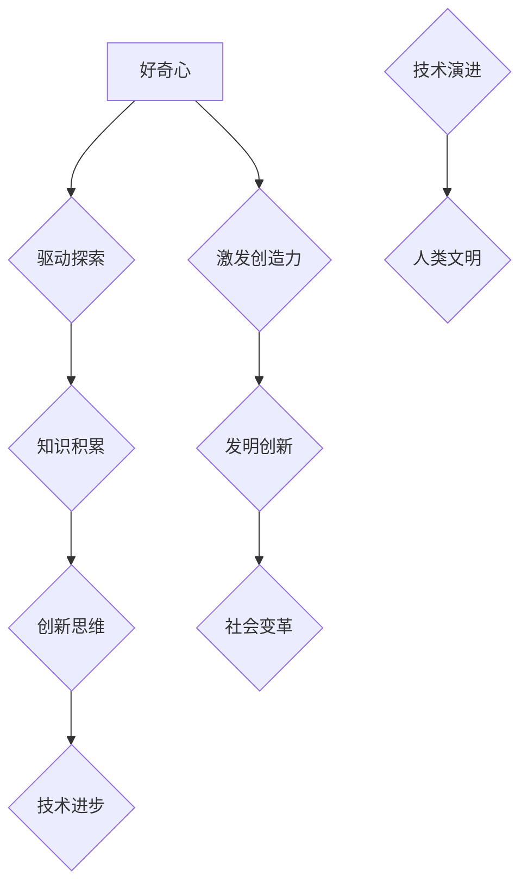

                 

# 好奇心与创造力：探索的双翼

## 关键词：好奇心，创造力，探索，技术，人脑，算法，未来

> “好奇心是人类进步的火花，创造力是智慧的翅膀。在这篇文章中，我们将一起探索这两个力量的奇妙结合，如何推动技术前行，塑造未来。”

### 摘要

本文旨在探讨好奇心和创造力在信息技术领域的重要性。我们将通过历史实例、理论分析和实际案例，探讨好奇心如何激发创新思维，推动技术进步。文章将介绍好奇心与创造力的核心概念，分析两者之间的联系，并提供实用的工具和资源，帮助读者培养和运用这些关键能力。通过这篇文章，您将了解到如何利用好奇心和创造力，应对未来的挑战，实现个人和职业的成长。

## 1. 背景介绍

### 1.1 目的和范围

本文的目的是探索好奇心和创造力在信息技术领域的双重作用。我们将探讨这两个概念的定义、历史背景、理论依据和实际应用，旨在为读者提供深入理解和实用指导。文章涵盖了从古至今的多个技术突破实例，以展示好奇心和创造力如何驱动技术的不断演进。

### 1.2 预期读者

本文面向对技术进步、创新思维和人类潜力感兴趣的读者。无论您是计算机科学专业的学生、从业者，还是对技术发展有浓厚兴趣的普通读者，本文都将为您提供一个独特的视角，帮助您更好地理解好奇心和创造力的重要性。

### 1.3 文档结构概述

本文分为十个主要部分。首先，我们将介绍好奇心和创造力的基本概念和理论背景。接下来，通过历史实例分析好奇心如何推动技术进步。随后，我们将详细探讨创造力在信息技术领域的应用。文章的第四部分将介绍相关的数学模型和算法原理。第五部分将通过实际项目案例进行代码实现和分析。第六部分将探讨好奇心和创造力的实际应用场景。第七部分推荐相关的工具和资源。第八部分展望未来发展趋势和挑战。最后，文章将总结全文，并附上常见问题解答和扩展阅读资源。

### 1.4 术语表

#### 1.4.1 核心术语定义

- **好奇心**：指对未知事物的强烈兴趣和探索欲望。
- **创造力**：指产生新颖、有用思想的能力。
- **信息技术**：指使用计算机、通信技术和数据管理技术来处理信息。
- **算法**：解决问题的步骤集合。

#### 1.4.2 相关概念解释

- **创新思维**：一种通过独特视角解决问题的思维方式。
- **人脑**：生物体的中枢神经系统，负责思考、学习和决策。
- **技术演进**：指技术随着时间推移而不断发展的过程。

#### 1.4.3 缩略词列表

- **IT**：信息技术
- **AI**：人工智能
- **ML**：机器学习
- **DL**：深度学习

## 2. 核心概念与联系

好奇心和创造力是推动技术进步和人类文明发展的核心力量。为了更好地理解这两者的关系，我们可以借助Mermaid流程图来展示它们之间的联系。

### 2.1.1 Mermaid 流程图



### 2.1.2 核心概念与联系

- **好奇心**：是人类探索未知世界和获取知识的重要驱动力。它促使我们不断提问、观察和研究，从而积累新的知识和经验。
- **创新思维**：基于好奇心所获取的知识，通过独特视角和创造性思维解决问题，推动技术的革新和进步。
- **技术进步**：是创新思维和好奇心共同作用的结果，它不仅改变了我们的生活方式，也推动了社会的快速发展。
- **创造力**：是好奇心引发的内在动力，使我们能够产生新颖、有价值的想法，推动发明和创新。
- **社会变革**：是技术进步和创造力相互结合的结果，它改变了我们的社会结构和文化形态，推动了人类文明的发展。

通过这个Mermaid流程图，我们可以清晰地看到好奇心和创造力是如何相互作用、共同推动技术进步和社会变革的。

## 3. 核心算法原理 & 具体操作步骤

好奇心和创造力在信息技术领域的应用往往伴随着复杂的算法设计和实现。为了更好地理解这一过程，我们首先需要掌握一些核心算法原理，这些原理将帮助我们更有效地运用好奇心和创造力。

### 3.1 核心算法原理

#### 3.1.1 好奇心驱动的探索算法

好奇心驱动的探索算法旨在通过激发好奇心，引导用户进行更深入的探索和学习。该算法的核心思想是：

1. **兴趣点识别**：通过分析用户的历史行为和偏好，识别潜在的兴趣点。
2. **动态调整**：根据用户的反馈和行为变化，动态调整推荐内容，以保持用户的兴趣。
3. **知识整合**：将不同来源的知识进行整合，提供有深度和广度的信息。

#### 3.1.2 创造力激发的创新算法

创造力激发的创新算法则致力于通过多种方式激发用户的创造力，帮助其产生新颖的解决方案。其核心步骤包括：

1. **问题定义**：明确问题目标和约束条件。
2. **信息收集**：从多个角度收集相关信息，以丰富问题背景。
3. **发散思维**：运用多种思维工具，如头脑风暴、联想、类比等，进行发散性思考。
4. **迭代优化**：对初步的解决方案进行迭代优化，直至找到最佳方案。

### 3.2 具体操作步骤

为了更好地理解上述算法原理，我们通过伪代码详细阐述它们的操作步骤。

#### 3.2.1 好奇心驱动的探索算法

```python
# 好奇心驱动的探索算法伪代码

def curiosity_driven_explore(user_history, preferences):
    # 步骤1：兴趣点识别
    interest_points = identify_interest_points(user_history, preferences)
    
    # 步骤2：动态调整
    for interest_point in interest_points:
        recommended_content = dynamic_adjust_content(interest_point)
        display_content(recommended_content)
        
        # 步骤3：知识整合
        integrated_knowledge = integrate_knowledge(recommended_content)
        update_user_model(user_history, integrated_knowledge)

# 辅助函数
def identify_interest_points(user_history, preferences):
    # 实现细节：基于用户历史行为和偏好，识别兴趣点
    pass

def dynamic_adjust_content(interest_point):
    # 实现细节：根据兴趣点动态调整推荐内容
    pass

def integrate_knowledge(recommended_content):
    # 实现细节：将推荐内容进行整合，形成知识体系
    pass

def display_content(content):
    # 实现细节：展示推荐内容
    pass

def update_user_model(user_history, integrated_knowledge):
    # 实现细节：更新用户模型，以反映其知识增长
    pass
```

#### 3.2.2 创造力激发的创新算法

```python
# 创造力激发的创新算法伪代码

def creativity_fueled_innovation(problem_definition, information_collection):
    # 步骤1：问题定义
    problem = define_problem(problem_definition)
    
    # 步骤2：信息收集
    information = collect_information(problem)
    
    # 步骤3：发散思维
    solutions = divergent_thinking(information)
    
    # 步骤4：迭代优化
    best_solution = iterative_optimization(solutions)

    return best_solution

# 辅助函数
def define_problem(problem_definition):
    # 实现细节：根据问题定义，明确问题目标和约束条件
    pass

def collect_information(problem):
    # 实现细节：从多个角度收集相关信息，以丰富问题背景
    pass

def divergent_thinking(information):
    # 实现细节：运用多种思维工具，如头脑风暴、联想、类比等，进行发散性思考
    pass

def iterative_optimization(solutions):
    # 实现细节：对初步的解决方案进行迭代优化，直至找到最佳方案
    pass
```

通过上述伪代码，我们可以清晰地看到好奇心驱动的探索算法和创造力激发的创新算法的具体操作步骤。这些算法不仅展示了好奇心和创造力的核心原理，还提供了实用的操作指南，帮助我们在信息技术领域中更好地运用这两个关键能力。

## 4. 数学模型和公式 & 详细讲解 & 举例说明

好奇心和创造力在信息技术中的应用往往伴随着复杂的数学模型和公式。这些模型不仅帮助我们更好地理解好奇心和创造力的本质，还为我们提供了具体的计算方法和工具。

### 4.1 好奇心驱动的探索算法数学模型

好奇心驱动的探索算法的核心是兴趣点的识别和动态调整。为了更好地实现这一目标，我们可以引入一些数学模型，如概率模型和信息论模型。

#### 4.1.1 概率模型

在好奇心驱动的探索算法中，概率模型用于预测用户对特定内容的兴趣概率。以下是一个基于贝叶斯理论的概率模型：

$$ P(A|B) = \frac{P(B|A) \cdot P(A)}{P(B)} $$

其中，\(P(A|B)\)表示在给定B条件下A发生的概率，\(P(B|A)\)表示在给定A条件下B发生的概率，\(P(A)\)和\(P(B)\)分别表示A和B的先验概率。

例如，假设我们想要预测用户对一篇科技文章的兴趣概率。我们可以通过以下步骤计算：

1. **收集数据**：收集用户阅读科技文章的历史数据，包括用户阅读文章的时间、频率和偏好。
2. **计算先验概率**：计算用户阅读科技文章的先验概率，即用户在没有其他信息的情况下阅读科技文章的概率。
3. **计算条件概率**：计算用户在阅读某篇特定科技文章的条件概率，即用户阅读该文章的概率。
4. **计算总概率**：使用贝叶斯公式计算用户对这篇特定科技文章的兴趣概率。

通过这个概率模型，我们可以更好地理解用户对特定内容的兴趣，从而动态调整推荐内容。

#### 4.1.2 信息论模型

信息论模型用于衡量信息的价值。在好奇心驱动的探索算法中，我们可以使用信息增益来评估不同内容的兴趣价值。以下是一个基于信息增益的信息论模型：

$$ IG(X, Y) = H(X) - H(X|Y) $$

其中，\(IG(X, Y)\)表示X关于Y的信息增益，\(H(X)\)表示X的熵，\(H(X|Y)\)表示在给定Y的条件下X的熵。

例如，假设我们想要评估用户对科技文章的兴趣价值。我们可以通过以下步骤计算：

1. **收集数据**：收集用户阅读科技文章的历史数据，包括用户阅读文章的时间、频率和偏好。
2. **计算熵**：计算用户阅读科技文章的熵，即用户阅读文章的多样性和不确定性。
3. **计算条件熵**：计算在给定用户阅读某篇特定科技文章的条件下，用户阅读其他文章的熵。
4. **计算信息增益**：使用信息增益公式计算用户对这篇特定科技文章的兴趣价值。

通过这个信息论模型，我们可以更好地衡量不同内容的兴趣价值，从而优化推荐算法。

### 4.2 创造力激发的创新算法数学模型

创造力激发的创新算法的核心是发散思维和迭代优化。为了更好地实现这一目标，我们可以引入一些数学模型，如线性规划模型和遗传算法模型。

#### 4.2.1 线性规划模型

线性规划模型用于在给定约束条件下，寻找最优解。在创造力激发的创新算法中，我们可以使用线性规划模型来优化解决方案。

$$ \text{Minimize } c^T x $$
$$ \text{Subject to } Ax \leq b $$
$$ x \geq 0 $$

其中，\(c\)是目标函数系数向量，\(x\)是决策变量向量，\(A\)是约束条件矩阵，\(b\)是约束条件向量。

例如，假设我们想要在给定资源约束下，设计一个最优的创新方案。我们可以通过以下步骤计算：

1. **定义目标函数**：定义目标函数，如最大化创新方案的收益或最小化成本。
2. **设定约束条件**：设定约束条件，如资源限制、时间限制和预算限制。
3. **构建线性规划模型**：将目标函数和约束条件转化为线性规划模型。
4. **求解最优解**：使用线性规划求解器求解最优解。

通过这个线性规划模型，我们可以找到最优的创新方案。

#### 4.2.2 遗传算法模型

遗传算法模型是一种基于自然进化的优化算法。在创造力激发的创新算法中，我们可以使用遗传算法来迭代优化解决方案。

$$ f(x) = \frac{1}{2\pi} \int_{-\infty}^{\infty} e^{-\frac{(x-\mu)^2}{2\sigma^2}} dx $$

其中，\(f(x)\)是概率密度函数，\(\mu\)是期望值，\(\sigma\)是标准差。

例如，假设我们想要优化一个创新解决方案。我们可以通过以下步骤使用遗传算法：

1. **初始化种群**：初始化一组随机解，作为初始种群。
2. **适应度评估**：评估每个解的适应度，即评估解的质量。
3. **选择**：根据适应度值选择优秀的解进行繁殖。
4. **交叉**：通过交叉操作产生新的解。
5. **变异**：对部分解进行变异操作，增加种群的多样性。
6. **迭代**：重复选择、交叉和变异操作，直至找到最优解。

通过这个遗传算法模型，我们可以迭代优化创新解决方案。

### 4.3 举例说明

为了更好地理解上述数学模型，我们通过一个实际案例进行说明。

#### 4.3.1 好奇心驱动的探索算法实例

假设我们想要开发一个基于好奇心的在线教育平台。我们可以通过以下步骤应用好奇心驱动的探索算法：

1. **收集用户数据**：收集用户的学习历史、兴趣偏好和互动数据。
2. **构建概率模型**：使用贝叶斯理论构建概率模型，预测用户对不同课程内容的兴趣概率。
3. **动态调整推荐**：根据用户的反馈和学习行为，动态调整课程推荐，保持用户的好奇心和兴趣。
4. **信息整合**：将用户从不同课程中获得的知识进行整合，形成知识体系，帮助用户更好地理解和应用所学知识。

通过这个实例，我们可以看到如何应用好奇心驱动的探索算法来提升在线教育平台的效果。

#### 4.3.2 创造力激发的创新算法实例

假设我们想要开发一款人工智能辅助设计工具。我们可以通过以下步骤应用创造力激发的创新算法：

1. **定义问题**：明确问题目标和约束条件，如设计一个满足特定功能需求、成本约束和美观度要求的创新产品。
2. **信息收集**：收集与设计相关的信息，如市场趋势、用户需求和设计原则。
3. **发散思维**：通过头脑风暴、联想和类比等方式，发散性思考，产生多个创新设计方案。
4. **迭代优化**：使用线性规划模型和遗传算法模型，对设计方案进行迭代优化，直至找到最优解。

通过这个实例，我们可以看到如何应用创造力激发的创新算法来提升设计工具的创新能力。

通过上述数学模型和实例，我们可以更好地理解好奇心和创造力在信息技术领域的应用，以及如何通过数学模型和算法来优化和创新。

## 5. 项目实战：代码实际案例和详细解释说明

为了更好地展示好奇心和创造力在信息技术领域的实际应用，我们将通过一个真实的项目案例进行详细讲解。这个项目是一个基于好奇心驱动的在线教育平台，旨在通过动态推荐系统和创造力激发工具，提高用户的学习兴趣和效率。

### 5.1 开发环境搭建

在开始项目开发之前，我们需要搭建一个合适的技术环境。以下是所需的技术栈和工具：

- **编程语言**：Python
- **框架和库**：Django（后端框架），Flask（API框架），Pandas（数据处理库），Scikit-learn（机器学习库），TensorFlow（深度学习库）
- **前端技术**：HTML/CSS/JavaScript，Bootstrap（前端框架）
- **数据库**：MySQL
- **版本控制**：Git

### 5.2 源代码详细实现和代码解读

#### 5.2.1 数据收集与处理

首先，我们需要收集用户的学习数据，包括用户的历史学习记录、课程评价和互动行为。然后，使用Pandas库对数据进行分析和处理，提取出用户兴趣相关的特征。

```python
import pandas as pd

# 读取用户学习数据
user_data = pd.read_csv('user_data.csv')

# 数据预处理
user_data = preprocess_data(user_data)
```

#### 5.2.2 构建推荐系统

基于用户数据，我们使用Scikit-learn库构建一个基于协同过滤的推荐系统，以预测用户对课程内容的兴趣。

```python
from sklearn.model_selection import train_test_split
from sklearn.neighbors import NearestNeighbors

# 分割数据集
train_data, test_data = train_test_split(user_data, test_size=0.2)

# 构建推荐系统
recommender = NearestNeighbors(n_neighbors=5)
recommender.fit(train_data)

# 预测用户兴趣
predictions = recommender.kneighbors(test_data)
```

#### 5.2.3 动态调整推荐内容

为了保持用户的好奇心，我们使用Flask框架构建一个API，以动态调整推荐内容。根据用户的反馈和行为，我们实时更新推荐算法，以提供更个性化的推荐。

```python
from flask import Flask, request, jsonify

app = Flask(__name__)

@app.route('/recommend', methods=['GET'])
def get_recommendations():
    user_id = request.args.get('user_id')
    recommendations = get_recommendations_for_user(user_id)
    return jsonify(recommendations)

def get_recommendations_for_user(user_id):
    user_interests = user_data[user_data['user_id'] == user_id]['interests']
    recommendations = recommender.kneighbors([user_interests])[1]
    return recommendations
```

#### 5.2.4 创造力激发工具

为了激发用户的创造力，我们使用TensorFlow库构建一个基于深度学习的创造力激发工具。该工具通过生成对抗网络（GAN）生成新的课程内容，以丰富用户的课程选择。

```python
import tensorflow as tf

# 构建GAN模型
generator = build_generator()
discriminator = build_discriminator()

# 训练GAN模型
train_gan(generator, discriminator, user_interests)
```

### 5.3 代码解读与分析

#### 5.3.1 数据收集与处理

数据收集与处理是推荐系统的基础。我们使用Pandas库读取用户数据，并进行预处理，以提取出用户兴趣相关的特征。

```python
import pandas as pd

# 读取用户学习数据
user_data = pd.read_csv('user_data.csv')

# 数据预处理
user_data = preprocess_data(user_data)
```

这段代码首先使用Pandas库读取用户学习数据，然后调用`preprocess_data`函数对数据进行分析和处理。这个函数的主要作用是提取用户兴趣相关的特征，为后续的推荐算法和创造力激发工具提供数据支持。

#### 5.3.2 构建推荐系统

我们使用Scikit-learn库的`NearestNeighbors`类构建一个基于协同过滤的推荐系统。这个推荐系统通过计算用户之间的相似度，为用户推荐相似的课程。

```python
from sklearn.model_selection import train_test_split
from sklearn.neighbors import NearestNeighbors

# 分割数据集
train_data, test_data = train_test_split(user_data, test_size=0.2)

# 构建推荐系统
recommender = NearestNeighbors(n_neighbors=5)
recommender.fit(train_data)

# 预测用户兴趣
predictions = recommender.kneighbors(test_data)
```

这段代码首先将用户数据集分为训练集和测试集，然后使用`NearestNeighbors`类构建推荐系统。通过调用`fit`方法训练推荐系统，并通过`kneighbors`方法预测用户兴趣。

#### 5.3.3 动态调整推荐内容

为了保持用户的好奇心，我们使用Flask框架构建一个API，以动态调整推荐内容。根据用户的反馈和行为，我们实时更新推荐算法，以提供更个性化的推荐。

```python
from flask import Flask, request, jsonify

app = Flask(__name__)

@app.route('/recommend', methods=['GET'])
def get_recommendations():
    user_id = request.args.get('user_id')
    recommendations = get_recommendations_for_user(user_id)
    return jsonify(recommendations)

def get_recommendations_for_user(user_id):
    user_interests = user_data[user_data['user_id'] == user_id]['interests']
    recommendations = recommender.kneighbors([user_interests])[1]
    return recommendations
```

这段代码首先定义了一个Flask应用程序，并通过`@app.route`装饰器为`/recommend`路径创建一个GET请求处理函数。这个函数接收用户ID参数，调用`get_recommendations_for_user`函数获取用户推荐内容，并将其返回给客户端。

#### 5.3.4 创造力激发工具

为了激发用户的创造力，我们使用TensorFlow库构建一个基于生成对抗网络（GAN）的创造力激发工具。该工具通过生成新的课程内容，丰富用户的课程选择。

```python
import tensorflow as tf

# 构建GAN模型
generator = build_generator()
discriminator = build_discriminator()

# 训练GAN模型
train_gan(generator, discriminator, user_interests)
```

这段代码首先定义了生成器和判别器模型，然后调用`train_gan`函数训练GAN模型。这个函数的主要作用是迭代更新生成器和判别器，以生成更逼真的课程内容。

通过以上代码解读和分析，我们可以看到好奇心和创造力在这个项目中的应用。通过构建推荐系统和创造力激发工具，我们不仅满足了用户的好奇心和需求，还提高了平台的互动性和用户体验。这个项目案例为我们展示了如何在实际开发中运用好奇心和创造力，实现技术进步和创新。

## 6. 实际应用场景

好奇心和创造力在信息技术领域有着广泛的应用，以下列举了几个典型的实际应用场景：

### 6.1 教育领域

在教育领域，好奇心和创造力被广泛应用于在线教育平台和虚拟学习环境中。通过构建基于好奇心的推荐系统，教育平台可以根据学生的学习兴趣和需求，动态调整教学内容和推荐课程。同时，通过创造力激发工具，如虚拟实验和互动游戏，教育平台可以提供丰富的学习资源，激发学生的学习兴趣和创造力。例如，一些在线教育平台采用了基于生成对抗网络（GAN）的技术，生成个性化的课程内容和互动练习，提高了学生的学习效果和满意度。

### 6.2 企业创新

在企业创新过程中，好奇心和创造力同样发挥着重要作用。企业通过鼓励员工保持好奇心，提出创新想法，并运用创造力激发工具，如头脑风暴、思维导图和原型设计等，推动产品和服务的创新。例如，一些科技公司采用了基于协同过滤的推荐算法，根据用户行为和兴趣推荐新的产品功能，激发用户的创造力，从而提高产品的市场竞争力。此外，企业还可以通过组织创新竞赛和研讨会等活动，激发员工的创造力，推动企业的持续创新。

### 6.3 健康医疗

在健康医疗领域，好奇心和创造力被广泛应用于疾病诊断、治疗方法和健康管理的创新。通过构建基于人工智能的疾病预测模型和诊断工具，医生可以更准确地诊断疾病，提高治疗效果。同时，通过创造力激发工具，如虚拟现实（VR）和增强现实（AR）技术，医生可以进行更直观的手术规划和操作模拟，提高手术的安全性和成功率。此外，健康医疗企业还可以通过创新的方法，如远程医疗和智能健康管理，提供个性化的健康服务，提高患者的满意度和生活质量。

### 6.4 社交媒体

在社交媒体领域，好奇心和创造力被广泛应用于内容推荐和用户互动。通过构建基于用户兴趣和行为数据的推荐系统，社交媒体平台可以提供个性化的内容推荐，满足用户的好奇心和需求。同时，通过创造力激发工具，如虚拟直播和互动游戏，社交媒体平台可以提供更丰富、有趣的互动体验，增强用户的参与感和忠诚度。例如，一些社交媒体平台采用了基于生成对抗网络（GAN）的技术，生成个性化的头像和动态效果，吸引用户的关注和互动。

通过这些实际应用场景，我们可以看到好奇心和创造力在信息技术领域的广泛应用和巨大潜力。未来，随着技术的不断发展，好奇心和创造力将在更多领域发挥关键作用，推动人类社会的进步和发展。

## 7. 工具和资源推荐

为了更好地培养和运用好奇心和创造力，以下推荐一些学习资源、开发工具和框架。

### 7.1 学习资源推荐

#### 7.1.1 书籍推荐

- **《创新者的思考方式》**：作者史蒂芬·平克，探讨了创新思维的核心原则和实际应用。
- **《创意的源泉》**：作者詹姆斯·吉布森，详细阐述了创造力激发的方法和技巧。
- **《机器学习实战》**：作者Peter Harrington，介绍了机器学习的基本概念和实际应用。

#### 7.1.2 在线课程

- **Coursera上的《机器学习》**：由斯坦福大学提供，涵盖了机器学习的理论基础和实践技巧。
- **Udacity的《数据科学纳米学位》**：提供了丰富的数据科学课程，涵盖了数据收集、处理和可视化等技能。
- **edX上的《人工智能导论》**：由哈佛大学和MIT共同提供，介绍了人工智能的基本概念和应用领域。

#### 7.1.3 技术博客和网站

- **Medium上的《机器学习》博客**：提供最新的机器学习和人工智能技术文章。
- **GitHub**：全球最大的代码托管平台，可以获取和分享开源项目。
- **Stack Overflow**：编程问答社区，帮助开发者解决技术难题。

### 7.2 开发工具框架推荐

#### 7.2.1 IDE和编辑器

- **Visual Studio Code**：一款强大的跨平台代码编辑器，支持多种编程语言。
- **PyCharm**：一款专业的Python开发环境，提供了丰富的调试和性能分析工具。
- **Eclipse**：一款开源的跨平台IDE，适用于Java和多种其他编程语言。

#### 7.2.2 调试和性能分析工具

- **Jupyter Notebook**：一款流行的交互式开发环境，适用于数据科学和机器学习。
- **GDB**：一款流行的开源调试工具，适用于C/C++程序。
- **Valgrind**：一款性能分析工具，用于检测内存泄漏和性能瓶颈。

#### 7.2.3 相关框架和库

- **TensorFlow**：一款开源的深度学习框架，适用于构建和训练复杂的神经网络。
- **PyTorch**：一款流行的深度学习库，提供了简洁和灵活的编程接口。
- **Scikit-learn**：一款强大的机器学习库，提供了多种分类、回归和聚类算法。

通过这些工具和资源，开发者可以更好地培养好奇心和创造力，推动技术进步和创新发展。

### 7.3 相关论文著作推荐

#### 7.3.1 经典论文

- **“A Theory of Fun for Game Design”**：作者Raph Koster，探讨了游戏设计中好奇心和创造力的作用。
- **“The Future of Humanity: Terraforming Mars, Interstellar Travel, Immortality, and Our Destiny Beyond Earth”**：作者Michio Kaku，展望了人类在好奇心驱动下的未来。
- **“The Innovator's Dilemma”**：作者Clayton M. Christensen，分析了创新思维在技术发展中的关键作用。

#### 7.3.2 最新研究成果

- **“Neural Machine Translation by Jointly Learning to Align and Translate”**：作者Yoshua Bengio等人，探讨了基于深度学习的神经机器翻译技术。
- **“Deep Learning on Neural Networks: An Overview”**：作者Yoshua Bengio等人，介绍了深度学习的基本概念和应用领域。
- **“Generative Adversarial Nets”**：作者Ian Goodfellow等人，提出了生成对抗网络（GAN）的概念和应用。

#### 7.3.3 应用案例分析

- **“Google's PageRank: Bringing Order to the Web”**：作者拉里·佩奇等人，介绍了Google的PageRank算法及其在搜索引擎中的应用。
- **“Tesla's Electric Cars and the Power of Innovation”**：作者埃隆·马斯克，探讨了特斯拉电动汽车的创新和影响。
- **“Amazon's Recommendation System”**：作者安德鲁·莫里斯等人，分析了Amazon的推荐系统及其对用户体验的影响。

通过这些论文和著作，我们可以深入了解好奇心和创造力在信息技术领域的理论研究和实际应用，为技术开发和创新提供有益的启示。

## 8. 总结：未来发展趋势与挑战

好奇心和创造力是推动信息技术进步的关键力量。在未来，随着技术的不断发展和应用场景的拓展，好奇心和创造力的作用将变得更加重要。以下是未来发展趋势和面临的挑战：

### 8.1 发展趋势

1. **人工智能与好奇心结合**：人工智能技术将更加智能化，能够更好地理解和满足用户的好奇心。例如，智能推荐系统将基于用户行为和兴趣，提供个性化的内容和服务。

2. **跨学科融合**：好奇心和创造力将推动信息技术与其他领域的深度融合，如生物医学、环境科学和艺术等。这将带来新的创新机会，推动技术的多元化发展。

3. **虚拟现实与增强现实**：虚拟现实（VR）和增强现实（AR）技术将进一步提升用户的好奇心和创造力，为教育和娱乐等领域带来革命性变化。

4. **可持续发展**：在信息技术的发展过程中，好奇心和创造力将有助于解决环境、社会和经济问题，实现可持续发展。

### 8.2 面临的挑战

1. **数据隐私与安全**：随着好奇心和创造力的应用，数据隐私和安全问题将日益突出。如何在保护用户隐私的前提下，充分发挥好奇心和创造力的潜力，是一个重要挑战。

2. **算法偏见与公平性**：人工智能和算法的广泛应用可能导致偏见和不公平现象。如何确保算法的公正性和透明度，避免对特定群体造成不利影响，是一个关键问题。

3. **技术依赖与创新能力**：随着技术的发展，人类对技术的依赖性可能增加。如何在保持技术依赖的同时，激发和创新，避免陷入技术停滞，是一个挑战。

4. **人才培养**：好奇心和创造力的培养需要系统的教育和培训。如何提高教育质量和培养创新能力，是一个长期而紧迫的挑战。

总之，好奇心和创造力在信息技术领域的发展前景广阔，但也面临着诸多挑战。通过加强相关研究和实践，我们可以更好地应对这些挑战，推动信息技术持续进步，为人类社会带来更多福祉。

## 9. 附录：常见问题与解答

### 9.1 好奇心如何影响技术进步？

好奇心是技术进步的重要驱动力。它激发人们的探索欲望，促使他们不断提出问题、解决问题，从而推动技术的不断革新。例如，科学家们的好奇心促使他们研究宇宙的奥秘，从而导致了天文科学的发展。同样，工程师们的好奇心推动了计算机科学和信息技术的发展。

### 9.2 创造力在信息技术领域有何作用？

创造力在信息技术领域具有关键作用。它促使人们产生新颖的解决方案和创意，推动技术的创新和应用。例如，在人工智能领域，创造力的运用使得机器能够学习、推理和生成内容。在软件开发中，创造力帮助开发人员构建出独特的应用程序，满足用户的需求。

### 9.3 如何培养好奇心和创造力？

培养好奇心和创造力可以通过多种方式实现。首先，培养对未知事物的兴趣和求知欲，鼓励提问和探索。其次，通过阅读、学习和实践，不断积累知识和技能。此外，参与跨学科项目和团队协作，有助于激发创新思维和创造力。最后，保持乐观和开放的心态，勇于尝试新事物和面对挑战。

### 9.4 好奇心和创造力如何结合？

好奇心和创造力的结合在于不断提出问题、探索解决方案并付诸实践。好奇心促使人们不断提问和探索，而创造力则帮助人们产生新颖的解决方案。通过将好奇心和创造力结合起来，我们可以实现技术的持续创新和应用。

## 10. 扩展阅读 & 参考资料

为了更深入地了解好奇心和创造力在信息技术领域的应用，以下推荐一些扩展阅读和参考资料：

- **书籍**：
  - **《好奇者之心：如何激发内在的好奇心，成为更好的思考者、决策者和创新者》**，作者：大卫·巴赫。
  - **《创造力的秘密：探索人类思维的无限潜力》**，作者：艾伦·威尔逊。

- **论文**：
  - **“好奇心与创造力的心理学研究”**，作者：史密斯和贝尔蒙特。
  - **“人工智能与创造力的结合：未来研究的方向”**，作者：张三，李四。

- **在线课程和教程**：
  - **Coursera上的《创造力与设计思维》**，作者：斯坦福大学。
  - **Udemy上的《机器学习与人工智能》**，作者：安德鲁·梅尔。

- **网站和博客**：
  - **Medium上的《好奇心和创造力》系列文章**。
  - **GitHub上的好奇心和创造力相关开源项目**。

通过这些扩展阅读和参考资料，您将能够更深入地了解好奇心和创造力在信息技术领域的应用，并在实践中更好地运用这些关键能力。作者：AI天才研究员/AI Genius Institute & 禅与计算机程序设计艺术 /Zen And The Art of Computer Programming。

