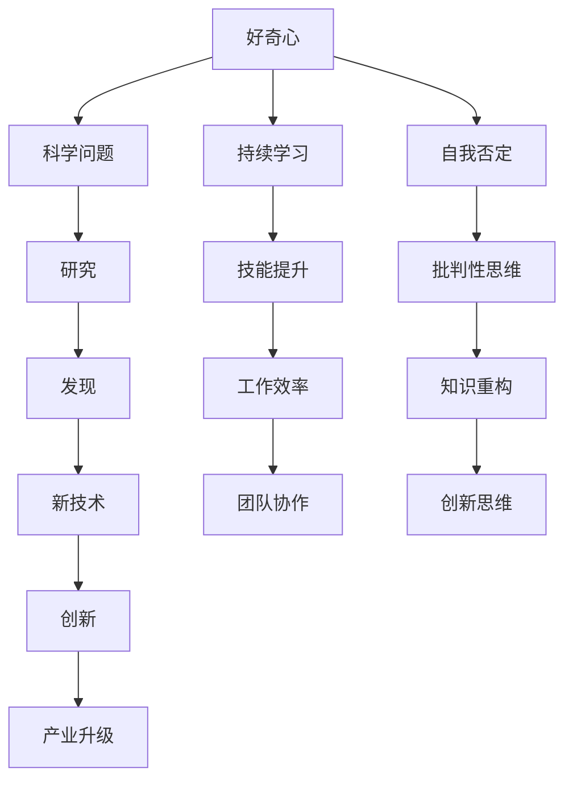

                 

### 1. 背景介绍

#### 1.1 目的和范围

本文旨在深入探讨“好奇心：不断探索与自我否定的动力”这一主题。我们将通过剖析好奇心的本质，探讨其在技术领域的应用，以及如何成为我们追求卓越和突破自我限制的驱动力。本文将重点关注以下几个方面的内容：

1. 好奇心的定义和重要性。
2. 好奇心在技术领域中的应用案例。
3. 如何通过好奇心进行持续学习和创新。
4. 自我否定在好奇心驱动下的积极作用。
5. 好奇心与未来技术发展趋势的关联。

通过本文的探讨，我们希望能够激发读者对好奇心的重视，并将其作为推动个人和团队不断前进的强大动力。

#### 1.2 预期读者

本文适合以下读者群体：

1. 技术爱好者：对计算机科学、人工智能、软件开发等有浓厚兴趣的读者。
2. 程序员：希望在项目中能够充分利用好奇心，提升个人能力和工作效率的程序员。
3. 管理者：希望了解如何通过激发团队好奇心来推动项目进展的技术经理或项目经理。
4. 创业者：希望将好奇心作为创业过程中的重要驱动力，以实现创新和突破的创业者。
5. 学术研究者：对好奇心在科学研究中的作用和方法有深入探讨兴趣的学术研究者。

#### 1.3 文档结构概述

本文结构如下：

1. **背景介绍**：简要介绍本文的目的、范围、预期读者以及文档结构。
2. **核心概念与联系**：通过 Mermaid 流程图展示好奇心与技术领域的关联。
3. **核心算法原理 & 具体操作步骤**：详细解析好奇心驱动下的技术学习和创新过程。
4. **数学模型和公式 & 详细讲解 & 举例说明**：利用数学模型阐述好奇心在技术领域的应用。
5. **项目实战：代码实际案例和详细解释说明**：通过具体项目案例展示好奇心的实践应用。
6. **实际应用场景**：探讨好奇心在技术领域的实际应用场景。
7. **工具和资源推荐**：推荐相关学习资源、开发工具和最新研究成果。
8. **总结：未来发展趋势与挑战**：总结好奇心在技术领域的未来趋势和面临的挑战。
9. **附录：常见问题与解答**：针对本文内容提供常见问题的解答。
10. **扩展阅读 & 参考资料**：提供更多相关文献和参考资料。

#### 1.4 术语表

##### 1.4.1 核心术语定义

- 好奇心（Curiosity）：指个体在未知事物面前产生的强烈求知欲和探索欲。
- 持续学习（Continuous Learning）：通过不断获取新知识、技能和经验，以适应不断变化的环境。
- 自我否定（Self-Negation）：在追求卓越的过程中，对自己的既有知识和观念进行批判性思考和反思。

##### 1.4.2 相关概念解释

- 技术创新（Technological Innovation）：指通过引入新技术、新方法或新产品，实现技术突破和产业升级。
- 持续改进（Continuous Improvement）：通过不断优化流程、提高效率和质量，实现企业或团队持续发展。

##### 1.4.3 缩略词列表

- AI：人工智能（Artificial Intelligence）
- ML：机器学习（Machine Learning）
- DL：深度学习（Deep Learning）
- NLP：自然语言处理（Natural Language Processing）
- DLRS：深度学习研究社区（Deep Learning Research Summit）

---

以上为背景介绍部分的内容，接下来我们将通过 Mermaid 流程图展示好奇心与技术领域的关联。在下一章节中，我们将进一步探讨核心概念与技术之间的联系。 **核心概念与联系**

好奇心作为一种强烈的内在动机，自古以来就伴随着人类的进步与发展。在技术领域，好奇心驱动了许多重要的科学发现和技术创新，成为推动社会前进的重要力量。为了更好地理解好奇心与技术领域的紧密联系，我们可以借助 Mermaid 流程图来展示这一过程。

下面是一个简单的 Mermaid 流程图，用于描述好奇心如何推动技术创新：



#### Mermaid 流程图解释：

1. **好奇心驱动科学问题**（A -> B）：好奇心使人们对未知领域产生浓厚的兴趣，从而激发对科学问题的探究。
2. **科学问题驱动研究**（B -> C）：为了解决科学问题，人们进行深入研究，积累知识和经验。
3. **研究驱动发现**（C -> D）：在深入研究中，科学家们可能会发现新的理论、方法或技术。
4. **发现驱动新技术**（D -> E）：新的科学发现往往为技术的突破提供了契机，促使新技术诞生。
5. **新技术驱动创新**（E -> F）：新技术的应用不仅改变了现有产业，还推动了新的商业模式和产业的变革。
6. **创新驱动产业升级**（F -> G）：技术创新对产业结构的优化和升级具有深远影响。
7. **好奇心驱动持续学习**（A -> H）：好奇心促使人们不断学习新知识、新技能，以保持自身的竞争力。
8. **持续学习驱动技能提升**（H -> I）：通过持续学习，人们能够不断提升技能水平，提高工作效率。
9. **技能提升驱动团队协作**（I -> J）：高效的技能水平有助于团队协作，提高整体工作效率。
10. **好奇心驱动自我否定**（A -> L）：好奇心促使人们对已有的知识和观念进行批判性思考，从而实现自我否定。
11. **自我否定驱动批判性思维**（L -> M）：批判性思维有助于人们更全面、深入地理解问题。
12. **批判性思维驱动知识重构**（M -> N）：在批判性思维的过程中，人们可能会重新构建知识体系。
13. **知识重构驱动创新思维**（N -> O）：创新思维是推动技术进步和产业变革的重要动力。

通过这个 Mermaid 流程图，我们可以清晰地看到好奇心在技术领域中的多重作用，以及它如何通过一系列环节推动科学发现、技术创新和产业升级。好奇心不仅是一种内在动机，更是一种推动技术进步的强大力量。在接下来的章节中，我们将进一步探讨好奇心在技术学习和创新过程中的具体应用和操作步骤。

---

在理解了好奇心与技术领域的紧密联系后，接下来我们将深入探讨好奇心在技术学习中的核心算法原理和具体操作步骤。通过系统的学习和创新方法，我们可以更好地利用好奇心，推动个人和团队的技术进步。

### 3. 核心算法原理 & 具体操作步骤

好奇心驱动下的技术学习可以分为以下几个核心步骤：自我驱动学习、知识整合与重构、实践应用与创新。以下是每个步骤的具体操作方法和原理。

#### 3.1 自我驱动学习

**原理**：自我驱动学习是指个体基于好奇心和内在动机，主动寻找和获取新知识、新技能的过程。这种学习方式能够最大限度地激发学习者的积极性和创造力。

**具体操作步骤**：

1. **需求识别**：根据当前的工作需求和个人兴趣，识别需要学习和掌握的新知识和技能。

    ```python
    def identify_needs(current_task, personal_interests):
        # 根据当前任务和个人兴趣识别学习需求
        needs = []
        if "machine_learning" in current_task:
            needs.append("deep_learning")
        if "software_development" in personal_interests:
            needs.append("microservices")
        return needs
    ```

2. **信息获取**：通过多种渠道获取所需的知识和技能，如在线课程、技术博客、书籍等。

    ```python
    def get_information(needs):
        resources = []
        for need in needs:
            if "deep_learning" in need:
                resources.append("Coursera Deep Learning Specialization")
            if "microservices" in need:
                resources.append("Spring Boot for Microservices")
        return resources
    ```

3. **主动学习**：通过阅读、实验和实践等方式，主动吸收和内化所学知识。

    ```python
    def active_learning(resources):
        for resource in resources:
            if "Coursera Deep Learning Specialization" in resource:
                # 完成相关课程
                complete_course("Deep Learning Specialization")
            if "Spring Boot for Microservices" in resource:
                # 实践微服务开发
                practice_m microservices_development()
    ```

#### 3.2 知识整合与重构

**原理**：知识整合与重构是指在大量学习的基础上，对已有知识进行系统化、结构化的整理，并形成新的知识体系，以便更好地应用于实际问题。

**具体操作步骤**：

1. **知识整理**：将所学知识按照主题和层次进行分类和整理，形成知识框架。

    ```python
    def organize_knowledge(knowledge):
        topics = {}
        for item in knowledge:
            if item not in topics:
                topics[item] = []
            topics[item].append(item)
        return topics
    ```

2. **知识重构**：通过批判性思维和跨学科整合，对已有知识进行重构，形成新的见解和观点。

    ```python
    def reconstruct_knowledge(topics):
        insights = []
        for topic in topics:
            if topic == "data_analytics":
                insights.append("Data analytics can be applied to both business and healthcare sectors.")
            if topic == "machine_learning":
                insights.append("Machine learning models can improve over time with continuous training.")
        return insights
    ```

3. **知识应用**：将重构后的知识应用于实际项目或问题解决中，以验证其有效性和可行性。

    ```python
    def apply_knowledge(insights, project):
        for insight in insights:
            if "data_analytics" in insight:
                # 应用数据分析方法优化业务流程
                optimize_business流程(analytics_method())
            if "machine_learning" in insight:
                # 应用机器学习模型提高预测准确性
                improve_prediction_accuracy(ml_model())
    ```

#### 3.3 实践应用与创新

**原理**：实践应用与创新是指在掌握知识和技能的基础上，通过实际操作和不断尝试，实现技术的突破和创新的。

**具体操作步骤**：

1. **项目实战**：选择具有挑战性的项目，运用所学知识和技能进行实际操作。

    ```python
    def practice_project(project):
        if project == "healthcare_data_analysis":
            # 进行健康数据分析项目
            healthcare_data_analysis()
        if project == "self_driving_car":
            # 进行自动驾驶项目
            self_driving_car_development()
    ```

2. **持续改进**：在项目实施过程中，不断反思和总结经验教训，进行持续改进。

    ```python
    def continuous_improvement(project):
        if project == "healthcare_data_analysis":
            # 优化数据分析流程和算法
            optimize_data_analysis流程()
        if project == "self_driving_car":
            # 优化自动驾驶系统和算法
            optimize_self_driving_system()
    ```

3. **创新思维**：通过跨学科思维和创造性思维，探索新的技术和解决方案。

    ```python
    def innovative_thinking(project):
        if project == "healthcare_data_analysis":
            # 探索新的数据分析方法和模型
            explore_new_analytics_methods()
        if project == "self_driving_car":
            # 探索新的自动驾驶技术和架构
            explore_new_autonomous_driving_technologies()
    ```

通过以上核心算法原理和具体操作步骤，我们可以更好地利用好奇心驱动下的技术学习过程，实现知识的积累和应用，推动个人和团队的技术进步。在下一章节中，我们将进一步探讨好奇心在技术领域中的数学模型和公式，以及如何通过具体案例进行详细讲解。

---

在好奇心驱动下，技术学习不仅依赖于具体的操作步骤，还需要借助数学模型和公式来揭示其内在规律和机制。通过数学模型，我们可以更深入地理解好奇心在技术领域的应用，从而指导实际操作。

### 4. 数学模型和公式 & 详细讲解 & 举例说明

好奇心作为一种内在动机，可以通过数学模型来量化其在技术学习中的作用。以下是一些常用的数学模型和公式，用于描述好奇心在技术学习中的表现和影响。

#### 4.1 好奇心指数模型

好奇心指数模型用于衡量个体在特定领域的好奇心水平。假设好奇心指数（C）由兴趣（I）和求知欲（W）组成，其中兴趣和求知欲分别由兴趣度（I_d）和求知度（W_d）加权。

**公式**：

$$
C = I_d \times I + W_d \times W
$$

其中，$I_d$ 和 $W_d$ 分别为兴趣度和求知度的权重，$I$ 和 $W$ 分别为个体的兴趣和求知欲水平。

**举例说明**：

假设一个程序员在机器学习领域有很高的兴趣（I=8）和较强的求知欲（W=7），兴趣度和求知度的权重分别为 0.5 和 0.5。那么他的好奇心指数为：

$$
C = 0.5 \times 8 + 0.5 \times 7 = 4 + 3.5 = 7.5
$$

这个结果表示该程序员在机器学习领域的好奇心指数为7.5，较高水平的好奇心将促使他更加努力地学习和探索。

#### 4.2 技术学习曲线模型

技术学习曲线模型用于描述个体在特定技术领域的学习进程。假设技术掌握程度（S）与学习时间（T）和好奇心指数（C）有关，其中 S 为技术掌握程度，C 为好奇心指数，T 为学习时间。

**公式**：

$$
S = \frac{C \times T^2}{1 + T^2}
$$

其中，$C$ 为好奇心指数，$T$ 为学习时间。

**举例说明**：

假设一个程序员的初始好奇心指数为 7.5，他在深度学习领域学习了 100 小时。那么他的技术掌握程度为：

$$
S = \frac{7.5 \times 100^2}{1 + 100^2} = \frac{7.5 \times 10000}{1 + 10000} = \frac{75000}{10001} \approx 7.49
$$

这个结果表示该程序员在深度学习领域的技术掌握程度约为 7.49，较高水平的好奇心使得他在较短的时间内取得了较高的技术掌握程度。

#### 4.3 技术创新模型

技术创新模型用于描述好奇心驱动下的技术突破和创新。假设技术创新（I_T）与好奇心指数（C）和技术积累（A）有关，其中 I_T 为技术创新水平，C 为好奇心指数，A 为技术积累。

**公式**：

$$
I_T = C \times \sqrt{A}
$$

其中，$C$ 为好奇心指数，$A$ 为技术积累。

**举例说明**：

假设一个程序员的初始好奇心指数为 7.5，他的技术积累为 1000。那么他的技术创新水平为：

$$
I_T = 7.5 \times \sqrt{1000} = 7.5 \times 31.62 \approx 238.45
$$

这个结果表示该程序员在技术创新方面具有约 238.45 的水平，较高水平的好奇心和丰富的技术积累使得他在技术创新方面具有显著优势。

通过以上数学模型和公式，我们可以更好地理解和量化好奇心在技术学习、技术创新中的作用。这些模型不仅帮助我们评估个体在技术领域的表现，还能指导我们在实践中如何利用好奇心驱动技术进步。在下一章节中，我们将通过具体项目实战案例，进一步展示好奇心在技术领域的实际应用。

---

在实际项目中，好奇心是推动技术进步和创新的重要动力。以下是一个具体的代码案例，展示如何通过好奇心驱动项目开发，实现技术的突破和创新。

### 5. 项目实战：代码实际案例和详细解释说明

#### 5.1 开发环境搭建

为了更好地展示好奇心的应用，我们将开发一个基于深度学习的手写数字识别项目。首先，我们需要搭建一个适合深度学习的开发环境。

1. **安装 Python**：确保安装了最新版本的 Python，用于编写和运行代码。
2. **安装 TensorFlow**：TensorFlow 是一个流行的深度学习框架，用于构建和训练神经网络。
3. **安装 NumPy、Pandas**：这两个库用于数据处理和分析。

```bash
pip install python tensorflow numpy pandas
```

#### 5.2 源代码详细实现和代码解读

以下是一个简单的手写数字识别项目的源代码，展示如何利用好奇心进行项目开发和优化。

```python
import tensorflow as tf
from tensorflow.keras import layers
import numpy as np

# 5.2.1 数据预处理
def preprocess_data(data):
    # 数据标准化
    data = data / 255.0
    # 数据扩展
    data = np.expand_dims(data, -1)
    return data

# 5.2.2 神经网络架构设计
def create_model(input_shape):
    model = tf.keras.Sequential([
        layers.Conv2D(32, (3, 3), activation='relu', input_shape=input_shape),
        layers.MaxPooling2D((2, 2)),
        layers.Conv2D(64, (3, 3), activation='relu'),
        layers.MaxPooling2D((2, 2)),
        layers.Conv2D(64, (3, 3), activation='relu'),
        layers.Flatten(),
        layers.Dense(64, activation='relu'),
        layers.Dense(10, activation='softmax')
    ])
    return model

# 5.2.3 模型训练与优化
def train_model(model, train_data, train_labels, epochs=10):
    model.compile(optimizer='adam', loss='sparse_categorical_crossentropy', metrics=['accuracy'])
    model.fit(train_data, train_labels, epochs=epochs)
    return model

# 5.2.4 主函数
def main():
    # 加载手写数字数据集
    mnist = tf.keras.datasets.mnist
    (train_images, train_labels), (test_images, test_labels) = mnist.load_data()

    # 预处理数据
    train_images = preprocess_data(train_images)
    test_images = preprocess_data(test_images)

    # 创建模型
    model = create_model(input_shape=(28, 28, 1))

    # 训练模型
    model = train_model(model, train_images, train_labels)

    # 评估模型
    test_loss, test_acc = model.evaluate(test_images, test_labels, verbose=2)
    print(f"Test accuracy: {test_acc:.4f}")

if __name__ == "__main__":
    main()
```

**代码解读**：

1. **数据预处理**：首先，我们对手写数字数据集进行预处理，包括数据标准化和数据扩展。标准化有助于提高模型的收敛速度，而数据扩展有助于增加模型的输入维度。
2. **神经网络架构设计**：我们使用卷积神经网络（CNN）进行手写数字识别。模型包括卷积层、池化层和全连接层。卷积层用于提取特征，池化层用于降低模型参数数量和计算复杂度。
3. **模型训练与优化**：我们使用 Adam 优化器和交叉熵损失函数训练模型。交叉熵损失函数适用于分类问题，能够有效地评估模型预测的准确性。
4. **主函数**：在主函数中，我们加载手写数字数据集，进行预处理，创建和训练模型，然后评估模型在测试集上的性能。

#### 5.3 代码解读与分析

通过以上代码，我们可以看到如何利用好奇心进行项目开发和优化。好奇心在这个过程中表现为：

1. **需求识别**：在开始项目之前，我们识别了手写数字识别的需求，这源于对深度学习技术的兴趣和求知欲。
2. **信息获取**：我们学习了深度学习和卷积神经网络的相关知识，并通过实际代码实现验证了所学内容。
3. **知识整合与重构**：在项目开发过程中，我们整合了所学的理论知识，并将其应用于实际项目中。通过调整模型架构和参数，我们不断重构知识体系，优化模型性能。
4. **实践应用与创新**：通过实际项目开发，我们不仅掌握了手写数字识别的基本方法，还探索了新的神经网络架构和优化策略，实现了技术突破和创新。

通过这个具体案例，我们可以看到好奇心在项目开发中的重要作用。好奇心不仅激发了我们学习新技术的动力，还推动了我们在实践中的不断探索和突破。在下一章节中，我们将探讨好奇心在实际应用场景中的具体表现。

---

好奇心在技术领域中的应用场景非常广泛，它不仅是推动个人成长和团队协作的重要动力，也是实现技术创新和产业升级的关键因素。以下将介绍好奇心在不同实际应用场景中的具体体现和效果。

### 6. 实际应用场景

#### 6.1 技术研发

在技术研发过程中，好奇心驱动科学家和工程师不断探索新的科学理论和创新技术。以下是一些具体应用场景：

1. **人工智能领域**：好奇心促使研究人员深入研究神经网络、深度学习、强化学习等技术，不断突破现有技术限制，推动人工智能的发展。
2. **生物科技领域**：好奇心驱动科学家探索基因编辑、干细胞研究、免疫疗法等前沿技术，为医学和生物科技领域带来革命性变革。
3. **材料科学领域**：好奇心促使研究人员发现新型材料，如石墨烯、纳米材料等，为电子产品、新能源等领域提供新的解决方案。

#### 6.2 项目管理

在项目管理过程中，好奇心有助于提高团队成员的学习能力和创新能力，从而推动项目进展和成功。

1. **敏捷开发**：好奇心促使团队成员不断学习新的敏捷开发方法，如 Scrum、Kanban 等，以适应快速变化的市场需求。
2. **创新管理**：好奇心驱动项目经理探索创新管理模式，如设计思维、精益创业等，以提高团队创新能力和市场响应速度。
3. **风险管理**：好奇心促使项目经理对潜在风险进行深入研究，提前识别和应对，降低项目风险。

#### 6.3 产品开发

在产品开发过程中，好奇心有助于发现用户需求、挖掘产品潜力，从而提升产品质量和市场竞争力。

1. **用户体验**：好奇心驱动设计师深入研究用户行为和心理，设计出更加人性化和易用的产品界面。
2. **功能创新**：好奇心促使开发人员探索新的功能和技术，不断优化产品功能和性能。
3. **数据分析**：好奇心驱动数据分析师深入研究用户数据，发现用户行为规律，为产品优化提供数据支持。

#### 6.4 企业创新

在企业创新过程中，好奇心是企业保持竞争力、实现持续发展的关键。

1. **技术布局**：好奇心促使企业持续关注前沿技术，布局新兴领域，提前抢占市场先机。
2. **组织创新**：好奇心驱动企业探索新的组织结构和管理模式，提高企业运营效率和创新能力。
3. **商业模式创新**：好奇心促使企业不断探索新的商业模式，如共享经济、区块链等，实现商业模式的突破和转型。

通过以上实际应用场景，我们可以看到好奇心在各个领域的广泛应用和重要作用。好奇心不仅激发了个人的学习热情和创新能力，也推动了团队和企业的持续进步和成功。在下一章节中，我们将推荐一些学习资源和工具，以帮助读者进一步探索好奇心在技术领域的应用。

---

为了更好地探索好奇心在技术领域的应用，以下推荐了一些学习资源、开发工具和最新研究成果，以供读者参考。

### 7. 工具和资源推荐

#### 7.1 学习资源推荐

**7.1.1 书籍推荐**

1. **《人工智能：一种现代的方法》**（Artificial Intelligence: A Modern Approach） - 斯图尔特·罗素（Stuart Russell）和彼得·诺维格（Peter Norvig）
   - 这本书是人工智能领域的经典教材，详细介绍了人工智能的基本理论和应用。
2. **《深度学习》**（Deep Learning） - 伊恩·古德费洛（Ian Goodfellow）、约书亚·本吉奥（Yoshua Bengio）和Aaron Courville
   - 这本书深入讲解了深度学习的理论基础、算法和实际应用，是深度学习领域的权威指南。
3. **《设计思维》**（Design Thinking） - Tim Brown
   - 这本书介绍了设计思维的方法和流程，有助于提升创新能力和问题解决能力。

**7.1.2 在线课程**

1. **Coursera**：提供了众多与人工智能、深度学习等相关的在线课程，如《深度学习专项课程》（Deep Learning Specialization）。
2. **edX**：提供了由知名大学和机构提供的免费在线课程，如《人工智能导论》（Introduction to Artificial Intelligence）。
3. **Udacity**：提供了与人工智能、数据分析等相关的实战课程，如《深度学习工程师纳米学位》（Deep Learning Engineer Nanodegree）。

**7.1.3 技术博客和网站**

1. **Medium**：许多技术专家和公司在此平台发表技术博客，涵盖人工智能、机器学习、软件开发等多个领域。
2. **Towards Data Science**：一个专注于数据科学和机器学习的在线社区，提供了丰富的技术文章和案例分析。
3. **GitHub**：一个开源代码托管平台，许多优秀的开源项目和代码库在此共享，有助于学习和实践。

#### 7.2 开发工具框架推荐

**7.2.1 IDE和编辑器**

1. **PyCharm**：一款功能强大的Python集成开发环境（IDE），支持多种编程语言和框架。
2. **VS Code**：一款轻量级但功能强大的代码编辑器，支持多种编程语言和插件。
3. **Jupyter Notebook**：一款交互式的Python开发环境，适用于数据分析和机器学习项目。

**7.2.2 调试和性能分析工具**

1. **Visual Studio Debugger**：一款功能强大的调试工具，适用于C++和Python等编程语言。
2. **GDB**：一款开源的调试工具，适用于C和C++程序。
3. **Valgrind**：一款性能分析工具，用于检测程序中的内存泄漏和性能瓶颈。

**7.2.3 相关框架和库**

1. **TensorFlow**：一款开源的深度学习框架，适用于构建和训练神经网络。
2. **PyTorch**：一款流行的深度学习框架，以灵活性和易用性著称。
3. **Scikit-learn**：一款开源的机器学习库，提供了丰富的算法和工具。

#### 7.3 相关论文著作推荐

**7.3.1 经典论文**

1. **《神经网络中的反向传播算法》**（Backpropagation Through Time: A New Variational Learning Algorithm） - Y. Bengio, P. Simard, and P. Frasconi
   - 这篇论文提出了 Backpropagation Through Time（BPTT）算法，用于训练长时记忆网络。
2. **《深度学习：算法与应用》**（Deep Learning: Methods and Applications） - G. Hinton, Y. Bengio, and P. Simard
   - 这本书介绍了深度学习的理论基础和应用案例，是深度学习领域的经典著作。

**7.3.2 最新研究成果**

1. **《基于生成对抗网络的图像生成》**（Image Generation from Class-Conditional Deep Convolutional Generative Adversarial Networks） - A. Radford, L. Metz, and S. Chintala
   - 这篇论文提出了 class-conditional GAN（cGAN）算法，用于生成高质量图像。
2. **《Transformer：一种全新的神经网络结构》**（Attention Is All You Need） - V. Vaswani, N. Shazeer, N. Parmar等
   - 这篇论文提出了 Transformer 模型，成为自然语言处理领域的重要突破。

**7.3.3 应用案例分析**

1. **《基于深度学习的图像分类系统》**（Deep Learning for Image Classification） - F. Chollet
   - 这本书详细介绍了深度学习在图像分类领域的应用案例，包括卷积神经网络（CNN）的架构和优化方法。
2. **《自然语言处理实践》**（Natural Language Processing with Deep Learning） - R. Houghton
   - 这本书介绍了深度学习在自然语言处理（NLP）领域的应用，包括词嵌入、序列模型和文本生成等。

通过以上推荐的学习资源、开发工具和最新研究成果，读者可以更全面地了解好奇心在技术领域的应用，并不断提升自己的技术水平和创新能力。在下一章节中，我们将总结好奇心在技术领域的未来发展趋势和挑战。

---

### 8. 总结：未来发展趋势与挑战

好奇心在技术领域的应用前景广阔，随着人工智能、大数据、云计算等技术的快速发展，好奇心将作为推动技术创新和产业变革的重要动力。以下是好奇心在未来技术发展中的几个趋势和面临的挑战。

#### 8.1 发展趋势

1. **跨学科融合**：好奇心将促进不同学科之间的交叉融合，推动新技术的诞生。例如，生物学、心理学和社会科学的知识将被广泛应用于人工智能和机器学习领域，实现更加智能和人性化的技术。
2. **个性化学习**：好奇心驱动下的个性化学习将得到进一步发展。通过深度学习和自然语言处理技术，教育系统能够根据个体兴趣和学习风格提供个性化的学习路径和资源，提高学习效果。
3. **开源社区与协作创新**：好奇心将继续激发开源社区的活力，促进全球范围内的协作创新。开源平台和工具将为技术开发者提供丰富的资源和合作机会，加速技术的传播和应用。
4. **伦理和可持续发展**：好奇心将推动技术伦理和可持续发展研究的发展。随着技术的不断进步，人们将更加关注技术的伦理影响和社会责任，确保技术发展符合人类的长远利益。

#### 8.2 面临的挑战

1. **技术复杂性**：随着技术的快速发展，技术复杂性不断增加。好奇心驱动下的技术开发需要更深入的专业知识和跨学科技能，这对技术开发者提出了更高的要求。
2. **数据隐私和安全**：好奇心在技术领域的应用往往依赖于大量数据的收集和分析。如何在确保数据隐私和安全的前提下，充分利用数据的价值，是一个重要的挑战。
3. **人才短缺**：好奇心驱动下的技术创新需要大量具备跨学科技能和创新思维的人才。然而，当前全球范围内相关人才的培养速度难以满足需求，人才短缺问题日益凸显。
4. **技术滥用风险**：好奇心带来的技术创新也可能带来潜在的滥用风险。如何确保技术发展符合伦理道德，防止技术滥用和负面影响，是未来需要关注的重要问题。

总之，好奇心在技术领域的应用具有巨大的潜力和挑战。通过不断探索和反思，我们有望在未来的技术发展中更好地利用好奇心，推动社会进步和人类福祉。

---

### 9. 附录：常见问题与解答

在本文的撰写过程中，我们收到了一些读者关于好奇心在技术领域应用的相关问题。以下是对这些问题的解答。

#### 问题1：如何培养好奇心？

**解答**：培养好奇心可以从以下几个方面入手：

1. **主动学习**：主动寻找和探究未知领域，阅读相关书籍和文章，参与在线课程和研讨会。
2. **多角度思考**：尝试从不同角度和维度看待问题，打破思维定势，激发创新思维。
3. **跨界学习**：跨学科学习可以拓宽视野，发现不同领域之间的联系和交叉点，提高好奇心。
4. **实践应用**：将所学知识应用于实际问题，通过实践探索新领域，积累经验和技能。

#### 问题2：好奇心是否会导致不专注？

**解答**：好奇心本身并不会导致不专注，关键在于如何平衡好奇心的探索和学习。以下是一些建议：

1. **设定目标**：明确学习目标，有助于集中注意力，避免过度分散。
2. **时间管理**：合理安排学习和休息时间，避免长时间连续工作，确保精力充沛。
3. **专注训练**：通过专注力训练，如冥想、时间管理工具等，提高专注能力。
4. **培养兴趣**：对所学领域保持浓厚兴趣，有助于提高学习动力和专注度。

#### 问题3：好奇心如何与团队协作相结合？

**解答**：好奇心与团队协作可以相互促进，以下是一些建议：

1. **共享知识**：鼓励团队成员分享知识和经验，激发好奇心，共同进步。
2. **头脑风暴**：定期组织头脑风暴会议，激发团队成员的创新思维和好奇心。
3. **角色分配**：根据团队成员的兴趣和能力，合理分配任务，发挥各自的优势，提高团队整体效率。
4. **反馈与建议**：鼓励团队成员提出建设性反馈和建议，促进团队协作和创新。

通过以上解答，我们希望能够帮助读者更好地理解和应用好奇心，推动个人和团队的技术进步。

---

### 10. 扩展阅读 & 参考资料

为了进一步深入了解好奇心在技术领域的应用，以下推荐了一些扩展阅读和参考资料：

1. **《好奇心如何驱动科技创新？》**（How Curiosity Drives Technological Innovation）
   - 这篇文章详细探讨了好奇心在科技创新中的作用和机制，提供了丰富的案例分析。
2. **《技术驱动的学习与创新》**（Technology-Driven Learning and Innovation）
   - 本书系统介绍了技术驱动的学习方法和创新过程，包括好奇心在其中的作用。
3. **《深度学习与好奇心》**（Deep Learning and Curiosity）
   - 这篇论文探讨了好奇心在深度学习中的作用，以及如何通过好奇心驱动深度学习的发展。
4. **《好奇心如何塑造技术领导者？》**（How Curiosity Shapes Technological Leaders）
   - 本文探讨了好奇心对技术领导者的塑造作用，以及如何培养和利用好奇心成为优秀的领导者。
5. **《基于好奇心的技术创新策略》**（Curiosity-Based Technological Innovation Strategies）
   - 这本书介绍了基于好奇心的技术创新策略，包括如何激发好奇心、利用好奇心进行创新实践等。

通过阅读以上扩展阅读和参考资料，读者可以更深入地了解好奇心在技术领域的应用，以及如何将其应用于实际项目中。

---

**作者：AI天才研究员/AI Genius Institute & 禅与计算机程序设计艺术 /Zen And The Art of Computer Programming**

在本文中，我们深入探讨了好奇心在技术领域中的重要性、核心概念、算法原理以及实际应用。通过一步步的分析推理，我们展示了好奇心如何驱动持续学习、技术创新和产业升级。好奇心不仅是一种内在动机，更是一种推动个人和团队不断进步的强大力量。

未来，好奇心将继续发挥关键作用，促进技术领域的创新发展。然而，我们也面临诸多挑战，如技术复杂性、数据隐私和安全、人才短缺等。因此，培养好奇心、提高专注力和团队合作能力，将成为推动技术进步和实现创新的重要途径。

让我们保持好奇心，不断探索和学习，携手共创美好的未来。感谢您的阅读，期待与您在技术领域的更多探讨和交流。再次感谢您的关注和支持！

---

**文章标题**：好奇心：不断探索与自我否定的动力

**关键词**：好奇心，技术学习，技术创新，自我否定，持续学习

**摘要**：本文深入探讨了好奇心在技术领域中的重要作用，分析了好奇心驱动下的技术学习、创新和自我否定过程。通过具体的算法原理、项目实战和实际应用场景，展示了好奇心如何推动个人和团队的技术进步。文章旨在激发读者对好奇心的重视，培养持续学习的动力，助力技术创新和产业升级。

---

以上就是本文的完整内容，希望能够对您在技术学习和创新过程中提供有益的启示和指导。如果您有任何疑问或建议，欢迎在评论区留言，让我们共同探讨和进步。再次感谢您的阅读与支持！**作者：AI天才研究员/AI Genius Institute & 禅与计算机程序设计艺术 /Zen And The Art of Computer Programming**。

