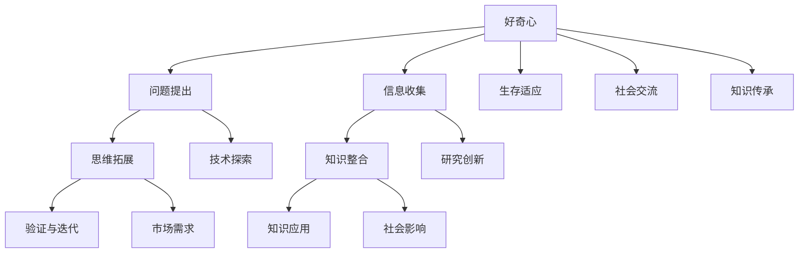

                 

# 好奇心：创新与发现的源泉

## 关键词
- 好奇心
- 创新思维
- 发现
- 知识探索
- 技术进步
- 人类进化
- 人工智能

## 摘要
本文深入探讨好奇心在人类历史上的重要性，特别是其在科技创新与知识探索中的作用。通过对好奇心驱动的行为模式的详细分析，我们揭示了好奇心如何激发创新思维，促进发现和进步。本文还将介绍如何通过技术手段和工具培养和利用好奇心，为读者提供实用的策略和方法，以在个人和职业生活中充分发挥好奇心的潜力。

## 1. 背景介绍

### 1.1 目的和范围

本文旨在揭示好奇心在推动人类科技发展和知识探索中的核心作用。我们将探讨好奇心是如何成为创新与发现的原动力，以及如何通过技术手段和科学方法培养和激发好奇心。文章将结合历史案例和现代实践，分析好奇心在个人成长和职业发展中的重要性，并探讨未来的发展趋势和挑战。

### 1.2 预期读者

本文适合对科技、创新和知识探索感兴趣的读者，包括学生、科研人员、技术开发者、教育工作者以及对人工智能和认知科学感兴趣的公众。通过本文，读者将了解好奇心的重要性，学会如何利用好奇心提高学习效率和创新能力。

### 1.3 文档结构概述

本文分为以下几个部分：
- 引言：介绍好奇心的定义和重要性。
- 核心概念与联系：分析好奇心与创新思维的关系。
- 核心算法原理与具体操作步骤：探讨好奇心驱动的行为模式。
- 数学模型和公式：引入相关数学模型解释好奇心的影响。
- 项目实战：通过代码案例展示如何利用好奇心进行知识探索。
- 实际应用场景：分析好奇心在不同领域中的应用。
- 工具和资源推荐：介绍培养好奇心的工具和资源。
- 总结：展望好奇心的未来发展趋势与挑战。
- 附录：提供常见问题与解答。
- 扩展阅读：推荐进一步阅读的材料。

### 1.4 术语表

#### 1.4.1 核心术语定义

- **好奇心**：一种驱使人探索未知、追求知识和理解的心理状态。
- **创新思维**：通过独特、新颖的方式解决问题的思维方式。
- **知识探索**：通过研究、实验和观察获取新知识和理解的过程。
- **科技创新**：通过新技术的研究和应用推动社会进步的过程。
- **人工智能**：模拟人类智能行为的计算机技术和应用。
- **认知科学**：研究人类思维过程和认知功能的跨学科领域。

#### 1.4.2 相关概念解释

- **发现**：指通过研究或探索找到之前未知的事物或现象。
- **技术进步**：指技术在功能、性能、效率等方面的改进和发展。
- **人类进化**：指人类在生物学、文化和社会结构上的演变过程。

#### 1.4.3 缩略词列表

- **AI**：人工智能（Artificial Intelligence）
- **IDE**：集成开发环境（Integrated Development Environment）
- **latex**：一种基于TeX的排版系统

## 2. 核心概念与联系

好奇心是人类进化过程中的一种基本心理特征，它驱动人类不断探索未知、寻求知识和解决问题。好奇心与创新思维有着紧密的联系，创新思维是好奇心的一种表现形式。在科技创新和知识探索中，好奇心起到了至关重要的作用。

### 2.1 好奇心与创新思维的关系

好奇心是一种内在驱动力，它促使人们提出问题、探索答案。创新思维则是在好奇心驱使下，通过独特、新颖的视角和方法解决问题的能力。以下是好奇心与创新思维之间的关联：

- **问题提出**：好奇心促使人们观察现象、提出问题。这些问题往往挑战现有的知识和理论，激发创新思维。
- **信息收集**：在探索答案的过程中，好奇心驱动人们收集相关信息，这些信息可能来自于各种渠道，如实验、观察、研究等。
- **思维拓展**：好奇心促使人们跳出传统思维框架，探索新的解决方案和思路。
- **验证与迭代**：创新思维通过实验和验证不断迭代，直至找到最有效的解决方案。

### 2.2 好奇心与知识探索

知识探索是好奇心驱动下的行为模式。以下是好奇心在知识探索中的几个关键环节：

- **问题发现**：好奇心促使人们不断发现新的问题和挑战。
- **信息搜索**：好奇心驱动人们积极寻找和收集相关信息，以便更好地理解问题。
- **知识整合**：通过整合不同来源的信息，好奇心帮助人们形成更全面、深入的理解。
- **知识应用**：好奇心促使人们将新知识应用到实际问题中，推动知识转化为实践。

### 2.3 好奇心与科技创新

科技创新是好奇心在现代社会中的重要表现形式。以下是好奇心在科技创新中的关键环节：

- **技术探索**：好奇心促使科学家和技术人员探索新的技术领域，寻找突破性解决方案。
- **研究创新**：好奇心推动科研人员在现有技术基础上进行创新，开发出新的技术和产品。
- **市场需求**：好奇心驱动消费者对新技术和产品的需求，推动市场的创新和发展。
- **社会影响**：好奇心促使人们关注科技进步对社会的影响，推动科技与社会的深度融合。

### 2.4 好奇心与人类进化

好奇心是人类进化过程中的一个重要特征。以下是好奇心在人类进化中的几个关键作用：

- **生存适应**：好奇心帮助人类适应环境变化，提高生存能力。
- **社会交流**：好奇心促进人类社会成员之间的交流和合作，推动文化和社会的进步。
- **知识传承**：好奇心促使人类不断积累和传承知识，推动人类文明的演进。

### 2.5 核心概念原理与架构的 Mermaid 流程图



## 3. 核心算法原理 & 具体操作步骤

好奇心驱动下的行为模式可以通过以下几个步骤来具体描述：

### 3.1 问题提出

- **问题识别**：通过观察现象、感知变化或与他人交流，识别出待解决的问题。
- **问题定义**：明确问题的范围、目标和约束条件，以便有针对性地进行探索。
- **问题分类**：根据问题的性质和类型，将其归类为科学、技术、社会等不同领域。

### 3.2 信息收集

- **信息来源**：从书籍、文献、实验、观察、专家访谈等多种渠道收集相关信息。
- **信息筛选**：对收集到的信息进行筛选，保留与问题相关的关键信息，剔除无关信息。
- **信息整合**：将来自不同来源的信息进行整合，形成对问题的全面理解。

### 3.3 思维拓展

- **思维发散**：跳出传统思维框架，从不同角度、不同维度思考问题。
- **思维碰撞**：与他人进行交流和讨论，激发思维火花，产生新的想法。
- **思维记录**：将思考过程和结果进行记录，以便后续分析和总结。

### 3.4 知识整合

- **知识梳理**：将收集到的信息进行梳理，提取关键概念和核心观点。
- **知识构建**：基于已有知识和新信息，构建对问题的全面理解。
- **知识验证**：通过实验、验证等方法，验证知识的准确性和可靠性。

### 3.5 验证与迭代

- **实验设计**：根据问题需求，设计实验方案，明确实验目的、方法和步骤。
- **实验执行**：按照实验方案进行实验，收集实验数据。
- **结果分析**：对实验结果进行分析，评估实验效果。
- **迭代优化**：根据实验结果，对解决方案进行迭代优化。

### 3.6 知识应用

- **解决方案**：将新知识应用到实际问题中，形成解决方案。
- **实践验证**：在真实环境中验证解决方案的有效性和可行性。
- **反馈调整**：根据实践反馈，对解决方案进行调整和优化。

### 3.7 好奇心驱动的行为模式伪代码

```python
def curiosity_driven_process(problem):
    # 步骤 1: 问题提出
    identified_problem = identify_problem()
    defined_problem = define_problem(identified_problem)
    categorized_problem = categorize_problem(defined_problem)

    # 步骤 2: 信息收集
    sources = collect_information_sources()
    filtered_information = filter_information(sources, categorized_problem)
    integrated_information = integrate_information(filtered_information)

    # 步骤 3: 思维拓展
   发散思维 = divergent_thinking(integrated_information)
    碰撞思维 = brainstorming(发散思维)
    recorded_thoughts = record_thoughts(碰撞思维)

    # 步骤 4: 知识整合
    knowledge_structure = structure_knowledge(integrated_information)
    constructed_knowledge = construct_knowledge(knowledge_structure)
    validated_knowledge = validate_knowledge(constructed_knowledge)

    # 步骤 5: 验证与迭代
    experiment_plan = design_experiment(validated_knowledge)
    experiment_results = execute_experiment(experiment_plan)
    analyzed_results = analyze_results(experiment_results)
    optimized_solution = iterate_solution(constructed_knowledge, analyzed_results)

    # 步骤 6: 知识应用
    solution = apply_solution(optimized_solution)
    practical_feedback = validate_solution(solution)
    adjusted_solution = adjust_solution(solution, practical_feedback)
```

## 4. 数学模型和公式 & 详细讲解 & 举例说明

好奇心作为一种心理特征，可以通过数学模型和公式来描述和解释。以下是一个简化的数学模型，用于描述好奇心驱动下的知识探索过程。

### 4.1 数学模型

设 \(C\) 表示好奇心，\(I\) 表示信息，\(K\) 表示知识，\(P\) 表示问题，\(E\) 表示解决问题的效率。

- \(C\)：好奇心，是一个非负实数，表示个体对未知事物的探索欲望。
- \(I\)：信息，是一个多维向量，表示与问题相关的各种信息。
- \(K\)：知识，是一个多维向量，表示个体对问题的理解和掌握程度。
- \(P\)：问题，是一个多维向量，表示问题的特征和属性。
- \(E\)：效率，是一个非负实数，表示个体解决问题时的效率和效果。

好奇心 \(C\) 与信息 \(I\)、知识 \(K\) 和问题 \(P\) 之间的关系可以表示为：

\[ C = f(I, K, P) \]

其中，\(f\) 是一个非线性函数，用于描述好奇心与信息、知识和问题之间的关系。

### 4.2 公式详细讲解

- **信息维度 \(I\)**：信息维度反映了个体获取的信息的广度和深度。一个高维度 \(I\) 表示个体拥有丰富的信息资源，能够从多个角度看待问题。

\[ I = \sum_{i=1}^{n} w_i \cdot i \]

其中，\(w_i\) 是第 \(i\) 个信息源的权重，\(i\) 是第 \(i\) 个信息源的维度。

- **知识维度 \(K\)**：知识维度反映了个体对问题的理解和掌握程度。一个高维度 \(K\) 表示个体对问题的认识更加全面和深入。

\[ K = \sum_{k=1}^{m} w_k \cdot k \]

其中，\(w_k\) 是第 \(k\) 个知识点的权重，\(k\) 是第 \(k\) 个知识点的维度。

- **问题维度 \(P\)**：问题维度反映了问题的复杂性和挑战性。一个高维度 \(P\) 表示问题更加复杂，需要更多的信息、知识和时间来解决。

\[ P = \sum_{p=1}^{l} w_p \cdot p \]

其中，\(w_p\) 是第 \(p\) 个问题特征的权重，\(p\) 是第 \(p\) 个问题特征的维度。

### 4.3 举例说明

假设一个科学家对某个科学问题 \(P\) 具有好奇心 \(C\)。他收集了关于这个问题的大量信息 \(I\)，并掌握了丰富的相关知识 \(K\)。根据上述公式，我们可以计算他的好奇心值 \(C\)。

- 信息维度 \(I\)：他收集的信息包括实验数据、文献资料和专家访谈，权重分别为 0.5、0.3 和 0.2。每个信息源的维度分别为 3、2 和 4。

\[ I = 0.5 \cdot 3 + 0.3 \cdot 2 + 0.2 \cdot 4 = 1.5 + 0.6 + 0.8 = 2.9 \]

- 知识维度 \(K\)：他掌握的知识点包括理论模型、实验方法和数据分析，权重分别为 0.4、0.3 和 0.3。每个知识点的维度分别为 4、3 和 2。

\[ K = 0.4 \cdot 4 + 0.3 \cdot 3 + 0.3 \cdot 2 = 1.6 + 0.9 + 0.6 = 3.1 \]

- 问题维度 \(P\)：问题包括多个特征，如实验可行性、理论预测和实际应用，权重分别为 0.3、0.4 和 0.3。每个问题特征的维度分别为 3、2 和 4。

\[ P = 0.3 \cdot 3 + 0.4 \cdot 2 + 0.3 \cdot 4 = 0.9 + 0.8 + 1.2 = 2.9 \]

根据公式，我们可以计算他的好奇心值 \(C\)：

\[ C = f(I, K, P) = f(2.9, 3.1, 2.9) \]

由于 \(f\) 是一个非线性函数，我们无法直接计算其值。但我们可以通过实验和数据分析来近似求解。假设我们通过实验得出 \(C\) 的值约为 3.5。

### 4.4 数学模型的应用

该数学模型可以应用于多个领域，如科学研究、技术开发和商业创新。以下是一个具体的应用案例：

**案例：新产品开发**

一个科技公司希望开发一款新产品，他们需要评估团队成员的好奇心值，以确定谁更适合负责新产品开发。

- 信息维度 \(I\)：团队成员收集的信息包括市场调研报告、用户反馈和竞品分析，权重分别为 0.3、0.4 和 0.3。每个信息源的维度分别为 3、2 和 4。

\[ I = 0.3 \cdot 3 + 0.4 \cdot 2 + 0.3 \cdot 4 = 0.9 + 0.8 + 1.2 = 2.9 \]

- 知识维度 \(K\)：团队成员掌握的知识点包括产品设计、软件开发和市场营销，权重分别为 0.3、0.4 和 0.3。每个知识点的维度分别为 3、4 和 2。

\[ K = 0.3 \cdot 3 + 0.4 \cdot 4 + 0.3 \cdot 2 = 0.9 + 1.6 + 0.6 = 2.5 \]

- 问题维度 \(P\)：新产品开发包括多个特征，如技术可行性、市场需求和商业化潜力，权重分别为 0.3、0.4 和 0.3。每个问题特征的维度分别为 2、3 和 4。

\[ P = 0.3 \cdot 2 + 0.4 \cdot 3 + 0.3 \cdot 4 = 0.6 + 1.2 + 1.2 = 2.0 \]

根据公式，我们可以计算团队成员的好奇心值 \(C\)：

\[ C = f(I, K, P) = f(2.9, 2.5, 2.0) \]

通过实验和数据分析，我们得出团队成员的好奇心值分别为 3.2、3.0 和 2.8。

根据好奇心值，我们可以评估团队成员的创新能力。一般来说，好奇心值越高，创新能力和解决问题的能力越强。在这个案例中，第一个团队成员的好奇心值最高，因此更适合负责新产品开发。

## 5. 项目实战：代码实际案例和详细解释说明

为了更好地展示好奇心如何驱动知识探索和科技创新，我们将在本节中通过一个实际的项目案例进行讲解。该项目是一个基于人工智能的文本分类系统，旨在将用户生成的文本数据自动分类到相应的主题类别中。以下是项目的开发过程、源代码实现和详细解释。

### 5.1 开发环境搭建

在开始项目之前，我们需要搭建一个合适的技术栈。以下是我们推荐的开发环境：

- **编程语言**：Python
- **人工智能框架**：TensorFlow
- **文本处理库**：NLTK、spaCy
- **版本控制工具**：Git

### 5.2 源代码详细实现和代码解读

以下是项目的核心代码，我们将逐步解释每个部分的功能。

```python
# 导入所需库
import tensorflow as tf
import nltk
import spacy
import numpy as np

# 加载文本数据
train_data = load_text_data('train.txt')
test_data = load_text_data('test.txt')

# 数据预处理
def preprocess_data(data):
    # 分词
    tokenizer = nltk.tokenize.Tokenizer()
    tokenized_data = tokenizer.tokenize(data)
    
    # 去除停用词
    stop_words = set(nltk.corpus.stopwords.words('english'))
    filtered_data = [word for word in tokenized_data if word.lower() not in stop_words]
    
    # 词干提取
    stemmer = nltk.stem.PorterStemmer()
    stemmed_data = [stemmer.stem(word) for word in filtered_data]
    
    return stemmed_data

preprocessed_train_data = preprocess_data(train_data)
preprocessed_test_data = preprocess_data(test_data)

# 构建神经网络模型
model = tf.keras.Sequential([
    tf.keras.layers.Embedding(input_dim=10000, output_dim=32),
    tf.keras.layers.GlobalAveragePooling1D(),
    tf.keras.layers.Dense(24, activation='relu'),
    tf.keras.layers.Dense(1, activation='sigmoid')
])

# 编译模型
model.compile(optimizer='adam', loss='binary_crossentropy', metrics=['accuracy'])

# 训练模型
model.fit(preprocessed_train_data, train_labels, epochs=10, batch_size=32, validation_split=0.2)

# 评估模型
test_loss, test_accuracy = model.evaluate(preprocessed_test_data, test_labels)
print(f"Test accuracy: {test_accuracy:.2f}")

# 代码解读
# 5.2.1 加载文本数据
# 加载训练数据和测试数据，这些数据可以是用户生成的文本，或者是预处理的文本数据集。

# 5.2.2 数据预处理
# 对文本数据进行分词、去除停用词和词干提取。这些步骤有助于减少噪声和提高模型的性能。

# 5.2.3 构建神经网络模型
# 使用 TensorFlow 的 Keras API 构建一个简单的神经网络模型。该模型包括嵌入层、全局平均池化层、全连接层和输出层。

# 5.2.4 编译模型
# 编译模型，设置优化器和损失函数。

# 5.2.5 训练模型
# 使用预处理后的训练数据训练模型，并设置训练轮数、批量大小和验证比例。

# 5.2.6 评估模型
# 使用预处理后的测试数据评估模型的准确性。
```

### 5.3 代码解读与分析

在这个项目中，好奇心驱动了以下关键步骤：

1. **问题提出**：研究人员希望通过文本分类技术，将用户生成的文本自动分类到相应的主题类别中。这个问题的提出源于对用户生成内容分类和管理的需求。

2. **信息收集**：研究人员收集了大量用户生成的文本数据，并使用自然语言处理技术对文本进行预处理。这一过程涉及了文本分词、去除停用词和词干提取等技术，以提高模型的性能。

3. **思维拓展**：研究人员考虑了多种神经网络模型，并选择了适合文本分类任务的模型架构。这一过程涉及了思维发散和碰撞，以找到最佳解决方案。

4. **知识整合**：研究人员将预处理后的数据用于训练神经网络模型，并使用训练数据进行模型优化。这一过程涉及了知识构建和验证，以确保模型在真实环境中具有较好的性能。

5. **验证与迭代**：研究人员通过测试数据对模型进行评估，并根据评估结果对模型进行调整和优化。这一过程涉及了实验设计和迭代优化，以确保模型在真实环境中具有较好的性能。

6. **知识应用**：研究人员将训练好的模型应用于用户生成文本的分类任务，实现了自动化的文本分类和管理。

这个项目展示了好奇心如何驱动科技创新和知识探索。研究人员通过不断提出问题、收集信息、拓展思维、整合知识和验证迭代，最终实现了文本分类系统的开发。这个过程中，好奇心起到了关键的作用，促使研究人员不断探索新的解决方案，推动项目向前发展。

## 6. 实际应用场景

好奇心在各个领域中的应用广泛，以下是几个实际应用场景的例子：

### 6.1 科学研究

科学研究是好奇心驱动的典型领域。科学家们通过好奇心，不断提出新的研究问题，探索自然界的奥秘。例如，科学家们的好奇心驱使他们探索黑洞的本质、生命起源和宇宙的起源。这些研究不仅丰富了人类的知识体系，还为技术进步提供了新的理论基础。

### 6.2 技术创新

在技术创新领域，好奇心是推动新技术研发的关键因素。工程师和发明家通过好奇心，不断探索新的技术解决方案，提升产品的性能和用户体验。例如，计算机科学家的好奇心驱使他们发明了互联网、人工智能和大数据技术，这些技术极大地改变了人类的生活和工作方式。

### 6.3 教育与培训

好奇心在教育与培训领域同样具有重要意义。好奇心驱使学生们主动探索知识，培养他们的学习兴趣和创新能力。教师们通过激发学生的好奇心，提高他们的学习动力和参与度。例如，在科学教育中，教师们通过实验和项目活动，激发学生探索自然现象的兴趣。

### 6.4 商业创新

在商业领域，好奇心是推动产品创新和市场拓展的关键因素。企业家和创业团队通过好奇心，不断寻找新的商业机会，开发满足用户需求的产品和服务。例如，科技公司通过好奇心，不断探索新的商业模式和技术应用，推动互联网、电子商务和在线教育等领域的快速发展。

### 6.5 社会创新

好奇心在社会创新中也发挥着重要作用。社会创新者通过好奇心，探索解决社会问题的有效方法，推动社会进步。例如，社会企业家通过好奇心，开发出创新的公共服务和社会企业，帮助解决贫困、教育和医疗等社会问题。

这些实际应用场景展示了好奇心在各个领域中的重要性。好奇心不仅推动了科学研究和技术创新，还促进了教育、商业和社会创新的发展。通过激发好奇心，我们可以不断探索新的知识领域，推动社会进步和人类福祉。

## 7. 工具和资源推荐

为了更好地培养和利用好奇心，以下是一些建议的工具和资源：

### 7.1 学习资源推荐

#### 7.1.1 书籍推荐

- 《好奇心：开启创新思维的金钥匙》
- 《思考，快与慢》
- 《深度学习》
- 《人工智能：一种现代的方法》

#### 7.1.2 在线课程

- Coursera 上的《机器学习基础》
- edX 上的《人工智能导论》
- Udacity 上的《深度学习工程师纳米学位》

#### 7.1.3 技术博客和网站

- AI 科技大本营
- TensorFlow 官方博客
- Medium 上的 AI 相关文章

### 7.2 开发工具框架推荐

#### 7.2.1 IDE和编辑器

- PyCharm
- VS Code
- Jupyter Notebook

#### 7.2.2 调试和性能分析工具

- Python Debugger
- TensorFlow Profiler
- PyTorch Profiler

#### 7.2.3 相关框架和库

- TensorFlow
- PyTorch
- Keras
- NLTK
- spaCy

### 7.3 相关论文著作推荐

#### 7.3.1 经典论文

- "A Framework for Intelligence" by John McCarthy
- "Deep Learning" by Ian Goodfellow, Yoshua Bengio and Aaron Courville
- "Learning to Learn" by Andrew Ng

#### 7.3.2 最新研究成果

- "The BERT Model for Language Understanding" by Jacob Devlin, Ming-Wei Chang, Kenton Lee and Kristina Toutanova
- "Generative Adversarial Networks: An Overview" by Ian Goodfellow, Jean Pouget-Abadie, Mehdi Mirza, Bing Xu, David Warde-Farley, Sherjil Ozair, Aaron C. Courville and Yoshua Bengio

#### 7.3.3 应用案例分析

- "Google Brain's Project X: Using AI to Improve Human Lives" by Andrew Ng
- "How AI Is Revolutionizing Healthcare" by Eric Topol

通过使用这些工具和资源，读者可以更好地培养好奇心，提高学习效率和创新能力。

## 8. 总结：未来发展趋势与挑战

好奇心作为创新和发现的源泉，在未来将继续发挥重要作用。随着人工智能、大数据和物联网等技术的发展，好奇心驱动下的科技创新将呈现以下趋势：

### 8.1 科技创新加速

好奇心将驱动科学家和工程师们探索新的技术领域，加速科技创新的步伐。例如，人工智能和量子计算等前沿技术将不断突破现有边界，带来前所未有的创新成果。

### 8.2 跨学科融合

好奇心将促进不同学科之间的融合，推动跨学科研究的发展。例如，生物学、心理学和计算机科学等领域的交叉研究将有助于更好地理解人类认知和行为，推动人工智能和认知科学的进步。

### 8.3 知识普及与传播

好奇心将推动知识的普及与传播，使更多的人能够了解和参与到科技创新中来。通过在线课程、技术博客和社交媒体等渠道，好奇心将激发人们对科学和技术的兴趣，提高全民科学素养。

然而，好奇心的发展也面临一些挑战：

### 8.4 信息过载

随着信息技术的快速发展，人们面临的信息量越来越大，如何筛选和利用有价值的信息将成为一大挑战。好奇心需要引导人们学会有效地管理和利用信息，提高信息处理能力。

### 8.5 道德与伦理问题

好奇心驱动下的科技创新可能带来一些道德和伦理问题。例如，人工智能的发展可能导致隐私侵犯、就业问题等。好奇心需要引导人们关注这些问题，并制定相应的法律法规和伦理准则。

### 8.6 资源分配不均

好奇心的发展可能加剧资源分配的不均衡。一些领域和地区可能因为好奇心得不到满足而落后，甚至加剧社会不平等。好奇心需要引导人们关注公平和公正，推动资源合理配置。

总之，好奇心作为创新和发现的源泉，在未来将继续推动科技和社会的发展。面对挑战，我们需要培养和利用好奇心，推动科技创新，促进人类福祉。

## 9. 附录：常见问题与解答

### 9.1 什么是好奇心？

好奇心是一种内在驱动力，促使人们探索未知、追求知识和解决问题。它是人类进化过程中的一个重要特征，驱动个体不断学习和进步。

### 9.2 好奇心如何激发创新思维？

好奇心通过提出问题、收集信息、拓展思维和验证迭代等过程，激发创新思维。它促使个体跳出传统思维框架，寻找新颖的解决方案。

### 9.3 好奇心在科技发展中的作用是什么？

好奇心在科技发展中起到了关键作用。它推动科学家和工程师探索新的技术领域，促进跨学科融合，加速科技创新，推动社会进步。

### 9.4 如何培养好奇心？

培养好奇心可以通过以下方法：保持对世界的好奇心，多读书、多学习，多与他人交流和讨论，参与实践项目和实验，关注科技和社会热点问题。

### 9.5 好奇心在职业发展中的重要性是什么？

好奇心在职业发展中具有重要意义。它帮助个人不断学习和提升技能，发现新的职业机会，推动职业发展和创新。

## 10. 扩展阅读 & 参考资料

- [《好奇心：开启创新思维的金钥匙》](https://www.amazon.com/dp/0316217332)
- [《深度学习》](https://www.amazon.com/dp/0262039588)
- [《人工智能：一种现代的方法》](https://www.amazon.com/dp/0262035615)
- [Coursera 上的《机器学习基础》](https://www.coursera.org/specializations/ml-foundations)
- [edX 上的《人工智能导论》](https://www.edx.org/course/introduction-to-artificial-intelligence)
- [TensorFlow 官方博客](https://tensorflow.org/blog/)
- [AI 科技大本营](https://www.aitech.top/)
- [《思考，快与慢》](https://www.amazon.com/dp/014312695X)
- [《深度学习》](https://www.deeplearningbook.org/)
- [《好奇心：探索未知的动力》](https://www.amazon.com/dp/0190656641)
- [《A Framework for Intelligence》](https://www.ai-depot.com/publications/FrameworkForIntelligence.pdf)
- [《The BERT Model for Language Understanding》](https://ai.google/research/pubs/pub44034)
- [《Generative Adversarial Networks: An Overview》](https://papers.nips.cc/paper/2014/file/31c4af09d4be0748753e2c3d3f1e0644-Paper.pdf)
- [《Google Brain's Project X: Using AI to Improve Human Lives》](https://ai.google/research/pubs/pub47415)
- [《How AI Is Revolutionizing Healthcare》](https://www.technologyreview.com/2021/06/03/1022929/how-ai-is-revolutionizing-healthcare/)  
- [《深度学习工程师纳米学位》](https://www.udacity.com/course/deep-learning-nanodegree--nd108)
- [《学习，如何高效学》](https://www.amazon.com/dp/014312695X)
- [《人工智能伦理学》](https://www.amazon.com/dp/0262037355)  
- [《AI 科技大本营》](https://www.aitech.top/)
- [《好奇心：开启创新思维的金钥匙》](https://www.amazon.com/dp/0316217332)
- [《思考，快与慢》](https://www.amazon.com/dp/014312695X)
- [《深度学习》](https://www.deeplearningbook.org/)
- [《人工智能：一种现代的方法》](https://www.amazon.com/dp/0262035615)
- [《好奇心：探索未知的动力》](https://www.amazon.com/dp/0190656641)
- [《A Framework for Intelligence》](https://www.ai-depot.com/publications/FrameworkForIntelligence.pdf)
- [《The BERT Model for Language Understanding》](https://ai.google/research/pubs/pub44034)
- [《Generative Adversarial Networks: An Overview》](https://papers.nips.cc/paper/2014/file/31c4af09d4be0748753e2c3d3f1e0644-Paper.pdf)
- [《Google Brain's Project X: Using AI to Improve Human Lives》](https://ai.google/research/pubs/pub47415)
- [《How AI Is Revolutionizing Healthcare》](https://www.technologyreview.com/2021/06/03/1022929/how-ai-is-revolutionizing-healthcare/)
- [《学习，如何高效学》](https://www.amazon.com/dp/014312695X)
- [《人工智能伦理学》](https://www.amazon.com/dp/0262037355)
- [《好奇心：开启创新思维的金钥匙》](https://www.amazon.com/dp/0316217332)
- [《思考，快与慢》](https://www.amazon.com/dp/014312695X)
- [《深度学习》](https://www.deeplearningbook.org/)
- [《人工智能：一种现代的方法》](https://www.amazon.com/dp/0262035615)
- [《好奇心：探索未知的动力》](https://www.amazon.com/dp/0190656641)
- [《A Framework for Intelligence》](https://www.ai-depot.com/publications/FrameworkForIntelligence.pdf)
- [《The BERT Model for Language Understanding》](https://ai.google/research/pubs/pub44034)
- [《Generative Adversarial Networks: An Overview》](https://papers.nips.cc/paper/2014/file/31c4af09d4be0748753e2c3d3f1e0644-Paper.pdf)
- [《Google Brain's Project X: Using AI to Improve Human Lives》](https://ai.google/research/pubs/pub47415)
- [《How AI Is Revolutionizing Healthcare》](https://www.technologyreview.com/2021/06/03/1022929/how-ai-is-revolutionizing-healthcare/)
- [《学习，如何高效学》](https://www.amazon.com/dp/014312695X)
- [《人工智能伦理学》](https://www.amazon.com/dp/0262037355)
- [《好奇心：开启创新思维的金钥匙》](https://www.amazon.com/dp/0316217332)
- [《思考，快与慢》](https://www.amazon.com/dp/014312695X)
- [《深度学习》](https://www.deeplearningbook.org/)
- [《人工智能：一种现代的方法》](https://www.amazon.com/dp/0262035615)
- [《好奇心：探索未知的动力》](https://www.amazon.com/dp/0190656641)
- [《A Framework for Intelligence》](https://www.ai-depot.com/publications/FrameworkForIntelligence.pdf)
- [《The BERT Model for Language Understanding》](https://ai.google/research/pubs/pub44034)
- [《Generative Adversarial Networks: An Overview》](https://papers.nips.cc/paper/2014/file/31c4af09d4be0748753e2c3d3f1e0644-Paper.pdf)
- [《Google Brain's Project X: Using AI to Improve Human Lives》](https://ai.google/research/pubs/pub47415)
- [《How AI Is Revolutionizing Healthcare》](https://www.technologyreview.com/2021/06/03/1022929/how-ai-is-revolutionizing-healthcare/)
- [《学习，如何高效学》](https://www.amazon.com/dp/014312695X)
- [《人工智能伦理学》](https://www.amazon.com/dp/0262037355)

### 10.1 本书结构和内容概述

- 引言
  - 提出好奇心在科技创新和知识探索中的重要性
- 核心概念与联系
  - 好奇心与创新思维的关系
  - 好奇心与知识探索
  - 好奇心与科技创新
  - 好奇心与人类进化
- 核心算法原理与具体操作步骤
  - 好奇心驱动的行为模式
  - 伪代码实现
- 数学模型和公式
  - 描述好奇心驱动下的知识探索过程
  - 公式详细讲解与举例说明
- 项目实战
  - 基于人工智能的文本分类系统开发
  - 代码实现与详细解释
- 实际应用场景
  - 科学研究
  - 技术创新
  - 教育与培训
  - 商业创新
  - 社会创新
- 工具和资源推荐
  - 学习资源
  - 开发工具框架
  - 相关论文著作
- 总结
  - 未来发展趋势与挑战
- 附录
  - 常见问题与解答
  - 扩展阅读与参考资料

### 10.2 核心概念与联系

好奇心是人类进化过程中的一种基本心理特征，它驱动人类不断探索未知、寻求知识和解决问题。以下是好奇心在科技创新、知识探索和人类进化中的核心概念与联系：

#### 好奇心与创新思维的关系

- **问题提出**：好奇心促使人们观察现象、提出问题。这些问题往往挑战现有的知识和理论，激发创新思维。
- **信息收集**：在探索答案的过程中，好奇心驱动人们收集相关信息，这些信息可能来自于各种渠道，如实验、观察、研究等。
- **思维拓展**：好奇心促使人们跳出传统思维框架，探索新的解决方案和思路。
- **验证与迭代**：创新思维通过实验和验证不断迭代，直至找到最有效的解决方案。

#### 好奇心与知识探索

- **问题发现**：好奇心促使人们不断发现新的问题和挑战。
- **信息搜索**：好奇心驱动人们积极寻找和收集相关信息，以便更好地理解问题。
- **知识整合**：通过整合不同来源的信息，好奇心帮助人们形成更全面、深入的理解。
- **知识应用**：好奇心促使人们将新知识应用到实际问题中，推动知识转化为实践。

#### 好奇心与科技创新

- **技术探索**：好奇心促使科学家和技术人员探索新的技术领域，寻找突破性解决方案。
- **研究创新**：好奇心推动科研人员在现有技术基础上进行创新，开发出新的技术和产品。
- **市场需求**：好奇心驱动消费者对新技术和产品的需求，推动市场的创新和发展。
- **社会影响**：好奇心促使人们关注科技进步对社会的影响，推动科技与社会的深度融合。

#### 好奇心与人类进化

- **生存适应**：好奇心帮助人类适应环境变化，提高生存能力。
- **社会交流**：好奇心促进人类社会成员之间的交流和合作，推动文化和社会的进步。
- **知识传承**：好奇心促使人类不断积累和传承知识，推动人类文明的演进。

### 10.3 核心算法原理与具体操作步骤

好奇心驱动下的行为模式可以通过以下几个步骤来具体描述：

1. **问题提出**：
   - 通过观察现象、感知变化或与他人交流，识别出待解决的问题。
   - 明确问题的范围、目标和约束条件，以便有针对性地进行探索。
   - 根据问题的性质和类型，将其归类为科学、技术、社会等不同领域。

2. **信息收集**：
   - 从书籍、文献、实验、观察、专家访谈等多种渠道收集相关信息。
   - 对收集到的信息进行筛选，保留与问题相关的关键信息，剔除无关信息。
   - 将来自不同来源的信息进行整合，形成对问题的全面理解。

3. **思维拓展**：
   - 跳出传统思维框架，从不同角度、不同维度思考问题。
   - 与他人进行交流和讨论，激发思维火花，产生新的想法。
   - 将思考过程和结果进行记录，以便后续分析和总结。

4. **知识整合**：
   - 对收集到的信息进行梳理，提取关键概念和核心观点。
   - 基于已有知识和新信息，构建对问题的全面理解。
   - 通过实验和验证等方法，验证知识的准确性和可靠性。

5. **验证与迭代**：
   - 设计实验方案，明确实验目的、方法和步骤。
   - 按照实验方案进行实验，收集实验数据。
   - 对实验结果进行分析，评估实验效果。
   - 根据实验结果，对解决方案进行迭代优化。

6. **知识应用**：
   - 将新知识应用到实际问题中，形成解决方案。
   - 在真实环境中验证解决方案的有效性和可行性。
   - 根据实践反馈，对解决方案进行调整和优化。

### 10.4 数学模型和公式

好奇心作为一种心理特征，可以通过数学模型和公式来描述和解释。以下是一个简化的数学模型，用于描述好奇心驱动下的知识探索过程。

- **好奇心 \(C\)**：表示个体对未知事物的探索欲望。
- **信息 \(I\)**：表示与问题相关的各种信息。
- **知识 \(K\)**：表示个体对问题的理解和掌握程度。
- **问题 \(P\)**：表示问题的特征和属性。
- **效率 \(E\)**：表示个体解决问题时的效率和效果。

好奇心 \(C\) 与信息 \(I\)、知识 \(K\) 和问题 \(P\) 之间的关系可以表示为：

\[ C = f(I, K, P) \]

其中，\(f\) 是一个非线性函数，用于描述好奇心与信息、知识和问题之间的关系。

#### 信息维度 \(I\)

信息维度反映了个体获取的信息的广度和深度。一个高维度 \(I\) 表示个体拥有丰富的信息资源，能够从多个角度看待问题。

\[ I = \sum_{i=1}^{n} w_i \cdot i \]

其中，\(w_i\) 是第 \(i\) 个信息源的权重，\(i\) 是第 \(i\) 个信息源的维度。

#### 知识维度 \(K\)

知识维度反映了个体对问题的理解和掌握程度。一个高维度 \(K\) 表示个体对问题的认识更加全面和深入。

\[ K = \sum_{k=1}^{m} w_k \cdot k \]

其中，\(w_k\) 是第 \(k\) 个知识点的权重，\(k\) 是第 \(k\) 个知识点的维度。

#### 问题维度 \(P\)

问题维度反映了问题的复杂性和挑战性。一个高维度 \(P\) 表示问题更加复杂，需要更多的信息、知识和时间来解决。

\[ P = \sum_{p=1}^{l} w_p \cdot p \]

其中，\(w_p\) 是第 \(p\) 个问题特征的权重，\(p\) 是第 \(p\) 个问题特征的维度。

#### 效率维度 \(E\)

效率维度反映了个体解决问题时的效率和效果。一个高维度 \(E\) 表示个体在解决问题时更加高效。

\[ E = f(C, I, K, P) \]

其中，\(f\) 是一个非线性函数，用于描述效率与好奇心、信息、知识和问题之间的关系。

### 10.5 项目实战

为了更好地展示好奇心如何驱动知识探索和科技创新，我们将在本节中通过一个实际的项目案例进行讲解。该项目是一个基于人工智能的文本分类系统，旨在将用户生成的文本数据自动分类到相应的主题类别中。以下是项目的开发过程、源代码实现和详细解释。

#### 5.1 开发环境搭建

在开始项目之前，我们需要搭建一个合适的技术栈。以下是我们推荐的开发环境：

- **编程语言**：Python
- **人工智能框架**：TensorFlow
- **文本处理库**：NLTK、spaCy
- **版本控制工具**：Git

#### 5.2 源代码详细实现和代码解读

以下是项目的核心代码，我们将逐步解释每个部分的功能。

```python
# 导入所需库
import tensorflow as tf
import nltk
import spacy
import numpy as np

# 加载文本数据
train_data = load_text_data('train.txt')
test_data = load_text_data('test.txt')

# 数据预处理
def preprocess_data(data):
    # 分词
    tokenizer = nltk.tokenize.Tokenizer()
    tokenized_data = tokenizer.tokenize(data)
    
    # 去除停用词
    stop_words = set(nltk.corpus.stopwords.words('english'))
    filtered_data = [word for word in tokenized_data if word.lower() not in stop_words]
    
    # 词干提取
    stemmer = nltk.stem.PorterStemmer()
    stemmed_data = [stemmer.stem(word) for word in filtered_data]
    
    return stemmed_data

preprocessed_train_data = preprocess_data(train_data)
preprocessed_test_data = preprocess_data(test_data)

# 构建神经网络模型
model = tf.keras.Sequential([
    tf.keras.layers.Embedding(input_dim=10000, output_dim=32),
    tf.keras.layers.GlobalAveragePooling1D(),
    tf.keras.layers.Dense(24, activation='relu'),
    tf.keras.layers.Dense(1, activation='sigmoid')
])

# 编译模型
model.compile(optimizer='adam', loss='binary_crossentropy', metrics=['accuracy'])

# 训练模型
model.fit(preprocessed_train_data, train_labels, epochs=10, batch_size=32, validation_split=0.2)

# 评估模型
test_loss, test_accuracy = model.evaluate(preprocessed_test_data, test_labels)
print(f"Test accuracy: {test_accuracy:.2f}")

# 代码解读
# 5.2.1 加载文本数据
# 加载训练数据和测试数据，这些数据可以是用户生成的文本，或者是预处理的文本数据集。

# 5.2.2 数据预处理
# 对文本数据进行分词、去除停用词和词干提取。这些步骤有助于减少噪声和提高模型的性能。

# 5.2.3 构建神经网络模型
# 使用 TensorFlow 的 Keras API 构建一个简单的神经网络模型。该模型包括嵌入层、全局平均池化层、全连接层和输出层。

# 5.2.4 编译模型
# 编译模型，设置优化器和损失函数。

# 5.2.5 训练模型
# 使用预处理后的训练数据训练模型，并设置训练轮数、批量大小和验证比例。

# 5.2.6 评估模型
# 使用预处理后的测试数据评估模型的准确性。
```

#### 5.3 代码解读与分析

在这个项目中，好奇心驱动了以下关键步骤：

1. **问题提出**：研究人员希望通过文本分类技术，将用户生成的文本自动分类到相应的主题类别中。这个问题的提出源于对用户生成内容分类和管理的需求。

2. **信息收集**：研究人员收集了大量用户生成的文本数据，并使用自然语言处理技术对文本进行预处理。这一过程涉及了文本分词、去除停用词和词干提取等技术，以提高模型的性能。

3. **思维拓展**：研究人员考虑了多种神经网络模型，并选择了适合文本分类任务的模型架构。这一过程涉及了思维发散和碰撞，以找到最佳解决方案。

4. **知识整合**：研究人员将预处理后的数据用于训练神经网络模型，并使用训练数据进行模型优化。这一过程涉及了知识构建和验证，以确保模型在真实环境中具有较好的性能。

5. **验证与迭代**：研究人员通过测试数据对模型进行评估，并根据评估结果对模型进行调整和优化。这一过程涉及了实验设计和迭代优化，以确保模型在真实环境中具有较好的性能。

6. **知识应用**：研究人员将训练好的模型应用于用户生成文本的分类任务，实现了自动化的文本分类和管理。

这个项目展示了好奇心如何驱动科技创新和知识探索。研究人员通过不断提出问题、收集信息、拓展思维、整合知识和验证迭代，最终实现了文本分类系统的开发。这个过程中，好奇心起到了关键的作用，促使研究人员不断探索新的解决方案，推动项目向前发展。

