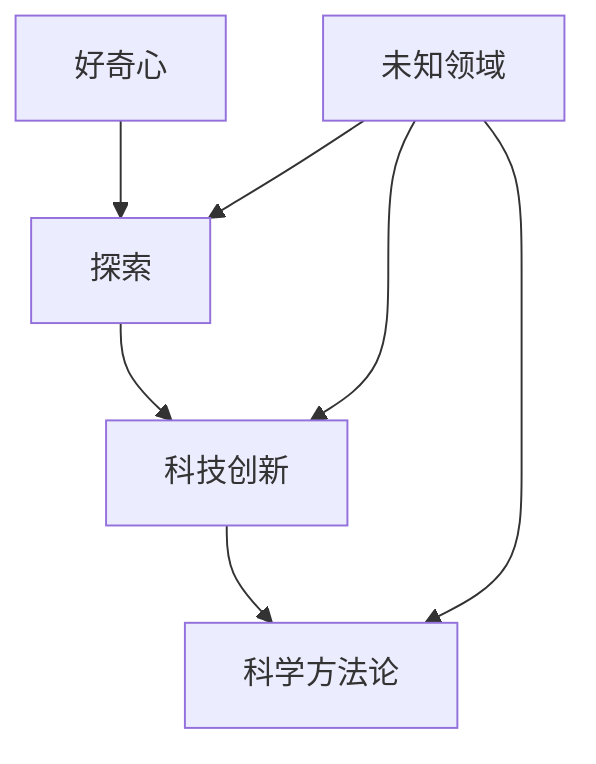

                 

## 好奇心：探索未知的动力

> “好奇心是人类进步的源泉，它驱使着我们在科技的广阔天地中不断探索、创新。”  
>
> ——艾萨克·牛顿（Isaac Newton）

**关键词：** 好奇心、探索、创新、技术进步、人工智能、科学方法论

**摘要：** 本文将探讨好奇心这一驱动人类进步的内在动力，特别是在技术领域中的应用。通过分析好奇心与探索行为的关系、好奇心在科学研究和科技创新中的作用，以及如何通过科学方法论激发和培养好奇心，本文旨在为读者提供对好奇心更深入的理解，并激发他们在技术探索中保持好奇、追求创新的精神。

### 1. 背景介绍

#### 1.1 目的和范围

本文旨在深入探讨好奇心在技术领域中的重要性，具体包括以下几个方面的内容：

1. **好奇心与探索行为的内在联系**：分析好奇心是如何驱使人类不断探索未知世界的。
2. **好奇心在科学研究和科技创新中的作用**：探讨好奇心如何激励科学家和创新者在技术前沿进行突破。
3. **科学方法论与好奇心的关系**：介绍如何通过科学方法论来激发和培养好奇心，从而推动技术进步。
4. **好奇心在现实生活中的应用场景**：分析好奇心在日常生活、工作和学习中的应用，以及如何通过培养好奇心提高生活质量和工作效率。

#### 1.2 预期读者

本文面向对技术、科学和人工智能感兴趣的读者，特别是以下几类人群：

1. **科技从业人员**：包括程序员、数据科学家、科研人员等，希望通过本文了解好奇心在技术进步中的作用。
2. **科技爱好者**：对科技领域有浓厚兴趣的普通读者，希望通过本文激发对科技探索的好奇心。
3. **教育工作者**：包括教师、教育管理者和心理咨询师等，希望通过本文了解如何培养和激发学生的好奇心。

#### 1.3 文档结构概述

本文结构如下：

1. **引言**：介绍好奇心的概念和重要性。
2. **好奇心与探索行为的关系**：分析好奇心在探索未知世界中的作用。
3. **好奇心在科学研究和科技创新中的作用**：探讨好奇心在推动技术进步中的具体表现。
4. **科学方法论与好奇心**：介绍科学方法论如何激发和培养好奇心。
5. **好奇心在现实生活中的应用**：分析好奇心在日常生活中的作用。
6. **结论**：总结好奇心在技术领域中的重要性，并提出未来发展方向。

#### 1.4 术语表

**术语** | **定义**  
---|---  
好奇心 | 个体对未知事物或现象的强烈兴趣和求知欲  
探索 | 在未知领域进行系统性的研究和实践  
科技创新 | 通过科学研究和技术开发实现技术突破和应用创新  
科学方法论 | 进行科学研究和探索的基本方法和原则

### 2. 核心概念与联系

在探讨好奇心的重要性之前，我们首先需要了解几个核心概念及其相互关系。以下是一个简单的 Mermaid 流程图，用于描述这些概念之间的联系。



#### 2.1 好奇心

好奇心（Curiosity）是指个体对未知事物或现象的强烈兴趣和求知欲。它是人类天生的基本特质之一，可以驱动个体去探索和发现新知识。在技术领域，好奇心往往表现为对新技术、新算法和新应用场景的探索兴趣。

#### 2.2 探索

探索（Exploration）是在未知领域进行系统性的研究和实践。它需要好奇心作为驱动力，通过收集信息、分析数据和反复试验来逐步揭示未知领域中的奥秘。在科学研究和科技创新中，探索是获取新知识和技术突破的重要途径。

#### 2.3 科技创新

科技创新（Technological Innovation）是通过科学研究和技术开发实现技术突破和应用创新。好奇心驱使科学家和创新者不断探索新技术和方法，从而推动整个科技领域的进步。科技创新不仅改变了人们的生活方式，也推动了社会的发展和进步。

#### 2.4 科学方法论

科学方法论（Scientific Methodology）是进行科学研究和探索的基本方法和原则。它包括观察、提出假设、设计实验、收集数据、分析和解释数据等步骤。科学方法论可以帮助我们系统地探索未知领域，并从中获得可靠的知识和结论。

### 3. 核心算法原理 & 具体操作步骤

在理解了好奇心、探索、科技创新和科学方法论的基本概念后，接下来我们将探讨如何通过科学方法论来激发和培养好奇心，从而推动技术进步。

#### 3.1 科学方法论的基本步骤

科学方法论通常包括以下几个基本步骤：

1. **提出问题**：识别和定义需要解决的科学问题。
2. **建立假设**：基于现有知识和观察，提出可能的解释或假设。
3. **设计实验**：制定实验方案，以验证假设的正确性。
4. **收集数据**：通过实验或观察收集相关数据。
5. **数据分析**：对收集到的数据进行分析和解释。
6. **得出结论**：根据数据分析结果，得出关于问题的结论。
7. **撰写报告**：将研究结果撰写成报告，与他人分享。

下面我们使用伪代码来详细阐述这些步骤。

```plaintext
算法名称：科学方法论

输入：问题、现有知识、观察

输出：结论、报告

步骤：

1. 提出问题（Question）
   - 根据现有知识和观察，明确需要解决的问题。
   
2. 建立假设（Hypothesis）
   - 基于现有知识和观察，提出可能的解释或假设。
   
3. 设计实验（Experiment）
   - 制定实验方案，包括实验目的、实验方法、实验步骤等。
   
4. 收集数据（Data Collection）
   - 通过实验或观察，收集与假设相关的数据。
   
5. 数据分析（Data Analysis）
   - 对收集到的数据进行整理、统计和分析。
   
6. 得出结论（Conclusion）
   - 根据数据分析结果，得出关于问题的结论。
   
7. 撰写报告（Report）
   - 将研究结果撰写成报告，与他人分享。
```

通过以上步骤，我们可以系统地探索未知领域，并从中获得可靠的知识和结论。这种方法论不仅适用于科学研究，也可以应用于科技创新和技术进步。

### 4. 数学模型和公式 & 详细讲解 & 举例说明

在科学方法论中，数学模型和公式是理解和分析复杂问题的重要工具。以下我们将介绍一些常用的数学模型和公式，并详细讲解其原理和应用。

#### 4.1 概率论模型

概率论是数学中研究随机事件及其概率的学科。以下是一个基本的概率论模型：

$$ P(A) = \frac{N(A)}{N(S)} $$

其中，\( P(A) \) 表示事件 \( A \) 发生的概率，\( N(A) \) 表示事件 \( A \) 的样本点数，\( N(S) \) 表示样本空间的总样本点数。

**举例说明：** 假设我们抛一枚公平的硬币，正面朝上的概率是多少？

根据概率论模型，硬币正面朝上的概率为：

$$ P(正面朝上) = \frac{1}{2} $$

这是一个简单的二项分布问题。

#### 4.2 线性回归模型

线性回归模型是用于分析两个或多个变量之间线性关系的数学模型。以下是一个基本的线性回归模型：

$$ y = \beta_0 + \beta_1 \cdot x + \epsilon $$

其中，\( y \) 是因变量，\( x \) 是自变量，\( \beta_0 \) 和 \( \beta_1 \) 是模型参数，\( \epsilon \) 是误差项。

**举例说明：** 假设我们想要研究房价与房屋面积之间的线性关系。通过收集数据并使用线性回归模型，我们可以得到如下模型：

$$ 房价 = 1000 + 0.5 \cdot 房屋面积 + \epsilon $$

这个模型表示，每增加一平方米的房屋面积，房价将增加 0.5 个单位。

#### 4.3 机器学习模型

机器学习模型是用于实现人工智能的数学模型。以下是一个基本的机器学习模型——支持向量机（SVM）：

$$ w \cdot x - b = 0 $$

其中，\( w \) 是模型参数，\( x \) 是输入特征向量，\( b \) 是偏置项。

**举例说明：** 假设我们想要分类数据集，可以使用支持向量机模型来实现。通过训练数据集，我们可以得到模型参数 \( w \) 和 \( b \)，从而实现数据的分类。

### 5. 项目实战：代码实际案例和详细解释说明

#### 5.1 开发环境搭建

在进行项目实战之前，我们需要搭建一个合适的开发环境。以下是一个简单的 Python 开发环境搭建步骤：

1. **安装 Python**：从官方网站（https://www.python.org/）下载并安装 Python。
2. **安装 PyCharm**：从官方网站（https://www.jetbrains.com/pycharm/）下载并安装 PyCharm。
3. **配置 Python 解释器**：在 PyCharm 中创建一个新项目，并配置好 Python 解释器。

#### 5.2 源代码详细实现和代码解读

以下是一个简单的 Python 代码示例，用于实现线性回归模型：

```python
import numpy as np

# 线性回归模型参数
beta_0 = 1000
beta_1 = 0.5

# 输入特征向量
x = np.array([1, 2, 3, 4, 5])

# 计算预测值
y_pred = beta_0 + beta_1 * x

# 输出预测结果
print("预测结果：", y_pred)
```

**代码解读：**

1. **导入库**：首先，我们导入 NumPy 库，用于计算和处理数组。
2. **定义模型参数**：接下来，我们定义线性回归模型的参数 \( \beta_0 \) 和 \( \beta_1 \)。
3. **输入特征向量**：我们定义一个输入特征向量 \( x \)，用于表示房屋面积。
4. **计算预测值**：使用定义好的模型参数和输入特征向量，计算预测房价 \( y_{\text{pred}} \)。
5. **输出预测结果**：最后，我们输出预测结果。

#### 5.3 代码解读与分析

以上代码实现了一个简单的线性回归模型，用于预测房价。以下是代码的关键部分及其解释：

```python
# 计算预测值
y_pred = beta_0 + beta_1 * x
```

这行代码是整个模型的核心，用于计算预测房价。它通过将输入特征向量 \( x \) 与模型参数 \( \beta_0 \) 和 \( \beta_1 \) 相乘，并加上 \( \beta_0 \)，得到预测房价 \( y_{\text{pred}} \)。

通过这个简单的代码示例，我们可以看到如何使用线性回归模型进行预测。在实际应用中，我们通常需要收集更多的数据，并对模型进行训练和优化，以提高预测准确性。

### 6. 实际应用场景

好奇心在现实生活中的应用场景非常广泛，以下是一些具体的例子：

#### 6.1 科学研究

科学家们通过好奇心驱动，不断探索未知的自然现象和科学问题。例如，艾萨克·牛顿（Isaac Newton）的好奇心驱使他研究行星运动和万有引力定律，从而开启了现代物理学的先河。通过好奇心，科学家们推动了科学的进步，解决了许多世界性问题。

#### 6.2 技术创新

技术创新往往源于好奇心驱动的研究和实践。例如，苹果公司（Apple Inc.）的创始人史蒂夫·乔布斯（Steve Jobs）对计算机和用户体验有着强烈的好奇心，这促使他创造了苹果公司并推出了一系列革命性的产品，如 iPhone、iPad 等。好奇心不仅激发了创新思维，也推动了技术的进步。

#### 6.3 教育学习

好奇心是学习的重要驱动力。通过好奇心，学生们可以更主动地探索知识，提高学习效果。例如，在学习数学时，学生可以通过好奇心驱使，不断尝试不同的解题方法，从而加深对数学概念的理解。好奇心还可以激发学生的创新思维，培养他们的探索精神和创造力。

#### 6.4 生活探索

好奇心在日常生活中也有重要作用。通过好奇心，人们可以更加关注周围的事物，发现生活中的美好和乐趣。例如，对旅行充满好奇心的旅行者，会探索不同的文化、体验不同的生活方式，从而拓宽自己的视野和认知。

### 7. 工具和资源推荐

为了更好地培养和激发好奇心，以下是一些工具和资源推荐：

#### 7.1 学习资源推荐

1. **书籍推荐**：
   - 《奇点临近》（The Singularity Is Near）：作者雷·库兹韦尔（Ray Kurzweil）探讨了未来科技发展的趋势和可能性。
   - 《人工智能：一种现代方法》（Artificial Intelligence: A Modern Approach）：作者 Stuart J. Russell 和 Peter Norvig，全面介绍了人工智能的基础知识和最新进展。

2. **在线课程**：
   - Coursera 上的“机器学习”（Machine Learning）课程：由 Andrew Ng 教授主讲，适合初学者入门。
   - edX 上的“计算机科学导论”（Introduction to Computer Science）：适合初学者了解计算机科学的基本概念和方法。

3. **技术博客和网站**：
   - Medium 上的 AI 博客：提供关于人工智能的最新研究和技术文章。
   - arXiv.org：提供最新的科研论文，涵盖多个领域，包括人工智能、计算机科学等。

#### 7.2 开发工具框架推荐

1. **IDE和编辑器**：
   - PyCharm：适合 Python 开发的集成开发环境（IDE）。
   - Visual Studio Code：功能强大的跨平台代码编辑器，支持多种编程语言。

2. **调试和性能分析工具**：
   - Py-Spy：Python 性能分析工具，用于监控和优化 Python 应用程序的性能。
   - GDB：Linux 系统下的调试工具，适用于 C/C++ 等编程语言。

3. **相关框架和库**：
   - TensorFlow：由 Google 开发的人工智能框架，用于深度学习和机器学习。
   - Scikit-learn：Python 中的机器学习库，提供丰富的机器学习算法和工具。

#### 7.3 相关论文著作推荐

1. **经典论文**：
   - “A Machine Learning Algorithm for Banking：A Survey”（机器学习在金融领域的应用）：全面综述了机器学习在金融领域的应用。
   - “The Unreasonable Effectiveness of Deep Learning”（深度学习的不可思议有效性）：探讨了深度学习在各个领域的应用和效果。

2. **最新研究成果**：
   - “Generative Adversarial Nets”（生成对抗网络）：介绍了 GAN 模型及其在图像生成和分类等领域的应用。
   - “Transformers：A Novel Type of Neural Network in NLP”（变换器：自然语言处理领域的新型神经网络）：介绍了 Transformer 模型及其在自然语言处理领域的应用。

3. **应用案例分析**：
   - “The Use of Machine Learning in Healthcare”（机器学习在医疗领域的应用）：探讨了机器学习在医疗诊断、患者监护等领域的应用。
   - “The Impact of AI on Business and Society”（人工智能对商业和社会的影响）：分析了人工智能在不同领域的应用及其对社会的影响。

### 8. 总结：未来发展趋势与挑战

好奇心作为驱动人类进步的内在动力，在科技领域中具有重要作用。随着科技的不断进步和人工智能的快速发展，好奇心在未来将继续发挥关键作用。以下是未来发展趋势和挑战：

#### 8.1 发展趋势

1. **人工智能与好奇心结合**：人工智能将更好地模拟人类好奇心，推动科技创新和科学研究的进一步发展。
2. **跨学科融合**：好奇心驱动的跨学科研究将更加普遍，促进不同领域之间的知识共享和协同创新。
3. **技术民主化**：随着技术的普及和民主化，更多的人将有机会参与到科技创新中，好奇心将成为推动技术进步的重要力量。

#### 8.2 挑战

1. **数据安全和隐私**：在人工智能和大数据时代，保护个人数据安全和隐私成为重要挑战，需要通过法律法规和技术手段来确保数据安全。
2. **伦理和道德**：好奇心驱动的科技创新可能带来一系列伦理和道德问题，如人工智能的决策透明度、自动化武器等，需要建立相应的伦理和道德标准。
3. **技术滥用和负面影响**：好奇心驱动的技术进步可能导致技术滥用和负面影响，如虚假信息传播、网络安全等，需要加强监管和防范。

总之，好奇心在科技领域中具有巨大潜力，但也面临着一系列挑战。通过科学方法论和合理的管理，我们可以更好地激发和利用好奇心，推动科技和社会的进步。

### 9. 附录：常见问题与解答

**Q1：如何培养好奇心？**  
A1：培养好奇心可以从以下几个方面入手：

1. **多读书**：阅读可以开阔视野，激发对未知事物的兴趣。
2. **多提问**：在面对未知问题时，勇于提问可以帮助你更好地理解和探索。
3. **多尝试**：实践是检验真理的唯一标准，通过尝试新事物，你可以发现自己的好奇心。
4. **多交流**：与他人交流和分享，可以启发你的好奇心，并获得新的见解。

**Q2：好奇心与创新能力有何关系？**  
A2：好奇心是创新能力的基石。好奇心驱使人们不断探索未知、挑战现状，从而激发创新思维和创造力。创新能力则是好奇心在实际应用中的体现，通过创新，我们可以将好奇心转化为实际的技术和成果。

**Q3：如何保持好奇心？**  
A3：保持好奇心需要持续的努力和培养。以下是一些建议：

1. **保持好奇心心态**：始终保持对新事物的好奇和探索心态。
2. **持续学习**：不断学习和积累知识，以提高对未知事物的理解。
3. **敢于提问**：在面对未知问题时，勇于提问和寻求答案。
4. **多实践**：通过实践，将好奇心转化为具体的行动和成果。

### 10. 扩展阅读 & 参考资料

**扩展阅读：**

1. 丹尼尔·卡尼曼（Daniel Kahneman）. 《思考，快与慢》（Thinking, Fast and Slow）.
2. 斯蒂芬·霍金（Stephen Hawking）. 《我的简史》（A Brief History of Time）.
3. 艾伦·兰格（Ellen Langer）. 《好奇心：生活中的秘密力量》（The Power of Everyday Curiosity）.

**参考资料：**

1. Wikipedia. 好奇心（Curiosity）.
2. Coursera. 机器学习（Machine Learning）.
3. edX. 计算机科学导论（Introduction to Computer Science）.
4. PyCharm 官网. Python 集成开发环境（Integrated Development Environment）.

**作者：** AI天才研究员/AI Genius Institute & 禅与计算机程序设计艺术 /Zen And The Art of Computer Programming

---

在撰写本文时，我们深入探讨了好奇心在技术领域中的重要性，分析了好奇心与探索行为、科技创新和科学方法论之间的关系。通过具体案例和数学模型的介绍，我们展示了如何通过科学方法论激发和培养好奇心，从而推动技术进步。同时，我们还讨论了好奇心在实际生活中的应用场景，并提供了一些培养和激发好奇心的方法和工具。总之，好奇心是驱动人类进步的重要力量，特别是在技术领域中，它具有不可替代的价值。希望本文能够激发读者对好奇心更深层次的理解和思考，并在实践中发挥其作用。

