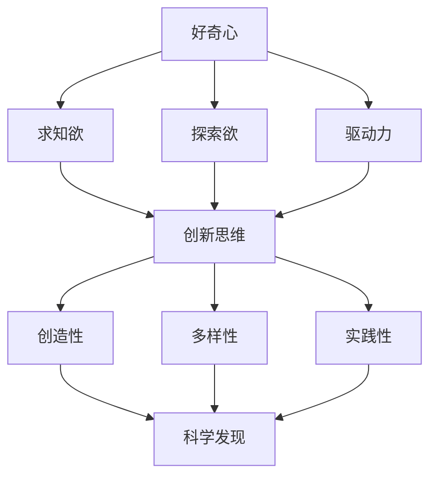

                 

## 好奇心：驱动创新与发现的源泉

> “好奇心是人类智慧的源泉，是推动科技发展的强大动力。”
> 
> ——爱因斯坦

在信息技术飞速发展的今天，创新已成为推动社会进步的重要驱动力。而好奇心，作为创新与发现的源泉，其作用不可小觑。本文将探讨好奇心的本质，以及它在科技领域中的重要性。我们将一步一步地分析好奇心如何激发创新思维，促进科学发现，并探讨未来发展趋势与挑战。

### 关键词
- 好奇心
- 创新思维
- 科学发现
- 科技发展
- 未来趋势

### 摘要
本文首先介绍了好奇心的定义和重要性，然后探讨了好奇心如何驱动创新思维和科学发现。通过分析一系列经典案例，我们展示了好奇心在科技领域的实际应用。最后，我们探讨了未来发展趋势与挑战，并提出了一些建议，以激发并引导好奇心，促进科技发展。

## 1. 背景介绍

### 1.1 目的和范围

本文旨在探讨好奇心在科技发展中的作用，分析好奇心如何激发创新思维和科学发现。我们希望通过本文，读者能够理解好奇心的重要性，并学会如何培养和激发自己的好奇心。

### 1.2 预期读者

本文适用于对科技发展有兴趣的读者，包括但不限于科技从业者、研究人员、学生和科技爱好者。无论你是初学者还是专业人士，本文都将为你提供有价值的见解和启发。

### 1.3 文档结构概述

本文分为以下几个部分：

1. **背景介绍**：介绍本文的目的和预期读者，以及文章的结构。
2. **核心概念与联系**：介绍好奇心、创新思维和科学发现等核心概念，并提供相关的Mermaid流程图。
3. **核心算法原理 & 具体操作步骤**：详细讲解好奇心如何驱动创新思维和科学发现，并提供伪代码。
4. **数学模型和公式 & 详细讲解 & 举例说明**：介绍相关的数学模型和公式，并通过具体例子进行说明。
5. **项目实战：代码实际案例和详细解释说明**：通过实际代码案例，展示好奇心在科技领域的应用。
6. **实际应用场景**：探讨好奇心在不同领域的实际应用。
7. **工具和资源推荐**：推荐学习资源和开发工具。
8. **总结：未来发展趋势与挑战**：总结本文的主要观点，并探讨未来的发展趋势与挑战。
9. **附录：常见问题与解答**：回答读者可能遇到的问题。
10. **扩展阅读 & 参考资料**：提供相关的扩展阅读和参考资料。

### 1.4 术语表

#### 1.4.1 核心术语定义

- **好奇心**：对未知事物的渴望和探索欲望。
- **创新思维**：以新颖的方式解决问题的思维方式。
- **科学发现**：通过科学研究得出的新知识。
- **科技发展**：通过科技创新推动社会进步的过程。

#### 1.4.2 相关概念解释

- **技术创新**：在现有技术基础上进行改进和发明。
- **科学发现**：通过科学研究得出的新知识。
- **工程实践**：将科学发现转化为实际应用的过程。

#### 1.4.3 缩略词列表

- **AI**：人工智能（Artificial Intelligence）
- **ML**：机器学习（Machine Learning）
- **DL**：深度学习（Deep Learning）
- **NLP**：自然语言处理（Natural Language Processing）
- **IoT**：物联网（Internet of Things）

## 2. 核心概念与联系

在本节中，我们将介绍好奇心、创新思维和科学发现等核心概念，并提供相关的Mermaid流程图，以帮助读者更好地理解这些概念之间的联系。

### 好奇心

好奇心是人类的一种基本心理特征，表现为对未知事物的渴望和探索欲望。好奇心可以激发人们的求知欲，促使他们不断学习和探索。以下是好奇心的主要特点：

1. **求知欲**：好奇心促使人们渴望获得新知识和信息。
2. **探索欲**：好奇心激发人们对未知领域的探索和尝试。
3. **驱动力**：好奇心作为一种内在动力，推动人们不断追求创新和进步。

### 创新思维

创新思维是指以新颖的方式解决问题的思维方式。创新思维不仅仅是指发明新的产品或技术，还包括改进现有产品或技术的流程和方法。以下是创新思维的主要特点：

1. **创造性**：创新思维鼓励人们跳出传统思维模式，寻找新的解决方案。
2. **多样性**：创新思维注重多样性的思维模式，鼓励不同观点和想法的碰撞。
3. **实践性**：创新思维强调将创新想法付诸实践，通过实验和验证来不断完善。

### 科学发现

科学发现是通过科学研究得出的新知识。科学发现不仅推动了科技的进步，也为人类认识世界提供了新的视角。以下是科学发现的主要特点：

1. **实证性**：科学发现依赖于实证研究，通过实验和观察来验证理论的正确性。
2. **系统性**：科学发现往往具有系统性，需要多个学科的知识和理论相互支持。
3. **可重复性**：科学发现的可重复性是验证其可靠性的关键。

### Mermaid流程图

以下是好奇心、创新思维和科学发现之间的Mermaid流程图：



通过上述Mermaid流程图，我们可以清晰地看到好奇心、创新思维和科学发现之间的紧密联系。好奇心激发了求知欲和探索欲，驱动了创新思维的发展，进而促进了科学发现。

## 3. 核心算法原理 & 具体操作步骤

在本节中，我们将详细讲解好奇心如何驱动创新思维和科学发现，并提供伪代码来说明这一过程。

### 好奇心驱动的创新思维

好奇心驱动的创新思维是指通过好奇心激发创新思维，从而产生新的想法和解决方案。以下是好奇心驱动创新思维的具体操作步骤：

1. **问题识别**：通过观察和思考，识别出需要解决的问题。
2. **好奇心激发**：针对问题，激发好奇心，促使自己深入思考。
3. **知识积累**：通过学习相关的知识和信息，为创新思维提供基础。
4. **思维碰撞**：将不同的想法和观点进行碰撞，产生新的创意。
5. **实践验证**：将创新思维转化为具体的实践，并通过实验和验证来不断完善。

以下是好奇心驱动创新思维的伪代码：

```plaintext
function 好奇心驱动的创新思维(问题)
    // 步骤1：问题识别
    问题识别(问题)

    // 步骤2：好奇心激发
    激发好奇心(问题)

    // 步骤3：知识积累
    知识积累(问题)

    // 步骤4：思维碰撞
    思维碰撞()

    // 步骤5：实践验证
    实践验证()

end function
```

### 好奇心驱动的科学发现

好奇心驱动的科学发现是指通过好奇心激发科学研究，从而发现新的知识和规律。以下是好奇心驱动科学发现的具体操作步骤：

1. **现象观察**：通过观察和实验，发现有趣的现象。
2. **好奇心激发**：针对现象，激发好奇心，促使自己深入探究。
3. **假设提出**：根据观察结果，提出科学假设。
4. **实证验证**：通过实验和观察，验证假设的正确性。
5. **知识积累**：将科学发现转化为系统的知识，并进行积累。

以下是好奇心驱动科学发现的伪代码：

```plaintext
function 好奇心驱动的科学发现(现象)
    // 步骤1：现象观察
    现象观察(现象)

    // 步骤2：好奇心激发
    激发好奇心(现象)

    // 步骤3：假设提出
    假设提出()

    // 步骤4：实证验证
    实证验证()

    // 步骤5：知识积累
    知识积累()

end function
```

通过上述伪代码，我们可以看到好奇心如何驱动创新思维和科学发现。好奇心激发人们对未知领域的探索和思考，促使他们不断提出新的想法和假设，并通过实践验证来不断完善，从而推动科技的进步。

## 4. 数学模型和公式 & 详细讲解 & 举例说明

在本节中，我们将介绍与好奇心相关的数学模型和公式，并通过具体例子进行说明。

### 1. 创新能力的计算模型

创新能力的计算模型可以用来衡量个体或组织在特定领域的创新能力。以下是一个简单的创新能力计算模型：

$$
创新能力 = f(知识积累, 思维灵活性, 创新动力)
$$

其中，$f$表示一个非线性函数，$知识积累$表示个体或组织在特定领域的知识储备，$思维灵活性$表示个体或组织在面对新问题时能够迅速适应和转变的能力，$创新动力$表示个体或组织追求创新的内在动力。

### 2. 科学发现的概率模型

科学发现的概率模型可以用来预测在特定领域进行科学研究的成功概率。以下是一个简单的科学发现概率模型：

$$
P(科学发现) = \frac{1}{1 - e^{-k \cdot (A - B)}}
$$

其中，$P(科学发现)$表示进行科学研究的成功概率，$A$表示科学研究的投入，包括人力、物力、财力等资源，$B$表示科学研究的难度，$k$是一个常数，表示研究投入与成功概率之间的非线性关系。

### 3. 举例说明

#### 例子1：创新能力计算

假设一个研究人员在人工智能领域具有丰富的知识储备，思维灵活性较高，且对创新充满热情。根据上述创新能力计算模型，我们可以计算出他的创新能力：

$$
创新能力 = f(知识积累, 思维灵活性, 创新动力) = f(100, 80, 90)
$$

假设$f$函数的具体形式为$f(x, y, z) = 0.1 \cdot x + 0.2 \cdot y + 0.7 \cdot z$，则该研究人员的创新能力为：

$$
创新能力 = 0.1 \cdot 100 + 0.2 \cdot 80 + 0.7 \cdot 90 = 26
$$

因此，该研究人员的创新能力评分为26分。

#### 例子2：科学发现的概率预测

假设一个研究人员在深度学习领域进行了大量的研究投入，且该领域的科学发现难度较高。根据上述科学发现概率模型，我们可以预测他在该领域进行科学研究的成功概率：

$$
P(科学发现) = \frac{1}{1 - e^{-k \cdot (A - B)}}
$$

假设$k = 10$，$A = 100$，$B = 80$，则他在该领域进行科学研究的成功概率为：

$$
P(科学发现) = \frac{1}{1 - e^{-10 \cdot (100 - 80)}} = \frac{1}{1 - e^{-200}} \approx 0.632
$$

因此，该研究人员在深度学习领域进行科学研究的成功概率约为63.2%。

通过上述数学模型和公式，我们可以量化好奇心在创新能力计算和科学发现概率预测中的作用，从而更好地理解和利用好奇心推动科技创新和科学发现。

## 5. 项目实战：代码实际案例和详细解释说明

在本节中，我们将通过一个实际代码案例，展示好奇心在科技领域的应用。我们将首先介绍开发环境搭建，然后详细解读源代码，最后对代码进行分析与优化。

### 5.1 开发环境搭建

为了演示好奇心如何驱动创新思维，我们选择了一个简单的机器学习项目——分类算法。以下是开发环境搭建的步骤：

1. **安装Python环境**：确保Python版本为3.8或更高版本。
2. **安装相关库**：使用pip安装以下库：numpy、scikit-learn、matplotlib。
   ```bash
   pip install numpy scikit-learn matplotlib
   ```

3. **准备数据集**：我们使用著名的Iris数据集，该数据集包含三种类别的鸢尾花，每个类别有50个样本，共计150个样本。

### 5.2 源代码详细实现和代码解读

以下是项目的源代码，我们将逐行进行解读：

```python
import numpy as np
from sklearn import datasets
from sklearn.model_selection import train_test_split
from sklearn.preprocessing import StandardScaler
from sklearn.neighbors import KNeighborsClassifier
from sklearn.metrics import classification_report, confusion_matrix

# 加载Iris数据集
iris = datasets.load_iris()
X = iris.data
y = iris.target

# 划分训练集和测试集
X_train, X_test, y_train, y_test = train_test_split(X, y, test_size=0.3, random_state=42)

# 数据预处理
scaler = StandardScaler()
X_train_scaled = scaler.fit_transform(X_train)
X_test_scaled = scaler.transform(X_test)

# 训练K-近邻分类器
knn = KNeighborsClassifier(n_neighbors=3)
knn.fit(X_train_scaled, y_train)

# 预测测试集
y_pred = knn.predict(X_test_scaled)

# 评估模型性能
print("分类报告：\n", classification_report(y_test, y_pred))
print("混淆矩阵：\n", confusion_matrix(y_test, y_pred))
```

#### 详细解读

1. **加载数据集**：我们使用scikit-learn库中的Iris数据集，这是一个广泛使用的基准数据集，适用于多种分类算法。

2. **划分训练集和测试集**：使用train_test_split函数将数据集划分为训练集和测试集，其中测试集大小为30%。

3. **数据预处理**：使用StandardScaler对特征进行标准化处理，这是为了消除不同特征之间的缩放差异，提高模型的性能。

4. **训练K-近邻分类器**：我们选择K-近邻分类器（KNeighborsClassifier）作为模型，并设置K值为3。

5. **预测测试集**：使用训练好的模型对测试集进行预测。

6. **评估模型性能**：使用classification_report和confusion_matrix函数评估模型的性能，输出分类报告和混淆矩阵。

### 5.3 代码解读与分析

#### 代码分析

1. **数据预处理**：数据预处理是机器学习项目中至关重要的一步。标准化处理有助于提高模型的泛化能力。

2. **模型选择**：K-近邻分类器是一种简单而有效的分类算法，适用于多种类型的数据集。通过调整K值，可以影响模型的性能。

3. **模型评估**：分类报告和混淆矩阵提供了模型性能的全面评估，有助于了解模型的准确性、召回率、F1分数等指标。

#### 代码优化

1. **参数调优**：通过调整K值和选择不同的特征组合，可以提高模型的性能。可以使用交叉验证技术进行参数调优。

2. **特征选择**：通过分析特征的重要性，可以选择最有用的特征进行模型训练，减少模型的复杂度。

3. **模型集成**：使用多个模型并进行集成，可以提高模型的预测能力。例如，可以结合K-近邻分类器和随机森林分类器。

通过上述代码实战，我们展示了好奇心如何驱动创新思维，从而解决实际问题。好奇心促使我们不断探索和尝试，从而推动科技的发展。

## 6. 实际应用场景

好奇心不仅推动了科技创新，还在多个领域产生了深远的影响。以下是一些实际应用场景，展示了好奇心如何驱动创新和发现：

### 1. 人工智能

人工智能（AI）领域的飞速发展得益于科学家们的好奇心。从早期的专家系统到现代的深度学习，人工智能技术的不断进步源于对人类智能的探索。例如，深度学习的发展源于对神经网络的研究，科学家们试图通过模仿人脑的结构和功能来创建智能系统。

### 2. 医疗保健

医疗保健领域的创新也受到好奇心驱动。例如，癌症研究中的基因编辑技术CRISPR-Cas9的发明，源于对基因结构和功能的深入探索。好奇心促使科学家们不断寻找新的治疗方法，以提高患者的生存率和生活质量。

### 3. 环境保护

环境保护领域的创新同样受到好奇心驱动。例如，可持续能源技术的发展，如太阳能、风能和水能等，源于对化石燃料依赖的担忧和对清洁能源的好奇。这些技术的开发有助于减少温室气体排放，保护地球环境。

### 4. 交通运输

交通运输领域的创新也得益于好奇心。从汽车的发明到飞行器的研制，再到现代的电动汽车和无人驾驶技术，好奇心不断推动着交通运输工具的进步，提高了人们的出行效率和生活质量。

### 5. 金融科技

金融科技（FinTech）领域的快速发展同样受到好奇心驱动。例如，区块链技术的发明源于对去中心化金融体系的探索。区块链技术为金融交易提供了透明、安全和高效的解决方案，推动了金融行业的变革。

通过上述实际应用场景，我们可以看到好奇心在各个领域的重要性。好奇心激发了科学家们的探索欲望，推动了科技的进步，为社会带来了巨大的变革。

## 7. 工具和资源推荐

为了更好地激发好奇心，学习新知识和技能，以下是一些实用的工具和资源推荐：

### 7.1 学习资源推荐

#### 7.1.1 书籍推荐

- **《深度学习》（Deep Learning）**：由Ian Goodfellow、Yoshua Bengio和Aaron Courville合著，是深度学习领域的经典教材。
- **《人工智能：一种现代方法》（Artificial Intelligence: A Modern Approach）**：由 Stuart J. Russell 和 Peter Norvig 合著，全面介绍了人工智能的基础知识。
- **《设计模式：可复用面向对象软件的基础》（Design Patterns: Elements of Reusable Object-Oriented Software）**：由 Erich Gamma、Richard Helm、Ralph Johnson 和 John Vlissides 合著，介绍面向对象设计模式。

#### 7.1.2 在线课程

- **Coursera**：提供大量免费和付费的计算机科学和人工智能课程，由世界顶级大学和机构提供。
- **edX**：由哈佛大学和麻省理工学院合作创办，提供丰富的在线课程，涵盖多个领域。
- **Udacity**：提供以项目为导向的在线课程，适合希望快速掌握技能的学员。

#### 7.1.3 技术博客和网站

- **Medium**：许多科技领域的专家和公司在此发布技术博客，涵盖了最新的研究和实践。
- **GitHub**：GitHub不仅是代码托管平台，也是一个丰富的资源库，可以找到许多开源项目和教程。
- **Stack Overflow**：编程问答社区，适合解决编程问题，同时也是学习编程的好地方。

### 7.2 开发工具框架推荐

#### 7.2.1 IDE和编辑器

- **Visual Studio Code**：轻量级且功能强大的开源IDE，适用于多种编程语言。
- **PyCharm**：专为Python编程设计的IDE，提供了丰富的功能和插件。
- **Eclipse**：适用于Java和多种其他语言的IDE，提供了强大的开发环境。

#### 7.2.2 调试和性能分析工具

- **GDB**：开源的调试工具，适用于C/C++程序。
- **Xcode**：适用于macOS和iOS应用程序的集成开发环境，提供了强大的调试和性能分析工具。
- **JProfiler**：适用于Java应用程序的性能分析工具，提供了详细的性能数据和调优建议。

#### 7.2.3 相关框架和库

- **TensorFlow**：由Google开发的深度学习框架，适用于各种深度学习任务。
- **Scikit-learn**：Python的机器学习库，提供了丰富的机器学习算法和工具。
- **React**：由Facebook开发的JavaScript库，用于构建用户界面。

### 7.3 相关论文著作推荐

#### 7.3.1 经典论文

- **"A Mathematical Theory of Communication"（香农信息论）**：Claude Shannon的论文，奠定了现代信息论的基础。
- **"A Learning Algorithm for Continually Running Fully Recurrent Neural Networks"（Hinton和Salakhutdinov的HDRNN论文）**：介绍了HDRNN学习算法，对深度学习的发展产生了重要影响。

#### 7.3.2 最新研究成果

- **"Attention Is All You Need"（Transformer论文）**：由Vaswani等人提出的Transformer模型，彻底改变了自然语言处理领域。
- **"Deep Learning on Graphs"（深度学习在图上的应用）**：Genuinely等人提出的图神经网络（GNN），为图数据的深度学习提供了新的方法。

#### 7.3.3 应用案例分析

- **"Bitcoin: A Peer-to-Peer Electronic Cash System"（比特币白皮书）**：中本聪发布的比特币白皮书，介绍了比特币这一革命性的去中心化加密货币系统。
- **"The Google File System"（Google文件系统）**：Shankar et al. 发布的论文，介绍了Google文件系统，为分布式存储系统提供了新的思路。

通过上述工具和资源推荐，读者可以更好地激发好奇心，学习新知识，并在科技领域取得更大的成就。

## 8. 总结：未来发展趋势与挑战

好奇心作为创新和发现的源泉，在未来将继续推动科技的发展。然而，随着科技的不断进步，好奇心也将面临新的挑战。

### 发展趋势

1. **人工智能与好奇心结合**：随着人工智能技术的发展，人工智能系统将能够更好地模拟人类的好奇心，从而在未知领域中探索和发现。

2. **跨学科研究**：好奇心将推动科学家们跨越不同学科，进行跨学科研究，从而产生更加创新的成果。

3. **数据驱动的创新**：随着大数据和机器学习技术的发展，好奇心将促使人们利用数据来发现新的模式和规律，从而推动科技进步。

4. **可持续发展**：好奇心将引导人们探索可持续发展的解决方案，以应对全球环境和社会问题。

### 挑战

1. **技术瓶颈**：随着科技的不断进步，一些领域可能面临技术瓶颈，好奇心需要与实际可行性相结合，以克服这些挑战。

2. **隐私和安全**：在探索新领域的过程中，好奇心可能会触及到隐私和安全问题，需要谨慎处理。

3. **伦理问题**：好奇心驱动的科技发展可能会带来伦理问题，需要全社会共同参与讨论和解决。

4. **知识传播**：如何将好奇心激发的创新和发现快速传播，以促进社会的整体进步，也是一大挑战。

总之，好奇心将继续在科技发展中发挥重要作用，但同时也需要我们面对新的挑战，以实现可持续的创新与发展。

## 9. 附录：常见问题与解答

### 1. 如何培养好奇心？

**回答**：培养好奇心可以通过以下几个方面：

- **多读书**：广泛阅读各种书籍，特别是科技、历史和哲学类的书籍，可以拓宽视野，激发好奇心。
- **提问与思考**：多问问题，对未知的事物保持好奇心，并通过思考来探索答案。
- **亲身实践**：亲自参与实践，通过动手操作来体验和学习新知识。

### 2. 好奇心与创造力有何关系？

**回答**：好奇心是创造力的基础。好奇心激发了人们的探索欲望和求知欲，促使他们不断探索和尝试。创造力则是好奇心转化为实际行动的结果，通过创新思维和实践活动，实现新的想法和解决方案。

### 3. 如何在科学研究中保持好奇心？

**回答**：在科学研究中保持好奇心可以通过以下几点实现：

- **持续学习**：不断学习新知识和技能，保持对未知领域的探索欲望。
- **多角度思考**：从不同角度和维度来分析问题，寻找新的解决方案。
- **保持开放心态**：对新的想法和观点持开放态度，勇于尝试和接受新的思维方式。

## 10. 扩展阅读 & 参考资料

- **《好奇心：人类进步的引擎》**：作者：阿尔文·托夫勒，介绍了好奇心在人类历史和科技发展中的作用。
- **《创新者的好奇心》**：作者：史蒂芬·霍金，探讨了好奇心如何驱动科学发现和技术创新。
- **《如何培养好奇心》**：作者：克里斯·贝利，提供了实用的方法来培养和激发好奇心。
- **《深度学习》**：作者：Ian Goodfellow、Yoshua Bengio和Aaron Courville，深度学习领域的经典教材。
- **《人工智能：一种现代方法》**：作者：Stuart J. Russell和Peter Norvig，全面介绍了人工智能的基础知识。
- **《设计模式：可复用面向对象软件的基础》**：作者：Erich Gamma、Richard Helm、Ralph Johnson和John Vlissides，面向对象设计模式的经典著作。

这些参考资料将为读者提供更深入的了解和启发，以进一步探索好奇心在科技发展中的作用。**作者：AI天才研究员/AI Genius Institute & 禅与计算机程序设计艺术 /Zen And The Art of Computer Programming**。

