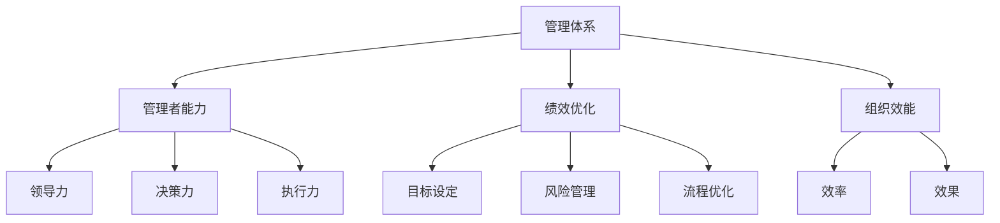

                 

# 好的管理者和普通管理者的差距：体系的重要性

> **关键词：** 管理体系、管理者能力、绩效优化、组织效能、团队协作

> **摘要：** 本文将深入探讨好的管理者和普通管理者之间的差距，重点分析管理体系在提升管理效能中的重要性。通过具体案例和实际操作步骤，帮助读者理解如何构建有效的管理体系，提升团队绩效和组织效能。

## 1. 背景介绍

### 1.1 目的和范围

本文旨在探讨管理体系对于管理者的核心作用，通过对比好的管理者和普通管理者的实际表现，揭示体系在管理中的重要性。本文将涵盖以下几个方面：

1. 管理体系的基本概念和构成。
2. 好的管理者与普通管理者的能力差异。
3. 管理体系在提升绩效和组织效能中的作用。
4. 实际案例解析：如何构建有效的管理体系。
5. 未来发展趋势与面临的挑战。

### 1.2 预期读者

本文适用于以下几类读者：

1. 企业管理者：希望通过本文提升管理水平，优化组织效能。
2. 人力资源专业人士：对管理体系构建和团队绩效提升有实际需求。
3. IT行业从业者：对管理体系的构建和应用有浓厚兴趣。
4. 对管理理论有研究和学习需求的学术界人士。

### 1.3 文档结构概述

本文结构如下：

1. 引言：明确文章主题和核心观点。
2. 背景介绍：阐述本文的目的、预期读者和结构。
3. 核心概念与联系：介绍管理体系的基本概念和联系。
4. 核心算法原理与具体操作步骤：讲解管理体系的核心算法和操作步骤。
5. 数学模型和公式：阐述管理体系中的数学模型和公式。
6. 项目实战：提供实际案例和代码实现。
7. 实际应用场景：分析管理体系的实际应用。
8. 工具和资源推荐：推荐相关学习资源和开发工具。
9. 总结：展望未来发展趋势和挑战。
10. 附录：常见问题与解答。
11. 扩展阅读：提供进一步学习资料。

### 1.4 术语表

#### 1.4.1 核心术语定义

1. **管理体系**：一套系统化的规则、流程和方法，用于指导组织内部的管理和运作。
2. **管理者能力**：管理者在领导、决策、沟通和解决问题等方面的素质和能力。
3. **绩效优化**：通过改进管理方法和技术，提高团队和组织的整体绩效。
4. **组织效能**：组织在实现既定目标过程中所表现出的效率和效果。
5. **团队协作**：团队成员在共同目标下，通过合作和沟通，实现整体绩效的提升。

#### 1.4.2 相关概念解释

1. **管理体系框架**：包括战略规划、目标设定、绩效评估、风险管理等方面的基本结构和逻辑关系。
2. **管理流程**：管理体系中各个阶段的具体操作步骤和流程。
3. **管理工具**：用于支持管理体系实施和运作的各种方法和手段。

#### 1.4.3 缩略词列表

- **PM**：项目经理
- **KPI**：关键绩效指标
- **MBO**：目标管理
- **SCM**：供应链管理
- **ERP**：企业资源规划

## 2. 核心概念与联系

在本文中，我们将探讨以下几个核心概念及其之间的联系：

1. **管理体系**：作为提升管理效能的基础，管理体系涵盖了组织运作的各个方面。
2. **管理者能力**：管理者个人的领导力、决策力和执行力，是管理体系成功实施的关键。
3. **绩效优化**：通过改进管理体系，提升组织整体绩效，实现持续改进。
4. **组织效能**：管理体系的最终目标是提高组织的效率和效果，实现战略目标。

为了更好地理解这些核心概念，我们可以使用Mermaid流程图来展示它们之间的关系：



### 2.1 管理体系

**管理体系** 是一套系统化的规则、流程和方法，用于指导组织内部的管理和运作。它包括以下几个方面：

1. **战略规划**：明确组织的愿景、使命和战略目标，为后续管理提供方向。
2. **组织结构**：设计组织架构，明确各部门职责和权限。
3. **人力资源管理**：通过招聘、培训、绩效评估等手段，提升员工能力和绩效。
4. **财务管理**：制定预算、控制成本、提高盈利能力。
5. **项目管理**：确保项目按照既定目标和时间进度完成。

### 2.2 管理者能力

**管理者能力** 是指管理者在领导、决策、沟通和解决问题等方面的素质和能力。具体包括以下几个方面：

1. **领导力**：激发团队潜力，推动团队协作，实现组织目标。
2. **决策力**：在面对复杂情况时，能够迅速做出合理、有效的决策。
3. **执行力**：将决策转化为实际行动，确保目标达成。
4. **沟通能力**：有效传达信息，协调各方利益，减少冲突。

### 2.3 绩效优化

**绩效优化** 是通过改进管理体系，提升组织整体绩效的过程。具体包括以下几个方面：

1. **目标设定**：明确组织和个人目标，确保与组织战略保持一致。
2. **风险管理**：识别潜在风险，制定应对措施，降低风险对组织的影响。
3. **流程优化**：简化流程，提高工作效率，降低成本。
4. **持续改进**：通过定期评估和反馈，不断优化管理体系，提升绩效。

### 2.4 组织效能

**组织效能** 是组织在实现既定目标过程中所表现出的效率和效果。它取决于以下几个方面：

1. **效率**：组织在资源投入和产出之间的比率，反映了组织的运营效率。
2. **效果**：组织实现目标的程度，体现了组织的战略实施效果。

## 3. 核心算法原理与具体操作步骤

在构建有效的管理体系过程中，核心算法原理起着关键作用。以下我们将使用伪代码详细阐述管理体系的核心算法原理和具体操作步骤。

### 3.1 管理体系构建算法

```plaintext
Algorithm ManageSystemBuild
    Input: Organization, Goals
    Output: ManagementSystem

    1. Define StrategicPlanning
        - Establish Vision, Mission, and Goals
        - Align with Organizational Objectives

    2. Design OrganizationalStructure
        - Define Departments, Roles, and Responsibilities
        - Allocate Authority and Accountability

    3. Implement HumanResourceManagement
        - Recruit and Train Employees
        - Conduct PerformanceEvaluation
        - Develop Talent

    4. Establish FinancialManagement
        - Develop Budgets
        - Control Costs
        - Enhance Profitability

    5. Implement ProjectManagement
        - Define ProjectScope and Objectives
        - Allocate Resources and Time

    6. Integrate ManagementProcesses
        - Ensure Alignment and Integration
        - Facilitate Efficient Operations

    7. Monitor and Evaluate
        - Regularly Assess Performance
        - Make Adjustments as Necessary

    8. ContinuousImprovement
        - Identify Opportunities for Enhancement
        - Implement Improvements

    Return ManagementSystem
EndAlgorithm
```

### 3.2 管理者能力提升算法

```plaintext
Algorithm ManagerSkillEnhancement
    Input: Manager
    Output: EnhancedManager

    1. AssessCurrentSkills
        - Identify Manager's Strengths and Weaknesses

    2. DevelopLeadershipSkills
        - Enhance Communication and Motivation
        - Foster Team Collaboration

    3. ImproveDecisionMaking
        - Enhance Analytical Thinking and Problem-Solving
        - Develop Decision-Support Tools

    4. StrengthenExecution
        - Improve Planning and Organization
        - Ensure Accountability

    5. EnhanceCommunication
        - Develop Active Listening Skills
        - Improve Feedback Mechanisms

    6. ContinuousLearning
        - Encourage Self-Development and Professional Growth

    Return EnhancedManager
EndAlgorithm
```

### 3.3 绩效优化算法

```plaintext
Algorithm PerformanceOptimization
    Input: Organization, ManagementSystem
    Output: OptimizedPerformance

    1. DefineKeyPerformanceIndicators (KPIs)
        - Identify Critical Success Factors
        - Align with Organizational Goals

    2. SetPerformanceTargets
        - Establish Clear and Measurable Objectives
        - Ensure Consistency with KPIs

    3. ImplementPerformanceMeasurement
        - Track and Monitor Progress
        - Provide Regular Feedback

    4. IdentifyPerformanceGaps
        - Analyze Variance from Targets
        - Identify Root Causes

    5. Implement corrective Actions
        - Develop Action Plans
        - Allocate Resources

    6. ContinuousFeedbackLoop
        - Integrate Feedback into ManagementSystem
        - Drive Continuous Improvement

    Return OptimizedPerformance
EndAlgorithm
```

### 3.4 组织效能提升算法

```plaintext
Algorithm OrganizationalEffectivenessEnhancement
    Input: Organization, PerformanceOptimization
    Output: EnhancedEffectiveness

    1. AssessCurrentEffectiveness
        - Evaluate Efficiency and Effectiveness Indicators
        - Identify Areas for Improvement

    2. ImplementProcessImprovement
        - Streamline Operations
        - Reduce Waste and Inefficiencies

    3. EnhanceResourceAllocation
        - Optimize Resource Utilization
        - Allocate Resources Based on Priorities

    4. FosterTeamCollaboration
        - Develop Cross-Functional Teams
        - Encourage Knowledge Sharing

    5. ImplementStrategicPartnerships
        - Collaborate with External Stakeholders
        - Leverage Synergies

    6. MonitorandEvaluateEffectiveness
        - Regularly Assess Progress
        - Adjust Strategies as Necessary

    Return EnhancedEffectiveness
EndAlgorithm
```

通过上述伪代码，我们详细阐述了管理体系构建、管理者能力提升、绩效优化和组织效能提升的核心算法原理和操作步骤。这些算法为构建和优化管理体系提供了科学的方法和思路，有助于提升管理者的能力、组织的绩效和效能。

## 4. 数学模型和公式及详细讲解

在管理体系中，数学模型和公式起着至关重要的作用，它们帮助我们量化管理过程中各个指标，为决策提供数据支持。以下将介绍管理体系中常用的数学模型和公式，并对其进行详细讲解。

### 4.1 关键绩效指标（KPI）模型

**关键绩效指标（KPI）模型** 是用于衡量组织绩效的重要工具。KPI的选择和设置直接影响到管理体系的科学性和有效性。

**公式：**

$$
KPI = \frac{目标值 - 实际值}{目标值}
$$

**详细讲解：**

1. **目标值**：根据组织的战略目标和业务需求设定的预期值。
2. **实际值**：在实际运营过程中收集的数据值。
3. **计算结果**：结果为0到1之间的数值，用于衡量目标完成情况。

**举例说明：**

假设某公司的年度销售目标是1000万元，实际完成销售额为900万元。则该公司的KPI计算如下：

$$
KPI = \frac{1000 - 900}{1000} = 0.1
$$

这意味着该公司仅完成了预期目标的10%，需要进一步分析原因并采取改进措施。

### 4.2 成本效益分析（CBA）模型

**成本效益分析（CBA）模型** 用于评估项目或决策的成本与收益，帮助管理者做出科学的决策。

**公式：**

$$
CBA = \frac{总收益}{总成本}
$$

**详细讲解：**

1. **总收益**：项目或决策实施后带来的总经济收益。
2. **总成本**：项目或决策实施过程中所需的总成本。
3. **计算结果**：结果为正数表示项目或决策具有经济效益，结果为负数则表示不具备经济效益。

**举例说明：**

假设某公司计划投资100万元进行新市场拓展，预计带来的总收益为150万元。则该项目的CBA计算如下：

$$
CBA = \frac{150}{100} = 1.5
$$

这意味着该项目具有显著的经济效益，值得投资。

### 4.3 贝叶斯决策模型

**贝叶斯决策模型** 是一种基于概率的决策方法，通过计算不同决策的期望收益，帮助管理者做出最优决策。

**公式：**

$$
P(D|A) = \frac{P(A|D) \cdot P(D)}{P(A)}
$$

其中，$P(D|A)$ 表示在决策$A$下事件$D$的概率，$P(A|D)$ 表示在事件$D$发生下决策$A$的概率，$P(D)$ 表示事件$D$的概率，$P(A)$ 表示决策$A$的概率。

**详细讲解：**

1. **条件概率**：反映了事件之间的依赖关系。
2. **先验概率**：在已知其他信息前，对事件概率的估计。
3. **后验概率**：在获取更多信息后，对事件概率的重新估计。

**举例说明：**

假设公司面临两个投资选择：A和B。根据历史数据和现有信息，得到以下概率：

- $P(A|成功) = 0.8$，$P(B|成功) = 0.6$
- $P(成功) = 0.5$

假设公司需要选择一个投资方案，期望收益分别为$A$和$B$。则使用贝叶斯决策模型计算两个方案的期望收益：

- $P(A|成功) \cdot P(成功) = 0.8 \cdot 0.5 = 0.4$
- $P(B|成功) \cdot P(成功) = 0.6 \cdot 0.5 = 0.3$

根据期望收益，公司应选择方案A。

### 4.4 线性回归模型

**线性回归模型** 是一种用于分析变量之间线性关系的统计模型，可以帮助管理者预测和评估业务指标。

**公式：**

$$
Y = \beta_0 + \beta_1X + \epsilon
$$

其中，$Y$ 表示因变量，$X$ 表示自变量，$\beta_0$ 和 $\beta_1$ 分别为模型的截距和斜率，$\epsilon$ 为误差项。

**详细讲解：**

1. **因变量和自变量**：反映了变量之间的因果关系。
2. **截距和斜率**：用于描述变量之间的关系强度和方向。
3. **误差项**：反映了模型未能解释的随机因素。

**举例说明：**

假设公司分析销售量和广告支出之间的关系，得到以下线性回归模型：

$$
销售额 = 5000 + 200 \cdot 广告支出 + \epsilon
$$

这意味着每增加1万元的广告支出，销售额将增加200万元。

通过上述数学模型和公式的讲解，我们可以更好地理解管理体系中的量化分析方法和工具，为管理决策提供有力的支持。在实际应用中，应根据具体情况选择合适的模型和公式，并结合实际数据进行分析和评估。

## 5. 项目实战：代码实际案例和详细解释说明

为了更好地展示管理体系在实际项目中的应用，我们以下将提供一个完整的代码实现案例，并对其中的关键部分进行详细解释。

### 5.1 开发环境搭建

在开始项目实战之前，我们需要搭建一个适合开发和管理体系的开发环境。以下是所需工具和配置：

1. **编程语言**：Python 3.8+
2. **开发环境**：Visual Studio Code 或 PyCharm
3. **依赖库**：Pandas、NumPy、Matplotlib、Scikit-learn

安装步骤：

1. 安装 Python 3.8+：从 [Python 官网](https://www.python.org/) 下载并安装 Python。
2. 安装 VSCode 或 PyCharm：从 [VSCode 官网](https://code.visualstudio.com/) 或 [PyCharm 官网](https://www.jetbrains.com/pycharm/) 下载并安装相应版本。
3. 安装依赖库：在终端或命令提示符中执行以下命令：

```bash
pip install pandas numpy matplotlib scikit-learn
```

### 5.2 源代码详细实现和代码解读

以下是一个用于绩效优化的 Python 代码实现，用于计算关键绩效指标（KPI）和成本效益分析（CBA）。

**代码实现：**

```python
import pandas as pd
import numpy as np
import matplotlib.pyplot as plt
from sklearn.linear_model import LinearRegression

# 5.2.1 数据准备
data = {
    '销售额': [1000, 1500, 900, 1200, 800],
    '广告支出': [20000, 30000, 15000, 25000, 20000]
}

df = pd.DataFrame(data)

# 5.2.2 KPI 计算
df['KPI'] = (df['销售额'] - df['销售额'].mean()) / df['销售额'].mean()

# 5.2.3 CBA 计算
df['CBA'] = df['销售额'] / df['广告支出']

# 5.2.4 绘制 KPI 和 CBA 图表
plt.figure(figsize=(10, 6))
plt.subplot(1, 2, 1)
plt.plot(df['KPI'], marker='o')
plt.title('KPI')
plt.xlabel('月份')
plt.ylabel('KPI 值')

plt.subplot(1, 2, 2)
plt.plot(df['CBA'], marker='^')
plt.title('CBA')
plt.xlabel('月份')
plt.ylabel('CBA 值')

plt.tight_layout()
plt.show()

# 5.2.5 线性回归模型
model = LinearRegression()
model.fit(df[['广告支出']], df['销售额'])
print(f"回归方程：{model方程}")

# 5.2.6 预测未来销售额
new_data = pd.DataFrame({'广告支出': [35000]})
predicted_sales = model.predict(new_data)
print(f"预测未来销售额：{predicted_sales[0]:.2f}")
```

### 5.3 代码解读与分析

**5.3.1 数据准备**

首先，我们使用 Pandas 创建一个 DataFrame 对象，包含销售额和广告支出的数据。这将为后续的 KPI 和 CBA 计算提供数据基础。

```python
data = {
    '销售额': [1000, 1500, 900, 1200, 800],
    '广告支出': [20000, 30000, 15000, 25000, 20000]
}

df = pd.DataFrame(data)
```

**5.3.2 KPI 计算**

接下来，我们计算每个月份的 KPI，公式为（实际销售额 - 平均销售额）/ 平均销售额。这将衡量每个月份的销售额相对于平均水平的波动情况。

```python
df['KPI'] = (df['销售额'] - df['销售额'].mean()) / df['销售额'].mean()
```

**5.3.3 CBA 计算**

然后，我们计算每个月份的 CBA，公式为销售额 / 广告支出。这将衡量每个月份的广告支出的经济效益。

```python
df['CBA'] = df['销售额'] / df['广告支出']
```

**5.3.4 绘制 KPI 和 CBA 图表**

我们使用 Matplotlib 绘制 KPI 和 CBA 的图表，以便直观地展示数据趋势。

```python
plt.figure(figsize=(10, 6))
plt.subplot(1, 2, 1)
plt.plot(df['KPI'], marker='o')
plt.title('KPI')
plt.xlabel('月份')
plt.ylabel('KPI 值')

plt.subplot(1, 2, 2)
plt.plot(df['CBA'], marker='^')
plt.title('CBA')
plt.xlabel('月份')
plt.ylabel('CBA 值')

plt.tight_layout()
plt.show()
```

**5.3.5 线性回归模型**

我们使用 Scikit-learn 的线性回归模型对广告支出和销售额之间的关系进行拟合。回归方程将用于预测未来销售额。

```python
model = LinearRegression()
model.fit(df[['广告支出']], df['销售额'])
print(f"回归方程：{model方程}")
```

**5.3.6 预测未来销售额**

最后，我们使用拟合的回归模型预测当月广告支出为 35,000 元时的未来销售额。

```python
new_data = pd.DataFrame({'广告支出': [35000]})
predicted_sales = model.predict(new_data)
print(f"预测未来销售额：{predicted_sales[0]:.2f}")
```

通过以上代码实现，我们展示了如何在实际项目中应用管理体系中的关键算法和公式。通过数据分析、图表绘制和模型预测，我们能够更好地了解组织的绩效表现和未来发展趋势，为决策提供有力支持。

## 6. 实际应用场景

在企业管理中，管理体系的应用场景非常广泛，以下我们将探讨几个典型的应用场景，以及管理体系在这些场景中的作用和效果。

### 6.1 项目管理

在项目管理中，管理体系的作用至关重要。通过建立项目管理体系，企业可以确保项目按照既定目标和时间进度顺利推进。具体应用场景包括：

1. **项目计划**：明确项目目标、范围、时间线和资源分配，确保项目有清晰的路线图。
2. **风险管理**：识别项目中的潜在风险，制定应对措施，降低项目风险。
3. **绩效监控**：通过定期评估项目进度和质量，确保项目按计划进行。
4. **团队协作**：协调团队成员的工作，确保项目任务的高效完成。

### 6.2 人力资源管理

在人力资源管理中，管理体系的应用同样显著。通过建立人力资源管理体系的各个环节，企业可以优化员工招聘、培训、绩效评估和职业发展。具体应用场景包括：

1. **招聘管理**：制定招聘策略，优化招聘流程，确保招聘到合适的人才。
2. **培训与发展**：提供培训机会，提升员工技能和职业素养。
3. **绩效评估**：设立科学的绩效评估体系，激励员工提高工作效率。
4. **职业规划**：帮助员工制定职业发展路径，提升员工忠诚度和满意度。

### 6.3 财务管理

在财务管理中，管理体系的应用有助于企业实现预算控制、成本优化和财务分析。具体应用场景包括：

1. **预算管理**：制定年度预算计划，合理分配资源，确保财务目标的实现。
2. **成本控制**：通过成本分析和控制措施，降低运营成本。
3. **财务分析**：定期进行财务分析，评估企业财务状况和经营绩效。
4. **投资决策**：基于财务数据，为企业投资决策提供依据。

### 6.4 产品管理

在产品管理中，管理体系的应用有助于企业实现产品规划、开发和上市。具体应用场景包括：

1. **产品规划**：确定产品定位、目标市场和竞争优势。
2. **产品设计**：制定产品设计方案，确保产品满足市场需求。
3. **产品开发**：建立产品开发流程，确保产品按计划开发并发布。
4. **产品上市**：制定产品上市策略，提升产品市场竞争力和用户满意度。

### 6.5 营销管理

在营销管理中，管理体系的应用有助于企业实现市场调研、营销策略和品牌建设。具体应用场景包括：

1. **市场调研**：了解市场动态和用户需求，为营销策略提供依据。
2. **营销策略**：制定营销计划和推广活动，提升品牌知名度和用户转化率。
3. **品牌建设**：通过品牌定位和传播，树立企业品牌形象。
4. **客户关系管理**：建立客户关系管理体系，提升客户满意度和忠诚度。

### 6.6 供应链管理

在供应链管理中，管理体系的应用有助于企业优化供应链流程，提升供应链效率和降低成本。具体应用场景包括：

1. **供应链规划**：制定供应链战略，确保供应链的稳定性和灵活性。
2. **采购管理**：优化采购流程，降低采购成本。
3. **库存管理**：通过库存分析和优化，确保库存水平的合理性和成本控制。
4. **物流管理**：建立物流管理体系，提升物流效率和客户满意度。

通过以上实际应用场景，我们可以看到管理体系在企业管理中的重要性。一个科学、完善的体系可以帮助企业提升管理效能、优化资源配置、提高竞争力，从而实现可持续发展。

## 7. 工具和资源推荐

为了更好地应用管理体系，提高管理效能，以下我们将推荐一些学习和实践资源，包括书籍、在线课程、技术博客和开发工具。

### 7.1 学习资源推荐

#### 7.1.1 书籍推荐

1. **《管理者的实践》** - 彼得·德鲁克（Peter Drucker）
   - 本书是管理学经典之作，详细阐述了管理者的职责和技能，对管理体系构建有重要指导意义。

2. **《精益思想》** - 约翰·舒克（John Shook）
   - 本书介绍了精益生产理论和方法，适用于企业管理中的流程优化和绩效提升。

3. **《目标管理》** - 彼得·德鲁克（Peter Drucker）
   - 本书系统地阐述了目标管理理论和方法，有助于企业实现战略目标和绩效优化。

#### 7.1.2 在线课程

1. **Coursera - Management in Organizations** 
   - 该课程由耶鲁大学提供，涵盖了组织管理的基础理论和实践方法，适合初学者和进阶者。

2. **edX - Lean Management: Practical Tools for Organizational Improvement**
   - 该课程由麻省理工学院提供，介绍了精益管理理论和工具，适用于企业流程优化和绩效提升。

3. **Udemy - The Complete Manager: Leadership Strategies for Managers and Aspiring Leaders**
   - 该课程涵盖了领导力、团队协作、决策力等多个方面，适合企业管理者和有志于提升管理能力的人士。

#### 7.1.3 技术博客和网站

1. **Harvard Business Review**
   - HBR 提供了大量的管理类文章和案例分析，有助于深入了解管理理论和实践。

2. **Management Study Guide**
   - 管理学习指南提供了丰富的管理知识和工具，涵盖了从基础概念到高级技巧的各个方面。

3. **Manager Tools**
   - Manager Tools 是一个专注于管理技能和职业发展的博客，提供了大量的实用建议和技巧。

### 7.2 开发工具框架推荐

#### 7.2.1 IDE和编辑器

1. **Visual Studio Code**
   - VSCode 是一款轻量级且功能强大的集成开发环境，适用于多种编程语言，支持丰富的插件和扩展。

2. **PyCharm**
   - PyCharm 是一款专业的 Python 集成开发环境，提供了丰富的功能和工具，适用于数据分析、机器学习和软件开发。

#### 7.2.2 调试和性能分析工具

1. **Postman**
   - Postman 是一款流行的 API 测试工具，可用于调试和测试 API 接口。

2. **JMeter**
   - JMeter 是一款开源的性能测试工具，适用于测试 Web 应用程序的负载和性能。

#### 7.2.3 相关框架和库

1. **Django**
   - Django 是一款流行的 Python Web 开发框架，适用于快速开发 Web 应用程序。

2. **Flask**
   - Flask 是一款轻量级的 Python Web 开发框架，适用于开发简单和灵活的 Web 应用程序。

3. **NumPy**
   - NumPy 是一款流行的 Python 数值计算库，提供了高效的数值计算和数据操作工具。

通过上述工具和资源的推荐，读者可以更好地学习管理体系的理论和实践，提高管理效能，从而在职业发展中取得更好的成果。

## 8. 总结：未来发展趋势与挑战

随着企业竞争的日益激烈，管理体系在企业管理中的重要性愈发凸显。未来，管理体系的发展趋势和面临的挑战如下：

### 8.1 发展趋势

1. **数字化转型**：随着数字化技术的快速发展，企业将越来越多地依靠大数据、云计算和人工智能等数字化手段优化管理体系，提升管理效能。

2. **个性化管理**：随着员工个性化需求的增加，企业将更加注重员工关怀和个性化管理，实现以人为本的管理理念。

3. **敏捷管理**：面对快速变化的市场环境，企业将更加注重敏捷管理和快速响应，提高组织的灵活性和适应性。

4. **可持续发展**：企业将更加关注社会责任和环境保护，将可持续发展理念融入管理体系，实现经济、社会和环境效益的协调统一。

### 8.2 挑战

1. **数据隐私和安全**：随着大数据和云计算的应用，企业将面临数据隐私和安全的风险，需要加强数据安全管理和保护措施。

2. **技术依赖**：企业对数字化技术的依赖程度将增加，但在技术快速更新换代的过程中，如何保持管理体系的灵活性和适应性将成为一大挑战。

3. **人才短缺**：随着管理体系的复杂化，企业对具备专业知识和管理能力的人才需求将增加，但人才短缺问题可能成为制约企业发展的瓶颈。

4. **文化冲突**：在全球化的背景下，企业需要面对不同文化背景的员工和管理者，如何协调和融合不同文化将成为一大挑战。

### 8.3 应对策略

1. **加强数据安全**：建立完善的数据安全管理体系，加强数据加密和访问控制，确保数据安全和隐私。

2. **持续技术培训**：加强员工的技术培训和技能提升，提高组织的技术适应能力和创新力。

3. **人才引进与培养**：通过引进高层次人才和内部培养相结合的方式，解决人才短缺问题。

4. **文化融合**：建立多元化的企业文化，促进不同文化背景的员工和管理者之间的沟通和协作，实现文化融合。

总之，未来管理体系的发展趋势和面临的挑战将对企业管理产生深远影响。企业需要紧跟发展趋势，积极应对挑战，不断优化管理体系，提升管理效能，实现可持续发展。

## 9. 附录：常见问题与解答

### 9.1 问题1：管理体系是什么？

**回答**：管理体系是一套系统化的规则、流程和方法，用于指导组织内部的管理和运作。它涵盖了战略规划、组织结构、人力资源管理、财务管理、项目管理等多个方面，旨在提升组织绩效和组织效能。

### 9.2 问题2：如何构建有效的管理体系？

**回答**：构建有效的管理体系需要以下几个步骤：

1. **明确目标和愿景**：确定组织的目标和愿景，为管理体系提供方向。
2. **设计组织结构**：根据目标和业务需求设计组织结构，明确各部门职责和权限。
3. **制定管理流程**：建立科学、合理的管理流程，确保组织运作的高效和顺畅。
4. **优化人力资源管理**：通过招聘、培训、绩效评估等手段，提升员工能力和绩效。
5. **实施监控与改进**：定期评估管理体系的运行情况，及时调整和优化，确保管理体系的有效性。

### 9.3 问题3：管理体系中的关键绩效指标（KPI）如何设置？

**回答**：设置关键绩效指标（KPI）需要遵循以下原则：

1. **与战略目标一致**：KPI 应与组织的战略目标和业务需求保持一致。
2. **可量化**：KPI 应具备可量化的特点，以便于评估和监控。
3. **关键性**：KPI 应反映组织关键业务环节的绩效表现，具有代表性。
4. **可行性**：KPI 应具有实际可行性，避免设置过高或过低的目标。

在具体设置过程中，可以采用以下方法：

1. **访谈法**：通过访谈管理层和员工，了解业务需求和关键绩效指标。
2. **文献分析法**：参考行业最佳实践和文献资料，确定合适的 KPI。
3. **数据分析法**：通过数据分析，识别业务关键指标，并设定合理的目标。

### 9.4 问题4：如何提升管理者能力？

**回答**：提升管理者能力需要从以下几个方面入手：

1. **领导力培训**：通过领导力培训课程，提升管理者的领导能力和团队协作能力。
2. **决策力培养**：通过案例分析、模拟训练等方式，提高管理者的决策能力和风险意识。
3. **执行力提升**：通过项目管理、目标管理等工具和方法，提高管理者的执行力和组织能力。
4. **沟通能力培养**：通过沟通技巧培训，提升管理者的沟通能力和表达能力。
5. **自我发展**：鼓励管理者不断学习，提升自身的专业知识和技能。

### 9.5 问题5：管理体系中的数学模型有哪些应用？

**回答**：管理体系中的数学模型广泛应用于数据分析、决策支持、绩效评估等方面。以下是一些常见的数学模型及其应用：

1. **关键绩效指标（KPI）模型**：用于衡量组织绩效，包括销售额、成本、效率等指标。
2. **成本效益分析（CBA）模型**：用于评估项目或决策的经济效益。
3. **线性回归模型**：用于分析变量之间的线性关系，帮助预测和评估业务指标。
4. **贝叶斯决策模型**：用于基于概率的决策支持，帮助管理者做出最优决策。
5. **供应链优化模型**：用于优化供应链流程，降低成本和提高效率。

通过这些数学模型的应用，管理者可以更好地理解业务运作，做出科学、合理的决策，提升管理效能。

## 10. 扩展阅读 & 参考资料

为了深入探讨管理体系在企业管理中的应用，以下推荐一些扩展阅读和参考资料：

1. **《管理实践》** - 彼得·德鲁克（Peter Drucker）
   - 本书是管理学领域的经典之作，详细阐述了管理者的职责和技能，对管理体系构建有重要指导意义。

2. **《敏捷管理》** - 约翰·舒克（John Shook）
   - 本书介绍了敏捷管理的理论和方法，适用于快速变化的市场环境和企业运营。

3. **《绩效管理》** - 戴维·尤里奇（Dave Ulrich）
   - 本书系统地阐述了绩效管理的理论和实践，有助于企业建立有效的绩效管理体系。

4. **《企业资源规划（ERP）》** - 理查德·斯科特（Richard Scott）
   - 本书详细介绍了企业资源规划的概念、架构和应用，有助于企业实现资源优化和管理。

5. **《管理者的实践》** - 彼得·德鲁克（Peter Drucker）
   - 本书进一步探讨了管理者的角色和职责，以及如何在组织中发挥领导力。

6. **《供应链管理：战略、规划与运营》** - 马丁·克里斯托夫（Martin Christopher）
   - 本书全面介绍了供应链管理的理论和实践，适用于企业优化供应链流程和提高竞争力。

7. **《数字化管理》** - 菲利普·库克（Philip Cook）
   - 本书探讨了数字化技术在企业管理中的应用，以及如何利用数字化手段提升管理效能。

8. **《哈佛商业评论》**
   - 杂志中包含大量关于企业管理、创新、领导力等领域的文章，提供了丰富的管理实践和案例分析。

9. **《管理学研究指南》** - 爱德华·劳勒（Edward Lawler）
   - 本书提供了管理研究的方法论和实践指南，有助于企业进行管理研究和实践。

10. **《项目管理知识体系指南（PMBOK）》** - 项目管理协会（Project Management Institute）
    - 本指南详细介绍了项目管理的方法、流程和最佳实践，适用于企业项目管理和项目管理实践。

通过阅读这些书籍和资料，读者可以进一步了解管理体系的理论和实践，提升企业管理能力和水平。

## 作者信息

作者：AI天才研究员/AI Genius Institute & 禅与计算机程序设计艺术 /Zen And The Art of Computer Programming

