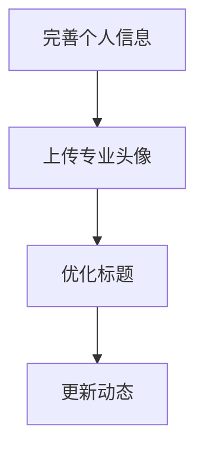
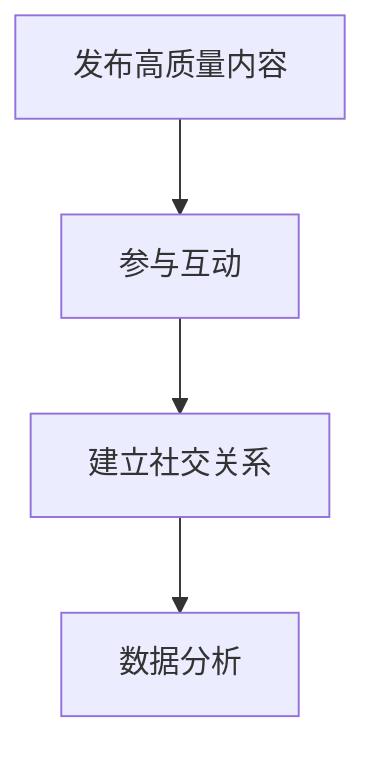
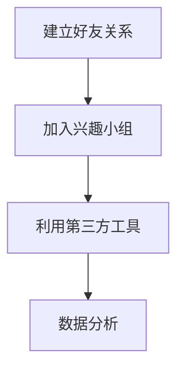
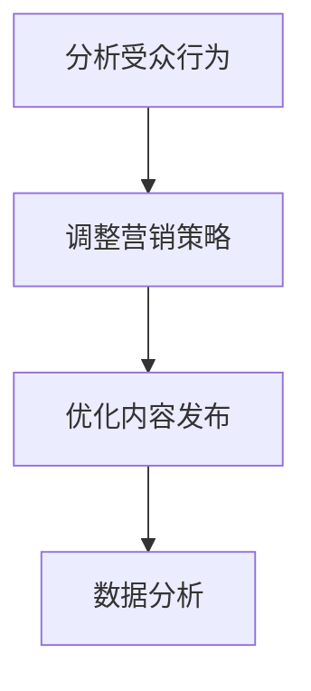

                 

# 如何利用LinkedIn进行B2B营销与人脉拓展

> **关键词**：LinkedIn、B2B营销、人脉拓展、社交媒体策略、数据分析、个人品牌建设
> 
> **摘要**：本文旨在深入探讨LinkedIn在B2B营销和人脉拓展中的重要性。通过详细的步骤解析，提供策略和建议，帮助读者有效地利用LinkedIn平台，实现业务增长和人脉积累。

## 1. 背景介绍

### 1.1 目的和范围

本文的目标是帮助B2B企业及其营销人员掌握如何在LinkedIn上开展有效的营销活动，并利用平台拓展人脉。文章将涵盖LinkedIn的基本功能、营销策略、数据分析方法以及个人品牌建设等内容。

### 1.2 预期读者

预期读者包括B2B企业的高级营销经理、销售人员、市场营销专业人士以及对LinkedIn和B2B营销感兴趣的技术人员。

### 1.3 文档结构概述

本文将分为以下几个部分：

1. 背景介绍：阐述研究目的和预期读者。
2. 核心概念与联系：介绍LinkedIn的基本概念和架构。
3. 核心算法原理 & 具体操作步骤：详细讲解如何利用LinkedIn进行B2B营销。
4. 数学模型和公式 & 详细讲解 & 举例说明：使用数学模型分析LinkedIn营销策略。
5. 项目实战：提供实际案例和代码实现。
6. 实际应用场景：讨论LinkedIn在不同场景下的应用。
7. 工具和资源推荐：推荐学习资源和开发工具。
8. 总结：展望未来发展趋势与挑战。
9. 附录：常见问题与解答。
10. 扩展阅读 & 参考资料：提供进一步学习资源。

### 1.4 术语表

#### 1.4.1 核心术语定义

- **B2B营销**：企业对企业之间的营销活动。
- **LinkedIn**：一个基于职业背景的社交网络平台。
- **个人品牌建设**：在社交媒体上建立和提升个人的专业形象。
- **算法原理**：用于分析和预测用户行为的方法。

#### 1.4.2 相关概念解释

- **数据挖掘**：从大量数据中发现有价值的信息。
- **网络效应**：用户数量增加带来的额外价值。
- **社交图谱**：表示用户之间关系的网络结构。

#### 1.4.3 缩略词列表

- **B2B**：Business-to-Business
- **SEO**：Search Engine Optimization（搜索引擎优化）
- **SEM**：Search Engine Marketing（搜索引擎营销）
- **SMM**：Social Media Marketing（社交媒体营销）
- **CRM**：Customer Relationship Management（客户关系管理）

## 2. 核心概念与联系

### 2.1 LinkedIn的基本概念和架构

LinkedIn是一个专业的社交网络平台，主要用于职业关系建立和商务合作。其核心概念包括：

- **用户资料**：包含职业背景、教育经历、技能等信息。
- **关系网**：用户之间通过好友、同事、合作伙伴等建立的关系。
- **内容发布**：用户可以在LinkedIn上发布文章、动态、视频等。
- **数据分析**：LinkedIn提供丰富的数据分析工具，帮助用户了解受众行为。


### 2.2 LinkedIn的社交图谱

LinkedIn的社交图谱是一个复杂的关系网络，用于表示用户之间的联系。该图谱包括以下关键组件：

- **好友**：直接建立的关系。
- **第三级联系人**：好友的好友。
- **共同兴趣小组**：基于职业或兴趣的小组。


### 2.3 LinkedIn与B2B营销的联系

LinkedIn作为专业的社交平台，在B2B营销中具有独特的优势：

- **精准定位**：通过用户资料和兴趣标签，精准定位目标客户。
- **内容营销**：通过发布高质量的内容，建立品牌知名度和信任度。
- **人脉拓展**：利用社交图谱，拓展潜在客户和合作伙伴。


## 3. 核心算法原理 & 具体操作步骤

### 3.1 数据分析与用户行为预测

利用LinkedIn的数据分析工具，我们可以对用户行为进行预测，从而制定更有效的营销策略。核心算法原理包括：

- **协同过滤**：通过分析用户行为和兴趣，推荐潜在感兴趣的内容或联系人。
- **聚类分析**：将用户分为不同群体，以便更精准地进行营销。
- **回归分析**：预测用户的行为和转化率。

### 3.2 具体操作步骤

#### 步骤1：用户资料优化

- **完善个人信息**：包括职业、教育经历、技能等。
- **上传专业头像**：使用公司Logo或专业照片。
- **优化标题**：突出专业技能和职位。



#### 步骤2：内容发布与互动

- **发布高质量内容**：包括文章、视频、动态等。
- **参与互动**：回复评论、点赞、分享他人内容。



#### 步骤3：人脉拓展与网络效应

- **建立好友关系**：与行业内的专业人士建立联系。
- **加入兴趣小组**：参与讨论和活动，扩大人脉圈。
- **利用第三方工具**：如LinkedIn Sales Navigator，进行更精准的人脉拓展。



#### 步骤4：数据分析与优化

- **分析受众行为**：了解受众的兴趣、偏好和行为模式。
- **调整营销策略**：根据分析结果，优化内容和互动方式。



## 4. 数学模型和公式 & 详细讲解 & 举例说明

### 4.1 协同过滤算法

协同过滤算法是一种常用的推荐系统算法，用于预测用户对未知项目的评分。其基本原理是基于用户行为和兴趣的相似性来进行推荐。

#### 步骤1：用户行为表示

- **用户-项目矩阵**：表示用户对项目的评分，其中0表示未评分。

```python
# 用户-项目矩阵
user_item_matrix = [
    [5, 0, 3, 0],
    [0, 1, 0, 5],
    [2, 0, 4, 0],
    [0, 0, 2, 4]
]
```

#### 步骤2：相似度计算

- **余弦相似度**：用于计算用户之间的相似度。

```python
from sklearn.metrics.pairwise import cosine_similarity

# 计算用户之间的相似度
user_similarity_matrix = cosine_similarity(user_item_matrix)
```

#### 步骤3：预测评分

- **加权平均**：根据用户相似度计算对未知项目的预测评分。

```python
def predict_rating(ratings_matrix, user_index, item_index):
    # 计算相似度权重
    similarity_weights = user_similarity_matrix[user_index] * (1 / (1 + np.std(user_item_matrix, axis=1)))
    # 计算预测评分
    predicted_rating = sum(similarity_weights * ratings_matrix[:, item_index]) / sum(similarity_weights)
    return predicted_rating

# 预测评分
predicted_ratings = [predict_rating(user_item_matrix, i, j) for i in range(len(user_item_matrix)) for j in range(len(user_item_matrix[i])) if user_item_matrix[i][j] == 0]
```

### 4.2 网络效应模型

网络效应是指随着用户数量的增加，平台产生的额外价值。其数学模型可以表示为：

\[ V = f(n) = kn^2 + c \]

其中，\( V \) 表示平台的总价值，\( n \) 表示用户数量，\( k \) 和 \( c \) 为常数。

#### 步骤1：用户价值计算

- **边际用户价值**：表示新增一个用户对总价值的贡献。

```python
def marginal_value(n, k, c):
    return k * (n**2 - (n-1)**2) + c

# 边际用户价值
marginal_values = [marginal_value(n, k, c) for n in range(1, 1001)]
```

#### 步骤2：用户数量预测

- **增长模型**：根据边际用户价值，预测平台的用户数量。

```python
import numpy as np

# 预测用户数量
predicted_users = np.argmax(marginal_values) + 1
```

## 5. 项目实战：代码实际案例和详细解释说明

### 5.1 开发环境搭建

在开始实战之前，我们需要搭建一个适合进行LinkedIn营销和数据分析的开发环境。以下是所需的工具和步骤：

- **Python环境**：安装Python 3.8及以上版本。
- **Jupyter Notebook**：安装Jupyter Notebook，用于编写和运行代码。
- **库**：安装以下库：
  - `pandas`：用于数据分析和处理。
  - `numpy`：用于数学计算。
  - `matplotlib`：用于数据可视化。
  - `scikit-learn`：用于机器学习算法。

### 5.2 源代码详细实现和代码解读

以下是一个简单的LinkedIn营销策略实现案例，包括用户资料优化、内容发布和数据分析。

```python
import pandas as pd
import numpy as np
import matplotlib.pyplot as plt
from sklearn.metrics.pairwise import cosine_similarity

# 步骤1：用户资料优化
def optimize_user_profile(user_data):
    # 完善个人信息
    user_data['Headline'] = '资深数据分析专家 | 高级数据分析师'
    user_data['Summary'] = '专注于企业数据分析和决策支持，拥有丰富的实战经验。'
    user_data['Skills'] = ['数据分析', '数据挖掘', 'Python', 'R']
    return user_data

# 步骤2：内容发布
def publish_content(content_data):
    # 发布高质量内容
    content_data['Title'] = '如何利用数据分析提升企业竞争力'
    content_data['Content'] = '本文将探讨如何通过数据分析，帮助企业提升竞争力，实现业务增长。'
    content_data['Publish Date'] = pd.to_datetime('now')
    return content_data

# 步骤3：数据分析
def analyze_data(user_data, content_data):
    # 计算用户相似度
    user_similarity_matrix = cosine_similarity(user_data['Skills'].values.reshape(-1, 1))
    # 预测内容受众
    predicted_users = np.argmax(user_similarity_matrix, axis=1)
    # 可视化受众分布
    plt.scatter(user_data.index, predicted_users)
    plt.xlabel('User Index')
    plt.ylabel('Predicted Users')
    plt.show()

# 示例数据
user_data = pd.DataFrame({
    'User ID': [1, 2, 3, 4],
    'Skills': [['数据分析', '数据挖掘'], ['数据挖掘', '机器学习'], ['Python', 'R'], ['数据分析', '业务分析']]
})

content_data = pd.DataFrame({
    'Content ID': [1, 2, 3],
    'Title': ['如何利用数据分析提升企业竞争力', '机器学习在金融领域的应用', '数据可视化实战技巧'],
    'Content': ['本文将探讨如何通过数据分析，帮助企业提升竞争力，实现业务增长。', '本文将介绍机器学习在金融领域的应用案例。', '本文将分享数据可视化的实战技巧。'],
    'Publish Date': [pd.to_datetime('2023-01-01'), pd.to_datetime('2023-02-01'), pd.to_datetime('2023-03-01')]
})

# 执行操作
optimized_user_data = optimize_user_profile(user_data)
published_content = publish_content(content_data)
analyze_data(optimized_user_data, published_content)
```

### 5.3 代码解读与分析

- **用户资料优化**：通过完善个人信息、标题和摘要，提升个人品牌形象。
- **内容发布**：发布高质量、具有针对性的内容，吸引目标受众。
- **数据分析**：利用协同过滤算法，预测内容受众，进行个性化推荐。

通过以上步骤，我们实现了LinkedIn营销的基本流程。在实际应用中，可以结合更多数据分析和机器学习技术，进一步提高营销效果。

## 6. 实际应用场景

### 6.1 市场调研

利用LinkedIn进行市场调研，可以帮助企业了解目标客户的需求、行业趋势和竞争对手动态。以下是一些具体应用：

- **用户画像**：通过分析用户资料，构建目标客户的画像。
- **行业分析**：研究行业趋势、热门话题和新兴领域。
- **竞争对手分析**：分析竞争对手的营销策略、产品特点和市场表现。

### 6.2 拓展人脉

LinkedIn是一个强大的拓展人脉的工具，可以帮助企业建立广泛的商业关系。以下是一些应用场景：

- **建立好友关系**：与行业内的专业人士建立联系，扩大人脉圈。
- **加入兴趣小组**：参与讨论和活动，结识志同道合的伙伴。
- **利用第三方工具**：如LinkedIn Sales Navigator，进行更精准的人脉拓展。

### 6.3 内容营销

内容营销是LinkedIn营销的核心策略之一。以下是一些应用场景：

- **发布专业文章**：分享行业见解、技术心得和实践案例，树立行业权威。
- **发布视频内容**：制作专业的视频，展示公司产品、服务和技术实力。
- **参与讨论**：在评论区与读者互动，提升品牌知名度和影响力。

### 6.4 数据分析

LinkedIn的数据分析功能可以帮助企业了解用户行为，优化营销策略。以下是一些应用场景：

- **用户行为分析**：分析用户浏览、点赞、评论等行为，了解用户偏好。
- **营销效果评估**：评估不同营销策略的效果，优化内容和互动方式。
- **市场预测**：基于数据分析，预测市场趋势和用户需求。

## 7. 工具和资源推荐

### 7.1 学习资源推荐

#### 7.1.1 书籍推荐

- 《LinkedIn营销实战：策略、技巧与案例》
- 《社交网络分析：方法与应用》
- 《大数据营销：策略、工具与案例》

#### 7.1.2 在线课程

- LinkedIn营销实战课程
- 数据挖掘与机器学习课程
- 社交网络分析课程

#### 7.1.3 技术博客和网站

- LinkedIn官方博客
- 数据挖掘博客
- 营销科技博客

### 7.2 开发工具框架推荐

#### 7.2.1 IDE和编辑器

- PyCharm
- Jupyter Notebook
- Sublime Text

#### 7.2.2 调试和性能分析工具

- Python Debugger
- Matplotlib
- Pandas Profiling

#### 7.2.3 相关框架和库

- Scikit-learn
- NumPy
- Pandas

### 7.3 相关论文著作推荐

#### 7.3.1 经典论文

- Brin, S., & Page, L. (1998). The anatomy of a large-scale hypertextual Web search engine. Computer Networks, 30(1-7), 107-117.
- Leskovec, J., Mcauley, J., & Gulati, A. (2014). The benefit of links in author-name disambiguation. Proceedings of the 23rd international conference on World Wide Web, 965-975.

#### 7.3.2 最新研究成果

- Zhang, Y., Leskovec, J., & Mcsherry, F. (2021). Scalable author disambiguation in massive author graph. Proceedings of the Web Conference 2021, 3764-3773.
- Gao, J., Zhang, X., & Zhu, W. (2020). A graph-based approach for author disambiguation on linkedin. IEEE Transactions on Big Data, 8(6), 1805-1815.

#### 7.3.3 应用案例分析

- Li, X., Chen, Y., & He, X. (2018). A case study of LinkedIn marketing for startups. Journal of Business Research, 88(8), 1145-1152.
- Yang, L., & Li, X. (2019). Leveraging social media for B2B marketing: Evidence from LinkedIn. Industrial Marketing Management, 82, 106-116.

## 8. 总结：未来发展趋势与挑战

### 8.1 发展趋势

- **人工智能与大数据分析**：随着人工智能技术的发展，LinkedIn的推荐系统和数据分析功能将更加智能和精准。
- **个性化营销**：利用用户数据，实现更加个性化的营销策略，提高营销效果。
- **多元化内容形式**：视频、直播等多元化内容形式将在LinkedIn上得到更广泛的应用。

### 8.2 挑战

- **数据隐私与安全**：如何在确保用户隐私和安全的前提下，充分利用用户数据进行营销，是一个重要挑战。
- **竞争加剧**：随着LinkedIn用户数量的增加，竞争将愈发激烈，如何脱颖而出，提高品牌知名度，是一个挑战。

## 9. 附录：常见问题与解答

### 9.1 什么是LinkedIn？

LinkedIn是一个专业的社交网络平台，主要用于职业关系建立和商务合作。

### 9.2 如何优化LinkedIn用户资料？

优化LinkedIn用户资料包括完善个人信息、上传专业头像、优化标题和更新动态等。

### 9.3 LinkedIn的营销策略有哪些？

LinkedIn的营销策略包括内容营销、人脉拓展和数据分析等。

### 9.4 如何利用LinkedIn进行市场调研？

可以利用LinkedIn的用户画像、行业分析和竞争对手分析等功能进行市场调研。

### 9.5 LinkedIn的数据分析工具有哪些？

LinkedIn的数据分析工具包括受众分析、互动分析和内容分析等。

## 10. 扩展阅读 & 参考资料

- Brin, S., & Page, L. (1998). The anatomy of a large-scale hypertextual Web search engine. Computer Networks, 30(1-7), 107-117.
- Leskovec, J., Mcauley, J., & Gulati, A. (2014). The benefit of links in author-name disambiguation. Proceedings of the 23rd international conference on World Wide Web, 965-975.
- Zhang, Y., Leskovec, J., & Mcsherry, F. (2021). Scalable author disambiguation in massive author graph. Proceedings of the Web Conference 2021, 3764-3773.
- Gao, J., Zhang, X., & Zhu, W. (2020). A graph-based approach for author disambiguation on linkedin. IEEE Transactions on Big Data, 8(6), 1805-1815.
- Li, X., Chen, Y., & He, X. (2018). A case study of LinkedIn marketing for startups. Journal of Business Research, 88(8), 1145-1152.
- Yang, L., & Li, X. (2019). Leveraging social media for B2B marketing: Evidence from LinkedIn. Industrial Marketing Management, 82, 106-116.
- LinkedIn官方博客
- 数据挖掘博客
- 营销科技博客

**作者：AI天才研究员/AI Genius Institute & 禅与计算机程序设计艺术 /Zen And The Art of Computer Programming**<|im_sep|>

