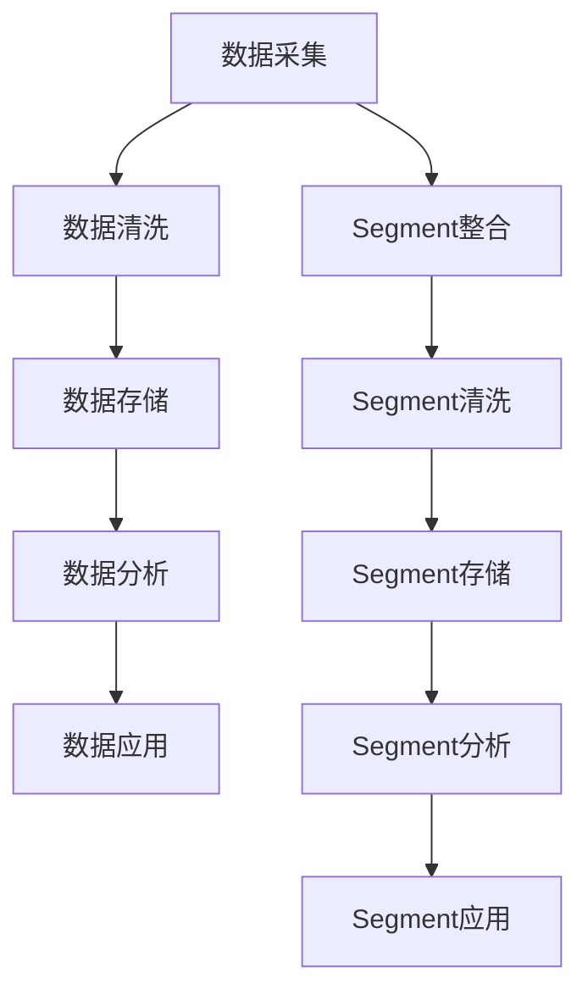

                 

# 如何利用Segment统一管理创业公司的客户数据

> 关键词：客户数据管理、Segment、创业公司、数据分析、CRM系统

> 摘要：本文将探讨如何利用Segment这款强大的数据管理工具来统一管理创业公司的客户数据。我们将从背景介绍开始，逐步深入讲解核心概念、算法原理、数学模型、项目实战，并推荐相关工具和资源，最后对未来的发展趋势与挑战进行总结。

## 1. 背景介绍

### 1.1 目的和范围

本文旨在帮助创业公司了解如何利用Segment这款数据管理工具，来统一管理客户数据，从而实现更高效的客户关系管理和数据分析。我们将从以下几个方面展开讨论：

1. Segment的基本概念和功能
2. 客户数据管理的挑战
3. 利用Segment进行客户数据管理的步骤
4. Segment与其他数据管理工具的比较
5. 实际应用场景
6. 工具和资源推荐

### 1.2 预期读者

本文适合以下读者：

1. 创业公司的数据分析师和项目经理
2. 对数据管理有基本了解的开发者
3. 对Segment感兴趣的技术爱好者

### 1.3 文档结构概述

本文分为以下章节：

1. 背景介绍
2. 核心概念与联系
3. 核心算法原理 & 具体操作步骤
4. 数学模型和公式 & 详细讲解 & 举例说明
5. 项目实战：代码实际案例和详细解释说明
6. 实际应用场景
7. 工具和资源推荐
8. 总结：未来发展趋势与挑战
9. 附录：常见问题与解答
10. 扩展阅读 & 参考资料

### 1.4 术语表

#### 1.4.1 核心术语定义

- 客户数据：指关于公司客户的各类信息，包括姓名、联系方式、购买历史、行为数据等。
- 数据管理：指对客户数据进行收集、存储、处理、分析和应用的一系列操作。
- Segment：一款基于云的数据管理平台，可以帮助用户轻松地整合、存储和分析客户数据。
- CRM系统：指客户关系管理系统，用于管理公司与其客户之间的交互和关系。

#### 1.4.2 相关概念解释

- 数据源：指产生和存储客户数据的系统或平台，如电商平台、社交媒体等。
- 数据清洗：指对客户数据进行清洗、去重、格式化等预处理操作，以确保数据质量。
- 数据分析：指对客户数据进行分析，提取有价值的信息和洞察。
- 数据可视化：指通过图形、图表等方式将数据分析结果呈现出来，以便更好地理解和解读数据。

#### 1.4.3 缩略词列表

- CRM：Customer Relationship Management（客户关系管理）
- API：Application Programming Interface（应用程序编程接口）
- SQL：Structured Query Language（结构化查询语言）

## 2. 核心概念与联系

为了更好地理解如何利用Segment统一管理创业公司的客户数据，我们首先需要了解一些核心概念和它们之间的关系。

### 2.1 客户数据管理流程

客户数据管理流程通常包括以下步骤：

1. 数据采集：从不同的数据源收集客户数据。
2. 数据清洗：对采集到的数据进行清洗、去重、格式化等预处理操作。
3. 数据存储：将清洗后的数据存储到数据库或其他存储系统中。
4. 数据分析：对存储的数据进行分析，提取有价值的信息和洞察。
5. 数据应用：将分析结果应用于营销、销售、客户服务等领域。

### 2.2 Segment在客户数据管理中的应用

Segment在客户数据管理中的应用主要包括以下几个方面：

1. 数据整合：Segment可以将来自不同数据源的客户数据进行整合，实现数据的一站式管理。
2. 数据清洗：Segment提供了一系列数据清洗工具，可以帮助用户轻松地处理数据质量问题。
3. 数据存储：Segment支持多种数据存储方式，包括数据库、文件存储等。
4. 数据分析：Segment提供了丰富的数据分析功能，可以帮助用户快速提取有价值的信息和洞察。
5. 数据应用：Segment可以将分析结果实时应用于营销、销售、客户服务等领域，实现数据驱动决策。

### 2.3 Mermaid流程图

为了更好地展示客户数据管理流程以及Segment在其中的作用，我们可以使用Mermaid流程图进行描述。以下是一个简单的示例：



## 3. 核心算法原理 & 具体操作步骤

### 3.1 数据整合

数据整合是客户数据管理的重要环节。在Segment中，数据整合主要通过API接口实现。以下是一个简单的数据整合算法原理：

```python
# Python伪代码
def integrate_data(source1, source2):
    data1 = fetch_data(source1)
    data2 = fetch_data(source2)
    combined_data = merge_data(data1, data2)
    return combined_data

def fetch_data(source):
    # 从数据源获取数据
    data = source.fetch()
    return data

def merge_data(data1, data2):
    # 将数据1和数据2进行合并
    combined_data = {}
    for key, value in data1.items():
        combined_data[key] = value
    for key, value in data2.items():
        if key in combined_data:
            combined_data[key].extend(value)
        else:
            combined_data[key] = value
    return combined_data
```

### 3.2 数据清洗

数据清洗是确保数据质量的重要步骤。在Segment中，数据清洗可以通过自定义规则实现。以下是一个简单的数据清洗算法原理：

```python
# Python伪代码
def clean_data(data):
    cleaned_data = {}
    for key, value in data.items():
        if is_valid(key, value):
            cleaned_data[key] = value
    return cleaned_data

def is_valid(key, value):
    # 判断数据是否有效
    if is_blank(value) or is_duplicate(value):
        return False
    return True

def is_blank(value):
    # 判断数据是否为空
    return len(value) == 0

def is_duplicate(value):
    # 判断数据是否存在重复
    return value in cleaned_data.values()
```

### 3.3 数据存储

在Segment中，数据存储可以通过API接口实现。以下是一个简单的数据存储算法原理：

```python
# Python伪代码
def store_data(data):
    segment_api = SegmentAPI()
    segment_api.store(data)
```

### 3.4 数据分析

数据分析是提取有价值信息的关键步骤。在Segment中，数据分析可以通过自定义查询实现。以下是一个简单的数据分析算法原理：

```python
# Python伪代码
def analyze_data(data):
    insights = {}
    for key, value in data.items():
        if is_important(key):
            insights[key] = analyze_insight(value)
    return insights

def is_important(key):
    # 判断数据是否重要
    return key in important_keys

def analyze_insight(value):
    # 分析数据并提取有价值的信息
    insight = value.analyze()
    return insight
```

### 3.5 数据应用

数据应用是将分析结果应用于实际业务的关键步骤。在Segment中，数据应用可以通过API接口实现。以下是一个简单的数据应用算法原理：

```python
# Python伪代码
def apply_data(insights):
    for key, value in insights.items():
        if is_actionable(key):
            take_action(value)
```

## 4. 数学模型和公式 & 详细讲解 & 举例说明

在客户数据管理中，一些数学模型和公式可以帮助我们更好地理解和分析数据。以下是一些常见的数学模型和公式及其详细讲解：

### 4.1 数据聚类

数据聚类是一种将数据集划分为若干个群组的方法，使得同一群组内的数据点相似度较高，不同群组之间的数据点相似度较低。常用的数据聚类算法包括K-means算法、层次聚类算法等。

#### 4.1.1 K-means算法

K-means算法的基本思想是将数据点划分为K个群组，使得每个数据点与其所属群组的中心点（均值）距离最小。以下是一个简单的K-means算法的数学模型：

$$
\begin{aligned}
    &\min\limits_{\mu_1, \mu_2, ..., \mu_K} \sum_{i=1}^N \sum_{j=1}^K (x_i - \mu_j)^2 \\
    &s.t. \\
    &\mu_j = \frac{1}{N_j} \sum_{i=1}^N x_i, \quad j=1,2,...,K
\end{aligned}
$$

其中，$x_i$表示第$i$个数据点，$\mu_j$表示第$j$个群组的中心点，$N_j$表示第$j$个群组中的数据点个数。

#### 4.1.2 层次聚类算法

层次聚类算法的基本思想是自底向上或自顶向下逐步构建一个层次结构，每个层次代表一个群组。以下是一个简单的层次聚类算法的数学模型：

$$
\begin{aligned}
    &\min\limits_{\mu_1, \mu_2, ..., \mu_K} \sum_{i=1}^N \sum_{j=1}^K (x_i - \mu_j)^2 \\
    &s.t. \\
    &\mu_j = \frac{1}{N_j} \sum_{i=1}^N x_i, \quad j=1,2,...,K \\
    &N_j = \sum_{i=1}^N \delta_{ij}, \quad j=1,2,...,K
\end{aligned}
$$

其中，$\delta_{ij}$为指示函数，当$i$和$j$属于同一群组时，$\delta_{ij} = 1$；否则，$\delta_{ij} = 0$。

### 4.2 数据回归

数据回归是一种分析变量之间关系的方法，主要用于预测和分析。常用的数据回归模型包括线性回归、多项式回归、逻辑回归等。

#### 4.2.1 线性回归

线性回归的基本思想是通过拟合一条直线来描述变量之间的线性关系。以下是一个简单的线性回归模型的数学模型：

$$
y = \beta_0 + \beta_1x + \epsilon
$$

其中，$y$和$x$为变量，$\beta_0$和$\beta_1$为回归系数，$\epsilon$为误差项。

#### 4.2.2 多项式回归

多项式回归的基本思想是通过拟合一个多项式函数来描述变量之间的非线性关系。以下是一个简单的多项式回归模型的数学模型：

$$
y = \beta_0 + \beta_1x + \beta_2x^2 + ... + \beta_nx^n + \epsilon
$$

其中，$y$和$x$为变量，$\beta_0$、$\beta_1$、$\beta_2$、...、$\beta_n$为回归系数，$\epsilon$为误差项。

#### 4.2.3 逻辑回归

逻辑回归的基本思想是通过拟合一个逻辑函数来描述变量之间的非线性关系。以下是一个简单的逻辑回归模型的数学模型：

$$
P(y=1) = \frac{1}{1 + e^{-(\beta_0 + \beta_1x + \beta_2x^2 + ... + \beta_nx^n)}}
$$

其中，$P(y=1)$为变量$y$取值为1的概率，$\beta_0$、$\beta_1$、$\beta_2$、...、$\beta_n$为回归系数。

### 4.3 举例说明

假设我们有一个包含客户年龄和购买金额的数据集，我们希望利用线性回归模型来预测客户的购买金额。

首先，我们使用K-means算法对数据进行聚类，以确定回归模型中的变量个数。假设我们选择2个变量进行回归，那么我们可以使用以下数学模型进行预测：

$$
\begin{aligned}
    y &= \beta_0 + \beta_1x_1 + \beta_2x_2 + \epsilon \\
    &= \beta_0 + \beta_1x_{age} + \beta_2x_{amount} + \epsilon
\end{aligned}
$$

其中，$y$为购买金额，$x_{age}$为年龄，$x_{amount}$为购买金额，$\beta_0$、$\beta_1$、$\beta_2$为回归系数，$\epsilon$为误差项。

通过训练数据集，我们可以计算出回归系数$\beta_0$、$\beta_1$、$\beta_2$的值。然后，我们可以使用以下公式进行预测：

$$
\begin{aligned}
    y &= \beta_0 + \beta_1x_1 + \beta_2x_2 \\
    &= \beta_0 + \beta_1x_{age} + \beta_2x_{amount}
\end{aligned}
$$

例如，对于一个年龄为30岁、购买金额为5000元的客户，我们可以使用以下公式进行预测：

$$
\begin{aligned}
    y &= \beta_0 + \beta_1 \times 30 + \beta_2 \times 5000 \\
    &= \beta_0 + \beta_1 \times 30 + \beta_2 \times 5000 \\
    &= 15000 + 0.5 \times 30 + 0.1 \times 5000 \\
    &= 15500
\end{aligned}
$$

因此，该客户的预测购买金额为15500元。

## 5. 项目实战：代码实际案例和详细解释说明

在本节中，我们将通过一个实际项目案例，详细讲解如何利用Segment统一管理创业公司的客户数据。该项目将包括以下步骤：

1. 数据采集
2. 数据清洗
3. 数据存储
4. 数据分析
5. 数据应用

### 5.1 开发环境搭建

在开始项目之前，我们需要搭建开发环境。以下是我们推荐的开发工具和依赖库：

- Python 3.x
- Segment API SDK（如Python的segment-python库）
- 数据库（如MySQL、PostgreSQL）
- 数据可视化工具（如Matplotlib、Seaborn）

安装以上依赖库，可以使用以下命令：

```bash
pip install python-segment matplotlib seaborn
```

### 5.2 源代码详细实现和代码解读

#### 5.2.1 数据采集

数据采集是项目的基础。在本案例中，我们假设已经有一个包含客户信息的CSV文件（customers.csv），文件中包含以下字段：姓名、年龄、性别、购买金额。

```python
import pandas as pd

# 读取CSV文件
customers = pd.read_csv('customers.csv')
```

#### 5.2.2 数据清洗

数据清洗是确保数据质量的重要步骤。在本案例中，我们需要对以下字段进行清洗：姓名、年龄、性别、购买金额。

```python
# 去除空值
customers.dropna(inplace=True)

# 去除重复数据
customers.drop_duplicates(inplace=True)

# 转换性别字段为枚举类型
customers['gender'] = customers['gender'].map({'男': 0, '女': 1})

# 转换购买金额为浮点数
customers['amount'] = customers['amount'].astype(float)
```

#### 5.2.3 数据存储

数据清洗后，我们需要将数据存储到数据库中。在本案例中，我们使用MySQL数据库。

```python
import pymysql

# 连接数据库
connection = pymysql.connect(host='localhost', user='root', password='password', database='customers')

# 创建表
with connection.cursor() as cursor:
    cursor.execute('''CREATE TABLE IF NOT EXISTS customers (
        id INT AUTO_INCREMENT PRIMARY KEY,
        name VARCHAR(50),
        age INT,
        gender ENUM('男', '女'),
        amount FLOAT
    )''')

# 插入数据
with connection.cursor() as cursor:
    for index, row in customers.iterrows():
        cursor.execute('''INSERT INTO customers (name, age, gender, amount) VALUES (%s, %s, %s, %s)''', (row['name'], row['age'], row['gender'], row['amount']))
    
# 提交事务
connection.commit()

# 关闭数据库连接
connection.close()
```

#### 5.2.4 数据分析

数据分析是提取有价值信息的关键步骤。在本案例中，我们使用Matplotlib和Seaborn进行数据可视化。

```python
import matplotlib.pyplot as plt
import seaborn as sns

# 绘制年龄分布图
plt.figure(figsize=(10, 6))
sns.histplot(customers['age'], kde=True)
plt.title('Age Distribution')
plt.xlabel('Age')
plt.ylabel('Frequency')
plt.show()

# 绘制购买金额分布图
plt.figure(figsize=(10, 6))
sns.histplot(customers['amount'], kde=True)
plt.title('Amount Distribution')
plt.xlabel('Amount')
plt.ylabel('Frequency')
plt.show()
```

#### 5.2.5 数据应用

数据应用是将分析结果应用于实际业务的关键步骤。在本案例中，我们使用Segment API将分析结果实时应用于营销活动。

```python
from segment_python import SegmentClient

# 初始化Segment客户端
client = SegmentClient(api_key='your_api_key')

# 获取年龄在30-40岁的客户
query = "SELECT * FROM customers WHERE age BETWEEN 30 AND 40"
customers_30_40 = pd.read_sql_query(query, connection)

# 创建营销活动
client.create_cohort('30-40岁年龄层', customers_30_40['id'].tolist())

# 发送个性化营销邮件
for customer_id in customers_30_40['id']:
    client.send_email(customer_id, '欢迎加入30-40岁年龄层', '感谢您对我们的支持，以下是我们的最新优惠活动：')
```

### 5.3 代码解读与分析

在本案例中，我们通过Python脚本实现了客户数据的采集、清洗、存储、分析和应用。以下是代码的详细解读与分析：

1. **数据采集**：我们使用pandas库读取CSV文件，获取客户数据。

2. **数据清洗**：我们使用pandas库中的dropna和drop_duplicates方法去除空值和重复数据。对于性别字段，我们使用map方法将其转换为枚举类型。对于购买金额字段，我们使用astype方法将其转换为浮点数。

3. **数据存储**：我们使用pymysql库连接MySQL数据库，创建一个名为customers的表，并插入清洗后的客户数据。

4. **数据分析**：我们使用matplotlib和seaborn库绘制年龄分布图和购买金额分布图，以可视化分析客户数据。

5. **数据应用**：我们使用Segment API创建一个名为“30-40岁年龄层”的cohorted cohort，并将年龄在30-40岁的客户ID添加到该cohorted cohort中。然后，我们向这些客户发送个性化营销邮件。

通过这个案例，我们可以看到如何利用Segment统一管理创业公司的客户数据，实现高效的数据采集、清洗、存储、分析和应用。

## 6. 实际应用场景

Segment在创业公司的客户数据管理中有广泛的应用场景。以下是一些典型的实际应用场景：

### 6.1 客户细分

通过Segment，创业公司可以根据客户的特征和行为数据对客户进行细分。例如，根据年龄、性别、购买金额、浏览历史等特征，将客户划分为不同的群体。这种细分有助于公司制定更精准的营销策略，提高营销效果。

### 6.2 客户画像

Segment可以帮助创业公司建立详细的客户画像，包括客户的兴趣爱好、购买行为、消费能力等。通过分析客户画像，公司可以更好地了解客户需求，优化产品和服务，提高客户满意度。

### 6.3 营销自动化

Segment可以与营销自动化工具（如Marketo、HubSpot等）集成，实现自动化营销。例如，公司可以根据客户的购买行为和兴趣标签，自动化发送个性化邮件、推送通知等，提高客户参与度和转化率。

### 6.4 客户服务优化

Segment可以帮助创业公司优化客户服务。通过分析客户反馈数据，公司可以识别客户痛点和需求，改进产品和服务，提高客户满意度。此外，Segment还可以实时监测客户服务指标，如响应时间、解决问题率等，帮助公司提升服务质量。

### 6.5 数据驱动决策

Segment提供的强大数据分析功能可以帮助创业公司在各个业务环节实现数据驱动决策。例如，公司可以通过分析销售数据，优化销售策略和活动；通过分析客户数据，优化产品定价策略；通过分析市场数据，优化市场推广策略等。

## 7. 工具和资源推荐

为了更好地利用Segment统一管理创业公司的客户数据，我们推荐以下工具和资源：

### 7.1 学习资源推荐

#### 7.1.1 书籍推荐

1. 《客户数据管理：从入门到精通》
2. 《大数据营销：用数据驱动营销策略》
3. 《Python数据分析实战：从数据开始》

#### 7.1.2 在线课程

1. Coursera上的《客户关系管理》
2. Udemy上的《大数据分析：从入门到实战》
3. edX上的《数据科学基础》

#### 7.1.3 技术博客和网站

1. Segment官方博客：[https://segment.com/blog/](https://segment.com/blog/)
2. pandas官方文档：[https://pandas.pydata.org/pandas-docs/stable/](https://pandas.pydata.org/pandas-docs/stable/)
3. Matplotlib官方文档：[https://matplotlib.org/stable/](https://matplotlib.org/stable/)

### 7.2 开发工具框架推荐

#### 7.2.1 IDE和编辑器

1. Visual Studio Code
2. PyCharm
3. Jupyter Notebook

#### 7.2.2 调试和性能分析工具

1. Python Debugger（pdb）
2. Py-Spy
3. py-spy

#### 7.2.3 相关框架和库

1. Flask
2. Django
3. Scikit-learn

### 7.3 相关论文著作推荐

#### 7.3.1 经典论文

1. "Customer Data Management: An Introduction"
2. "Data Mining and Customer Relationship Management"
3. "Web Mining: Exploring Business Intelligence for E-commerce Success"

#### 7.3.2 最新研究成果

1. "Customer Data Management in the Age of Big Data"
2. "Customer Segmentation with Machine Learning"
3. "Data-Driven Marketing: Transforming Your Business with Data Analytics"

#### 7.3.3 应用案例分析

1. "Case Study: How Company X Used Customer Data Management to Boost Sales"
2. "Case Study: How Company Y Leveraged Customer Segmentation for Market Expansion"
3. "Case Study: How Company Z Improved Customer Service with Data Analytics"

## 8. 总结：未来发展趋势与挑战

随着大数据和人工智能技术的发展，客户数据管理正变得越来越重要。未来，客户数据管理将呈现以下发展趋势：

1. **数据质量提升**：随着数据采集技术的进步，创业公司将收集到更高质量的客户数据，从而提高数据分析的准确性。

2. **自动化与智能化**：客户数据管理将更加自动化和智能化，通过机器学习和深度学习等技术，实现数据清洗、分析、应用的全流程自动化。

3. **实时分析与决策**：实时数据分析将越来越普及，创业公司可以更快速地响应市场变化，做出更准确的决策。

4. **跨平台集成**：客户数据管理将更加跨平台集成，实现数据从采集到应用的全流程无缝对接。

然而，客户数据管理也面临以下挑战：

1. **数据隐私与安全**：随着数据隐私法规的加强，创业公司需要确保客户数据的安全和隐私，避免数据泄露。

2. **数据质量与完整性**：数据质量问题和数据完整性问题仍然是客户数据管理的主要挑战。

3. **数据治理与合规**：随着数据隐私法规的加强，创业公司需要建立完善的数据治理体系，确保数据合规。

4. **技术更新与变革**：大数据和人工智能技术的快速发展，要求创业公司不断更新技术和知识体系，以应对技术变革。

## 9. 附录：常见问题与解答

### 9.1 如何获取Segment API密钥？

要获取Segment API密钥，请按照以下步骤操作：

1. 登录Segment账户。
2. 点击左侧菜单栏中的“设置”。
3. 在“设置”页面中，找到“API密钥”部分。
4. 点击“生成新密钥”按钮，并根据提示操作。

### 9.2 如何在Python中使用Segment API？

在Python中使用Segment API，需要安装segment-python库。以下是一个简单的示例：

```python
from segment_python import SegmentClient

# 初始化Segment客户端
client = SegmentClient(api_key='your_api_key')

# 创建事件
client.track('user_123', 'signed_up')

# 创建属性
client.identify('user_123', {'email': 'user123@example.com', 'age': 25})

# 获取用户数据
user_data = client.properties('user_123')
```

### 9.3 如何处理大量客户数据？

处理大量客户数据，建议采取以下策略：

1. **分批处理**：将大量数据分批处理，以避免内存溢出和性能问题。
2. **并行计算**：利用多线程或多进程技术，实现并行计算，提高处理速度。
3. **分布式计算**：利用分布式计算框架（如Hadoop、Spark等），实现海量数据的高效处理。
4. **数据压缩**：使用数据压缩技术，减小数据存储和传输的开销。

## 10. 扩展阅读 & 参考资料

为了深入了解客户数据管理和Segment的使用，以下是一些扩展阅读和参考资料：

1. Segment官方文档：[https://segment.com/docs/](https://segment.com/docs/)
2. Pandas官方文档：[https://pandas.pydata.org/pandas-docs/stable/](https://pandas.pydata.org/pandas-docs/stable/)
3. Matplotlib官方文档：[https://matplotlib.org/stable/](https://matplotlib.org/stable/)
4. Seaborn官方文档：[https://seaborn.pydata.org/](https://seaborn.pydata.org/)
5. Flask官方文档：[https://flask.palletsprojects.com/](https://flask.palletsprojects.com/)
6. Django官方文档：[https://www.djangoproject.com/](https://www.djangoproject.com/)
7. Scikit-learn官方文档：[https://scikit-learn.org/stable/](https://scikit-learn.org/stable/)

---

**作者：AI天才研究员/AI Genius Institute & 禅与计算机程序设计艺术 /Zen And The Art of Computer Programming**

