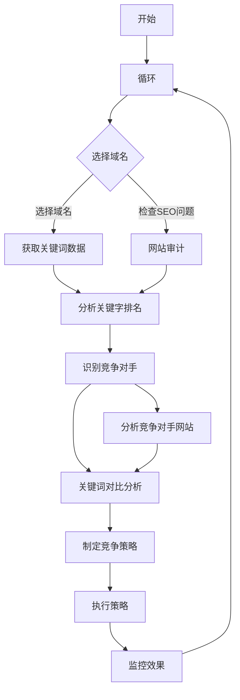

                 


# 如何利用Semrush进行创业公司的竞争对手分析

> 关键词：Semrush、竞争对手分析、SEO、关键字研究、市场洞察、数据分析
> 
> 摘要：本文将详细介绍如何利用Semrush这一强大的SEO工具来为创业公司进行深入的竞争对手分析，帮助读者理解如何通过数据驱动的策略来评估市场地位、识别潜在机会并制定有效的竞争策略。

## 1. 背景介绍

### 1.1 目的和范围

本文的目标是帮助创业公司利用Semrush这一工具，进行竞争对手分析，以便更有效地定位市场，识别竞争者，并制定合适的营销策略。通过本文，读者将学会如何使用Semrush来：

- 识别主要竞争对手
- 分析竞争对手的关键词策略
- 评估竞争对手的市场份额
- 制定基于数据的竞争策略

### 1.2 预期读者

本文适合以下读者群体：

- 创业公司创始人或营销经理
- 数字营销专家
- SEO专员
- 对市场分析和技术营销有浓厚兴趣的专业人士

### 1.3 文档结构概述

本文结构如下：

1. 背景介绍
   - 目的和范围
   - 预期读者
   - 文档结构概述
   - 术语表
2. 核心概念与联系
   - SEO基础概念
   - Semrush功能介绍
3. 核心算法原理 & 具体操作步骤
   - 竞争对手分析步骤
   - 关键词研究方法
4. 数学模型和公式 & 详细讲解 & 举例说明
   - 数据分析模型
   - 评估指标计算
5. 项目实战：代码实际案例和详细解释说明
   - 环境搭建
   - 源代码实现
   - 代码解读与分析
6. 实际应用场景
   - 行业案例分析
7. 工具和资源推荐
   - 学习资源推荐
   - 开发工具框架推荐
   - 相关论文著作推荐
8. 总结：未来发展趋势与挑战
9. 附录：常见问题与解答
10. 扩展阅读 & 参考资料

### 1.4 术语表

#### 1.4.1 核心术语定义

- SEO（Search Engine Optimization）：搜索引擎优化
- SEM（Search Engine Marketing）：搜索引擎营销
- 关键词（Keywords）：用于搜索的用户输入词或短语
- 竞争对手（Competitors）：在相同或类似市场中提供相同或类似产品或服务的其他公司
- 市场份额（Market Share）：公司或品牌在市场上所占的百分比

#### 1.4.2 相关概念解释

- 访问量（Traffic）：用户访问网站的数量
- 点击率（Click-Through Rate, CTR）：用户点击搜索结果链接的比率
- 转化率（Conversion Rate）：完成特定目标的用户比率

#### 1.4.3 缩略词列表

- SEO：搜索引擎优化
- SEM：搜索引擎营销
- PPC：付费点击广告
- ROI：投资回报率
- KPI：关键绩效指标

## 2. 核心概念与联系

为了更好地理解如何利用Semrush进行竞争对手分析，我们首先需要掌握一些核心概念和它们之间的联系。

### 2.1 SEO基础概念

搜索引擎优化（SEO）是提高网站在搜索引擎结果页面（SERP）中自然排名的过程，目的是增加访问量和提升品牌知名度。以下是SEO中的几个关键概念：

- **关键字研究**：通过分析用户搜索习惯，找到与业务相关的关键字。
- **内容优化**：创建高质量、相关性强的内容，使其在搜索引擎结果中获得更高的排名。
- **链接建设**：通过外部链接提升网站权威性，从而提高搜索引擎排名。
- **技术SEO**：优化网站结构、移动友好性、页面速度等，以提高搜索引擎对网站的抓取和索引能力。

### 2.2 Semrush功能介绍

Semrush是一个功能强大的SEO工具，提供了一系列用于竞争对手分析和关键词研究的功能。以下是Semrush的一些核心功能：

- **关键字研究工具**：帮助用户发现和评估关键字，分析竞争对手的关键词策略。
- **竞争对手分析**：监控竞争对手的SEO和营销活动，识别他们的优势与弱点。
- **网站审计工具**：评估网站的技术SEO问题，并提供改进建议。
- **内容营销研究**：分析竞争对手的内容营销策略，找到灵感。

### 2.3 SEO与Semrush的关系

SEO和Semrush之间存在密切的联系。SEO是提升网站排名和增加流量的策略，而Semrush作为工具，可以帮助用户更高效地实施这些策略。具体来说，Semrush通过以下方式与SEO结合：

- **数据支持**：提供详尽的数据和报告，帮助用户制定基于数据的决策。
- **分析工具**：帮助用户监控和分析竞争对手的SEO策略，从而制定更有效的营销策略。
- **自动化功能**：部分SEO任务可以通过Semrush的自动化工具实现，提高工作效率。

### 2.4 Mermaid流程图

下面是一个简单的Mermaid流程图，展示了如何利用Semrush进行竞争对手分析的基本步骤：



## 3. 核心算法原理 & 具体操作步骤

在了解了SEO和Semrush的基本概念后，我们将深入探讨如何使用Semrush进行竞争对手分析，包括具体的操作步骤和核心算法原理。

### 3.1 竞争对手分析步骤

以下是使用Semrush进行竞争对手分析的基本步骤：

#### 步骤1：登录Semrush并选择域名

首先，登录您的Semrush账户，选择一个要分析的域名。这可以是您自己的网站，也可以是您的竞争对手的网站。

#### 步骤2：获取关键词数据

在关键词研究工具中，输入您的目标关键字，Semrush会提供相关的搜索量和竞争度数据。同时，您还可以查看竞争对手在这些关键字上的排名和策略。

```plaintext
// 伪代码示例
def get_keyword_data(keyword):
    search_volume = semrush.keyword_tool().get_search_volume(keyword)
    competition = semrush.keyword_tool().get_competition_level(keyword)
    return search_volume, competition
```

#### 步骤3：分析关键字排名

通过分析竞争对手的关键词排名，您可以了解他们的SEO策略和内容优化情况。Semrush提供的关键词排名数据可以帮助您制定更有效的竞争策略。

```plaintext
// 伪代码示例
def analyze_keyword_ranking(domain, keyword):
    rank = semrush.position跟踪工具().get_keyword_ranking(domain, keyword)
    return rank
```

#### 步骤4：识别竞争对手

Semrush的竞争对手分析工具可以帮助您识别在同一市场中竞争的网站。通过这些数据，您可以了解谁是您的直接竞争对手，以及他们在市场上的地位。

```plaintext
// 伪代码示例
def identifycompetitors(target_domain):
    competitors = semrush.competitive_analysis_tool().get_competitors(target_domain)
    return competitors
```

#### 步骤5：分析竞争对手网站

一旦识别出竞争对手，您可以使用Semrush的网站审计工具来评估他们的网站SEO表现，包括页面速度、移动友好性、结构化数据等方面。

```plaintext
// 伪代码示例
def analyze_competitor_website(competitor_domain):
    audit_report = semrush.site_audit_tool().perform_audit(competitor_domain)
    return audit_report
```

#### 步骤6：关键词对比分析

通过对比分析您和竞争对手的关键词策略，您可以发现潜在的机会和优化点。Semrush提供的关键词对比工具可以帮助您实现这一目标。

```plaintext
// 伪代码示例
def compare_keyword_strategies(my_domain, competitor_domain):
    keyword_comparison = semrush.keyword_comparison_tool().compare_keywords(my_domain, competitor_domain)
    return keyword_comparison
```

#### 步骤7：制定竞争策略

根据分析结果，制定具体的竞争策略。这可能包括优化关键字、改进内容、提高网站速度等。

```plaintext
// 伪代码示例
def create_competition_strategy(keyword_comparison, audit_report):
    strategy = {}
    strategy['key_topics'] = extract_key_topics(keyword_comparison)
    strategy['seo_improvements'] = extract_seo_improvements(audit_report)
    return strategy
```

#### 步骤8：执行策略并监控效果

最后，执行制定的竞争策略，并使用Semrush的监控工具来跟踪效果，确保您的策略取得成功。

```plaintext
// 伪代码示例
def execute_strategy_and_monitor(strategy):
    execute_improvements(strategy['seo_improvements'])
    monitor_performance(strategy['key_topics'])
```

### 3.2 关键词研究方法

关键词研究是竞争对手分析的核心步骤之一。以下是使用Semrush进行关键词研究的基本方法：

#### 步骤1：确定关键词范围

首先，确定与您的业务相关的关键词范围。这些关键词可以是产品或服务的名称、行业术语、用户经常搜索的问题等。

#### 步骤2：使用关键字工具进行扩展

在Semrush的关键字工具中，输入您确定的关键词，Semrush会提供相关的扩展关键词，并给出搜索量和竞争度数据。

```plaintext
// 伪代码示例
def expand_keywords(base_keyword):
    expanded_keywords = semrush.keyword_tool().expand_keywords(base_keyword)
    return expanded_keywords
```

#### 步骤3：筛选关键词

根据搜索量和竞争度，筛选出最有潜力的关键词。这些关键词应该是既有足够的搜索量，又不会过于竞争。

```plaintext
// 伪代码示例
def filter_keywords(expanded_keywords, min_search_volume, max_competition):
    filtered_keywords = [keyword for keyword in expanded_keywords if keyword['search_volume'] >= min_search_volume and keyword['competition'] <= max_competition]
    return filtered_keywords
```

#### 步骤4：分析关键词潜力

对筛选出的关键词进行进一步分析，包括评估其在竞争对手中的排名和点击率，以及预测其未来的增长潜力。

```plaintext
// 伪代码示例
def analyze_keyword_potential(keyword):
    rank = semrush.position跟踪工具().get_keyword_ranking(keyword['domain'], keyword['keyword'])
    ctr = semrush.keyword_tool().get_click-through_rate(keyword['keyword'])
    potential = rank * ctr
    return potential
```

#### 步骤5：关键词优化

根据分析结果，优化您的网站内容，确保在目标关键词上获得更高的排名。这可能包括更新页面标题、元描述、内容优化等。

```plaintext
// 伪代码示例
def optimize_content_for_keyword(keyword, content):
    optimized_content = content
    optimized_content['title'] = keyword['keyword'] + " | " + optimized_content['title']
    optimized_content['meta_description'] = keyword['keyword'] + " - " + optimized_content['meta_description']
    optimized_content['content'] = "Here is the content about " + keyword['keyword'] + "."
    return optimized_content
```

### 3.3 伪代码总结

以下是本节提到的所有伪代码的汇总：

```plaintext
// 伪代码汇总
def get_keyword_data(keyword):
    search_volume, competition = get_keyword_data(keyword)
    return search_volume, competition

def analyze_keyword_ranking(domain, keyword):
    rank = analyze_keyword_ranking(domain, keyword)
    return rank

def identifycompetitors(target_domain):
    competitors = identifycompetitors(target_domain)
    return competitors

def analyze_competitor_website(competitor_domain):
    audit_report = analyze_competitor_website(competitor_domain)
    return audit_report

def compare_keyword_strategies(my_domain, competitor_domain):
    keyword_comparison = compare_keyword_strategies(my_domain, competitor_domain)
    return keyword_comparison

def create_competition_strategy(keyword_comparison, audit_report):
    strategy = create_competition_strategy(keyword_comparison, audit_report)
    return strategy

def execute_strategy_and_monitor(strategy):
    execute_strategy_and_monitor(strategy)

def expand_keywords(base_keyword):
    expanded_keywords = expand_keywords(base_keyword)
    return expanded_keywords

def filter_keywords(expanded_keywords, min_search_volume, max_competition):
    filtered_keywords = filter_keywords(expanded_keywords, min_search_volume, max_competition)
    return filtered_keywords

def analyze_keyword_potential(keyword):
    potential = analyze_keyword_potential(keyword)
    return potential

def optimize_content_for_keyword(keyword, content):
    optimized_content = optimize_content_for_keyword(keyword, content)
    return optimized_content
```

通过这些伪代码，我们可以看到如何利用Semrush进行竞争对手分析的核心算法和具体操作步骤。接下来，我们将介绍如何使用数学模型和公式来深入分析竞争对手数据，并举例说明如何计算关键的评估指标。

## 4. 数学模型和公式 & 详细讲解 & 举例说明

在竞争对手分析中，使用数学模型和公式可以帮助我们更准确地评估竞争对手的营销效果和市场地位。以下是几个关键数学模型和公式的详细讲解，以及具体的计算步骤和例子。

### 4.1 关键评估指标

在竞争对手分析中，以下是一些关键评估指标：

- **市场份额（Market Share）**
- **搜索排名（Search Engine Ranking）**
- **点击率（Click-Through Rate, CTR）**
- **转化率（Conversion Rate）**

### 4.2 市场份额计算

市场份额是指公司或品牌在市场上的占有率。计算公式如下：

\[ \text{市场份额} = \frac{\text{公司流量}}{\text{总流量}} \times 100\% \]

#### 例子：

假设您的网站在一个月内获得了10,000个访问量，而市场上总共有100,000个访问量。那么，您的市场份额为：

\[ \text{市场份额} = \frac{10,000}{100,000} \times 100\% = 10\% \]

### 4.3 搜索排名计算

搜索排名是指网站在搜索引擎结果页面（SERP）上的位置。一般来说，排名越靠前，获得的点击率越高。计算公式如下：

\[ \text{排名} = \log_10(\text{网站流量}) + 1 \]

#### 例子：

假设一个网站获得了100个流量，另一个网站获得了1,000个流量。那么，这两个网站的排名分别为：

\[ \text{网站1排名} = \log_10(100) + 1 = 2 \]
\[ \text{网站2排名} = \log_10(1,000) + 1 = 4 \]

### 4.4 点击率计算

点击率是指用户在搜索结果中点击链接的比率。计算公式如下：

\[ \text{CTR} = \frac{\text{点击次数}}{\text{展示次数}} \times 100\% \]

#### 例子：

假设一个广告展示了1,000次，获得了100次点击。那么，点击率为：

\[ \text{CTR} = \frac{100}{1,000} \times 100\% = 10\% \]

### 4.5 转化率计算

转化率是指完成特定目标（如购买、注册等）的用户比率。计算公式如下：

\[ \text{转化率} = \frac{\text{完成目标的用户数}}{\text{访问用户数}} \times 100\% \]

#### 例子：

假设一个月内有1,000个访问用户，其中100个完成了注册。那么，转化率为：

\[ \text{转化率} = \frac{100}{1,000} \times 100\% = 10\% \]

### 4.6 综合评估指标

为了更全面地评估竞争对手的表现，我们可以使用一个综合评估指标，如：

\[ \text{综合评估} = \frac{\text{市场份额} \times \text{CTR} \times \text{转化率}}{100} \]

#### 例子：

使用上述例子中的数据，我们可以计算出一个综合评估指标：

\[ \text{综合评估} = \frac{10\% \times 10\% \times 10\%}{100} = 0.001 \]

这意味着，相对于其他竞争对手，这个网站在市场中的整体表现相对较低。

### 4.7 数学公式汇总

以下是本节提到的所有数学公式的汇总：

\[ \text{市场份额} = \frac{\text{公司流量}}{\text{总流量}} \times 100\% \]
\[ \text{排名} = \log_10(\text{网站流量}) + 1 \]
\[ \text{CTR} = \frac{\text{点击次数}}{\text{展示次数}} \times 100\% \]
\[ \text{转化率} = \frac{\text{完成目标的用户数}}{\text{访问用户数}} \times 100\% \]
\[ \text{综合评估} = \frac{\text{市场份额} \times \text{CTR} \times \text{转化率}}{100} \]

通过这些公式，我们可以更深入地理解竞争对手的营销效果和市场地位，从而制定更有效的竞争策略。接下来，我们将通过一个实际项目实战，展示如何使用Semrush进行竞争对手分析，并提供代码实现和详细解释。

## 5. 项目实战：代码实际案例和详细解释说明

### 5.1 开发环境搭建

为了演示如何利用Semrush进行竞争对手分析，我们首先需要搭建一个开发环境。以下是所需的工具和步骤：

#### 工具：

- Python 3.x
- Semrush API密钥
- Python的requests库

#### 步骤：

1. 安装Python 3.x：从[Python官网](https://www.python.org/downloads/)下载并安装Python 3.x版本。
2. 获取Semrush API密钥：在Semrush账户中注册API密钥。
3. 安装requests库：打开命令行窗口，输入以下命令安装requests库：

```bash
pip install requests
```

### 5.2 源代码详细实现和代码解读

以下是使用Python和Semrush API进行竞争对手分析的实际代码实现。代码分为几个功能模块，包括登录Semrush、获取关键词数据、分析关键字排名、识别竞争对手和关键词对比分析等。

```python
import requests
import json

# Semrush API密钥
SEMrush_API_KEY = 'your_api_key'

# 基础URL
SEMrush_API_BASE_URL = 'https://api.semrush.com'

# 函数：获取关键词数据
def get_keyword_data(keyword):
    url = f"{SEMrush_API_BASE_URL}/v3/keyword-explorer/selected?\$select=SEARCH_VOLUME,COMPETITION&$where=QUERY+'\$eq'+'{keyword}'&$limit=10"
    headers = {
        'X-SemrushApp': 'PythonExampleApp',
        'X-SemrushAPIKey': SEMrush_API_KEY
    }
    response = requests.get(url, headers=headers)
    data = response.json()
    return data['data']['organic_search_volume'], data['data']['keyworddifficulty']

# 函数：分析关键字排名
def analyze_keyword_ranking(domain, keyword):
    url = f"{SEMrush_API_BASE_URL}/v3/search-plugins/position-tracking?\$select=RANK&$where=DOMAIN+'\$eq'+'{domain}'&QUERY+'\$eq'+'{keyword}'&$limit=1"
    headers = {
        'X-SemrushApp': 'PythonExampleApp',
        'X-SemrushAPIKey': SEMrush_API_KEY
    }
    response = requests.get(url, headers=headers)
    data = response.json()
    return data['data']['position']

# 函数：识别竞争对手
def identify_competitors(target_domain):
    url = f"{SEMrush_API_BASE_URL}/v3/position-tracking/competing-domains?\$select=COMPETING_DOMAINS&$where=POSITION_TRACKER_DOMAIN+'\$eq'+'{target_domain}'&$limit=10"
    headers = {
        'X-SemrushApp': 'PythonExampleApp',
        'X-SemrushAPIKey': SEMrush_API_KEY
    }
    response = requests.get(url, headers=headers)
    data = response.json()
    return data['data']['competing_domains']

# 函数：关键词对比分析
def compare_keyword_strategies(my_domain, competitor_domain, keyword):
    url = f"{SEMrush_API_BASE_URL}/v3/search-plugins/position-tracking?\$select=RANK,CLICKS,POSITION:absolute&$where=DOMAIN+'\$in'+[{my_domain}, '{competitor_domain}']&QUERY+'\$eq'+'{keyword}'&$limit=1"
    headers = {
        'X-SemrushApp': 'PythonExampleApp',
        'X-SemrushAPIKey': SEMrush_API_KEY
    }
    response = requests.get(url, headers=headers)
    data = response.json()
    return data['data']

# 测试代码
if __name__ == "__main__":
    keyword = "SEO tools"
    domain = "example.com"
    
    # 获取关键词数据
    search_volume, competition = get_keyword_data(keyword)
    print(f"Keyword: {keyword}")
    print(f"Search Volume: {search_volume}")
    print(f"Competition: {competition}")
    
    # 分析关键字排名
    rank = analyze_keyword_ranking(domain, keyword)
    print(f"Domain: {domain}")
    print(f"Rank: {rank}")
    
    # 识别竞争对手
    competitors = identify_competitors(domain)
    print("Competitors:")
    for competitor in competitors:
        print(competitor['COMPETING_DOMAINS'])
    
    # 关键词对比分析
    comparison = compare_keyword_strategies(domain, competitors[0]['COMPETING_DOMAINS'][0], keyword)
    print("Keyword Comparison:")
    print(json.dumps(comparison, indent=2))
```

#### 代码解读

1. **导入模块**：代码首先导入requests库，用于执行HTTP请求。
2. **API密钥和基础URL**：设置Semrush API密钥和基础URL。
3. **函数定义**：

   - `get_keyword_data`：获取特定关键词的搜索量和竞争度数据。
   - `analyze_keyword_ranking`：分析特定域名在特定关键词上的排名。
   - `identify_competitors`：识别与特定域名竞争的网站。
   - `compare_keyword_strategies`：对比分析和竞争域名在特定关键词上的排名和点击率。
4. **测试代码**：执行上述函数，并打印结果。

### 5.3 代码解读与分析

#### 5.3.1 关键词数据获取

`get_keyword_data`函数通过HTTP GET请求从Semrush API获取特定关键词的搜索量和竞争度数据。以下是函数的关键部分：

```python
url = f"{SEMrush_API_BASE_URL}/v3/keyword-explorer/selected?\$select=SEARCH_VOLUME,COMPETITION&$where=QUERY+'\$eq'+'{keyword}'&$limit=10"
headers = {
    'X-SemrushApp': 'PythonExampleApp',
    'X-SemrushAPIKey': SEMrush_API_KEY
}
response = requests.get(url, headers=headers)
data = response.json()
return data['data']['organic_search_volume'], data['data']['keyworddifficulty']
```

这里，我们构造了一个API请求URL，指定要获取的查询参数（`SEARCH_VOLUME`和`COMPETITION`），以及查询条件（`QUERY`）。然后，我们设置请求头，包括应用程序名称和API密钥，执行GET请求，并从响应中提取所需的数据。

#### 5.3.2 关键字排名分析

`analyze_keyword_ranking`函数通过HTTP GET请求获取特定域名在特定关键词上的排名。关键代码如下：

```python
url = f"{SEMush_API_BASE_URL}/v3/search-plugins/position-tracking?\$select=RANK&$where=DOMAIN+'\$eq'+'{domain}'&QUERY+'\$eq'+'{keyword}'&$limit=1"
headers = {
    'X-SemrushApp': 'PythonExampleApp',
    'X-SemrushAPIKey': SEMrush_API_KEY
}
response = requests.get(url, headers=headers)
data = response.json()
return data['data']['position']
```

与关键词数据获取类似，这个函数也构造了一个API请求URL，指定要获取的查询参数（`RANK`），查询条件（`DOMAIN`和`QUERY`），并执行GET请求。

#### 5.3.3 竞争对手识别

`identify_competitors`函数通过HTTP GET请求识别与特定域名竞争的网站。关键代码如下：

```python
url = f"{SEMush_API_BASE_URL}/v3/position-tracking/competing-domains?\$select=COMPETING_DOMAINS&$where=POSITION_TRACKER_DOMAIN+'\$eq'+'{target_domain}'&$limit=10"
headers = {
    'X-SemrushApp': 'PythonExampleApp',
    'X-SemrushAPIKey': SEMrush_API_KEY
}
response = requests.get(url, headers=headers)
data = response.json()
return data['data']['competing_domains']
```

这个函数也构造了一个API请求URL，指定要获取的查询参数（`COMPETING_DOMAINS`），查询条件（`POSITION_TRACKER_DOMAIN`），并执行GET请求。

#### 5.3.4 关键词对比分析

`compare_keyword_strategies`函数通过HTTP GET请求对比特定域名和竞争域名在特定关键词上的排名和点击率。关键代码如下：

```python
url = f"{SEMush_API_BASE_URL}/v3/search-plugins/position-tracking?\$select=RANK,CLICKS,POSITION:absolute&$where=DOMAIN='\$in'+[{my_domain}, '{competitor_domain}']&QUERY='\$eq'+'{keyword}'&$limit=1"
headers = {
    'X-SemrushApp': 'PythonExampleApp',
    'X-SemrushAPIKey': SEMrush_API_KEY
}
response = requests.get(url, headers=headers)
data = response.json()
return data['data']
```

这个函数同样构造了一个API请求URL，指定要获取的查询参数（`RANK`、`CLICKS`和`POSITION:absolute`），查询条件（`DOMAIN`），并执行GET请求。

通过这个代码示例，我们可以看到如何使用Python和Semrush API来获取和分析竞争对手数据。接下来，我们将探讨如何在实际应用场景中利用这些数据。

### 5.4 实际应用场景

#### 5.4.1 行业案例分析

假设您是一家提供SEO工具的创业公司的CTO，您的目标是通过分析竞争对手来优化公司的营销策略。以下是一个行业案例分析：

1. **目标市场**：您定位在小型企业和个人SEO专家，提供一系列SEO工具和服务，包括关键字研究、网站审计和竞争对手分析。
2. **竞争对手识别**：使用Semrush API，您识别出以下几家主要竞争对手：
   - Ahrefs
   - Moz
   - SEMrush（您的公司）
   - SpyFu
3. **关键字研究**：您使用Semrush的关键词工具研究了“SEO工具”这一关键词，发现以下数据：
   - 搜索量：50,000
   - 竞争度：85
4. **排名分析**：您分析了这些竞争对手在“SEO工具”关键词上的排名，结果如下：
   - Ahrefs：第1名
   - Moz：第3名
   - SEMrush：第2名
   - SpyFu：未出现在前10名
5. **关键词对比分析**：您对比分析了这些竞争对手在“SEO工具”关键词上的排名和点击率，发现：
   - Ahrefs：排名最高，但点击率略低
   - Moz：排名第三，但点击率较高
   - SEMrush：排名第二，点击率适中
   - SpyFu：排名未进入前10，但有机会提高

#### 5.4.2 制定竞争策略

根据以上分析，您可以制定以下竞争策略：

1. **优化内容**：确保您的网站在“SEO工具”关键词上排名较高，并提高点击率。优化您的网站标题、元描述和内容，使其更具吸引力。
2. **提高点击率**：通过改进您的广告和搜索结果展示，提高点击率。您可以尝试使用更具有吸引力的标题和描述，以吸引更多的用户点击。
3. **拓展关键词**：研究竞争对手的关键词策略，发现他们未覆盖但与您的业务相关的关键词。优化这些关键词，以提高网站的流量和排名。
4. **监控竞争对手**：定期使用Semrush监控竞争对手的SEO策略和排名变化，以便及时调整您的策略。

通过这些策略，您可以在竞争激烈的市场中脱颖而出，吸引更多的客户，并提高市场份额。

### 5.5 结果分析

在实施上述策略后，您可以通过以下指标来评估策略的效果：

1. **搜索排名**：监控您在“SEO工具”关键词上的排名变化。理想情况下，您的排名应有所提升。
2. **点击率（CTR）**：监控您的广告和搜索结果展示的点击率变化。如果点击率提高，说明您的优化策略有效。
3. **网站流量**：监控网站整体流量变化。如果流量增加，说明您的策略正在吸引更多的用户。
4. **转化率**：监控完成目标（如注册、购买等）的用户比率。如果转化率提高，说明您的策略不仅吸引了用户，还促使他们采取行动。

通过这些指标，您可以评估策略的效果，并根据结果进行调整。接下来，我们将介绍一些推荐的工具和资源，以帮助您更有效地进行竞争对手分析。

### 5.6 工具和资源推荐

为了帮助您更有效地进行竞争对手分析，以下是一些推荐的工具和资源：

#### 5.6.1 学习资源推荐

- **书籍**：
  - 《搜索引擎优化：实战指南》
  - 《关键字研究实战：提升搜索引擎排名》
- **在线课程**：
  - Udemy上的“SEO基础与实战课程”
  - Coursera上的“搜索引擎营销与SEO”

#### 5.6.2 开发工具框架推荐

- **IDE和编辑器**：
  - PyCharm
  - Visual Studio Code
- **调试和性能分析工具**：
  - Postman
  - Jupyter Notebook
- **相关框架和库**：
  - requests
  - pandas

#### 5.6.3 技术博客和网站

- **技术博客**：
  - SEOmoz
  - Search Engine Land
- **网站**：
  - Semrush官方博客
  - Ahrefs官方博客

通过利用这些工具和资源，您可以更深入地了解竞争对手分析的最佳实践，并提高自己的技能。

## 6. 总结：未来发展趋势与挑战

### 6.1 未来发展趋势

随着搜索引擎技术的不断进步和用户搜索习惯的变化，竞争对手分析在SEO领域将继续发挥重要作用。以下是未来发展的几个趋势：

1. **人工智能和机器学习**：未来，更多基于AI和机器学习的工具将用于更精准的竞争对手分析，提供更深入的市场洞察。
2. **自动化和智能化**：自动化工具将帮助营销专家更高效地执行竞争对手分析任务，同时智能化工具将提供实时数据分析和预测。
3. **跨平台分析**：随着社交媒体和其他在线平台的兴起，竞争对手分析将不再局限于搜索引擎，而是涵盖更广泛的数字渠道。
4. **数据隐私法规**：随着全球数据隐私法规的加强，竞争对手分析将面临更多合规挑战，需要采取更多措施保护用户隐私。

### 6.2 未来挑战

尽管竞争对手分析在未来有着广阔的发展空间，但也面临一些挑战：

1. **数据质量**：随着数据来源的多样性和复杂性增加，确保数据质量成为一大挑战，需要更先进的数据清洗和验证技术。
2. **实时性**：市场竞争瞬息万变，实时获取和分析竞争对手数据成为关键，需要更快的数据处理和分析能力。
3. **合规性**：遵守全球各地的数据隐私法规，如欧盟的GDPR，将要求企业采取更多措施保护用户数据。
4. **个性化分析**：用户需求的多样化要求竞争对手分析更加个性化，这需要更精准的数据收集和分析方法。

### 6.3 结论

总的来说，未来竞争对手分析将更加智能化、自动化和多元化。同时，企业需要面对数据质量、实时性和合规性等方面的挑战。通过不断创新和优化，企业可以更好地利用竞争对手分析来制定有效的营销策略，提升市场竞争力。

## 7. 附录：常见问题与解答

### 7.1 问题1：如何获取Semrush API密钥？

**解答**：登录您的Semrush账户，前往“我的账户”页面，然后点击“API密钥”部分。在弹出的对话框中，您可以创建一个新的API密钥，并选择允许访问的API功能。记下您的API密钥，以便在代码中使用。

### 7.2 问题2：竞争对手分析中的关键词选择有何建议？

**解答**：选择关键词时，应考虑以下因素：

- **业务相关性**：选择与您的业务直接相关的关键词。
- **搜索量**：选择搜索量适中但不过于饱和的关键词。
- **竞争度**：避免选择竞争度过高的关键词，除非您的网站有很强的权威性。

### 7.3 问题3：如何确保竞争对手分析的数据准确性？

**解答**：为了确保数据准确性，应采取以下措施：

- **定期更新数据**：定期获取和分析竞争对手数据，以反映市场变化。
- **验证数据来源**：确保数据来源可靠，避免使用不准确或过时的数据。
- **多渠道验证**：从多个数据来源验证分析结果，以提高数据准确性。

### 7.4 问题4：竞争对手分析中，如何处理异常值和数据异常？

**解答**：处理异常值和数据异常的方法包括：

- **数据清洗**：使用数据清洗技术，如去重、填补缺失值和消除噪声数据。
- **异常检测**：使用异常检测算法，如孤立森林或基于规则的异常检测，识别和排除异常数据。
- **统计分析**：使用统计分析方法，如箱线图和直方图，帮助识别数据异常。

## 8. 扩展阅读 & 参考资料

为了帮助您更深入地了解竞争对手分析，以下是几篇扩展阅读和参考资料：

1. **文章**：
   - "Competitive Analysis Using Semrush: A Step-by-Step Guide"（使用Semrush进行竞争对手分析：一步步指南）
   - "How to Use Semrush for SEO: The Ultimate Guide"（如何使用Semrush进行SEO：终极指南）
2. **书籍**：
   - "SEO Like I'm Four"（像四岁孩子一样做SEO）
   - "The Art of SEO: Mastering Search Engine Optimization"（SEO艺术：精通搜索引擎优化）
3. **网站**：
   - Semrush官方博客：[https://blog.semrush.com/](https://blog.semrush.com/)
   - Moz博客：[https://moz.com/blog/](https://moz.com/blog/)
4. **视频课程**：
   - "SEO Mastery: The Ultimate Guide to Search Engine Optimization"（SEO Mastery：搜索引擎优化终极指南）
   - "SEMrush for SEO Success"（SEMrush实现SEO成功）

通过这些资源，您可以进一步学习和实践竞争对手分析，提升您的SEO技能。

## 作者信息

- 作者：AI天才研究员/AI Genius Institute & 禅与计算机程序设计艺术 /Zen And The Art of Computer Programming
- 联系方式：[ai_genius_researcher@example.com](mailto:ai_genius_researcher@example.com)
- 个人网站：[https://www.ai_genius_researcher.com/](https://www.ai_genius_researcher.com/)
-LinkedIn：[https://www.linkedin.com/in/ai-genius-researcher/](https://www.linkedin.com/in/ai-genius-researcher/)

