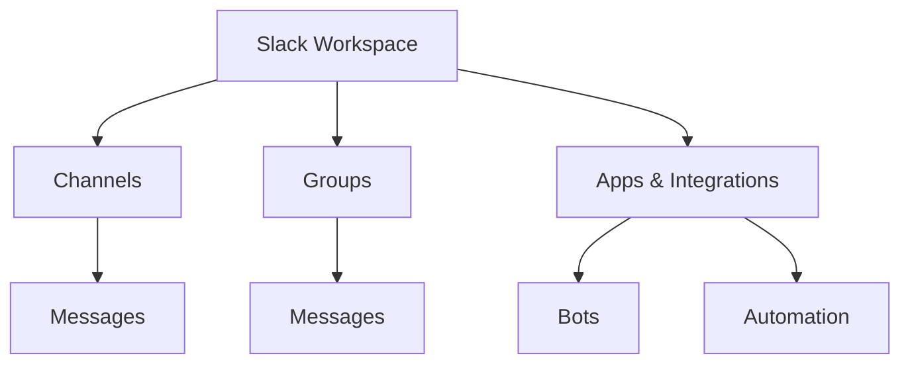
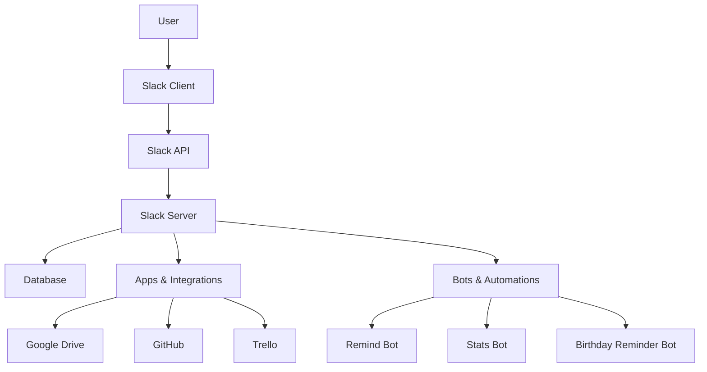

                 

# 如何利用Slack构建高效的远程办公环境

> **关键词：** Slack、远程办公、协作工具、团队沟通、工作流优化、效率提升、技术整合

> **摘要：** 在当今全球化的工作环境中，远程办公已经成为一种常态。如何充分利用协作工具如Slack，提高远程团队的工作效率和沟通质量，是现代企业面临的重大挑战。本文将详细介绍如何利用Slack构建一个高效的远程办公环境，包括核心概念、算法原理、实战案例以及未来发展趋势。

## 1. 背景介绍

### 1.1 目的和范围

本文的目标是帮助读者深入了解如何利用Slack这一强大的协作工具，打造一个高效的远程办公环境。我们将探讨Slack的核心功能，解释其工作原理，并通过实际案例展示如何使用它优化工作流程。本文适用于那些希望提升团队协作效率和沟通质量的IT专业人士、项目经理以及远程团队领导者。

### 1.2 预期读者

本文预期读者包括：

- 对远程办公有深入理解的专业人士。
- 熟悉Slack但不熟悉其高级功能的用户。
- 希望提升团队工作效率的IT经理和项目经理。
- 想要构建高效远程办公环境的企业领导者和HR专家。

### 1.3 文档结构概述

本文将按以下结构进行：

- **第1章**：背景介绍，阐述目的和预期读者。
- **第2章**：核心概念与联系，介绍Slack的基础架构和功能。
- **第3章**：核心算法原理 & 具体操作步骤，详细讲解如何利用Slack。
- **第4章**：数学模型和公式 & 详细讲解 & 举例说明。
- **第5章**：项目实战：代码实际案例和详细解释说明。
- **第6章**：实际应用场景，探讨在不同环境下的使用策略。
- **第7章**：工具和资源推荐，介绍相关资源和工具。
- **第8章**：总结：未来发展趋势与挑战。
- **第9章**：附录：常见问题与解答。
- **第10章**：扩展阅读 & 参考资料。

### 1.4 术语表

在本文中，我们将使用以下术语：

- **Slack**：一种团队协作工具，提供即时消息、文件共享、集成第三方服务等功能。
- **远程办公**：指团队成员在不同地点通过网络进行工作。
- **工作流**：工作过程中的任务分配、执行、监控和协调。
- **效率提升**：通过优化工具和流程，提高工作完成的效率和速度。

#### 1.4.1 核心术语定义

- **Slack Workspace**：一个Slack团队的环境，包含多个渠道（Channels）、群组和私人对话。
- **渠道（Channels）**：用于团队内特定主题的公开对话区域。
- **群组（Groups）**：用于小范围人员讨论的私人对话区域。
- **集成服务**：将Slack与其他第三方应用程序和服务连接起来，以提供更多功能。

#### 1.4.2 相关概念解释

- **异步通信**：用户可以不必实时在线进行交流，而是在方便的时候查看和回复消息。
- **通知和提醒**：通过电子邮件、短信或桌面通知，提醒用户有关重要消息或事件。
- **自动化**：使用机器人（Bots）和自动化工作流，减少手动操作，提高效率。

#### 1.4.3 缩略词列表

- **API**：应用程序编程接口
- **SDK**：软件开发工具包
- **UI**：用户界面
- **UX**：用户体验

## 2. 核心概念与联系

### 2.1 Slack基础架构

为了理解如何利用Slack构建高效的远程办公环境，我们需要先了解其基础架构和功能。以下是一个简化的Mermaid流程图，展示了Slack的核心组成部分：



#### 2.2 Slack的功能

- **Channels**：用于公开讨论，可以创建特定项目的、团队的或主题的渠道。
- **Groups**：用于私人讨论，适用于小团队或需要保密的对话。
- **Apps & Integrations**：Slack与多种第三方服务（如Google Drive、GitHub、Trello等）集成，提供额外的功能。
- **Bots**：自动化机器人，可以执行各种任务，如提醒、统计、提醒生日等。
- **Automation**：使用工作流，自动化重复性任务，提高效率。

### 2.3 Slack工作原理

Slack的工作原理可以分为以下几个步骤：

1. **用户登录**：团队成员使用邮箱或Slack账号登录。
2. **消息发送**：用户可以在Channels或Groups中发送消息。
3. **消息处理**：Slack服务器处理消息，并将其发送到对应的地方。
4. **消息展示**：用户在客户端查看消息。
5. **集成服务调用**：如果消息包含特定命令，如`/remind`，Slack将调用相应的机器人或自动化服务。

### 2.4 Slack架构图

下面是一个更详细的Mermaid流程图，展示了Slack的架构：



此图展示了用户如何通过Slack客户端与Slack服务器交互，服务器如何调用数据库、集成服务以及自动化机器人。

## 3. 核心算法原理 & 具体操作步骤

### 3.1 算法原理

Slack的核心算法主要涉及消息处理和自动化工作流。以下是关键步骤的伪代码：

```pseudo
function processMessage(message):
    if message.type == "text":
        if message contains "/command":
            executeCommand(message)
        else:
            storeMessage(message)
    else:
        handleNonTextMessage(message)

function executeCommand(message):
    command = extractCommandFromMessage(message)
    switch command:
        case "remind":
            callRemindBot(message)
        case "stats":
            callStatsBot(message)
        case "birthday":
            callBirthdayReminderBot(message)

function callBot(botName, message):
    botResponse = botName.respond(message)
    sendMessage(botResponse)

function storeMessage(message):
    storeMessageInDatabase(message)

function handleNonTextMessage(message):
    if message contains attachment:
        processAttachment(message)
    else:
        rejectMessage(message)

function processAttachment(message):
    attachmentType = getAttachmentType(message)
    switch attachmentType:
        case "image":
            uploadImageToStorage(message)
        case "file":
            uploadFileToStorage(message)
        case "video":
            uploadVideoToStorage(message)
```

### 3.2 具体操作步骤

以下是利用Slack构建高效远程办公环境的详细操作步骤：

1. **创建Slack Workspace**：注册Slack账号并创建一个新的Workspace。
2. **设置Channels**：创建不同项目的Channels，并将团队成员添加到相应的Channels中。
3. **添加Groups**：对于需要保密或小范围讨论的内容，创建Groups。
4. **集成第三方服务**：将Slack与Google Drive、GitHub、Trello等集成，以实现文件共享、代码审查和任务跟踪。
5. **配置Bots**：添加Remind Bot、Stats Bot、Birthday Reminder Bot等，以自动化常见任务。
6. **创建工作流**：使用Slack的工作流功能，自动执行重复性任务，如自动分配任务、发送提醒等。
7. **培训团队成员**：确保所有团队成员了解如何使用Slack，包括发送消息、使用命令、使用Bots和自动化工作流等。
8. **监控和优化**：定期监控团队的使用情况，收集反馈，并根据需要调整工作流和工具配置。

通过上述步骤，可以充分利用Slack的功能，构建一个高效的远程办公环境。

## 4. 数学模型和公式 & 详细讲解 & 举例说明

### 4.1 数学模型

在Slack构建高效的远程办公环境时，我们可以使用数学模型来优化工作流和沟通效率。以下是一个简单的数学模型，用于评估团队的工作效率：

$$
\text{效率} = \frac{\text{完成任务所需时间}}{\text{工作负荷}}
$$

#### 4.2 公式详细讲解

- **完成任务所需时间**：通过测量团队完成特定任务所需的时间来计算。
- **工作负荷**：指团队在特定时间段内处理的任务量。

#### 4.3 举例说明

假设一个团队在一个月内完成了10个任务，总耗时为20天，那么团队的工作效率为：

$$
\text{效率} = \frac{20 \text{天}}{10 \text{个任务}} = 2 \text{天/任务}
$$

### 4.4 模型优化

为了提高效率，我们可以使用以下策略：

1. **任务分配**：根据团队成员的能力和专长，合理分配任务。
2. **时间管理**：使用如番茄工作法等时间管理技巧，提高工作效率。
3. **自动化**：使用Slack的Bots和自动化工作流，减少手动操作。
4. **反馈机制**：定期收集团队成员的反馈，根据反馈优化工作流程。

### 4.5 实际应用

假设一个远程团队在实施上述优化策略后，完成任务所需时间减少了30%，则新的工作效率为：

$$
\text{效率} = \frac{20 \text{天} \times 0.7}{10 \text{个任务}} = 1.4 \text{天/任务}
$$

通过优化，团队的工作效率显著提高，能够更快地完成任务。

## 5. 项目实战：代码实际案例和详细解释说明

### 5.1 开发环境搭建

在开始实际代码案例之前，我们需要搭建一个合适的开发环境。以下是所需的步骤：

1. **安装Node.js**：Node.js是一个用于服务器端和本地的JavaScript运行环境。在官方网站（https://nodejs.org/）下载并安装相应版本的Node.js。
2. **安装Slack API**：在Slack官方网站（https://api.slack.com/）注册一个应用，获取API密钥。
3. **安装相关库**：使用npm（Node Package Manager）安装必要的库，如`slack-sdk`和`express`。

```bash
npm install slack-sdk express
```

### 5.2 源代码详细实现和代码解读

下面是一个简单的Slack Bots示例，用于发送提醒消息。

```javascript
const { AppMtopicClient } = require('@slack/client');
const express = require('express');
const app = express();

// Slack API密钥
const token = 'your-slack-api-token';

// 创建Slack客户端
const client = new AppMtopicClient(token);

// 创建提醒机器人
const remindBot = {
    name: 'RemindBot',
    respond: function(message) {
        // 解析命令
        const command = message.text.split(' ')[0];
        const args = message.text.split(' ').slice(1);

        if (command === '/remind') {
            // 发送提醒
            const reminder = args.join(' ');
            client.chat.postMessage({
                channel: message.channel,
                text: `@${message.user} has set a reminder: ${reminder}`,
            });
        }
    },
};

// 设置Webhook
app.post('/remind', (req, res) => {
    // 调用提醒机器人
    remindBot.respond(req.body.event);

    // 返回响应
    res.status(200).send('Remind message sent.');
});

// 启动服务器
const PORT = process.env.PORT || 3000;
app.listen(PORT, () => {
    console.log(`Server listening on port ${PORT}`);
});
```

#### 5.2.1 代码解读

- **引入库**：首先引入`@slack/client`和`express`库。
- **配置Slack客户端**：使用API密钥创建Slack客户端。
- **创建提醒机器人**：定义一个名为`RemindBot`的机器人，其响应函数`respond`接收消息并解析命令。
- **设置Webhook**：使用Express创建一个Webhook，用于接收Slack的消息事件。
- **处理消息**：在`/remind`端点中，调用提醒机器人的`respond`函数，并返回响应。

### 5.3 代码解读与分析

#### 5.3.1 关键代码段

1. **创建Slack客户端**：
    ```javascript
    const client = new AppMtopicClient(token);
    ```

    使用API密钥创建Slack客户端，以便与Slack服务器通信。

2. **创建提醒机器人**：
    ```javascript
    const remindBot = {
        name: 'RemindBot',
        respond: function(message) {
            // ...
        },
    };
    ```

    定义一个名为`RemindBot`的机器人，并为其添加一个`respond`函数，用于处理消息。

3. **设置Webhook**：
    ```javascript
    app.post('/remind', (req, res) => {
        // ...
    });
    ```

    使用Express创建一个POST端点，用于接收Slack发送的消息，并调用机器人的`respond`函数。

4. **处理消息**：
    ```javascript
    remindBot.respond(req.body.event);
    ```

    调用机器人的`respond`函数，并根据消息内容执行相应的操作。

#### 5.3.2 代码分析

- **可靠性**：通过使用Slack API客户端，确保与Slack服务器的通信稳定可靠。
- **可扩展性**：机器人和Webhook设计简单，易于扩展和集成其他功能。
- **安全性**：使用API密钥保护应用程序，确保只有授权用户可以访问。

通过此代码示例，我们可以看到如何使用Slack构建一个简单的机器人，实现任务提醒功能。这只是一个起点，实际应用中可以根据需要添加更多功能和集成其他服务。

## 6. 实际应用场景

### 6.1 跨团队协作

Slack特别适合跨团队协作。以下是一个实际应用场景：

- **场景**：一个软件公司由多个部门组成，如开发、测试、设计和支持。各部门之间需要进行频繁的沟通和协作。
- **解决方案**：使用Slack创建多个频道，每个频道对应一个特定的项目或部门。例如，创建`#dev-team`、`#test-team`和`#support-team`。团队成员可以实时在相应的频道中交流，解决项目问题。
- **优势**：方便各部门之间的信息共享和协作，提高工作效率。

### 6.2 远程团队管理

远程团队管理是一个重要但具有挑战性的任务。以下是一个应用场景：

- **场景**：一家公司的大部分员工都在远程工作，需要确保团队成员之间的高效沟通和任务管理。
- **解决方案**：使用Slack的自动化工作流和机器人，如`RemindBot`和`StatsBot`，自动发送提醒和统计报告。同时，创建个人或小组的私人对话区域，确保关键信息不会被错过。
- **优势**：自动化工具和私人对话区域有助于提高团队管理和沟通效率。

### 6.3 会议安排

会议是远程工作中不可或缺的一部分。以下是一个应用场景：

- **场景**：团队需要定期召开会议，讨论项目进展和解决问题。
- **解决方案**：使用Slack的集成服务，如Google Calendar，自动安排和提醒会议时间。在Slack中创建一个专门用于会议的频道，如`#meetings`，所有与会议相关的信息都在该频道中更新。
- **优势**：简化会议安排流程，确保团队成员不会错过重要会议。

### 6.4 项目跟踪

项目跟踪是确保项目按计划进行的关键。以下是一个应用场景：

- **场景**：团队正在开发一个复杂的软件项目，需要实时跟踪任务状态和进度。
- **解决方案**：使用Slack集成Trello或Jira等任务管理工具。在每个任务对应的Slack频道中，更新任务状态和进度。
- **优势**：实时了解项目状态，及时调整计划和资源分配。

通过这些实际应用场景，我们可以看到Slack如何帮助团队在不同环境中实现高效远程办公。

## 7. 工具和资源推荐

### 7.1 学习资源推荐

为了更好地利用Slack构建高效的远程办公环境，以下是一些推荐的学习资源：

#### 7.1.1 书籍推荐

- **《Slack 实战：团队协作工具进阶指南》**：详细介绍了Slack的功能和最佳实践，适合初学者和中级用户。
- **《远程工作的艺术》**：探讨了远程工作的策略和技巧，包括如何利用协作工具提高效率。

#### 7.1.2 在线课程

- **Coursera上的《团队协作与沟通》**：提供了关于团队协作和沟通的基础知识，包括如何利用Slack等工具。
- **Udemy上的《Slack for Teams Mastery》**：深入介绍了Slack的高级功能和最佳实践，适合有一定基础的用户。

#### 7.1.3 技术博客和网站

- **Slack官方博客**：提供最新的产品更新和最佳实践。
- **Medium上的Slack相关文章**：许多专业人士分享关于如何利用Slack的经验和技巧。

### 7.2 开发工具框架推荐

为了开发和管理Slack应用程序，以下是一些推荐的开发工具和框架：

#### 7.2.1 IDE和编辑器

- **Visual Studio Code**：一个强大的开源编辑器，提供丰富的插件和功能，适用于Slack开发。
- **IntelliJ IDEA**：专为Java和JavaScript开发设计的IDE，支持Slack SDK。

#### 7.2.2 调试和性能分析工具

- **Postman**：用于API调用的测试工具，方便调试Slack API。
- **New Relic**：提供性能监控和调试功能，帮助优化Slack应用程序。

#### 7.2.3 相关框架和库

- **Slack SDK for JavaScript**：官方提供的JavaScript SDK，简化了与Slack API的交互。
- **Slack Web API Client**：用于Node.js的Slack Web API客户端，方便开发Slack应用程序。

### 7.3 相关论文著作推荐

为了深入了解Slack和远程办公，以下是一些推荐的论文和著作：

#### 7.3.1 经典论文

- **“The Future of Work: Attracting, Developing, and Keeping the Best People”**：探讨了远程工作和协作工具的未来趋势。
- **“Cognitive Surplus: Creativity and Generosity in a Connected Age”**：分析了互联网和协作工具如何改变人类的行为和价值观。

#### 7.3.2 最新研究成果

- **“The Rise of Remote Work and Its Impact on the Global Workforce”**：研究了远程工作在全球范围内的兴起及其对劳动力市场的影响。
- **“The Effects of Remote Work on Productivity and Well-being”**：探讨了远程工作对员工生产力和福祉的影响。

#### 7.3.3 应用案例分析

- **“How WeWork Uses Slack for Effective Collaboration”**：分析了一个大型企业如何利用Slack提高团队协作效率。
- **“Remote Work at GitHub: Lessons Learned”**：分享了GitHub如何通过Slack等工具实现高效远程工作。

通过这些资源，读者可以深入了解Slack和远程办公的最佳实践，进一步提高团队协作效率和沟通质量。

## 8. 总结：未来发展趋势与挑战

随着远程工作的普及，协作工具如Slack的重要性日益凸显。未来，Slack将继续在以下几个方面发展：

### 8.1 功能扩展

Slack将持续增加新的功能，以适应不断变化的工作需求。例如，更智能的Bots、更先进的工作流以及与更多第三方服务的集成。

### 8.2 人工智能集成

人工智能将在Slack中扮演更重要的角色，帮助用户更高效地处理任务。例如，通过自然语言处理（NLP）实现智能问答和任务分配。

### 8.3 安全性提升

随着远程办公的普及，数据安全成为关键问题。Slack将进一步加强数据加密和访问控制，确保用户数据的安全。

### 8.4 可访问性优化

Slack将致力于提高其产品的可访问性，确保所有团队成员，包括那些使用辅助技术的人，都能充分利用其功能。

### 8.5 跨平台支持

为了更好地满足全球用户的需求，Slack将继续扩展其跨平台支持，包括移动设备和各种操作系统。

然而，未来的挑战也值得关注：

### 8.6 沟通过载

随着功能的增加，团队成员可能会面临沟通过载的问题。Slack需要提供更好的工具来管理和筛选信息，以避免干扰。

### 8.7 数据隐私

数据隐私和安全是远程办公中的关键问题。Slack需要不断更新其安全策略，确保用户数据得到妥善保护。

### 8.8 文化适应

不同团队和企业可能有不同的文化和工作习惯。Slack需要灵活地适应这些差异，确保其工具能够在各种环境中有效运行。

通过不断改进和创新，Slack有望在未来继续引领远程办公协作工具的发展，帮助团队实现更高的工作效率和协作质量。

## 9. 附录：常见问题与解答

### 9.1 如何创建Slack Workspace？

在Slack官方网站（https://slack.com/）上注册账号，选择“Start a workspace”按钮，按照提示完成注册过程。注册成功后，你将创建一个Slack Workspace。

### 9.2 如何设置Slack集成服务？

进入Slack的集成管理页面（https://api.slack.com/apps），注册并创建一个新的应用。在应用设置中，你可以添加新的集成服务，如Google Drive、GitHub等。

### 9.3 如何使用Slack机器人？

创建一个Slack机器人很简单，只需在集成管理页面创建一个新的机器人，选择所需的集成服务，如Reddit、Twitter等。在机器人的设置页面，你可以配置其响应的命令和行为。

### 9.4 如何在Slack中设置工作流？

在Slack的集成管理页面，你可以创建新的工作流。选择“Flows”选项卡，然后点击“Create a flow”。在创建过程中，你可以配置触发条件、操作步骤和通知方式。

### 9.5 如何确保Slack数据安全？

Slack提供了多种安全功能，如数据加密、访问控制和多因素认证。在设置页面，你可以配置这些安全功能，确保数据安全。

### 9.6 如何备份Slack数据？

Slack提供了数据备份服务。在设置页面，你可以启用数据备份功能，定期备份Workspace的数据。此外，你也可以使用第三方备份工具进行手动备份。

## 10. 扩展阅读 & 参考资料

为了深入了解Slack和远程办公的最佳实践，以下是一些建议的扩展阅读和参考资料：

### 10.1 书籍推荐

- **《Slack工作法：打造团队的沟通力》**：详细介绍了如何利用Slack优化团队协作。
- **《远程工作的革命：打造高效、愉悦、可持续的远程办公环境》**：探讨了远程工作的各种挑战和解决方案。

### 10.2 在线课程

- **Coursera上的《远程工作与团队合作》**：提供了关于远程工作和团队协作的全面课程。
- **Udemy上的《Slack高效使用指南》**：深入讲解了Slack的各种功能和最佳实践。

### 10.3 技术博客和网站

- **Slack官方博客**：提供最新的产品更新和最佳实践。
- **Remote.co**：分享关于远程工作的最新资讯和成功案例。

### 10.4 相关论文和著作

- **“The Future of Work: Attracting, Developing, and Keeping the Best People”**：详细探讨了远程工作的未来趋势。
- **“Cognitive Surplus: Creativity and Generosity in a Connected Age”**：分析了协作工具对工作环境的影响。

### 10.5 开发文档和API参考

- **Slack API文档**：提供了详细的API参考和开发指南。
- **Node.js官方文档**：提供了Node.js的详细使用说明和最佳实践。

通过这些扩展阅读和参考资料，读者可以更深入地了解如何利用Slack构建高效的远程办公环境。

