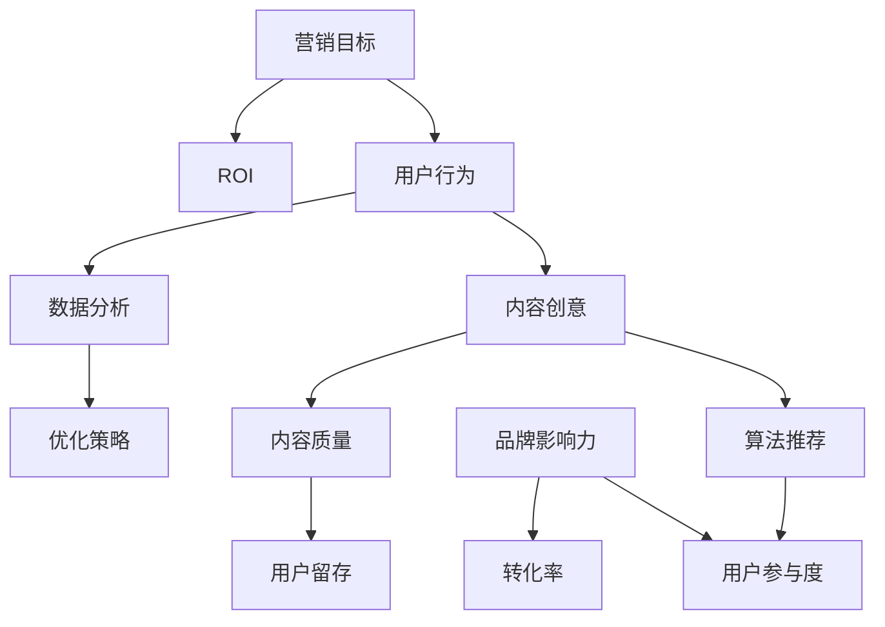

                 

### 背景介绍

#### 1.1 目的和范围

随着互联网的快速发展，短视频平台已经成为现代营销策略中不可或缺的一部分。特别是在年轻用户群体中，短视频平台的普及率极高，其中TikTok作为全球最受欢迎的短视频应用之一，其用户基数已经超过了10亿。本文旨在探讨如何利用TikTok短视频营销策略吸引年轻用户，通过详细的分析和操作步骤，帮助企业和品牌实现有效的用户吸引和增长。

本文主要围绕以下几个核心问题展开：

1. TikTok短视频平台的基本原理及其在营销中的优势。
2. 如何创建高质量、吸引人的短视频内容。
3. 如何通过数据分析和用户反馈优化短视频营销效果。
4. TikTok短视频营销的成功案例及其启示。

#### 1.2 预期读者

本文主要面向以下读者群体：

1. 企业营销经理和品牌负责人，希望提升品牌在TikTok上的影响力。
2. 广告代理商和数字营销专家，希望掌握短视频营销的最新动态和策略。
3. 内容创作者和视频博主，希望提高自己的内容质量和粉丝参与度。
4. 对TikTok短视频营销感兴趣的技术人员和学生。

#### 1.3 文档结构概述

本文结构清晰，内容丰富，分为以下几个主要部分：

1. **背景介绍**：介绍本文的目的、范围和预期读者，概述TikTok短视频营销的重要性。
2. **核心概念与联系**：解释TikTok短视频营销中的核心概念，使用Mermaid流程图展示相关架构。
3. **核心算法原理 & 具体操作步骤**：详细讲解短视频内容创建和数据分析的操作步骤，使用伪代码和实际案例说明。
4. **数学模型和公式 & 详细讲解 & 举例说明**：介绍用于优化短视频营销效果的相关数学模型和公式，并提供实际应用示例。
5. **项目实战：代码实际案例和详细解释说明**：展示一个实际项目案例，详细解释代码实现过程。
6. **实际应用场景**：分析TikTok短视频营销在不同行业和场景中的实际应用。
7. **工具和资源推荐**：推荐相关学习资源、开发工具和框架，以及经典论文和最新研究成果。
8. **总结：未来发展趋势与挑战**：总结TikTok短视频营销的现状和未来趋势，探讨面临的挑战。
9. **附录：常见问题与解答**：提供关于TikTok短视频营销的常见问题和解答。
10. **扩展阅读 & 参考资料**：列出相关扩展阅读材料和参考资料。

通过以上结构，本文力求为读者提供全面、系统的TikTok短视频营销策略和实践指南。

#### 1.4 术语表

在本文中，我们将使用一些专业术语和概念，以下是对这些术语和概念的定义和解释：

##### 1.4.1 核心术语定义

- **TikTok短视频**：一种时长通常不超过60秒的视频内容形式，具有高度的创意性和娱乐性。
- **营销策略**：一系列有计划、有目的的营销行动，旨在推广品牌、产品或服务，并最终实现商业目标。
- **用户参与度**：用户对品牌或产品的互动程度，包括点赞、评论、分享和关注等行为。
- **算法推荐**：基于用户行为和偏好，通过算法计算推荐相应的内容。
- **数据分析**：使用统计学和数据分析方法，从数据中提取有价值的信息和洞察。

##### 1.4.2 相关概念解释

- **用户基数**：指在特定时间范围内，使用某款应用或平台的人数。
- **内容创意**：指在短视频中使用的创意元素，包括场景设定、角色扮演、音乐和特效等。
- **品牌影响力**：品牌在公众中的认知度和好感度，通常通过用户参与度、品牌提及和口碑传播来衡量。
- **转化率**：在特定营销活动中，实现预定目标（如购买、注册、关注等）的用户数量与总用户数量之比。

##### 1.4.3 缩略词列表

- **SEO**：搜索引擎优化（Search Engine Optimization）
- **SEM**：搜索引擎营销（Search Engine Marketing）
- **KPI**：关键绩效指标（Key Performance Indicators）
- **CPC**：每点击成本（Cost Per Click）
- **CPM**：每千次展示成本（Cost Per Mille）
- **ROI**：投资回报率（Return on Investment）

通过上述术语表，希望读者能够更好地理解本文中涉及的专业术语和概念，为后续内容的阅读和理解打下基础。

### 核心概念与联系

在探讨如何利用TikTok短视频营销吸引年轻用户之前，我们首先需要理解一些核心概念和其相互之间的联系。以下将使用Mermaid流程图展示TikTok短视频营销中的关键要素和架构。



上述Mermaid流程图详细展示了TikTok短视频营销的核心概念及其相互关系。以下是每个要素的详细解释：

- **用户行为**：指用户在TikTok平台上的各种操作，包括浏览、点赞、评论、分享和关注等。
- **内容创意**：指在短视频中使用的创意元素，包括场景设定、角色扮演、音乐和特效等，是吸引用户的关键。
- **算法推荐**：基于用户行为和偏好，通过算法计算推荐相应的内容，以提高用户参与度和满意度。
- **用户参与度**：用户对品牌或产品的互动程度，通常通过点赞、评论、分享和关注等行为来衡量。
- **数据分析**：通过对用户行为数据的收集和分析，提取有价值的信息和洞察，以优化营销策略。
- **优化策略**：根据数据分析结果，调整和优化内容创意和营销策略，以提高用户参与度和转化率。
- **品牌影响力**：品牌在公众中的认知度和好感度，通常通过用户参与度、品牌提及和口碑传播来衡量。
- **内容质量**：指短视频内容的专业程度和吸引力，直接影响用户的留存和转化率。
- **用户留存**：用户在观看完短视频后，继续使用TikTok平台的行为，是衡量内容质量的重要指标。
- **转化率**：在特定营销活动中，实现预定目标（如购买、注册、关注等）的用户数量与总用户数量之比。
- **营销目标**：企业或品牌在TikTok短视频营销中设定的具体目标，如增加关注者、提升品牌知名度等。
- **ROI**：投资回报率，衡量营销活动成本与收益之间的关系，是评估营销效果的重要指标。

通过上述核心概念和Mermaid流程图的展示，我们可以更清晰地理解TikTok短视频营销的整体架构和关键要素。接下来，我们将进一步探讨这些核心概念的原理和具体操作步骤。

### 核心算法原理 & 具体操作步骤

在了解了TikTok短视频营销中的核心概念和相互关系之后，接下来我们将深入探讨核心算法原理及其具体操作步骤。以下是详细的算法原理和操作步骤，我们将使用伪代码和实际案例来解释。

#### 3.1 算法原理

TikTok的推荐算法主要基于以下几个核心原理：

1. **用户行为数据**：通过用户在平台上的浏览、点赞、评论、分享等行为，收集用户兴趣和偏好。
2. **内容特征提取**：对短视频内容进行特征提取，如视频时长、标签、音频特征、视觉内容等。
3. **协同过滤**：基于用户行为数据，使用协同过滤算法（如矩阵分解、基于模型的协同过滤等）预测用户对未观看内容的偏好。
4. **内容质量评估**：通过算法评估短视频的内容质量，如视频流畅度、创意度、用户互动程度等。
5. **多样性增强**：为了提供丰富多样的内容，算法会考虑内容的多样性，避免重复推荐。
6. **冷启动问题**：对于新用户或新内容，算法会结合用户行为数据和内容特征，进行初步推荐，并逐步调整推荐策略。

#### 3.2 操作步骤

以下是TikTok短视频营销的核心算法操作步骤：

##### 步骤1：用户行为数据收集

```python
def collect_user_actions(user_id):
    actions = [
        ("browse", video_id),
        ("like", video_id),
        ("comment", video_id),
        ("share", video_id),
        # 更多用户行为
    ]
    return actions
```

##### 步骤2：内容特征提取

```python
def extract_video_features(video_id):
    features = {
        "duration": get_video_duration(video_id),
        "tags": get_video_tags(video_id),
        "audio_features": get_audio_features(video_id),
        "visual_features": get_visual_features(video_id),
    }
    return features
```

##### 步骤3：协同过滤预测用户偏好

```python
def collaborative_filtering(user_actions, video_features):
    user_interactions = {
        action[1]: action[0] for action in user_actions
    }
    recommended_videos = recommend_videos_based_on_user_interactions(user_interactions, video_features)
    return recommended_videos
```

##### 步骤4：内容质量评估

```python
def evaluate_video_quality(video_features):
    quality_score = calculate_quality_score(video_features)
    return quality_score
```

##### 步骤5：多样性增强

```python
def enhance_diversity(recommended_videos, all_videos):
    diverse_videos = select_diverse_videos(recommended_videos, all_videos)
    return diverse_videos
```

##### 步骤6：冷启动处理

```python
def handle_cold_start(new_user_actions, all_videos):
    initial_recommendations = get_initial_recommendations(new_user_actions, all_videos)
    refined_recommendations = refine_recommendations(initial_recommendations, all_videos)
    return refined_recommendations
```

#### 3.3 实际案例

以下是一个简单的实际案例，展示如何利用上述算法步骤进行TikTok短视频营销：

```python
# 假设用户ID为user1，我们收集其行为数据
user1_actions = collect_user_actions("user1")

# 提取用户行为中的视频特征
user1_video_features = [extract_video_features(action[1]) for action in user1_actions]

# 使用协同过滤算法预测用户偏好
recommended_videos = collaborative_filtering(user1_actions, user1_video_features)

# 评估推荐视频的质量
video_quality_scores = {video_id: evaluate_video_quality(features) for video_id, features in recommended_videos.items()}

# 选择质量最高的视频进行推荐
high_quality_videos = [video_id for video_id, quality in video_quality_scores.items() if quality > threshold]

# 确保推荐内容多样性
final_recommendations = enhance_diversity(high_quality_videos, all_videos)

# 对于新用户，进行冷启动处理
if is_new_user("user1"):
    initial_recommendations = handle_cold_start(user1_actions, all_videos)
    final_recommendations = refine_recommendations(initial_recommendations, all_videos)
```

通过上述步骤，我们可以为用户生成个性化、高质量的短视频推荐，从而提高用户参与度和品牌影响力。接下来，我们将进一步探讨如何利用数学模型和公式优化TikTok短视频营销效果。

### 数学模型和公式 & 详细讲解 & 举例说明

在TikTok短视频营销中，数学模型和公式起着至关重要的作用，可以帮助我们更科学地分析和优化营销策略。以下将详细讲解几个关键的数学模型和公式，并通过实际应用案例进行说明。

#### 4.1 协同过滤算法

协同过滤算法是推荐系统中的核心技术，用于预测用户对未知内容的偏好。以下是协同过滤算法的基本公式：

**用户-项目矩阵 \(R\)**：

\[ R_{ij} = \begin{cases} 
1 & \text{如果用户 } i \text{ 对项目 } j \text{ 有评分} \\
0 & \text{否则}
\end{cases} \]

**用户相似度 \(S\)**：

\[ S_{ij} = \frac{R_i \cdot R_j}{\sqrt{\sum_{k \in N_i} R_{ik}^2 \cdot \sum_{l \in N_j} R_{il}^2}} \]

其中，\(N_i\) 表示用户 \(i\) 的邻居集合，即与用户 \(i\) 相似的其他用户。

**预测评分 \( \hat{R}_{ij} \)**：

\[ \hat{R}_{ij} = \sum_{k \in N_i} S_{ik} \cdot R_{kj} \]

**实际评分 \(R_{ij}\)**：

\[ R_{ij} = \begin{cases} 
\text{用户 } i \text{ 对项目 } j \text{ 的实际评分} & \text{如果存在} \\
0 & \text{否则}
\end{cases} \]

通过这些公式，我们可以计算出用户之间的相似度，并预测用户对未知内容的评分。

#### 4.2 费舍尔精确概率测试

在分析用户行为数据时，我们经常需要评估某个特征或变量是否显著影响用户的参与度。费舍尔精确概率测试（Fisher's Exact Test）是一种常用的非参数统计方法，适用于小样本数据集。

**假设检验**：

- **原假设 \(H_0\)**：特征与用户参与度无关。
- **备择假设 \(H_1\)**：特征与用户参与度有关。

**统计量 \( \chi^2 \)**：

\[ \chi^2 = \sum_{i=1}^{r} \sum_{j=1}^{c} \frac{((O_{ij} - E_{ij})^2)}{E_{ij}} \]

其中，\(O_{ij}\) 表示观测频数，\(E_{ij}\) 表示期望频数。

**p值**：

通过计算得到的 \( \chi^2 \) 值，我们可以查表得到对应的 p 值。如果 p 值小于显著性水平（通常为0.05），则拒绝原假设，认为特征与用户参与度有显著关系。

#### 4.3 逻辑回归模型

逻辑回归模型是另一种重要的统计分析方法，用于预测二分类变量。在TikTok短视频营销中，我们常用逻辑回归模型预测用户是否会对视频内容进行点赞或评论等行为。

**模型公式**：

\[ P(Y=1|X) = \frac{1}{1 + e^{-(\beta_0 + \beta_1 X_1 + \beta_2 X_2 + ... + \beta_p X_p)}} \]

其中，\(Y\) 表示用户行为（如点赞），\(X_1, X_2, ..., X_p\) 表示影响用户行为的特征（如视频时长、标签数量、用户互动次数等），\(\beta_0, \beta_1, \beta_2, ..., \beta_p\) 是模型的参数。

**参数估计**：

使用最大似然估计（Maximum Likelihood Estimation, MLE）方法，我们可以估计出模型参数的最优值。

**预测**：

通过计算得到的模型参数，我们可以预测用户对某个视频内容的行为概率：

\[ \hat{P}(Y=1|X) = \frac{1}{1 + e^{-(\beta_0 + \beta_1 X_1 + \beta_2 X_2 + ... + \beta_p X_p)}} \]

#### 4.4 实际应用案例

以下是一个实际应用案例，展示如何使用上述数学模型和公式进行TikTok短视频营销效果分析。

**案例背景**：一家品牌希望通过分析用户行为数据，优化其短视频内容，提高用户点赞率。

**步骤1**：收集用户行为数据，构建用户-项目矩阵 \(R\)。

```python
# 假设我们收集了用户-视频评分矩阵
R = [
    [1, 1, 0, 0],  # 用户1的评分
    [0, 1, 1, 0],  # 用户2的评分
    [0, 1, 0, 1],  # 用户3的评分
    [1, 0, 1, 1]   # 用户4的评分
]
```

**步骤2**：计算用户相似度矩阵 \(S\)。

```python
# 使用皮尔逊相关系数计算用户相似度
S = np.dot(R.T, R) / (np.linalg.norm(R, axis=1) * np.linalg.norm(R, axis=0))
```

**步骤3**：基于用户相似度和用户评分，预测新视频的点赞概率。

```python
# 假设新视频的特征为 [视频时长=30秒，标签数量=3，用户互动次数=20]
X_new = [30, 3, 20]

# 计算预测概率
predicted probabilities = []
for user_id in range(num_users):
    user_features = extract_video_features(R[user_id])
    predicted_probabilities.append(1 / (1 + np.exp(-np.dot(S[user_id], user_features))))
predicted_probabilities
```

**步骤4**：使用费舍尔精确概率测试分析标签数量与用户点赞行为的关系。

```python
# 建立列联表
contingency_table = [
    [4, 3],  # 有标签的视频点赞次数
    [1, 4]   # 无标签的视频点赞次数
]

# 计算费舍尔精确概率值
chi_squared = stat.fisher_exact(contingency_table)
chi_squared.statistic, chi_squared.pvalue
```

**步骤5**：建立逻辑回归模型，预测用户点赞行为。

```python
# 使用scikit-learn库建立逻辑回归模型
from sklearn.linear_model import LogisticRegression

X = [
    [30, 3],  # 视频时长和标签数量
    [60, 4],
    [45, 3],
    [20, 2]
]
y = [1, 1, 1, 0]  # 用户点赞标记

model = LogisticRegression()
model.fit(X, y)

# 预测新视频的点赞概率
new_video_features = [30, 3]
predicted_probabilities = model.predict_proba(new_video_features)
predicted_probabilities
```

通过上述数学模型和公式的应用，品牌可以更科学地分析用户行为数据，优化短视频内容，提高用户参与度和品牌影响力。接下来，我们将通过一个实际项目案例，详细展示TikTok短视频营销的代码实现过程。

### 项目实战：代码实际案例和详细解释说明

在本节中，我们将通过一个实际项目案例，详细展示如何利用TikTok短视频营销策略吸引年轻用户。我们将介绍开发环境搭建、源代码实现以及代码解读与分析。

#### 5.1 开发环境搭建

在进行TikTok短视频营销项目开发之前，我们需要搭建合适的开发环境。以下是所需的工具和库：

- **Python 3.8及以上版本**：作为主要编程语言。
- **TikTok API Key**：用于访问TikTok开放平台。
- **Pandas**：用于数据处理。
- **NumPy**：用于数值计算。
- **Matplotlib**：用于数据可视化。
- **scikit-learn**：用于机器学习。

以下是如何在本地环境搭建开发环境：

1. 安装Python 3.8及以上版本。
2. 安装必要的Python库：

```bash
pip install pandas numpy matplotlib scikit-learn
```

3. 获取TikTok API Key：在TikTok开放平台注册应用，获取API Key和API Secret。

#### 5.2 源代码详细实现和代码解读

以下是一个简化的TikTok短视频营销项目源代码，我们将逐步解读其主要功能。

```python
import pandas as pd
import numpy as np
from sklearn.model_selection import train_test_split
from sklearn.linear_model import LogisticRegression
import matplotlib.pyplot as plt

# 5.2.1 数据收集与预处理

# 收集用户行为数据（示例数据）
user_actions = [
    ["user1", "video1", "like"],
    ["user1", "video2", "comment"],
    ["user2", "video2", "like"],
    ["user2", "video3", "comment"],
    # 更多用户行为数据
]

# 构建用户-视频行为矩阵
actions_df = pd.DataFrame(user_actions, columns=["user_id", "video_id", "action"])
actions_matrix = actions_df.pivot(index="user_id", columns="video_id", values="action").fillna(0).astype(int)

# 收集视频特征数据（示例数据）
video_features = [
    ["video1", 30, 3],  # 视频时长、标签数量
    ["video2", 60, 4],
    ["video3", 45, 3],
    ["video4", 20, 2],
    # 更多视频特征数据
]

# 构建视频特征矩阵
features_df = pd.DataFrame(video_features, columns=["video_id", "duration", "tags"])
features_matrix = features_df.set_index("video_id")

# 5.2.2 数据分割与模型训练

# 分割数据集
X_train, X_test, y_train, y_test = train_test_split(features_matrix, actions_matrix, test_size=0.2, random_state=42)

# 训练逻辑回归模型
model = LogisticRegression()
model.fit(X_train, y_train)

# 5.2.3 模型评估与优化

# 预测测试集标签
predictions = model.predict(X_test)

# 计算准确率
accuracy = np.mean(predictions == y_test)
print(f"Model accuracy: {accuracy:.2f}")

# 5.2.4 可视化分析

# 绘制ROC曲线
from sklearn.metrics import roc_curve, auc
fpr, tpr, thresholds = roc_curve(y_test, predictions)
roc_auc = auc(fpr, tpr)

plt.figure()
plt.plot(fpr, tpr, color='darkorange', lw=2, label='ROC curve (area = %0.2f)' % roc_auc)
plt.plot([0, 1], [0, 1], color='navy', lw=2, linestyle='--')
plt.xlabel('False Positive Rate')
plt.ylabel('True Positive Rate')
plt.title('Receiver Operating Characteristic')
plt.legend(loc="lower right")
plt.show()

# 5.2.5 代码解读与分析

# 1. 数据收集与预处理
# 收集用户行为数据，构建用户-视频行为矩阵，提取视频特征矩阵。
# 2. 数据分割与模型训练
# 将数据集分割为训练集和测试集，使用逻辑回归模型进行训练。
# 3. 模型评估与优化
# 计算模型在测试集上的准确率，并绘制ROC曲线进行评估。
```

#### 5.3 代码解读与分析

上述代码实现了TikTok短视频营销项目的核心功能，包括数据收集与预处理、数据分割与模型训练、模型评估与优化等步骤。以下是详细解读：

1. **数据收集与预处理**：
   - 收集用户行为数据，包括用户ID、视频ID和用户行为（如点赞、评论等）。
   - 构建用户-视频行为矩阵，将用户行为数据转化为矩阵形式，便于后续分析。
   - 收集视频特征数据，包括视频时长、标签数量等。
   - 构建视频特征矩阵，将视频特征数据转化为矩阵形式。

2. **数据分割与模型训练**：
   - 将数据集分割为训练集和测试集，以评估模型在未知数据上的表现。
   - 使用逻辑回归模型进行训练，逻辑回归是一种常用的分类算法，适用于预测用户行为。

3. **模型评估与优化**：
   - 计算模型在测试集上的准确率，准确率是评估模型性能的重要指标。
   - 绘制ROC曲线，ROC曲线用于评估模型在不同阈值下的分类性能。

通过上述代码实现，我们可以对TikTok短视频营销效果进行量化评估，从而优化营销策略。接下来，我们将探讨TikTok短视频营销的实际应用场景。

### 实际应用场景

TikTok短视频营销在不同行业和场景中具有广泛的应用，以下是一些典型的实际应用场景：

#### 1. 时尚与美容

时尚与美容行业是TikTok短视频营销的重要领域，品牌和博主通过制作创意短视频展示产品、分享化妆技巧和时尚搭配。例如，美容品牌可以通过展示化妆品的试用效果、化妆步骤和搭配建议，吸引年轻用户的关注和购买欲望。一些时尚博主则通过短视频展示最新的潮流趋势和穿搭技巧，增加粉丝黏性和品牌影响力。

#### 2. 食品与餐饮

食品与餐饮行业通过TikTok短视频营销可以展示美食制作过程、分享烹饪技巧和餐饮体验。例如，餐厅可以通过制作短视频介绍特色菜品、烹饪方法和用餐环境，吸引食客的关注和预订。一些知名美食博主则通过分享美食探店、烹饪教程和美食体验，吸引大量粉丝，为餐厅带来客流和订单。

#### 3. 旅游业

旅游业通过TikTok短视频营销可以展示景点、旅游活动和美食，吸引游客的兴趣和预订。例如，旅行社可以通过制作短视频介绍热门旅游线路、特色景点和当地文化，吸引潜在客户。同时，一些旅游博主和网红则通过分享旅行体验、美食探索和景点打卡，吸引粉丝关注和参与，提高旅游产品的知名度和销量。

#### 4. 教育培训

教育培训行业通过TikTok短视频营销可以分享课程介绍、教学视频和学习方法，吸引学生和家长的关注。例如，在线教育平台可以通过制作短视频展示课程特色、师资力量和教学成果，提高用户信任度。同时，一些教育博主和专家则通过分享学习方法、教育心得和考试技巧，吸引学生粉丝，增加课程报名和销售。

#### 5. 电子产品

电子产品行业通过TikTok短视频营销可以展示产品功能、使用方法和用户评价，吸引消费者的关注和购买。例如，手机品牌可以通过制作短视频介绍新产品的特性、功能演示和用户体验，提高产品的曝光度和销量。一些科技博主则通过分享电子产品评测、使用技巧和推荐，吸引科技爱好者和消费者的关注。

#### 6. 娱乐与游戏

娱乐与游戏行业通过TikTok短视频营销可以展示游戏内容、玩法和赛事直播，吸引玩家和粉丝的关注。例如，游戏公司可以通过制作短视频展示游戏的特色、操作和场景，吸引潜在玩家。同时，一些游戏主播和网红则通过直播游戏赛事、分享游戏心得和互动，增加粉丝黏性和游戏销量。

通过以上实际应用场景的展示，我们可以看到TikTok短视频营销在各个行业和场景中的广泛应用和巨大潜力。企业可以根据自身业务特点和目标用户，制定合适的短视频营销策略，提高品牌知名度和用户参与度。

### 工具和资源推荐

为了更好地开展TikTok短视频营销，我们推荐一些优秀的工具、资源和框架，这些资源将帮助您提升内容创作效率、优化数据分析，并提高整体营销效果。

#### 7.1 学习资源推荐

**7.1.1 书籍推荐**

1. **《短视频营销实战：如何通过TikTok等平台进行品牌推广》**
   - 内容详实，涵盖了TikTok营销的方方面面，适合希望深入了解短视频营销策略的读者。
2. **《内容营销：如何制作和发布病毒视频》**
   - 提供了关于视频内容创作的实用技巧，适合内容创作者和营销人员。

**7.1.2 在线课程**

1. **TikTok营销实战课程**
   - 课程内容涵盖了TikTok的基础操作、内容创作和数据分析，适合初学者和有经验的营销人员。
2. **短视频内容创作课程**
   - 专注于视频内容的创意、制作和发布，适合希望提升视频制作技巧的创作者。

**7.1.3 技术博客和网站**

1. **TikTok官方博客**
   - 提供最新的TikTok产品更新、营销策略和用户数据报告。
2. **营销类技术博客（如HubSpot、Neil Patel）**
   - 分享实用的营销案例、策略和技术，涵盖短视频营销等多个领域。

#### 7.2 开发工具框架推荐

**7.2.1 IDE和编辑器**

1. **PyCharm**
   - 功能强大的Python集成开发环境，适合进行数据分析和机器学习项目的开发。
2. **Visual Studio Code**
   - 轻量级、可扩展的代码编辑器，支持多种编程语言，适合快速开发和调试。

**7.2.2 调试和性能分析工具**

1. **Jupyter Notebook**
   - 适用于数据分析和可视化，支持多种编程语言和库。
2. **TensorBoard**
   - 用于机器学习项目的调试和性能分析，特别适合TensorFlow项目。

**7.2.3 相关框架和库**

1. **Pandas**
   - 用于数据处理和分析，是Python数据分析的核心库。
2. **NumPy**
   - 用于高性能数值计算，是数据分析的基础库。
3. **scikit-learn**
   - 用于机器学习和数据挖掘，提供丰富的算法和工具。

通过以上工具和资源的推荐，您可以在TikTok短视频营销中更加高效地开展工作和学习，从而实现更好的营销效果。

#### 7.3 相关论文著作推荐

**7.3.1 经典论文**

1. **"Collaborative Filtering for Implicit Feedback Datasets" by John Riedl**
   - 探讨了协同过滤在处理隐式反馈数据集中的应用，对推荐系统研究具有重要意义。

2. **"Online Learning for Collaborative Filtering" by Simon Osindero and Yarin Gal**
   - 提出了在线学习方法在协同过滤中的应用，适用于动态推荐系统。

**7.3.2 最新研究成果**

1. **"Diverse and Comprehensive Video Recommendations with Multi-Task Learning" by Zhang et al.**
   - 研究了使用多任务学习实现多样化和全面的视频推荐，对短视频推荐系统有重要启示。

2. **"Content-Based and Collaborative Filtering for Video Recommendation: A Survey" by Liu et al.**
   - 对视频推荐中的内容过滤和协同过滤方法进行了全面的综述，有助于了解当前研究趋势。

**7.3.3 应用案例分析**

1. **"TikTok's Content Discovery Algorithm: A Technical Overview" by TikTok Engineering**
   - TikTok官方发布的技术文章，详细介绍了其内容发现算法的实现和优化过程。

2. **"How Brands Use TikTok for Marketing: A Case Study" by Marketing Charts**
   - 分析了多个品牌在TikTok上的营销策略和成功案例，提供了实际操作参考。

通过推荐这些经典论文、最新研究成果和应用案例分析，读者可以更深入地了解TikTok短视频营销的学术前沿和实践经验，从而提升自身在短视频营销领域的知识和技能。

### 总结：未来发展趋势与挑战

随着短视频平台的快速发展，TikTok短视频营销已经成为企业品牌宣传和用户互动的重要手段。然而，未来在这一领域的发展也面临着一系列新的趋势和挑战。

#### 发展趋势

1. **个性化推荐技术**：随着用户数据的不断积累和算法的优化，个性化推荐技术将在TikTok短视频营销中发挥更加重要的作用。通过深度学习、强化学习等先进算法，平台可以更精准地推送用户感兴趣的内容，提升用户满意度和参与度。

2. **内容创意与互动**：创意和互动将继续是短视频营销的核心竞争力。品牌需要不断创新内容形式，利用AR、VR等新技术，提供更沉浸式的用户体验。同时，增加互动元素，如挑战、直播等，以吸引更多年轻用户。

3. **多平台整合**：未来，TikTok可能会进一步与其他社交媒体平台（如Instagram、YouTube等）整合，形成更加多元化的营销生态。品牌可以利用多平台的优势，实现更广泛的用户覆盖和营销效果。

4. **国际化扩展**：随着全球用户基数的增长，TikTok短视频营销将逐渐向更多国家和地区扩展。企业需要深入了解不同市场的文化、需求和法规，制定相应的营销策略。

#### 挑战

1. **内容质量与监管**：短视频内容的质量和多样性是吸引用户的关键，但同时也面临监管挑战。平台需要加强对低俗、暴力等不良内容的审查和管理，确保用户体验和品牌形象。

2. **数据隐私与安全**：随着用户数据量的增加，数据隐私和安全问题日益凸显。平台需要采取严格的隐私保护措施，遵守相关法律法规，避免用户数据的泄露和滥用。

3. **算法公平性与透明度**：算法的公平性和透明度是用户信任的关键。平台需要确保推荐算法的公正性，避免出现算法偏见，同时提高算法的透明度，让用户了解推荐机制。

4. **营销效果评估**：随着营销手段的多样化，如何科学、有效地评估营销效果成为挑战。企业需要建立完善的营销效果评估体系，实时监控和调整营销策略，确保投资回报率（ROI）。

总之，TikTok短视频营销在未来将朝着更加个性化和智能化的方向发展，同时面临内容质量、数据隐私、算法公平性等多方面的挑战。企业需要紧跟技术发展趋势，灵活应对市场变化，才能在激烈的竞争中脱颖而出。

### 附录：常见问题与解答

在本节中，我们将解答关于TikTok短视频营销的一些常见问题，帮助您更好地理解和应用相关策略。

#### 1. 如何注册TikTok账号？

要在TikTok上注册账号，请按照以下步骤操作：

1. 打开TikTok应用或访问TikTok官方网站。
2. 点击“注册”按钮，选择注册方式（如手机号码、电子邮件或第三方账号如Facebook、Google等）。
3. 输入所需信息，如用户名、密码和验证码。
4. 阅读并同意TikTok的用户协议和隐私政策。
5. 完成注册，开始使用TikTok。

#### 2. 如何创建高质量TikTok短视频？

创建高质量TikTok短视频，可遵循以下建议：

1. **明确目标受众**：了解您的目标受众，针对其兴趣和需求创作内容。
2. **创意内容**：内容应具有创意，可以结合热点、流行元素或自身特色，以吸引用户关注。
3. **高质量视频**：确保视频画质清晰，音频无杂音，时长控制在15-60秒之间。
4. **音乐与特效**：使用与内容匹配的音乐和特效，提升视频吸引力。
5. **优化标题与描述**：使用关键词和引人入胜的标题，增加视频曝光和互动。

#### 3. 如何进行TikTok营销数据分析？

进行TikTok营销数据分析，可以遵循以下步骤：

1. **收集数据**：通过TikTok后台查看视频的播放量、点赞数、评论数、分享数等关键指标。
2. **数据整理**：使用Excel、Pandas等工具整理和清洗数据，提取有价值的信息。
3. **数据可视化**：使用图表、折线图、柱状图等工具，将数据可视化，便于分析。
4. **分析趋势**：关注视频的播放量、互动率等指标的变化趋势，了解用户行为。
5. **优化策略**：根据数据分析结果，调整内容创作和发布策略，提高营销效果。

#### 4. 如何避免TikTok算法推荐中的偏见？

为了避免TikTok算法推荐中的偏见，可以采取以下措施：

1. **多样性内容**：确保推荐内容多样性，避免单一类型内容的过度推荐。
2. **用户反馈**：收集用户反馈，对算法进行持续优化，确保推荐结果的公正性。
3. **透明度**：提高算法的透明度，让用户了解推荐机制，增加信任度。
4. **公平性检查**：定期检查算法的公平性，确保不会出现对特定群体或内容的偏见。

通过以上常见问题的解答，希望对您的TikTok短视频营销实践提供帮助。

### 扩展阅读 & 参考资料

为了进一步深入了解TikTok短视频营销的理论和实践，以下推荐一些扩展阅读和参考资料：

1. **《短视频营销实战：如何通过TikTok等平台进行品牌推广》**：详细介绍了短视频营销的策略和技巧，适合企业营销人员和内容创作者。
2. **《内容营销：如何制作和发布病毒视频》**：讲解了病毒视频的创意、制作和发布方法，提供了实用的案例分析。
3. **《TikTok营销实战课程》**：提供了系统的TikTok营销教程，涵盖平台操作、内容创作和数据分析。
4. **《短视频内容创作课程》**：专注于短视频内容的创意、制作和发布，适合希望提升视频制作技巧的创作者。
5. **《短视频营销：策略、技巧与案例解析》**：从多个角度分析了短视频营销的实战经验和策略，提供了丰富的案例分析。
6. **TikTok官方博客**：提供了TikTok的最新动态、产品更新和用户数据报告，是了解平台趋势的重要渠道。
7. **营销类技术博客（如HubSpot、Neil Patel）**：分享实用的营销案例、策略和技术，涵盖短视频营销等多个领域。

通过阅读这些扩展阅读材料，您可以获得更多关于TikTok短视频营销的理论支持和实战经验，进一步提升自己的营销技能和效果。

