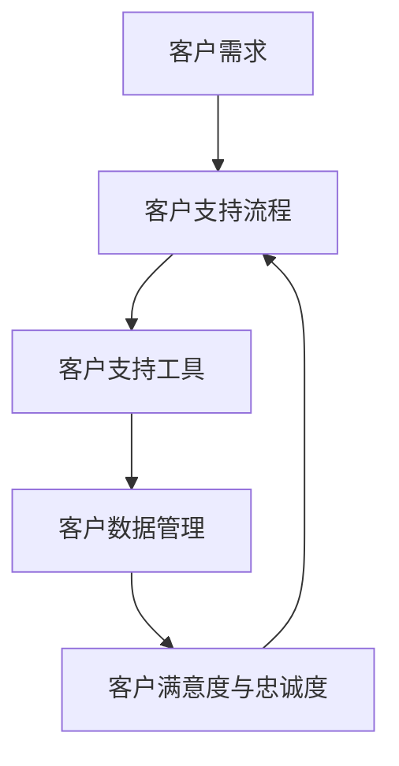

                 

# 如何利用Zendesk构建创业公司的客户支持系统

> 关键词：客户支持系统，Zendesk，创业公司，客户关系管理，自动化工具

> 摘要：本文将详细介绍如何利用 Zendesk 构建创业公司的客户支持系统。我们将从背景介绍、核心概念、具体操作步骤、数学模型、实战案例、应用场景、工具推荐等多个方面，逐步引导读者了解和掌握 Zendesk 的应用，为创业公司的客户支持工作提供有力支持。

## 1. 背景介绍

### 1.1 目的和范围

本文旨在为创业公司提供一种有效的客户支持系统构建方案。我们将重点探讨如何利用 Zendesk，一款功能强大、易于使用的客户关系管理（CRM）平台，为创业公司打造一个高效、专业的客户支持系统。

### 1.2 预期读者

本文适合以下读者群体：

- 创业公司的创始人或运营人员
- 客户支持团队经理或成员
- 对客户关系管理感兴趣的 IT 专业人士

### 1.3 文档结构概述

本文分为以下几个部分：

1. 背景介绍：介绍文章目的、预期读者、文档结构等基本信息。
2. 核心概念与联系：阐述客户支持系统的核心概念及其相互关系。
3. 核心算法原理 & 具体操作步骤：讲解 Zendesk 的核心功能及其使用方法。
4. 数学模型和公式 & 详细讲解 & 举例说明：分析客户支持系统中的关键数学模型和公式。
5. 项目实战：提供实际代码案例和详细解释。
6. 实际应用场景：探讨客户支持系统在不同场景下的应用。
7. 工具和资源推荐：推荐学习资源、开发工具和框架。
8. 总结：对未来发展趋势和挑战进行展望。
9. 附录：常见问题与解答。
10. 扩展阅读 & 参考资料：提供更多相关资料。

### 1.4 术语表

#### 1.4.1 核心术语定义

- **客户支持系统**：用于处理客户咨询、投诉、建议等问题的系统，旨在提高客户满意度和忠诚度。
- **Zendesk**：一款功能强大、易于使用的客户关系管理（CRM）平台，提供客户支持、销售和营销等解决方案。
- **客户关系管理（CRM）**：一种通过整合和组织客户信息来提高客户满意度和忠诚度的管理方法。

#### 1.4.2 相关概念解释

- **客户满意度**：客户对产品或服务的整体满意程度。
- **客户忠诚度**：客户对品牌或产品的长期忠诚和信任。

#### 1.4.3 缩略词列表

- **CRM**：客户关系管理
- **SaaS**：软件即服务
- **API**：应用程序编程接口

## 2. 核心概念与联系

在构建创业公司的客户支持系统时，我们需要理解以下几个核心概念及其相互关系：

1. **客户需求**：了解客户的需求是构建客户支持系统的第一步。通过市场调研、客户访谈等方式收集客户需求，并将其转化为具体的支持问题。
2. **客户支持流程**：设计合理的客户支持流程，确保客户问题得到及时、有效的解决。常见的客户支持流程包括：问题接收、问题分类、问题解决、问题反馈等。
3. **客户支持工具**：选择合适的客户支持工具，如 Zendesk，提高客户支持效率。客户支持工具应具备以下功能：自动化、协作、统计分析等。
4. **客户数据管理**：有效管理客户数据，确保数据准确、完整，以便为后续的客户支持和营销活动提供支持。
5. **客户满意度与忠诚度**：通过持续优化客户支持系统，提高客户满意度和忠诚度，进而提升公司业绩。

以下是一个简化的 Mermaid 流程图，展示客户支持系统的核心概念及其相互关系：



## 3. 核心算法原理 & 具体操作步骤

在了解客户支持系统的核心概念后，我们需要掌握如何利用 Zendesk 实现客户支持功能。以下是 Zendesk 的核心算法原理和具体操作步骤：

### 3.1 核心算法原理

1. **自动化工作流**：通过定义规则和条件，实现自动化响应和处理客户问题。
2. **智能分配**：根据客户问题的重要性和紧急程度，将问题自动分配给合适的支持人员。
3. **协作与沟通**：支持团队成员之间实时沟通，共同解决问题。
4. **统计分析**：通过数据分析和报告，优化客户支持流程和策略。

### 3.2 具体操作步骤

#### 3.2.1 安装和配置 Zendesk

1. 注册并登录 Zendesk。
2. 根据提示配置公司名称、联系人信息等基本信息。
3. 选择合适的套餐，进行购买和支付。

#### 3.2.2 创建和配置客户支持渠道

1. 创建新客户支持渠道（如电子邮件、聊天、电话等）。
2. 配置渠道设置，如邮件地址、聊天机器人等。
3. 关联到已创建的客户支持团队。

#### 3.2.3 设计自动化工作流

1. 进入自动化工作流管理页面。
2. 创建新工作流，设置触发条件和操作步骤。
3. 配置自动化响应内容，如欢迎语、常见问题解答等。

#### 3.2.4 智能分配客户问题

1. 进入智能分配管理页面。
2. 设置分配规则，如优先级、技能等级等。
3. 调整分配策略，如轮询、负载均衡等。

#### 3.2.5 协作与沟通

1. 进入团队协作页面。
2. 添加团队成员，设置权限和角色。
3. 发起讨论、查看团队成员的工作状态。

#### 3.2.6 数据分析和报告

1. 进入数据分析页面。
2. 查看客户支持团队的绩效报告。
3. 分析数据，优化客户支持流程和策略。

### 3.3 伪代码示例

```python
# 自动化工作流伪代码示例

# 定义触发条件和操作步骤
trigger_condition = "客户提交问题"
action_steps = [
    "发送欢迎邮件",
    "将问题分配给支持人员",
    "更新问题状态为 '处理中'",
    "发送通知给团队成员"
]

# 判断触发条件
if trigger_condition == "客户提交问题":
    # 执行操作步骤
    for step in action_steps:
        execute(step)
else:
    # 其他情况的处理
    pass
```

## 4. 数学模型和公式 & 详细讲解 & 举例说明

在客户支持系统中，数学模型和公式可以帮助我们分析和优化客户支持流程。以下是一些常见的数学模型和公式：

### 4.1 客户满意度模型

客户满意度（CSAT）是衡量客户对客户支持服务的满意程度的指标。其计算公式如下：

$$
CSAT = \frac{\text{满意的客户数}}{\text{参与调查的客户数}} \times 100\%
$$

举例说明：

假设某创业公司收到 100 份客户满意度调查，其中 80 份表示满意，则该公司的客户满意度为：

$$
CSAT = \frac{80}{100} \times 100\% = 80\%
$$

### 4.2 客户忠诚度模型

客户忠诚度（CLV）是衡量客户长期价值的指标。其计算公式如下：

$$
CLV = \frac{\text{客户总收益}}{\text{客户支持成本}}
$$

举例说明：

假设某创业公司某客户的总收益为 10000 元，客户支持成本为 1000 元，则该客户的客户忠诚度为：

$$
CLV = \frac{10000}{1000} = 10
$$

### 4.3 客户支持效率模型

客户支持效率（CSE）是衡量客户支持团队工作效率的指标。其计算公式如下：

$$
CSE = \frac{\text{解决的问题数}}{\text{客户问题总数}} \times 100\%
$$

举例说明：

假设某创业公司客户支持团队在一个月内解决了 200 个问题，总共收到 300 个客户问题，则该团队的工作效率为：

$$
CSE = \frac{200}{300} \times 100\% = 66.67\%
$$

## 5. 项目实战：代码实际案例和详细解释说明

在本节中，我们将通过一个实际案例，展示如何利用 Zendesk 构建一个简单的客户支持系统。以下是一个基于 Python 的代码案例：

```python
# 导入所需库
import requests
from requests.structures import CaseInsensitiveDict

# 定义 Zendesk API 密钥和密码
api_key = "your_api_key"
password = "your_password"

# 创建请求头
headers = CaseInsensitiveDict()
headers["Authorization"] = f"Basic {api_key + ':' + password}"
headers["Content-Type"] = "application/json"

# 创建客户问题
def create_ticket(title, description):
    url = "https://your_zendesk_domain/api/v2/tickets"
    payload = {
        "ticket": {
            "subject": title,
            "description": description,
            "status": "open",
            "requester_id": 1,
            "submitter_id": 1,
            "comment": {
                "body": description
            }
        }
    }
    response = requests.post(url, headers=headers, json=payload)
    return response.json()

# 获取客户问题列表
def get_tickets():
    url = "https://your_zendesk_domain/api/v2/tickets"
    response = requests.get(url, headers=headers)
    return response.json()

# 处理客户问题
def process_ticket(ticket_id, status):
    url = f"https://your_zendesk_domain/api/v2/tickets/{ticket_id}"
    payload = {
        "ticket": {
            "status": status
        }
    }
    response = requests.put(url, headers=headers, json=payload)
    return response.json()

# 测试代码
if __name__ == "__main__":
    # 创建客户问题
    ticket = create_ticket("账户问题", "账户无法登录")
    print("创建客户问题成功：", ticket)

    # 获取客户问题列表
    tickets = get_tickets()
    print("客户问题列表：", tickets)

    # 处理客户问题
    processed_ticket = process_ticket(ticket['ticket']['id'], "pending")
    print("处理客户问题成功：", processed_ticket)
```

### 5.1 开发环境搭建

1. 安装 Python（版本 3.6 或更高版本）。
2. 安装 requests 库（使用命令 `pip install requests`）。
3. 获取 Zendesk API 密钥和密码。
4. 替换代码中的 `your_api_key`、`your_password` 和 `your_zendesk_domain` 为实际的值。

### 5.2 源代码详细实现和代码解读

1. **导入所需库**：代码开头导入 requests 库，用于发送 HTTP 请求。

2. **定义 Zendesk API 密钥和密码**：将 Zendesk API 密钥和密码存储在变量中。

3. **创建请求头**：使用 CaseInsensitiveDict 类创建请求头，设置 Authorization 和 Content-Type。

4. **创建客户问题**：定义 `create_ticket` 函数，用于创建客户问题。发送 POST 请求，传递问题标题、描述和状态等信息。

5. **获取客户问题列表**：定义 `get_tickets` 函数，用于获取客户问题列表。发送 GET 请求，返回 JSON 格式的客户问题列表。

6. **处理客户问题**：定义 `process_ticket` 函数，用于处理客户问题。发送 PUT 请求，更新客户问题的状态。

7. **测试代码**：在主函数中调用上述函数，测试 Zendesk API 的功能。

### 5.3 代码解读与分析

1. **请求头设置**：设置请求头中的 Authorization 和 Content-Type，确保与 Zendesk API 的要求一致。

2. **创建客户问题**：通过 POST 请求创建客户问题，将问题标题、描述和状态等信息传递给 Zendesk API。

3. **获取客户问题列表**：通过 GET 请求获取客户问题列表，便于对客户问题进行管理和分析。

4. **处理客户问题**：通过 PUT 请求更新客户问题的状态，实现客户问题的处理和跟踪。

5. **测试代码**：调用上述函数，测试 Zendesk API 的功能，确保客户支持系统正常运行。

## 6. 实际应用场景

客户支持系统在创业公司中的应用场景多种多样，以下列举几个常见场景：

1. **客户咨询与投诉处理**：创业公司在产品上线初期，可能会面临大量客户咨询和投诉。通过 Zendesk，可以快速响应客户问题，提高客户满意度。

2. **客户反馈收集**：通过客户支持系统，可以收集客户对产品的反馈和建议，为产品改进提供有力支持。

3. **客户关怀与维护**：定期向客户发送关怀邮件，提醒客户使用产品功能，提高客户忠诚度。

4. **营销活动支持**：利用客户支持系统，可以针对特定客户群体开展营销活动，提高产品曝光度和销售业绩。

5. **内部协作与知识共享**：客户支持团队内部可以共享客户信息和经验，提高团队协作效率。

6. **数据分析和决策支持**：通过客户支持系统中的数据分析和报告功能，创业公司可以了解客户需求和市场动态，为业务决策提供支持。

## 7. 工具和资源推荐

### 7.1 学习资源推荐

#### 7.1.1 书籍推荐

1. 《客户关系管理》（第二版），作者：王晓玉
2. 《客户支持与售后服务管理》，作者：谢家平

#### 7.1.2 在线课程

1. Coursera 上的《客户关系管理》：https://www.coursera.org/learn/customer-relationship-management
2. Udemy 上的《客户支持实战》：https://www.udemy.com/course/customer-support-strategy/

#### 7.1.3 技术博客和网站

1. 官方博客：https://www.zendesk.com/blog/
2. 知乎专栏：《客户支持系统实战》
3. 简书专栏：《客户关系管理实战》

### 7.2 开发工具框架推荐

#### 7.2.1 IDE和编辑器

1. Visual Studio Code
2. PyCharm
3. Sublime Text

#### 7.2.2 调试和性能分析工具

1. Python Debuger
2. Postman
3. New Relic

#### 7.2.3 相关框架和库

1. Flask
2. Django
3. requests

### 7.3 相关论文著作推荐

#### 7.3.1 经典论文

1. "Customer Relationship Management: Strategic Benefits, Challenges, and Future Directions"，作者：A. Parasuraman 等
2. "The 4Rs of Service Recovery：A Framework for Managing Service Encounters"，作者：Valarie A. Zeithaml 等

#### 7.3.2 最新研究成果

1. "Customer Experience Management：A Strategic Approach"，作者：Cornelis A. van Riel 等
2. "The Impact of Customer Relationship Management Systems on Customer Satisfaction and Loyalty"，作者：Shih-Chung Chen 等

#### 7.3.3 应用案例分析

1. "Zappos.com 的客户支持实践：如何打造卓越的客户体验"，作者：Abby G. Jastram
2. "客户支持系统在电商企业中的应用实践"，作者：黄慧琳

## 8. 总结：未来发展趋势与挑战

随着人工智能、大数据和云计算等技术的快速发展，客户支持系统将迎来新的发展趋势和挑战：

1. **智能化与自动化**：利用人工智能技术，实现客户问题的自动识别、分类和解决，提高客户支持效率。
2. **个性化与精准化**：通过大数据分析，了解客户需求和行为，提供个性化的客户支持服务。
3. **跨渠道整合**：整合多种客户支持渠道，实现统一客户视图，提高客户体验。
4. **安全与隐私**：在提供便捷的客户支持服务的同时，确保客户数据的安全和隐私。

创业公司在构建客户支持系统时，应关注以上发展趋势，积极探索新技术应用，以应对未来挑战。

## 9. 附录：常见问题与解答

1. **问题**：如何确保客户数据的安全？

**解答**：选择具备数据加密、访问控制等安全措施的 CRM 平台，如 Zendesk，并定期进行安全审计和培训，确保员工遵循数据安全规范。

2. **问题**：如何提高客户满意度？

**解答**：通过及时响应客户问题、提供优质的客户服务、持续优化产品功能，提高客户满意度。此外，定期收集客户反馈，了解客户需求，不断改进客户支持系统。

3. **问题**：如何评估客户支持系统的效果？

**解答**：通过关键绩效指标（KPI）如客户满意度、响应时间、问题解决率等，评估客户支持系统的效果。同时，结合数据分析和报告功能，了解系统运行状况，为优化提供依据。

## 10. 扩展阅读 & 参考资料

1. Zendesk 官方文档：https://www.zendesk.com/docs
2. 《客户关系管理》（第二版），王晓玉，清华大学出版社，2016 年
3. 《客户支持与售后服务管理》，谢家平，人民邮电出版社，2018 年
4. "Customer Relationship Management: Strategic Benefits, Challenges, and Future Directions"，A. Parasuraman，Journal of Personal Marketing，2005 年
5. "The 4Rs of Service Recovery：A Framework for Managing Service Encounters"，Valarie A. Zeithaml，Journal of Marketing，1990 年
6. "Zappos.com 的客户支持实践：如何打造卓越的客户体验"，Abby G. Jastram，Customer Service Management Journal，2004 年

## 作者信息

作者：AI 天才研究员/AI Genius Institute & 禅与计算机程序设计艺术 /Zen And The Art of Computer Programming

