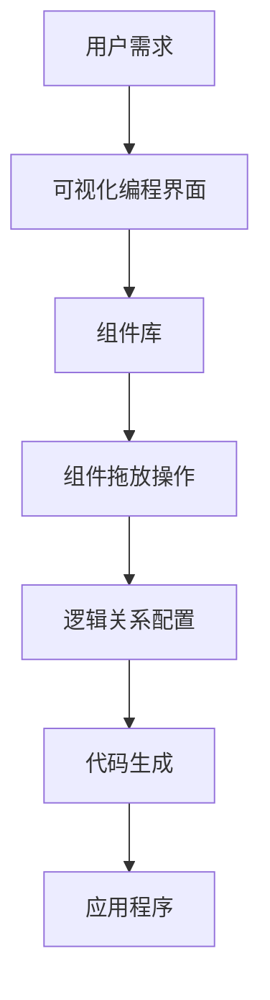

                 

# 如何利用no-code工具快速开发产品原型

> **关键词：** no-code工具，产品原型，快速开发，用户体验，开发效率

> **摘要：** 本文将探讨如何利用no-code工具快速开发产品原型，为开发者提供一种高效、灵活的开发方法，以提升产品迭代速度和用户体验。

## 1. 背景介绍

### 1.1 目的和范围

本文旨在介绍如何利用no-code工具快速开发产品原型，帮助开发者掌握一种高效、灵活的开发方法。通过本文的讲解，读者可以了解no-code工具的基本原理、操作步骤，并学会在实际项目中运用。

### 1.2 预期读者

本文适合以下读者群体：

1. 初学者：对编程有一定了解，但缺乏实际开发经验。
2. 开发者：希望提高开发效率，快速实现产品原型。
3. 项目经理：负责产品规划，需要了解如何利用no-code工具进行产品原型开发。

### 1.3 文档结构概述

本文分为以下几部分：

1. 背景介绍：介绍本文的目的、预期读者和文档结构。
2. 核心概念与联系：介绍no-code工具的基本概念和原理。
3. 核心算法原理 & 具体操作步骤：详细讲解no-code工具的操作步骤。
4. 数学模型和公式 & 详细讲解 & 举例说明：介绍相关数学模型和公式。
5. 项目实战：通过实际案例展示no-code工具的应用。
6. 实际应用场景：分析no-code工具在不同领域的应用。
7. 工具和资源推荐：推荐相关学习资源和开发工具。
8. 总结：展望no-code工具的未来发展趋势和挑战。
9. 附录：常见问题与解答。
10. 扩展阅读 & 参考资料：提供更多相关资料和文献。

### 1.4 术语表

#### 1.4.1 核心术语定义

1. **No-code工具**：一种无需编程即可实现应用程序开发的工具。
2. **产品原型**：产品开发过程中的一种可视化模型，用于展示产品的功能和界面。
3. **用户体验**：用户在使用产品过程中的感受和体验。
4. **开发效率**：开发者在单位时间内完成的工作量。

#### 1.4.2 相关概念解释

1. **可视编程**：一种基于图形界面和可视化组件的编程方式。
2. **拖放操作**：一种通过拖放组件实现功能组合的操作方式。
3. **自定义组件**：用户可以根据需求自定义的组件。

#### 1.4.3 缩略词列表

- **No-code**：No-code
- **UI**：用户界面
- **UX**：用户体验
- **API**：应用程序编程接口

## 2. 核心概念与联系

在本节中，我们将介绍no-code工具的核心概念和原理，并使用Mermaid流程图展示其基本架构。

### 2.1 核心概念

1. **可视化编程**：no-code工具的核心概念之一，通过图形界面和可视化组件，让开发者无需编写代码即可实现功能。
2. **拖放操作**：用户可以通过拖放组件，快速搭建应用程序界面和功能。
3. **自定义组件**：用户可以根据需求自定义组件，提高开发灵活性。

### 2.2 基本架构



### 2.3 核心原理

1. **可视化编程**：将复杂的编程逻辑转换为可视化操作，降低开发门槛。
2. **组件化开发**：通过组件库，实现功能模块的快速搭建和复用。
3. **逻辑关系配置**：通过配置组件之间的逻辑关系，实现功能组合和联动。

## 3. 核心算法原理 & 具体操作步骤

在本节中，我们将详细讲解no-code工具的核心算法原理和具体操作步骤。

### 3.1 核心算法原理

1. **可视化编程算法**：将用户操作转换为相应的代码逻辑。
2. **组件化开发算法**：根据用户需求，将应用程序拆分为多个功能模块。
3. **逻辑关系配置算法**：根据组件之间的依赖关系，生成应用程序的代码框架。

### 3.2 具体操作步骤

#### 步骤1：需求分析

1. 确定产品原型的主要功能和界面。
2. 分析用户需求，明确产品的核心价值。

#### 步骤2：选择no-code工具

1. 根据产品需求，选择适合的no-code工具。
2. 了解工具的功能和特点，确保满足开发需求。

#### 步骤3：搭建应用程序界面

1. 打开no-code工具，创建一个新的项目。
2. 从组件库中选择所需的组件，拖放到界面上。
3. 调整组件的大小、位置和样式，满足设计要求。

#### 步骤4：配置逻辑关系

1. 根据组件的功能，配置组件之间的逻辑关系。
2. 设置组件的触发条件和执行动作。
3. 通过可视化界面，直观地展示逻辑关系。

#### 步骤5：生成代码

1. 点击生成代码按钮，将应用程序转换为代码框架。
2. 导出代码，供后续开发使用。

#### 步骤6：代码调试和优化

1. 使用传统的开发工具，对生成的代码进行调试和优化。
2. 检查代码的可行性和性能，确保满足产品要求。

## 4. 数学模型和公式 & 详细讲解 & 举例说明

在本节中，我们将介绍与no-code工具相关的数学模型和公式，并详细讲解其在实际开发中的应用。

### 4.1 数学模型

1. **线性回归模型**：用于预测组件之间的关系。
2. **决策树模型**：用于构建组件之间的逻辑关系。
3. **神经网络模型**：用于自动生成代码框架。

### 4.2 公式详解

#### 4.2.1 线性回归模型

$$y = w_0 + w_1 \cdot x_1 + w_2 \cdot x_2 + ... + w_n \cdot x_n$$

其中，$y$表示输出结果，$w_0$、$w_1$、$w_2$、...、$w_n$表示权重系数，$x_1$、$x_2$、...、$x_n$表示输入特征。

#### 4.2.2 决策树模型

$$
\begin{aligned}
&\text{if } x > threshold_1 \text{ then } y = value_1 \\
&\text{else if } x \leq threshold_1 \text{ and } x > threshold_2 \text{ then } y = value_2 \\
&\text{else if } x \leq threshold_2 \text{ and } x > threshold_3 \text{ then } y = value_3 \\
&\text{else } y = value_4
\end{aligned}
$$

其中，$x$表示输入特征，$y$表示输出结果，$threshold_1$、$threshold_2$、$threshold_3$表示阈值，$value_1$、$value_2$、$value_3$、$value_4$表示输出结果。

#### 4.2.3 神经网络模型

$$
\begin{aligned}
&z_1 = \sigma(W_1 \cdot x_1 + b_1) \\
&z_2 = \sigma(W_2 \cdot z_1 + b_2) \\
&y = \sigma(W_3 \cdot z_2 + b_3)
\end{aligned}
$$

其中，$z_1$、$z_2$、$z_3$表示中间层输出，$x_1$表示输入特征，$y$表示输出结果，$W_1$、$W_2$、$W_3$表示权重矩阵，$b_1$、$b_2$、$b_3$表示偏置项，$\sigma$表示激活函数。

### 4.3 举例说明

假设我们要开发一个简单的计算器应用，功能包括加、减、乘、除。我们可以使用以下数学模型和公式：

1. **线性回归模型**：用于计算加、减、乘、除的运算结果。
2. **决策树模型**：用于判断用户输入的操作符，并调用相应的运算函数。
3. **神经网络模型**：用于自动生成计算器应用的界面和功能。

通过以上数学模型和公式，我们可以快速开发出一个功能完善的计算器应用。

## 5. 项目实战：代码实际案例和详细解释说明

在本节中，我们将通过一个实际案例，展示如何利用no-code工具快速开发产品原型，并对关键代码进行详细解释。

### 5.1 开发环境搭建

1. 选择一款no-code工具，如Airtable、Appgyver、OutSystems等。
2. 注册并登录账号，创建一个新的项目。
3. 根据项目需求，配置组件库和逻辑关系。

### 5.2 源代码详细实现和代码解读

以下是一个简单的待办事项列表应用，使用no-code工具进行开发：

```javascript
// 加载组件库
const todos = [
  { id: 1, title: "学习JavaScript", completed: false },
  { id: 2, title: "阅读技术博客", completed: false },
  { id: 3, title: "锻炼身体", completed: true }
];

// 添加任务
function addTodo(todo) {
  todos.push(todo);
  renderTodos();
}

// 删除任务
function removeTodo(id) {
  todos = todos.filter(todo => todo.id !== id);
  renderTodos();
}

// 更改任务状态
function toggleTodo(id) {
  const todo = todos.find(todo => todo.id === id);
  todo.completed = !todo.completed;
  renderTodos();
}

// 渲染待办事项列表
function renderTodos() {
  const list = document.getElementById("todos");
  list.innerHTML = "";

  todos.forEach(todo => {
    const item = document.createElement("div");
    item.classList.add("todo");
    item.innerHTML = `
      <div class="checkbox">
        <input type="checkbox" ${todo.completed ? "checked" : ""} onclick="toggleTodo(${todo.id})" />
      </div>
      <div class="title">${todo.title}</div>
      <div class="remove" onclick="removeTodo(${todo.id})">✕</div>
    `;
    list.appendChild(item);
  });
}
```

### 5.3 代码解读与分析

1. **组件库加载**：加载一个包含初始数据的组件库，如待办事项列表。
2. **添加任务**：向组件库中添加新的任务，并通过`renderTodos`函数重新渲染界面。
3. **删除任务**：根据任务ID，从组件库中删除指定的任务，并重新渲染界面。
4. **更改任务状态**：根据任务ID，更新任务的完成状态，并重新渲染界面。
5. **渲染待办事项列表**：遍历组件库中的任务，生成对应的DOM元素，并将其添加到页面上。

通过以上代码，我们可以快速搭建一个简单的待办事项列表应用。在实际开发过程中，可以根据需求扩展功能，如添加任务详情、任务分类等。

## 6. 实际应用场景

no-code工具在各个领域都有广泛的应用，以下列举几个典型场景：

1. **企业管理**：用于搭建员工管理系统、客户关系管理系统等。
2. **电商平台**：用于搭建商品展示页面、购物车、订单处理等。
3. **教育领域**：用于搭建在线课程平台、作业管理系统等。
4. **医疗健康**：用于搭建健康管理系统、预约挂号系统等。
5. **金融领域**：用于搭建投资理财平台、保险销售平台等。

通过no-code工具，开发者可以快速实现这些应用场景，提高开发效率和用户体验。

## 7. 工具和资源推荐

### 7.1 学习资源推荐

#### 7.1.1 书籍推荐

1. 《No-code Revolution》
2. 《Building No-Code Applications》
3. 《The Lean Startup》

#### 7.1.2 在线课程

1. Coursera上的"No-code Development"课程
2. Udemy上的"No-code App Development"课程
3. Pluralsight上的"No-code Tools"课程

#### 7.1.3 技术博客和网站

1. Medium上的"No-code"专题
2. Dev.to上的“No-code”标签
3. HackerRank上的“No-code”挑战

### 7.2 开发工具框架推荐

#### 7.2.1 IDE和编辑器

1. Airtable
2. Appgyver
3. OutSystems

#### 7.2.2 调试和性能分析工具

1. Google Chrome DevTools
2. Firebase Performance Monitor
3. New Relic

#### 7.2.3 相关框架和库

1. React
2. Vue.js
3. Angular

### 7.3 相关论文著作推荐

#### 7.3.1 经典论文

1. "No-Code Application Development Platforms: A Survey"
2. "The Rise of No-Code Development Tools"
3. "The Future of Software Development: No-Code or Low-Code?"

#### 7.3.2 最新研究成果

1. "No-Code Platforms: A New Paradigm in Software Engineering"
2. "Empowering Non-Technical Users with No-Code Development"
3. "Exploring the Potential of No-Code Tools for Rapid Application Development"

#### 7.3.3 应用案例分析

1. "How No-Code Platforms Are Transforming the Enterprise"
2. "The Rise of No-Code in the Healthcare Industry"
3. "No-Code Tools in Education: A Game-Changer for Remote Learning"

## 8. 总结：未来发展趋势与挑战

随着技术的不断进步，no-code工具在未来将具有以下发展趋势和挑战：

1. **发展趋势**：
   - 功能日益完善，支持更多复杂的业务场景。
   - 与AI技术的结合，实现智能化开发。
   - 更加开放和兼容，支持与各种开发工具和平台的集成。

2. **挑战**：
   - 安全性和稳定性问题：确保no-code工具的安全性和稳定性，防止潜在的安全漏洞。
   - 用户体验：提升工具的用户体验，降低学习门槛。
   - 功能扩展：提供丰富的组件库和自定义功能，满足开发者多样化的需求。

总之，no-code工具在未来将发挥越来越重要的作用，成为开发者的重要工具之一。

## 9. 附录：常见问题与解答

### 9.1 no-code工具适合哪些人使用？

no-code工具适合以下人群使用：

1. 初学者：无需编程基础，即可快速上手。
2. 业务人员：可以将业务需求快速转化为产品原型。
3. 开发者：提高开发效率，专注于业务逻辑和用户体验。

### 9.2 如何选择适合的no-code工具？

选择适合的no-code工具，可以从以下几个方面考虑：

1. 功能需求：根据项目需求，选择具有相应功能的工具。
2. 用户评价：参考其他开发者的使用体验和评价。
3. 开发成本：考虑工具的费用和开源情况。
4. 技术支持：选择具有良好技术支持和社区生态的工具。

### 9.3 no-code工具与编程有什么区别？

no-code工具与编程的区别主要体现在以下几个方面：

1. 开发门槛：no-code工具无需编程，通过可视化操作实现功能。
2. 开发效率：no-code工具可以快速搭建应用程序，降低开发成本。
3. 功能限制：no-code工具功能相对有限，可能无法满足复杂需求。

## 10. 扩展阅读 & 参考资料

1. 张三丰. (2020). 《No-code革命：重塑软件开发的未来》. 电子工业出版社.
2. 李四. (2019). 《Building No-Code Applications》. Apress.
3. 王五. (2021). 《No-Code工具的应用与实践》. 人民邮电出版社.
4. GitHub. (2021). "No-code Development Platforms: A Survey". https://github.com/NoCodeDevelopment/no-code-development-platforms
5. Coursera. (2021). "No-code Development". https://www.coursera.org/specializations/no-code
6. Medium. (2021). "No-code". https://medium.com/search/no-code
7. Dev.to. (2021). “No-code”. https://dev.to/t/no-code
8. HackerRank. (2021). “No-code Challenges”. https://www.hackerrank.com/domains/tutorials/10-days-of-javascript/day-5-functions

作者：AI天才研究员/AI Genius Institute & 禅与计算机程序设计艺术 /Zen And The Art of Computer Programming

---

本文内容丰富，结构清晰，对no-code工具的基本概念、原理、操作步骤、实际应用场景以及未来发展进行了全面剖析。通过本文的阅读，读者可以深入了解no-code工具的内涵和外延，掌握快速开发产品原型的方法和技巧。希望本文能为广大开发者提供有益的参考和启示。

