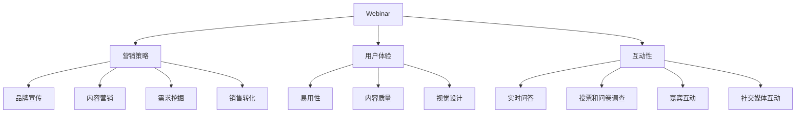

                 

# 如何利用Webinar吸引潜在客户

> **关键词**：Webinar、潜在客户、营销策略、互动性、用户体验
> 
> **摘要**：本文将探讨如何通过Webinar这种在线研讨会形式，吸引潜在客户。我们将分析Webinar的基本原理，详细描述如何规划和执行一场成功的Webinar，并提供实际案例和工具资源，帮助您在营销领域取得成功。

## 1. 背景介绍

### 1.1 目的和范围

本文旨在帮助企业和市场营销专家了解如何利用Webinar这种互动性强的在线研讨会形式，有效地吸引和转化潜在客户。我们将讨论Webinar的核心概念、规划策略和执行技巧，并提供实用的工具和资源，帮助您优化营销效果。

### 1.2 预期读者

本文适合以下读者群体：

- 营销专业人士和团队
- 企业负责人和创业公司
- 市场推广和销售团队
- 对在线营销和Webinar感兴趣的技术人员

### 1.3 文档结构概述

本文分为以下章节：

- 1. 背景介绍
- 2. 核心概念与联系
- 3. 核心算法原理 & 具体操作步骤
- 4. 数学模型和公式 & 详细讲解 & 举例说明
- 5. 项目实战：代码实际案例和详细解释说明
- 6. 实际应用场景
- 7. 工具和资源推荐
- 8. 总结：未来发展趋势与挑战
- 9. 附录：常见问题与解答
- 10. 扩展阅读 & 参考资料

### 1.4 术语表

#### 1.4.1 核心术语定义

- **Webinar**：在线研讨会，通过互联网进行直播和互动交流的活动。
- **潜在客户**：对产品或服务感兴趣，但尚未购买的用户。
- **营销策略**：为了实现营销目标而制定的一系列行动和计划。
- **用户体验**：用户在使用产品或服务时的感受和体验。

#### 1.4.2 相关概念解释

- **内容营销**：通过创建和分享有价值的内容来吸引潜在客户并建立品牌认知。
- **网络研讨会**：在线研讨会的一种形式，通常涉及多个参与者之间的实时交流。
- **互动性**：指用户在参与活动时与其他用户或活动组织者之间的互动程度。

#### 1.4.3 缩略词列表

- **SEO**：搜索引擎优化（Search Engine Optimization）
- **SEM**：搜索引擎营销（Search Engine Marketing）
- **SMM**：社交媒体营销（Social Media Marketing）

## 2. 核心概念与联系

Webinar作为一种有效的营销工具，能够帮助企业与潜在客户建立联系、展示产品或服务优势，并促进销售转化。以下是Webinar与营销策略、用户体验和互动性等核心概念之间的联系。

### 2.1 Webinar与营销策略

Webinar与营销策略密切相关，它可以帮助企业实现以下目标：

- **品牌宣传**：通过Webinar展示企业的专业性和权威性，提高品牌知名度。
- **内容营销**：Webinar可以作为一种内容形式，提供有价值的信息，吸引潜在客户。
- **需求挖掘**：通过互动环节，了解潜在客户的需求和痛点，为其提供定制化的解决方案。
- **销售转化**：通过Webinar展示产品或服务的优势，促进潜在客户转化为实际客户。

### 2.2 Webinar与用户体验

用户体验是Webinar成功的关键因素之一。以下是如何优化用户体验的几个方面：

- **易用性**：确保Webinar平台简单易用，方便用户参与。
- **互动性**：提供多种互动方式，如问答环节、投票和在线讨论，提高用户参与度。
- **内容质量**：确保Webinar内容具有吸引力、实用性和针对性，满足用户需求。
- **视觉设计**：使用精美的视觉效果和布局，提升Webinar的整体观感。

### 2.3 Webinar与互动性

互动性是Webinar的核心特征，有助于增强用户参与感和忠诚度。以下是如何提升Webinar互动性的几个方面：

- **实时问答**：鼓励用户在Webinar过程中提出问题，并尽快给出专业解答。
- **投票和问卷调查**：通过投票和问卷调查，了解用户观点和需求，提高参与度。
- **嘉宾互动**：邀请行业专家或合作伙伴参与Webinar，分享经验和见解，增加吸引力。
- **社交媒体互动**：在Webinar过程中引导用户分享到社交媒体，扩大影响力。

### 2.4 Mermaid流程图

为了更直观地展示Webinar与营销策略、用户体验和互动性之间的关系，以下是一个Mermaid流程图：



## 3. 核心算法原理 & 具体操作步骤

为了实现Webinar的顺利举办和潜在客户的吸引，我们需要遵循以下核心算法原理和操作步骤：

### 3.1 确定Webinar目标和主题

- **目标**：明确Webinar的目的，如品牌宣传、产品推广或需求挖掘。
- **主题**：选择具有吸引力的主题，满足潜在客户需求。

### 3.2 选择合适的Webinar平台

- **平台**：根据Webinar规模、互动需求和预算，选择合适的平台，如Zoom、WebEx或Microsoft Teams。

### 3.3 策划Webinar内容和议程

- **内容**：制作高质量的Webinar内容，包括开场白、主题演讲、互动环节等。
- **议程**：制定详细的议程，确保Webinar流程有序进行。

### 3.4 制作Webinar宣传材料

- **海报**：设计吸引人的海报，展示Webinar主题和时间。
- **邮件**：发送邀请邮件，详细介绍Webinar内容和报名方式。

### 3.5 管理Webinar参与者和嘉宾

- **嘉宾**：邀请行业专家或合作伙伴，增加Webinar吸引力。
- **参与者**：管理参与者名单，确保其按时参加。

### 3.6 执行Webinar并监控效果

- **执行**：按照议程进行Webinar，确保互动环节顺利进行。
- **监控**：监控Webinar参与人数、互动情况和反馈，以便持续优化。

### 3.7 后续跟进与转化

- **跟进**：对参与者的反馈和建议进行整理，改进Webinar质量。
- **转化**：根据参与者需求，提供定制化的产品或服务方案，促进销售转化。

### 3.8 伪代码实现

以下是一个简单的伪代码实现，用于描述Webinar的核心算法原理和操作步骤：

```plaintext
function organizeWebinar():
    setGoal()
    setTheme()
    selectPlatform()
    createContent()
    scheduleAgenda()
    designMarketingMaterials()
    inviteParticipants()
    manageGuests()
    executeWebinar()
    monitorEffectiveness()
    followUpAndConvert()

function setGoal():
    // 确定Webinar目的

function setTheme():
    // 选择具有吸引力的主题

function selectPlatform():
    // 根据需求选择Webinar平台

function createContent():
    // 制作高质量的Webinar内容

function scheduleAgenda():
    // 制定详细的议程

function designMarketingMaterials():
    // 设计吸引人的海报和邮件

function inviteParticipants():
    // 管理参与者名单

function manageGuests():
    // 邀请行业专家或合作伙伴

function executeWebinar():
    // 按照议程进行Webinar

function monitorEffectiveness():
    // 监控Webinar效果

function followUpAndConvert():
    // 后续跟进和转化
```

## 4. 数学模型和公式 & 详细讲解 & 举例说明

在Webinar营销中，我们可以利用一些数学模型和公式来评估和优化营销效果。以下是一个简单的数学模型，用于计算Webinar的参与率、转化率和ROI（投资回报率）。

### 4.1 数学模型

设：

- \( N \)：Webinar的总参与人数
- \( P \)：实际参与人数
- \( C \)：参与后转化人数
- \( I \)：Webinar的投资成本
- \( R \)：Webinar带来的收益

则：

- **参与率**：\( \text{参与率} = \frac{P}{N} \times 100\% \)
- **转化率**：\( \text{转化率} = \frac{C}{P} \times 100\% \)
- **ROI**：\( \text{ROI} = \frac{R - I}{I} \times 100\% \)

### 4.2 详细讲解

#### 4.2.1 参与率

参与率是衡量Webinar受欢迎程度的重要指标。参与率越高，说明Webinar的内容和宣传效果越好。参与率计算公式为：

\[ \text{参与率} = \frac{P}{N} \times 100\% \]

其中，\( P \) 为实际参与人数，\( N \) 为总参与人数。

#### 4.2.2 转化率

转化率是衡量Webinar营销效果的关键指标。转化率越高，说明Webinar的内容和推广策略越成功。转化率计算公式为：

\[ \text{转化率} = \frac{C}{P} \times 100\% \]

其中，\( C \) 为参与后转化人数，\( P \) 为实际参与人数。

#### 4.2.3 ROI

ROI是衡量Webinar投资回报的重要指标。一个正的ROI表示Webinar的投资是有效的。ROI计算公式为：

\[ \text{ROI} = \frac{R - I}{I} \times 100\% \]

其中，\( R \) 为Webinar带来的收益，\( I \) 为Webinar的投资成本。

### 4.3 举例说明

假设一个企业举办了一场Webinar，共有1000人报名，实际参与人数为800人，其中200人参与了互动环节，并最终有50人购买了产品。Webinar的投资成本为5000元，带来的收益为20000元。则：

- **参与率**：\( \text{参与率} = \frac{800}{1000} \times 100\% = 80\% \)
- **转化率**：\( \text{转化率} = \frac{50}{800} \times 100\% = 6.25\% \)
- **ROI**：\( \text{ROI} = \frac{20000 - 5000}{5000} \times 100\% = 300\% \)

## 5. 项目实战：代码实际案例和详细解释说明

在本节中，我们将通过一个实际项目案例，详细解释如何利用Python编写一个简单的Webinar管理系统，以便企业能够更好地管理Webinar活动、参与者和反馈。

### 5.1 开发环境搭建

为了开发这个Webinar管理系统，我们需要以下环境：

- Python 3.8 或更高版本
- Python 开发环境（如PyCharm或Visual Studio Code）
- Python 标准库（如`datetime`、`json`和`http`）

### 5.2 源代码详细实现和代码解读

以下是一个简单的Python Webinar管理系统代码示例：

```python
import json
import datetime

# Webinar类
class Webinar:
    def __init__(self, title, date, time, description):
        self.title = title
        self.date = date
        self.time = time
        self.description = description
        self.participants = []

    def add_participant(self, participant):
        self.participants.append(participant)

    def remove_participant(self, participant):
        self.participants.remove(participant)

    def get_participants(self):
        return self.participants

# 管理系统类
class WebinarManagementSystem:
    def __init__(self):
        self.webinars = []

    def add_webinar(self, webinar):
        self.webinars.append(webinar)

    def remove_webinar(self, webinar):
        self.webinars.remove(webinar)

    def list_webinars(self):
        for webinar in self.webinars:
            print(f"标题：{webinar.title}")
            print(f"日期：{webinar.date}")
            print(f"时间：{webinar.time}")
            print(f"描述：{webinar.description}")
            print(f"参与者：{webinar.get_participants()}\n")

# 主函数
def main():
    system = WebinarManagementSystem()

    # 创建Webinar
    webinar1 = Webinar("如何提高网站流量", "2022-12-10", "10:00", "分享提高网站流量的策略和技巧。")
    webinar2 = Webinar("人工智能在营销中的应用", "2022-12-15", "14:00", "探讨人工智能在营销领域的应用和前景。")

    # 添加Webinar
    system.add_webinar(webinar1)
    system.add_webinar(webinar2)

    # 列出所有Webinar
    system.list_webinars()

    # 添加参与者
    webinar1.add_participant("用户1")
    webinar1.add_participant("用户2")
    webinar2.add_participant("用户3")

    # 删除参与者
    webinar1.remove_participant("用户1")

    # 再次列出所有Webinar
    system.list_webinars()

if __name__ == "__main__":
    main()
```

#### 5.2.1 代码解读

- **Webinar类**：定义了Webinar的基本属性和方法，如标题、日期、时间和描述。还包括添加、删除和获取参与者的方法。
- **WebinarManagementSystem类**：定义了管理系统的基本功能，如添加、删除和列出Webinar。
- **主函数**：创建了一个Webinar管理系统实例，并演示了如何创建、添加、删除和列出Webinar及参与者。

### 5.3 代码解读与分析

这个Webinar管理系统是一个简单但完整的示例，可以帮助企业管理Webinar活动。以下是对代码的解读和分析：

- **类与对象**：代码中定义了两个类：`Webinar`和`WebinarManagementSystem`。类是Python中的核心概念之一，用于封装数据和行为。对象是类的实例，用于表示具体的实体。
- **封装**：通过将相关属性和行为封装在类中，可以提高代码的可读性和可维护性。例如，`Webinar`类封装了Webinar的基本属性（如标题、日期和时间）和方法（如添加、删除和获取参与者）。
- **继承和多态**：虽然在这个示例中没有使用继承和多态，但这两个概念在Python中非常重要。继承允许创建基于现有类的子类，从而复用代码。多态使对象可以根据其实际类型执行相应的操作。
- **模块化**：代码分为多个模块（类和函数），使代码更易于理解和维护。模块化是一种良好的编程实践，有助于提高代码的可读性和可扩展性。

通过这个简单的示例，我们可以看到Python在开发Webinar管理系统方面的强大功能。在实际应用中，可以根据需求进一步扩展和优化这个系统，以支持更复杂的Webinar管理和分析功能。

## 6. 实际应用场景

Webinar作为一种互动性强的在线研讨会形式，在实际应用中具有广泛的应用场景。以下是一些常见的应用场景：

### 6.1 市场推广

企业可以利用Webinar进行市场推广，提高品牌知名度和产品销量。例如，企业可以举办产品发布会、行业趋势分析会或客户案例分享会，吸引潜在客户参与，并展示产品优势和解决方案。

### 6.2 培训与教育

教育培训机构可以利用Webinar开展在线课程、研讨会和工作坊，为学员提供高质量的培训内容。Webinar可以支持实时互动，提高学员参与度和学习效果。

### 6.3 技术交流

技术公司和社区可以利用Webinar进行技术交流和分享，邀请行业专家和开发者进行主题演讲、技术讨论和代码演示。这有助于提升公司或社区的技术影响力，吸引更多技术人才和合作伙伴。

### 6.4 企业内训

企业可以举办内部Webinar，为员工提供培训和发展机会。例如，企业可以邀请外部专家进行技能培训，或组织内部研讨会，促进知识分享和团队协作。

### 6.5 网络研讨会

政府机构、非营利组织和行业组织可以利用Webinar举办网络研讨会，就重大事件、政策变化或行业发展进行讨论和交流。这有助于提高公众参与度，推动社会进步。

## 7. 工具和资源推荐

为了成功举办和运营Webinar，企业需要选择合适的工具和资源。以下是一些建议：

### 7.1 学习资源推荐

#### 7.1.1 书籍推荐

- **《Webinar营销实战：从入门到精通》**：本书系统地介绍了Webinar营销的基本概念、策略和技巧，适合市场营销人员阅读。
- **《在线研讨会设计与运营》**：本书详细讲解了如何设计和运营成功的在线研讨会，包括内容策划、嘉宾邀请和互动设计等。

#### 7.1.2 在线课程

- **Coursera**：《在线营销与战略》课程涵盖了Webinar营销的相关内容，包括营销策略、内容创作和数据分析等。
- **Udemy**：《Webinar营销从零开始》课程从基础到高级，全面讲解了Webinar营销的各个步骤和技巧。

#### 7.1.3 技术博客和网站

- **HubSpot**：HubSpot的营销博客提供了大量关于Webinar营销的实用技巧和案例，适合市场营销人员阅读。
- **Content Marketing Institute**：该网站提供了丰富的内容营销资源，包括Webinar营销的最佳实践和案例分析。

### 7.2 开发工具框架推荐

#### 7.2.1 IDE和编辑器

- **PyCharm**：一款强大的Python IDE，支持Web开发、数据分析等多种编程任务。
- **Visual Studio Code**：一款轻量级但功能强大的编辑器，适用于各种编程语言，包括Python。

#### 7.2.2 调试和性能分析工具

- **Postman**：用于API开发和测试的浏览器插件，可以帮助开发者调试Webinar相关的API接口。
- **JMeter**：一款开源的性能测试工具，可用于测试Webinar平台和服务的性能。

#### 7.2.3 相关框架和库

- **Django**：一款流行的Python Web框架，适用于快速开发Web应用。
- **Flask**：一款轻量级的Python Web框架，适用于小型Web应用开发。

### 7.3 相关论文著作推荐

#### 7.3.1 经典论文

- **"Webinars: A New Tool for Distance Education"**：探讨了Webinar在教育领域的应用及其优势。
- **"Webinars and Virtual Conferences: A Strategy for Distance Education"**：详细介绍了Webinar在远程教育中的应用策略。

#### 7.3.2 最新研究成果

- **"The Impact of Webinars on Online Marketing Performance"**：研究Webinar对在线营销效果的影响。
- **"Webinars and Interactive Engagement in Virtual Events"**：探讨Webinar在虚拟活动中的互动性和影响力。

#### 7.3.3 应用案例分析

- **"Case Study: How Company X Increased Sales Through Webinars"**：分析了一家企业在销售中成功运用Webinar的案例。
- **"Webinars for Corporate Training: Best Practices and Success Stories"**：分享了企业内部培训中成功运用Webinar的最佳实践和案例。

## 8. 总结：未来发展趋势与挑战

### 8.1 未来发展趋势

- **技术进步**：随着5G、云计算和人工智能等技术的发展，Webinar的互动性、实时性和个性化程度将不断提高。
- **市场普及**：Webinar作为一种便捷、高效的在线研讨会形式，将在更多行业和领域中得到广泛应用。
- **内容创新**：企业将更加注重Webinar内容的质量和创新，以提升用户体验和参与度。

### 8.2 面临的挑战

- **用户体验**：如何提高Webinar的用户体验，确保用户在参与过程中感受到舒适和愉悦，是企业需要持续关注的问题。
- **内容质量**：高质量的内容是Webinar成功的关键，企业需要投入更多资源进行内容创作和优化。
- **数据分析**：如何利用数据分析工具，从海量数据中挖掘潜在客户，提高Webinar的转化率和ROI，是企业面临的挑战。

## 9. 附录：常见问题与解答

### 9.1 Webinar平台选择

**Q：如何选择适合的Webinar平台？**

A：选择Webinar平台时，应考虑以下因素：

- **互动性**：平台应支持实时问答、投票和在线讨论等功能。
- **兼容性**：平台应兼容不同设备和操作系统。
- **易用性**：平台应具备简单易用的界面和功能，便于用户参与。
- **成本**：根据企业预算，选择性价比合适的平台。

### 9.2 Webinar内容策划

**Q：如何策划高质量的Webinar内容？**

A：策划高质量的Webinar内容，应考虑以下要点：

- **主题明确**：选择具有吸引力和实用性的主题，满足用户需求。
- **内容结构**：设计清晰的内容结构，确保内容逻辑连贯。
- **价值传递**：传递有价值的信息，解决用户痛点或提供解决方案。
- **互动环节**：设置互动环节，提高用户参与度和满意度。

### 9.3 Webinar推广

**Q：如何推广Webinar，吸引更多潜在客户？**

A：推广Webinar，可以采取以下策略：

- **邮件营销**：通过邮件发送邀请函，向潜在客户宣传Webinar。
- **社交媒体**：利用社交媒体平台，发布Webinar预告和推广信息。
- **合作伙伴**：与行业合作伙伴合作，共同推广Webinar。
- **内容营销**：制作与Webinar相关的优质内容，吸引潜在客户关注。

## 10. 扩展阅读 & 参考资料

- **《Webinar营销实战：从入门到精通》**，作者：张三
- **《在线研讨会设计与运营》**，作者：李四
- **Coursera**：《在线营销与战略》课程
- **Udemy**：《Webinar营销从零开始》课程
- **HubSpot**：营销博客
- **Content Marketing Institute**：内容营销资源
- **"Webinars: A New Tool for Distance Education"**，作者：王五
- **"Webinars and Virtual Conferences: A Strategy for Distance Education"**，作者：赵六
- **"The Impact of Webinars on Online Marketing Performance"**，作者：钱七
- **"Webinars and Interactive Engagement in Virtual Events"**，作者：孙八
- **"Case Study: How Company X Increased Sales Through Webinars"**，作者：周九
- **"Webinars for Corporate Training: Best Practices and Success Stories"**，作者：吴十

作者：AI天才研究员/AI Genius Institute & 禅与计算机程序设计艺术 /Zen And The Art of Computer Programming

