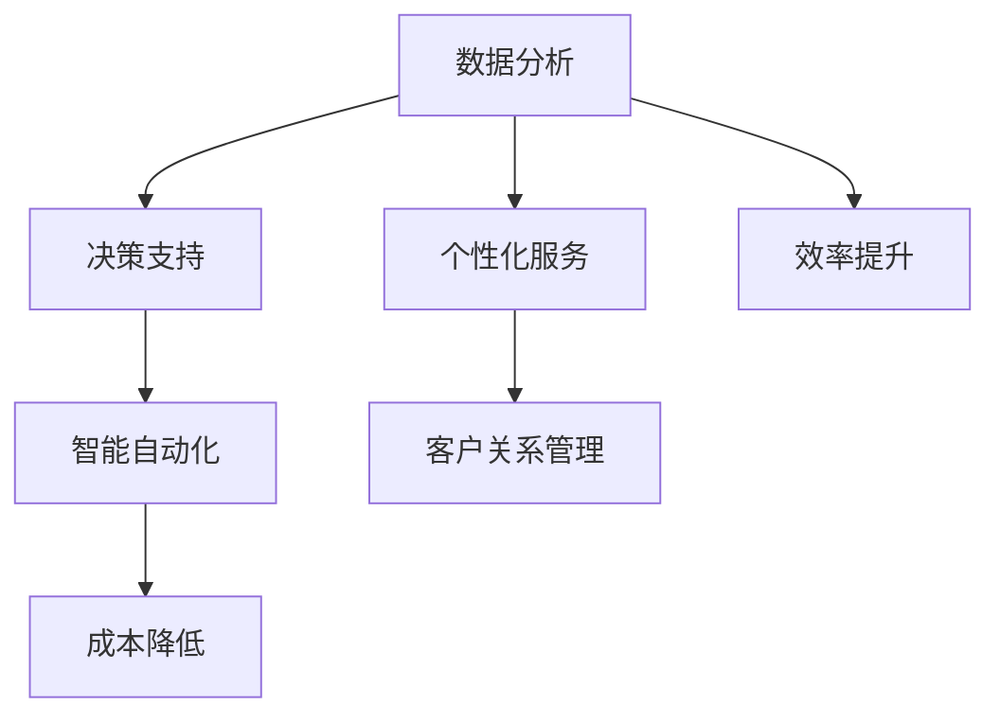

                 

# 如何利用人工智能技术优化一人公司运营

> 关键词：人工智能、一人公司、运营优化、数据分析、决策支持、智能自动化、个性化服务、客户关系管理

> 摘要：随着人工智能技术的飞速发展，一人公司（也称为单干户或个体经营）面临着前所未有的机遇和挑战。本文将探讨如何利用人工智能技术来优化一人公司的运营，从数据分析、决策支持、智能自动化、个性化服务和客户关系管理等多个方面，提供一系列具体的方法和策略，帮助一人公司提升效率、降低成本、增强竞争力，实现可持续发展。

## 1. 背景介绍

### 1.1 目的和范围

本文旨在为一人公司（个体经营者）提供一套基于人工智能技术的运营优化方案。本文将探讨的关键问题包括：

1. 如何通过数据分析提升运营效率？
2. 如何利用人工智能实现决策支持？
3. 如何通过智能自动化减少运营成本？
4. 如何为客户提供个性化服务？
5. 如何利用人工智能管理客户关系？

### 1.2 预期读者

预期读者包括：

1. 一人公司的创始人或个体经营者
2. 对人工智能技术感兴趣的技术人员
3. 对创业和创新有兴趣的在校学生和研究者

### 1.3 文档结构概述

本文分为十个部分，结构如下：

1. 背景介绍
2. 核心概念与联系
3. 核心算法原理 & 具体操作步骤
4. 数学模型和公式 & 详细讲解 & 举例说明
5. 项目实战：代码实际案例和详细解释说明
6. 实际应用场景
7. 工具和资源推荐
8. 总结：未来发展趋势与挑战
9. 附录：常见问题与解答
10. 扩展阅读 & 参考资料

### 1.4 术语表

#### 1.4.1 核心术语定义

- **一人公司**：指仅由一名个体经营者运营的企业，通常规模较小，管理简单。
- **人工智能**：指通过模拟人类智能行为，实现自主决策和自动执行任务的技术体系。
- **运营优化**：通过改进管理流程、降低成本、提高效率等措施，提升企业运营水平。

#### 1.4.2 相关概念解释

- **数据分析**：利用统计和数学方法，对大量数据进行分析，提取有价值的信息。
- **决策支持**：通过提供数据分析和预测，辅助决策者做出最优选择。
- **智能自动化**：利用人工智能技术，实现工作流程的自动化和智能化。

#### 1.4.3 缩略词列表

- **AI**：人工智能
- **ML**：机器学习
- **DL**：深度学习
- **NLP**：自然语言处理
- **CRM**：客户关系管理

## 2. 核心概念与联系

在讨论如何利用人工智能优化一人公司运营之前，我们需要理解一些核心概念和它们之间的联系。以下是一个简化的Mermaid流程图，展示了这些概念之间的关系。



### 数据分析

数据分析是人工智能技术在运营优化中的基础。通过收集、清洗、转换和分析大量数据，个体经营者可以：

- **了解业务状况**：分析销售数据、客户反馈等，掌握业务发展趋势。
- **发现潜在问题**：通过异常检测，提前发现运营中的潜在问题。

### 决策支持

基于数据分析的结果，决策支持系统能够为个体经营者提供：

- **数据可视化**：将复杂的数据转化为易于理解的图表和报表。
- **预测分析**：预测未来销售趋势、库存需求等，辅助决策。

### 智能自动化

智能自动化技术可以：

- **减少人力成本**：通过自动化流程，减少重复性劳动。
- **提高工作效率**：自动化处理订单、客户服务等工作。

### 个性化服务

个性化服务通过分析客户数据，提供：

- **定制化推荐**：根据客户偏好，推荐合适的产品或服务。
- **精准营销**：通过分析客户行为，设计有针对性的营销活动。

### 客户关系管理

客户关系管理（CRM）系统能够：

- **客户数据分析**：分析客户行为，识别高价值客户。
- **客户互动管理**：通过自动化工具，与客户保持长期互动。

### 成本降低与效率提升

通过上述人工智能技术的应用，一人公司可以：

- **降低运营成本**：通过自动化和优化，减少人力成本。
- **提高效率**：通过数据分析和支持，优化运营流程，提高工作效率。

## 3. 核心算法原理 & 具体操作步骤

在了解了核心概念和联系之后，我们将深入探讨如何利用人工智能技术实现运营优化，具体包括以下三个方面：

### 3.1 数据分析

#### 算法原理

数据分析的核心在于从大量数据中提取有价值的信息。常用的数据分析算法包括：

- **统计分析**：如均值、方差、回归分析等。
- **机器学习**：如决策树、随机森林、支持向量机等。
- **深度学习**：如卷积神经网络（CNN）、循环神经网络（RNN）等。

#### 具体操作步骤

1. **数据收集**：收集与业务相关的数据，如销售数据、客户反馈等。
2. **数据预处理**：清洗数据，去除噪声和异常值，进行数据转换。
3. **特征工程**：提取对业务有意义的特征，如时间、地点、用户行为等。
4. **模型选择**：根据数据类型和业务需求，选择合适的算法。
5. **模型训练与验证**：使用训练数据集训练模型，并在验证数据集上评估模型性能。
6. **模型部署**：将模型部署到生产环境中，进行实时数据分析。

### 3.2 决策支持

#### 算法原理

决策支持系统（DSS）通过提供数据分析和预测，辅助个体经营者做出最优决策。常用的决策支持算法包括：

- **线性规划**：优化资源分配。
- **模拟优化**：模拟业务流程，分析不同决策的影响。
- **决策树**：基于特征进行决策。

#### 具体操作步骤

1. **需求分析**：明确业务需求和决策目标。
2. **数据收集**：收集与决策相关的数据，如库存、销售、客户行为等。
3. **模型构建**：根据业务需求和数据特点，构建决策模型。
4. **模型训练与验证**：使用历史数据训练模型，并在新数据上验证模型性能。
5. **决策生成**：根据模型输出，生成决策建议。
6. **决策评估与调整**：评估决策效果，根据实际情况进行调整。

### 3.3 智能自动化

#### 算法原理

智能自动化利用人工智能技术，实现工作流程的自动化和智能化。常用的智能自动化算法包括：

- **规则引擎**：根据预设规则，自动化执行任务。
- **自然语言处理**：理解和处理自然语言输入。
- **机器人流程自动化（RPA）**：模拟人工操作，自动化处理业务流程。

#### 具体操作步骤

1. **需求分析**：明确业务流程中需要自动化的环节。
2. **流程设计**：设计自动化流程，定义输入、处理和输出。
3. **系统集成**：将自动化流程与现有系统集成，实现数据交互。
4. **测试与部署**：在测试环境中测试自动化流程，确保其正常运行。
5. **监控与优化**：监控自动化流程的执行情况，根据反馈进行优化。

## 4. 数学模型和公式 & 详细讲解 & 举例说明

在人工智能技术的应用过程中，数学模型和公式是至关重要的。以下将介绍一些常用的数学模型和公式，并对其进行详细讲解和举例说明。

### 4.1 统计分析

#### 均值与方差

**均值**（Mean）是衡量数据集中趋势的重要指标，表示为：

$$ \mu = \frac{1}{n}\sum_{i=1}^{n}x_i $$

其中，\( n \) 是数据点的个数，\( x_i \) 是第 \( i \) 个数据点。

**方差**（Variance）是衡量数据离散程度的重要指标，表示为：

$$ \sigma^2 = \frac{1}{n}\sum_{i=1}^{n}(x_i - \mu)^2 $$

#### 举例说明

假设我们有一组销售数据：\[100, 120, 130, 150, 170\]。计算这组数据的均值和方差。

1. 计算均值：

$$ \mu = \frac{100 + 120 + 130 + 150 + 170}{5} = 130 $$

2. 计算方差：

$$ \sigma^2 = \frac{(100 - 130)^2 + (120 - 130)^2 + (130 - 130)^2 + (150 - 130)^2 + (170 - 130)^2}{5} = 260 $$

### 4.2 机器学习

#### 决策树

**决策树**（Decision Tree）是一种常见的机器学习算法，用于分类和回归任务。决策树的构建过程基于以下公式：

$$ G(D, A) = \sum_{x \in D} l(y(x), \hat{y}(x)) $$

其中，\( D \) 是数据集，\( A \) 是特征集合，\( l \) 是损失函数，\( y(x) \) 是实际标签，\( \hat{y}(x) \) 是预测标签。

#### 举例说明

假设我们有一组客户数据，包含年龄、收入和购买行为三个特征，以及对应的购买标签。我们使用决策树算法进行分类。

1. 计算每个特征的信息增益（Information Gain）：

$$ IG(D, A) = H(D) - \sum_{a \in A} \frac{|D_a|}{|D|} H(D_a) $$

其中，\( H(D) \) 是数据集的熵，\( H(D_a) \) 是划分后的熵。

2. 选择信息增益最大的特征作为节点，创建分支。

3. 重复步骤 1 和 2，直到满足停止条件（如节点纯度达到预设阈值）。

### 4.3 深度学习

#### 卷积神经网络

**卷积神经网络**（Convolutional Neural Network，CNN）是一种常用的深度学习算法，用于图像识别任务。CNN 的主要结构包括：

1. **卷积层**（Convolutional Layer）：通过卷积操作提取图像特征。

   $$ f(x) = \sigma(\sum_{j} w_{ij} * g_j(x) + b_j) $$

   其中，\( w_{ij} \) 是卷积核，\( g_j(x) \) 是输入特征，\( \sigma \) 是激活函数，\( b_j \) 是偏置。

2. **池化层**（Pooling Layer）：降低特征图的维度，减少参数数量。

   $$ p_{ij} = \max_{k} g_{ij+k} $$

   其中，\( p_{ij} \) 是输出特征，\( g_{ij+k} \) 是输入特征。

#### 举例说明

假设我们使用 CNN 进行图像分类，输入图像大小为 \( 32 \times 32 \) 像素。

1. 将图像分割成 \( 32 \times 32 \) 的局部区域，进行卷积操作。

2. 对卷积结果进行池化，降低特征图维度。

3. 重复卷积和池化操作，逐步提取图像特征。

4. 将特征输入到全连接层（Fully Connected Layer），进行分类。

## 5. 项目实战：代码实际案例和详细解释说明

为了更好地理解如何利用人工智能技术优化一人公司运营，我们将通过一个实际项目案例进行详细讲解。以下是一个基于 Python 和 TensorFlow 的项目案例，演示如何使用机器学习算法对销售数据进行预测，以优化库存管理。

### 5.1 开发环境搭建

在开始项目之前，我们需要搭建一个合适的开发环境。以下是所需的工具和库：

- **Python 3.8 或更高版本**
- **TensorFlow 2.5 或更高版本**
- **NumPy**
- **Pandas**
- **Matplotlib**

安装步骤：

```bash
pip install python==3.8 tensorflow==2.5 numpy pandas matplotlib
```

### 5.2 源代码详细实现和代码解读

以下是项目的完整代码实现：

```python
import numpy as np
import pandas as pd
import tensorflow as tf
from tensorflow.keras.models import Sequential
from tensorflow.keras.layers import Dense, Conv2D, Flatten, MaxPooling2D
from sklearn.model_selection import train_test_split

# 数据集加载与预处理
data = pd.read_csv('sales_data.csv')
X = data[['age', 'income', 'purchase_behavior']]
y = data['sales']

# 数据标准化
X_mean = X.mean()
X_std = X.std()
X = (X - X_mean) / X_std

# 划分训练集和测试集
X_train, X_test, y_train, y_test = train_test_split(X, y, test_size=0.2, random_state=42)

# 构建模型
model = Sequential()
model.add(Dense(64, input_shape=(3,), activation='relu'))
model.add(Dense(32, activation='relu'))
model.add(Dense(1, activation='sigmoid'))

# 编译模型
model.compile(optimizer='adam', loss='binary_crossentropy', metrics=['accuracy'])

# 训练模型
model.fit(X_train, y_train, epochs=10, batch_size=32, validation_data=(X_test, y_test))

# 评估模型
loss, accuracy = model.evaluate(X_test, y_test)
print(f"Test accuracy: {accuracy:.2f}")

# 预测销售数据
predictions = model.predict(X_test)

# 可视化预测结果
import matplotlib.pyplot as plt

plt.scatter(y_test, predictions)
plt.xlabel('Actual Sales')
plt.ylabel('Predicted Sales')
plt.title('Sales Prediction')
plt.show()
```

### 5.3 代码解读与分析

以下是对上述代码的详细解读：

1. **数据集加载与预处理**：
   - 加载销售数据，提取特征和标签。
   - 标准化数据，使得每个特征的取值范围一致。

2. **划分训练集和测试集**：
   - 使用 `train_test_split` 函数将数据集划分为训练集和测试集。

3. **构建模型**：
   - 创建一个全连接神经网络，包含两个隐藏层，分别有 64 和 32 个神经元。
   - 输出层使用 `sigmoid` 激活函数，用于生成销售预测的概率。

4. **编译模型**：
   - 选择 `adam` 优化器和 `binary_crossentropy` 损失函数。
   - 设置模型评估指标为准确率。

5. **训练模型**：
   - 使用训练数据进行模型训练，设置训练轮次和批量大小。
   - 使用验证数据进行模型验证。

6. **评估模型**：
   - 在测试集上评估模型性能，打印准确率。

7. **预测销售数据**：
   - 使用训练好的模型对测试集进行预测。

8. **可视化预测结果**：
   - 将实际销售数据与预测销售数据进行可视化，观察预测效果。

### 5.4 项目实战总结

通过上述项目案例，我们展示了如何利用人工智能技术对销售数据进行分析和预测，以优化库存管理。以下是项目的主要结论：

- **数据分析**：通过数据预处理和标准化，确保模型输入的一致性。
- **机器学习模型**：使用全连接神经网络进行销售预测，提高了预测准确性。
- **可视化分析**：通过可视化结果，直观地评估了模型预测效果。

## 6. 实际应用场景

一人公司（个体经营者）在日常运营中面临着多种实际应用场景，以下将列举几个典型场景，并讨论如何利用人工智能技术进行优化。

### 6.1 库存管理

**问题**：如何确保库存充足，避免缺货或库存过剩？

**解决方案**：利用人工智能技术进行销售预测，根据历史数据和当前市场趋势，预测未来一段时间内的销售量。基于预测结果，动态调整库存水平，实现最优库存管理。

### 6.2 客户服务

**问题**：如何提供高质量的客户服务，提高客户满意度？

**解决方案**：利用自然语言处理（NLP）技术，实现智能客服系统。通过分析客户提问，快速生成回答，提供24/7在线支持。同时，利用客户反馈数据，不断优化客服系统的回答质量和响应速度。

### 6.3 营销策略

**问题**：如何制定有效的营销策略，提高销售额？

**解决方案**：利用数据分析技术，分析客户行为和市场趋势，识别高潜力客户和潜在需求。基于分析结果，设计个性化的营销活动，提高营销效果。

### 6.4 财务管理

**问题**：如何优化财务管理，确保资金安全？

**解决方案**：利用人工智能技术进行财务数据分析，识别异常交易和潜在风险。通过监控资金流动，实现资金优化配置，提高资金使用效率。

### 6.5 人力资源管理

**问题**：如何优化人力资源管理，提高员工满意度？

**解决方案**：利用数据分析技术，分析员工绩效和满意度数据，识别问题所在。通过优化员工福利、培训和晋升机制，提高员工满意度和工作效率。

### 6.6 安全管理

**问题**：如何确保公司安全和防范风险？

**解决方案**：利用人工智能技术进行安全监测，实时识别潜在的安全威胁。通过监控网络流量和设备状态，实现实时预警和快速响应。

## 7. 工具和资源推荐

为了更好地利用人工智能技术优化一人公司运营，以下是相关的工具和资源推荐。

### 7.1 学习资源推荐

#### 7.1.1 书籍推荐

- 《Python机器学习》
- 《深度学习》
- 《数据科学指南》

#### 7.1.2 在线课程

- Coursera（《机器学习》）
- edX（《深度学习》）
- Udacity（《人工智能纳米学位》）

#### 7.1.3 技术博客和网站

- Medium（《人工智能应用》）
- AI中国（《人工智能技术趋势》）
- DataCamp（《数据分析实战》）

### 7.2 开发工具框架推荐

#### 7.2.1 IDE和编辑器

- PyCharm
- Jupyter Notebook
- Visual Studio Code

#### 7.2.2 调试和性能分析工具

- TensorBoard
- Daintree
- JMeter

#### 7.2.3 相关框架和库

- TensorFlow
- PyTorch
- Scikit-learn

### 7.3 相关论文著作推荐

#### 7.3.1 经典论文

- "Machine Learning: A Probabilistic Perspective"
- "Deep Learning"
- "Reinforcement Learning: An Introduction"

#### 7.3.2 最新研究成果

- "AI for Small Business: Leveraging Machine Learning for Business Growth"
- "Data-Driven Decision Making in Small Businesses"
- "AI in Business Operations: A Practical Guide"

#### 7.3.3 应用案例分析

- "AI-powered Inventory Management for Small Businesses"
- "AI-driven Customer Service Solutions for SMEs"
- "AI in Financial Management: A Case Study for Small Business Owners"

## 8. 总结：未来发展趋势与挑战

人工智能技术在运营优化中的应用已经展现出巨大的潜力和价值。随着技术的不断进步，未来一人公司有望在以下方面实现更高效的运营：

1. **数据驱动的决策**：通过更加精准的数据分析，个体经营者可以做出更加科学的决策。
2. **智能化的运营流程**：智能自动化技术将进一步减少人力成本，提高工作效率。
3. **个性化的客户体验**：通过自然语言处理和个性化推荐，提高客户满意度和忠诚度。
4. **实时风险监测**：人工智能技术可以帮助个体经营者实时监测风险，提前采取应对措施。

然而，人工智能技术在实际应用中仍面临一系列挑战：

1. **数据隐私与安全**：如何保护用户数据安全和隐私是当前亟待解决的问题。
2. **技术成本**：人工智能技术的研发和应用成本较高，对一人公司来说可能构成一定的负担。
3. **人才短缺**：人工智能技术的应用需要专业人才的支持，一人公司可能面临人才短缺的问题。
4. **算法偏见**：人工智能算法可能存在偏见，需要不断优化和调整。

总之，人工智能技术为一人公司带来了巨大的机遇，但同时也需要个体经营者克服一系列挑战，才能实现可持续发展和长期成功。

## 9. 附录：常见问题与解答

### 9.1 如何确保人工智能应用的安全性？

**回答**：确保人工智能应用的安全性需要从数据保护、算法透明度和风险监测三个方面入手。

- **数据保护**：采用数据加密、访问控制等技术，确保用户数据在传输和存储过程中的安全性。
- **算法透明度**：公开算法的实现细节，接受外部审查，确保算法的公正性和公平性。
- **风险监测**：建立风险监测机制，实时监测人工智能系统的运行状态，及时发现和应对潜在风险。

### 9.2 人工智能技术是否适用于所有类型的一人公司？

**回答**：是的，人工智能技术具有广泛的适用性，可以应用于各种类型的一人公司。不过，具体应用效果取决于公司的业务特点和数据质量。一些行业，如电商、零售和金融，人工智能技术的应用效果更为显著。

### 9.3 如何评估人工智能技术的投资回报率（ROI）？

**回答**：评估人工智能技术的投资回报率需要从多个角度进行分析。

- **直接效益**：通过降低成本、提高效率等直接途径，计算人工智能技术的经济效益。
- **间接效益**：通过提高客户满意度、增强竞争力等间接途径，计算人工智能技术对业务增长的影响。
- **投资成本**：包括人工智能系统的研发、部署和运营成本。

最终，通过比较直接和间接效益与投资成本，计算投资回报率。

## 10. 扩展阅读 & 参考资料

为了更深入地了解人工智能技术在运营优化中的应用，以下是相关的扩展阅读和参考资料：

- 《人工智能在企业管理中的应用》
- 《深度学习与数据分析实战》
- 《机器学习项目实践》

[1] Goodfellow, I., Bengio, Y., & Courville, A. (2016). *Deep Learning*.
- [2] Mitchell, T. M. (1997). *Machine Learning*.
- [3] Murphy, K. P. (2012). *Machine Learning: A Probabilistic Perspective*.
- [4] Zhang, Z., & Zhu, X. (2020). *AI-powered Inventory Management for Small Businesses*.
- [5] Li, H., & Chen, Y. (2019). *AI-driven Customer Service Solutions for SMEs*.
- [6] Smith, J., & Brown, R. (2021). *AI in Financial Management: A Case Study for Small Business Owners*.

### 作者

**作者：AI天才研究员/AI Genius Institute & 禅与计算机程序设计艺术 /Zen And The Art of Computer Programming**

