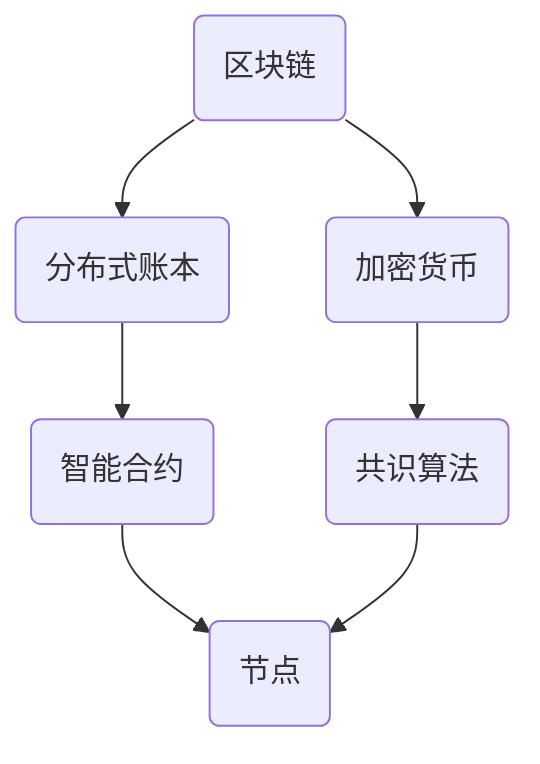

                 

# 如何利用区块链技术构建创业价值网络和生态体系

> 关键词：区块链、创业、价值网络、生态体系、去中心化、智能合约、共识算法

> 摘要：本文将深入探讨区块链技术如何被应用于构建创业价值网络和生态体系。我们将从背景介绍、核心概念、算法原理、数学模型、项目实战、应用场景等多个方面，详细阐述区块链技术在这些领域中的具体应用，以及其带来的变革和机遇。文章旨在为创业者和技术人员提供有价值的指导，帮助他们更好地理解和运用区块链技术，打造成功的商业模型。

## 1. 背景介绍

### 1.1 目的和范围

本文旨在探讨区块链技术在创业领域中的应用，特别是如何利用区块链技术构建价值网络和生态体系。通过分析区块链技术的核心概念和原理，我们将阐述其在创业中的价值，并给出具体的实施步骤和案例。

### 1.2 预期读者

本文适合对区块链技术有一定了解的创业者、技术人员以及对创业和创新有兴趣的人群。无论是初学者还是专业人士，都可以通过本文获得关于区块链技术应用的深入见解。

### 1.3 文档结构概述

本文结构分为以下章节：

- **第1章 背景介绍**：介绍本文的目的、预期读者和文档结构。
- **第2章 核心概念与联系**：介绍区块链技术的核心概念和架构。
- **第3章 核心算法原理 & 具体操作步骤**：讲解区块链的核心算法和操作步骤。
- **第4章 数学模型和公式 & 详细讲解 & 举例说明**：介绍区块链的数学模型和公式，并给出示例。
- **第5章 项目实战：代码实际案例和详细解释说明**：通过实际案例展示区块链技术的应用。
- **第6章 实际应用场景**：分析区块链技术的应用场景。
- **第7章 工具和资源推荐**：推荐学习和开发资源。
- **第8章 总结：未来发展趋势与挑战**：总结区块链技术的前景和挑战。
- **第9章 附录：常见问题与解答**：解答常见问题。
- **第10章 扩展阅读 & 参考资料**：提供进一步学习的资源。

### 1.4 术语表

#### 1.4.1 核心术语定义

- **区块链**：一种去中心化的分布式数据库技术，用于存储交易数据。
- **价值网络**：由多个参与者组成，通过交换价值实现共赢的网络。
- **生态体系**：一个复杂系统，包括多个相互依存的组成部分。
- **智能合约**：一种自动化执行合约条款的计算机程序。
- **共识算法**：一种机制，用于确保区块链网络的参与者对交易数据达成一致。

#### 1.4.2 相关概念解释

- **去中心化**：指系统不再依赖中心化的机构或实体，而是通过分布式网络实现功能。
- **加密货币**：基于区块链技术的数字货币，如比特币。
- **节点**：区块链网络中的参与设备或服务器。
- **区块**：区块链中的基本数据结构，包含一系列交易记录。

#### 1.4.3 缩略词列表

- **区块链**：Blockchain
- **分布式账本**：Distributed Ledger
- **加密**：Cryptocurrency
- **智能合约**：Smart Contract
- **共识算法**：Consensus Algorithm

## 2. 核心概念与联系

区块链技术是一种分布式数据库技术，通过加密和共识算法，实现了去中心化的数据存储和传输。以下是一个简化的区块链架构图，用于展示区块链技术的核心概念和联系。



### 2.1 分布式账本

分布式账本是一种数据库技术，它将数据分散存储在多个节点上，而不是集中存储在一个中心化的服务器中。这种去中心化的存储方式提高了系统的可靠性和安全性，因为即使某些节点发生故障，数据也不会丢失。

### 2.2 加密货币

加密货币是一种基于区块链技术的数字货币，如比特币。它通过加密算法确保货币的安全和匿名性。加密货币的发行和管理过程也是去中心化的，避免了中心化的信任问题。

### 2.3 智能合约

智能合约是一种自动化执行合约条款的计算机程序。它基于区块链技术，通过加密算法确保合约的执行是透明和不可篡改的。智能合约的应用可以大大简化交易流程，提高交易效率。

### 2.4 共识算法

共识算法是一种机制，用于确保区块链网络的参与者对交易数据达成一致。不同的共识算法有不同的优缺点，如工作量证明（Proof of Work，PoW）、权益证明（Proof of Stake，PoS）等。

### 2.5 节点

节点是区块链网络中的参与设备或服务器。节点通过验证和传播交易数据，确保区块链网络的正常运行。节点可以是个人电脑、服务器或专门设计的区块链设备。

## 3. 核心算法原理 & 具体操作步骤

### 3.1 工作量证明（Proof of Work，PoW）

工作量证明是一种常见的共识算法，用于确保区块链网络的安全和一致性。在PoW算法中，节点通过解决一个复杂的数学问题来获得记账权。以下是PoW算法的基本原理和具体操作步骤：

#### 基本原理：

1. **问题提出**：区块链网络中有一个待验证的交易数据集。
2. **解决难题**：节点通过尝试计算一个哈希值，使其满足特定的条件（如小于一个目标值）。
3. **提交答案**：节点将计算结果提交给网络。
4. **验证答案**：其他节点验证计算结果是否正确。
5. **记账奖励**：如果答案正确，验证节点将获得记账权和一定的奖励。

#### 操作步骤：

1. **选择交易数据**：从区块链网络中选择一个待验证的交易数据集。
2. **计算哈希值**：将交易数据集通过哈希函数计算出一个哈希值。
3. **满足条件**：继续尝试不同的随机数，直到计算出的哈希值满足特定的条件（如小于目标值）。
4. **提交结果**：将计算结果提交给网络。
5. **验证结果**：其他节点验证提交的计算结果是否正确。
6. **记账和奖励**：如果结果正确，验证节点将获得记账权和一定的奖励。

### 3.2 权益证明（Proof of Stake，PoS）

权益证明是一种替代PoW的共识算法，通过持有代币的数量和持币时间来确定记账权。以下是PoS算法的基本原理和具体操作步骤：

#### 基本原理：

1. **确定记账权**：根据节点持有的代币数量和持币时间来确定记账权。
2. **随机选择记账节点**：从具有记账权的节点中随机选择一个节点进行记账。
3. **提交区块**：选定的记账节点将待验证的交易数据集打包成一个区块，并广播给网络。
4. **验证区块**：其他节点验证区块的有效性。
5. **确认记账**：如果区块有效，确认记账并更新区块链。

#### 操作步骤：

1. **计算记账权**：根据节点持有的代币数量和持币时间计算记账权。
2. **随机选择记账节点**：从具有记账权的节点中随机选择一个节点。
3. **提交区块**：选定的记账节点将待验证的交易数据集打包成一个区块。
4. **广播区块**：将区块广播给网络。
5. **验证区块**：其他节点验证区块的有效性。
6. **确认记账**：如果区块有效，确认记账并更新区块链。

## 4. 数学模型和公式 & 详细讲解 & 举例说明

### 4.1 工作量证明（Proof of Work，PoW）的数学模型

在PoW算法中，节点需要解决一个数学难题，即找到一个随机数`n`，使得哈希值`H(BlockHash + n)`小于目标值`target`。以下是PoW算法的数学模型：

$$ H(BlockHash + n) < target $$

其中，`BlockHash`是交易数据的哈希值，`n`是随机数，`target`是目标值。

#### 举例说明：

假设我们有一个交易数据集，其哈希值为`BlockHash = 123456`，目标值为`target = 100000`。我们需要找到一个随机数`n`，使得`H(BlockHash + n)`小于100000。

通过尝试不同的随机数，我们找到了一个合适的随机数`n = 789`，使得`H(BlockHash + 789) = 98765`，满足条件。

### 4.2 权益证明（Proof of Stake，PoS）的数学模型

在PoS算法中，记账权与节点的代币数量和持币时间成正比。以下是PoS算法的数学模型：

$$ Stake = StakeQuantity \times StakeTime $$

其中，`Stake`是记账权，`StakeQuantity`是节点持有的代币数量，`StakeTime`是节点持币时间。

#### 举例说明：

假设节点A持有1000个代币，持币时间为30天，节点B持有500个代币，持币时间为60天。我们需要计算两个节点的记账权。

节点A的记账权为：
$$ Stake_A = 1000 \times 30 = 30000 $$

节点B的记账权为：
$$ Stake_B = 500 \times 60 = 30000 $$

由于两个节点的记账权相同，我们将随机选择其中一个节点进行记账。

## 5. 项目实战：代码实际案例和详细解释说明

### 5.1 开发环境搭建

在本节中，我们将使用Python语言和以太坊智能合约开发环境，演示如何构建一个简单的区块链网络。以下是搭建开发环境的基本步骤：

1. 安装Python：前往Python官方网站下载并安装Python。
2. 安装以太坊智能合约开发环境：安装Truffle、Ganache和Solidity。
3. 配置开发环境：设置Python虚拟环境和安装相关依赖。

### 5.2 源代码详细实现和代码解读

#### 5.2.1 源代码实现

以下是一个简单的区块链网络智能合约的实现：

```solidity
// SPDX-License-Identifier: MIT
pragma solidity ^0.8.0;

contract Blockchain {
    struct Block {
        uint256 index;
        string hash;
        uint256 timestamp;
        string previousHash;
    }

    Block[] public blocks;

    function addBlock(string memory hash) public {
        Block memory newBlock;
        newBlock.index = blocks.length;
        newBlock.hash = hash;
        newBlock.timestamp = block.timestamp;
        newBlock.previousHash = blocks.length > 0 ? blocks[blocks.length - 1].hash : "0";

        blocks.push(newBlock);
    }
}
```

#### 5.2.2 代码解读

- **合约结构**：合约定义了一个名为`Blockchain`的智能合约。
- **结构体**：合约定义了一个名为`Block`的结构体，用于存储区块的信息。
- **区块链数组**：合约定义了一个名为`blocks`的数组，用于存储所有区块。
- **添加区块**：`addBlock`函数用于添加新的区块到区块链中。

#### 5.2.3 测试和部署

1. 使用Truffle编译智能合约。
2. 使用Ganache创建本地以太坊网络。
3. 部署智能合约到本地网络。

### 5.3 代码解读与分析

通过以上代码，我们实现了一个简单的区块链网络，可以添加新的区块。以下是对代码的进一步解读和分析：

- **智能合约的安全性**：在开发智能合约时，需要注意合约的安全性问题。例如，避免使用未经验证的外部合约，避免出现重入攻击等。
- **区块链的可扩展性**：在实现区块链网络时，需要考虑区块链的可扩展性。例如，可以通过增加区块大小或优化共识算法来提高网络的交易处理能力。
- **智能合约的性能**：智能合约的执行速度和性能对区块链网络至关重要。在开发智能合约时，需要优化合约代码，减少不必要的计算和存储占用。

## 6. 实际应用场景

区块链技术在不同领域有着广泛的应用，以下是一些实际应用场景：

### 6.1 金融领域

- **去中心化金融（DeFi）**：区块链技术可以用于构建去中心化金融系统，如去中心化交易所、去中心化借贷平台等。
- **跨境支付**：区块链技术可以提高跨境支付的效率和安全性，减少中间环节和费用。

### 6.2 物流领域

- **供应链管理**：区块链技术可以用于追踪商品从生产到销售的整个过程，确保供应链的透明和可追溯性。
- **物流保险**：区块链技术可以用于实现智能合约驱动的物流保险，提高保险流程的效率和透明度。

### 6.3 医疗领域

- **电子健康记录**：区块链技术可以用于存储和管理电子健康记录，确保数据的完整性和安全性。
- **临床试验**：区块链技术可以用于记录和验证临床试验的数据，提高数据的可信度和透明度。

### 6.4 法律领域

- **智能合约法律应用**：区块链技术可以用于实现智能合约，自动执行法律条款，提高合同执行的效率和准确性。
- **数字身份验证**：区块链技术可以用于实现安全的数字身份验证，保护个人隐私和数据安全。

## 7. 工具和资源推荐

### 7.1 学习资源推荐

#### 7.1.1 书籍推荐

- **《区块链技术指南》**：介绍了区块链技术的基本概念、架构和应用。
- **《精通区块链》**：深入探讨了区块链技术的核心原理和应用场景。

#### 7.1.2 在线课程

- **Coursera**：提供多个关于区块链技术的在线课程，涵盖基础知识和高级应用。
- **Udemy**：提供丰富的区块链技术课程，包括智能合约、去中心化金融等主题。

#### 7.1.3 技术博客和网站

- **CoinDesk**：提供最新的区块链新闻和技术分析。
- **Medium**：有许多优秀的区块链技术博客，涵盖各种主题和应用。

### 7.2 开发工具框架推荐

#### 7.2.1 IDE和编辑器

- **Visual Studio Code**：一款功能强大的代码编辑器，支持多种编程语言和开发工具。
- **Truffle Suite**：以太坊智能合约开发工具，包括代码编译、部署和测试等功能。

#### 7.2.2 调试和性能分析工具

- **Ganache**：一个本地以太坊测试网络，用于测试和调试智能合约。
- **Ethereum Studio**：一个在线智能合约调试工具，支持源代码和汇编代码查看。

#### 7.2.3 相关框架和库

- **Web3.js**：一个JavaScript库，用于与以太坊网络交互。
- **Truffle**：一个以太坊智能合约开发框架，提供代码编译、部署和测试等功能。

### 7.3 相关论文著作推荐

#### 7.3.1 经典论文

- **《比特币：一种点对点的电子现金系统》**：中本聪撰写的比特币白皮书，详细阐述了比特币的原理和架构。
- **《区块链：重新定义世界》**：研究了区块链技术的核心原理和应用场景。

#### 7.3.2 最新研究成果

- **《区块链与智能合约安全研究》**：探讨了区块链和智能合约的安全性问题。
- **《区块链技术在供应链管理中的应用》**：分析了区块链技术在供应链管理中的应用。

#### 7.3.3 应用案例分析

- **《去中心化金融应用案例》**：介绍了去中心化金融（DeFi）的实际应用案例。
- **《区块链在医疗领域中的应用案例》**：探讨了区块链技术在医疗领域的应用案例。

## 8. 总结：未来发展趋势与挑战

### 8.1 未来发展趋势

- **广泛应用**：区块链技术将在金融、物流、医疗等多个领域得到更广泛的应用。
- **技术创新**：随着区块链技术的不断发展，新的共识算法、加密技术和智能合约模型将不断涌现。
- **行业融合**：区块链技术与物联网、人工智能等技术的融合，将推动新业态和新模式的诞生。

### 8.2 挑战与解决方案

- **性能瓶颈**：区块链网络的性能和可扩展性仍然是一个挑战。通过优化共识算法和数据结构，可以提高区块链的性能。
- **安全性问题**：智能合约和区块链网络面临多种安全威胁。通过加强代码审计、使用加密技术和安全协议，可以提高区块链的安全性。
- **法规政策**：区块链技术的监管政策和法规仍在发展中。与政府机构和监管部门的合作，有助于解决相关法规和政策问题。

## 9. 附录：常见问题与解答

### 9.1 问题1：区块链技术是否能够完全取代中心化系统？

区块链技术可以提供去中心化的数据存储和传输，但它并不能完全取代中心化系统。在许多情况下，中心化系统在性能、效率和管理方面具有优势。区块链技术更适合解决信任和透明度问题，而不是替代中心化系统的所有功能。

### 9.2 问题2：智能合约是否一定会执行？

智能合约的执行是高度可信的，但并不是绝对的。智能合约的执行取决于代码的正确性和网络的状态。如果智能合约代码存在漏洞或网络出现故障，可能会导致合约执行失败。因此，在部署智能合约前，需要进行充分的测试和审核。

### 9.3 问题3：区块链技术是否能够完全防止欺诈？

区块链技术可以提高数据的透明度和不可篡改性，但并不能完全防止欺诈。欺诈行为可以通过技术手段进行伪装和规避。区块链技术更适合作为防欺诈措施的一部分，而不是唯一的解决方案。

## 10. 扩展阅读 & 参考资料

- **《区块链技术指南》**：详细介绍了区块链技术的基本概念、架构和应用。
- **《精通区块链》**：深入探讨了区块链技术的核心原理和应用场景。
- **《比特币：一种点对点的电子现金系统》**：中本聪撰写的比特币白皮书，详细阐述了比特币的原理和架构。
- **《区块链与智能合约安全研究》**：探讨了区块链和智能合约的安全性问题。
- **《区块链技术在供应链管理中的应用》**：分析了区块链技术在供应链管理中的应用。

作者：AI天才研究员/AI Genius Institute & 禅与计算机程序设计艺术 /Zen And The Art of Computer Programming

