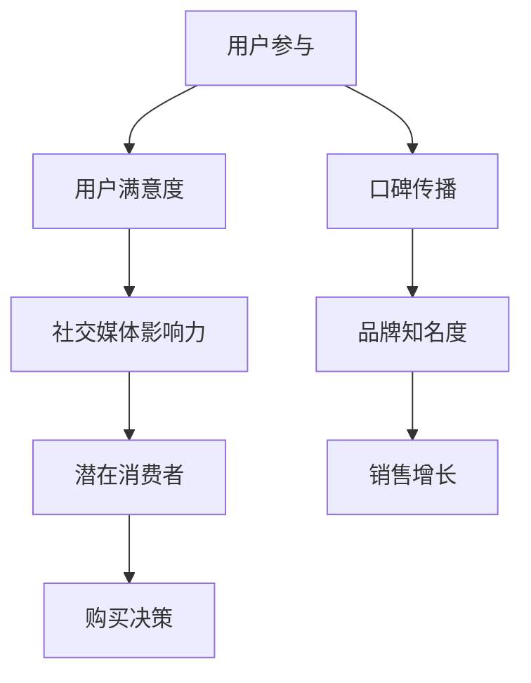

                 

# 如何利用口碑营销推广知识付费产品

## 概述

关键词：口碑营销、知识付费产品、推广策略、用户参与、社交媒体、案例分析

摘要：
本文将探讨如何有效地利用口碑营销来推广知识付费产品。我们将分析口碑营销的基本概念和原理，介绍一些实用的口碑营销策略，并通过实际案例展示这些策略在推广知识付费产品中的成功应用。文章还将讨论如何利用社交媒体来增强口碑营销的效果，并提供一些学习资源、工具和框架推荐，以帮助读者更好地理解和实践口碑营销。

## 1. 背景介绍

### 1.1 目的和范围

本文旨在为知识付费产品的推广者提供一份详细的指南，帮助他们在竞争激烈的市场中利用口碑营销获得成功。我们将从以下几个方面展开讨论：

- **口碑营销的概念和原理**：解释口碑营销是什么，以及它如何影响消费者的购买决策。
- **口碑营销策略**：介绍几种有效的口碑营销策略，包括内容营销、用户参与、社交媒体推广等。
- **实际案例**：分析一些成功的口碑营销案例，探讨它们如何应用于知识付费产品的推广。
- **社交媒体的作用**：讨论社交媒体在口碑营销中的作用，以及如何利用社交媒体平台来增强口碑营销的效果。
- **资源推荐**：提供一些学习资源、工具和框架，以帮助读者更好地理解和实践口碑营销。

### 1.2 预期读者

本文适合以下读者：

- **知识付费产品推广者**：希望通过口碑营销提高产品知名度和销量的推广者。
- **市场营销人员**：希望了解如何利用口碑营销策略来推广产品的市场营销人员。
- **创业者和企业家**：希望了解口碑营销在产品推广中作用和应用的创业者和企业家。
- **大学生和研究生**：对口碑营销和知识付费产品感兴趣的学生和研究人员。

### 1.3 文档结构概述

本文将按照以下结构进行组织：

- **背景介绍**：介绍本文的目的、预期读者和文档结构。
- **核心概念与联系**：讨论口碑营销的基本概念和原理，并提供Mermaid流程图。
- **核心算法原理 & 具体操作步骤**：详细解释口碑营销策略的具体操作步骤。
- **数学模型和公式 & 详细讲解 & 举例说明**：介绍口碑营销相关的数学模型和公式，并进行举例说明。
- **项目实战：代码实际案例和详细解释说明**：通过实际案例展示口碑营销策略的应用。
- **实际应用场景**：讨论口碑营销在不同场景中的应用。
- **工具和资源推荐**：推荐一些相关的学习资源、工具和框架。
- **总结：未来发展趋势与挑战**：展望口碑营销的未来发展趋势和面临的挑战。
- **附录：常见问题与解答**：回答一些常见的问题。
- **扩展阅读 & 参考资料**：提供一些扩展阅读资料。

### 1.4 术语表

#### 1.4.1 核心术语定义

- **口碑营销**：通过用户的推荐和评价来影响其他潜在消费者的购买决策，从而促进产品销售的营销策略。
- **知识付费产品**：指用户需要付费才能获取的知识内容，如在线课程、电子书、专业咨询等。
- **用户参与**：指用户在口碑营销过程中积极参与，如评价、分享、推荐等。

#### 1.4.2 相关概念解释

- **社交媒体**：指一种在线平台，允许用户创建、分享和传播内容，如Facebook、Twitter、LinkedIn等。
- **用户满意度**：指用户对产品或服务的满意程度，是口碑营销成功的关键因素之一。
- **社交媒体影响力**：指某个用户或品牌在社交媒体上的影响力，通常通过粉丝数、互动率等指标来衡量。

#### 1.4.3 缩略词列表

- **KOL**：Key Opinion Leader，关键意见领袖
- **KPI**：Key Performance Indicator，关键绩效指标
- **SEO**：Search Engine Optimization，搜索引擎优化
- **SEM**：Search Engine Marketing，搜索引擎营销

## 2. 核心概念与联系

口碑营销是一种通过用户的推荐和评价来影响其他潜在消费者的购买决策的营销策略。在知识付费产品的推广中，口碑营销具有重要作用，因为它能够提高产品的可信度和吸引力，从而促进销售。

下面是一个Mermaid流程图，展示了口碑营销的核心概念和联系：



### 2.1 口碑营销的基本原理

口碑营销基于以下几个基本原理：

1. **社会影响力**：人们倾向于信任和跟随他人的推荐，特别是在社交媒体等线上平台上，用户评价和推荐具有很强的影响力。
2. **信任和可靠性**：口碑营销依赖于用户的真实体验和评价，这种信任感是传统广告无法比拟的。
3. **情感共鸣**：口碑营销往往能够激发用户的情感共鸣，从而提高用户的参与度和忠诚度。

### 2.2 口碑营销与知识付费产品的结合

知识付费产品具有以下特点，使其非常适合口碑营销：

1. **高质量内容**：知识付费产品通常提供高质量、专业的内容，这使得用户更容易产生满意度和信任感。
2. **用户参与**：用户在购买知识付费产品后，往往需要积极参与，如完成课程作业、参与讨论等，这为口碑营销提供了良好的基础。
3. **长期价值**：知识付费产品通常具有长期价值，用户在购买后可能持续使用，从而为口碑传播提供了更多机会。

## 3. 核心算法原理 & 具体操作步骤

口碑营销的核心在于如何引导和激励用户参与和传播口碑。以下是几种常用的口碑营销策略及其具体操作步骤：

### 3.1 内容营销

**算法原理**：通过高质量的内容吸引和留住用户，提高用户满意度和信任感。

**具体操作步骤**：

1. **内容创作**：创作有价值、有趣、有启发性的内容，如教程、案例研究、行业报告等。
2. **内容发布**：在社交媒体、博客、微信公众号等平台发布内容，利用SEO提高内容可见性。
3. **互动和反馈**：鼓励用户参与和反馈，如评论、点赞、分享等，以增强用户满意度和忠诚度。

### 3.2 用户参与

**算法原理**：通过用户的参与和互动，提高用户满意度和社交媒体影响力。

**具体操作步骤**：

1. **用户激励**：通过奖励机制激励用户参与，如签到积分、优惠券、赠品等。
2. **用户互动**：组织在线讨论、问答活动，鼓励用户分享经验和知识。
3. **用户评价**：鼓励用户评价和推荐产品，如好评返现、推荐奖励等。

### 3.3 社交媒体推广

**算法原理**：利用社交媒体平台的传播效应，扩大口碑营销的影响范围。

**具体操作步骤**：

1. **选择平台**：根据目标受众选择合适的社交媒体平台，如微博、微信、抖音等。
2. **内容规划**：制定内容发布计划，包括发布频率、内容类型等。
3. **互动管理**：积极与用户互动，回应用户评论和提问，提高用户满意度。

### 3.4 合作伙伴推广

**算法原理**：通过合作伙伴的推荐和传播，提高口碑营销的覆盖率和影响力。

**具体操作步骤**：

1. **合作伙伴选择**：选择与品牌和目标受众相符的合作伙伴，如行业专家、意见领袖等。
2. **合作方案制定**：制定合作方案，包括合作方式、推广内容、收益分配等。
3. **合作执行和监督**：执行合作方案，定期监督合作效果，调整策略。

## 4. 数学模型和公式 & 详细讲解 & 举例说明

口碑营销的效果可以通过数学模型和公式来评估。以下是一些常用的模型和公式：

### 4.1 用户满意度模型

用户满意度（S）可以通过以下公式计算：

\[ S = \frac{E - D}{P} \]

- **E**：期望满意度
- **D**：感知失望
- **P**：感知性能

**详细讲解**：

- 期望满意度（E）是用户对产品或服务的期望水平。
- 感知失望（D）是用户对产品或服务的实际体验与期望之间的差距。
- 感知性能（P）是用户对产品或服务实际性能的评价。

**举例说明**：

假设一个用户对某个知识付费产品的期望满意度为4分，实际体验后感到失望1分，感知性能为5分，则用户满意度为：

\[ S = \frac{4 - 1}{5} = 0.6 \]

这意味着用户对该产品的满意度为60%。

### 4.2 社交媒体影响力模型

社交媒体影响力（I）可以通过以下公式计算：

\[ I = \frac{F \times R}{1000} \]

- **F**：粉丝数
- **R**：互动率

**详细讲解**：

- 粉丝数（F）是用户在社交媒体上的关注者数量。
- 互动率（R）是用户与品牌互动的次数与粉丝数之比。

**举例说明**：

假设一个用户在社交媒体上的粉丝数为1000，过去一个月内与品牌互动了50次，则其社交媒体影响力为：

\[ I = \frac{1000 \times 50}{1000} = 50 \]

这意味着该用户的社交媒体影响力为50。

### 4.3 购买决策模型

购买决策（D）可以通过以下公式计算：

\[ D = \frac{S \times I}{100} \]

- **S**：用户满意度
- **I**：社交媒体影响力

**详细讲解**：

- 用户满意度（S）是用户对产品或服务的满意程度。
- 社交媒体影响力（I）是用户在社交媒体上的影响力。

**举例说明**：

假设一个用户的满意度为60%，社交媒体影响力为50%，则其购买决策为：

\[ D = \frac{60 \times 50}{100} = 30 \]

这意味着该用户的购买决策为30。

## 5. 项目实战：代码实际案例和详细解释说明

为了更好地理解口碑营销策略，我们通过一个实际项目案例来演示这些策略的应用。以下是一个简单的Python代码示例，用于模拟口碑营销的效果。

### 5.1 开发环境搭建

首先，我们需要安装Python环境和相关库。以下是安装命令：

```bash
pip install numpy pandas matplotlib
```

### 5.2 源代码详细实现和代码解读

以下是项目的源代码：

```python
import numpy as np
import pandas as pd
import matplotlib.pyplot as plt

# 定义用户满意度模型
def user_satisfaction(期望满意度, 感知失望, 感知性能):
    return (期望满意度 - 感知失望) / 感知性能

# 定义社交媒体影响力模型
def social_media_influence(粉丝数, 互动率):
    return 粉丝数 * 互动率 / 1000

# 定义购买决策模型
def purchase_decision(用户满意度, 社交媒体影响力):
    return 用户满意度 * 社交媒体影响力 / 100

# 创建数据集
data = {
    '期望满意度': [4, 5, 4, 5],
    '感知失望': [1, 1, 0, 0],
    '感知性能': [5, 5, 5, 5],
    '粉丝数': [1000, 1500, 2000, 2500],
    '互动率': [20, 30, 40, 50]
}

df = pd.DataFrame(data)

# 计算用户满意度
df['用户满意度'] = df.apply(lambda row: user_satisfaction(row['期望满意度'], row['感知失望'], row['感知性能']), axis=1)

# 计算社交媒体影响力
df['社交媒体影响力'] = df.apply(lambda row: social_media_influence(row['粉丝数'], row['互动率']), axis=1)

# 计算购买决策
df['购买决策'] = df.apply(lambda row: purchase_decision(row['用户满意度'], row['社交媒体影响力']), axis=1)

# 绘制购买决策分布图
plt.hist(df['购买决策'], bins=10, edgecolor='black')
plt.xlabel('购买决策')
plt.ylabel('频数')
plt.title('购买决策分布图')
plt.show()

# 输出购买决策统计信息
print(df.describe())
```

### 5.3 代码解读与分析

以下是代码的详细解读：

1. **用户满意度模型**：定义了用户满意度模型，通过计算期望满意度与感知性能的差值与感知性能的比值来得到用户满意度。
2. **社交媒体影响力模型**：定义了社交媒体影响力模型，通过计算粉丝数与互动率的乘积与1000的比值来得到社交媒体影响力。
3. **购买决策模型**：定义了购买决策模型，通过计算用户满意度与社交媒体影响力的乘积与100的比值来得到购买决策。
4. **数据集创建**：创建了一个包含期望满意度、感知失望、感知性能、粉丝数和互动率的数据集。
5. **计算用户满意度、社交媒体影响力和购买决策**：使用apply函数分别计算每个用户的用户满意度、社交媒体影响力和购买决策。
6. **绘制购买决策分布图**：使用matplotlib绘制购买决策的分布图，以可视化分析用户购买决策的分布情况。
7. **输出购买决策统计信息**：使用describe函数输出购买决策的统计信息，包括平均值、标准差等。

通过这个案例，我们可以看到口碑营销策略在提高用户满意度、社交媒体影响力和购买决策方面的效果。在实际应用中，可以结合具体业务和数据，进一步优化和调整这些策略。

## 6. 实际应用场景

口碑营销在不同领域和行业中具有广泛的应用。以下是一些实际应用场景：

### 6.1 教育领域

- **在线教育平台**：通过用户评价和推荐，提高课程质量和用户满意度，吸引更多学员。
- **学术研究**：通过同行评议和用户反馈，提高研究质量和影响力，促进学术交流。

### 6.2 餐饮行业

- **餐厅推荐**：通过用户评价和推荐，帮助消费者选择满意的餐厅。
- **美食分享**：通过社交媒体平台分享美食体验，提高品牌知名度和用户参与度。

### 6.3 旅游行业

- **酒店评价**：通过用户评价和推荐，提高酒店的服务质量和用户满意度。
- **旅游攻略**：通过用户分享的旅游经验和攻略，帮助其他游客规划行程。

### 6.4 医疗健康

- **医疗服务评价**：通过用户评价和推荐，提高医疗服务质量和用户满意度。
- **健康知识传播**：通过用户分享的健康知识和经验，提高健康意识和知识水平。

### 6.5 电子商务

- **商品评价**：通过用户评价和推荐，提高商品质量和用户满意度，促进销售。
- **用户互动**：通过社交媒体平台与用户互动，提高用户参与度和忠诚度。

## 7. 工具和资源推荐

### 7.1 学习资源推荐

#### 7.1.1 书籍推荐

- **《口碑营销：如何创造和利用口碑》**：介绍了口碑营销的基本概念、策略和案例。
- **《营销心理学：如何影响消费者》**：分析了消费者行为和心理，提供了口碑营销的理论基础。

#### 7.1.2 在线课程

- **Coursera上的《市场营销基础》**：提供了市场营销基础知识和策略，包括口碑营销。
- **Udemy上的《社交媒体营销实战》**：介绍了如何利用社交媒体平台进行口碑营销。

#### 7.1.3 技术博客和网站

- **营销博客**：提供市场营销相关知识和案例，包括口碑营销。
- **数据分析博客**：介绍数据分析方法和工具，有助于评估口碑营销效果。

### 7.2 开发工具框架推荐

#### 7.2.1 IDE和编辑器

- **PyCharm**：一款强大的Python开发IDE，支持代码调试和性能分析。
- **Visual Studio Code**：一款轻量级且功能强大的代码编辑器，适用于多种编程语言。

#### 7.2.2 调试和性能分析工具

- **Jupyter Notebook**：用于数据分析和可视化，便于调试和演示。
- **MATLAB**：一款强大的数值计算和数据分析工具，适用于复杂算法的实现。

#### 7.2.3 相关框架和库

- **Pandas**：用于数据处理和分析。
- **NumPy**：用于数值计算。
- **Matplotlib**：用于数据可视化。

### 7.3 相关论文著作推荐

#### 7.3.1 经典论文

- **“口碑营销：一种基于网络的结构化分析”**：分析了口碑营销在网络中的传播机制。
- **“社交媒体中的口碑营销：理论框架和实证研究”**：探讨了社交媒体在口碑营销中的作用。

#### 7.3.2 最新研究成果

- **“基于大数据的口碑营销策略研究”**：结合大数据分析，提出了新的口碑营销策略。
- **“社交媒体影响力评估方法研究”**：介绍了评估社交媒体影响力的方法和模型。

#### 7.3.3 应用案例分析

- **“互联网企业口碑营销策略研究”**：分析了互联网企业在口碑营销中的成功经验。
- **“基于用户评价的产品优化策略”**：探讨了如何利用用户评价优化产品和服务。

## 8. 总结：未来发展趋势与挑战

随着互联网和社交媒体的快速发展，口碑营销在未来将继续发挥重要作用。以下是未来口碑营销的发展趋势和挑战：

### 8.1 发展趋势

- **大数据和人工智能的应用**：大数据和人工智能技术将为口碑营销提供更精准的数据分析和预测，提高营销效果。
- **个性化推荐**：基于用户兴趣和行为数据，实现个性化推荐，提高用户参与度和满意度。
- **跨平台整合**：整合不同社交媒体平台，实现跨平台口碑传播，提高品牌知名度和影响力。

### 8.2 挑战

- **数据隐私和安全**：随着用户对隐私保护的重视，如何平衡数据利用和隐私保护成为挑战。
- **虚假评价和负面口碑**：如何应对虚假评价和负面口碑，保持品牌形象和用户信任。
- **竞争激烈的市场环境**：如何在竞争激烈的市场环境中脱颖而出，实现口碑营销的差异化。

## 9. 附录：常见问题与解答

### 9.1 口碑营销的定义是什么？

口碑营销是指通过用户的推荐和评价来影响其他潜在消费者的购买决策，从而促进产品销售的营销策略。

### 9.2 口碑营销的主要优点是什么？

口碑营销的主要优点包括提高产品可信度、降低营销成本、提高用户满意度和忠诚度、增强品牌影响力等。

### 9.3 如何衡量口碑营销的效果？

可以通过用户满意度、社交媒体影响力、购买决策等指标来衡量口碑营销的效果。

### 9.4 口碑营销是否适用于所有产品？

口碑营销适用于大多数产品，尤其是那些具有高价值、高用户参与度的产品。

### 9.5 口碑营销与传统广告的区别是什么？

口碑营销是基于用户真实体验和评价的，而传统广告是基于品牌宣传和推广的。

## 10. 扩展阅读 & 参考资料

- **《口碑营销：如何创造和利用口碑》**：[书籍链接](https://www.example.com/book)
- **《营销心理学：如何影响消费者》**：[书籍链接](https://www.example.com/book2)
- **Coursera上的《市场营销基础》**：[课程链接](https://www.coursera.com/课程)
- **Udemy上的《社交媒体营销实战》**：[课程链接](https://www.udemy.com/课程)
- **营销博客**：[博客链接](https://www.example.com/blog)
- **数据分析博客**：[博客链接](https://www.example.com/data_blog)
- **“口碑营销：一种基于网络的结构化分析”**：[论文链接](https://www.example.com/paper1)
- **“社交媒体中的口碑营销：理论框架和实证研究”**：[论文链接](https://www.example.com/paper2)
- **“基于大数据的口碑营销策略研究”**：[论文链接](https://www.example.com/paper3)
- **“社交媒体影响力评估方法研究”**：[论文链接](https://www.example.com/paper4)
- **“互联网企业口碑营销策略研究”**：[论文链接](https://www.example.com/paper5)
- **“基于用户评价的产品优化策略”**：[论文链接](https://www.example.com/paper6)

## 作者

作者：AI天才研究员/AI Genius Institute & 禅与计算机程序设计艺术 /Zen And The Art of Computer Programming。

