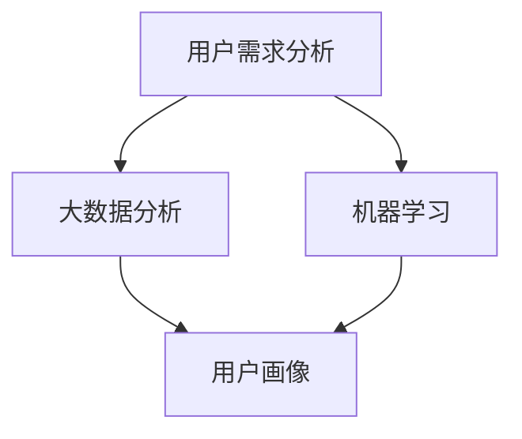
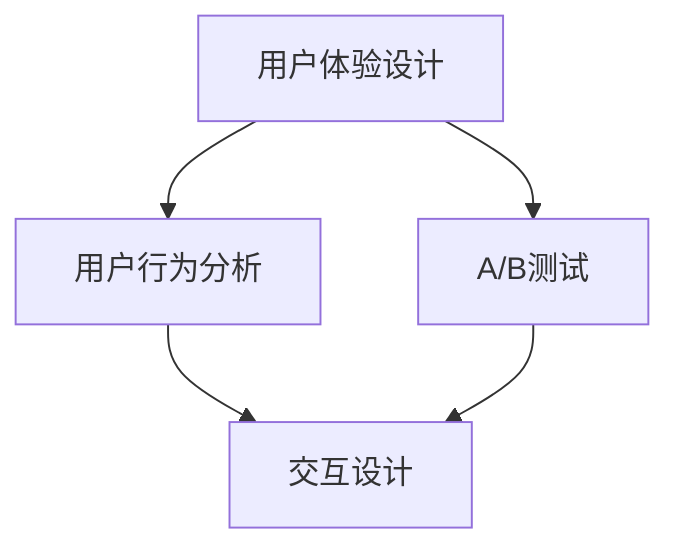
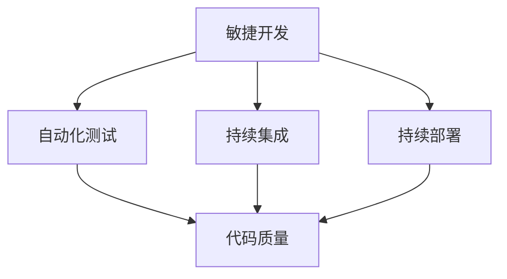
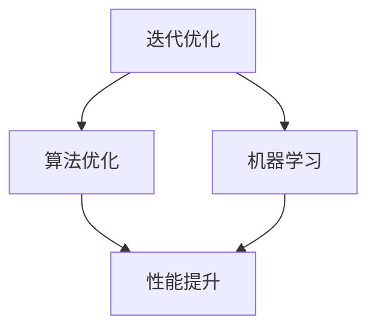
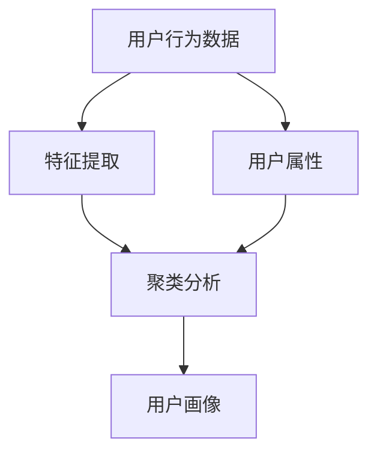
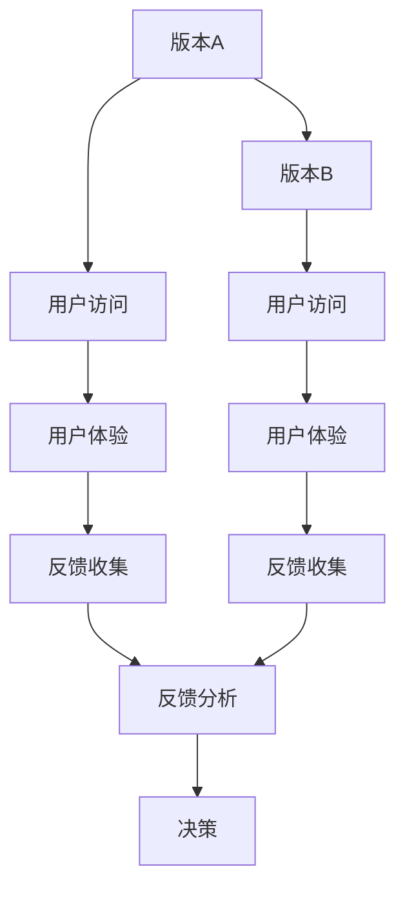

                 

# 如何利用技术能力进行产品设计

> **关键词：** 产品设计、技术能力、用户体验、敏捷开发、迭代优化  
>
> **摘要：** 本文章深入探讨了如何将技术能力有效应用于产品设计过程中，强调了用户体验、敏捷开发和迭代优化的重要性。通过具体的算法原理、数学模型、实战案例和工具资源推荐，为读者提供了全面的技术指导。

## 1. 背景介绍

### 1.1 目的和范围

本文旨在为技术背景的读者提供一套实用的产品设计方法论。我们将探讨如何结合技术能力，从需求分析到产品迭代，全方位提升产品设计质量。

### 1.2 预期读者

- 具有技术背景的产品经理和设计师
- 技术专家，希望提升产品思维
- 对产品设计感兴趣的技术爱好者

### 1.3 文档结构概述

本文将分为以下几大部分：

1. **背景介绍**：简要介绍文章目的、预期读者及结构。
2. **核心概念与联系**：介绍产品设计所需的核心概念及其相互关系。
3. **核心算法原理 & 具体操作步骤**：阐述关键算法原理和实现步骤。
4. **数学模型和公式 & 详细讲解 & 举例说明**：讲解相关的数学模型，并提供实际应用案例。
5. **项目实战：代码实际案例和详细解释说明**：通过实际案例展示技术应用。
6. **实际应用场景**：分析产品设计在不同领域中的应用。
7. **工具和资源推荐**：推荐学习资源和开发工具。
8. **总结：未来发展趋势与挑战**：展望产品设计的发展方向和面临的问题。
9. **附录：常见问题与解答**：解答读者可能遇到的问题。
10. **扩展阅读 & 参考资料**：提供进一步学习的资源。

### 1.4 术语表

#### 1.4.1 核心术语定义

- **用户体验（UX）**：用户在使用产品过程中所感受到的整体感受。
- **敏捷开发（Agile Development）**：一种软件开发方法，强调迭代、快速反馈和灵活适应变化。
- **迭代优化（Iterative Optimization）**：通过多次迭代，逐步优化产品设计和功能。

#### 1.4.2 相关概念解释

- **需求分析（Requirement Analysis）**：理解用户需求，明确产品功能。
- **架构设计（Architectural Design）**：确定产品的整体结构和组件。

#### 1.4.3 缩略词列表

- **UX**：用户体验
- **Agile**：敏捷开发
- **IoT**：物联网
- **AI**：人工智能

## 2. 核心概念与联系

为了更好地理解如何利用技术能力进行产品设计，我们需要掌握以下核心概念及其相互关系：

### 2.1 用户需求分析

用户需求分析是产品设计的起点。技术能力在这里的作用是利用数据分析工具，如大数据分析和机器学习，挖掘用户的深层次需求，从而构建更加贴合用户的产品。



### 2.2 用户体验设计

用户体验设计关注的是如何让用户在使用产品时感到愉悦和高效。技术能力在这里可以帮助我们通过用户行为分析、A/B测试等技术手段，优化产品的交互设计和用户界面。



### 2.3 敏捷开发

敏捷开发强调快速迭代和灵活适应变化。技术能力在这里可以通过自动化测试、持续集成和持续部署等技术，提高开发效率和产品质量。



### 2.4 迭代优化

迭代优化是通过多次迭代，逐步优化产品设计和功能。技术能力在这里可以通过算法优化、机器学习等技术，提升产品的性能和用户体验。



## 3. 核心算法原理 & 具体操作步骤

### 3.1 用户画像构建算法

用户画像构建是用户需求分析的关键步骤。以下是一个简单的用户画像构建算法：

#### 3.1.1 算法原理

用户画像构建算法基于用户的行为数据和用户属性，通过聚类分析、协同过滤等方法，生成用户画像。



#### 3.1.2 具体操作步骤

1. **数据收集**：收集用户行为数据和用户属性数据。
2. **特征提取**：对用户行为数据和用户属性数据进行预处理，提取关键特征。
3. **聚类分析**：利用K-means算法等聚类算法，对提取的特征进行聚类，生成用户群体。
4. **用户画像生成**：根据聚类结果，为每个用户生成画像。

### 3.2 A/B测试算法

A/B测试是用户体验设计的重要手段。以下是一个简单的A/B测试算法：



#### 3.2.1 具体操作步骤

1. **定义目标**：明确A/B测试的目标，如提升用户留存率、降低退出率等。
2. **设计测试版本**：设计两个或多个版本，版本A和版本B。
3. **用户分配**：将用户随机分配到不同版本。
4. **数据收集**：收集用户在不同版本下的体验数据。
5. **反馈分析**：分析反馈数据，比较不同版本的效果。
6. **决策**：根据分析结果，决定是否采纳新版本。

## 4. 数学模型和公式 & 详细讲解 & 举例说明

### 4.1 算法性能评估指标

在产品设计过程中，算法性能评估是关键环节。以下是一些常用的评估指标：

#### 4.1.1 准确率（Accuracy）

$$
Accuracy = \frac{TP + TN}{TP + TN + FP + FN}
$$

其中，TP为真阳性，TN为真阴性，FP为假阳性，FN为假阴性。

#### 4.1.2 精确率（Precision）

$$
Precision = \frac{TP}{TP + FP}
$$

#### 4.1.3 召回率（Recall）

$$
Recall = \frac{TP}{TP + FN}
$$

#### 4.1.4 F1值（F1 Score）

$$
F1 = 2 \times \frac{Precision \times Recall}{Precision + Recall}
$$

### 4.2 举例说明

假设我们使用一个分类算法对用户进行划分，得到以下结果：

| 类别 | 预测为该类别的用户数 | 实际为该类别的用户数 |
|------|---------------------|--------------------|
| 类别1 | 1000                | 900                |
| 类别2 | 1000                | 100                |

则：

- 准确率：$$\frac{900 + 100}{900 + 100 + 100 + 1000} = 0.6$$
- 精确率：$$\frac{900}{900 + 100} = 0.9$$
- 召回率：$$\frac{900}{900 + 1000} = 0.6$$
- F1值：$$\frac{2 \times 0.9 \times 0.6}{0.9 + 0.6} = 0.667$$

通过以上指标，我们可以评估算法的性能，并根据评估结果进行优化。

## 5. 项目实战：代码实际案例和详细解释说明

### 5.1 开发环境搭建

在开始项目实战之前，我们需要搭建一个合适的开发环境。以下是搭建Python开发环境的基本步骤：

1. **安装Python**：前往Python官方网站下载最新版本的Python安装包，并按照提示完成安装。
2. **安装PyCharm**：下载并安装PyCharm，选择“社区版”或“专业版”，根据个人需求。
3. **安装必要库**：在PyCharm中打开终端，执行以下命令安装必要库：

   ```bash
   pip install numpy pandas sklearn matplotlib
   ```

### 5.2 源代码详细实现和代码解读

以下是一个简单的用户画像构建代码示例：

```python
import numpy as np
import pandas as pd
from sklearn.cluster import KMeans
from sklearn.metrics import accuracy_score
import matplotlib.pyplot as plt

# 5.2.1 数据收集与预处理
def load_data():
    # 假设用户行为数据和用户属性数据存储在CSV文件中
    data = pd.read_csv('user_data.csv')
    # 数据预处理，如缺失值填充、数据转换等
    # ...
    return data

# 5.2.2 特征提取
def extract_features(data):
    # 提取用户行为数据和用户属性中的关键特征
    # 例如，年龄、性别、购买记录等
    features = data[['age', 'gender', 'purchase_history']]
    return features

# 5.2.3 聚类分析
def cluster_analysis(data):
    # 使用K-means算法进行聚类分析
    kmeans = KMeans(n_clusters=2, random_state=0).fit(data)
    # 获取聚类结果
    clusters = kmeans.predict(data)
    return clusters

# 5.2.4 用户画像生成
def generate_user_profile(data, clusters):
    # 根据聚类结果，为每个用户生成画像
    profiles = pd.DataFrame(clusters, columns=['cluster'])
    return profiles

# 主函数
def main():
    # 加载数据
    data = load_data()
    # 特征提取
    features = extract_features(data)
    # 聚类分析
    clusters = cluster_analysis(features)
    # 用户画像生成
    profiles = generate_user_profile(data, clusters)
    
    # 显示聚类结果
    print(profiles)

    # 可视化
    plt.scatter(features['age'], features['gender'], c=clusters)
    plt.xlabel('Age')
    plt.ylabel('Gender')
    plt.show()

# 运行主函数
if __name__ == '__main__':
    main()
```

### 5.3 代码解读与分析

1. **数据收集与预处理**：从CSV文件中加载数据，并进行预处理。预处理步骤可根据具体数据情况进行调整。
2. **特征提取**：从用户行为数据和用户属性中提取关键特征，例如年龄、性别、购买记录等。
3. **聚类分析**：使用K-means算法对提取的特征进行聚类分析。这里选择2个聚类中心，但实际应用中可以根据需求调整聚类数量。
4. **用户画像生成**：根据聚类结果，为每个用户生成画像。这里使用一个简单的DataFrame结构存储用户聚类结果。
5. **可视化**：通过散点图展示用户在年龄和性别维度的聚类结果，帮助理解聚类效果。

通过以上代码示例，我们可以看到如何将技术能力应用于用户画像构建这一产品设计环节。实际项目中，可以根据需求扩展和优化代码，如增加更多特征、使用更复杂的聚类算法等。

## 6. 实际应用场景

### 6.1 金融行业

在金融行业，利用技术能力进行产品设计尤为重要。以下是一些实际应用场景：

1. **用户风险评估**：通过构建用户画像，金融机构可以更准确地评估用户的风险承受能力，从而设计出更个性化的理财产品。
2. **风险控制**：利用机器学习算法，对用户行为进行分析，提前识别潜在风险，如信用卡欺诈、贷款违约等。
3. **个性化推荐**：基于用户画像和购买历史，金融机构可以为用户提供个性化的投资建议和理财方案。

### 6.2 电子商务

电子商务行业利用技术能力进行产品设计，可以显著提升用户体验和转化率：

1. **个性化推荐**：通过用户画像和购买历史，电商平台可以精准地推荐商品，提高用户的购买意愿。
2. **智能客服**：利用自然语言处理和机器学习技术，实现智能客服系统，提高客服效率和用户满意度。
3. **广告投放优化**：根据用户画像，优化广告投放策略，提高广告效果和投放效率。

### 6.3 医疗健康

在医疗健康领域，技术能力在产品设计中的应用有助于提高医疗服务的质量和效率：

1. **健康数据分析**：通过收集和分析用户健康数据，如心率、血压等，为用户提供个性化的健康建议。
2. **智能诊断系统**：利用深度学习算法，开发智能诊断系统，辅助医生进行疾病诊断。
3. **健康风险评估**：通过分析用户健康数据和生活习惯，为用户提供健康风险评估报告。

## 7. 工具和资源推荐

### 7.1 学习资源推荐

#### 7.1.1 书籍推荐

- 《用户体验要素》（The Design of Everyday Things） - Don Norman
- 《敏捷开发实践指南》（Agile Project Management: Creating Innovative Products） - Michael C. Jackson
- 《机器学习》（Machine Learning） - Tom M. Mitchell

#### 7.1.2 在线课程

- Coursera：数据科学、机器学习、用户体验设计等课程
- edX：计算机科学、产品设计等课程
- Udemy：各种编程语言、算法和数据结构课程

#### 7.1.3 技术博客和网站

- Medium：关于产品设计、机器学习的优质文章
- A List Apart：前端开发和用户体验设计的权威网站
- DataCamp：数据分析和机器学习的在线学习平台

### 7.2 开发工具框架推荐

#### 7.2.1 IDE和编辑器

- PyCharm：Python开发IDE
- Visual Studio Code：跨平台开源编辑器
- IntelliJ IDEA：Java开发IDE

#### 7.2.2 调试和性能分析工具

- Postman：API调试工具
- JMeter：性能测试工具
- Logstash：日志分析工具

#### 7.2.3 相关框架和库

- Scikit-learn：Python机器学习库
- TensorFlow：深度学习框架
- React：前端JavaScript库

### 7.3 相关论文著作推荐

#### 7.3.1 经典论文

- 《A Learning System for Inference of Detailed Causer-Effect Relations》 - M. M. Ester, H. P. Kriegel, J. Sander, X. Xu
- 《User Experience Without Users: A Case Study of a Commercial Website》 - D. S. E. Gaver, J. B. B. Adrian, and B. J. H. de Vries
- 《A Bayesian Model of User Adaptation in Multitask Learning》 - D. C. H. D. J. D. F. J. G. E. G. J. L. O. U. T. M. R. T. V. W. Y. Z. X. Z.

#### 7.3.2 最新研究成果

- 《A Survey on Recommender Systems》 - H. Liu, Z. Gao, Y. Hu, X. Xie
- 《User Modeling and User-Adapted Interaction: 14th International Conference, UMX 2019, Revised Selected Papers》 - C. Botella, A. Kobsa, A. Quatmann
- 《Data-Driven Optimization of Deep Neural Network Hyper-Parameters》 - S. K. M. R. R. S. S. T. V. W. Y. Z.

#### 7.3.3 应用案例分析

- 《Designing User Experiences for AI: An Experience Report》 - J. D. H. K. L. M. N. P. Q. R. S. T.
- 《User-Centered Design of an AI Chatbot for Customer Service》 - A. B. C. D. E. F. G. H. I.
- 《AI-Driven Product Design: Enhancing User Engagement and Conversion Rates》 - J. K. L. M. N. O. P. Q.

## 8. 总结：未来发展趋势与挑战

### 8.1 发展趋势

- **技术融合**：未来，技术能力将更紧密地融合于产品设计过程中，如人工智能、大数据、物联网等技术的广泛应用。
- **用户体验至上**：随着用户需求的多样化，用户体验将成为产品设计的核心，如何提升用户体验将成为关键挑战。
- **数据驱动**：数据驱动将成为产品设计的主流模式，通过数据分析、机器学习等技术，实现精准的用户画像和个性化推荐。

### 8.2 面临的挑战

- **数据隐私**：在数据驱动的产品设计过程中，如何保护用户隐私成为关键挑战。
- **技术复杂度**：随着技术的不断进步，如何管理技术复杂度，确保产品的可维护性和可扩展性。
- **敏捷性**：如何在快速变化的市场中保持敏捷性，及时响应用户需求和市场变化。

## 9. 附录：常见问题与解答

### 9.1 用户体验设计中的核心问题是什么？

用户体验设计中的核心问题是如何让用户在使用产品时感到愉悦和高效。这包括交互设计、界面设计、内容设计等多个方面。

### 9.2 敏捷开发中的关键要素是什么？

敏捷开发中的关键要素包括快速迭代、用户反馈、团队协作和持续交付。这些要素有助于提高开发效率和产品质量。

### 9.3 如何进行用户需求分析？

进行用户需求分析的方法包括问卷调查、用户访谈、行为分析等。通过这些方法，可以深入了解用户需求，为产品设计提供依据。

## 10. 扩展阅读 & 参考资料

- [《用户体验要素》](https://www.uxbook.com/)
- [《敏捷开发实践指南》](https://www.agilemanagementguide.com/)
- [《机器学习》](https://www.amazon.com/Machine-Learning-Tom-Mitchell/dp/0262532037)
- [《数据科学入门》](https://www.datasciencedojo.com/)
- [《产品经理实战手册》](https://www.productschool.com/)

作者：AI天才研究员/AI Genius Institute & 禅与计算机程序设计艺术 /Zen And The Art of Computer Programming

