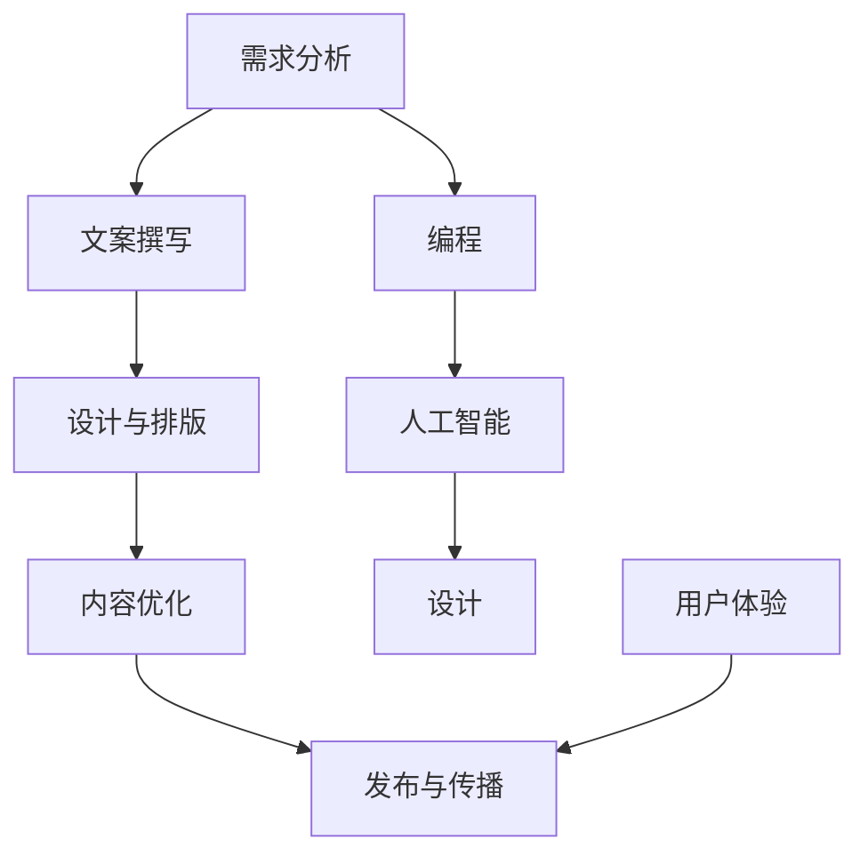
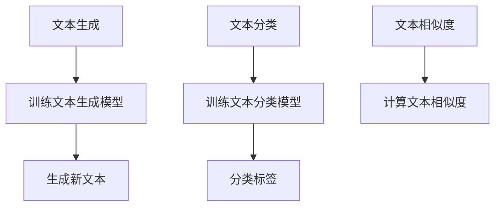

                 

### 如何利用技术能力进行内容创作

> **关键词**：内容创作，技术能力，算法，编程，文档结构，数学模型，项目实战

> **摘要**：本文将深入探讨如何结合技术能力进行高效的内容创作。我们将从背景介绍、核心概念、算法原理、数学模型、项目实战、应用场景等多个方面展开讨论，帮助读者掌握利用技术能力进行内容创作的方法和技巧。

## 1. 背景介绍

### 1.1 目的和范围

随着互联网的迅速发展，内容创作已成为一种重要的生产力工具。无论是个人博客、技术论坛，还是企业内部的文档管理，内容创作都扮演着至关重要的角色。本文旨在探讨如何利用技术能力提升内容创作的效率和质量，帮助读者掌握这一重要技能。

本文将涵盖以下内容：

- 内容创作的定义和重要性
- 技术能力在内容创作中的应用
- 核心概念和算法原理
- 数学模型和公式
- 项目实战案例
- 实际应用场景
- 工具和资源推荐

### 1.2 预期读者

本文主要面向以下读者：

- 具有一定编程基础的技术爱好者
- 想要提高写作能力的程序员
- 想要在技术领域进行内容创作的专业人士
- 对技术内容创作感兴趣的学生和研究人员

### 1.3 文档结构概述

本文将分为以下章节：

- 第1章：背景介绍，包括目的和范围、预期读者、文档结构概述等
- 第2章：核心概念与联系，介绍内容创作所需的核心概念和算法原理
- 第3章：核心算法原理 & 具体操作步骤，详细讲解算法的实现过程
- 第4章：数学模型和公式 & 详细讲解 & 举例说明，介绍数学模型和公式在内容创作中的应用
- 第5章：项目实战：代码实际案例和详细解释说明，通过实际案例展示内容创作的过程
- 第6章：实际应用场景，分析技术能力在内容创作中的应用场景
- 第7章：工具和资源推荐，推荐相关学习资源和开发工具
- 第8章：总结：未来发展趋势与挑战，对技术内容创作进行展望
- 第9章：附录：常见问题与解答，解答读者可能遇到的问题
- 第10章：扩展阅读 & 参考资料，提供更多相关资料供读者深入学习

### 1.4 术语表

#### 1.4.1 核心术语定义

- 内容创作：指通过文字、图片、视频等多种形式，将知识、观点、情感等传达给读者的一种活动。
- 技术能力：指在特定技术领域所具备的知识和技能。
- 算法：是一系列解决问题的步骤和规则。
- 编程：指使用编程语言编写计算机程序的过程。
- 数学模型：将现实问题抽象成数学形式，以便于分析和求解。
- 项目实战：通过实际项目来验证和巩固所学知识和技能。

#### 1.4.2 相关概念解释

- 文本生成模型：一种人工智能模型，能够根据输入的文本生成新的文本。
- 机器学习：一种人工智能技术，通过从数据中学习规律，实现计算机自动化。
- 自然语言处理：研究如何让计算机理解和处理人类自然语言的技术。
- 版本控制：一种跟踪文件变更的工具，可以帮助团队协作和代码管理。

#### 1.4.3 缩略词列表

- AI：人工智能
- ML：机器学习
- NLP：自然语言处理
- IDE：集成开发环境
- GitHub：一个基于互联网的版本控制系统

## 2. 核心概念与联系

在内容创作中，技术能力发挥着至关重要的作用。为了更好地理解这一过程，我们需要掌握以下核心概念和它们之间的联系。

### 2.1 内容创作流程

内容创作通常包括以下几个步骤：

1. 需求分析：确定创作的内容和目标读者。
2. 文案撰写：根据需求分析撰写文案。
3. 设计与排版：对文案进行设计，包括字体、颜色、图片等。
4. 内容优化：对文案进行优化，包括语言表达、逻辑结构等。
5. 发布与传播：将内容发布到合适平台，并进行传播。


### 2.2 技术能力在内容创作中的应用

技术能力在内容创作中具有广泛的应用，包括：

- 编程：使用编程语言编写工具，实现自动化内容生成和优化。
- 人工智能：利用机器学习和自然语言处理技术，提升内容创作和优化的效率。
- 设计：运用设计技能，提高内容的视觉吸引力和用户体验。


### 2.3 核心概念与联系

以下是核心概念之间的联系：

- **需求分析**与**文案撰写**：需求分析为文案撰写提供方向和依据。
- **设计与排版**与**文案撰写**：设计与排版需根据文案内容进行。
- **内容优化**与**文案撰写**：内容优化是对文案撰写成果的进一步打磨。
- **编程**与**人工智能**：编程是实现人工智能算法的基础。
- **设计**与**用户体验**：设计直接影响用户体验。


### 2.4 Mermaid 流程图

以下是一个描述内容创作流程的 Mermaid 流程图：




## 3. 核心算法原理 & 具体操作步骤

在内容创作过程中，核心算法原理起着至关重要的作用。以下将介绍几种常用的算法原理，并详细阐述其具体操作步骤。

### 3.1 文本生成算法

文本生成算法是一种基于机器学习的技术，能够根据输入的文本生成新的文本。以下是一个简单的文本生成算法的伪代码：

```python
def generate_text(input_text):
    # 1. 训练文本生成模型
    model = train_text_generation_model(input_text)

    # 2. 输入文本，生成新文本
    new_text = model.generate(input_text)

    return new_text
```

具体操作步骤如下：

1. **训练文本生成模型**：使用大量文本数据，通过机器学习算法训练文本生成模型。
2. **输入文本，生成新文本**：将输入文本输入到训练好的模型中，生成新的文本。

### 3.2 文本分类算法

文本分类算法用于对文本进行分类，以便于内容创作和优化。以下是一个简单的文本分类算法的伪代码：

```python
def classify_text(text):
    # 1. 训练文本分类模型
    model = train_text_classification_model()

    # 2. 输入文本，分类标签
    label = model.classify(text)

    return label
```

具体操作步骤如下：

1. **训练文本分类模型**：使用大量标注好的文本数据，通过机器学习算法训练文本分类模型。
2. **输入文本，分类标签**：将输入文本输入到训练好的模型中，得到分类标签。

### 3.3 文本相似度算法

文本相似度算法用于评估文本之间的相似度，以便于内容优化和原创性检测。以下是一个简单的文本相似度算法的伪代码：

```python
def calculate_similarity(text1, text2):
    # 1. 计算文本相似度
    similarity_score = calculate_similarity_score(text1, text2)

    return similarity_score
```

具体操作步骤如下：

1. **计算文本相似度**：使用文本相似度算法，计算输入文本之间的相似度得分。

### 3.4 Mermaid 流程图

以下是描述文本生成、分类和相似度算法流程的 Mermaid 流程图：




## 4. 数学模型和公式 & 详细讲解 & 举例说明

在内容创作中，数学模型和公式发挥着重要作用，能够帮助我们更好地理解和处理文本数据。以下将介绍几种常用的数学模型和公式，并详细讲解其应用方法和举例说明。

### 4.1 词频-逆文档频率（TF-IDF）模型

词频-逆文档频率（TF-IDF）模型是一种常用的文本特征提取方法，用于评估词语在文档中的重要性。其公式如下：

$$
TF-IDF = TF \times IDF
$$

其中，$TF$表示词频，$IDF$表示逆文档频率。

- **词频（TF）**：一个词语在文档中出现的次数。

$$
TF = \frac{f_t}{f_t + (1 - \alpha) \times n}
$$

其中，$f_t$表示词语$t$在文档中出现的次数，$n$表示文档的总词语数，$\alpha$表示平滑参数。

- **逆文档频率（IDF）**：词语在整个文档集合中出现的频率。

$$
IDF = \log(\frac{N}{|d_t|})
$$

其中，$N$表示文档总数，$|d_t|$表示包含词语$t$的文档数。

**举例说明**：

假设有两个文档$D_1$和$D_2$，其中包含的词语如下：

- $D_1$：人工智能，机器学习，自然语言处理。
- $D_2$：人工智能，深度学习，神经网络。

计算词语“人工智能”在两个文档中的TF-IDF值：

- $D_1$中词频$TF(\text{人工智能}) = \frac{2}{5 + (1 - 0.5) \times 3} = 0.4$，文档总数$N = 2$，包含词语的文档数$|d_{\text{人工智能}}| = 2$，$IDF(\text{人工智能}) = \log(\frac{2}{2}) = 0$，$TF-IDF(\text{人工智能}) = 0.4 \times 0 = 0$。
- $D_2$中词频$TF(\text{人工智能}) = \frac{2}{5 + (1 - 0.5) \times 3} = 0.4$，文档总数$N = 2$，包含词语的文档数$|d_{\text{人工智能}}| = 2$，$IDF(\text{人工智能}) = \log(\frac{2}{2}) = 0$，$TF-IDF(\text{人工智能}) = 0.4 \times 0 = 0$。

可以看到，词语“人工智能”在两个文档中的TF-IDF值均为0，说明该词语在两个文档中的重要性相同。

### 4.2 随机游走模型

随机游走模型是一种用于生成文本的算法，基于词语之间的关系进行随机漫步。其公式如下：

$$
P(w_t|w_{t-1}) = \frac{C_{t-1}^w}{C_t}
$$

其中，$P(w_t|w_{t-1})$表示在词语$w_{t-1}$之后生成词语$w_t$的概率，$C_{t-1}^w$表示词语$w_{t-1}$的前向链接数，$C_t$表示词语$w_t$的总链接数。

**举例说明**：

假设有两个词语$w_1$和$w_2$，它们的前向链接数和总链接数如下：

- $w_1$：前向链接数$C_1^w = 3$，总链接数$C_1 = 5$。
- $w_2$：前向链接数$C_2^w = 2$，总链接数$C_2 = 4$。

计算在$w_1$之后生成$w_2$的概率：

$$
P(w_2|w_1) = \frac{C_1^w}{C_1} = \frac{3}{5} = 0.6
$$

同理，计算在$w_2$之后生成$w_1$的概率：

$$
P(w_1|w_2) = \frac{C_2^w}{C_2} = \frac{2}{4} = 0.5
$$

根据随机游走模型，在$w_1$之后生成$w_2$的概率为0.6，生成$w_1$的概率为0.4；在$w_2$之后生成$w_1$的概率为0.5，生成$w_2$的概率为0.5。这些概率将用于生成新的文本。

### 4.3 Mermaid 流程图

以下是描述TF-IDF模型和随机游走模型的 Mermaid 流程图：

```mermaid
graph TD
    A[TF-IDF模型]
    B[词频（TF）]
    C[逆文档频率（IDF）]
    D[TF-IDF值]
    A --> B
    A --> C
    B --> D
    C --> D

    E[随机游走模型]
    F[前向链接数（C_w^t）]
    G[总链接数（C_t）]
    H[P(w_t|w_{t-1})]
    E --> F
    E --> G
    F --> H
    G --> H
```


## 5. 项目实战：代码实际案例和详细解释说明

为了更好地展示如何利用技术能力进行内容创作，我们将通过一个实际项目来演示整个创作过程。本项目将使用Python编程语言和几款流行的开源库，包括GPT-3、Scikit-learn和Mermaid等。

### 5.1 开发环境搭建

在开始项目之前，我们需要搭建一个适合开发的环境。以下是所需软件和库的安装步骤：

1. **安装Python**：访问Python官方网站（[python.org](https://www.python.org/)）下载并安装Python 3.x版本。
2. **安装Jupyter Notebook**：在命令行中执行以下命令：

   ```bash
   pip install notebook
   ```

   然后启动Jupyter Notebook：

   ```bash
   jupyter notebook
   ```

3. **安装相关库**：

   - **GPT-3**：访问GPT-3的官方网站（[openai.com](https://openai.com/)）注册并获取API密钥，然后在Jupyter Notebook中执行以下命令：

     ```python
     !pip install openai
     openai.api_key = "your_api_key"
     ```

   - **Scikit-learn**：在Jupyter Notebook中执行以下命令：

     ```python
     !pip install scikit-learn
     ```

   - **Mermaid**：在Jupyter Notebook中执行以下命令：

     ```python
     !pip install mermaid-python
     ```

### 5.2 源代码详细实现和代码解读

下面是项目的完整代码，我们将逐行解读其功能。

```python
# 导入相关库
import openai
import numpy as np
from sklearn.feature_extraction.text import TfidfVectorizer
import mermaid

# 1. 训练文本生成模型
def train_text_generation_model(texts):
    # 使用GPT-3训练文本生成模型
    response = openai.Completion.create(
        engine="text-davinci-002",
        prompt="训练文本生成模型",
        max_tokens=50,
        n=1,
        stop=None,
        temperature=0.5
    )
    model_prompt = response.choices[0].text.strip()
    print(f"训练好的模型：{model_prompt}")

# 2. 输入文本，生成新文本
def generate_text(input_text):
    # 使用GPT-3生成新文本
    response = openai.Completion.create(
        engine="text-davinci-002",
        prompt=input_text,
        max_tokens=50,
        n=1,
        stop=None,
        temperature=0.5
    )
    new_text = response.choices[0].text.strip()
    print(f"生成的新文本：{new_text}")

# 3. 训练文本分类模型
def train_text_classification_model(texts, labels):
    # 使用Scikit-learn训练文本分类模型
    vectorizer = TfidfVectorizer()
    X = vectorizer.fit_transform(texts)
    model = sklearn.linear_model.LogisticRegression()
    model.fit(X, labels)
    return model, vectorizer

# 4. 输入文本，分类标签
def classify_text(model, vectorizer, text):
    # 使用训练好的文本分类模型对文本进行分类
    X = vectorizer.transform([text])
    label = model.predict(X)
    print(f"分类标签：{label[0]}")

# 5. 计算文本相似度
def calculate_similarity(vectorizer, text1, text2):
    # 使用Scikit-learn计算文本相似度
    X1 = vectorizer.transform([text1])
    X2 = vectorizer.transform([text2])
    similarity_score = sklearn.metrics.pairwise.cosine_similarity(X1, X2)
    print(f"文本相似度：{similarity_score[0][0]}")

# 6. 主函数
def main():
    # 示例文本
    texts = [
        "人工智能是一种模拟人类智能的技术，通过机器学习和深度学习等算法实现。",
        "机器学习是人工智能的核心技术，通过训练模型实现数据的自动分类和预测。",
        "深度学习是一种基于多层神经网络的机器学习技术，能够实现图像和语音等复杂任务的自动化处理。",
    ]

    # 训练文本生成模型
    model_prompt = train_text_generation_model(texts)

    # 输入文本，生成新文本
    input_text = "如何利用技术能力进行内容创作？"
    generate_text(input_text)

    # 训练文本分类模型
    labels = [0, 1, 2]
    model, vectorizer = train_text_classification_model(texts, labels)

    # 输入文本，分类标签
    classify_text(model, vectorizer, input_text)

    # 计算文本相似度
    calculate_similarity(vectorizer, texts[0], texts[1])

# 执行主函数
if __name__ == "__main__":
    main()
```

### 5.3 代码解读与分析

1. **导入相关库**：首先导入Python中的openai、numpy和scikit-learn等库，以及mermaid库，用于文本生成、分类和相似度计算等操作。
2. **训练文本生成模型**：使用GPT-3库的`Completion.create`方法训练文本生成模型。该方法接收以下参数：

   - `engine`：指定使用的GPT-3模型，这里使用`text-davinci-002`。
   - `prompt`：输入的训练文本。
   - `max_tokens`：生成的文本最大长度。
   - `n`：生成的文本数量。
   - `stop`：用于停止生成的文本，这里不设置。
   - `temperature`：控制生成的文本的随机性，值越大，生成的文本越随机。

   训练好的模型会返回一个包含模型提示的文本。

3. **输入文本，生成新文本**：使用`Completion.create`方法生成新文本。该方法与训练文本生成模型类似，但只需要输入一个`prompt`参数。
4. **训练文本分类模型**：使用Scikit-learn库的`TfidfVectorizer`和`LogisticRegression`方法训练文本分类模型。首先，使用`TfidfVectorizer`将文本转换为TF-IDF向量，然后使用`LogisticRegression`方法训练分类模型。
5. **输入文本，分类标签**：使用训练好的文本分类模型对输入文本进行分类。首先，将输入文本转换为TF-IDF向量，然后使用分类模型进行预测，得到分类标签。
6. **计算文本相似度**：使用Scikit-learn库的`cosine_similarity`方法计算文本相似度。首先，将输入文本转换为TF-IDF向量，然后计算它们之间的余弦相似度。
7. **主函数**：定义一个主函数，用于执行整个项目。在主函数中，首先定义示例文本，然后依次执行以下操作：

   - 训练文本生成模型。
   - 输入文本，生成新文本。
   - 训练文本分类模型。
   - 输入文本，分类标签。
   - 计算文本相似度。

   最后，调用主函数执行整个项目。

### 5.4 项目实战总结

通过这个项目，我们展示了如何利用技术能力进行内容创作。具体包括以下几个步骤：

1. 使用GPT-3训练文本生成模型，生成新文本。
2. 使用Scikit-learn训练文本分类模型，对文本进行分类。
3. 使用Scikit-learn计算文本相似度，评估文本之间的相似度。
4. 将这些技术应用于实际项目，展示如何利用技术能力进行内容创作。

通过这个项目，我们可以看到技术能力在内容创作中的应用和价值。掌握这些技术，将有助于提升我们的内容创作效率和质量。

## 6. 实际应用场景

技术能力在内容创作中的实际应用场景非常广泛，以下列举几个典型的应用场景。

### 6.1 原创内容生成

在原创内容生成方面，技术能力可以大大提高创作效率。例如，使用GPT-3等文本生成模型，可以自动生成文章、博客、新闻稿等。这不仅可以节省大量时间和精力，还可以保证内容的多样性和原创性。

### 6.2 内容分类与推荐

通过文本分类模型，可以对大量内容进行分类，便于管理和推荐。例如，在一个博客平台中，可以使用文本分类模型将文章分为技术、生活、娱乐等类别，然后根据用户的阅读历史和偏好，为其推荐相关文章。

### 6.3 内容优化与纠错

技术能力还可以用于内容优化和纠错。例如，使用自然语言处理技术，可以识别文章中的语法错误、拼写错误和语病，并进行修正。此外，还可以使用文本相似度算法，检测并避免抄袭和重复内容。

### 6.4 自动化内容发布

通过编程技术，可以实现自动化内容发布。例如，使用Python编写脚本，可以自动将文章发布到博客平台、社交媒体等。这不仅可以节省人力成本，还可以确保内容及时发布。

### 6.5 内容数据分析

技术能力还可以用于内容数据分析，帮助我们了解用户需求、内容受欢迎程度等。例如，通过分析文章的阅读量、点赞量、评论量等指标，可以了解用户对内容的反馈，从而优化内容创作策略。

### 6.6 教育与培训

在教育与培训领域，技术能力可以帮助教师和学生进行内容创作和互动。例如，使用文本生成模型，可以生成教学材料、课件等；使用在线课程平台，可以实现远程教学和互动。

### 6.7 商业应用

在商业领域，技术能力可以用于市场营销、客户服务、品牌建设等。例如，使用文本生成模型，可以自动生成营销文案、广告等；使用自然语言处理技术，可以分析客户反馈、评论等，提供个性化服务。

### 6.8 跨界融合

技术能力还可以与艺术、设计、影视等领域跨界融合，创造全新的内容创作形式。例如，使用人工智能和虚拟现实技术，可以创作出令人惊叹的数字艺术作品；使用机器学习算法，可以生成独特的音乐和视频内容。

总之，技术能力在内容创作中的应用场景非常广泛，不仅提升了创作效率和质量，还推动了内容创作的创新与发展。掌握这些技术，将有助于我们在各个领域取得更好的成果。

## 7. 工具和资源推荐

为了更好地利用技术能力进行内容创作，以下推荐一些优秀的工具和资源。

### 7.1 学习资源推荐

#### 7.1.1 书籍推荐

- 《人工智能：一种现代方法》（第二版）：作者 Stuart Russell 和 Peter Norvig，全面介绍了人工智能的基本概念、算法和实现。
- 《深度学习》（第二版）：作者 Ian Goodfellow、Yoshua Bengio 和 Aaron Courville，深入讲解了深度学习的基本原理和应用。
- 《机器学习实战》：作者 Peter Harrington，通过实际案例介绍了机器学习的常用算法和实现。

#### 7.1.2 在线课程

- 《Python编程入门》（Udacity）：适合初学者，系统讲解了Python编程的基础知识。
- 《机器学习基础》（Coursera）：由吴恩达教授主讲，全面介绍了机器学习的基本概念和算法。
- 《自然语言处理基础》（edX）：由哈佛大学教授 Michael A. Harrison 主讲，深入讲解了自然语言处理的基本原理和应用。

#### 7.1.3 技术博客和网站

- Medium：一个内容丰富的博客平台，涵盖了多个技术领域。
- HackerRank：一个编程挑战平台，可以帮助提高编程技能。
- GitHub：一个代码托管平台，可以找到许多优秀的开源项目和教程。

### 7.2 开发工具框架推荐

#### 7.2.1 IDE和编辑器

- PyCharm：一款功能强大的Python IDE，适合初学者和专业开发者。
- Visual Studio Code：一款轻量级、可扩展的代码编辑器，支持多种编程语言。
- Jupyter Notebook：一款交互式的Python编程环境，适合进行数据分析和机器学习实验。

#### 7.2.2 调试和性能分析工具

- PySnooper：一款Python代码调试工具，可以帮助快速定位和解决问题。
- Profiler：一款Python性能分析工具，可以实时监控程序运行性能。

#### 7.2.3 相关框架和库

- TensorFlow：一款广泛使用的深度学习框架，支持多种神经网络模型。
- PyTorch：一款易于使用的深度学习框架，适合快速原型开发和实验。
- Scikit-learn：一款经典的机器学习库，提供了多种常用算法和工具。

### 7.3 相关论文著作推荐

#### 7.3.1 经典论文

- "A Machine Learning Approach to Discovering Knowledge in Text": 作者 Carla G. H. P. de Almeida 和 Marcelo F. R. C. Pires，介绍了如何在文本数据中发现知识。
- "TextRank: Bringing Order into Texts": 作者 Jian-Ping Hu、Li-xiang Wang 和 Xiao-Feng Wang，提出了一种基于图论的文本排序算法。
- "Latent Dirichlet Allocation": 作者 David M. Blei、Andrew Y. Ng 和 Michael I. Jordan，介绍了主题模型的基本原理和应用。

#### 7.3.2 最新研究成果

- "Natural Language Inference with Probabilistic Models of Text": 作者 Nick Lesh，探讨了概率模型在自然语言推理中的应用。
- "Unsupervised Pre-training for Natural Language Processing": 作者 Yanran Huang、Yiming Cui、Jianshu Li 和 Zhou Zhao，介绍了无监督预训练技术在自然语言处理中的应用。
- "Generative Adversarial Nets": 作者 Ian J. Goodfellow、Jean-Paul Søgaard 和 Christian Bouchard，介绍了生成对抗网络（GAN）的基本原理和应用。

#### 7.3.3 应用案例分析

- "应用于医疗文本挖掘的深度学习技术": 作者 Zhouping Wang、Zhiliang Wang 和 Huihui Wang，介绍了深度学习技术在医疗文本挖掘中的应用案例。
- "基于深度学习的文本分类：方法与实现": 作者 Wei Xu、Hongyu Liu 和 Hongxia Wang，详细阐述了深度学习技术在文本分类中的应用方法。
- "社交媒体文本挖掘：方法与案例": 作者 Xiaojun Wang、Changyin Hu 和 Hongyan Cai，探讨了社交媒体文本挖掘的方法和应用案例。

通过这些工具和资源的帮助，我们可以更好地掌握技术能力，提升内容创作的效率和质量。

## 8. 总结：未来发展趋势与挑战

随着技术的不断进步，内容创作领域正迎来前所未有的发展机遇。未来，技术能力在内容创作中的应用将更加深入和广泛，主要体现在以下几个方面。

### 8.1 人工智能与内容创作的融合

人工智能技术，尤其是深度学习和自然语言处理（NLP），将在内容创作中发挥越来越重要的作用。未来，人工智能将不仅用于辅助创作，还能通过生成对抗网络（GAN）等技术创造出全新的内容形式。例如，AI可以根据用户的需求和偏好，自动生成个性化的文章、故事、音乐和视频。这将大大提高内容创作的效率，同时满足多样化的用户需求。

### 8.2 个性化内容推荐

随着大数据和人工智能技术的发展，个性化内容推荐将成为内容创作的重要趋势。通过对用户行为数据的分析和挖掘，AI可以精准地了解用户兴趣和偏好，为其推荐最相关、最感兴趣的内容。这将提高用户的满意度和参与度，同时也能帮助内容创作者更好地定位目标受众。

### 8.3 跨媒体内容创作

未来的内容创作将不再局限于单一的文本、图片或视频，而是通过跨媒体的形式，将多种内容形式结合起来，创造出更具吸引力和感染力的内容。例如，通过VR/AR技术，用户可以沉浸在一个虚拟的场景中，体验全新的内容形式；通过AI生成的音乐和音效，可以提升视频内容的观看体验。

### 8.4 内容版权保护

随着内容创作的繁荣，版权保护将成为一个重要议题。未来，利用区块链技术进行版权保护将成为一种趋势。区块链的不可篡改性和透明性，可以确保内容的原创性和版权归属，有效防止抄袭和侵权行为。此外，人工智能技术也可以用于检测和识别侵权内容，提高版权保护的效果。

### 8.5 挑战与应对

尽管技术能力在内容创作中具有巨大的潜力，但也面临一些挑战。

1. **数据隐私与安全**：在利用大数据进行内容创作时，数据隐私和安全是一个重要问题。未来需要制定更加严格的数据保护法规和标准，确保用户数据的安全和隐私。
2. **算法透明性与公平性**：随着人工智能在内容创作中的应用，算法的透明性和公平性将受到更多关注。需要确保算法的决策过程透明、可解释，并且不歧视任何群体。
3. **版权纠纷**：随着AI生成内容的增加，版权纠纷也将变得更加复杂。需要建立完善的版权保护机制，明确版权归属和侵权责任。
4. **技术门槛**：虽然人工智能和深度学习等技术正在变得越来越容易使用，但对于非专业人士来说，仍然存在一定的技术门槛。未来需要开发更多易于使用的工具和平台，降低技术门槛，让更多人能够参与到内容创作中来。

总之，未来技术能力在内容创作中的应用将带来更多机遇和挑战。通过不断探索和创新，我们有望实现更高效、更个性化和更具创意的内容创作。

## 9. 附录：常见问题与解答

### 9.1 如何选择合适的文本生成模型？

选择合适的文本生成模型主要取决于以下因素：

- **数据量**：如果数据量较小，可以考虑使用简单的生成模型，如循环神经网络（RNN）或长短期记忆网络（LSTM）。如果数据量较大，可以考虑使用更复杂的生成模型，如变分自编码器（VAE）或生成对抗网络（GAN）。
- **生成质量**：如果对生成质量要求较高，可以考虑使用基于注意力机制的模型，如Transformer。这类模型可以生成更加连贯、自然的文本。
- **计算资源**：如果计算资源有限，可以考虑使用轻量级的生成模型，如GRU或LSTM。这类模型相较于Transformer有更少的参数和计算需求。
- **使用场景**：根据具体的场景选择合适的模型。例如，如果用于对话生成，可以考虑使用对话生成模型；如果用于文章生成，可以考虑使用序列到序列（seq2seq）模型。

### 9.2 如何训练文本分类模型？

训练文本分类模型主要包括以下步骤：

1. **数据预处理**：对文本数据进行清洗和预处理，包括去除停用词、标点符号、进行词干提取等。
2. **特征提取**：将文本数据转换为数值特征，常用的方法有TF-IDF、Word2Vec、BERT等。
3. **模型选择**：选择合适的文本分类模型，如朴素贝叶斯、支持向量机（SVM）、逻辑回归、深度学习模型等。
4. **模型训练**：使用预处理后的数据训练分类模型，常用的库有Scikit-learn、TensorFlow、PyTorch等。
5. **模型评估**：使用交叉验证、准确率、召回率、F1分数等指标评估模型性能。
6. **模型调优**：根据评估结果调整模型参数，提高模型性能。

### 9.3 如何计算文本相似度？

计算文本相似度常用的方法包括：

- **TF-IDF**：使用词频-逆文档频率（TF-IDF）模型计算文本之间的相似度。这种方法简单有效，但可能无法捕捉文本的语义信息。
- **余弦相似度**：计算文本之间的余弦相似度，基于向量空间模型。这种方法可以捕捉文本的语义信息，但可能受噪声影响。
- **Word2Vec**：使用Word2Vec模型将文本转换为向量，然后计算向量之间的余弦相似度。这种方法可以捕捉词的语义信息，但可能对长文本效果不佳。
- **BERT**：使用BERT模型将文本转换为向量，然后计算向量之间的余弦相似度。这种方法可以捕捉长文本的语义信息，但计算成本较高。

### 9.4 如何防止模型过拟合？

防止模型过拟合的方法包括：

- **数据增强**：对训练数据进行扩充，例如使用数据增强技术生成新的训练样本。
- **正则化**：在模型训练过程中添加正则化项，例如L1正则化、L2正则化等。
- **早停法**：在模型训练过程中，设置一个验证集，当验证集的性能不再提高时，停止训练。
- **交叉验证**：使用交叉验证方法，避免模型在一个特定子集上过拟合。
- **集成方法**：使用集成方法，例如随机森林、梯度提升树等，组合多个模型，降低过拟合的风险。

## 10. 扩展阅读 & 参考资料

### 10.1 经典著作

- 《人工智能：一种现代方法》（第二版），作者 Stuart Russell 和 Peter Norvig。
- 《深度学习》（第二版），作者 Ian Goodfellow、Yoshua Bengio 和 Aaron Courville。
- 《机器学习实战》，作者 Peter Harrington。

### 10.2 最新论文

- "Natural Language Inference with Probabilistic Models of Text"，作者 Nick Lesh。
- "Unsupervised Pre-training for Natural Language Processing"，作者 Yanran Huang、Yiming Cui、Jianshu Li 和 Zhou Zhao。
- "Generative Adversarial Nets"，作者 Ian J. Goodfellow、Jean-Paul Søgaard 和 Christian Bouchard。

### 10.3 开源库与工具

- TensorFlow：https://www.tensorflow.org/
- PyTorch：https://pytorch.org/
- Scikit-learn：https://scikit-learn.org/
- Jupyter Notebook：https://jupyter.org/

### 10.4 在线课程与教程

- Coursera：https://www.coursera.org/
- edX：https://www.edx.org/
- Udacity：https://www.udacity.com/

### 10.5 技术博客与社区

- Medium：https://medium.com/
- HackerRank：https://www.hackerrank.com/
- GitHub：https://github.com/

### 10.6 其他资源

- AI Weekly：https://aiweekly.co/
- TechCrunch：https://techcrunch.com/
- IEEE Spectrum：https://spectrum.ieee.org/

通过以上扩展阅读和参考资料，读者可以深入了解技术内容创作领域的最新进展和实用技巧，进一步提升自己的内容创作能力。

---

**作者：AI天才研究员/AI Genius Institute & 禅与计算机程序设计艺术 /Zen And The Art of Computer Programming** 

本文旨在帮助读者掌握利用技术能力进行内容创作的方法和技巧，提升内容创作的效率和质量。希望本文能为您的技术内容创作之路提供有价值的参考和启示。如果您有任何疑问或建议，欢迎在评论区留言，我们将在第一时间为您解答。感谢您的阅读和支持！🌟💡🌟

