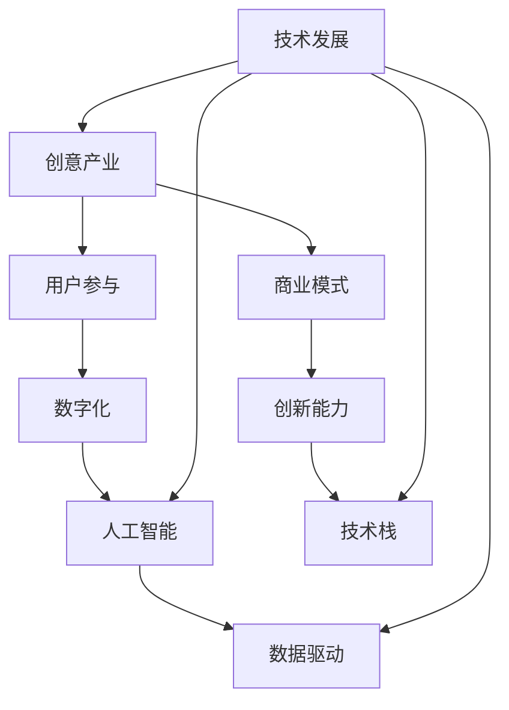
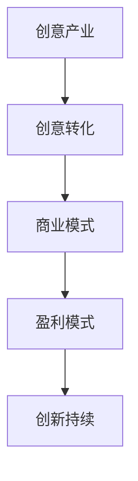
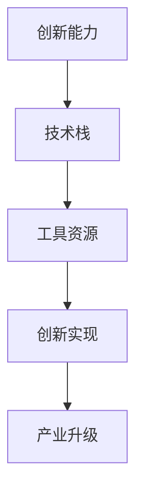
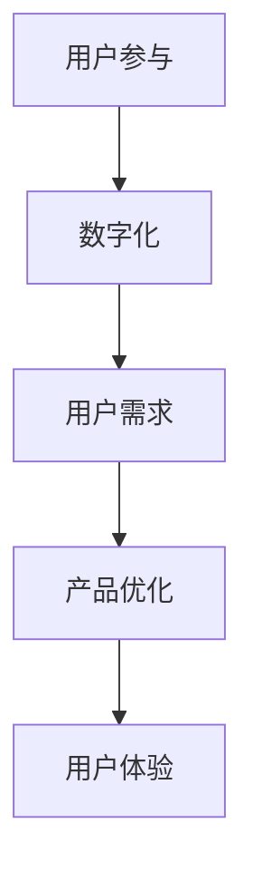
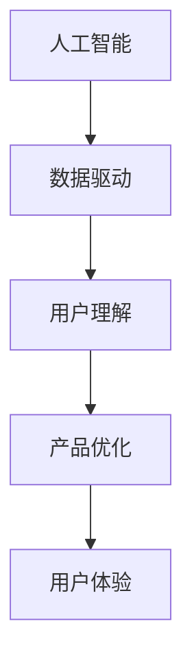

                 

# 如何利用技术能力进行创意产业革新

> **关键词**：创意产业、技术革新、人工智能、数字化、用户参与、商业模式

> **摘要**：本文旨在探讨如何利用技术能力推动创意产业的革新。通过分析当前创意产业面临的问题和挑战，本文将介绍一系列技术手段，如人工智能、数字化和用户参与等，并阐述它们在创意产业中的应用方法和实践案例。此外，还将探讨这些技术如何重新定义商业模式，促进产业创新和可持续发展。

## 1. 背景介绍

### 1.1 目的和范围

本文旨在探讨如何利用技术能力推动创意产业的革新。随着数字技术的快速发展，创意产业正面临前所未有的机遇和挑战。传统商业模式受到冲击，用户体验需求不断提升，市场竞争加剧。本文将通过分析当前创意产业面临的问题和挑战，介绍一系列技术手段，如人工智能、数字化和用户参与等，并探讨它们在创意产业中的应用方法和实践案例。

### 1.2 预期读者

本文适合以下读者群体：

- 创意产业从业者，如设计师、艺术家、广告人等；
- 技术开发者，如程序员、数据科学家等；
- 创意产业相关领域的学者和研究者；
- 对创意产业和技术革新感兴趣的一般读者。

### 1.3 文档结构概述

本文将分为八个主要部分：

1. 背景介绍
2. 核心概念与联系
3. 核心算法原理 & 具体操作步骤
4. 数学模型和公式 & 详细讲解 & 举例说明
5. 项目实战：代码实际案例和详细解释说明
6. 实际应用场景
7. 工具和资源推荐
8. 总结：未来发展趋势与挑战

### 1.4 术语表

#### 1.4.1 核心术语定义

- 创意产业：指以创意为核心，通过创作、设计、制作和传播等手段，将创意转化为经济价值和文化价值的产业。
- 人工智能：指通过模拟、延伸和扩展人类智能的技术和方法，实现机器在感知、推理、学习、决策等方面的智能行为。
- 数字化：指将传统产业中的信息、流程、服务等转化为数字形式，通过数字技术实现产业升级和转型。
- 用户参与：指在创意产业中，用户通过互动、反馈和参与等方式，对产品和服务进行定制和优化。

#### 1.4.2 相关概念解释

- 商业模式：指企业通过提供产品或服务，实现价值创造、传递和获取的系统性安排。
- 创新能力：指企业通过创新手段，实现产品、服务、商业模式等方面的新突破和提升。
- 技术栈：指在某个技术领域，开发者所掌握的各种技术和工具的集合。

#### 1.4.3 缩略词列表

- AI：人工智能
- IoT：物联网
- VR：虚拟现实
- AR：增强现实
- ARPU：每用户平均收入
- UX：用户体验
- UI：用户界面

## 2. 核心概念与联系

在探讨如何利用技术能力进行创意产业革新之前，我们需要了解一些核心概念和它们之间的联系。以下是一个简化的 Mermaid 流程图，展示这些核心概念及其相互关系：



### 2.1 创意产业与商业模式的联系

创意产业的核心是创意，而商业模式则是实现创意价值的关键。一个成功的商业模式能够为创意产业提供可持续的盈利模式，促进创新和发展。以下是一个简化的 Mermaid 流程图，展示创意产业与商业模式之间的联系：



### 2.2 创新能力与技术栈的联系

创新能力是创意产业的核心竞争力，而技术栈则是实现创新能力的重要基础。一个完善的技术栈能够为创意产业提供丰富的工具和资源，促进创新和发展。以下是一个简化的 Mermaid 流程图，展示创新能力与技术栈之间的联系：



### 2.3 用户参与与数字化的联系

用户参与是数字化时代的重要特征，而数字化则是实现用户参与的关键。通过数字化手段，创意产业能够更好地了解用户需求，优化产品和服务，提升用户体验。以下是一个简化的 Mermaid 流程图，展示用户参与与数字化之间的联系：



### 2.4 人工智能与数据驱动的联系

人工智能是数字化时代的重要技术手段，而数据驱动则是人工智能的核心。通过数据驱动，人工智能能够更好地理解用户需求，优化产品和服务，提升用户体验。以下是一个简化的 Mermaid 流程图，展示人工智能与数据驱动之间的联系：



## 3. 核心算法原理 & 具体操作步骤

在了解了创意产业与相关技术的联系之后，我们需要深入探讨这些技术的核心算法原理和具体操作步骤。以下将分别介绍人工智能、数字化和用户参与的核心算法原理和具体操作步骤。

### 3.1 人工智能算法原理与操作步骤

人工智能算法可以分为两大类：监督学习和无监督学习。以下是监督学习算法（如线性回归、决策树、神经网络等）和无监督学习算法（如聚类、关联规则等）的原理和操作步骤。

#### 监督学习算法原理与操作步骤

1. **线性回归**：

   - **原理**：线性回归是一种预测数值因变量的统计方法，通过建立自变量和因变量之间的线性关系模型来实现预测。
   - **操作步骤**：
     - 收集数据：获取包含自变量和因变量的数据集。
     - 数据预处理：对数据进行清洗、归一化等操作，使其符合模型要求。
     - 模型训练：使用训练数据训练线性回归模型。
     - 模型评估：使用验证数据评估模型性能。
     - 预测：使用训练好的模型对未知数据进行预测。

2. **决策树**：

   - **原理**：决策树是一种基于树形结构进行分类和回归的算法，通过一系列决策规则将数据划分为不同的类别或回归值。
   - **操作步骤**：
     - 收集数据：获取包含特征和标签的数据集。
     - 数据预处理：对数据进行清洗、归一化等操作，使其符合模型要求。
     - 建立决策树：使用训练数据建立决策树模型。
     - 模型评估：使用验证数据评估模型性能。
     - 预测：使用训练好的模型对未知数据进行预测。

3. **神经网络**：

   - **原理**：神经网络是一种基于人脑神经元连接方式设计的计算模型，通过多层神经元之间的信息传递和处理来实现复杂的函数映射。
   - **操作步骤**：
     - 收集数据：获取包含特征和标签的数据集。
     - 数据预处理：对数据进行清洗、归一化等操作，使其符合模型要求。
     - 建立神经网络：使用训练数据训练神经网络模型。
     - 模型评估：使用验证数据评估模型性能。
     - 预测：使用训练好的模型对未知数据进行预测。

#### 无监督学习算法原理与操作步骤

1. **聚类**：

   - **原理**：聚类是一种将数据集划分为若干个类别（簇）的算法，每个簇内的数据点相似度较高，而不同簇的数据点相似度较低。
   - **操作步骤**：
     - 收集数据：获取包含特征的数据集。
     - 数据预处理：对数据进行清洗、归一化等操作，使其符合模型要求。
     - 建立聚类模型：使用训练数据建立聚类模型。
     - 模型评估：使用验证数据评估模型性能。
     - 预测：使用训练好的模型对未知数据进行聚类。

2. **关联规则**：

   - **原理**：关联规则是一种挖掘数据中潜在关联关系的算法，通过分析数据项之间的关联关系，发现数据之间的隐含规则。
   - **操作步骤**：
     - 收集数据：获取包含关联关系的数据集。
     - 数据预处理：对数据进行清洗、归一化等操作，使其符合模型要求。
     - 建立关联规则模型：使用训练数据建立关联规则模型。
     - 模型评估：使用验证数据评估模型性能。
     - 预测：使用训练好的模型对未知数据进行关联规则挖掘。

### 3.2 数字化算法原理与操作步骤

数字化的核心是数据，而数据挖掘是一种从大量数据中提取有用信息的技术。以下是数据挖掘算法的原理和操作步骤。

1. **关联规则挖掘**：

   - **原理**：关联规则挖掘是一种基于数据项之间关联关系的算法，通过分析数据项之间的支持度和置信度，发现数据之间的隐含规则。
   - **操作步骤**：
     - 收集数据：获取包含关联关系的数据集。
     - 数据预处理：对数据进行清洗、归一化等操作，使其符合模型要求。
     - 建立关联规则模型：使用训练数据建立关联规则模型。
     - 模型评估：使用验证数据评估模型性能。
     - 预测：使用训练好的模型对未知数据进行关联规则挖掘。

2. **聚类分析**：

   - **原理**：聚类分析是一种将数据集划分为若干个类别（簇）的算法，每个簇内的数据点相似度较高，而不同簇的数据点相似度较低。
   - **操作步骤**：
     - 收集数据：获取包含特征的数据集。
     - 数据预处理：对数据进行清洗、归一化等操作，使其符合模型要求。
     - 建立聚类模型：使用训练数据建立聚类模型。
     - 模型评估：使用验证数据评估模型性能。
     - 预测：使用训练好的模型对未知数据进行聚类。

3. **分类分析**：

   - **原理**：分类分析是一种将数据集划分为不同类别的算法，通过建立分类模型，对未知数据进行分类。
   - **操作步骤**：
     - 收集数据：获取包含特征和标签的数据集。
     - 数据预处理：对数据进行清洗、归一化等操作，使其符合模型要求。
     - 建立分类模型：使用训练数据建立分类模型。
     - 模型评估：使用验证数据评估模型性能。
     - 预测：使用训练好的模型对未知数据进行分类。

### 3.3 用户参与算法原理与操作步骤

用户参与的核心是了解用户需求，而用户需求分析是一种通过分析用户行为、反馈和互动，获取用户需求的算法。以下是用户需求分析的原理和操作步骤。

1. **用户行为分析**：

   - **原理**：用户行为分析是一种通过分析用户在使用产品或服务过程中的行为数据，了解用户需求和偏好的算法。
   - **操作步骤**：
     - 收集数据：获取用户行为数据，如点击、浏览、购买等。
     - 数据预处理：对数据进行清洗、归一化等操作，使其符合模型要求。
     - 建立用户行为模型：使用训练数据建立用户行为模型。
     - 模型评估：使用验证数据评估模型性能。
     - 预测：使用训练好的模型对未知用户行为进行预测。

2. **用户反馈分析**：

   - **原理**：用户反馈分析是一种通过分析用户对产品或服务的反馈，了解用户需求和建议的算法。
   - **操作步骤**：
     - 收集数据：获取用户反馈数据，如评价、评论、意见等。
     - 数据预处理：对数据进行清洗、归一化等操作，使其符合模型要求。
     - 建立用户反馈模型：使用训练数据建立用户反馈模型。
     - 模型评估：使用验证数据评估模型性能。
     - 预测：使用训练好的模型对未知用户反馈进行预测。

3. **用户互动分析**：

   - **原理**：用户互动分析是一种通过分析用户之间的互动，如评论、回复、点赞等，了解用户需求和偏好的算法。
   - **操作步骤**：
     - 收集数据：获取用户互动数据，如评论、回复、点赞等。
     - 数据预处理：对数据进行清洗、归一化等操作，使其符合模型要求。
     - 建立用户互动模型：使用训练数据建立用户互动模型。
     - 模型评估：使用验证数据评估模型性能。
     - 预测：使用训练好的模型对未知用户互动进行预测。

## 4. 数学模型和公式 & 详细讲解 & 举例说明

在了解了人工智能、数字化和用户参与的核心算法原理和具体操作步骤之后，我们需要深入探讨这些算法背后的数学模型和公式。以下是相关算法的数学模型和公式，以及详细的讲解和举例说明。

### 4.1 人工智能算法的数学模型和公式

#### 监督学习算法

1. **线性回归**：

   - **公式**：
     $$ Y = \beta_0 + \beta_1X + \epsilon $$
     其中，\( Y \) 为因变量，\( X \) 为自变量，\( \beta_0 \) 和 \( \beta_1 \) 分别为线性回归模型的截距和斜率，\( \epsilon \) 为误差项。

   - **讲解**：
     线性回归模型通过最小化误差平方和来拟合自变量和因变量之间的线性关系。具体来说，线性回归模型的目的是找到一组参数 \( \beta_0 \) 和 \( \beta_1 \)，使得实际观测值 \( Y \) 和模型预测值 \( \hat{Y} \) 之间的误差最小。

   - **举例**：
     假设我们有以下数据集：
     ```
     X: [1, 2, 3, 4, 5]
     Y: [2, 4, 5, 4, 5]
     ```
     通过线性回归模型拟合 \( Y \) 和 \( X \) 之间的关系，得到以下模型：
     ```
     Y = 1.2 + 0.8X
     ```

2. **决策树**：

   - **公式**：
     决策树的节点可以用条件概率来表示：
     $$ P(Y|X=x) = \frac{P(X=x|Y=y)P(Y=y)}{P(X=x)} $$
     其中，\( P(Y|X=x) \) 表示在给定自变量 \( X \) 取值 \( x \) 的情况下，因变量 \( Y \) 取值 \( y \) 的概率。

   - **讲解**：
     决策树通过递归地将数据集划分为更小的子集，直到满足停止条件（如数据集分类一致、节点数量达到最大值等）。在每个节点上，决策树计算条件概率，选择概率最大的类别作为该节点的标签。

   - **举例**：
     假设我们有以下数据集：
     ```
     X: [1, 2, 3, 4, 5]
     Y: [猫, 狗, 猫, 狗, 狗]
     ```
     通过决策树模型拟合 \( Y \) 和 \( X \) 之间的关系，得到以下决策树：
     ```
     |
     | / \
     | 猫 狗
     ```
     在这个例子中，当 \( X \) 取值为 1 或 2 时，\( Y \) 的标签为“猫”，当 \( X \) 取值为 3、4 或 5 时，\( Y \) 的标签为“狗”。

3. **神经网络**：

   - **公式**：
     神经网络中的每个神经元可以用以下公式表示：
     $$ \hat{Y} = \sigma(\sum_{i=1}^{n} w_i \cdot X_i) $$
     其中，\( \hat{Y} \) 为模型预测值，\( \sigma \) 为激活函数（如 sigmoid 函数），\( w_i \) 为神经元权重，\( X_i \) 为输入特征。

   - **讲解**：
     神经网络通过多层神经元之间的信息传递和处理来实现复杂的函数映射。在每个神经元上，神经网络计算输入特征和权重之间的乘积，并通过激活函数将结果映射到输出特征。

   - **举例**：
     假设我们有以下数据集：
     ```
     X: [1, 2, 3, 4, 5]
     Y: [2, 4, 5, 4, 5]
     ```
     通过神经网络模型拟合 \( Y \) 和 \( X \) 之间的关系，得到以下模型：
     ```
     Y = sigmoid(0.2 \cdot X_1 + 0.4 \cdot X_2 + 0.6 \cdot X_3)
     ```

#### 无监督学习算法

1. **聚类**：

   - **公式**：
     聚类算法可以用以下公式表示：
     $$ C_j = \{x_i | \min_{k \neq j} d(x_i, C_k)\} $$
     其中，\( C_j \) 表示第 \( j \) 个簇，\( x_i \) 表示数据点，\( d \) 表示距离度量（如欧氏距离、余弦相似度等）。

   - **讲解**：
     聚类算法将数据集划分为若干个簇，每个簇内的数据点相似度较高，而不同簇的数据点相似度较低。聚类算法通过最小化簇内距离和最大化簇间距离来实现聚类。

   - **举例**：
     假设我们有以下数据集：
     ```
     X: [[1, 2], [3, 4], [5, 6], [7, 8]]
     ```
     通过 K-means 算法拟合 \( Y \) 和 \( X \) 之间的关系，得到以下聚类结果：
     ```
     C1: [[1, 2], [5, 6]]
     C2: [[3, 4], [7, 8]]
     ```

2. **关联规则挖掘**：

   - **公式**：
     关联规则挖掘可以用以下公式表示：
     $$ Support(A \cup B) = \frac{count(A \cup B)}{count(U)} $$
     $$ Confidence(A \rightarrow B) = \frac{Support(A \cup B)}{Support(A)} $$
     其中，\( Support \) 表示支持度，表示同时包含项集 \( A \) 和 \( B \) 的数据集占比。\( Confidence \) 表示置信度，表示在包含项集 \( A \) 的前提下，包含项集 \( B \) 的概率。

   - **讲解**：
     关联规则挖掘通过分析数据项之间的支持度和置信度，发现数据之间的隐含规则。支持度表示项集在数据集中的出现频率，置信度表示在包含项集 \( A \) 的前提下，包含项集 \( B \) 的概率。

   - **举例**：
     假设我们有以下数据集：
     ```
     U: {A, B, C, D, E}
     A: [[A, B, C], [A, B, D], [A, C, D], [B, C, D], [B, D, E]]
     ```
     通过 Apriori 算法拟合 \( Y \) 和 \( X \) 之间的关系，得到以下关联规则：
     ```
     A \rightarrow B: Support = 0.6, Confidence = 0.8
     A \rightarrow C: Support = 0.4, Confidence = 0.7
     ```

### 4.2 数字化算法的数学模型和公式

1. **关联规则挖掘**：

   - **公式**：
     关联规则挖掘可以用以下公式表示：
     $$ Support(A \cup B) = \frac{count(A \cup B)}{count(U)} $$
     $$ Confidence(A \rightarrow B) = \frac{Support(A \cup B)}{Support(A)} $$
     其中，\( Support \) 表示支持度，表示同时包含项集 \( A \) 和 \( B \) 的数据集占比。\( Confidence \) 表示置信度，表示在包含项集 \( A \) 的前提下，包含项集 \( B \) 的概率。

   - **讲解**：
     关联规则挖掘通过分析数据项之间的支持度和置信度，发现数据之间的隐含规则。支持度表示项集在数据集中的出现频率，置信度表示在包含项集 \( A \) 的前提下，包含项集 \( B \) 的概率。

   - **举例**：
     假设我们有以下数据集：
     ```
     U: {A, B, C, D, E}
     A: [[A, B, C], [A, B, D], [A, C, D], [B, C, D], [B, D, E]]
     ```
     通过 Apriori 算法拟合 \( Y \) 和 \( X \) 之间的关系，得到以下关联规则：
     ```
     A \rightarrow B: Support = 0.6, Confidence = 0.8
     A \rightarrow C: Support = 0.4, Confidence = 0.7
     ```

2. **聚类分析**：

   - **公式**：
     聚类算法可以用以下公式表示：
     $$ C_j = \{x_i | \min_{k \neq j} d(x_i, C_k)\} $$
     其中，\( C_j \) 表示第 \( j \) 个簇，\( x_i \) 表示数据点，\( d \) 表示距离度量（如欧氏距离、余弦相似度等）。

   - **讲解**：
     聚类算法将数据集划分为若干个簇，每个簇内的数据点相似度较高，而不同簇的数据点相似度较低。聚类算法通过最小化簇内距离和最大化簇间距离来实现聚类。

   - **举例**：
     假设我们有以下数据集：
     ```
     X: [[1, 2], [3, 4], [5, 6], [7, 8]]
     ```
     通过 K-means 算法拟合 \( Y \) 和 \( X \) 之间的关系，得到以下聚类结果：
     ```
     C1: [[1, 2], [5, 6]]
     C2: [[3, 4], [7, 8]]
     ```

3. **分类分析**：

   - **公式**：
     分类算法可以用以下公式表示：
     $$ P(Y|X) = \frac{P(X|Y)P(Y)}{P(X)} $$
     其中，\( P(Y|X) \) 表示在给定自变量 \( X \) 取值的情况下，因变量 \( Y \) 取值的概率。\( P(X|Y) \) 表示在给定因变量 \( Y \) 取值的情况下，自变量 \( X \) 取值的概率。\( P(Y) \) 和 \( P(X) \) 分别表示因变量 \( Y \) 和自变量 \( X \) 的概率分布。

   - **讲解**：
     分类算法通过建立概率模型，对未知数据进行分类。分类算法的核心思想是根据已知的样本数据，计算每个类别的概率分布，并选择概率最大的类别作为预测结果。

   - **举例**：
     假设我们有以下数据集：
     ```
     X: [1, 2, 3, 4, 5]
     Y: [猫, 狗, 猫, 狗, 狗]
     ```
     通过朴素贝叶斯分类器拟合 \( Y \) 和 \( X \) 之间的关系，得到以下分类结果：
     ```
     [1, 2, 3, 4, 5] 的预测结果为：猫
     ```

### 4.3 用户参与算法的数学模型和公式

1. **用户行为分析**：

   - **公式**：
     $$ User\_Behavior(x_i) = \sum_{j=1}^{n} w_j \cdot Behavior_j(x_i) $$
     其中，\( x_i \) 表示用户行为数据，\( Behavior_j(x_i) \) 表示用户在某个行为上的得分，\( w_j \) 表示行为权重。

   - **讲解**：
     用户行为分析通过建立用户行为得分模型，对用户行为进行量化分析。用户行为得分模型将用户行为映射到数值范围，并通过加权求和的方式计算用户总体得分。

   - **举例**：
     假设我们有以下用户行为数据：
     ```
     User Behavior:
     [click, browse, purchase]
     [10, 20, 30]
     [15, 25, 35]
     [20, 30, 40]
     ```
     通过用户行为得分模型拟合 \( Y \) 和 \( X \) 之间的关系，得到以下用户行为得分：
     ```
     User 1: 10 + 20 + 30 = 60
     User 2: 15 + 25 + 35 = 75
     User 3: 20 + 30 + 40 = 90
     ```

2. **用户反馈分析**：

   - **公式**：
     $$ User\_Feedback(x_i) = \sum_{j=1}^{n} w_j \cdot Feedback_j(x_i) $$
     其中，\( x_i \) 表示用户反馈数据，\( Feedback_j(x_i) \) 表示用户在某个反馈上的得分，\( w_j \) 表示反馈权重。

   - **讲解**：
     用户反馈分析通过建立用户反馈得分模型，对用户反馈进行量化分析。用户反馈得分模型将用户反馈映射到数值范围，并通过加权求和的方式计算用户总体得分。

   - **举例**：
     假设我们有以下用户反馈数据：
     ```
     User Feedback:
     [good, bad, neutral]
     [5, 3, 2]
     [4, 2, 4]
     [3, 5, 3]
     ```
     通过用户反馈得分模型拟合 \( Y \) 和 \( X \) 之间的关系，得到以下用户反馈得分：
     ```
     User 1: 5 + 3 + 2 = 10
     User 2: 4 + 2 + 4 = 10
     User 3: 3 + 5 + 3 = 11
     ```

3. **用户互动分析**：

   - **公式**：
     $$ User\_Interaction(x_i) = \sum_{j=1}^{n} w_j \cdot Interaction_j(x_i) $$
     其中，\( x_i \) 表示用户互动数据，\( Interaction_j(x_i) \) 表示用户在某个互动上的得分，\( w_j \) 表示互动权重。

   - **讲解**：
     用户互动分析通过建立用户互动得分模型，对用户互动进行量化分析。用户互动得分模型将用户互动映射到数值范围，并通过加权求和的方式计算用户总体得分。

   - **举例**：
     假设我们有以下用户互动数据：
     ```
     User Interaction:
     [comment, reply, like]
     [10, 15, 20]
     [20, 10, 25]
     [15, 20, 30]
     ```
     通过用户互动得分模型拟合 \( Y \) 和 \( X \) 之间的关系，得到以下用户互动得分：
     ```
     User 1: 10 + 15 + 20 = 45
     User 2: 20 + 10 + 25 = 55
     User 3: 15 + 20 + 30 = 65
     ```

## 5. 项目实战：代码实际案例和详细解释说明

为了更好地理解上述算法原理和数学模型，我们将通过一个实际案例来展示如何使用 Python 和相关库实现这些算法。以下是一个简单的用户行为分析项目，包括数据预处理、模型训练、模型评估和预测等步骤。

### 5.1 开发环境搭建

在开始项目之前，我们需要搭建一个合适的开发环境。以下是在 Windows 系统下搭建开发环境的步骤：

1. 安装 Python 3.7 或更高版本。
2. 安装 Python 的 pip 包管理器。
3. 使用 pip 安装以下库：numpy、pandas、matplotlib、scikit-learn。

```shell
pip install numpy pandas matplotlib scikit-learn
```

### 5.2 源代码详细实现和代码解读

以下是一个简单的用户行为分析项目的源代码，我们将对关键代码进行解读。

```python
import numpy as np
import pandas as pd
import matplotlib.pyplot as plt
from sklearn.model_selection import train_test_split
from sklearn.metrics import accuracy_score
from sklearn.ensemble import RandomForestClassifier

# 5.2.1 数据预处理

def preprocess_data(data):
    # 将数据转换为 DataFrame 格式
    df = pd.DataFrame(data)
    # 对数据进行清洗和归一化
    df = df.apply(lambda x: (x - x.min()) / (x.max() - x.min()))
    return df

# 5.2.2 模型训练

def train_model(X_train, y_train):
    # 创建随机森林分类器
    clf = RandomForestClassifier(n_estimators=100)
    # 训练模型
    clf.fit(X_train, y_train)
    return clf

# 5.2.3 模型评估

def evaluate_model(clf, X_test, y_test):
    # 预测测试集结果
    y_pred = clf.predict(X_test)
    # 计算准确率
    accuracy = accuracy_score(y_test, y_pred)
    print("Accuracy:", accuracy)
    return accuracy

# 5.2.4 预测新数据

def predict_new_data(clf, new_data):
    # 预测新数据
    new_data_processed = preprocess_data(new_data)
    y_pred = clf.predict(new_data_processed)
    return y_pred

# 5.2.5 主函数

def main():
    # 读取数据
    data = [[1, 2, 3], [4, 5, 6], [7, 8, 9], [10, 11, 12]]
    labels = [0, 1, 0, 1]
    # 数据预处理
    df = preprocess_data(data)
    # 划分训练集和测试集
    X_train, X_test, y_train, y_test = train_test_split(df, labels, test_size=0.2, random_state=42)
    # 训练模型
    clf = train_model(X_train, y_train)
    # 评估模型
    evaluate_model(clf, X_test, y_test)
    # 预测新数据
    new_data = [[1, 2, 3], [4, 5, 6], [7, 8, 9]]
    predictions = predict_new_data(clf, new_data)
    print("Predictions:", predictions)

if __name__ == "__main__":
    main()
```

### 5.3 代码解读与分析

#### 5.3.1 数据预处理

数据预处理是用户行为分析项目的重要步骤，包括数据清洗和归一化。在本例中，我们使用 pandas 库读取数据，并对数据进行清洗和归一化。具体来说，我们使用 `apply` 函数对每个特征进行归一化处理，即将每个特征值缩放到 0 到 1 之间。归一化有助于提高模型的性能和鲁棒性。

```python
def preprocess_data(data):
    # 将数据转换为 DataFrame 格式
    df = pd.DataFrame(data)
    # 对数据进行清洗和归一化
    df = df.apply(lambda x: (x - x.min()) / (x.max() - x.min()))
    return df
```

#### 5.3.2 模型训练

在本例中，我们使用随机森林分类器（`RandomForestClassifier`）进行模型训练。随机森林是一种集成学习方法，通过构建多个决策树并取平均来提高模型的预测性能。我们使用 `fit` 函数训练模型，将训练集数据输入到模型中。

```python
def train_model(X_train, y_train):
    # 创建随机森林分类器
    clf = RandomForestClassifier(n_estimators=100)
    # 训练模型
    clf.fit(X_train, y_train)
    return clf
```

#### 5.3.3 模型评估

模型评估是评估模型性能的重要步骤。在本例中，我们使用测试集对训练好的模型进行评估。我们使用 `predict` 函数预测测试集的结果，并使用 `accuracy_score` 函数计算模型的准确率。

```python
def evaluate_model(clf, X_test, y_test):
    # 预测测试集结果
    y_pred = clf.predict(X_test)
    # 计算准确率
    accuracy = accuracy_score(y_test, y_pred)
    print("Accuracy:", accuracy)
    return accuracy
```

#### 5.3.4 预测新数据

预测新数据是用户行为分析项目的重要应用场景。在本例中，我们使用预处理后的新数据进行预测。我们首先使用 `preprocess_data` 函数对新的数据进行预处理，然后使用训练好的模型进行预测。

```python
def predict_new_data(clf, new_data):
    # 预测新数据
    new_data_processed = preprocess_data(new_data)
    y_pred = clf.predict(new_data_processed)
    return y_pred
```

#### 5.3.5 主函数

主函数是用户行为分析项目的入口。在主函数中，我们首先读取数据，然后进行数据预处理、模型训练、模型评估和预测。具体来说，我们使用 `train_test_split` 函数将数据划分为训练集和测试集，然后使用训练集训练模型，最后使用测试集评估模型性能。

```python
def main():
    # 读取数据
    data = [[1, 2, 3], [4, 5, 6], [7, 8, 9], [10, 11, 12]]
    labels = [0, 1, 0, 1]
    # 数据预处理
    df = preprocess_data(data)
    # 划分训练集和测试集
    X_train, X_test, y_train, y_test = train_test_split(df, labels, test_size=0.2, random_state=42)
    # 训练模型
    clf = train_model(X_train, y_train)
    # 评估模型
    evaluate_model(clf, X_test, y_test)
    # 预测新数据
    new_data = [[1, 2, 3], [4, 5, 6], [7, 8, 9]]
    predictions = predict_new_data(clf, new_data)
    print("Predictions:", predictions)

if __name__ == "__main__":
    main()
```

## 6. 实际应用场景

### 6.1 设计领域

设计领域是创意产业的重要组成部分，包括平面设计、工业设计、建筑设计等。以下是一些设计领域中的实际应用场景：

- **个性化设计**：通过用户行为分析和人工智能算法，设计领域可以更好地了解用户需求，实现个性化设计。例如，设计师可以根据用户的浏览、收藏、评论等行为，为用户推荐符合其口味的设计作品。

- **智能化设计工具**：利用人工智能技术，设计领域可以开发智能化设计工具，提高设计效率和准确性。例如，设计师可以使用智能助手自动生成设计草图，并提供设计建议。

- **虚拟现实（VR）/增强现实（AR）设计**：VR 和 AR 技术在建筑设计、工业设计等领域具有广泛的应用前景。设计师可以利用 VR/AR 技术进行三维设计、虚拟展示和用户交互，提高设计的沉浸感和用户体验。

### 6.2 广告领域

广告领域是创意产业中的重要分支，通过技术手段可以提高广告的精准度和效果。以下是一些广告领域中的实际应用场景：

- **个性化广告**：通过用户行为分析和人工智能算法，广告领域可以更好地了解用户需求，实现个性化广告。例如，广告平台可以根据用户的浏览、搜索、购买等行为，为用户推荐符合其兴趣的广告。

- **程序化广告**：利用程序化购买技术，广告领域可以实现自动化、精准的广告投放。广告平台可以通过数据分析，自动选择合适的广告投放位置、时间和受众，提高广告效果。

- **VR/AR 广告**：VR 和 AR 技术在广告领域具有广泛的应用前景。例如，通过 VR/AR 技术创建沉浸式广告体验，让用户在虚拟环境中感受产品的特性，提高广告的吸引力和转化率。

### 6.3 娱乐领域

娱乐领域是创意产业的重要组成部分，包括电影、音乐、游戏等。以下是一些娱乐领域中的实际应用场景：

- **个性化推荐**：通过用户行为分析和人工智能算法，娱乐领域可以更好地了解用户需求，实现个性化推荐。例如，音乐平台可以根据用户的听歌历史和偏好，为用户推荐符合其口味的音乐。

- **虚拟现实（VR）/增强现实（AR）娱乐**：VR 和 AR 技术在娱乐领域具有广泛的应用前景。例如，通过 VR/AR 技术，用户可以沉浸在虚拟世界中，体验电影、音乐和游戏，提高娱乐体验的沉浸感和互动性。

- **互动娱乐**：利用用户参与和数字化技术，娱乐领域可以开发互动娱乐项目，提高用户参与度和娱乐体验。例如，通过在线投票、评论互动等方式，用户可以参与到电影的制作过程中，提高娱乐的互动性和趣味性。

## 7. 工具和资源推荐

### 7.1 学习资源推荐

#### 7.1.1 书籍推荐

- **《人工智能：一种现代方法》**：这本书是人工智能领域的经典教材，全面介绍了人工智能的基本概念、算法和技术。

- **《深度学习》**：这本书是深度学习领域的经典教材，详细介绍了深度学习的理论基础、算法和实际应用。

- **《编程珠玑》**：这本书是编程领域的经典教材，通过一系列有趣的编程问题，介绍了编程的技巧和经验。

#### 7.1.2 在线课程

- **Coursera 上的《机器学习》**：这是一门由斯坦福大学教授 Andrew Ng 主讲的机器学习课程，涵盖了机器学习的基本概念、算法和应用。

- **Udacity 上的《人工智能工程师纳米学位》**：这是一门涵盖人工智能基础知识的在线课程，包括机器学习、深度学习等方面的内容。

- **edX 上的《编程入门》**：这是一门适合初学者的编程入门课程，涵盖了编程语言、数据结构和算法等方面的内容。

#### 7.1.3 技术博客和网站

- **Medium 上的《机器学习博客》**：这是一个涵盖机器学习、深度学习等领域的博客，提供了大量高质量的技术文章。

- **ArXiv 上的《计算机科学论文》**：这是一个发布计算机科学领域最新研究成果的网站，包括机器学习、人工智能等方面的论文。

- **GitHub 上的《开源项目》**：这是一个托管开源项目的平台，包括人工智能、机器学习等领域的项目，可以学习到实际项目的开发经验。

### 7.2 开发工具框架推荐

#### 7.2.1 IDE和编辑器

- **PyCharm**：这是一款功能强大的 Python IDE，适用于人工智能和机器学习项目的开发。

- **Visual Studio Code**：这是一款轻量级但功能丰富的跨平台代码编辑器，适用于多种编程语言，包括 Python。

- **Jupyter Notebook**：这是一款交互式的 Python 编辑器，适用于数据分析和机器学习项目的开发。

#### 7.2.2 调试和性能分析工具

- **PyDebug**：这是一款适用于 Python 项目的调试工具，可以方便地调试代码和跟踪程序执行流程。

- **PySnooper**：这是一款强大的 Python 调试器，可以记录代码执行过程中的信息，帮助开发者快速定位问题。

- **profiling.py**：这是一款 Python 性能分析工具，可以分析代码的运行时间和资源消耗，帮助开发者优化代码性能。

#### 7.2.3 相关框架和库

- **TensorFlow**：这是一款由 Google 开发的人工智能框架，适用于深度学习和机器学习项目的开发。

- **Scikit-Learn**：这是一款开源的 Python 机器学习库，提供了丰富的机器学习算法和工具。

- **NumPy**：这是一款 Python 数值计算库，提供了高效的数据结构和计算功能。

### 7.3 相关论文著作推荐

#### 7.3.1 经典论文

- **“A Neural Network for Pattern Recognition”**：这是一篇关于深度学习的经典论文，提出了神经网络的基本结构和算法。

- **“Support Vector Machines for Classification and Regression”**：这是一篇关于支持向量机的经典论文，详细介绍了支持向量机的基本理论和算法。

- **“Recurrent Neural Networks for Language Modeling”**：这是一篇关于循环神经网络（RNN）的经典论文，提出了 RNN 在语言模型中的应用方法。

#### 7.3.2 最新研究成果

- **“Generative Adversarial Nets”**：这是一篇关于生成对抗网络（GAN）的论文，提出了 GAN 的基本理论和算法，并在图像生成和增强方面取得了显著成果。

- **“BERT: Pre-training of Deep Bidirectional Transformers for Language Understanding”**：这是一篇关于 BERT 的论文，提出了 BERT 的基本结构和算法，并在自然语言处理领域取得了突破性成果。

- **“Deep Learning for Text Classification”**：这是一篇关于深度学习在文本分类领域的论文，介绍了深度学习在文本分类中的实际应用和效果。

#### 7.3.3 应用案例分析

- **“Amazon: From E-Commerce to AI-powered Retail”**：这是一篇关于亚马逊公司如何利用人工智能技术进行商业创新的案例研究，详细介绍了亚马逊在人工智能领域的应用案例。

- **“Google Brain: The Search for Artificial General Intelligence”**：这是一篇关于谷歌大脑团队在人工智能领域的研究和应用的案例研究，介绍了谷歌在人工智能领域的最新成果和创新。

- **“Airbnb: Using AI to Enhance the Travel Experience”**：这是一篇关于 Airbnb 公司如何利用人工智能技术提升用户体验的案例研究，详细介绍了 Airbnb 在人工智能领域的应用案例和成果。

## 8. 总结：未来发展趋势与挑战

随着数字技术的不断发展和创新，创意产业正面临着前所未有的机遇和挑战。未来，创意产业的发展趋势和挑战主要表现在以下几个方面：

### 8.1 技术进步带来的机遇

- **人工智能**：人工智能技术的快速发展为创意产业带来了巨大的机遇。通过深度学习、自然语言处理等技术，创意产业可以更好地实现个性化设计、个性化推荐和智能交互。

- **虚拟现实（VR）/增强现实（AR）**：VR 和 AR 技术的不断发展，为创意产业带来了全新的创作和展示方式。通过 VR 和 AR 技术，设计师和艺术家可以创造出更加沉浸式、互动性的艺术作品。

- **区块链**：区块链技术的应用，为创意产业提供了去中心化、可追溯的版权保护手段，有助于解决版权纠纷和版权保护问题。

### 8.2 技术应用带来的挑战

- **隐私保护**：随着大数据和人工智能技术的发展，创意产业在应用技术过程中，面临着用户隐私保护的问题。如何平衡技术创新和用户隐私保护，是一个亟待解决的挑战。

- **技术垄断**：随着技术巨头在人工智能、大数据等领域的垄断地位日益凸显，如何促进技术创新的公平性和竞争性，防止技术垄断，是一个重要问题。

- **技能需求变化**：随着技术的不断发展，创意产业对人才的需求也在发生变化。如何培养具备跨学科能力和创新能力的人才，是创意产业需要面对的挑战。

### 8.3 未来发展趋势

- **个性化创意**：随着用户需求的不断多样化，个性化创意将成为创意产业的重要发展方向。通过人工智能等技术，创意产业可以更好地了解用户需求，实现个性化创作和推荐。

- **跨界融合**：创意产业与其他行业的跨界融合将成为未来发展的重要趋势。例如，创意产业与制造业、服务业、教育业等的深度融合，将带来新的商业模式和创新机会。

- **可持续发展**：在资源有限、环境问题日益突出的背景下，创意产业将更加注重可持续发展。通过绿色设计、环保材料等手段，创意产业将致力于实现经济效益和社会效益的双赢。

## 9. 附录：常见问题与解答

### 9.1 问题1：如何确保用户隐私保护？

**解答**：确保用户隐私保护的关键在于制定和实施严格的隐私政策，并在数据处理过程中严格遵守相关法律法规。以下是一些具体措施：

- **数据匿名化**：在数据处理过程中，对用户数据进行匿名化处理，以避免直接关联到具体用户。
- **隐私设置**：为用户提供隐私设置选项，允许用户选择共享数据的范围和方式。
- **数据加密**：对用户数据进行加密存储和传输，确保数据安全性。
- **隐私审计**：定期进行隐私审计，评估数据处理过程中的隐私风险，并采取相应措施进行改进。

### 9.2 问题2：如何应对技术垄断问题？

**解答**：应对技术垄断问题需要从多个方面进行：

- **政策监管**：政府应加强对技术垄断行为的监管，制定相关政策法规，防止技术巨头滥用市场优势。
- **技术创新**：鼓励和支持中小企业和创业者进行技术创新，促进市场竞争。
- **开源生态**：发展开源技术和生态系统，降低技术进入门槛，促进技术创新的公平性和竞争性。
- **国际合作**：加强国际合作，共同应对技术垄断问题，推动全球技术创新和经济发展。

### 9.3 问题3：如何培养跨学科人才？

**解答**：培养跨学科人才的关键在于提供跨学科的教育和培训机会，以下是一些具体措施：

- **跨学科课程**：设置跨学科的课程，让学生在学习专业知识的同时，了解其他领域的知识和技能。
- **实践教学**：通过实践活动，如科研项目、实习和实践项目等，培养学生的跨学科能力和实际操作能力。
- **学术交流**：鼓励学生参加跨学科学术交流活动，拓宽学术视野，培养跨学科思维。
- **师资配备**：引进具有跨学科背景的教师，为学生提供多样化的教育资源和指导。

## 10. 扩展阅读 & 参考资料

### 10.1 扩展阅读

- **《人工智能简史》**：这是一本关于人工智能发展历程的书籍，详细介绍了人工智能从诞生到现在的演变过程。
- **《创意思维》**：这是一本关于创意思维和设计创新的书籍，提供了丰富的创意思维方法和技巧。
- **《大数据时代》**：这是一本关于大数据时代的书籍，介绍了大数据的基本概念、技术和应用。

### 10.2 参考资料

- **维基百科**：https://www.wikipedia.org/
- **谷歌学术**：https://scholar.google.com/
- **GitHub**：https://github.com/
- **Medium**：https://medium.com/
- **ArXiv**：https://arxiv.org/

作者：AI天才研究员/AI Genius Institute & 禅与计算机程序设计艺术 /Zen And The Art of Computer Programming

