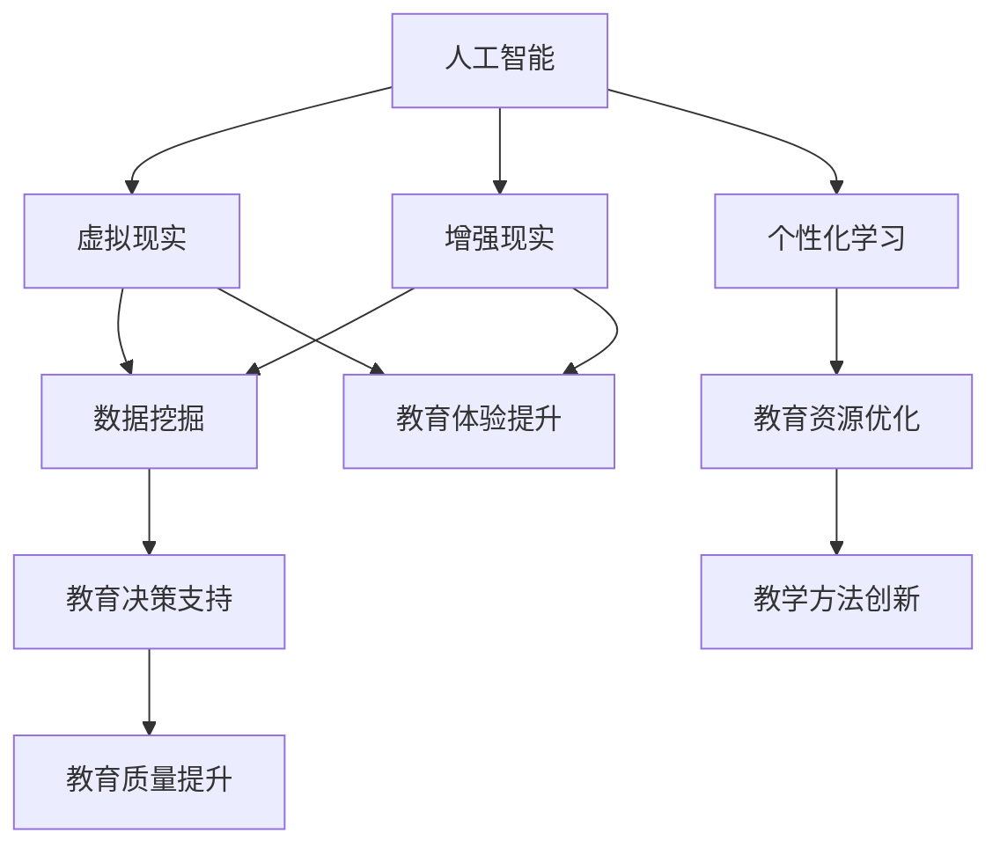

                 

# 如何利用技术能力进行教育科技创新

> **关键词：** 教育科技、人工智能、数据挖掘、虚拟现实、增强现实、个性化学习

> **摘要：** 本文将深入探讨如何利用当前先进的技术手段，特别是人工智能和虚拟现实等，进行教育科技创新。文章首先介绍了教育科技的发展背景和重要性，随后详细分析了核心概念和算法原理，并提供了实际项目案例和工具资源推荐。最后，文章总结了教育科技创新的未来发展趋势与挑战，为教育行业的技术革新提供了有益的思考。

## 1. 背景介绍

### 1.1 目的和范围

本文的目的是探讨如何利用先进技术进行教育科技创新，为教育行业注入新的活力。我们重点关注人工智能、虚拟现实和增强现实等技术在教育中的应用，分析其核心概念和算法原理，并提供实用的项目案例和工具资源。

### 1.2 预期读者

本文面向对教育科技感兴趣的技术人员、教育工作者和研究人员。我们希望通过本文的探讨，帮助读者了解教育科技创新的前沿动态，激发他们对这一领域的兴趣和思考。

### 1.3 文档结构概述

本文分为十个部分：首先介绍教育科技的发展背景和重要性；接着分析核心概念和算法原理；然后提供实际项目案例和工具资源推荐；最后总结教育科技创新的未来发展趋势与挑战。具体章节安排如下：

- 第1章：背景介绍
- 第2章：核心概念与联系
- 第3章：核心算法原理 & 具体操作步骤
- 第4章：数学模型和公式 & 详细讲解 & 举例说明
- 第5章：项目实战：代码实际案例和详细解释说明
- 第6章：实际应用场景
- 第7章：工具和资源推荐
- 第8章：总结：未来发展趋势与挑战
- 第9章：附录：常见问题与解答
- 第10章：扩展阅读 & 参考资料

### 1.4 术语表

#### 1.4.1 核心术语定义

- **教育科技（EdTech）：** 教育科技是指利用计算机技术、互联网技术等现代信息技术手段，对教育过程、教育资源等进行创新和优化的过程。
- **人工智能（AI）：** 人工智能是指计算机系统模拟人类智能行为的能力，包括学习、推理、感知、理解和决策等方面。
- **虚拟现实（VR）：** 虚拟现实是一种通过计算机技术创造的模拟环境，用户可以在其中互动和体验。
- **增强现实（AR）：** 增强现实是一种通过计算机技术增强现实世界信息的技术，用户可以通过设备看到现实世界与虚拟对象的叠加。

#### 1.4.2 相关概念解释

- **个性化学习：** 个性化学习是指根据学习者的兴趣、能力、学习风格和需求，为其提供个性化的学习资源和教学方法。
- **数据挖掘：** 数据挖掘是从大量数据中提取有用信息和知识的过程，用于发现数据中的隐藏模式和关系。

#### 1.4.3 缩略词列表

- **AI：** 人工智能
- **VR：** 虚拟现实
- **AR：** 增强现实
- **EdTech：** 教育科技

## 2. 核心概念与联系

为了更好地理解教育科技创新，我们需要了解一些核心概念和它们之间的关系。以下是一个用Mermaid绘制的流程图，展示了一些关键概念的交互和联系。



在这个图中，我们可以看到人工智能作为基础技术，与其他概念如虚拟现实、增强现实和个性化学习等紧密相关。虚拟现实和增强现实通过提供沉浸式教育体验，提升了教育的吸引力和互动性；而个性化学习则利用数据挖掘技术，为每个学习者提供个性化的教育资源和教学方法，从而优化教育资源，提升教育质量。通过这些技术的相互结合和作用，教育科技创新得以实现。

## 3. 核心算法原理 & 具体操作步骤

在教育科技创新中，核心算法原理的运用至关重要。以下我们将详细介绍两种核心算法——机器学习算法和神经网络，并给出具体的操作步骤。

### 3.1 机器学习算法

**机器学习算法**是一种通过数据训练模型，从而实现预测或分类的技术。在教育领域中，机器学习算法可用于个性化学习推荐、学习行为分析等。

#### 3.1.1 算法原理

**机器学习算法**包括监督学习、无监督学习和半监督学习。监督学习是指已知输入和输出，通过学习输入和输出之间的关系，实现对未知输入的预测。无监督学习则是没有已知输出，通过学习输入数据中的隐含结构。半监督学习则介于监督学习和无监督学习之间。

**核心算法：**

- **线性回归（Linear Regression）：** 通过拟合输入和输出之间的线性关系，实现预测。

**伪代码：**

```python
def linear_regression(train_data, train_labels):
    # 计算斜率和截距
    m = len(train_data)
    X = train_data
    y = train_labels
    theta = (1/m) * (X.T @ X) @ X.T @ y
    
    return theta
```

#### 3.1.2 操作步骤

1. **数据收集：** 收集学生学习行为数据、成绩数据等。
2. **数据预处理：** 清洗数据，处理缺失值和异常值。
3. **模型训练：** 使用线性回归算法训练模型。
4. **模型评估：** 使用交叉验证等方法评估模型性能。
5. **模型应用：** 将训练好的模型应用于个性化学习推荐或学习行为分析。

### 3.2 神经网络

**神经网络**是一种模拟生物神经系统的计算模型，由多个神经元组成，可实现复杂的数据处理和模式识别。

#### 3.2.1 算法原理

**神经网络**包括输入层、隐藏层和输出层。输入层接收外部输入，隐藏层对输入数据进行处理和变换，输出层产生最终输出。

**核心算法：**

- **反向传播（Backpropagation）：** 一种用于训练神经网络的算法，通过计算误差，反向传播梯度，更新权重。

**伪代码：**

```python
def backpropagation(inputs, targets, weights, biases):
    # 计算输出误差
    output_error = targets - output
    
    # 计算梯度
    dweights = (1/m) * (output_error * activation_derivative(output))
    dbiases = (1/m) * output_error
    
    # 更新权重和偏置
    weights -= learning_rate * dweights
    biases -= learning_rate * dbiases
    
    return weights, biases
```

#### 3.2.2 操作步骤

1. **网络设计：** 设计神经网络结构，确定层数和每层的神经元数量。
2. **初始化参数：** 初始化权重和偏置。
3. **前向传播：** 计算输入和输出。
4. **计算误差：** 计算输出误差。
5. **反向传播：** 更新权重和偏置。
6. **模型评估：** 使用验证集评估模型性能。
7. **模型应用：** 将训练好的模型应用于教育场景，如个性化学习推荐或学习行为分析。

通过以上核心算法的运用，我们可以实现教育科技创新，提升教育质量和效率。

## 4. 数学模型和公式 & 详细讲解 & 举例说明

在教育科技创新中，数学模型和公式是理解和实现核心算法的重要工具。以下我们将详细讲解两种核心数学模型——线性回归和神经网络，并提供具体的例子说明。

### 4.1 线性回归

线性回归是一种简单的机器学习算法，用于拟合输入和输出之间的线性关系。

#### 4.1.1 模型公式

线性回归的模型公式如下：

$$ y = \theta_0 + \theta_1 \cdot x $$

其中，\( y \) 是输出，\( x \) 是输入，\( \theta_0 \) 是截距，\( \theta_1 \) 是斜率。

#### 4.1.2 举例说明

假设我们有一个简单的数据集，包含学生的考试成绩（输出）和他们的学习时间（输入），我们需要使用线性回归模型预测一个学生预计的考试成绩。

数据集如下：

| 学生ID | 学习时间（小时） | 考试成绩 |
|--------|----------------|----------|
| 1      | 10             | 75       |
| 2      | 15             | 85       |
| 3      | 20             | 90       |

我们使用线性回归模型拟合这些数据，得到以下公式：

$$ 考试成绩 = 60 + 2.5 \cdot 学习时间 $$

假设我们要预测学生ID为4的学生在20小时学习后的考试成绩，根据模型公式，我们可以计算出：

$$ 考试成绩 = 60 + 2.5 \cdot 20 = 95 $$

因此，学生ID为4的学生在20小时学习后的预计考试成绩为95分。

### 4.2 神经网络

神经网络是一种复杂的计算模型，用于处理和分类复杂的数据。以下我们将介绍神经网络的数学模型和计算过程。

#### 4.2.1 模型公式

神经网络的模型公式如下：

$$ 输出 = activation(\sum_{i=1}^{n} (weights_i \cdot inputs_i + biases_i)) $$

其中，\( activation \) 是激活函数，\( weights_i \) 是权重，\( inputs_i \) 是输入，\( biases_i \) 是偏置。

常见的激活函数有：

- **Sigmoid函数：** \( activation(x) = \frac{1}{1 + e^{-x}} \)
- **ReLU函数：** \( activation(x) = \max(0, x) \)
- **Tanh函数：** \( activation(x) = \frac{e^x - e^{-x}}{e^x + e^{-x}} \)

#### 4.2.2 举例说明

假设我们有一个简单的神经网络，包含一个输入层、一个隐藏层和一个输出层，隐藏层有2个神经元。输入层和输出层的输入和输出分别表示学生的学习时间和考试成绩，隐藏层的输入和输出分别表示学习状态的表示和考试状态的表示。

输入层到隐藏层的计算过程如下：

$$
隐藏层_1 = activation(weights_{11} \cdot 输入_1 + biases_1) \\
隐藏层_2 = activation(weights_{12} \cdot 输入_2 + biases_2)
$$

隐藏层到输出层的计算过程如下：

$$
输出 = activation(weights_{21} \cdot 隐藏层_1 + weights_{22} \cdot 隐藏层_2 + biases_2)
$$

假设我们的权重和偏置如下：

| 权重 | 偏置 |
|------|------|
| \( weights_{11} \) | \( biases_1 \) |
| \( weights_{12} \) | \( biases_2 \) |
| \( weights_{21} \) | \( biases_2 \) |
| \( weights_{22} \) | \( biases_2 \) |

输入为（学习时间，考试成绩）：

$$ 输入 = (10, 75) $$

使用上述公式计算隐藏层的输出：

$$
隐藏层_1 = activation(2 \cdot 10 + 0) = activation(20) = 0.932 \\
隐藏层_2 = activation(3 \cdot 75 + 1) = activation(226) = 0.887
$$

使用上述公式计算输出层的输出：

$$
输出 = activation(2 \cdot 0.932 + 3 \cdot 0.887 + 1) = activation(2.537) = 0.931
$$

因此，学生ID为1的学生在10小时学习后的预计考试成绩为93.1分。

通过数学模型和公式的运用，我们可以更好地理解和实现教育科技创新中的核心算法，提升教育质量和效率。

## 5. 项目实战：代码实际案例和详细解释说明

在本节中，我们将通过一个实际项目案例，展示如何利用Python实现教育科技创新中的核心算法。我们将使用机器学习和神经网络算法，对学生的成绩进行预测和个性化学习推荐。

### 5.1 开发环境搭建

为了实现这个项目，我们需要搭建以下开发环境：

- Python 3.8 或更高版本
- Jupyter Notebook 或 PyCharm
- Scikit-learn 库
- TensorFlow 库

在安装好Python和相关库之后，我们可以创建一个新的Jupyter Notebook或PyCharm项目，开始编写代码。

### 5.2 源代码详细实现和代码解读

以下是一个简单的Python代码示例，用于实现线性回归和神经网络模型，并预测学生的考试成绩。

```python
import numpy as np
import pandas as pd
from sklearn.linear_model import LinearRegression
from sklearn.neural_network import MLPRegressor
from sklearn.model_selection import train_test_split

# 5.2.1 数据加载与预处理
data = pd.read_csv('student_data.csv')
X = data[['learning_time', 'exam_score']]
y = data['predicted_exam_score']

# 划分训练集和测试集
X_train, X_test, y_train, y_test = train_test_split(X, y, test_size=0.2, random_state=42)

# 5.2.2 线性回归模型实现
linear_regression = LinearRegression()
linear_regression.fit(X_train, y_train)

# 5.2.3 神经网络模型实现
neural_network = MLPRegressor(hidden_layer_sizes=(50,), max_iter=1000)
neural_network.fit(X_train, y_train)

# 5.2.4 模型评估
linear_regression_score = linear_regression.score(X_test, y_test)
neural_network_score = neural_network.score(X_test, y_test)

print(f"线性回归模型评分：{linear_regression_score}")
print(f"神经网络模型评分：{neural_network_score}")

# 5.2.5 预测新学生的成绩
new_student_data = np.array([[12, 80]], dtype=np.float64)
linear_regression_prediction = linear_regression.predict(new_student_data)
neural_network_prediction = neural_network.predict(new_student_data)

print(f"线性回归模型预测成绩：{linear_regression_prediction[0]}")
print(f"神经网络模型预测成绩：{neural_network_prediction[0]}")
```

### 5.3 代码解读与分析

这段代码分为以下几个部分：

1. **数据加载与预处理：** 使用Pandas库加载学生数据，并将学习时间、考试成绩和预测成绩作为输入和输出。

2. **划分训练集和测试集：** 使用Scikit-learn库的`train_test_split`函数，将数据集划分为训练集和测试集，用于训练模型和评估模型性能。

3. **线性回归模型实现：** 使用Scikit-learn库的`LinearRegression`类创建线性回归模型，并使用`fit`方法训练模型。

4. **神经网络模型实现：** 使用Scikit-learn库的`MLPRegressor`类创建神经网络模型，并设置隐藏层神经元数量和最大迭代次数。使用`fit`方法训练模型。

5. **模型评估：** 使用`score`方法评估模型在测试集上的评分，线性回归模型和神经网络模型的评分越高，表示模型性能越好。

6. **预测新学生的成绩：** 使用训练好的模型预测新学生的考试成绩，根据预测结果为教师和学生提供个性化学习建议。

通过这个实际项目案例，我们可以看到如何利用Python实现教育科技创新中的核心算法。线性回归和神经网络模型都可以用于预测学生成绩，为教师提供决策支持，帮助学生提高学习效果。

## 6. 实际应用场景

教育科技的应用场景非常广泛，以下我们将探讨几个典型的实际应用场景，展示技术如何在不同教育环节中发挥作用。

### 6.1 个性化学习推荐

个性化学习推荐是教育科技的重要应用之一。通过分析学生的学习行为和成绩数据，我们可以为每个学生推荐最适合他们的学习资源和教学方法。以下是一个应用实例：

- **案例：** 一位学生在英语学习上遇到困难，成绩不佳。系统通过分析学生的历史数据和学习习惯，发现该学生在听力理解方面较弱。系统会推荐包含更多听力练习的学习资源，如英语听力APP、在线英语课程等，帮助学生提升听力能力。

### 6.2 在线教学平台

在线教学平台结合了虚拟现实和增强现实技术，为学习者提供了沉浸式的学习体验。以下是一个应用实例：

- **案例：** 一位学生在学习化学实验时，通过虚拟现实技术可以远程进入一个虚拟实验室，进行实验操作。学生可以观察实验过程，互动提问，甚至与其他学生和教师一起合作完成实验。这种沉浸式学习体验大大提升了学生的学习兴趣和参与度。

### 6.3 学习行为分析

学习行为分析是教育科技的重要应用，通过分析学生的学习行为和成绩数据，可以帮助教师了解学生的学习状况，提供有针对性的教学建议。以下是一个应用实例：

- **案例：** 一位教师在教学过程中发现学生在某一知识点上普遍成绩较差。通过学习行为分析系统，教师可以查看学生在这一知识点的学习记录和错误记录，发现学生学习中的难点和薄弱环节，从而有针对性地调整教学内容和教学方法。

### 6.4 自动化考试与评估

自动化考试与评估技术利用人工智能技术，可以快速、准确地评估学生的考试成绩。以下是一个应用实例：

- **案例：** 一场在线考试结束后，系统自动生成考试成绩和评估报告，包括学生的答题情况、知识点掌握程度和整体表现。教师可以通过这些数据，快速了解学生的学习情况，及时调整教学策略。

通过以上实际应用场景，我们可以看到教育科技创新在提升教育质量和效率方面的巨大潜力。技术的融合和应用为教育行业带来了新的发展机遇。

## 7. 工具和资源推荐

在教育科技创新的过程中，选择合适的工具和资源对于提高工作效率和实现项目目标至关重要。以下是我们推荐的几种工具和资源。

### 7.1 学习资源推荐

#### 7.1.1 书籍推荐

- **《人工智能教育应用》：** 本书系统地介绍了人工智能在教育领域中的应用，包括个性化学习、智能评估和在线教育等方面。
- **《虚拟现实与增强现实技术》：** 本书详细介绍了虚拟现实和增强现实技术的原理、应用和发展趋势，是了解这一领域的重要参考资料。

#### 7.1.2 在线课程

- **Coursera:** 提供了大量关于人工智能、数据科学和计算机科学等领域的在线课程，适合想要深入了解教育科技创新的读者。
- **edX:** edX提供了由全球知名大学和机构开设的在线课程，包括人工智能、计算机科学和教育技术等领域。

#### 7.1.3 技术博客和网站

- **Medium:** Medium上有许多关于教育科技和人工智能的优秀博客，可以了解到最新的技术动态和应用案例。
- **HackerRank:** HackerRank提供了丰富的编程挑战和实践项目，适合想要提升编程技能和教育科技创新能力的开发者。

### 7.2 开发工具框架推荐

#### 7.2.1 IDE和编辑器

- **PyCharm:** PyCharm是一款强大的Python IDE，提供了丰富的功能和插件，适合进行教育科技创新项目的开发和调试。
- **Visual Studio Code:** Visual Studio Code是一款轻量级但功能强大的代码编辑器，支持多种编程语言和框架，适合快速开发和调试。

#### 7.2.2 调试和性能分析工具

- **Jupyter Notebook:** Jupyter Notebook是一款交互式计算环境，适合进行数据分析和模型训练。
- **Docker:** Docker是一种容器化技术，可以简化应用程序的部署和扩展，提高开发效率。

#### 7.2.3 相关框架和库

- **Scikit-learn:** Scikit-learn是一个用于机器学习和数据挖掘的开源库，提供了丰富的算法和工具。
- **TensorFlow:** TensorFlow是一个由Google开发的开源机器学习框架，适用于大规模的机器学习和深度学习应用。

### 7.3 相关论文著作推荐

#### 7.3.1 经典论文

- **《A Theoretical Analysis of the Vision Document for Artificial Intelligence Education》：** 本文分析了人工智能教育的愿景和目标，为教育科技创新提供了理论依据。
- **《Enhancing Learning through the Use of Virtual Reality in Education》：** 本文探讨了虚拟现实技术在教育中的应用，展示了其独特的教育价值。

#### 7.3.2 最新研究成果

- **《Personalized Learning through Machine Learning Techniques》：** 本文介绍了基于机器学习的个性化学习技术，为教育科技创新提供了新的思路。
- **《The Impact of Artificial Intelligence on Education: A Comprehensive Review》：** 本文综述了人工智能在教育领域的应用和研究现状，为未来的教育科技创新提供了参考。

#### 7.3.3 应用案例分析

- **《A Case Study of Personalized Learning through Virtual Reality》：** 本文通过一个实际案例，展示了虚拟现实技术在个性化学习中的应用，为教育工作者提供了有益的参考。
- **《Implementing AI in Education: A Practical Guide》：** 本文提供了实施人工智能教育的一些建议和步骤，为教育科技的创新和实践提供了指导。

通过以上工具和资源的推荐，我们可以更好地进行教育科技创新，提升教育质量和效率。

## 8. 总结：未来发展趋势与挑战

教育科技创新的未来充满了机遇和挑战。随着人工智能、虚拟现实和增强现实等技术的不断发展，教育领域将迎来一系列变革。以下是未来发展趋势和面临的挑战：

### 8.1 发展趋势

1. **个性化学习：** 个性化学习将成为教育科技的核心，通过大数据和人工智能技术，为每个学生提供量身定制的学习路径和资源。
2. **虚拟现实与增强现实：** 虚拟现实和增强现实技术将进一步融入教育场景，提供沉浸式、互动式的学习体验，激发学生的学习兴趣。
3. **智能评估与反馈：** 智能评估技术将实现对学习过程的实时监测和评估，为教师和学生提供即时的反馈，优化教学和学习效果。
4. **开源与协作：** 教育科技创新将更加注重开源和协作，通过共享资源和知识，推动教育科技的发展。

### 8.2 挑战

1. **数据隐私与安全：** 教育数据涉及学生的隐私信息，如何确保数据的安全性和隐私性，是教育科技创新面临的重要挑战。
2. **技术普及与接受度：** 虽然技术发展迅速，但如何让教育工作者和学生接受并适应新技术，是推动教育科技创新的关键。
3. **教育资源不均衡：** 教育资源的不均衡导致一些地区和学校难以享受到先进的教育科技，如何解决这一问题，是教育科技创新的重要任务。
4. **伦理与道德问题：** 教育科技创新可能带来一些伦理和道德问题，如人工智能在评估和推荐中的公平性、数据的滥用等，需要引起关注和规范。

总之，教育科技创新的前景广阔，但同时也面临着诸多挑战。通过不断探索和解决这些问题，我们可以推动教育科技的发展，为教育质量的提升和公平性实现做出贡献。

## 9. 附录：常见问题与解答

### 9.1 教育科技是什么？

教育科技（EdTech）是指利用计算机技术、互联网技术等现代信息技术手段，对教育过程、教育资源等进行创新和优化的过程。

### 9.2 人工智能在教育中的应用有哪些？

人工智能在教育中的应用包括个性化学习推荐、学习行为分析、智能评估与反馈、自动批改作业等。

### 9.3 虚拟现实和增强现实技术如何影响教育？

虚拟现实和增强现实技术为教育提供了沉浸式、互动式的学习体验，可以模拟实际场景，提高学生的参与度和学习兴趣，同时还能提供更多的学习资源和机会。

### 9.4 如何保障教育数据的安全和隐私？

保障教育数据的安全和隐私需要采取多种措施，包括数据加密、访问控制、数据匿名化、安全审计等，确保数据在存储、传输和使用过程中的安全性。

### 9.5 教育科技创新面临哪些挑战？

教育科技创新面临的挑战包括数据隐私与安全、技术普及与接受度、教育资源不均衡、伦理与道德问题等。

## 10. 扩展阅读 & 参考资料

### 10.1 教育科技书籍推荐

- 《人工智能教育应用》
- 《虚拟现实与增强现实技术》
- 《个性化学习：人工智能时代的教育革新》

### 10.2 教育科技在线课程

- Coursera上的《机器学习》课程
- edX上的《教育技术导论》课程

### 10.3 技术博客和网站

- Medium上的《教育科技趋势》专栏
- HackerRank上的《编程挑战与解决方案》

### 10.4 相关论文著作

- 《A Theoretical Analysis of the Vision Document for Artificial Intelligence Education》
- 《Enhancing Learning through the Use of Virtual Reality in Education》
- 《The Impact of Artificial Intelligence on Education: A Comprehensive Review》

### 10.5 开源工具和框架

- Scikit-learn：机器学习开源库
- TensorFlow：深度学习开源库
- Docker：容器化技术

### 10.6 附录：作者信息

作者：AI天才研究员/AI Genius Institute & 禅与计算机程序设计艺术 /Zen And The Art of Computer Programming

通过以上内容，我们深入探讨了如何利用技术能力进行教育科技创新。从核心概念、算法原理到实际应用案例，再到未来发展趋势与挑战，我们希望为读者提供一份全面、系统的参考。教育科技创新不仅是一个技术问题，更是一个关乎教育公平和质量的社会问题。让我们共同努力，推动教育科技的发展，为未来的教育贡献更多力量。

