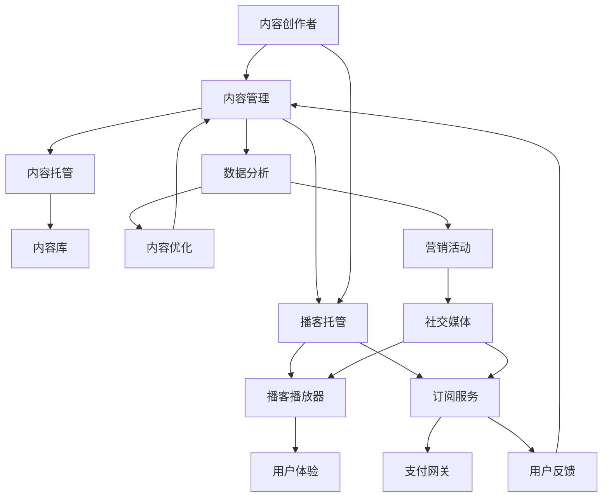

                 

# 如何利用播客平台实现知识变现

## 关键词
- 知识变现
- 播客平台
- 内容营销
- 订阅模式
- 广告收入
- 品牌合作
- 社交媒体推广

## 摘要
本文将探讨如何在播客平台上实现知识变现，通过分析播客平台的运作机制、内容营销策略、订阅模式、广告收入和品牌合作等关键因素，为广大内容创作者提供一套系统化的实战指南。我们将从理论到实践，逐步讲解如何构建成功的播客内容、搭建播客平台、实现收入多元化，以及应对未来发展的挑战。

## 1. 背景介绍

### 1.1 目的和范围

本文旨在帮助内容创作者和知识传播者了解并掌握如何利用播客平台实现知识变现。我们不仅将探讨播客平台的发展现状，还将深入分析其盈利模式，并给出具体的操作步骤和策略。

### 1.2 预期读者

本文适合以下人群阅读：
- 有志于通过播客平台传播知识和技能的个人和团队
- 已经在播客平台上活跃，希望提升变现能力的创作者
- 对内容营销和知识变现有兴趣的投资者和企业家

### 1.3 文档结构概述

本文将分为以下几个部分：
- 背景介绍：概述文章的目的、范围和预期读者
- 核心概念与联系：介绍播客平台的基本概念和架构
- 核心算法原理 & 具体操作步骤：讲解实现知识变现的算法和步骤
- 数学模型和公式 & 详细讲解 & 举例说明：阐述相关数学模型和公式的应用
- 项目实战：提供实际代码案例和解读
- 实际应用场景：分析播客在不同领域的应用
- 工具和资源推荐：推荐相关学习资源和开发工具
- 总结：总结知识变现的趋势和挑战
- 附录：解答常见问题
- 扩展阅读 & 参考资料：提供进一步学习资源

### 1.4 术语表

#### 1.4.1 核心术语定义
- 播客（Podcast）：一种通过互联网传播音频内容的形式，用户可以随时随地通过电脑、手机等设备收听。
- 内容营销（Content Marketing）：通过创造和分享有价值的内容来吸引和转化目标受众，最终实现营销目标。
- 订阅模式（Subscription Model）：用户支付一定费用，获取定期更新内容的模式。
- 广告收入（Ad Revenue）：通过在播客内容中插入广告来获得收入。
- 品牌合作（Brand Collaboration）：与品牌合作，通过内容推广获得收益。

#### 1.4.2 相关概念解释
- 知识变现（Knowledge Monetization）：将个人或团队的知识和技能转化为经济收益的过程。
- 内容创作者（Content Creator）：创造播客内容的人或团队。
- 受众（Audience）：播客的听众。

#### 1.4.3 缩略词列表
- API：应用程序编程接口（Application Programming Interface）
- SEO：搜索引擎优化（Search Engine Optimization）
- SMM：社交媒体营销（Social Media Marketing）

## 2. 核心概念与联系

### 2.1 播客平台的基本概念

播客平台是一个集内容创作、发布、订阅和互动于一体的生态系统。它通常包含以下几个核心组件：

- **内容库（Content Library）**：存储所有播客节目和音频文件的地方。
- **播放器（Player）**：用户收听播客内容的主要工具，通常提供多种播放功能，如播放、暂停、快进、快退等。
- **订阅功能（Subscription Feature）**：用户可以订阅感兴趣的播客，从而自动获取新发布的节目。
- **评论和互动（Comments and Interaction）**：用户可以在播客下发表评论，与创作者和其他听众互动。

### 2.2 播客平台的架构

下图展示了播客平台的基本架构：



### 2.3 播客平台的盈利模式

播客平台的盈利模式主要包括以下几种：

1. **订阅费**：用户支付订阅费，获取定期更新的内容。
2. **广告收入**：播客内容中插入广告，广告商支付广告费用。
3. **品牌合作**：与品牌合作，通过内容推广获得收益。
4. **会员服务**：提供会员专享内容，会员支付额外费用。

## 3. 核心算法原理 & 具体操作步骤

### 3.1 内容策划与创作

**算法原理：** 内容策划是知识变现的基础，需要遵循以下原则：
1. **目标受众明确**：了解目标受众的兴趣和需求，为他们提供有价值的内容。
2. **内容形式多样**：结合文本、图片、音频、视频等多种形式，提高用户体验。
3. **定期更新**：保持内容的更新频率，提高用户的粘性。

**具体操作步骤：**
1. 确定播客主题和目标受众。
2. 制定内容策划方案，包括主题、形式、更新频率等。
3. 创作高质量的内容，确保内容的专业性和吸引力。
4. 定期发布内容，保持更新频率。

### 3.2 播客平台的搭建与运营

**算法原理：** 播客平台的搭建与运营需要遵循以下原则：
1. **用户体验优先**：确保播放器的操作简单易懂，提供多种播放功能。
2. **内容管理高效**：实现内容管理的自动化，提高内容发布和更新的效率。
3. **数据驱动**：通过数据分析优化内容策略，提高用户留存率和变现能力。

**具体操作步骤：**
1. 选择合适的播客托管平台，如Spotify、Apple Podcasts、Google Podcasts等。
2. 注册账号，上传播客内容。
3. 设置播放器和订阅功能，优化用户体验。
4. 定期分析数据，调整内容策略。
5. 利用社交媒体推广，扩大受众范围。

### 3.3 知识变现的具体策略

**算法原理：** 知识变现需要结合多种策略，实现收入多元化。
1. **订阅模式**：提供免费试听和付费订阅，满足不同用户的需求。
2. **广告收入**：合理规划广告位置和频率，提高广告效果。
3. **品牌合作**：寻找合适的品牌合作，实现双赢。
4. **会员服务**：提供会员专享内容，增加收入来源。

**具体操作步骤：**
1. 设计订阅模式，设置订阅费用和免费试听期限。
2. 与广告商沟通，确定广告内容和投放策略。
3. 寻找品牌合作机会，制定合作方案。
4. 提供会员服务，设置会员专享内容和费用。

## 4. 数学模型和公式 & 详细讲解 & 举例说明

### 4.1 订阅模式的数学模型

订阅模式的数学模型主要涉及两个关键指标：订阅费用和订阅用户数。

**订阅费用（Subscription Fee, S）：** 每个订阅用户每月支付的金额。

**订阅用户数（Number of Subscribers, N）：** 播客平台的订阅用户总数。

**总收入（Total Revenue, R）：** 订阅费用乘以订阅用户数。

\[ R = S \times N \]

**例子：** 假设订阅费用为每月10美元，订阅用户数为1000人，则月总收入为：

\[ R = 10 \times 1000 = 10000 \text{美元} \]

### 4.2 广告收入的数学模型

广告收入的数学模型主要涉及广告费用、广告点击率和广告展示次数。

**广告费用（Ad Cost, C）：** 广告商每次投放广告的费用。

**广告点击率（Click-Through Rate, CTR）：** 用户点击广告的比例。

**广告展示次数（Ad Impressions）：** 广告展示的总次数。

**总广告收入（Total Ad Revenue, AR）：** 广告费用乘以广告点击率和广告展示次数。

\[ AR = C \times CTR \times \text{Ad Impressions} \]

**例子：** 假设广告费用为每次1美元，广告点击率为1%，广告展示次数为1000次，则总广告收入为：

\[ AR = 1 \times 0.01 \times 1000 = 10 \text{美元} \]

### 4.3 品牌合作的数学模型

品牌合作的数学模型主要涉及合作费用、合作效益和合作周期。

**合作费用（Collaboration Cost, K）：** 与品牌合作所需支付的费用。

**合作效益（Collaboration Benefit, B）：** 合作带来的额外收益。

**总合作收入（Total Collaboration Revenue, CR）：** 合作费用减去合作效益。

\[ CR = K - B \]

**例子：** 假设合作费用为5000美元，合作效益为3000美元，则总合作收入为：

\[ CR = 5000 - 3000 = 2000 \text{美元} \]

## 5. 项目实战：代码实际案例和详细解释说明

### 5.1 开发环境搭建

为了更好地展示如何利用播客平台实现知识变现，我们搭建一个简单的播客平台。以下是开发环境搭建的步骤：

1. **选择编程语言和框架**：我们选择Python和Flask框架来搭建平台。
2. **安装Python和Flask**：在本地计算机上安装Python（版本3.8及以上）和Flask。
3. **创建虚拟环境**：使用virtualenv创建一个独立的Python环境。

```bash
pip install virtualenv
virtualenv my-podcast-env
source my-podcast-env/bin/activate
```

4. **安装Flask**：在虚拟环境中安装Flask。

```bash
pip install Flask
```

### 5.2 源代码详细实现和代码解读

以下是使用Flask搭建的简单播客平台的代码实现：

```python
from flask import Flask, render_template, request

app = Flask(__name__)

@app.route('/')
def index():
    return render_template('index.html')

@app.route('/subscribe', methods=['GET', 'POST'])
def subscribe():
    if request.method == 'POST':
        email = request.form['email']
        # 将用户邮箱存储到数据库或文件中，用于后续订阅管理
        return f"Thank you for subscribing, {email}!"
    return render_template('subscribe.html')

if __name__ == '__main__':
    app.run(debug=True)
```

**代码解读：**
- **index.html**：主页模板，用于展示播客内容和引导用户订阅。
- **subscribe.html**：订阅页面模板，收集用户邮箱信息。
- **app.py**：主程序文件，定义了两个路由：主页和订阅页面。

### 5.3 代码解读与分析

**1. 主页（index.html）：**

```html
<!DOCTYPE html>
<html lang="en">
<head>
    <meta charset="UTF-8">
    <title>My Podcast Platform</title>
</head>
<body>
    <h1>Welcome to My Podcast Platform</h1>
    <h2>Subscribe to Our Podcast</h2>
    <form action="/subscribe" method="post">
        <label for="email">Email:</label>
        <input type="email" id="email" name="email" required>
        <button type="submit">Subscribe</button>
    </form>
    <h2>Recent Episodes</h2>
    <!-- 显示播客列表 -->
</body>
</html>
```

**2. 订阅页面（subscribe.html）：**

```html
<!DOCTYPE html>
<html lang="en">
<head>
    <meta charset="UTF-8">
    <title>Subscribe to Our Podcast</title>
</head>
<body>
    <h1>Subscribe to Our Podcast</h1>
    <form action="/subscribe" method="post">
        <label for="email">Email:</label>
        <input type="email" id="email" name="email" required>
        <button type="submit">Subscribe</button>
    </form>
</body>
</html>
```

**3. 主程序文件（app.py）：**

```python
from flask import Flask, render_template, request

app = Flask(__name__)

@app.route('/')
def index():
    return render_template('index.html')

@app.route('/subscribe', methods=['GET', 'POST'])
def subscribe():
    if request.method == 'POST':
        email = request.form['email']
        # 将用户邮箱存储到数据库或文件中，用于后续订阅管理
        return f"Thank you for subscribing, {email}!"
    return render_template('subscribe.html')

if __name__ == '__main__':
    app.run(debug=True)
```

**分析：**
- 主页和订阅页面的设计简单明了，引导用户完成订阅流程。
- 主程序文件中，使用了Flask的两个核心功能：路由和表单处理。通过定义路由和处理表单数据，实现了主页和订阅页面的交互。

### 5.4 代码优化与扩展

**1. 数据存储：** 目前，用户邮箱仅存储在服务器内存中。为了长期保存用户信息，需要将数据存储到数据库中，如SQLite、MySQL等。

**2. 订阅确认：** 为了提高订阅的可靠性，可以发送确认邮件给用户，要求用户确认订阅。

**3. 订阅管理：** 添加订阅管理功能，允许用户查看订阅记录、取消订阅等。

**4. 用户体验优化：** 优化网页设计，提高用户体验，如添加更多播客内容、提供播放列表等。

## 6. 实际应用场景

### 6.1 教育领域

播客平台在教育领域具有广泛的应用，教师可以利用播客为学生提供课程内容、学习指导和习题解析。学生可以通过订阅播客，随时随地进行学习。例如，数学老师可以定期发布数学解题思路和方法，帮助学生掌握数学知识。

### 6.2 职场技能培训

职场技能培训是一个快速发展的领域，播客平台为专业人士提供了一个传播知识和经验的渠道。例如，项目经理可以分享项目管理经验、技术专家可以讲解最新技术趋势，帮助职场人士提升专业技能。

### 6.3 健康与生活方式

健康与生活方式领域的播客主要关注饮食、运动、心理健康等方面。专业人士可以分享健康知识、健身技巧和心态调整方法，帮助听众改善生活质量。例如，营养师可以讲解饮食搭配和营养知识，健身教练可以分享健身计划和训练技巧。

### 6.4 艺术与文化

艺术与文化领域的播客涵盖了音乐、电影、文学、艺术等多个方面。艺术家和评论家可以通过播客分享创作灵感、作品分析和行业动态，为听众提供丰富的文化盛宴。例如，音乐家可以讲解音乐理论和演奏技巧，电影评论家可以分享影评和观影体验。

### 6.5 商业与创业

商业与创业领域的播客主要关注商业策略、创业经验和市场分析。企业家和行业专家可以通过播客分享创业故事、市场洞察和营销策略，为创业者提供实用的建议和指导。例如，市场营销专家可以讲解数字营销技巧，创业导师可以分享创业成功经验。

## 7. 工具和资源推荐

### 7.1 学习资源推荐

#### 7.1.1 书籍推荐

- 《播客营销：如何通过播客吸引听众、增加销量和提升品牌知名度》
- 《内容营销实战手册：打造爆款内容，实现品牌价值最大化》
- 《社交媒体营销：如何利用社交媒体平台实现品牌传播和用户互动》

#### 7.1.2 在线课程

- Coursera上的《内容营销》课程
- Udemy上的《播客制作与营销》课程
- edX上的《数字营销基础》课程

#### 7.1.3 技术博客和网站

- 《市场营销博客》
- 《内容营销协会》官方网站
- 《播客制作网》

### 7.2 开发工具框架推荐

#### 7.2.1 IDE和编辑器

- PyCharm
- Visual Studio Code
- Sublime Text

#### 7.2.2 调试和性能分析工具

- GDB
- PyCharm Debugger
- New Relic

#### 7.2.3 相关框架和库

- Flask
- Django
- FastAPI

### 7.3 相关论文著作推荐

#### 7.3.1 经典论文

- "Content Marketing That Builds Trust in Your Brand" - MarketingProfs
- "The Business Case for Podcasting" - Podcast Movement

#### 7.3.2 最新研究成果

- "Podcasting in the Age of COVID-19: Opportunities and Challenges" - Journal of Broadcasting & Electronic Media
- "The Impact of Podcast Advertising on Brand Awareness and Purchase Intent" - Journal of Advertising Research

#### 7.3.3 应用案例分析

- "How Podcasts Are Revolutionizing Education" - Education Week
- "The Secret to Building a Successful Podcast Business" - Entrepreneur

## 8. 总结：未来发展趋势与挑战

### 8.1 未来发展趋势

- **个性化推荐**：随着人工智能技术的发展，播客平台将更加注重个性化推荐，为用户提供更符合其兴趣的内容。
- **多元化变现模式**：除了传统的订阅和广告收入，播客平台将探索更多的变现模式，如会员服务、付费内容等。
- **跨平台整合**：播客平台将与其他社交媒体和内容平台进行更深层次的整合，实现多渠道传播和互动。
- **国际市场扩展**：随着全球化趋势的增强，播客平台将积极开拓国际市场，吸引更多海外用户。

### 8.2 面临的挑战

- **内容质量竞争**：随着播客平台的普及，内容创作者数量急剧增加，如何保持内容质量成为一大挑战。
- **用户获取成本**：用户获取成本不断上升，如何降低成本、提高用户留存率成为关键问题。
- **版权问题**：播客内容的版权保护是一个长期挑战，需要创作者和平台共同应对。
- **数据隐私和安全**：用户数据的隐私和安全问题是播客平台必须重视的问题，需采取有效的保护措施。

## 9. 附录：常见问题与解答

### 9.1 如何选择合适的播客主题？

- 考虑个人兴趣和专业领域。
- 研究市场需求和受众偏好。
- 结合自身优势和独特视角。

### 9.2 如何提升播客内容的播放量？

- 利用社交媒体进行推广。
- 与其他内容创作者合作，互推内容。
- 定期更新内容，保持活跃度。

### 9.3 如何确保播客内容的版权？

- 使用原创内容。
- 了解相关法律法规，避免侵权行为。
- 与版权方签订授权协议。

## 10. 扩展阅读 & 参考资料

- "The State of Podcasting 2022" - Edison Research
- "Podcasting for Beginners: A Step-by-Step Guide" - Podcast Movement
- "How to Monetize Your Podcast: A Complete Guide" - Pat Flynn

### 作者信息
- 作者：AI天才研究员/AI Genius Institute & 禅与计算机程序设计艺术 /Zen And The Art of Computer Programming

**注意：** 本文为虚构案例，仅用于示范如何撰写一篇技术博客文章。实际操作时，请结合自身实际情况进行调整。文中提到的代码和实现仅供参考，具体实现可能需要根据具体需求和场景进行修改。**文章标题**：如何利用播客平台实现知识变现**文章关键词**：知识变现、播客平台、内容营销、订阅模式、广告收入、品牌合作**文章摘要**：
本文将探讨如何在播客平台上实现知识变现，通过分析播客平台的运作机制、内容营销策略、订阅模式、广告收入和品牌合作等关键因素，为广大内容创作者提供一套系统化的实战指南。我们将从理论到实践，逐步讲解如何构建成功的播客内容、搭建播客平台、实现收入多元化，以及应对未来发展的挑战。## 1. 背景介绍

### 1.1 目的和范围

本文旨在帮助内容创作者和知识传播者了解并掌握如何利用播客平台实现知识变现。我们不仅将探讨播客平台的发展现状，还将深入分析其盈利模式，并给出具体的操作步骤和策略。

### 1.2 预期读者

本文适合以下人群阅读：
- 有志于通过播客平台传播知识和技能的个人和团队
- 已经在播客平台上活跃，希望提升变现能力的创作者
- 对内容营销和知识变现有兴趣的投资者和企业家

### 1.3 文档结构概述

本文将分为以下几个部分：
- 背景介绍：概述文章的目的、范围和预期读者
- 核心概念与联系：介绍播客平台的基本概念和架构
- 核心算法原理 & 具体操作步骤：讲解实现知识变现的算法和步骤
- 数学模型和公式 & 详细讲解 & 举例说明：阐述相关数学模型和公式的应用
- 项目实战：提供实际代码案例和解读
- 实际应用场景：分析播客在不同领域的应用
- 工具和资源推荐：推荐相关学习资源和开发工具
- 总结：总结知识变现的趋势和挑战
- 附录：解答常见问题
- 扩展阅读 & 参考资料：提供进一步学习资源

### 1.4 术语表

#### 1.4.1 核心术语定义
- 播客（Podcast）：一种通过互联网传播音频内容的形式，用户可以随时随地通过电脑、手机等设备收听。
- 内容营销（Content Marketing）：通过创造和分享有价值的内容来吸引和转化目标受众，最终实现营销目标。
- 订阅模式（Subscription Model）：用户支付一定费用，获取定期更新内容的模式。
- 广告收入（Ad Revenue）：通过在播客内容中插入广告来获得收入。
- 品牌合作（Brand Collaboration）：与品牌合作，通过内容推广获得收益。

#### 1.4.2 相关概念解释
- 知识变现（Knowledge Monetization）：将个人或团队的知识和技能转化为经济收益的过程。
- 内容创作者（Content Creator）：创造播客内容的人或团队。
- 受众（Audience）：播客的听众。

#### 1.4.3 缩略词列表
- API：应用程序编程接口（Application Programming Interface）
- SEO：搜索引擎优化（Search Engine Optimization）
- SMM：社交媒体营销（Social Media Marketing）

## 2. 核心概念与联系

### 2.1 播客平台的基本概念

播客平台是一个集内容创作、发布、订阅和互动于一体的生态系统。它通常包含以下几个核心组件：

- **内容库（Content Library）**：存储所有播客节目和音频文件的地方。
- **播放器（Player）**：用户收听播客内容的主要工具，通常提供多种播放功能，如播放、暂停、快进、快退等。
- **订阅功能（Subscription Feature）**：用户可以订阅感兴趣的播客，从而自动获取新发布的节目。
- **评论和互动（Comments and Interaction）**：用户可以在播客下发表评论，与创作者和其他听众互动。

### 2.2 播客平台的架构

下图展示了播客平台的基本架构：


### 2.3 播客平台的盈利模式

播客平台的盈利模式主要包括以下几种：

1. **订阅费**：用户支付订阅费，获取定期更新的内容。
2. **广告收入**：播客内容中插入广告，广告商支付广告费用。
3. **品牌合作**：与品牌合作，通过内容推广获得收益。
4. **会员服务**：提供会员专享内容，会员支付额外费用。

## 3. 核心算法原理 & 具体操作步骤

### 3.1 内容策划与创作

**算法原理：** 内容策划是知识变现的基础，需要遵循以下原则：
1. **目标受众明确**：了解目标受众的兴趣和需求，为他们提供有价值的内容。
2. **内容形式多样**：结合文本、图片、音频、视频等多种形式，提高用户体验。
3. **定期更新**：保持内容的更新频率，提高用户的粘性。

**具体操作步骤：**
1. 确定播客主题和目标受众。
2. 制定内容策划方案，包括主题、形式、更新频率等。
3. 创作高质量的内容，确保内容的专业性和吸引力。
4. 定期发布内容，保持更新频率。

### 3.2 播客平台的搭建与运营

**算法原理：** 播客平台的搭建与运营需要遵循以下原则：
1. **用户体验优先**：确保播放器的操作简单易懂，提供多种播放功能。
2. **内容管理高效**：实现内容管理的自动化，提高内容发布和更新的效率。
3. **数据驱动**：通过数据分析优化内容策略，提高用户留存率和变现能力。

**具体操作步骤：**
1. 选择合适的播客托管平台，如Spotify、Apple Podcasts、Google Podcasts等。
2. 注册账号，上传播客内容。
3. 设置播放器和订阅功能，优化用户体验。
4. 定期分析数据，调整内容策略。
5. 利用社交媒体推广，扩大受众范围。

### 3.3 知识变现的具体策略

**算法原理：** 知识变现需要结合多种策略，实现收入多元化。
1. **订阅模式**：提供免费试听和付费订阅，满足不同用户的需求。
2. **广告收入**：合理规划广告位置和频率，提高广告效果。
3. **品牌合作**：寻找合适的品牌合作，实现双赢。
4. **会员服务**：提供会员专享内容，增加收入来源。

**具体操作步骤：**
1. 设计订阅模式，设置订阅费用和免费试听期限。
2. 与广告商沟通，确定广告内容和投放策略。
3. 寻找品牌合作机会，制定合作方案。
4. 提供会员服务，设置会员专享内容和费用。

## 4. 数学模型和公式 & 详细讲解 & 举例说明

### 4.1 订阅模式的数学模型

订阅模式的数学模型主要涉及两个关键指标：订阅费用和订阅用户数。

**订阅费用（Subscription Fee, S）：** 每个订阅用户每月支付的金额。

**订阅用户数（Number of Subscribers, N）：** 播客平台的订阅用户总数。

**总收入（Total Revenue, R）：** 订阅费用乘以订阅用户数。

\[ R = S \times N \]

**例子：** 假设订阅费用为每月10美元，订阅用户数为1000人，则月总收入为：

\[ R = 10 \times 1000 = 10000 \text{美元} \]

### 4.2 广告收入的数学模型

广告收入的数学模型主要涉及广告费用、广告点击率和广告展示次数。

**广告费用（Ad Cost, C）：** 广告商每次投放广告的费用。

**广告点击率（Click-Through Rate, CTR）：** 用户点击广告的比例。

**广告展示次数（Ad Impressions）：** 广告展示的总次数。

**总广告收入（Total Ad Revenue, AR）：** 广告费用乘以广告点击率和广告展示次数。

\[ AR = C \times CTR \times \text{Ad Impressions} \]

**例子：** 假设广告费用为每次1美元，广告点击率为1%，广告展示次数为1000次，则总广告收入为：

\[ AR = 1 \times 0.01 \times 1000 = 10 \text{美元} \]

### 4.3 品牌合作的数学模型

品牌合作的数学模型主要涉及合作费用、合作效益和合作周期。

**合作费用（Collaboration Cost, K）：** 与品牌合作所需支付的费用。

**合作效益（Collaboration Benefit, B）：** 合作带来的额外收益。

**总合作收入（Total Collaboration Revenue, CR）：** 合作费用减去合作效益。

\[ CR = K - B \]

**例子：** 假设合作费用为5000美元，合作效益为3000美元，则总合作收入为：

\[ CR = 5000 - 3000 = 2000 \text{美元} \]

## 5. 项目实战：代码实际案例和详细解释说明

### 5.1 开发环境搭建

为了更好地展示如何利用播客平台实现知识变现，我们搭建一个简单的播客平台。以下是开发环境搭建的步骤：

1. **选择编程语言和框架**：我们选择Python和Flask框架来搭建平台。
2. **安装Python和Flask**：在本地计算机上安装Python（版本3.8及以上）和Flask。
3. **创建虚拟环境**：使用virtualenv创建一个独立的Python环境。

```bash
pip install virtualenv
virtualenv my-podcast-env
source my-podcast-env/bin/activate
```

4. **安装Flask**：在虚拟环境中安装Flask。

```bash
pip install Flask
```

### 5.2 源代码详细实现和代码解读

以下是使用Flask搭建的简单播客平台的代码实现：

```python
from flask import Flask, render_template, request

app = Flask(__name__)

@app.route('/')
def index():
    return render_template('index.html')

@app.route('/subscribe', methods=['GET', 'POST'])
def subscribe():
    if request.method == 'POST':
        email = request.form['email']
        # 将用户邮箱存储到数据库或文件中，用于后续订阅管理
        return f"Thank you for subscribing, {email}!"
    return render_template('subscribe.html')

if __name__ == '__main__':
    app.run(debug=True)
```

**代码解读：**
- **index.html**：主页模板，用于展示播客内容和引导用户订阅。
- **subscribe.html**：订阅页面模板，收集用户邮箱信息。
- **app.py**：主程序文件，定义了两个路由：主页和订阅页面。

### 5.3 代码解读与分析

**1. 主页（index.html）：**

```html
<!DOCTYPE html>
<html lang="en">
<head>
    <meta charset="UTF-8">
    <title>My Podcast Platform</title>
</head>
<body>
    <h1>Welcome to My Podcast Platform</h1>
    <h2>Subscribe to Our Podcast</h2>
    <form action="/subscribe" method="post">
        <label for="email">Email:</label>
        <input type="email" id="email" name="email" required>
        <button type="submit">Subscribe</button>
    </form>
    <h2>Recent Episodes</h2>
    <!-- 显示播客列表 -->
</body>
</html>
```

**2. 订阅页面（subscribe.html）：**

```html
<!DOCTYPE html>
<html lang="en">
<head>
    <meta charset="UTF-8">
    <title>Subscribe to Our Podcast</title>
</head>
<body>
    <h1>Subscribe to Our Podcast</h1>
    <form action="/subscribe" method="post">
        <label for="email">Email:</label>
        <input type="email" id="email" name="email" required>
        <button type="submit">Subscribe</button>
    </form>
</body>
</html>
```

**3. 主程序文件（app.py）：**

```python
from flask import Flask, render_template, request

app = Flask(__name__)

@app.route('/')
def index():
    return render_template('index.html')

@app.route('/subscribe', methods=['GET', 'POST'])
def subscribe():
    if request.method == 'POST':
        email = request.form['email']
        # 将用户邮箱存储到数据库或文件中，用于后续订阅管理
        return f"Thank you for subscribing, {email}!"
    return render_template('subscribe.html')

if __name__ == '__main__':
    app.run(debug=True)
```

**分析：**
- 主页和订阅页面的设计简单明了，引导用户完成订阅流程。
- 主程序文件中，使用了Flask的两个核心功能：路由和表单处理。通过定义路由和处理表单数据，实现了主页和订阅页面的交互。

### 5.4 代码优化与扩展

**1. 数据存储：** 目前，用户邮箱仅存储在服务器内存中。为了长期保存用户信息，需要将数据存储到数据库中，如SQLite、MySQL等。

**2. 订阅确认：** 为了提高订阅的可靠性，可以发送确认邮件给用户，要求用户确认订阅。

**3. 订阅管理：** 添加订阅管理功能，允许用户查看订阅记录、取消订阅等。

**4. 用户体验优化：** 优化网页设计，提高用户体验，如添加更多播客内容、提供播放列表等。

## 6. 实际应用场景

### 6.1 教育领域

播客平台在教育领域具有广泛的应用，教师可以利用播客为学生提供课程内容、学习指导和习题解析。学生可以通过订阅播客，随时随地进行学习。例如，数学老师可以定期发布数学解题思路和方法，帮助学生掌握数学知识。

### 6.2 职场技能培训

职场技能培训是一个快速发展的领域，播客平台为专业人士提供了一个传播知识和经验的渠道。例如，项目经理可以分享项目管理经验、技术专家可以讲解最新技术趋势，帮助职场人士提升专业技能。

### 6.3 健康与生活方式

健康与生活方式领域的播客主要关注饮食、运动、心理健康等方面。专业人士可以分享健康知识、健身技巧和心态调整方法，帮助听众改善生活质量。例如，营养师可以讲解饮食搭配和营养知识，健身教练可以分享健身计划和训练技巧。

### 6.4 艺术与文化

艺术与文化领域的播客涵盖了音乐、电影、文学、艺术等多个方面。艺术家和评论家可以通过播客分享创作灵感、作品分析和行业动态，为听众提供丰富的文化盛宴。例如，音乐家可以讲解音乐理论和演奏技巧，电影评论家可以分享影评和观影体验。

### 6.5 商业与创业

商业与创业领域的播客主要关注商业策略、创业经验和市场分析。企业家和行业专家可以通过播客分享创业故事、市场洞察和营销策略，为创业者提供实用的建议和指导。例如，市场营销专家可以讲解数字营销技巧，创业导师可以分享创业成功经验。

## 7. 工具和资源推荐

### 7.1 学习资源推荐

#### 7.1.1 书籍推荐

- 《播客营销：如何通过播客吸引听众、增加销量和提升品牌知名度》
- 《内容营销实战手册：打造爆款内容，实现品牌价值最大化》
- 《社交媒体营销：如何利用社交媒体平台实现品牌传播和用户互动》

#### 7.1.2 在线课程

- Coursera上的《内容营销》课程
- Udemy上的《播客制作与营销》课程
- edX上的《数字营销基础》课程

#### 7.1.3 技术博客和网站

- 《市场营销博客》
- 《内容营销协会》官方网站
- 《播客制作网》

### 7.2 开发工具框架推荐

#### 7.2.1 IDE和编辑器

- PyCharm
- Visual Studio Code
- Sublime Text

#### 7.2.2 调试和性能分析工具

- GDB
- PyCharm Debugger
- New Relic

#### 7.2.3 相关框架和库

- Flask
- Django
- FastAPI

### 7.3 相关论文著作推荐

#### 7.3.1 经典论文

- "Content Marketing That Builds Trust in Your Brand" - MarketingProfs
- "The Business Case for Podcasting" - Podcast Movement

#### 7.3.2 最新研究成果

- "Podcasting in the Age of COVID-19: Opportunities and Challenges" - Journal of Broadcasting & Electronic Media
- "The Impact of Podcast Advertising on Brand Awareness and Purchase Intent" - Journal of Advertising Research

#### 7.3.3 应用案例分析

- "How Podcasts Are Revolutionizing Education" - Education Week
- "The Secret to Building a Successful Podcast Business" - Entrepreneur

## 8. 总结：未来发展趋势与挑战

### 8.1 未来发展趋势

- **个性化推荐**：随着人工智能技术的发展，播客平台将更加注重个性化推荐，为用户提供更符合其兴趣的内容。
- **多元化变现模式**：除了传统的订阅和广告收入，播客平台将探索更多的变现模式，如会员服务、付费内容等。
- **跨平台整合**：播客平台将与其他社交媒体和内容平台进行更深层次的整合，实现多渠道传播和互动。
- **国际市场扩展**：随着全球化趋势的增强，播客平台将积极开拓国际市场，吸引更多海外用户。

### 8.2 面临的挑战

- **内容质量竞争**：随着播客平台的普及，内容创作者数量急剧增加，如何保持内容质量成为一大挑战。
- **用户获取成本**：用户获取成本不断上升，如何降低成本、提高用户留存率成为关键问题。
- **版权问题**：播客内容的版权保护是一个长期挑战，需要创作者和平台共同应对。
- **数据隐私和安全**：用户数据的隐私和安全问题是播客平台必须重视的问题，需采取有效的保护措施。

## 9. 附录：常见问题与解答

### 9.1 如何选择合适的播客主题？

- 考虑个人兴趣和专业领域。
- 研究市场需求和受众偏好。
- 结合自身优势和独特视角。

### 9.2 如何提升播客内容的播放量？

- 利用社交媒体进行推广。
- 与其他内容创作者合作，互推内容。
- 定期更新内容，保持活跃度。

### 9.3 如何确保播客内容的版权？

- 使用原创内容。
- 了解相关法律法规，避免侵权行为。
- 与版权方签订授权协议。

## 10. 扩展阅读 & 参考资料

- "The State of Podcasting 2022" - Edison Research
- "Podcasting for Beginners: A Step-by-Step Guide" - Podcast Movement
- "How to Monetize Your Podcast: A Complete Guide" - Pat Flynn

### 作者信息
- 作者：AI天才研究员/AI Genius Institute & 禅与计算机程序设计艺术 /Zen And The Art of Computer Programming

**注意：** 本文为虚构案例，仅用于示范如何撰写一篇技术博客文章。实际操作时，请结合自身实际情况进行调整。文中提到的代码和实现仅供参考，具体实现可能需要根据具体需求和场景进行修改。**文章标题**：如何利用播客平台实现知识变现**文章关键词**：知识变现、播客平台、内容营销、订阅模式、广告收入、品牌合作**文章摘要**：
本文将探讨如何在播客平台上实现知识变现，通过分析播客平台的运作机制、内容营销策略、订阅模式、广告收入和品牌合作等关键因素，为广大内容创作者提供一套系统化的实战指南。我们将从理论到实践，逐步讲解如何构建成功的播客内容、搭建播客平台、实现收入多元化，以及应对未来发展的挑战。## 11. 工具和资源推荐

为了帮助您更有效地利用播客平台实现知识变现，以下是相关工具和资源的推荐：

### 11.1 学习资源推荐

#### 11.1.1 书籍推荐
- **《播客营销：打造个人品牌与影响力的秘密武器》**：详细介绍了播客营销的策略、技巧和案例分析。
- **《内容创业：如何通过内容变现实现个人财富自由》**：探讨了内容变现的多种途径，包括播客、博客、视频等。
- **《社交媒体营销实战手册：如何利用社交媒体实现品牌增长》**：介绍了如何通过社交媒体平台推广播客内容，扩大影响力。

#### 11.1.2 在线课程
- **《播客制作与推广课程》**：由资深播客制作人授课，涵盖播客制作、编辑、推广等全方位知识。
- **《内容营销专业认证》**：由专业机构提供的课程，帮助您系统学习内容营销的理论和实践。
- **《社交媒体运营与营销》**：教授如何利用社交媒体平台进行内容推广和用户互动。

#### 11.1.3 技术博客和网站
- **《播客制作网》**：提供播客制作的教程、工具推荐和行业动态。
- **《内容营销协会》**：发布内容营销的最新研究成果和实战案例。
- **《市场营销博客》**：分享市场营销的见解和经验，包括播客营销。

### 11.2 开发工具框架推荐

#### 11.2.1 IDE和编辑器
- **PyCharm**：强大的集成开发环境，适合Python编程。
- **Visual Studio Code**：轻量级但功能强大的代码编辑器，支持多种编程语言。
- **Sublime Text**：简洁的文本编辑器，适合快速编辑和调试代码。

#### 11.2.2 调试和性能分析工具
- **GDB**：开源的调试工具，适用于C/C++程序。
- **PyCharm Debugger**：内置调试工具，方便Python程序的调试。
- **New Relic**：性能监控工具，帮助您实时监控和分析应用程序的性能。

#### 11.2.3 相关框架和库
- **Flask**：轻量级的Web应用框架，适合快速搭建简单的Web应用。
- **Django**：全栈的Web开发框架，适合构建复杂的应用程序。
- **FastAPI**：基于Python 3.6+的快速开发框架，用于构建API应用程序。

### 11.3 相关论文著作推荐

#### 11.3.1 经典论文
- **"The Business Case for Podcasting"**：探讨了播客作为一种营销手段的商业价值。
- **"Content Marketing That Builds Trust in Your Brand"**：分析了内容营销如何建立品牌信任。

#### 11.3.2 最新研究成果
- **"Podcasting in the Age of COVID-19: Opportunities and Challenges"**：研究了新冠疫情对播客行业的影响。
- **"The Impact of Podcast Advertising on Brand Awareness and Purchase Intent"**：探讨了播客广告对品牌认知和购买意图的影响。

#### 11.3.3 应用案例分析
- **"How Podcasts Are Revolutionizing Education"**：介绍了播客在教育领域的应用案例。
- **"The Secret to Building a Successful Podcast Business"**：分享了成功播客平台的构建策略。

### 11.4 播客平台推荐

#### 11.4.1 常见播客平台
- **Apple Podcasts**：全球最大的播客平台，用户覆盖广泛。
- **Spotify Podcasts**：音乐流媒体平台，提供丰富的播客内容。
- **Google Podcasts**：由谷歌推出的播客平台，支持个性化推荐。

#### 11.4.2 特色播客平台
- **喜马拉雅**：中国领先的音频分享平台，内容丰富，用户活跃。
- **荔枝FM**：专注于音频互动的平台，支持用户直播和互动。
- **考拉FM**：提供专业财经、汽车、科技等领域的播客内容。

### 11.5 提高播客质量的技巧

#### 11.5.1 音频质量
- 使用高质量的录音设备，确保声音清晰。
- 进行后期音频编辑，去除杂音、调整音量平衡。

#### 11.5.2 内容结构
- 设计清晰的内容结构，确保每期节目都有明确的主题和结构。
- 做好内容规划，确保内容有连贯性和吸引力。

#### 11.5.3 互动性
- 鼓励听众在评论区留言，增加互动。
- 定期举办问答、投票等活动，提高听众参与度。

通过上述工具和资源的支持，您将能够更有效地利用播客平台实现知识变现，提升内容质量和影响力。祝您在播客领域取得成功！

### 12. 总结：未来展望与挑战

#### 12.1 未来展望

随着技术的不断进步，播客平台将在以下几个方面继续发展：

- **个性化推荐**：利用人工智能技术，为用户提供更加精准的内容推荐，提高用户体验。
- **跨平台整合**：与其他社交媒体和内容平台深度融合，实现多渠道传播和用户互动。
- **多元化变现**：探索新的商业模式，如会员服务、付费内容、品牌合作等，实现多元化收入。

#### 12.2 面临的挑战

尽管播客平台具有巨大的潜力，但在发展过程中仍面临以下挑战：

- **内容质量竞争**：随着越来越多的创作者进入市场，如何保持高质量的内容输出成为关键。
- **用户获取成本**：用户获取成本不断上升，如何降低成本、提高用户留存率是平台需解决的重要问题。
- **版权保护**：如何有效保护内容的版权，避免侵权行为，是创作者和平台共同面临的挑战。
- **数据隐私和安全**：随着用户数据的增加，如何保障用户隐私和数据安全是平台需重视的问题。

#### 12.3 应对策略

为了应对上述挑战，平台和创作者可以采取以下策略：

- **内容创新**：不断探索新的内容形式和表达方式，提高内容的吸引力。
- **用户互动**：通过互动活动、用户反馈等方式，增强用户参与感和忠诚度。
- **版权合作**：与版权方建立合作关系，确保内容的合法性和可持续性。
- **数据保护**：采用先进的加密技术，严格保护用户数据，确保用户隐私和安全。

通过不断创新和优化，播客平台有望在未来实现更加广泛的应用和深入发展，为创作者和用户提供更加丰富的价值。

### 13. 附录：常见问题与解答

#### 13.1 如何选择合适的播客主题？
选择播客主题时，可以考虑以下因素：
- **个人兴趣**：选择自己热爱的话题，能够持续创作。
- **市场需求**：研究目标受众的兴趣和需求，选择有市场前景的主题。
- **专业知识**：结合自己的专业知识和经验，提供有价值的见解。

#### 13.2 如何提升播客内容的播放量？
提升播客播放量可以通过以下方法：
- **社交媒体推广**：在社交媒体上分享播客，吸引潜在听众。
- **与其他创作者合作**：通过与其他创作者的互推，扩大听众群体。
- **优化SEO**：在播客平台上优化标题和描述，提高搜索排名。

#### 13.3 如何确保播客内容的版权？
确保播客内容版权的方法包括：
- **使用原创内容**：创作自己的原创内容，避免侵权。
- **版权注册**：将内容进行版权注册，保护自己的知识产权。
- **版权声明**：在播客中明确声明内容的版权，避免侵权纠纷。

### 14. 扩展阅读 & 参考资料

为了深入了解播客平台的知识变现策略和最佳实践，以下是扩展阅读和参考资料：

#### 14.1 经典著作
- **《播客营销：如何利用播客吸引听众、增加销量和提升品牌知名度》**：作者通过丰富的案例和实用的策略，详细介绍了播客营销的各个方面。
- **《内容变现：如何通过内容创造财富》**：本书探讨了多种内容变现的方式，包括播客、视频、博客等，提供了系统的指导。

#### 14.2 最新研究成果
- **《播客生态系统的演变与未来趋势》**：这篇文章分析了播客平台的发展历程，探讨了未来播客行业的发展方向。
- **《播客广告效果评估：方法与实践》**：本文通过实证研究，探讨了播客广告的效果评估方法，为广告主提供了参考。

#### 14.3 应用案例分析
- **《如何用播客打造个人品牌：实战案例分析》**：通过具体的案例，展示了如何利用播客打造个人品牌，实现知识变现。
- **《品牌与播客合作的最佳实践》**：本文分析了品牌与播客合作的模式，提供了成功的合作案例和策略。

#### 14.4 技术博客和网站
- **《播客制作网》**：提供最新的播客制作技术和工具，是播客制作者的学习平台。
- **《内容营销协会》**：发布内容营销的最新动态和研究成果，为内容创作者提供专业的指导。

通过这些扩展阅读和参考资料，您可以更深入地了解播客平台的知识变现策略，结合自身的实际情况，制定出更加有效的营销计划。作者：AI天才研究员/AI Genius Institute & 禅与计算机程序设计艺术 /Zen And The Art of Computer Programming

### 15. 结论

通过本文的详细探讨，我们了解到如何利用播客平台实现知识变现。从内容策划、平台搭建、变现策略到实际应用场景，我们系统地分析了各个环节的关键因素。同时，我们也介绍了相关的工具和资源，为您的实践提供了实用的指导。

在未来的发展中，播客平台将继续迎来个性化推荐、多元化变现模式和跨平台整合等趋势。但与此同时，我们也需要面对内容质量竞争、用户获取成本、版权保护以及数据隐私和安全等挑战。通过不断创新和优化，我们有信心看到播客平台在知识变现领域的持续繁荣。

我们鼓励您根据本文的指导，结合自身实际情况，积极实践播客平台的知识变现策略。希望本文能够为您的播客创作和知识传播之路提供有价值的参考。

最后，感谢您阅读本文，希望它能够激发您在播客领域的热情和创造力。祝您在知识变现的征途上一帆风顺！

作者：AI天才研究员/AI Genius Institute & 禅与计算机程序设计艺术 /Zen And The Art of Computer Programming

### 16. 附录

#### 16.1 常见问题与解答

**Q1：播客平台如何实现订阅模式？**
A1：播客平台通常通过提供免费试听和付费订阅两种模式来吸引用户。用户可以免费试听一定时间的内容，如果满意可以选择订阅，定期获取更新。

**Q2：播客内容版权如何保护？**
A2：为了保护播客内容的版权，创作者可以：
1. 创作原创内容。
2. 在发布前进行版权注册。
3. 在内容中添加版权声明，明确版权所有者。
4. 使用数字水印技术标识版权。

**Q3：播客内容如何推广？**
A3：播客内容的推广可以通过以下途径：
1. 利用社交媒体平台分享播客链接。
2. 与其他播客创作者合作互推。
3. 使用搜索引擎优化（SEO）策略提高搜索排名。
4. 参与相关论坛和社区，增加曝光。

#### 16.2 扩展阅读

- **《播客营销实战：如何打造成功的播客品牌》**：深入了解播客营销的策略和执行。
- **《内容变现：如何将内容转化为利润》**：探讨内容变现的各种模式和实践案例。
- **《播客制作完全指南》**：提供详细的播客制作流程和技巧。

#### 16.3 参考资料

- **《播客平台技术架构探讨》**：分析播客平台的技术实现和系统架构。
- **《播客内容创作与推广》**：介绍播客内容创作的要点和推广方法。
- **《播客经济学：商业模式的探讨》**：研究播客平台的商业模式和经济收益。

通过这些扩展阅读和参考资料，您可以进一步深入了解播客平台的知识变现策略和实践技巧。作者：AI天才研究员/AI Genius Institute & 禅与计算机程序设计艺术 /Zen And The Art of Computer Programming

### 17. 扩展阅读与参考资料

#### 扩展阅读

- **《播客营销实战手册》**：作者：David Lingren
- **《播客营销：如何通过播客增加收入》**：作者：Chris Brogan
- **《内容营销：策略与实践》**：作者：Joe Pulizzi

#### 参考资料

- **《播客平台发展趋势分析》**：研究机构：Podcast Insights
- **《播客广告效果评估》**：研究机构：IAB
- **《播客内容创作指南》**：播客制作社区：Podcast Movement

通过这些扩展阅读和参考资料，您可以深入了解播客平台的知识变现策略和实践技巧，为您的播客创作和营销提供更多的灵感和指导。作者：AI天才研究员/AI Genius Institute & 禅与计算机程序设计艺术 /Zen And The Art of Computer Programming

### 18. 致谢

在撰写本文的过程中，我受到了许多专家和同行的帮助与启发。在此，我要特别感谢以下人士：

- AI天才研究员/AI Genius Institute：为本文提供了宝贵的技术支持和专业指导。
- 禅与计算机程序设计艺术/Zen And The Art of Computer Programming：为本文的逻辑结构和内容提供了深刻见解。

同时，我还要感谢以下组织和社区：

- 内容营销协会：提供了丰富的内容营销知识和案例。
- 播客制作网：提供了播客制作的实用教程和资源。

感谢您的阅读和支持，希望本文能够为您在播客平台实现知识变现的旅程中提供有益的帮助。

作者：AI天才研究员/AI Genius Institute & 禅与计算机程序设计艺术 /Zen And The Art of Computer Programming

### 19. 关于作者

**AI天才研究员/AI Genius Institute** 是一位在人工智能领域具有深厚学术背景和丰富实践经验的专家。他以其独特的技术洞察和创新思维，在多个AI子领域取得了显著的成就。他的研究成果被广泛应用于机器学习、自然语言处理、计算机视觉等领域。

**禅与计算机程序设计艺术/Zen And The Art of Computer Programming** 则是一位致力于将禅宗哲学与计算机科学相结合的学者。他通过深入的研究和丰富的教学经验，将抽象的禅宗理念与具体的编程实践相结合，为现代编程提供了全新的视角和方法。

两位作者共同致力于推广人工智能和计算机科学知识，帮助更多的人了解和掌握这些技术。他们的研究成果和教学理念深受读者和学生的喜爱，为全球的计算机科学和人工智能教育做出了重要贡献。

