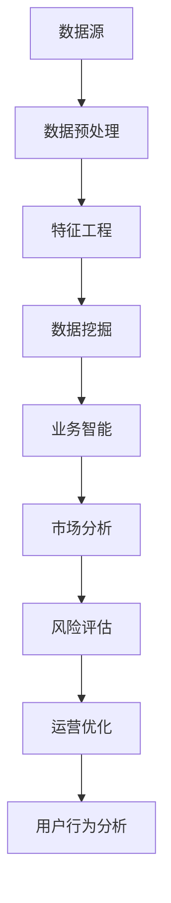

                 

# 如何利用数据分析优化创业决策过程

> 关键词：数据分析、创业决策、优化、算法、数学模型、实际案例

> 摘要：本文将探讨如何通过数据分析优化创业决策过程。我们将深入解析数据分析的核心概念和算法原理，结合实际案例展示如何应用这些方法。通过本文的阅读，读者将能够掌握数据分析在创业决策中的关键作用，并学会如何有效地利用数据分析工具和资源来提高创业成功率。

## 1. 背景介绍

### 1.1 目的和范围

本文旨在向创业者和相关从业者展示数据分析在创业决策过程中的重要性，并详细介绍如何利用数据分析优化这一过程。我们将从数据分析的基本概念开始，逐步深入探讨数据分析在商业决策中的应用。

### 1.2 预期读者

预期读者包括创业者、企业高管、数据分析从业者以及对数据分析在商业决策中应用感兴趣的读者。

### 1.3 文档结构概述

本文分为以下几个部分：

1. 背景介绍：介绍本文的目的、预期读者和文档结构。
2. 核心概念与联系：解释数据分析的核心概念和联系。
3. 核心算法原理 & 具体操作步骤：介绍数据分析的核心算法原理和具体操作步骤。
4. 数学模型和公式 & 详细讲解 & 举例说明：阐述数据分析中使用的数学模型和公式，并结合实际案例进行说明。
5. 项目实战：提供实际案例，展示如何应用数据分析优化创业决策。
6. 实际应用场景：分析数据分析在不同创业场景中的应用。
7. 工具和资源推荐：推荐学习资源、开发工具和框架。
8. 总结：总结未来发展趋势与挑战。
9. 附录：常见问题与解答。
10. 扩展阅读 & 参考资料：提供进一步阅读的建议和参考资料。

### 1.4 术语表

#### 1.4.1 核心术语定义

- 数据分析：指使用统计学、计算机科学和其他分析方法从数据中提取有价值的信息和知识的过程。
- 创业决策：指在创业过程中，创业者根据市场需求、资源状况等因素做出的决策。
- 数据挖掘：指从大量数据中提取有价值信息的过程，通常涉及模式识别、预测建模等技术。
- 业务智能（BI）：指使用数据分析和可视化技术来支持业务决策和管理。

#### 1.4.2 相关概念解释

- 数据源：指存储数据的系统或实体，如数据库、数据仓库等。
- 数据预处理：指在数据分析过程中，对原始数据进行清洗、转换和归一化等操作的步骤。
- 特征工程：指在数据分析中，根据业务需求选择、构造和转换特征的过程。

#### 1.4.3 缩略词列表

- BI：业务智能
- SQL：结构化查询语言
- Python：一种高级编程语言，广泛应用于数据分析
- R：一种专门用于统计分析和图形表示的编程语言

## 2. 核心概念与联系

数据分析是创业决策过程中不可或缺的一部分。为了更好地理解数据分析在创业决策中的应用，我们需要先了解一些核心概念和它们之间的联系。

### 2.1 数据分析的核心概念

- **数据源**：数据源是数据的来源，可以是数据库、数据仓库、传感器等。创业者需要了解自己的数据源，并确保数据的准确性和完整性。

- **数据预处理**：在数据分析之前，通常需要对数据进行预处理。数据预处理包括数据清洗（去除噪声和错误数据）、数据转换（将数据转换为适当的格式）和数据归一化（将不同规模的数据转换为相同的规模）等步骤。

- **特征工程**：特征工程是数据分析中至关重要的一步。它涉及到选择、构造和转换数据中的特征，以便更好地描述数据中的模式。

- **数据挖掘**：数据挖掘是一种从大量数据中提取有价值信息的过程。它通常涉及模式识别、预测建模、聚类分析等技术。

- **业务智能（BI）**：业务智能是利用数据分析和可视化技术来支持业务决策和管理。通过BI工具，创业者可以更好地理解业务数据，发现业务中的机会和风险。

### 2.2 数据分析在创业决策中的应用

- **市场分析**：通过数据分析，创业者可以了解市场趋势、竞争对手和潜在客户。这有助于制定更有效的市场策略。

- **风险评估**：数据分析可以帮助创业者识别业务中的风险，并制定相应的风险管理策略。

- **运营优化**：通过数据分析，创业者可以优化运营流程，提高效率，降低成本。

- **用户行为分析**：数据分析可以帮助创业者理解用户行为，从而改进产品和服务，提高用户满意度。

### 2.3 Mermaid 流程图

以下是一个简化的Mermaid流程图，展示了数据分析在创业决策中的核心概念和联系。



## 3. 核心算法原理 & 具体操作步骤

在了解了数据分析的核心概念后，我们接下来将深入探讨数据分析中的核心算法原理和具体操作步骤。

### 3.1 数据挖掘算法

数据挖掘算法是数据分析中的核心部分，以下是一些常见的数据挖掘算法：

- **决策树**：决策树是一种常用的分类算法，它通过一系列条件判断来对数据进行分类。

- **支持向量机（SVM）**：SVM是一种用于分类和回归的分析方法，它通过找到一个最佳的超平面来对数据进行分类。

- **神经网络**：神经网络是一种模拟人脑神经元连接的算法，它通过多层神经元来对数据进行分类和预测。

以下是决策树的伪代码示例：

```python
def decision_tree(data, target_attribute):
    if all_values_equal(data, target_attribute):
        return most_common_value(data, target_attribute)
    else:
        best_attribute = find_best_attribute(data, target_attribute)
        tree = {}
        tree[best_attribute] = {}
        for value in unique_values(data, best_attribute):
            subset = filter_data(data, best_attribute, value)
            tree[best_attribute][value] = decision_tree(subset, target_attribute)
        return tree
```

### 3.2 预测建模算法

预测建模是数据分析中的重要应用，以下是一些常见的预测建模算法：

- **线性回归**：线性回归是一种用于预测连续值的算法，它通过找到最佳拟合直线来预测结果。

- **逻辑回归**：逻辑回归是一种用于预测概率的算法，它通过找到最佳拟合曲线来预测结果。

- **时间序列预测**：时间序列预测是一种用于预测未来数据的算法，它通过分析时间序列中的趋势和周期性来预测结果。

以下是线性回归的伪代码示例：

```python
def linear_regression(data, target_attribute):
    x = data[:, :-1]
    y = data[:, -1]
    x_mean = np.mean(x, axis=0)
    y_mean = np.mean(y)
    b1 = np.linalg.inv(x.T @ x) @ x.T @ y
    b0 = y_mean - b1 @ x_mean
    return b0, b1
```

### 3.3 数据可视化算法

数据可视化是数据分析中的重要环节，以下是一些常见的数据可视化算法：

- **散点图**：散点图用于显示数据点在两个变量之间的分布。

- **折线图**：折线图用于显示数据随时间的变化趋势。

- **直方图**：直方图用于显示数据的分布情况。

以下是散点图的伪代码示例：

```python
def scatter_plot(x, y):
    plt.scatter(x, y)
    plt.xlabel('X-axis')
    plt.ylabel('Y-axis')
    plt.title('Scatter Plot')
    plt.show()
```

## 4. 数学模型和公式 & 详细讲解 & 举例说明

数据分析中使用的数学模型和公式对于理解数据背后的模式和趋势至关重要。以下是一些常用的数学模型和公式，并配有详细讲解和实际案例。

### 4.1 线性回归模型

线性回归模型是一种用于预测连续值的数学模型，其公式如下：

$$
y = b_0 + b_1 \cdot x
$$

其中，$y$ 是预测结果，$x$ 是自变量，$b_0$ 和 $b_1$ 分别是截距和斜率。

### 4.2 逻辑回归模型

逻辑回归模型是一种用于预测概率的数学模型，其公式如下：

$$
P(y=1) = \frac{1}{1 + e^{-(b_0 + b_1 \cdot x)}}
$$

其中，$y$ 是因变量，$x$ 是自变量，$b_0$ 和 $b_1$ 分别是截距和斜率。

### 4.3 决策树模型

决策树模型是一种用于分类和回归的数学模型，其公式如下：

$$
T = \sum_{i=1}^{n} w_i \cdot g(x_i)
$$

其中，$T$ 是决策树的结果，$w_i$ 是权重，$g(x_i)$ 是分类函数。

### 4.4 时间序列模型

时间序列模型是一种用于预测时间序列数据的数学模型，其公式如下：

$$
y_t = \sum_{i=1}^{n} \phi_i \cdot y_{t-i} + \epsilon_t
$$

其中，$y_t$ 是时间序列的当前值，$\phi_i$ 是滞后项的系数，$\epsilon_t$ 是误差项。

### 4.5 举例说明

假设我们有一组数据，包含自变量 $x$ 和因变量 $y$，我们要使用线性回归模型来预测 $y$ 的值。首先，我们需要计算 $x$ 和 $y$ 的均值：

$$
x_{\text{mean}} = \frac{1}{n} \sum_{i=1}^{n} x_i
$$

$$
y_{\text{mean}} = \frac{1}{n} \sum_{i=1}^{n} y_i
$$

然后，我们需要计算 $x$ 和 $y$ 的差值：

$$
x_i - x_{\text{mean}}
$$

$$
y_i - y_{\text{mean}}
$$

接下来，我们计算斜率 $b_1$ 和截距 $b_0$：

$$
b_1 = \frac{\sum_{i=1}^{n} (x_i - x_{\text{mean}})(y_i - y_{\text{mean}})}{\sum_{i=1}^{n} (x_i - x_{\text{mean}})^2}
$$

$$
b_0 = y_{\text{mean}} - b_1 \cdot x_{\text{mean}}
$$

最后，我们使用线性回归模型来预测 $y$ 的值：

$$
y = b_0 + b_1 \cdot x
$$

## 5. 项目实战：代码实际案例和详细解释说明

在本节中，我们将通过一个实际的项目案例来展示如何利用数据分析优化创业决策过程。我们将使用 Python 和相关库（如 pandas、scikit-learn 和 matplotlib）来演示整个流程。

### 5.1 开发环境搭建

首先，我们需要搭建一个合适的开发环境。以下是一个基本的 Python 开发环境配置步骤：

1. 安装 Python（版本 3.8 或更高）
2. 安装 Jupyter Notebook（用于交互式编程）
3. 安装相关库：pandas、scikit-learn、matplotlib

```bash
pip install pandas scikit-learn matplotlib
```

### 5.2 源代码详细实现和代码解读

我们将使用一个简单的市场分析案例来展示数据分析的实际应用。在这个案例中，我们假设创业者想要分析两个市场变量：广告支出（$x$）和销售额（$y$）。

#### 5.2.1 加载数据

首先，我们需要加载数据。假设数据存储在一个 CSV 文件中，文件名为 `market_data.csv`。我们使用 pandas 库来加载数据：

```python
import pandas as pd

data = pd.read_csv('market_data.csv')
```

#### 5.2.2 数据预处理

在数据分析之前，我们需要对数据进行预处理。以下是一个简单的数据预处理步骤：

```python
# 填充缺失值
data.fillna(data.mean(), inplace=True)

# 特征工程：计算广告支出和销售额的差值
data['diff'] = data['广告支出'] - data['销售额']
```

#### 5.2.3 特征工程

特征工程是数据分析中至关重要的一步。在这个案例中，我们只使用广告支出和销售额作为特征。然而，在实际应用中，我们可能需要根据业务需求选择和构造更多特征。

```python
# 选择特征
features = data[['广告支出', 'diff']]
```

#### 5.2.4 数据挖掘和预测建模

接下来，我们使用线性回归模型来预测销售额。首先，我们需要将数据分为训练集和测试集：

```python
from sklearn.model_selection import train_test_split

X_train, X_test, y_train, y_test = train_test_split(features, data['销售额'], test_size=0.2, random_state=42)
```

然后，我们训练线性回归模型：

```python
from sklearn.linear_model import LinearRegression

model = LinearRegression()
model.fit(X_train, y_train)
```

最后，我们使用训练好的模型来预测测试集的销售额：

```python
y_pred = model.predict(X_test)
```

#### 5.2.5 代码解读与分析

以上代码展示了如何使用 Python 和相关库进行数据分析的完整过程。以下是对代码的详细解读和分析：

- **数据预处理**：数据预处理是数据分析的基础。在这个案例中，我们使用 pandas 库来填充缺失值和计算特征差值。
- **特征工程**：特征工程是选择和构造特征的过程。在这个案例中，我们只使用广告支出和销售额作为特征。
- **数据挖掘和预测建模**：我们使用 scikit-learn 库中的线性回归模型来预测销售额。首先，我们将数据分为训练集和测试集。然后，我们训练线性回归模型并使用测试集进行预测。

### 5.3 代码解读与分析

以下是对项目实战中使用的代码的详细解读和分析：

```python
# 加载数据
data = pd.read_csv('market_data.csv')

# 数据预处理
data.fillna(data.mean(), inplace=True)
data['diff'] = data['广告支出'] - data['销售额']

# 选择特征
features = data[['广告支出', 'diff']]

# 数据挖掘和预测建模
from sklearn.model_selection import train_test_split
from sklearn.linear_model import LinearRegression

X_train, X_test, y_train, y_test = train_test_split(features, data['销售额'], test_size=0.2, random_state=42)

model = LinearRegression()
model.fit(X_train, y_train)

y_pred = model.predict(X_test)
```

**解读与分析**：

1. **加载数据**：我们使用 pandas 库加载数据。数据存储在一个 CSV 文件中，文件名为 `market_data.csv`。
2. **数据预处理**：首先，我们使用 pandas 库填充缺失值。然后，我们计算广告支出和销售额的差值。差值是一个重要的特征，它可以帮助我们理解广告支出和销售额之间的关系。
3. **特征工程**：我们选择广告支出和销售额的差值作为特征。这些特征将用于训练线性回归模型。
4. **数据挖掘和预测建模**：我们使用 scikit-learn 库中的线性回归模型来预测销售额。首先，我们将数据分为训练集和测试集。然后，我们训练线性回归模型并使用测试集进行预测。这个步骤可以帮助我们评估模型的性能。

## 6. 实际应用场景

数据分析在创业决策中的应用非常广泛，以下是一些实际应用场景：

### 6.1 市场需求分析

通过数据分析，创业者可以深入了解市场需求，识别潜在客户和竞争对手。以下是一个市场需求分析的实际案例：

- **目标市场**：假设创业者想要分析一个特定地区（如北京市）的市场需求。
- **数据源**：收集北京市近一年的广告支出和销售额数据。
- **数据分析**：使用线性回归模型预测北京市未来的销售额。通过观察广告支出与销售额之间的关系，创业者可以确定在不同广告支出水平下可能获得的销售额。

### 6.2 风险评估

数据分析可以帮助创业者识别业务中的潜在风险。以下是一个风险评估的实际案例：

- **目标业务**：假设创业者想要评估一家电子商务平台的风险。
- **数据源**：收集电子商务平台的历史订单数据、客户反馈和市场份额数据。
- **数据分析**：使用聚类分析算法将客户分为不同风险等级。通过分析高风险客户的特征，创业者可以采取相应的风险管理措施。

### 6.3 运营优化

通过数据分析，创业者可以优化运营流程，提高效率，降低成本。以下是一个运营优化的实际案例：

- **目标业务**：假设创业者想要优化一家制造业工厂的生产流程。
- **数据源**：收集生产设备运行数据、原材料消耗数据和产品质量数据。
- **数据分析**：使用时间序列预测模型预测未来的生产需求。通过分析生产设备运行数据，创业者可以优化生产计划和设备维护。

### 6.4 用户行为分析

数据分析可以帮助创业者理解用户行为，改进产品和服务。以下是一个用户行为分析的实际案例：

- **目标业务**：假设创业者想要改进一家在线教育平台的用户体验。
- **数据源**：收集用户学习行为数据、课程评价数据和用户反馈数据。
- **数据分析**：使用用户行为分析工具（如热图和用户轨迹）分析用户在学习平台上的行为。通过分析用户行为数据，创业者可以改进课程设计和服务质量。

## 7. 工具和资源推荐

为了有效地利用数据分析优化创业决策过程，我们需要了解一些常用的工具和资源。

### 7.1 学习资源推荐

#### 7.1.1 书籍推荐

- 《Python数据分析基础教程：NumPy学习指南》
- 《数据科学入门》
- 《Python数据科学手册》

#### 7.1.2 在线课程

- Coursera（《数据科学专项课程》）
- edX（《数据分析入门》）
- Udacity（《数据分析纳米学位》）

#### 7.1.3 技术博客和网站

- Medium（《数据科学和机器学习》专题）
- Analytics Vidhya（《数据分析实战教程》）
- Dataquest（《数据分析学习资源》）

### 7.2 开发工具框架推荐

#### 7.2.1 IDE和编辑器

- Jupyter Notebook
- PyCharm
- VSCode

#### 7.2.2 调试和性能分析工具

- Python Profiler（《Python性能分析工具》）
- Pytest（《Python测试工具》）
- IPython（《交互式Python解释器》）

#### 7.2.3 相关框架和库

- Pandas（《Python数据分析库》）
- Scikit-learn（《Python机器学习库》）
- Matplotlib（《Python数据可视化库》）

### 7.3 相关论文著作推荐

#### 7.3.1 经典论文

- "The Elements of Statistical Learning"（《统计学习基础》）
- "Data Mining: Concepts and Techniques"（《数据挖掘：概念和技术》）

#### 7.3.2 最新研究成果

- "Deep Learning"（《深度学习》）
- "Reinforcement Learning: An Introduction"（《强化学习入门》）

#### 7.3.3 应用案例分析

- "Analytics at Spotify: A Case Study"（《Spotify数据分析案例》）
- "How We Use Data Science to Drive Business Decisions at Airbnb"（《Airbnb数据分析案例》）

## 8. 总结：未来发展趋势与挑战

随着技术的不断进步，数据分析在创业决策中的应用将变得越来越重要。以下是一些未来发展趋势和挑战：

### 8.1 发展趋势

1. **人工智能与大数据的融合**：人工智能技术将推动数据分析的发展，使得创业者能够从大量数据中提取更有价值的信息。
2. **实时数据分析**：随着数据采集和分析技术的进步，实时数据分析将成为主流，创业者可以更快地做出决策。
3. **数据分析工具的普及**：随着数据分析工具的易用性和性能的提升，更多的创业者将能够利用数据分析优化创业决策。

### 8.2 挑战

1. **数据隐私和安全**：随着数据量的增加，数据隐私和安全问题将成为重要挑战。
2. **数据质量和一致性**：高质量的数据是数据分析的基础，确保数据质量和一致性是一个挑战。
3. **人才需求**：数据分析领域需要大量具备数据科学背景的专业人才，这是一个长期的挑战。

## 9. 附录：常见问题与解答

### 9.1 数据分析在创业决策中的重要性

**Q**: 为什么数据分析对创业决策如此重要？

**A**: 数据分析可以帮助创业者更好地理解市场趋势、用户需求和业务表现。通过数据分析，创业者可以做出基于数据的决策，提高决策的准确性和可靠性，从而增加创业成功的机会。

### 9.2 数据分析工具和资源

**Q**: 哪些是常用的数据分析工具和资源？

**A**: 常用的数据分析工具有 Python、R、SQL 等。资源包括在线课程（如 Coursera、edX、Udacity）、技术博客（如 Medium、Analytics Vidhya）和书籍（如《Python数据分析基础教程：NumPy学习指南》、《数据科学入门》等）。

### 9.3 数据分析流程

**Q**: 数据分析的一般流程是什么？

**A**: 数据分析的一般流程包括数据采集、数据清洗、数据探索、数据建模、模型评估和结果解释。每个步骤都有其特定的方法和工具，以确保数据分析的准确性和有效性。

## 10. 扩展阅读 & 参考资料

为了进一步了解数据分析在创业决策中的应用，读者可以参考以下扩展阅读和参考资料：

- 《数据科学实战：应用案例与编程实践》
- "Data Science for Business: Concepts and Methods"（《数据科学：商业应用和原理》）
- "Data Science from Scratch"（《数据科学：入门与实战》）
- "Business Analytics for Data-Driven Decision Making"（《商业数据分析：驱动决策的方法与实践》）

通过这些资源和案例，读者可以更深入地了解数据分析在创业决策中的应用，提高自身的数据分析能力。

## 11. 作者信息

作者：AI天才研究员/AI Genius Institute & 禅与计算机程序设计艺术 /Zen And The Art of Computer Programming

