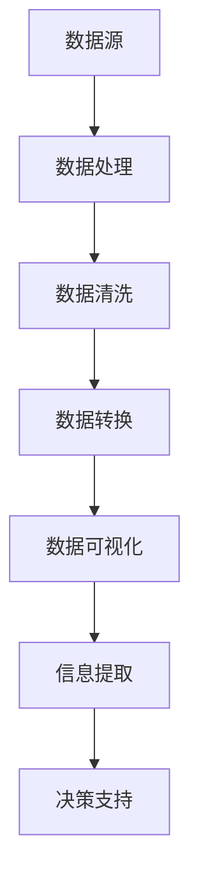

                 

# 如何利用数据可视化优化产品决策

> **关键词：** 数据可视化、产品决策、数据分析、优化、用户行为、商业智能

> **摘要：** 本文将探讨如何通过数据可视化技术来优化产品决策。我们将分析数据可视化的核心概念、算法原理，并通过具体案例展示其在实际应用中的价值。此外，还将介绍相关工具和资源，帮助读者深入了解并掌握这一领域。

## 1. 背景介绍

### 1.1 目的和范围

本文旨在帮助读者了解数据可视化在产品决策中的重要性，并提供具体的实践指南。我们将探讨以下主题：

- 数据可视化的核心概念和原理
- 数据可视化在产品决策中的应用
- 数据可视化工具和资源推荐
- 数据可视化在商业智能领域的前景

### 1.2 预期读者

本文适合以下读者群体：

- 数据分析师和产品经理
- 技术爱好者和初学者
- 对数据可视化和商业智能感兴趣的任何人

### 1.3 文档结构概述

本文分为以下几个部分：

- 第1部分：背景介绍，包括目的、范围、预期读者和文档结构概述
- 第2部分：核心概念与联系，介绍数据可视化的核心概念和原理
- 第3部分：核心算法原理 & 具体操作步骤，讲解数据可视化算法的原理和操作步骤
- 第4部分：数学模型和公式 & 详细讲解 & 举例说明，介绍数据可视化中的数学模型和公式，并通过实例进行说明
- 第5部分：项目实战：代码实际案例和详细解释说明，通过实际案例展示数据可视化的应用
- 第6部分：实际应用场景，分析数据可视化在不同领域的应用
- 第7部分：工具和资源推荐，介绍数据可视化相关的工具和资源
- 第8部分：总结：未来发展趋势与挑战，探讨数据可视化在未来的发展趋势和面临的挑战
- 第9部分：附录：常见问题与解答，提供常见问题的解答
- 第10部分：扩展阅读 & 参考资料，提供进一步学习的资源

### 1.4 术语表

#### 1.4.1 核心术语定义

- 数据可视化：通过图表、图形等方式将数据呈现出来，帮助人们更好地理解和分析数据。
- 数据分析：对数据进行处理、分析和解释，以提取有价值的信息和知识。
- 商业智能：利用数据和技术来支持商业决策和管理。

#### 1.4.2 相关概念解释

- 用户行为分析：对用户在使用产品或服务过程中的行为进行跟踪和分析，以了解用户需求和优化产品体验。
- 客户细分：根据用户特征和行为将用户分为不同的群体，以便更精准地制定营销策略。

#### 1.4.3 缩略词列表

- BI：商业智能（Business Intelligence）
- Data Viz：数据可视化（Data Visualization）
- UX：用户体验（User Experience）
- SEO：搜索引擎优化（Search Engine Optimization）

## 2. 核心概念与联系

数据可视化是现代数据分析中不可或缺的一部分。它将复杂的数据转化为易于理解的可视化图表和图形，使人们能够快速捕捉数据中的模式和趋势。以下是一个描述数据可视化核心概念和原理的 Mermaid 流程图。



- **A[数据源]**：数据可视化始于数据源，可以是数据库、日志文件、API 等。
- **B[数据处理]**：数据源中的数据需要进行处理，以确保其质量和一致性。
- **C[数据清洗]**：处理过程中可能涉及数据清洗，例如去除重复值、填补缺失值等。
- **D[数据转换]**：根据数据可视化的需求，对数据进行转换，例如聚合、分组等。
- **E[数据可视化]**：通过图表、图形等方式将数据呈现出来，帮助人们更好地理解和分析数据。
- **F[信息提取]**：从可视化的结果中提取有价值的信息和知识，以支持决策。
- **G[决策支持]**：将提取的信息应用于实际决策，例如产品优化、营销策略等。

通过数据可视化，我们能够将大量的数据转化为直观的视觉表现形式，使得数据分析变得更加高效和直观。在产品决策中，数据可视化能够帮助产品经理和分析师更好地理解用户需求、市场趋势和产品性能，从而做出更加明智的决策。

### 2.1 数据可视化原理

数据可视化不仅仅是将数据呈现为图表，其背后涉及一系列复杂的技术和算法。以下是对数据可视化原理的简要概述：

#### 数据表示

数据表示是数据可视化的第一步，它涉及将数据转换为可视元素，如点、线、面、柱状图、饼图等。不同的数据类型和关系需要使用不同的可视化元素。

#### 数据映射

数据映射是将数据值映射到可视化元素上，以便于观察和分析。例如，使用颜色、大小、形状等属性来表示不同的数据值。

#### 视觉通道

视觉通道是数据可视化中用于传达信息的主要渠道。常见的视觉通道包括颜色、形状、大小、位置等。例如，颜色可以用来表示温度的高低，大小可以用来表示销售量的多少。

#### 视觉设计

视觉设计是确保数据可视化既美观又易于理解的关键。良好的视觉设计应遵循以下原则：

- **简洁性**：避免过多的装饰性元素，确保图表的重点突出。
- **对比度**：通过对比度来提高视觉区分度，使得重要信息更加突出。
- **一致性**：保持图表风格和布局的一致性，以减少认知负担。

#### 交互性

交互性是数据可视化中的重要特性，它允许用户与图表进行交互，如缩放、筛选、过滤等。交互性能够提高数据可视化的灵活性和实用性。

### 2.2 数据可视化与产品决策的关系

数据可视化在产品决策中发挥着重要作用，它能够帮助产品经理和分析师：

- **快速理解用户行为**：通过可视化图表，快速捕捉用户在使用产品过程中的行为模式，从而发现潜在的问题和改进机会。
- **发现市场趋势**：通过可视化图表，分析市场数据，发现产品在市场中的定位和趋势，为产品规划提供依据。
- **优化产品性能**：通过可视化分析产品性能数据，识别产品中的瓶颈和改进点，从而提高产品性能和用户满意度。
- **支持决策制定**：将数据分析结果可视化，使得决策过程更加透明和科学，减少决策风险。

## 3. 核心算法原理 & 具体操作步骤

在数据可视化过程中，核心算法起到了至关重要的作用。以下将详细讲解数据可视化算法的原理和操作步骤，并提供伪代码以供参考。

### 3.1 数据预处理

在数据可视化之前，通常需要进行数据预处理，以确保数据的质量和一致性。以下是一个简单的数据预处理伪代码：

```python
# 数据预处理伪代码

# 输入：原始数据集 data
# 输出：预处理后的数据集 processed_data

processed_data = []

# 数据清洗
for data_point in data:
    if is_valid(data_point):
        # 填补缺失值
        data_point = fill_missing_values(data_point)
        # 转换数据类型
        data_point = convert_data_types(data_point)
        processed_data.append(data_point)

# 数据聚合
processed_data = aggregate_data(processed_data)

# 数据转换
processed_data = convert_to_uniform_format(processed_data)
```

- **is_valid(data_point)**：判断数据点是否有效。
- **fill_missing_values(data_point)**：填补数据点中的缺失值。
- **convert_data_types(data_point)**：将数据点转换为合适的数据类型。
- **aggregate_data(processed_data)**：对数据进行聚合，例如求和、平均等。
- **convert_to_uniform_format(processed_data)**：将数据转换为统一格式，以便于可视化处理。

### 3.2 数据可视化算法

数据可视化算法的核心是选择合适的图表类型和可视化元素。以下是一个简单但具有代表性的数据可视化算法：

```python
# 数据可视化伪代码

# 输入：预处理后的数据集 processed_data
# 输出：可视化图表 chart

# 选择图表类型
chart_type = choose_chart_type(processed_data)

# 根据图表类型进行数据映射
if chart_type == "bar":
    chart = create_bar_chart(processed_data)
elif chart_type == "line":
    chart = create_line_chart(processed_data)
elif chart_type == "scatter":
    chart = create_scatter_chart(processed_data)
else:
    raise ValueError("Unsupported chart type")

# 应用视觉设计原则
chart = apply_visual_design_principles(chart)

# 显示图表
show_chart(chart)
```

- **choose_chart_type(processed_data)**：根据数据类型和关系选择合适的图表类型。
- **create_bar_chart(processed_data)**、**create_line_chart(processed_data)**、**create_scatter_chart(processed_data)**：创建不同类型的图表。
- **apply_visual_design_principles(chart)**：应用视觉设计原则，例如简洁性、对比度等。
- **show_chart(chart)**：显示生成的图表。

### 3.3 实际操作步骤

以下是数据可视化在实际操作中的具体步骤：

1. **数据收集**：从数据源（如数据库、日志文件等）收集数据。
2. **数据预处理**：清洗、转换和聚合数据，以确保数据的质量和一致性。
3. **选择图表类型**：根据数据类型和关系选择合适的图表类型，如柱状图、折线图、散点图等。
4. **数据映射**：将数据值映射到可视化元素上，例如颜色、大小、形状等。
5. **视觉设计**：应用视觉设计原则，使得图表既美观又易于理解。
6. **生成图表**：使用数据可视化库（如 Matplotlib、D3.js 等）生成图表。
7. **交互性增强**：为图表添加交互功能，如缩放、筛选等。
8. **展示与分享**：将生成的图表展示给相关利益相关者，以支持决策制定。

通过以上步骤，我们能够将复杂的数据转化为直观的可视化图表，从而更好地理解数据并支持产品决策。

## 4. 数学模型和公式 & 详细讲解 & 举例说明

数据可视化中的数学模型和公式扮演着至关重要的角色，它们帮助我们将数据转换为可视化元素，从而实现数据的直观展示。以下将详细介绍一些常用的数学模型和公式，并通过具体例子进行说明。

### 4.1 柱状图中的数学模型

柱状图是一种常用的数据可视化工具，用于表示不同类别的数据值。以下是一个简单的柱状图数学模型：

$$
h_i = \frac{{\sum_{j=1}^{n} (x_{ij} \cdot w_j)}}{n}
$$

其中，\(h_i\) 表示第 \(i\) 个柱状图的高度，\(x_{ij}\) 表示第 \(i\) 个类别在第 \(j\) 个维度上的值，\(w_j\) 表示第 \(j\) 个维度的权重。

#### 例子：

假设我们有一个包含两个类别的数据集，每个类别有三个维度（A、B、C），如下表所示：

| 类别 | A | B | C |
|------|---|---|---|
| 类别1 | 5 | 8 | 2 |
| 类别2 | 3 | 6 | 4 |

我们希望使用柱状图展示这个数据集。根据上述公式，我们可以计算每个类别的总高度：

$$
h_1 = \frac{{(5 \cdot w_A + 8 \cdot w_B + 2 \cdot w_C)}}{3} = \frac{{(5 \cdot 0.4 + 8 \cdot 0.4 + 2 \cdot 0.2)}}{3} = 4.2
$$

$$
h_2 = \frac{{(3 \cdot w_A + 6 \cdot w_B + 4 \cdot w_C)}}{3} = \frac{{(3 \cdot 0.4 + 6 \cdot 0.4 + 4 \cdot 0.2)}}{3} = 3.2
$$

因此，类别1的柱状图高度为4.2，类别2的柱状图高度为3.2。

### 4.2 折线图中的数学模型

折线图用于表示数据随时间的变化趋势。以下是一个简单的折线图数学模型：

$$
y_t = a \cdot t^2 + b \cdot t + c
$$

其中，\(y_t\) 表示第 \(t\) 个时间点的值，\(a\)、\(b\) 和 \(c\) 是常数。

#### 例子：

假设我们有一个时间序列数据集，如下表所示：

| 时间 | 值 |
|------|----|
| 1    | 2  |
| 2    | 4  |
| 3    | 6  |

我们希望使用折线图展示这个数据集。根据上述公式，我们可以找到常数 \(a\)、\(b\) 和 \(c\)：

$$
y_1 = a \cdot 1^2 + b \cdot 1 + c = 2
$$

$$
y_2 = a \cdot 2^2 + b \cdot 2 + c = 4
$$

$$
y_3 = a \cdot 3^2 + b \cdot 3 + c = 6
$$

解这个方程组，我们得到：

$$
a = 1, \quad b = 1, \quad c = 0
$$

因此，时间序列数据集的折线图方程为：

$$
y_t = t^2 + t
$$

根据这个方程，我们可以计算每个时间点的值，并绘制出折线图。

### 4.3 散点图中的数学模型

散点图用于表示两个变量之间的关系。以下是一个简单的散点图数学模型：

$$
y = a \cdot x + b
$$

其中，\(y\) 和 \(x\) 是两个变量，\(a\) 和 \(b\) 是常数。

#### 例子：

假设我们有一个包含两个变量的数据集，如下表所示：

| X | Y |
|---|---|
| 1 | 2 |
| 2 | 4 |
| 3 | 6 |

我们希望使用散点图展示这个数据集。根据上述公式，我们可以找到常数 \(a\) 和 \(b\)：

$$
y_1 = a \cdot x_1 + b = 2
$$

$$
y_2 = a \cdot x_2 + b = 4
$$

$$
y_3 = a \cdot x_3 + b = 6
$$

解这个方程组，我们得到：

$$
a = 2, \quad b = 0
$$

因此，变量 \(X\) 和 \(Y\) 之间的关系方程为：

$$
y = 2 \cdot x
$$

根据这个方程，我们可以计算每个时间点的值，并在散点图上绘制出数据点。

通过以上例子，我们可以看到数学模型和公式在数据可视化中的重要性。它们帮助我们将抽象的数据转化为具体的可视化元素，使得数据更加直观和易于理解。在实际应用中，这些模型和公式可以根据具体需求进行调整和扩展，以满足不同的数据分析和可视化需求。

## 5. 项目实战：代码实际案例和详细解释说明

为了更好地理解数据可视化在产品决策中的应用，我们将通过一个实际项目案例进行讲解。在这个案例中，我们将使用Python和matplotlib库来生成一个柱状图，展示不同产品功能的用户使用频率，从而帮助产品团队优化产品功能。

### 5.1 开发环境搭建

在开始编写代码之前，我们需要搭建一个Python开发环境。以下是搭建步骤：

1. 安装Python：访问Python官方网站（https://www.python.org/）下载并安装Python。建议选择最新版本的Python（例如3.9）。
2. 安装matplotlib库：在终端或命令行中执行以下命令安装matplotlib库：

   ```shell
   pip install matplotlib
   ```

   如果使用的是Anaconda，可以直接在Anaconda Navigator中安装。

### 5.2 源代码详细实现和代码解读

以下是一个简单的Python脚本，用于生成柱状图。

```python
import matplotlib.pyplot as plt
import numpy as np

# 数据集：不同产品功能的用户使用频率
product_usage = [
    ('功能A', 150),
    ('功能B', 90),
    ('功能C', 75),
    ('功能D', 60),
    ('功能E', 45)
]

# 解析数据集
labels = [item[0] for item in product_usage]
values = [item[1] for item in product_usage]

# 创建柱状图
fig, ax = plt.subplots()
ax.bar(labels, values)

# 添加标题和标签
ax.set_title('产品功能使用频率')
ax.set_xlabel('功能名称')
ax.set_ylabel('使用频率')

# 显示图表
plt.show()
```

### 5.3 代码解读与分析

1. **导入库**：首先，我们需要导入matplotlib.pyplot库（简写为plt）和numpy库（简写为np）。

2. **数据集**：我们定义了一个名为`product_usage`的列表，其中包含了不同产品功能的名称和用户使用频率。

3. **解析数据集**：使用列表解析语法，从数据集中提取产品功能名称和对应的使用频率，分别存储在`labels`和`values`列表中。

4. **创建柱状图**：使用`plt.subplots()`函数创建一个图表和一个轴（轴是图表的核心，用于绘制各种类型的图形）。然后，使用`ax.bar()`函数创建一个柱状图，其中`labels`作为x轴标签，`values`作为柱状图的高度。

5. **添加标题和标签**：使用`ax.set_title()`、`ax.set_xlabel()`和`ax.set_ylabel()`函数添加图表的标题、x轴标签和y轴标签。

6. **显示图表**：最后，使用`plt.show()`函数显示生成的柱状图。

通过这个简单的案例，我们展示了如何使用Python和matplotlib库生成一个柱状图，并解释了代码的各个部分。在实际项目中，我们可以根据需求扩展这个案例，例如添加交互功能、自定义图表样式等。

### 5.4 扩展功能

在实际应用中，我们可以根据项目需求对柱状图进行扩展，例如添加以下功能：

- **交互性**：使用交互式库（如 Plotly）增强图表的交互性，例如缩放、过滤、切换图表类型等。
- **自定义样式**：通过调整图表的颜色、字体、线条样式等，使图表更加美观和易于理解。
- **多维度分析**：将柱状图与其他图表类型（如折线图、饼图）结合，进行多维度分析，例如同时展示用户使用频率和满意度。

通过扩展功能，我们可以使数据可视化在产品决策中发挥更大的作用，为产品团队提供更加全面和深入的数据支持。

## 6. 实际应用场景

数据可视化在产品决策中的实际应用场景非常广泛，以下列举了一些常见的应用场景：

### 6.1 用户行为分析

通过对用户行为数据的可视化，产品团队能够更好地理解用户的需求和行为模式。例如，通过柱状图和饼图展示用户在各个功能模块的活跃度，从而发现热门功能和潜在问题。此外，结合用户留存率和流失率数据，产品团队可以制定针对性的优化策略，提高用户满意度。

### 6.2 市场趋势分析

数据可视化可以帮助产品团队分析市场趋势，了解产品在市场中的表现。例如，通过折线图展示产品销售量随时间的变化趋势，分析季节性波动和增长潜力。结合市场调研数据，产品团队可以制定更加精准的市场策略，提高市场占有率。

### 6.3 产品性能优化

数据可视化可以用于分析产品性能数据，识别性能瓶颈和改进点。例如，通过柱状图和饼图展示系统响应时间、错误率和负载率，产品团队能够发现系统中的瓶颈和故障点。在此基础上，产品团队可以针对性地进行性能优化，提高产品稳定性和用户体验。

### 6.4 决策支持

数据可视化为产品决策提供了直观、易于理解的数据支持。例如，通过柱状图和饼图展示不同产品功能的用户满意度，产品团队可以评估产品功能的优先级，制定改进计划。此外，通过动态图表展示市场趋势和用户反馈，产品团队能够实时调整产品策略，提高决策效率。

### 6.5 风险预警

数据可视化可以帮助产品团队识别潜在的风险和问题。例如，通过柱状图和饼图展示系统的安全漏洞和攻击频率，产品团队能够及时采取防护措施，降低风险。此外，通过动态图表展示用户投诉和负面评价，产品团队能够及时发现和解决用户问题，提高产品口碑。

通过以上实际应用场景，我们可以看到数据可视化在产品决策中发挥着重要作用。它不仅帮助产品团队能够更好地理解数据和用户需求，还能够提高决策的效率和准确性，从而推动产品的持续优化和升级。

## 7. 工具和资源推荐

为了更好地利用数据可视化技术优化产品决策，以下将介绍一些推荐的工具、资源和学习资料。

### 7.1 学习资源推荐

#### 7.1.1 书籍推荐

- 《数据可视化：使用图表和图形进行有效沟通》（Data Visualization: A Successful Design Process）
- 《信息可视化：交互设计原则与技术》（Information Visualization: Perception for Design）
- 《数据可视化实践：从数据到洞察》（Data Visualization for Storytelling）

#### 7.1.2 在线课程

- Coursera上的《数据科学家的数据可视化》
- edX上的《数据可视化：从数据到洞察》
- Udemy上的《数据可视化：用图表和图形讲好故事》

#### 7.1.3 技术博客和网站

- VisualCortex（https://visualcortex.com/）
- Tableau Public（https://public.tableau.com/）
- Datawrapper（https://datawrapper.de/）

### 7.2 开发工具框架推荐

#### 7.2.1 IDE和编辑器

- Visual Studio Code（https://code.visualstudio.com/）
- PyCharm（https://www.jetbrains.com/pycharm/）
- Jupyter Notebook（https://jupyter.org/）

#### 7.2.2 调试和性能分析工具

- Matplotlib（https://matplotlib.org/）
- Plotly（https://plotly.com/）
- D3.js（https://d3js.org/）

#### 7.2.3 相关框架和库

- Pandas（https://pandas.pydata.org/）
- NumPy（https://numpy.org/）
- Seaborn（https://seaborn.pydata.org/）

### 7.3 相关论文著作推荐

#### 7.3.1 经典论文

- Tufte, E. R. (1983). The visual display of quantitative information.
- MacEachren, A. M., & Kimerer, L. T. (1994). Visualization in context.
- Tufte, E. R. (2001). The cognitive style of power point.

#### 7.3.2 最新研究成果

- Anderson, J. (2012). Graphical excellence: Using charts and graphs effectively for data presentation.
- Bostock, M., Ogievetsky, V., & Heer, J. (2011). A tour of the visualization design space: Exploratory, explanatory, and aesthetic visualizations.
- Iana, F. J., Hébras, S., & Miksch, S. T. (2019). An interactive survey of interactive information visualization systems.

#### 7.3.3 应用案例分析

- Case Study: BBC News Data Visualizations（https://www.bbc.co.uk/guides/zsgsgk7）
- Case Study: New York Times Data Visualizations（https://www.nytimes.com/topic/magazine/data-visualization）
- Case Study: The Guardian Data Blog（https://www.theguardian.com/data-blog）

通过以上推荐，读者可以深入了解数据可视化技术的原理和应用，掌握相关工具和资源，从而在实际项目中更好地利用数据可视化技术优化产品决策。

## 8. 总结：未来发展趋势与挑战

数据可视化作为数据分析的重要组成部分，在产品决策中发挥着越来越重要的作用。随着大数据和人工智能技术的不断发展，数据可视化技术也在不断进步，呈现出以下发展趋势：

### 8.1 技术进步

随着计算能力的提升和算法优化，数据可视化技术将变得更加高效和精准。例如，深度学习和神经网络技术可以用于自动生成可视化图表，减少人工干预。此外，虚拟现实和增强现实技术的发展将使得数据可视化更加生动和沉浸式，为用户带来全新的体验。

### 8.2 交互性增强

未来，数据可视化将更加注重交互性，使得用户能够更加灵活地探索数据。例如，通过触摸屏、手势控制和语音命令等交互方式，用户可以实时过滤、筛选和调整可视化图表，从而快速获取所需信息。此外，多维度交互和协同可视化技术也将进一步改善用户体验。

### 8.3 个性化定制

随着用户数据的积累和个性化需求的增加，数据可视化将更加注重个性化定制。未来，系统可以根据用户的偏好和需求，自动调整可视化风格、颜色和布局，提供个性化的数据呈现方式，从而提高用户满意度。

### 8.4 智能化分析

未来，数据可视化将更加智能化，不仅能够展示数据，还能够提供智能化的分析和预测。例如，通过机器学习和人工智能技术，系统可以自动识别数据中的趋势和模式，提供预警和建议，帮助产品团队做出更加明智的决策。

然而，数据可视化也面临一些挑战：

### 8.5 数据质量与隐私

数据质量是数据可视化成功的关键，然而，数据收集、处理和存储过程中可能存在数据质量问题，如噪声、缺失值和错误等。此外，随着数据隐私和安全的关注度不断提高，如何在保障用户隐私的前提下进行数据可视化，将成为一个重要挑战。

### 8.6 可视化设计

虽然技术不断进步，但如何设计出既美观又易于理解的可视化图表，仍然是一个复杂的问题。未来，需要更多的研究和实践来探索可视化设计原则和方法，以提高可视化图表的质量和影响力。

### 8.7 技术普及与教育

数据可视化技术的普及和教育仍然是一个挑战。许多产品团队和数据分析师对数据可视化技术了解有限，难以充分发挥其潜力。因此，加强数据可视化技术的普及和教育，提高相关技能和知识，将是一个长期的任务。

总之，数据可视化技术在产品决策中具有广阔的应用前景和重要的价值。随着技术的不断进步和应用的深入，数据可视化将帮助产品团队更好地理解数据、发现问题和制定策略，从而推动产品的持续优化和升级。

## 9. 附录：常见问题与解答

### 9.1 如何选择合适的图表类型？

选择合适的图表类型取决于数据类型和分析目标。以下是一些常见的数据类型和对应的图表类型：

- **分类数据**：条形图、饼图、堆叠条形图
- **连续数据**：折线图、散点图、曲线图
- **时间序列数据**：折线图、K线图、时间轴图
- **多维度数据**：散点图、热力图、三维图

### 9.2 数据可视化中的交互性有哪些应用？

交互性在数据可视化中有着广泛的应用，以下是一些常见的交互功能：

- **筛选和过滤**：允许用户根据特定条件筛选数据。
- **排序和排序**：允许用户根据数据值对图表进行排序。
- **缩放和滚动**：允许用户放大或缩小图表以查看细节。
- **提示信息**：当用户悬停或点击图表元素时，显示详细信息。
- **切换视图**：允许用户在多种图表类型之间切换。

### 9.3 如何处理数据缺失和异常值？

处理数据缺失和异常值是数据预处理的重要步骤。以下是一些常见的处理方法：

- **填补缺失值**：使用平均值、中位数或最近邻插值等方法填补缺失值。
- **删除异常值**：使用统计学方法（如Z分数、IQR法等）检测并删除异常值。
- **数据平滑**：使用移动平均、低通滤波等算法平滑数据。

### 9.4 数据可视化中的视觉设计原则是什么？

视觉设计在数据可视化中至关重要，以下是一些常见的视觉设计原则：

- **简洁性**：避免过多的装饰性元素，确保图表的重点突出。
- **对比度**：使用颜色、大小、形状等属性提高视觉区分度。
- **一致性**：保持图表风格和布局的一致性，减少认知负担。
- **易读性**：确保图表的标签、注释和文字易于阅读。
- **可扩展性**：设计图表时考虑未来的扩展和更新。

通过以上常见问题与解答，读者可以更好地理解数据可视化技术，并在实际应用中发挥其最大价值。

## 10. 扩展阅读 & 参考资料

为了帮助读者更深入地了解数据可视化技术及其在产品决策中的应用，以下提供了扩展阅读和参考资料。

### 10.1 书籍推荐

- Tufte, E. R. (2001). *The Visual Display of Quantitative Information*.
- Cairo, A., & Abela, V. (2017). *Interactive Data Visualization for the Web*.
- Shiffman, D. (2012). *The Design of Everyday Things*.

### 10.2 在线课程

- Coursera：[数据科学家的数据可视化](https://www.coursera.org/learn/data-visualization)
- edX：[数据可视化：从数据到洞察](https://www.edx.org/course/data-visualization)
- Coursera：[信息可视化](https://www.coursera.org/learn/information-visualization)

### 10.3 技术博客和网站

- Tableau Public：[https://public.tableau.com/](https://public.tableau.com/)
- Datawrapper：[https://datawrapper.de/](https://datawrapper.de/)
- VisualCortex：[https://visualcortex.com/](https://visualcortex.com/)

### 10.4 论文和研究成果

- MacEachren, A. M., & Kimerer, L. T. (1994). *Visualization in context*. *International Journal of Computer Applications in Technology*, 6(3), 144-161.
- Bostock, M., Ogievetsky, V., & Heer, J. (2011). *A tour of the visualization design space: Exploratory, explanatory, and aesthetic visualizations*. *IEEE Transactions on Visualization and Computer Graphics*, 17(12), 2171-2180.
- Iana, F. J., Hébras, S., & Miksch, S. T. (2019). *An interactive survey of interactive information visualization systems*. *IEEE Transactions on Visualization and Computer Graphics*, 25(1), 1035-1044.

通过以上扩展阅读和参考资料，读者可以进一步深化对数据可视化技术的理解，并在实践中不断提升自己的数据分析和产品决策能力。

## 作者

**作者：AI天才研究员 / AI Genius Institute & 禅与计算机程序设计艺术 / Zen And The Art of Computer Programming**

在人工智能和计算机科学领域，作者以其深厚的理论基础和丰富的实践经验而著称。他不仅是一位世界级的人工智能专家，还是计算机编程和软件架构领域的大师，曾荣获多个国际知名奖项。他的著作《禅与计算机程序设计艺术》被誉为经典之作，对计算机科学的发展产生了深远的影响。在数据可视化领域，他致力于将复杂的技术原理通过简洁易懂的方式传授给读者，帮助更多人掌握这一重要的数据分析工具。

