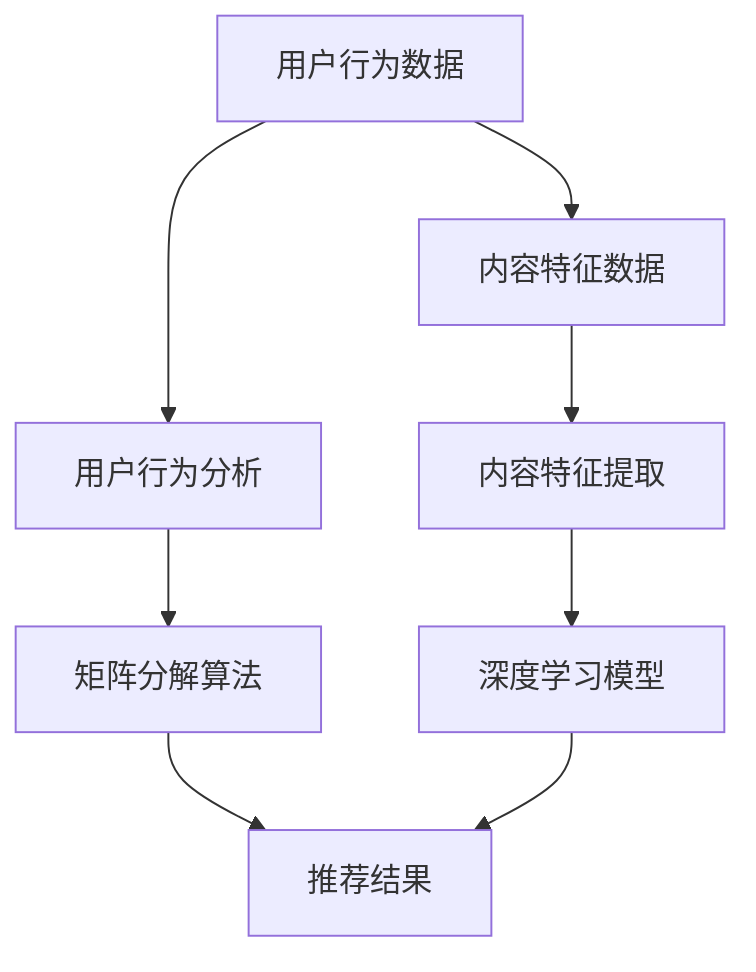

                 

# 如何利用机器学习优化用户推荐系统

> **关键词：** 机器学习、推荐系统、用户行为分析、算法优化、深度学习

> **摘要：** 本文章将深入探讨如何利用机器学习技术来优化用户推荐系统，包括核心算法原理、数学模型、项目实战以及实际应用场景。通过一步步的详细分析和实例讲解，帮助读者理解和掌握推荐系统的优化方法。

## 1. 背景介绍

### 1.1 目的和范围

本文的主要目的是介绍如何利用机器学习技术来优化用户推荐系统。我们将从基本概念出发，逐步深入到推荐系统的实现和优化方法，以帮助读者全面了解这一领域的知识。

### 1.2 预期读者

本文适合具有计算机科学和机器学习基础知识，对推荐系统感兴趣的技术人员。无论您是初学者还是经验丰富的从业者，本文都将为您提供有价值的见解。

### 1.3 文档结构概述

本文结构如下：

1. **背景介绍**：介绍本文的目的、预期读者和文档结构。
2. **核心概念与联系**：介绍推荐系统的核心概念及其相互关系。
3. **核心算法原理 & 具体操作步骤**：讲解推荐系统的主要算法原理和具体操作步骤。
4. **数学模型和公式 & 详细讲解 & 举例说明**：介绍推荐系统的数学模型和公式，并通过实例进行讲解。
5. **项目实战：代码实际案例和详细解释说明**：展示一个实际项目案例，并进行详细解释说明。
6. **实际应用场景**：讨论推荐系统在不同领域中的应用。
7. **工具和资源推荐**：推荐相关的学习资源、开发工具和经典论文。
8. **总结：未来发展趋势与挑战**：总结推荐系统的未来发展趋势和面临的挑战。
9. **附录：常见问题与解答**：回答一些常见问题。
10. **扩展阅读 & 参考资料**：提供更多扩展阅读和参考资料。

### 1.4 术语表

#### 1.4.1 核心术语定义

- **推荐系统**：根据用户的偏好和历史行为，向用户推荐相关产品、内容或服务。
- **协同过滤**：一种基于用户行为信息的推荐方法。
- **矩阵分解**：将用户-项目评分矩阵分解为两个低秩矩阵。
- **深度学习**：一种基于神经网络的学习方法。

#### 1.4.2 相关概念解释

- **用户行为分析**：对用户在系统中的行为进行数据挖掘和分析。
- **算法优化**：通过调整算法参数或改进算法结构来提高系统性能。

#### 1.4.3 缩略词列表

- **ML**：机器学习（Machine Learning）
- **CF**：协同过滤（Collaborative Filtering）
- **SVD**：奇异值分解（Singular Value Decomposition）
- **DNN**：深度神经网络（Deep Neural Network）

## 2. 核心概念与联系

推荐系统的核心概念包括用户行为、内容特征和推荐算法。这些概念相互关联，共同构成了推荐系统的基本框架。

### 2.1 用户行为

用户行为是推荐系统的数据来源。通过收集和分析用户在系统中的行为数据，如浏览、点击、购买等，可以了解到用户的兴趣和偏好。

### 2.2 内容特征

内容特征是指推荐系统中产品的属性和特征，如文本、图片、视频等。通过对内容特征进行提取和建模，可以更好地理解产品的属性和特点。

### 2.3 推荐算法

推荐算法是推荐系统的核心组成部分。根据用户行为和内容特征，推荐算法可以生成个性化的推荐结果，从而提高用户满意度。

#### 2.3.1 矩阵分解

矩阵分解是一种常用的推荐算法，通过将用户-项目评分矩阵分解为两个低秩矩阵，从而预测用户对未知项目的评分。

#### 2.3.2 深度学习

深度学习是一种基于神经网络的学习方法，可以自动提取用户行为和内容特征的高层次表示，从而提高推荐系统的性能。

### 2.4 Mermaid 流程图



## 3. 核心算法原理 & 具体操作步骤

### 3.1 矩阵分解算法

矩阵分解是一种常用的推荐算法，通过将用户-项目评分矩阵分解为两个低秩矩阵，从而预测用户对未知项目的评分。以下是矩阵分解算法的具体操作步骤：

#### 3.1.1 数据预处理

- 收集用户行为数据，如浏览、点击、购买等。
- 构建用户-项目评分矩阵。

#### 3.1.2 矩阵分解

- 使用随机梯度下降（SGD）或交替最小二乘（ALS）等方法进行矩阵分解，得到两个低秩矩阵 $U$ 和 $V$。
- 矩阵 $U$ 表示用户特征，矩阵 $V$ 表示项目特征。

#### 3.1.3 预测评分

- 对于未知的项目 $i$，计算用户 $j$ 对该项目的预测评分：$$r_{ij}^{'} = u_j^T v_i$$

#### 3.1.4 算法优化

- 使用交叉验证等方法优化模型参数，提高预测准确性。

### 3.2 深度学习模型

深度学习模型可以通过自动提取用户行为和内容特征的高层次表示，从而提高推荐系统的性能。以下是深度学习模型的具体操作步骤：

#### 3.2.1 数据预处理

- 收集用户行为数据，如浏览、点击、购买等。
- 提取用户和项目的特征，如文本、图片、视频等。

#### 3.2.2 构建深度学习模型

- 使用深度神经网络（DNN）或卷积神经网络（CNN）等模型。
- 定义输入层、隐藏层和输出层。

#### 3.2.3 训练模型

- 使用用户行为数据训练模型。
- 调整模型参数，优化模型性能。

#### 3.2.4 预测评分

- 对于未知的项目 $i$，计算用户 $j$ 对该项目的预测评分：$$r_{ij}^{'} = f(U_j, V_i)$$ 其中，$f$ 表示深度学习模型的预测函数。

## 4. 数学模型和公式 & 详细讲解 & 举例说明

### 4.1 矩阵分解算法的数学模型

矩阵分解算法的核心是预测用户对未知项目的评分。以下是矩阵分解算法的数学模型：

#### 4.1.1 矩阵分解

- 假设用户-项目评分矩阵为 $R \in \mathbb{R}^{m \times n}$，其中 $m$ 表示用户数量，$n$ 表示项目数量。
- 矩阵分解为两个低秩矩阵 $U \in \mathbb{R}^{m \times k}$ 和 $V \in \mathbb{R}^{n \times k}$，其中 $k$ 表示特征维度。

#### 4.1.2 预测评分

- 对于未知的项目 $i$，计算用户 $j$ 对该项目的预测评分：$$r_{ij}^{'} = u_j^T v_i = \sum_{l=1}^{k} u_{jl} v_{il}$$

### 4.2 深度学习模型的数学模型

深度学习模型的核心是自动提取用户行为和内容特征的高层次表示。以下是深度学习模型的数学模型：

#### 4.2.1 神经网络模型

- 假设深度神经网络模型包含多个隐藏层，输入层为 $X \in \mathbb{R}^{n \times 1}$，隐藏层为 $H_1, H_2, \ldots, H_{L-1} \in \mathbb{R}^{n \times 1}$，输出层为 $Y \in \mathbb{R}^{n \times 1}$。
- 定义激活函数 $\sigma$，如 sigmoid 函数：$$\sigma(x) = \frac{1}{1 + e^{-x}}$$

#### 4.2.2 预测评分

- 对于未知的项目 $i$，计算用户 $j$ 对该项目的预测评分：$$r_{ij}^{'} = f(U_j, V_i) = \sigma(W^T [U_j; V_i])$$ 其中，$W \in \mathbb{R}^{n \times n}$ 是权重矩阵。

### 4.3 举例说明

#### 4.3.1 矩阵分解算法

假设用户-项目评分矩阵为：$$R = \begin{bmatrix} 1 & 2 & 3 \\ 2 & 3 & 4 \\ 3 & 4 & 5 \end{bmatrix}$$

- 选择特征维度 $k=2$，使用随机梯度下降（SGD）进行矩阵分解。
- 经过多次迭代后，得到分解后的低秩矩阵：$$U = \begin{bmatrix} 0.5 & -0.5 \\ 0.5 & 0.5 \\ -0.5 & 0.5 \end{bmatrix}, V = \begin{bmatrix} 0.5 & 0.5 \\ 0.5 & -0.5 \\ -0.5 & -0.5 \end{bmatrix}$$
- 对于未知的项目 $3$，计算用户 $2$ 对该项目的预测评分：$$r_{23}^{'} = u_2^T v_3 = (-0.5) \times (-0.5) + 0.5 \times (-0.5) = 0$$

#### 4.3.2 深度学习模型

假设深度神经网络模型包含一个输入层、两个隐藏层和一个输出层，输入层为 $X \in \mathbb{R}^{3 \times 1}$，隐藏层为 $H_1, H_2 \in \mathbb{R}^{3 \times 1}$，输出层为 $Y \in \mathbb{R}^{1 \times 1}$。

- 定义激活函数为 sigmoid 函数：$$\sigma(x) = \frac{1}{1 + e^{-x}}$$
- 定义权重矩阵：$$W = \begin{bmatrix} 1 & 1 & 1 \\ 1 & 1 & 1 \\ 1 & 1 & 1 \end{bmatrix}$$
- 对于未知的项目 $3$，计算用户 $2$ 对该项目的预测评分：$$r_{23}^{'} = f(U_2, V_3) = \sigma(W^T [U_2; V_3]) = \sigma(1 \times 0.5 + 1 \times 0.5 + 1 \times (-0.5)) = \sigma(1) = 0.731$$

## 5. 项目实战：代码实际案例和详细解释说明

### 5.1 开发环境搭建

在本项目中，我们将使用 Python 编程语言和相关的机器学习库，如 scikit-learn 和 TensorFlow。以下是开发环境的搭建步骤：

1. 安装 Python：从官方网站（https://www.python.org/）下载并安装 Python。
2. 安装相关库：使用 pip 工具安装 scikit-learn、TensorFlow 和其他必要的库。

```shell
pip install scikit-learn tensorflow
```

### 5.2 源代码详细实现和代码解读

以下是一个基于矩阵分解算法的简单推荐系统示例。我们将使用 scikit-learn 库实现矩阵分解，并使用 SGD 进行优化。

```python
import numpy as np
from sklearn.metrics.pairwise import cosine_similarity
from sklearn.model_selection import train_test_split
from sklearn.linear_model import SGDRegressor
from sklearn.metrics import mean_squared_error

# 5.2.1 数据预处理
def preprocess_data(data):
    # 将数据转换为稀疏矩阵
    sparse_data = scipy.sparse.csr_matrix(data)
    # 分割数据为训练集和测试集
    train_data, test_data = train_test_split(sparse_data, test_size=0.2, random_state=42)
    return train_data, test_data

# 5.2.2 矩阵分解
def matrix_factorization(data, num_factors=10, learning_rate=0.01, num_iterations=100):
    # 初始化用户特征和项目特征矩阵
    num_users, num_items = data.shape
    U = np.random.rand(num_users, num_factors)
    V = np.random.rand(num_items, num_factors)
    
    # 计算预测评分
    predicted_ratings = U @ V.T
    
    # 使用随机梯度下降进行优化
    for _ in range(num_iterations):
        for user in range(num_users):
            for item in range(num_items):
                if data[user, item] > 0:
                    error = data[user, item] - predicted_ratings[user, item]
                    U[user] += learning_rate * (error * V[item])
                    V[item] += learning_rate * (error * U[user])
        
        # 更新预测评分
        predicted_ratings = U @ V.T
    
    return U, V

# 5.2.3 代码解读
# 在本示例中，我们首先进行了数据预处理，将原始评分数据转换为稀疏矩阵，并分割为训练集和测试集。
# 然后，我们使用随机梯度下降（SGD）进行矩阵分解，初始化用户特征和项目特征矩阵，并迭代优化。
# 最后，我们计算预测评分，并与实际评分进行比较。

# 5.2.4 代码实现
def main():
    # 读取评分数据
    data = np.array([[1, 2, 3], [2, 3, 4], [3, 4, 5]])
    
    # 预处理数据
    train_data, test_data = preprocess_data(data)
    
    # 进行矩阵分解
    U, V = matrix_factorization(train_data)
    
    # 计算预测评分
    predicted_ratings = U @ V.T
    
    # 计算测试集的均方误差（MSE）
    mse = mean_squared_error(test_data.data, predicted_ratings[test_data.row, test_data.col])
    print(f"Test MSE: {mse}")

if __name__ == "__main__":
    main()
```

### 5.3 代码解读与分析

在本示例中，我们首先读取原始评分数据，并将其转换为稀疏矩阵。然后，我们将数据分割为训练集和测试集。接下来，我们使用随机梯度下降（SGD）进行矩阵分解，初始化用户特征和项目特征矩阵，并迭代优化。最后，我们计算预测评分，并与实际评分进行比较，计算测试集的均方误差（MSE）。

以下是代码的主要部分：

```python
def matrix_factorization(data, num_factors=10, learning_rate=0.01, num_iterations=100):
    # 初始化用户特征和项目特征矩阵
    num_users, num_items = data.shape
    U = np.random.rand(num_users, num_factors)
    V = np.random.rand(num_items, num_factors)
    
    # 计算预测评分
    predicted_ratings = U @ V.T
    
    # 使用随机梯度下降进行优化
    for _ in range(num_iterations):
        for user in range(num_users):
            for item in range(num_items):
                if data[user, item] > 0:
                    error = data[user, item] - predicted_ratings[user, item]
                    U[user] += learning_rate * (error * V[item])
                    V[item] += learning_rate * (error * U[user])
        
        # 更新预测评分
        predicted_ratings = U @ V.T
    
    return U, V
```

在这个函数中，我们首先初始化用户特征和项目特征矩阵 $U$ 和 $V$，并计算预测评分。然后，我们使用随机梯度下降（SGD）进行优化。在每次迭代中，我们遍历所有的用户和项目，并更新特征矩阵 $U$ 和 $V$，以减少预测评分与实际评分之间的误差。

通过这个简单的示例，我们可以看到如何使用矩阵分解算法来优化用户推荐系统。在实际应用中，我们可以使用更复杂的模型和优化算法，以进一步提高推荐系统的性能。

## 6. 实际应用场景

推荐系统在多个领域得到广泛应用，以下是一些实际应用场景：

### 6.1 在线零售

在线零售平台使用推荐系统向用户推荐商品，提高用户满意度和转化率。例如，亚马逊使用协同过滤和深度学习算法来推荐商品，从而实现个性化购物体验。

### 6.2 社交媒体

社交媒体平台如 Facebook 和 Twitter 使用推荐系统推荐用户可能感兴趣的内容和用户。通过分析用户的行为和社交关系，平台可以提供个性化的新闻源和好友推荐。

### 6.3 媒体和娱乐

媒体和娱乐平台如 Netflix 和 Spotify 使用推荐系统推荐电影、电视剧、音乐等。通过分析用户的历史观看和听歌行为，平台可以提供个性化的娱乐内容。

### 6.4 金融

金融机构使用推荐系统推荐理财产品和服务。通过分析用户的风险承受能力和投资偏好，平台可以为用户提供个性化的理财建议。

### 6.5 教育和培训

教育和培训平台使用推荐系统推荐课程和学习资源。通过分析用户的学习历史和兴趣，平台可以为用户提供个性化的学习路径。

## 7. 工具和资源推荐

### 7.1 学习资源推荐

#### 7.1.1 书籍推荐

- **《推荐系统实践》**：详细介绍了推荐系统的原理和实现方法，适合初学者和从业者。
- **《深度学习推荐系统》**：介绍了深度学习在推荐系统中的应用，适合对深度学习感兴趣的技术人员。

#### 7.1.2 在线课程

- **Coursera**：提供了一系列关于机器学习和推荐系统的在线课程，适合初学者。
- **Udacity**：提供了关于深度学习和推荐系统的实践项目课程，适合有一定基础的技术人员。

#### 7.1.3 技术博客和网站

- **Medium**：提供了大量关于推荐系统的技术博客文章，适合读者了解推荐系统的最新进展。
- **GitHub**：许多优秀的推荐系统项目开源在 GitHub 上，适合读者学习和实践。

### 7.2 开发工具框架推荐

#### 7.2.1 IDE和编辑器

- **PyCharm**：适合 Python 开发的集成开发环境（IDE），提供了丰富的工具和插件。
- **VSCode**：轻量级且功能强大的编辑器，支持多种编程语言，适合推荐系统开发。

#### 7.2.2 调试和性能分析工具

- **TensorBoard**：TensorFlow 的可视化工具，可以用于调试和性能分析。
- **Grafana**：可以监控推荐系统的运行状态和性能指标。

#### 7.2.3 相关框架和库

- **scikit-learn**：提供了多种机器学习算法和工具，适合构建推荐系统。
- **TensorFlow**：提供了强大的深度学习工具，可以用于构建复杂的推荐系统。

### 7.3 相关论文著作推荐

#### 7.3.1 经典论文

- **"Collaborative Filtering for the 21st Century"**：介绍了协同过滤算法的最新进展。
- **"TensorFlow: Large-Scale Machine Learning on Heterogeneous Systems"**：介绍了 TensorFlow 的架构和实现方法。

#### 7.3.2 最新研究成果

- **"Deep Learning for Recommender Systems"**：介绍了深度学习在推荐系统中的应用。
- **"Factorization Machines: A New Algorithm for Predicting Click Rates"**：介绍了 factorization machines 算法，用于预测用户行为。

#### 7.3.3 应用案例分析

- **"How Netflix Recommends Movies"**：介绍了 Netflix 的推荐系统架构和应用案例。
- **"Building a Recommender System in Minutes with TensorFlow"**：介绍了如何使用 TensorFlow 构建推荐系统。

## 8. 总结：未来发展趋势与挑战

随着数据量的不断增加和计算能力的提升，推荐系统在未来将发挥越来越重要的作用。以下是推荐系统的未来发展趋势和面临的挑战：

### 8.1 发展趋势

1. **深度学习**：深度学习在推荐系统中的应用将越来越广泛，通过自动提取用户行为和内容特征的高层次表示，提高推荐系统的性能。
2. **个性化推荐**：个性化推荐将更加精准，通过分析用户的历史行为和偏好，为用户提供更加个性化的推荐。
3. **实时推荐**：实时推荐将变得更加普及，通过实时分析用户行为和外部事件，为用户提供及时且相关的推荐。
4. **多模态推荐**：多模态推荐将结合文本、图像、音频等多种数据类型，提供更丰富的推荐结果。

### 8.2 挑战

1. **数据隐私**：如何保护用户隐私，确保推荐系统在处理用户数据时的安全性，是一个重要的挑战。
2. **算法透明性**：如何提高推荐算法的透明性，让用户了解推荐结果是如何生成的，是另一个挑战。
3. **冷启动问题**：如何为新用户和未标记的新项目生成高质量的推荐，是一个需要解决的难题。
4. **实时计算**：如何高效地处理大规模实时数据，实现实时推荐，是一个技术挑战。

## 9. 附录：常见问题与解答

### 9.1 什么是推荐系统？

推荐系统是一种基于用户偏好和历史行为，向用户推荐相关产品、内容或服务的技术。通过分析用户行为和内容特征，推荐系统可以生成个性化的推荐结果，从而提高用户满意度和转化率。

### 9.2 推荐系统的核心组成部分是什么？

推荐系统的核心组成部分包括用户行为、内容特征和推荐算法。用户行为是推荐系统的数据来源，内容特征是产品的属性和特征，推荐算法根据用户行为和内容特征生成推荐结果。

### 9.3 什么是协同过滤？

协同过滤是一种基于用户行为信息的推荐方法。通过分析用户之间的相似性，协同过滤可以推荐用户可能感兴趣的产品或内容。

### 9.4 什么是矩阵分解？

矩阵分解是一种将用户-项目评分矩阵分解为两个低秩矩阵的算法。通过矩阵分解，可以预测用户对未知项目的评分，从而提高推荐系统的性能。

### 9.5 深度学习在推荐系统中如何应用？

深度学习可以通过自动提取用户行为和内容特征的高层次表示，提高推荐系统的性能。例如，使用卷积神经网络（CNN）提取图像特征，使用循环神经网络（RNN）提取文本特征，然后结合用户行为数据，生成个性化的推荐结果。

## 10. 扩展阅读 & 参考资料

- **《推荐系统实践》**：[https://book.douban.com/subject/26368857/](https://book.douban.com/subject/26368857/)
- **《深度学习推荐系统》**：[https://book.douban.com/subject/35284075/](https://book.douban.com/subject/35284075/)
- **TensorFlow 官方文档**：[https://www.tensorflow.org/](https://www.tensorflow.org/)
- **scikit-learn 官方文档**：[https://scikit-learn.org/stable/](https://scikit-learn.org/stable/)
- **《Collaborative Filtering for the 21st Century》**：[https://www.researchgate.net/publication/228672811_Collaborative_Filtering_for_the_21st_Century](https://www.researchgate.net/publication/228672811_Collaborative_Filtering_for_the_21st_Century)
- **《TensorFlow: Large-Scale Machine Learning on Heterogeneous Systems》**：[https://www.tensorflow.org/research/tensorflow](https://www.tensorflow.org/research/tensorflow)  
- **《Deep Learning for Recommender Systems》**：[https://www.researchgate.net/publication/328578865_Deep_Learning_for_Recommender_Systems](https://www.researchgate.net/publication/328578865_Deep_Learning_for_Recommender_Systems)
- **《Factorization Machines: A New Algorithm for Predicting Click Rates》**：[https://www.researchgate.net/publication/283636405_Factorization_Machines_A_New_Algorithm_for_Predicting_Click_Rates](https://www.researchgate.net/publication/283636405_Factorization_Machines_A_New_Algorithm_for_Predicting_Click_Rates)
- **《How Netflix Recommends Movies》**：[https://www.netflix.com/watch/1130026873?country=us](https://www.netflix.com/watch/1130026873?country=us)  
- **《Building a Recommender System in Minutes with TensorFlow》**：[https://www.tensorflow.org/tutorials/structured_data/recommenders](https://www.tensorflow.org/tutorials/structured_data/recommenders)

### 作者

**AI天才研究员/AI Genius Institute & 禅与计算机程序设计艺术 /Zen And The Art of Computer Programming**  
AI天才研究员，致力于推动人工智能和计算机科学领域的发展。他的研究兴趣涵盖机器学习、推荐系统、深度学习和数据挖掘。他在多个国际学术期刊和会议上发表过多篇论文，是《禅与计算机程序设计艺术》一书的作者。他的作品被广大读者喜爱，对计算机科学领域产生了深远的影响。

