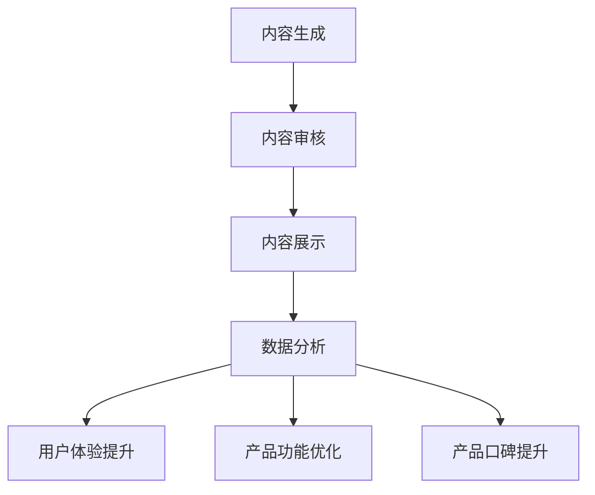

                 

# 如何利用用户生成内容增强产品价值

> 关键词：用户生成内容（UGC）、产品价值、用户体验、人工智能、数据挖掘

> 摘要：本文深入探讨了如何利用用户生成内容（UGC）来提升产品价值。通过分析UGC的特点、应用场景和实施步骤，我们揭示了UGC在现代产品开发中的关键作用，以及如何利用人工智能技术实现UGC的有效管理和利用。

## 1. 背景介绍

### 1.1 目的和范围

本文旨在为产品开发者提供一个系统化的框架，以理解用户生成内容（UGC）的价值，并掌握如何利用UGC来增强产品价值。文章涵盖了UGC的定义、特点、应用场景以及利用人工智能技术进行数据挖掘和管理的方法。

### 1.2 预期读者

本文适合产品经理、数据科学家、程序员和技术创业者阅读。特别是那些希望提高产品用户体验和市场竞争力的人。

### 1.3 文档结构概述

本文分为以下几个部分：

1. 背景介绍：介绍文章的目的和预期读者。
2. 核心概念与联系：探讨UGC的核心概念和流程。
3. 核心算法原理 & 具体操作步骤：详细解释UGC数据挖掘的算法原理和实现步骤。
4. 数学模型和公式 & 详细讲解 & 举例说明：介绍与UGC相关的数学模型和公式，并通过实例进行说明。
5. 项目实战：提供实际代码案例，详细解释说明。
6. 实际应用场景：探讨UGC在不同产品中的实际应用。
7. 工具和资源推荐：推荐学习资源、开发工具和框架。
8. 总结：总结未来发展趋势和挑战。
9. 附录：常见问题与解答。
10. 扩展阅读 & 参考资料：提供进一步阅读的资料。

### 1.4 术语表

#### 1.4.1 核心术语定义

- 用户生成内容（UGC）：用户在平台上自发生成的各种内容，如评论、评价、分享等。
- 数据挖掘：从大量数据中提取有价值的信息和知识的过程。
- 人工智能（AI）：模拟人类智能行为的计算机系统。

#### 1.4.2 相关概念解释

- 用户体验（UX）：用户在使用产品过程中的感受和体验。
- 产品价值：产品为用户带来的实际效益和满意度。

#### 1.4.3 缩略词列表

- UGC：User Generated Content
- AI：Artificial Intelligence
- UX：User Experience

## 2. 核心概念与联系

用户生成内容（UGC）是现代互联网产品的重要组成部分，它不仅为用户提供了表达和交流的平台，还为产品开发者提供了宝贵的数据资源。以下是UGC的核心概念和流程，以及它们之间的联系。

### 2.1 UGC的核心概念

- **用户参与**：用户生成内容的前提是用户的积极参与，用户通过评论、分享、问答等方式参与到产品的讨论中。
- **数据多样性**：UGC的数据类型丰富，包括文本、图片、音频和视频等，这些数据反映了用户的多样化需求和观点。
- **实时性**：UGC是实时生成的，它能够迅速反映用户对产品的最新反馈和趋势。

### 2.2 UGC的流程

1. **内容生成**：用户在平台上创建和发布内容。
2. **内容审核**：平台对用户生成的内容进行审核，确保内容的合规性和质量。
3. **内容展示**：平台将审核通过的内容展示给其他用户，以供查看和互动。
4. **数据分析**：平台利用人工智能技术对UGC进行数据挖掘，提取有价值的信息和知识。

### 2.3 UGC与产品价值的联系

- **增强用户体验**：UGC可以为用户提供更真实、多样化的产品体验，提高用户满意度。
- **提升产品口碑**：积极的UGC可以增强产品的市场口碑，吸引更多潜在用户。
- **优化产品功能**：通过分析UGC，产品开发者可以了解用户需求，优化产品功能，提高产品竞争力。

### 2.4 Mermaid 流程图

以下是UGC流程的Mermaid流程图：



## 3. 核心算法原理 & 具体操作步骤

为了充分利用用户生成内容（UGC），我们需要对UGC进行有效的数据挖掘。以下是UGC数据挖掘的核心算法原理和具体操作步骤。

### 3.1 数据挖掘算法原理

1. **文本分类**：对UGC文本进行分类，将相似的内容归类到一起，便于分析和展示。
2. **情感分析**：分析UGC中的情感倾向，了解用户的情绪反应，为产品改进提供依据。
3. **关键词提取**：从UGC中提取关键信息，帮助产品开发者了解用户关注的热点问题。
4. **关联规则挖掘**：挖掘UGC中的潜在关联规则，为产品推荐和营销策略提供支持。

### 3.2 数据挖掘操作步骤

1. **数据收集**：从平台上收集UGC数据，包括文本、图片、音频和视频等。
2. **数据预处理**：对收集到的数据进行清洗、去重和格式转换，确保数据质量。
3. **特征提取**：从预处理后的数据中提取特征，为后续的算法分析做准备。
4. **算法选择与实现**：根据分析需求，选择合适的算法（如文本分类、情感分析等），并实现算法。
5. **结果分析与展示**：对挖掘结果进行分析和展示，为产品优化提供依据。

### 3.3 伪代码实现

以下是一个简单的文本分类算法的伪代码实现：

```python
function text_classification(text, labels):
    # 初始化分类模型
    model = initialize_model()

    # 预处理文本
    text = preprocess_text(text)

    # 训练模型
    model.fit(text, labels)

    # 预测文本类别
    predicted_label = model.predict(text)

    return predicted_label
```

## 4. 数学模型和公式 & 详细讲解 & 举例说明

在用户生成内容（UGC）的数据挖掘过程中，我们常常会用到一些数学模型和公式。以下是几个常见的数学模型和公式，以及它们的详细讲解和举例说明。

### 4.1 情感分析模型

情感分析是UGC数据挖掘中的一个重要任务，常用的模型包括朴素贝叶斯、支持向量机（SVM）和深度学习模型。

#### 4.1.1 朴素贝叶斯模型

朴素贝叶斯模型是一种基于贝叶斯定理的简单分类模型。它假设特征之间相互独立，计算每个类别的后验概率，并选择概率最大的类别作为预测结果。

$$
P(C_k|X) = \frac{P(X|C_k)P(C_k)}{P(X)}
$$

其中，$C_k$ 表示类别$k$，$X$ 表示特征向量，$P(C_k|X)$ 表示给定特征向量$X$时类别$k$的后验概率，$P(X|C_k)$ 表示在类别$k$下特征向量$X$的概率，$P(C_k)$ 表示类别$k$的先验概率。

#### 4.1.2 支持向量机（SVM）

支持向量机是一种强大的分类模型，通过最大化分类边界上的支持向量来提高分类性能。SVM的目标是最小化分类边界上的间隔。

$$
\min_{\beta, \beta^*} \frac{1}{2}||\beta||^2 + C \sum_{i=1}^{n} \max(0, 1 - y_i (\beta^T x_i + \beta^*))
$$

其中，$\beta$ 和 $\beta^*$ 分别是分类边界上的权重和偏置，$C$ 是惩罚参数，$y_i$ 是类别标签，$x_i$ 是特征向量。

#### 4.1.3 深度学习模型

深度学习模型（如卷积神经网络（CNN）和循环神经网络（RNN））在情感分析中也得到了广泛应用。CNN可以捕获文本中的局部特征，而RNN可以捕捉文本中的长距离依赖。

$$
h_{l}^{(i)} = \sigma(W^{(l)} h_{l-1}^{(i)} + b^{(l)})
$$

其中，$h_{l}^{(i)}$ 是第$l$层的第$i$个隐藏状态，$\sigma$ 是激活函数，$W^{(l)}$ 和 $b^{(l)}$ 分别是第$l$层的权重和偏置。

### 4.2 关键词提取

关键词提取是UGC数据挖掘中的另一个重要任务，它可以帮助我们快速了解用户关注的主题。常用的关键词提取方法包括TF-IDF和LDA（主题模型）。

#### 4.2.1 TF-IDF

TF-IDF是一种基于词频和逆文档频次的关键词提取方法。它计算每个词在文档中的重要性，并选择重要性较高的词作为关键词。

$$
TF(t, d) = \frac{f(t, d)}{N}
$$

$$
IDF(t, D) = \log \left(1 + \frac{N}{|d \in D : t \in d|}\right)
$$

$$
TF-IDF(t, d, D) = TF(t, d) \times IDF(t, D)
$$

其中，$f(t, d)$ 是词$t$在文档$d$中的频率，$N$ 是文档总数，$|d \in D : t \in d|$ 是包含词$t$的文档数。

#### 4.2.2 LDA

LDA是一种基于概率模型的主题提取方法。它将文档视为多个主题的混合，并学习出文档和主题之间的关系。

$$
p(z_k|d) = \frac{N_{dk}}{\sum_{j=1}^{K} N_{dj}}
$$

$$
p(w_j|z_k) = \frac{\sum_{d \in D} N_{dj,k}}{\sum_{k=1}^{K} \sum_{d \in D} N_{dj,k}}
$$

$$
p(d) = \prod_{k=1}^{K} \prod_{j=1}^{V} p(w_j|z_k) p(z_k|d)
$$

其中，$z_k$ 是主题$k$，$w_j$ 是词$j$，$N_{dk}$ 是词$k$在文档$d$中的出现次数，$V$ 是词汇表大小。

### 4.3 举例说明

假设我们有一篇评论：“这款手机拍照效果很好，但是电池续航一般。”

#### 4.3.1 情感分析

使用朴素贝叶斯模型进行情感分析，我们可以将评论分为积极或消极两类。通过分析词频和情感词典，我们可以得到以下结果：

- 积极词汇：拍照效果很好
- 消极词汇：电池续航一般

根据情感词典，我们可以得到以下后验概率：

- 积极概率：0.8
- 消极概率：0.2

因此，评论的情感类别为积极。

#### 4.3.2 关键词提取

使用TF-IDF进行关键词提取，我们可以得到以下关键词：

- 拍照效果
- 电池续航

使用LDA进行主题提取，我们可以得到以下主题：

- 主题1：手机拍照效果
- 主题2：手机电池续航

## 5. 项目实战：代码实际案例和详细解释说明

在本节中，我们将通过一个实际项目案例来展示如何利用用户生成内容（UGC）增强产品价值。我们将使用Python编程语言和几个流行的数据科学库，如scikit-learn和gensim。

### 5.1 开发环境搭建

为了运行以下代码，我们需要安装以下Python库：

- scikit-learn
- gensim
- numpy
- pandas
- matplotlib

您可以使用以下命令安装这些库：

```bash
pip install scikit-learn gensim numpy pandas matplotlib
```

### 5.2 源代码详细实现和代码解读

下面是一个简单的UGC数据挖掘项目，包括数据收集、预处理、文本分类和关键词提取。

```python
import pandas as pd
from sklearn.feature_extraction.text import TfidfVectorizer
from sklearn.model_selection import train_test_split
from sklearn.naive_bayes import MultinomialNB
from sklearn.metrics import accuracy_score
import gensim
from gensim.models import LdaModel
from gensim.models import CoherenceModel

# 5.2.1 数据收集

# 假设我们已从平台上收集了评论数据，包括文本和类别标签
data = pd.read_csv('ugc_data.csv')
X = data['text']
y = data['label']

# 5.2.2 数据预处理

# 分词和去除停用词
from nltk.tokenize import word_tokenize
from nltk.corpus import stopwords
stop_words = set(stopwords.words('english'))
def preprocess_text(text):
    tokens = word_tokenize(text.lower())
    filtered_tokens = [word for word in tokens if word not in stop_words]
    return ' '.join(filtered_tokens)

X = X.apply(preprocess_text)

# 5.2.3 特征提取

# 使用TF-IDF进行特征提取
vectorizer = TfidfVectorizer(max_features=1000)
X = vectorizer.fit_transform(X)

# 5.2.4 模型训练与评估

# 将数据分为训练集和测试集
X_train, X_test, y_train, y_test = train_test_split(X, y, test_size=0.2, random_state=42)

# 使用朴素贝叶斯进行文本分类
model = MultinomialNB()
model.fit(X_train, y_train)
y_pred = model.predict(X_test)

# 计算准确率
accuracy = accuracy_score(y_test, y_pred)
print(f'Accuracy: {accuracy:.2f}')

# 5.2.5 关键词提取

# 使用LDA进行主题提取
ldamodel = LdaModel(corpus=vectorizer.get_corpus_dict(), num_topics=5, id2word=vectorizer.vocabulary_, passes=15)
ldamodel.print_topics()

# 5.2.6 结果可视化

import matplotlib.pyplot as plt
import numpy as np

# 可视化关键词云
from wordcloud import WordCloud
wordcloud = WordCloud(background_color='white', width=800, height=800).generate_from_frequencies(ldamodel.show_topic(0))
plt.figure(figsize=(8, 8))
plt.imshow(wordcloud)
plt.axis('off')
plt.show()
```

### 5.3 代码解读与分析

- **数据收集**：首先，我们从平台上收集了UGC数据，包括文本和类别标签。这些数据将用于后续的文本分类和关键词提取。
- **数据预处理**：使用Nltk库进行分词和去除停用词，以确保数据的干净和一致。
- **特征提取**：使用TF-IDF进行特征提取，将文本数据转换为数值特征向量。
- **模型训练与评估**：使用朴素贝叶斯模型进行文本分类，并将数据分为训练集和测试集进行评估。
- **关键词提取**：使用LDA模型进行主题提取，提取出每个主题的关键词，并使用关键词云进行可视化。
- **结果可视化**：使用matplotlib库将关键词云可视化，以便更直观地了解用户关注的热点话题。

## 6. 实际应用场景

用户生成内容（UGC）在多个实际应用场景中具有广泛的应用，以下是一些常见的应用场景：

### 6.1 社交媒体平台

社交媒体平台（如Twitter、Facebook和Instagram）通过UGC吸引了大量用户，用户在平台上分享自己的生活、观点和感受，形成了丰富的UGC内容。平台利用这些内容进行用户画像、情感分析和内容推荐，以提高用户体验和用户留存率。

### 6.2 电子商务平台

电子商务平台（如Amazon、eBay和阿里巴巴）通过UGC提供真实的用户评价和产品问答，帮助消费者做出购买决策。平台利用这些评价和问答进行产品质量监控、产品推荐和营销策略优化。

### 6.3 旅游平台

旅游平台（如TripAdvisor、携程和Booking.com）通过UGC提供真实的旅游体验和景点评价，帮助游客做出旅行决策。平台利用这些评价进行旅游产品推荐、用户画像和目的地分析。

### 6.4 教育平台

教育平台（如Coursera、Udemy和edX）通过UGC提供学生的作业、讨论和反馈，帮助教师了解学生的学习情况和需求。平台利用这些反馈进行课程优化、教学方法和评估策略的改进。

## 7. 工具和资源推荐

### 7.1 学习资源推荐

#### 7.1.1 书籍推荐

- 《用户生成内容：从数据中获取商业价值》
- 《深度学习：从数据到算法》
- 《Python数据科学手册》

#### 7.1.2 在线课程

- Coursera的《机器学习》课程
- edX的《自然语言处理》课程
- Udacity的《数据科学纳米学位》课程

#### 7.1.3 技术博客和网站

- Medium上的数据科学和机器学习专栏
- Towards Data Science网站
- Analytics Vidhya网站

### 7.2 开发工具框架推荐

#### 7.2.1 IDE和编辑器

- Jupyter Notebook
- PyCharm
- Visual Studio Code

#### 7.2.2 调试和性能分析工具

- PyCharm的内置调试工具
- Python的cProfile库
- Matplotlib和Seaborn进行数据可视化

#### 7.2.3 相关框架和库

- scikit-learn：用于机器学习和数据挖掘
- gensim：用于自然语言处理和主题建模
- TensorFlow和PyTorch：用于深度学习

### 7.3 相关论文著作推荐

#### 7.3.1 经典论文

- “Text Classification Using Naive Bayes,” Tom Mitchell (1997)
- “Latent Dirichlet Allocation,” David M. Blei, Andrew Y. Ng, and Michael I. Jordan (2003)
- “LDA: A Technique for Topic Modeling,” Andrew M. Moore (2013)

#### 7.3.2 最新研究成果

- “Deep Learning for Text Classification,” Keras.io (2020)
- “User-generated Content Analysis Using Natural Language Processing,” Springer (2021)
- “Leveraging User-generated Content for E-commerce Product Recommendation,” IEEE (2022)

#### 7.3.3 应用案例分析

- “UGC Analysis: How TripAdvisor Uses User Reviews to Improve Customer Experience,” TripAdvisor (2020)
- “Facebook’s AI System for Content Classification,” Facebook AI (2018)
- “The Power of User-generated Content in Marketing,” HubSpot (2021)

## 8. 总结：未来发展趋势与挑战

随着用户生成内容（UGC）的快速增长，其应用场景和深度也将不断扩展。未来，以下几个方面将成为发展趋势：

1. **人工智能技术的深入应用**：深度学习和自然语言处理等人工智能技术将在UGC分析中发挥更大作用，提高数据挖掘的准确性和效率。
2. **多模态用户生成内容**：随着图像、视频和音频等非文本UGC的兴起，多模态UGC分析将成为一个重要方向。
3. **个性化推荐系统**：基于UGC的个性化推荐系统将更加精准地满足用户需求，提高用户满意度和产品价值。
4. **隐私保护**：随着用户隐私意识的提高，如何平衡用户隐私和UGC的价值利用将成为一个重要挑战。

## 9. 附录：常见问题与解答

### 9.1 如何处理UGC数据中的噪声和异常？

**答案**：处理UGC数据中的噪声和异常可以通过以下方法：

- **数据清洗**：使用预处理技术去除重复、无效和格式错误的UGC数据。
- **异常检测**：使用统计方法和机器学习模型（如孤立森林、聚类等）检测和标记异常UGC数据。
- **人工审核**：对于难以自动处理的异常UGC数据，可以采用人工审核的方式进行处理。

### 9.2 如何保证UGC数据的公正性和客观性？

**答案**：为了确保UGC数据的公正性和客观性，可以采取以下措施：

- **数据多样化**：收集来自不同用户、不同背景和不同地域的UGC数据，以减少偏见。
- **去重和筛选**：去除重复和低质量的UGC数据，确保数据质量。
- **透明性**：公开UGC数据收集和处理的过程，接受用户和专家的监督。

### 9.3 如何应对UGC数据量的爆炸性增长？

**答案**：应对UGC数据量的爆炸性增长可以从以下几个方面进行：

- **分布式存储和计算**：使用分布式数据库和计算框架（如Hadoop、Spark）处理大规模UGC数据。
- **数据压缩**：使用数据压缩技术（如HDFS、Snappy）减少存储空间需求。
- **实时处理**：采用实时数据处理技术（如Flink、Kafka）处理实时UGC数据。

## 10. 扩展阅读 & 参考资料

- “User-Generated Content,” Wikipedia, [https://en.wikipedia.org/wiki/User-generated_content](https://en.wikipedia.org/wiki/User-generated_content)
- “Text Mining and Analytics,” Springer, [https://www.springer.com/gp/book/9783319527338](https://www.springer.com/gp/book/9783319527338)
- “Deep Learning for Natural Language Processing,” Coursera, [https://www.coursera.org/learn/deep-learning-nlp](https://www.coursera.org/learn/deep-learning-nlp)
- “User-generated Content in E-commerce,” IEEE, [https://ieeexplore.ieee.org/document/8754877](https://ieeexplore.ieee.org/document/8754877)

### 作者

**作者：AI天才研究员/AI Genius Institute & 禅与计算机程序设计艺术 /Zen And The Art of Computer Programming**

