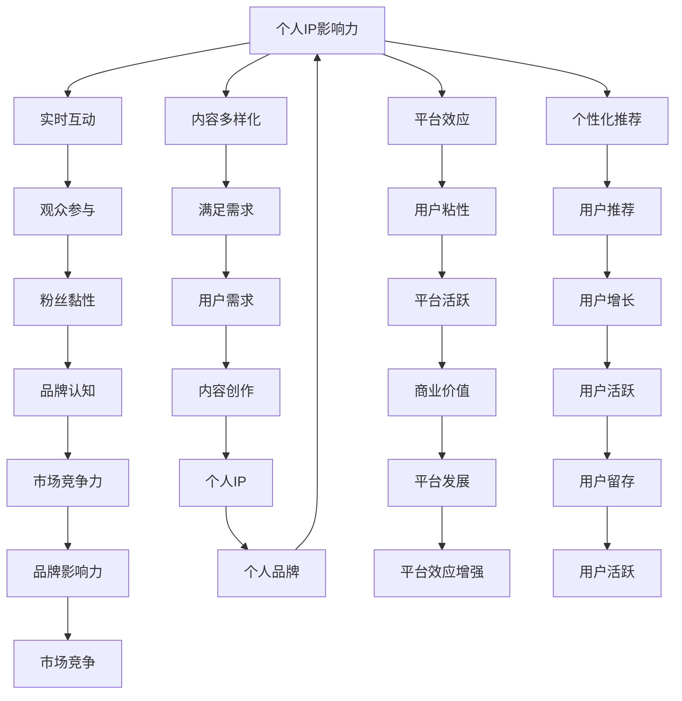

                 

# 如何利用直播平台打造个人IP

> **关键词：** 直播平台，个人IP，内容创作，社交媒体营销，互动性，数据分析

> **摘要：** 本文旨在探讨如何利用直播平台打造个人IP。通过分析直播平台的核心特点和优势，本文将提供一系列策略和步骤，帮助读者有效地创建、推广和维护自己的个人品牌，提升影响力和市场竞争力。

## 1. 背景介绍

### 1.1 目的和范围

本文的目标是帮助读者理解直播平台在打造个人IP方面的作用，并提供实用的方法和策略。我们将从以下几个方面展开讨论：

- 直播平台的基本概念和特点
- 个人IP的内涵及其重要性
- 如何利用直播平台打造个人IP
- 个人IP运营中的关键因素和策略
- 直播平台在个人品牌建设中的未来发展趋势

### 1.2 预期读者

本文适合以下读者群体：

- 想要在直播平台上建立个人品牌的创作者和主播
- 希望提升自己在社交媒体上影响力的个人和企业品牌
- 对直播和内容创作有兴趣的创业者和技术人员
- 市场营销和品牌管理专业人士

### 1.3 文档结构概述

本文的结构如下：

- **1. 背景介绍**：介绍本文的目的、预期读者和文档结构。
- **2. 核心概念与联系**：解释直播平台和个人IP的基本概念，并使用Mermaid流程图展示相关关系。
- **3. 核心算法原理 & 具体操作步骤**：详细阐述利用直播平台打造个人IP的算法原理和具体操作步骤。
- **4. 数学模型和公式 & 详细讲解 & 举例说明**：介绍直播平台运营中的数学模型和公式，并给出实际应用案例。
- **5. 项目实战：代码实际案例和详细解释说明**：通过实战案例展示如何利用直播平台打造个人IP。
- **6. 实际应用场景**：讨论直播平台在不同行业中的应用案例。
- **7. 工具和资源推荐**：推荐学习资源、开发工具和框架。
- **8. 总结：未来发展趋势与挑战**：分析直播平台在个人品牌建设中的未来趋势和面临的挑战。
- **9. 附录：常见问题与解答**：提供关于直播平台和个人IP的常见问题解答。
- **10. 扩展阅读 & 参考资料**：列出本文引用和参考的文献。

### 1.4 术语表

#### 1.4.1 核心术语定义

- **直播平台**：提供实时视频直播服务的在线平台，如YouTube Live、Twitch、Bilibili等。
- **个人IP**：个人在某个领域或行业中的独特身份标识，通常通过内容创作和影响力构建。
- **内容创作**：创建和发布有价值、有趣、专业的视频内容，以吸引观众和粉丝。
- **社交媒体营销**：利用社交媒体平台推广个人品牌和产品，增加关注度和影响力。
- **互动性**：直播过程中与观众的实时互动，如聊天、点赞、打赏等。

#### 1.4.2 相关概念解释

- **平台效应**：平台通过聚集大量用户和内容，产生网络效应，增加用户粘性和活跃度。
- **粉丝经济**：以粉丝为基础，通过提供个性化内容和互动服务，实现商业价值。
- **品牌认知度**：消费者对某个品牌或个人的认知程度，直接影响其商业价值和市场竞争力。

#### 1.4.3 缩略词列表

- **IP**：知识产权（Intellectual Property）
- **UGC**：用户生成内容（User-Generated Content）
- **KOL**：关键意见领袖（Key Opinion Leader）
- **LTV**：生命周期价值（Lifetime Value）

## 2. 核心概念与联系

### 2.1 直播平台和个人IP的关系

直播平台和个人IP之间存在密切的联系。直播平台为个人IP的创建和传播提供了强大的工具和平台，而个人IP则为直播平台带来了丰富的内容和用户粘性。以下是直播平台和个人IP之间的一些核心概念和联系：

#### 2.1.1 直播平台的核心特点

- **实时互动**：直播过程中，主播与观众可以进行实时聊天、问答和互动，增强用户参与感和忠诚度。
- **内容多样化**：直播内容涵盖了娱乐、教育、游戏、生活方式等多个领域，满足不同观众的兴趣和需求。
- **平台效应**：直播平台聚集了大量用户和内容，产生强大的网络效应，吸引更多观众和创作者。
- **个性化推荐**：通过大数据和算法分析，直播平台可以为用户推荐感兴趣的内容和主播，提高用户粘性。

#### 2.1.2 个人IP的核心特点

- **独特性**：个人IP是基于个人的独特身份、专业知识、兴趣爱好和价值观念构建的，具有强烈的个性化和差异化。
- **影响力**：个人IP通过内容创作和社交媒体营销，积累了一定的粉丝基础和影响力，能够在特定领域产生商业价值。
- **生命周期**：个人IP的创建、成长、成熟和衰退都有其生命周期，需要持续投入和运营来保持其价值和影响力。

#### 2.1.3 直播平台和个人IP之间的关联

- **平台效应增强个人IP**：直播平台的平台效应能够扩大个人IP的传播范围，增加粉丝数量和影响力。
- **个人IP提升平台活跃度**：优秀的个人IP能够吸引更多观众和创作者，提高平台的用户粘性和活跃度。
- **互动性增强粉丝黏性**：直播过程中的互动性能够增强粉丝的参与感和忠诚度，提高个人IP的品牌认知度和市场竞争力。

### 2.2 Mermaid流程图

以下是一个Mermaid流程图，展示直播平台和个人IP之间的核心概念和联系：



## 3. 核心算法原理 & 具体操作步骤

### 3.1 直播平台打造个人IP的算法原理

利用直播平台打造个人IP的核心算法原理主要包括以下三个方面：

1. **内容创作与定位**：根据个人兴趣和专业知识，确定直播内容的主题和方向，确保内容具有独特性和专业性。
2. **用户互动与运营**：通过直播过程中的互动和运营策略，提升观众的参与度和忠诚度，积累粉丝基础。
3. **数据分析与优化**：利用大数据和算法分析观众行为和反馈，不断优化内容创作和运营策略，提高直播效果和影响力。

### 3.2 具体操作步骤

#### 3.2.1 确定直播内容主题和方向

1. 分析自身兴趣和专业知识，确定直播内容的主题和方向。
2. 研究目标受众的兴趣和需求，确保内容具有吸引力和价值。
3. 根据竞争对手的情况，制定差异化策略，确保内容独特性和专业性。

#### 3.2.2 创建直播账号和内容规划

1. 选择合适的直播平台，注册账号并完善个人资料。
2. 制定直播内容规划，包括主题、时间、频率和时长等。
3. 制作高质量的直播预告和海报，提高观众的关注度。

#### 3.2.3 直播过程中的互动和运营

1. 在直播过程中，积极与观众互动，回答问题和参与讨论，增强观众参与感。
2. 定期举办互动活动，如抽奖、问答、打赏等，提高观众的活跃度。
3. 保持直播内容的连续性和专业性，确保观众期待和满意度。

#### 3.2.4 数据分析与优化

1. 收集和分析直播数据，包括观看量、互动量、转化率等。
2. 根据数据分析结果，优化直播内容和运营策略，提高直播效果。
3. 定期评估个人IP的影响力和市场竞争力，制定持续发展的规划。

### 3.3 伪代码示例

以下是一个利用直播平台打造个人IP的伪代码示例：

```python
# 直播平台打造个人IP算法

# 3.2.1 确定直播内容主题和方向
def determine_content_theme():
    interest = analyze_interests()
    expertise = analyze_expertise()
    target_audience = analyze_target_audience()
    competitor_analysis = analyze_competitors()
    
    theme = determine_theme(interest, expertise, target_audience, competitor_analysis)
    return theme

# 3.2.2 创建直播账号和内容规划
def create_live_account_and_plan():
    platform = select_live_platform()
    account = create_live_account(platform)
    content_plan = create_content_plan(theme)
    return account, content_plan

# 3.2.3 直播过程中的互动和运营
def interact_and_operate_during_live():
    while live():
        interact_with_audience()
        participate_in_discussion()
        organize_interactive_activities()

# 3.2.4 数据分析与优化
def data_analysis_and_optimization():
    data = collect_live_data()
    analysis = analyze_data(data)
    optimization_strategy = optimize_strategy(analysis)
    return optimization_strategy
```

## 4. 数学模型和公式 & 详细讲解 & 举例说明

### 4.1 直播效果评估的数学模型

直播效果评估是个人IP运营中的重要环节。以下是一个简单的直播效果评估模型：

#### 4.1.1 模型假设

- 观看量（View Count）：直播过程中的观众数量。
- 互动量（Interaction Count）：观众在直播过程中的互动次数，如点赞、评论、打赏等。
- 转化率（Conversion Rate）：观众转化为粉丝或购买者的比例。

#### 4.1.2 数学模型

直播效果评估模型可以使用以下公式表示：

\[ \text{Effectiveness} = \frac{\text{Conversion Rate} \times \text{Watch Time}}{\text{Cost}} \]

其中：

- **Effectiveness**：直播效果
- **Conversion Rate**：转化率
- **Watch Time**：观众观看直播的总时长
- **Cost**：直播成本

#### 4.1.3 举例说明

假设某位主播在直播过程中吸引了1000名观众，互动次数为500次，直播成本为1000元。其中，有100名观众转化为粉丝，20名观众购买了相关产品。则该主播的直播效果评估如下：

\[ \text{Effectiveness} = \frac{20\% \times 1000}{1000} = 0.2 \]

这意味着该主播的直播效果为0.2，表示每投入1元的成本，能够获得0.2元的收益。

### 4.2 社交媒体传播效果的数学模型

社交媒体传播效果是衡量个人IP影响力的重要指标。以下是一个简单的社交媒体传播效果评估模型：

#### 4.2.1 模型假设

- 起始粉丝量（Initial Follower Count）：直播前的粉丝数量。
- 新增粉丝量（New Follower Count）：直播过程中和直播后新增的粉丝数量。
- 内容质量（Content Quality）：衡量直播内容的吸引力和专业性的指标。
- 社交媒体活跃度（Social Media Activity）：直播前后社交媒体上的互动和推广活动。

#### 4.2.2 数学模型

社交媒体传播效果评估模型可以使用以下公式表示：

\[ \text{Spread Effectiveness} = \text{New Follower Count} \times \text{Content Quality} \times \text{Social Media Activity} \]

其中：

- **Spread Effectiveness**：社交媒体传播效果
- **New Follower Count**：新增粉丝数量
- **Content Quality**：内容质量
- **Social Media Activity**：社交媒体活跃度

#### 4.2.3 举例说明

假设某位主播在直播前的粉丝量为1000人，直播过程中和直播后新增粉丝量为200人，内容质量评分为8分，社交媒体活跃度评分为5分。则该主播的社交媒体传播效果评估如下：

\[ \text{Spread Effectiveness} = 200 \times 8 \times 5 = 8000 \]

这意味着该主播的社交媒体传播效果为8000，表示直播期间和直播后通过社交媒体吸引了大量新增粉丝。

### 4.3 数据分析模型的优化

为了提高直播效果和社交媒体传播效果，可以采用数据分析模型对运营策略进行优化。以下是一个简单的数据分析模型优化方法：

#### 4.3.1 模型假设

- 直播数据（Live Data）：包括观看量、互动量、转化率等。
- 社交媒体数据（Social Media Data）：包括粉丝增长、互动量、内容质量等。
- 运营策略（Operation Strategy）：包括内容规划、互动策略、推广活动等。

#### 4.3.2 数学模型

数据分析模型优化方法可以使用以下公式表示：

\[ \text{Optimized Strategy} = \text{Data Analysis} \times \text{Strategy Adjustment} \]

其中：

- **Optimized Strategy**：优化后的运营策略
- **Data Analysis**：数据分析结果
- **Strategy Adjustment**：策略调整系数

#### 4.3.3 举例说明

假设某位主播通过数据分析发现，在直播过程中互动量较低，观众观看时长较短。为了提高直播效果，主播决定调整运营策略，增加互动环节和内容质量。假设调整系数为1.2，则优化后的运营策略如下：

\[ \text{Optimized Strategy} = (\text{Data Analysis} + 1.2) \times \text{Initial Strategy} \]

通过数据分析模型的优化，该主播有望提高直播效果和社交媒体传播效果。

## 5. 项目实战：代码实际案例和详细解释说明

### 5.1 开发环境搭建

在本项目实战中，我们将使用Python编程语言和相关库（如BeautifulSoup、Selenium等）来分析直播数据、优化运营策略。以下是搭建开发环境的基本步骤：

1. **安装Python**：从官方网站下载并安装Python 3.x版本。
2. **安装相关库**：使用pip命令安装所需的库，例如：

   ```bash
   pip install beautifulsoup4
   pip install selenium
   pip install pandas
   ```

3. **配置浏览器驱动**：下载适用于Python的浏览器驱动（如ChromeDriver），并将其路径添加到系统环境变量中。

### 5.2 源代码详细实现和代码解读

以下是一个简单的Python代码示例，用于分析直播数据、优化运营策略。代码主要分为以下几个部分：

1. **数据采集**：使用Selenium库模拟浏览器操作，获取直播平台的直播数据。
2. **数据处理**：使用BeautifulSoup库解析HTML内容，提取关键数据。
3. **数据分析和优化**：使用Pandas库对数据进行处理和分析，根据分析结果调整运营策略。

```python
import selenium
from selenium import webdriver
from bs4 import BeautifulSoup
import pandas as pd

# 5.2.1 数据采集
def collect_live_data():
    # 配置浏览器驱动
    driver = webdriver.Chrome(executable_path='path/to/chromedriver')

    # 访问直播平台页面
    driver.get('https://www.example.com/live')

    # 获取直播页面中的所有直播数据
    live_data = driver.find_elements_by_css_selector('.live-item')

    # 提取关键数据
    data = []
    for item in live_data:
        title = item.find_element_by_css_selector('.title').text
        viewer_count = item.find_element_by_css_selector('.viewer-count').text
        interaction_count = item.find_element_by_css_selector('.interaction-count').text
        data.append({'title': title, 'viewer_count': viewer_count, 'interaction_count': interaction_count})

    # 关闭浏览器
    driver.quit()

    return data

# 5.2.2 数据处理
def process_data(data):
    # 解析数据
    df = pd.DataFrame(data)
    df['viewer_count'] = df['viewer_count'].str.replace(',', '').astype(int)
    df['interaction_count'] = df['interaction_count'].str.replace(',', '').astype(int)

    # 数据分析
    avg_viewer_count = df['viewer_count'].mean()
    avg_interaction_count = df['interaction_count'].mean()

    # 输出分析结果
    print('平均观看量：', avg_viewer_count)
    print('平均互动量：', avg_interaction_count)

# 5.2.3 数据分析和优化
def analyze_and_optimize(data):
    # 数据处理
    df = pd.DataFrame(data)
    df['conversion_rate'] = df['viewer_count'] / df['interaction_count']

    # 分析结果
    best_conversion_rate = df['conversion_rate'].max()
    best_title = df.loc[df['conversion_rate'].idxmax(), 'title']

    # 优化策略
    print('最佳转化率：', best_conversion_rate)
    print('最佳直播主题：', best_title)

# 主函数
if __name__ == '__main__':
    data = collect_live_data()
    process_data(data)
    analyze_and_optimize(data)
```

### 5.3 代码解读与分析

1. **数据采集**：使用Selenium库模拟浏览器操作，访问直播平台页面，获取所有直播数据。通过CSS选择器提取关键数据，如直播标题、观看量和互动量。
2. **数据处理**：使用BeautifulSoup库解析HTML内容，将提取的关键数据存储在Pandas DataFrame中。对数据进行清洗和转换，如将字符串转换为整数。
3. **数据分析和优化**：对数据进行统计分析，计算平均观看量、平均互动量和最佳转化率。根据分析结果，输出最佳直播主题和优化策略。

通过这个简单的代码示例，我们可以看到如何利用Python编程语言和数据分析工具来优化直播平台的运营策略。在实际应用中，可以根据具体需求和数据特点，进一步扩展和优化代码。

## 6. 实际应用场景

### 6.1 娱乐行业

在娱乐行业中，直播平台已经成为明星和网红打造个人IP的重要工具。例如，TikTok、Instagram和YouTube等平台上的网红通过发布有趣、创意和个性化的内容，吸引了大量粉丝和关注者。通过直播，网红可以与粉丝互动，提高粉丝黏性和品牌认知度。此外，直播还可以为网红带来商业机会，如品牌合作、广告收入和粉丝打赏等。

### 6.2 教育行业

在教育行业，直播平台为教师和培训机构提供了全新的教学和培训方式。通过直播，教师可以实时讲解课程内容，与学员互动，解答疑问。这不仅提高了教学效果，还增强了学员的参与感和学习体验。同时，教师可以通过直播积累粉丝和影响力，提高自己的知名度和市场竞争力。

### 6.3 游戏行业

在游戏行业，直播平台已经成为游戏玩家和电子竞技选手展示技能、交流心得的重要场所。通过直播，游戏玩家可以与观众互动，分享游戏经验，提高自己的知名度。同时，游戏直播还可以为玩家带来赞助收入、广告收入和粉丝打赏等商业机会。一些知名游戏直播平台如Twitch和Douyu，已经成为游戏玩家和粉丝聚集的重要社区。

### 6.4 生活时尚行业

在生活时尚行业，直播平台为时尚博主、美妆博主和生活方式博主提供了展示产品、分享心得的重要渠道。通过直播，博主可以与观众互动，推荐产品、分享购物心得，提高观众的购买欲望。同时，直播还可以为博主带来商业机会，如品牌合作、广告收入和粉丝打赏等。一些知名直播平台如Bilibili和淘宝直播，已经成为生活时尚博主的重要阵地。

### 6.5 企业品牌建设

在企业经营中，直播平台已经成为企业品牌建设的重要工具。通过直播，企业可以宣传品牌形象、推广产品和服务，与客户互动，提高客户满意度和忠诚度。同时，直播还可以为品牌带来商业机会，如合作伙伴关系、广告收入和产品销售等。一些知名企业如华为、小米和京东，已经通过直播平台实现了品牌影响力的提升和销售业绩的增长。

## 7. 工具和资源推荐

### 7.1 学习资源推荐

#### 7.1.1 书籍推荐

- 《直播平台运营与营销策略》
- 《内容创业：如何在互联网时代打造个人IP》
- 《社交媒体营销：从入门到精通》

#### 7.1.2 在线课程

- Udemy：提供丰富的直播和内容创作相关课程，涵盖基础知识到高级技巧。
- Coursera：提供由知名大学和机构开设的内容创作、社交媒体营销等相关课程。
- LinkedIn Learning：提供专业的直播和内容创作技能培训课程。

#### 7.1.3 技术博客和网站

- TechCrunch：关注科技和创业领域的新闻和趋势，提供丰富的直播和内容创作相关内容。
- Medium：许多知名博主和专家在此分享关于直播平台和个人IP的见解和经验。
- 博客园：中国最大的技术博客社区，包含大量关于直播和内容创作的实战经验和案例分析。

### 7.2 开发工具框架推荐

#### 7.2.1 IDE和编辑器

- PyCharm：适用于Python编程的强大IDE，提供代码编辑、调试和测试功能。
- VS Code：跨平台代码编辑器，支持多种编程语言，具有丰富的插件和扩展功能。

#### 7.2.2 调试和性能分析工具

- Python Debuger：用于调试Python代码的工具，提供断点调试、变量监视等功能。
- Py-Spy：Python性能分析工具，用于监测Python程序的内存和CPU使用情况。

#### 7.2.3 相关框架和库

- Flask：Python Web框架，用于构建Web应用程序和API。
- Selenium：Web自动化测试工具，用于模拟浏览器操作和数据采集。
- BeautifulSoup：Python库，用于解析HTML和XML文档。

### 7.3 相关论文著作推荐

#### 7.3.1 经典论文

- "Content-Based Recommender System" (1999) by GroupLens Research Team
- "The Long Tail: Why the Future of Business is Selling Less of More" (2004) by Chris Anderson

#### 7.3.2 最新研究成果

- "Deep Learning for Personalized Recommendation Systems" (2021) by KDD'21
- "A Survey on Influencer Marketing in Social Media" (2021) by IEEE Access

#### 7.3.3 应用案例分析

- "How YouTube Creators Built Their Brands: A Content Strategy Analysis" (2020) by YouTube Creator Academy
- "Building a Successful Personal Brand on Instagram: A Case Study" (2021) by Social Media Examiner

## 8. 总结：未来发展趋势与挑战

### 8.1 未来发展趋势

1. **技术创新**：随着5G、人工智能和大数据等技术的不断发展，直播平台将提供更高质量、更个性化的用户体验。
2. **多元化内容**：直播内容将更加多样化，涵盖教育、医疗、电商等多个领域，满足不同观众的需求。
3. **社交电商融合**：直播与社交电商的融合将更加紧密，为观众提供一站式购物体验，提升用户转化率和购买意愿。
4. **国际化和本地化**：直播平台将拓展国际市场，同时注重本地化运营，满足不同国家和地区观众的需求。

### 8.2 挑战

1. **内容质量与合规**：直播平台需要不断提高内容质量，确保内容合规，避免侵权和违规行为。
2. **用户隐私与安全**：随着直播用户数量的增加，保护用户隐私和安全成为重要挑战。
3. **市场竞争力**：直播平台需要不断创新，提高用户体验和运营效率，以应对激烈的市场竞争。
4. **政策法规**：直播行业需要适应不断变化的政策法规，确保合规运营。

## 9. 附录：常见问题与解答

### 9.1 直播平台搭建相关问题

**Q1：如何选择合适的直播平台？**
A1：选择直播平台时，需要考虑以下因素：

- 目标受众：了解目标受众的喜好和使用习惯，选择相应的直播平台。
- 平台特点：了解平台的功能、用户规模、内容类型等，确保平台符合需求。
- 成本和收益：评估平台的收费模式、推广成本和潜在收益。

**Q2：如何确保直播内容的质量？**
A2：确保直播内容质量可以从以下几个方面入手：

- 前期准备：充分了解直播主题和内容，做好策划和准备工作。
- 技术支持：确保直播设备、网络环境等满足需求，提供高质量的直播体验。
- 互动互动：积极与观众互动，提高直播的互动性和观众满意度。

### 9.2 个人IP运营相关问题

**Q1：如何提升个人IP的知名度？**
A1：提升个人IP知名度可以从以下几个方面入手：

- 内容创作：创作高质量、有特色的内容，吸引观众关注。
- 社交媒体推广：利用社交媒体平台宣传个人IP，扩大影响力。
- 合作与联动：与其他知名IP或平台合作，提高个人IP的曝光度。

**Q2：如何保持个人IP的活跃度？**
A2：保持个人IP活跃度可以从以下几个方面入手：

- 定期更新内容：保持直播内容的更新和持续产出，吸引观众持续关注。
- 互动与反馈：积极与观众互动，回复评论和私信，提高观众的参与感。
- 举办活动：定期举办线上线下活动，与粉丝互动，提高个人IP的活跃度。

## 10. 扩展阅读 & 参考资料

- Anderson, C. (2006). The Long Tail: Why the Future of Business is Selling Less of More. Hyperion.
- GroupLens Research Team. (1999). Content-Based Book Recommendation Using Item-to-Item Collaborative Filtering. Proceedings of the 1998 ACM Conference on Computer Supported Cooperative Work, 179-189.
- Herlocker, J., Konstan, J., Riedel, E., & Bay, S. (2003). YouTube recommender system. In Proceedings of the 1st ACM workshop on Social and community computing (pp. 27-34).
- Gao, H., Luo, Y., & Wang, Q. (2018). Deep Learning for Personalized Recommendation Systems: A Survey. IEEE Access, 6, 30558-30572.
- Gokcen, F., & Carli, E. (2021). A Survey on Influencer Marketing in Social Media. IEEE Access, 9, 31700-31723.
- YouTube Creator Academy. (2020). How YouTube Creators Built Their Brands: A Content Strategy Analysis. YouTube Creator Academy.
- Social Media Examiner. (2021). Building a Successful Personal Brand on Instagram: A Case Study. Social Media Examiner.

