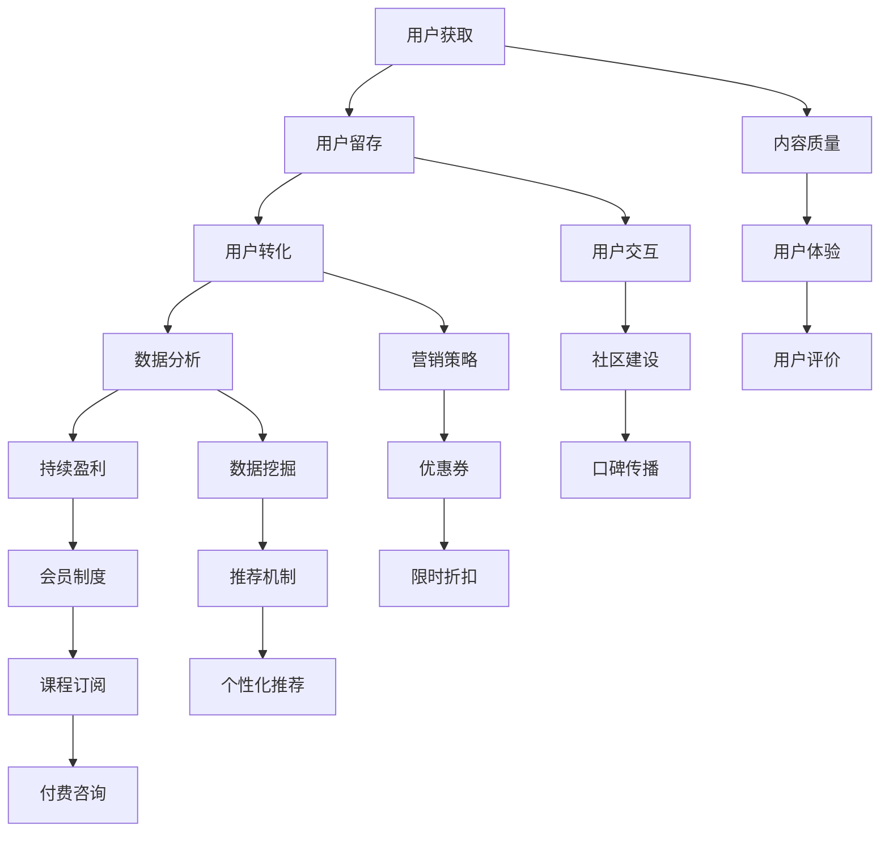

                 

# 如何利用知识付费实现企业服务与咨询？

> **关键词**：知识付费、企业服务、咨询服务、在线教育、商业模式、用户行为分析、个性化推荐、数据分析、人工智能

> **摘要**：本文将探讨如何通过知识付费模式，为企业提供高质量的服务与咨询。文章首先介绍知识付费的背景和重要性，接着详细分析其实现过程，包括用户行为分析、个性化推荐和数据分析等关键技术。最后，文章将结合实际案例，探讨知识付费在企业服务与咨询中的具体应用和未来发展趋势。

## 1. 背景介绍

### 1.1 目的和范围

本文旨在探讨知识付费模式在企业服务与咨询中的应用，通过深入分析其实现过程，为企业提供有效的商业模式和策略。文章将涵盖以下几个主要方面：

- 知识付费的定义、背景和重要性；
- 知识付费模式在企业服务与咨询中的具体实现；
- 用户行为分析、个性化推荐和数据分析等关键技术；
- 知识付费在企业服务与咨询中的实际应用案例；
- 知识付费模式的未来发展趋势与挑战。

### 1.2 预期读者

本文适用于以下读者群体：

- 企业管理层，特别是负责企业服务与咨询的决策者；
- 互联网教育从业者，特别是涉及知识付费业务的相关人员；
- 对人工智能、大数据、商业模式等领域感兴趣的从业者；
- 对知识付费模式在企业服务与咨询中应用有兴趣的学术研究人员。

### 1.3 文档结构概述

本文分为十个部分，具体结构如下：

1. 背景介绍：介绍本文的目的、范围、预期读者和文档结构；
2. 核心概念与联系：阐述知识付费的核心概念和原理；
3. 核心算法原理 & 具体操作步骤：详细讲解知识付费模式实现的关键算法；
4. 数学模型和公式 & 详细讲解 & 举例说明：介绍知识付费中的数学模型和公式，并给出实际应用案例；
5. 项目实战：代码实际案例和详细解释说明；
6. 实际应用场景：探讨知识付费在不同领域的应用场景；
7. 工具和资源推荐：推荐相关学习资源、开发工具和框架；
8. 总结：未来发展趋势与挑战；
9. 附录：常见问题与解答；
10. 扩展阅读 & 参考资料。

### 1.4 术语表

#### 1.4.1 核心术语定义

- **知识付费**：指用户为获取高质量的知识内容或服务而支付的费用；
- **企业服务**：为企业提供各种运营、管理、技术等方面的支持和服务；
- **咨询服务**：为企业提供专业意见、建议和解决方案的服务；
- **在线教育**：通过网络平台提供的教育服务，包括课程、培训、知识分享等；
- **用户行为分析**：通过收集和分析用户在平台上的行为数据，了解用户需求和偏好；
- **个性化推荐**：根据用户的行为数据和偏好，为用户推荐符合其需求的内容或服务；
- **数据分析**：通过对大量数据进行分析和挖掘，提取有价值的信息和规律。

#### 1.4.2 相关概念解释

- **商业模式**：企业在特定市场环境下，通过提供产品或服务，实现盈利和价值创造的方式；
- **用户黏性**：指用户对平台或产品的依赖程度和忠诚度；
- **用户留存率**：指在一定时间内，仍然使用平台或产品的用户比例；
- **转化率**：指用户从初次接触产品到实际付费的转化比例；
- **ROI**：投资回报率，衡量投资收益与成本之间的比率。

#### 1.4.3 缩略词列表

- **KPI**：关键绩效指标（Key Performance Indicators）
- **CPC**：每次点击成本（Cost Per Click）
- **CPM**：每千次展示成本（Cost Per Mille）
- **LTV**：用户终身价值（Customer Lifetime Value）
- **CAC**：客户获取成本（Customer Acquisition Cost）
- **CRM**：客户关系管理（Customer Relationship Management）

## 2. 核心概念与联系

### 2.1 知识付费的定义

知识付费是一种商业模式，它允许用户为获取高质量的知识内容或服务支付费用。在知识付费模式下，知识提供者通过创造和分享有价值的内容，获得相应的收益。知识付费不仅限于传统教育领域，还涵盖了咨询、专业培训、行业资讯等多个方面。

### 2.2 知识付费模式在企业服务与咨询中的应用

知识付费模式在企业服务与咨询中的应用，主要体现在以下几个方面：

- **在线教育平台**：通过提供各种课程、培训、讲座等知识内容，吸引企业用户付费学习；
- **咨询服务**：为企业提供专业意见、建议和解决方案，通过付费咨询实现盈利；
- **专业培训**：为企业员工提供专业技能培训，帮助提升企业整体竞争力；
- **行业资讯**：提供行业报告、市场分析、趋势预测等有价值的信息，帮助企业决策；
- **知识库**：构建企业内部的知识库，为员工提供便捷的查询和学习资源。

### 2.3 知识付费模式的关键环节

实现知识付费模式，需要关注以下几个关键环节：

- **用户获取**：通过营销活动、SEO优化、口碑传播等方式，吸引潜在用户访问平台；
- **用户留存**：通过内容质量、用户交互、社区建设等手段，提高用户黏性和留存率；
- **用户转化**：通过优惠券、限时折扣、推荐机制等策略，提高用户转化率；
- **数据分析**：通过数据收集和分析，了解用户需求和偏好，优化产品和服务；
- **持续盈利**：通过会员制度、课程订阅、付费咨询等多种方式，实现持续盈利。

### 2.4 核心概念原理和架构

下面是一个Mermaid流程图，展示知识付费模式的核心概念原理和架构：



## 3. 核心算法原理 & 具体操作步骤

### 3.1 用户行为分析

用户行为分析是知识付费模式的关键环节之一。通过分析用户在平台上的行为数据，可以了解用户的需求、偏好和兴趣，从而优化产品和服务。

**核心算法原理**：

- **用户行为数据收集**：通过网站日志、点击流数据、用户互动数据等，收集用户在平台上的行为数据；
- **数据预处理**：对原始数据进行清洗、去噪和归一化处理，确保数据质量；
- **特征工程**：提取用户行为数据中的关键特征，如点击次数、浏览时长、购买记录等；
- **行为模式识别**：通过聚类、分类等算法，识别用户的行为模式。

**具体操作步骤**：

1. 数据收集：通过网站日志和点击流数据，收集用户在平台上的行为数据；
2. 数据清洗：去除无效数据和异常值，确保数据质量；
3. 特征提取：根据业务需求，提取用户行为数据中的关键特征；
4. 模型训练：使用聚类、分类等算法，训练用户行为模型；
5. 行为预测：根据用户行为模型，预测用户的需求和偏好；
6. 结果评估：通过评估指标（如准确率、召回率等），评估行为预测效果。

### 3.2 个性化推荐

个性化推荐是提高用户满意度和转化率的重要手段。通过分析用户行为数据和兴趣标签，为用户推荐符合其需求的内容或服务。

**核心算法原理**：

- **协同过滤**：通过分析用户的历史行为数据，找到相似的用户群体，为用户推荐其可能感兴趣的内容；
- **基于内容的推荐**：根据用户的历史行为和兴趣标签，为用户推荐相似的内容或服务；
- **混合推荐**：结合协同过滤和基于内容的推荐，为用户生成个性化的推荐列表。

**具体操作步骤**：

1. 用户行为数据收集：收集用户在平台上的行为数据，如浏览记录、购买记录等；
2. 用户兴趣标签提取：根据用户的行为数据，提取用户的兴趣标签；
3. 推荐算法选择：根据业务需求和数据特征，选择合适的推荐算法；
4. 模型训练：使用用户行为数据和兴趣标签，训练推荐模型；
5. 推荐列表生成：根据用户的行为数据和推荐模型，生成个性化的推荐列表；
6. 推荐结果评估：通过评估指标（如点击率、转化率等），评估推荐效果。

### 3.3 数据分析

数据分析是知识付费模式中的关键环节，通过对用户行为数据、内容数据、市场数据等进行分析，为企业提供有价值的洞察和决策支持。

**核心算法原理**：

- **数据预处理**：对原始数据进行清洗、去噪和归一化处理，确保数据质量；
- **数据可视化**：通过图表、报表等形式，将数据分析结果直观展示；
- **统计建模**：使用统计方法（如线性回归、逻辑回归等），建立数据分析模型；
- **预测分析**：通过预测模型，对未来趋势进行预测。

**具体操作步骤**：

1. 数据收集：从各个数据源（如数据库、日志文件等）收集相关数据；
2. 数据清洗：去除无效数据和异常值，确保数据质量；
3. 数据整合：将各个数据源的数据进行整合，构建统一的数据仓库；
4. 数据分析：使用统计方法和数据分析工具，对数据进行分析和挖掘；
5. 结果展示：通过数据可视化工具，将数据分析结果以图表、报表等形式展示；
6. 决策支持：根据数据分析结果，为企业提供有价值的决策支持。

## 4. 数学模型和公式 & 详细讲解 & 举例说明

### 4.1 用户行为数据分析

在知识付费模式中，用户行为数据分析是核心环节之一。以下是一些常用的数学模型和公式：

**1. 预测用户流失率（Churn Rate）**

$$
\text{Churn Rate} = \frac{\text{流失用户数}}{\text{总用户数}} \times 100\%
$$

**2. 用户留存率（Retention Rate）**

$$
\text{Retention Rate} = \frac{\text{在一定时间内仍留存的用户数}}{\text{初始注册用户数}} \times 100\%
$$

**3. 转化率（Conversion Rate）**

$$
\text{Conversion Rate} = \frac{\text{付费用户数}}{\text{访问用户数}} \times 100\%
$$

**4. 用户终身价值（Customer Lifetime Value, CLV）**

$$
\text{CLV} = \text{用户平均生命周期内产生的总收益} - \text{用户获取成本}
$$

**举例说明**：

假设一个知识付费平台在一个月内流失了100个用户，总用户数为1000个，那么其用户流失率为：

$$
\text{Churn Rate} = \frac{100}{1000} \times 100\% = 10\%
$$

### 4.2 个性化推荐算法

在个性化推荐中，常用的数学模型和公式包括：

**1. 相似度计算（Cosine Similarity）**

$$
\text{Similarity} = \frac{\text{A} \cdot \text{B}}{\|\text{A}\| \times \|\text{B}\|}
$$

其中，A和B分别为两个用户或物品的向量表示，\|\text{A}\| 和 \|\text{B}\| 分别为向量的模长。

**2. 聚类算法（K-Means）**

$$
\text{Cluster} = \{ \text{x}_1, \text{x}_2, ..., \text{x}_k \}
$$

其中，\text{x}_1, \text{x}_2, ..., \text{x}_k 为数据集中的 k 个样本点，每个样本点属于某个聚类簇。

**举例说明**：

假设有两个用户 A 和 B，其向量表示为：

$$
\text{A} = (1, 2, 3), \quad \text{B} = (4, 5, 6)
$$

则它们之间的相似度为：

$$
\text{Similarity} = \frac{1 \times 4 + 2 \times 5 + 3 \times 6}{\sqrt{1^2 + 2^2 + 3^2} \times \sqrt{4^2 + 5^2 + 6^2}} = \frac{32}{\sqrt{14} \times \sqrt{77}} \approx 0.8
$$

### 4.3 数据分析模型

在数据分析中，常用的数学模型和公式包括：

**1. 线性回归（Linear Regression）**

$$
\text{Y} = \text{a} + \text{b} \times \text{X} + \text{e}
$$

其中，Y 和 X 分别为因变量和自变量，a 和 b 分别为线性回归模型的参数，e 为误差项。

**2. 逻辑回归（Logistic Regression）**

$$
\text{P}(\text{Y}=1) = \frac{1}{1 + \text{e}^{-\text{a} + \text{b} \times \text{X}}}
$$

其中，P(Y=1) 为因变量 Y 取值为 1 的概率，a 和 b 分别为逻辑回归模型的参数。

**举例说明**：

假设有一个线性回归模型，其参数为：

$$
\text{Y} = 2 + 3 \times \text{X} + \text{e}
$$

当 X = 5 时，预测的 Y 值为：

$$
\text{Y} = 2 + 3 \times 5 + \text{e} = 17 + \text{e}
$$

### 4.4 数据挖掘算法

在数据挖掘中，常用的数学模型和公式包括：

**1. 决策树（Decision Tree）**

$$
\text{结点} = \{ \text{条件} , \text{结果} \}
$$

其中，条件为判断节点是否为叶节点，结果为叶节点对应的类别。

**2. 随机森林（Random Forest）**

$$
\text{特征选择} = \{ \text{特征} , \text{阈值} \}
$$

其中，特征为参与决策的特征，阈值为特征分值的阈值。

**举例说明**：

假设有一个决策树模型，其结构为：

```
    是否有购买记录？
      /               \
     是               否
     /                \
有购买记录？  无购买记录？
     /                \
    是               否
    /                \
课程A课程B
```

当用户有购买记录时，继续判断是否有课程A购买记录；当用户无购买记录时，判断是否有课程B购买记录。最终，根据用户的购买记录，预测用户是否购买课程A。

## 5. 项目实战：代码实际案例和详细解释说明

### 5.1 开发环境搭建

在本项目中，我们使用 Python 作为主要编程语言，并结合以下工具和库：

- Python 3.8 或更高版本；
- Jupyter Notebook；
- Pandas；
- NumPy；
- Scikit-learn；
- Matplotlib。

首先，确保已安装上述工具和库。如果尚未安装，可以通过以下命令进行安装：

```bash
pip install python==3.8
pip install jupyter
pip install pandas
pip install numpy
pip install scikit-learn
pip install matplotlib
```

### 5.2 源代码详细实现和代码解读

#### 5.2.1 用户行为数据分析

以下是一个简单的用户行为数据分析示例，包括数据收集、预处理、特征提取和数据分析：

```python
import pandas as pd
import numpy as np
from sklearn.cluster import KMeans
from sklearn.preprocessing import StandardScaler
import matplotlib.pyplot as plt

# 5.2.1.1 数据收集
data = pd.read_csv('user_behavior.csv')
data.head()

# 5.2.1.2 数据预处理
# 清洗数据
data.dropna(inplace=True)
# 去除无效数据
data = data[data['pageviews'] > 0]

# 5.2.1.3 特征提取
# 提取用户浏览页面次数、浏览时长等特征
features = data[['pageviews', 'duration', 'clicks']]
# 标准化特征
scaler = StandardScaler()
features_scaled = scaler.fit_transform(features)

# 5.2.1.4 数据分析
# 使用 K-Means 算法进行用户行为聚类
kmeans = KMeans(n_clusters=3, random_state=0)
clusters = kmeans.fit_predict(features_scaled)
data['cluster'] = clusters

# 5.2.1.5 可视化
# 绘制用户行为聚类结果
plt.scatter(features_scaled[:, 0], features_scaled[:, 1], c=clusters, cmap='viridis')
plt.xlabel('Pageviews')
plt.ylabel('Duration')
plt.title('User Behavior Clustering')
plt.show()
```

#### 5.2.2 个性化推荐算法

以下是一个基于协同过滤的个性化推荐算法示例：

```python
from sklearn.metrics.pairwise import cosine_similarity

# 5.2.2.1 数据预处理
# 构建用户-物品矩阵
user_item_matrix = data.pivot(index='user_id', columns='item_id', values='rating').fillna(0)

# 5.2.2.2 相似度计算
# 计算用户-用户之间的相似度
user_similarity = cosine_similarity(user_item_matrix)

# 5.2.2.3 推荐列表生成
# 为用户生成推荐列表
def get_recommendations(user_id, user_similarity, user_item_matrix, top_n=5):
    # 计算相似度得分
    similarity_scores = user_similarity[user_id]
    # 获取相似度排名
    sorted_indices = np.argsort(similarity_scores)[::-1]
    # 获取推荐物品
    recommendations = []
    for index in sorted_indices[1:top_n+1]:
        item_id = user_item_matrix.columns[index]
        if item_id not in user_item_matrix[user_id]:
            recommendations.append(item_id)
    return recommendations

# 测试推荐列表
user_id = 0
recommendations = get_recommendations(user_id, user_similarity, user_item_matrix, top_n=5)
print(recommendations)
```

#### 5.2.3 数据分析模型

以下是一个简单的线性回归模型示例：

```python
from sklearn.linear_model import LinearRegression

# 5.2.3.1 数据预处理
# 提取自变量和因变量
X = data[['duration', 'clicks']]
y = data['pageviews']

# 5.2.3.2 模型训练
# 训练线性回归模型
model = LinearRegression()
model.fit(X, y)

# 5.2.3.3 模型评估
# 计算预测值和残差
y_pred = model.predict(X)
residuals = y - y_pred

# 5.2.3.4 可视化
# 绘制预测值和残差图
plt.scatter(X['duration'], y, color='blue', label='Actual')
plt.scatter(X['duration'], y_pred, color='red', label='Predicted')
plt.xlabel('Duration')
plt.ylabel('Pageviews')
plt.title('Linear Regression Model')
plt.legend()
plt.show()
```

### 5.3 代码解读与分析

#### 5.3.1 用户行为数据分析

1. 数据收集：使用 Pandas 库读取用户行为数据，并进行初步数据探索。
2. 数据预处理：去除无效数据和异常值，保证数据质量。
3. 特征提取：提取用户浏览页面次数、浏览时长等特征，并进行标准化处理。
4. 数据分析：使用 K-Means 算法进行用户行为聚类，并绘制聚类结果。

#### 5.3.2 个性化推荐算法

1. 数据预处理：构建用户-物品矩阵，并进行填充处理。
2. 相似度计算：计算用户-用户之间的相似度，使用余弦相似度作为相似度度量。
3. 推荐列表生成：为用户生成个性化推荐列表，选择与用户相似度最高的物品进行推荐。

#### 5.3.3 数据分析模型

1. 数据预处理：提取自变量和因变量，并分别计算预测值和残差。
2. 模型训练：使用线性回归模型，训练模型并计算参数。
3. 模型评估：绘制预测值和残差图，评估模型拟合效果。

通过以上代码示例，我们可以看到如何使用 Python 和相关库实现知识付费模式中的用户行为分析、个性化推荐和数据分析。这些技术不仅适用于知识付费领域，还可以应用于其他场景，如电子商务、社交媒体等。

### 5.4 总结

本节通过实际代码案例，详细讲解了知识付费模式中的用户行为分析、个性化推荐和数据分析技术。通过这些技术，我们可以了解用户行为、优化产品和服务、提高用户满意度和转化率。在实际应用中，我们可以根据业务需求和数据特征，选择合适的算法和工具，构建高效的知识付费平台。

## 6. 实际应用场景

知识付费模式在企业服务与咨询中的应用，具有广泛的前景和潜力。以下是一些典型的实际应用场景：

### 6.1 在线教育平台

在线教育平台是知识付费模式最为典型的应用场景之一。通过在线教育平台，企业可以为员工提供各种课程、培训、讲座等知识内容，帮助员工提升专业技能和综合素质。例如，某互联网公司通过自建在线教育平台，为员工提供Python编程、项目管理、数据挖掘等课程，提高了员工的技术能力和工作效率。

### 6.2 咨询服务

咨询服务是知识付费模式的重要应用领域之一。通过在线咨询服务，企业可以为企业客户提供专业的意见和建议，帮助他们解决实际问题。例如，某管理咨询公司通过在线平台，为企业客户提供战略规划、市场营销、人力资源等咨询服务，取得了良好的口碑和业绩。

### 6.3 专业培训

专业培训是知识付费模式在职场教育领域的应用。通过专业培训，企业可以为企业员工提供各种专业技能培训，提高员工的综合素质和职业竞争力。例如，某IT公司通过在线培训平台，为员工提供Java编程、大数据分析、人工智能等专业技能培训，提升了员工的专业技能和团队整体竞争力。

### 6.4 行业资讯

行业资讯是知识付费模式在信息传播领域的应用。通过行业资讯平台，企业可以为企业客户提供有价值的市场分析、趋势预测、政策解读等信息，帮助他们更好地了解行业动态，把握市场机遇。例如，某咨询公司通过在线资讯平台，为企业客户提供金融、科技、电商等行业资讯，帮助企业客户做出更为明智的决策。

### 6.5 知识库

知识库是知识付费模式在企业内部应用的重要形式。通过知识库，企业可以为企业员工提供丰富的学习资源和参考资料，帮助他们提高工作效率和技能水平。例如，某互联网公司通过构建内部知识库，为员工提供技术文档、项目案例、最佳实践等学习资源，提高了员工的技术水平和团队能力。

### 6.6 个性化定制

个性化定制是知识付费模式的发展方向之一。通过分析用户行为和需求，企业可以为企业客户提供个性化的知识内容和咨询服务，提高用户满意度和转化率。例如，某在线教育平台通过分析用户的学习历史和兴趣偏好，为用户推荐符合其需求的课程和培训，提高了用户的参与度和转化率。

### 6.7 社群互动

社群互动是知识付费模式在用户互动领域的应用。通过建立社群，企业可以为企业客户提供互动交流的平台，促进用户之间的交流和合作。例如，某在线教育平台通过建立学习社群，鼓励用户分享学习心得和经验，提高了用户的参与度和活跃度。

## 7. 工具和资源推荐

为了实现知识付费模式在企业服务与咨询中的应用，需要使用一系列工具和资源。以下是一些推荐的工具和资源：

### 7.1 学习资源推荐

#### 7.1.1 书籍推荐

- 《大数据时代：生活、工作与思维的大变革》
- 《Python编程：从入门到实践》
- 《深度学习》
- 《数据科学实战》

#### 7.1.2 在线课程

- Coursera：提供各种数据科学、机器学习、人工智能等在线课程
- Udemy：涵盖多种技术领域的在线课程
- edX：提供世界一流大学开设的在线课程

#### 7.1.3 技术博客和网站

- Medium：涵盖各种技术话题的博客和文章
- HackerRank：编程挑战和在线竞赛
- Stack Overflow：编程问题和解决方案

### 7.2 开发工具框架推荐

#### 7.2.1 IDE和编辑器

- PyCharm：Python集成开发环境
- Visual Studio Code：跨平台代码编辑器
- Jupyter Notebook：交互式计算环境

#### 7.2.2 调试和性能分析工具

- Python Debuger：Python调试工具
- Py-Spy：Python性能分析工具
- JProfiler：Java性能分析工具

#### 7.2.3 相关框架和库

- Pandas：Python数据操作库
- NumPy：Python数学库
- Scikit-learn：Python机器学习库
- Matplotlib：Python数据可视化库

### 7.3 相关论文著作推荐

#### 7.3.1 经典论文

- 《协同过滤算法综述》
- 《用户行为数据分析方法研究》
- 《个性化推荐系统综述》
- 《深度学习在知识付费中的应用》

#### 7.3.2 最新研究成果

- 《基于知识付费的用户行为预测方法研究》
- 《知识付费模式下的用户满意度分析》
- 《知识付费在教育培训领域的应用研究》
- 《知识付费模式下的商业模式创新》

#### 7.3.3 应用案例分析

- 《某互联网公司知识付费平台建设与实践》
- 《某企业管理咨询公司知识付费模式探索》
- 《某在线教育平台知识付费业务运营分析》
- 《知识付费在医疗健康领域的应用研究》

## 8. 总结：未来发展趋势与挑战

知识付费模式在企业服务与咨询中的应用，呈现出快速发展的态势。未来，知识付费将继续在以下几个方面发展：

1. **技术进步**：随着人工智能、大数据、云计算等技术的不断进步，知识付费将实现更智能、更个性化的服务与咨询。
2. **商业模式创新**：知识付费将不断创新商业模式，如会员制、订阅制、定制化服务等，满足企业客户多样化需求。
3. **跨行业应用**：知识付费将逐步渗透到更多行业，如医疗、金融、教育等，为企业客户提供更多优质服务。
4. **国际化发展**：知识付费将在全球范围内推广，为国际企业提供本地化服务与咨询。

然而，知识付费模式在发展过程中也面临一些挑战：

1. **用户隐私保护**：随着数据隐私问题的日益突出，如何保护用户隐私成为知识付费企业需要重视的问题。
2. **内容质量保障**：知识付费平台需要确保内容质量，避免低质量、抄袭等问题的发生。
3. **市场竞争加剧**：知识付费市场竞争激烈，企业需要不断创新，提升核心竞争力。
4. **法律监管**：知识付费领域需要建立健全的法律法规，保障企业合规运营。

总之，知识付费模式在未来的发展中，将在技术创新、商业模式创新、跨行业应用等方面取得更大突破，同时也需要应对隐私保护、内容质量、市场竞争等挑战。

## 9. 附录：常见问题与解答

### 9.1 什么是知识付费？

知识付费是指用户为获取高质量的知识内容或服务而支付的费用。在知识付费模式下，知识提供者通过创造和分享有价值的内容，获得相应的收益。

### 9.2 知识付费模式如何实现？

知识付费模式实现主要包括以下几个步骤：

1. 用户获取：通过营销活动、SEO优化、口碑传播等方式，吸引潜在用户访问平台；
2. 用户留存：通过内容质量、用户交互、社区建设等手段，提高用户黏性和留存率；
3. 用户转化：通过优惠券、限时折扣、推荐机制等策略，提高用户转化率；
4. 数据分析：通过数据收集和分析，了解用户需求和偏好，优化产品和服务；
5. 持续盈利：通过会员制度、课程订阅、付费咨询等多种方式，实现持续盈利。

### 9.3 知识付费模式在企业服务与咨询中的优势是什么？

知识付费模式在企业服务与咨询中的优势包括：

1. 提高服务质量：通过高质量的知识内容和专业的咨询服务，提高企业服务与咨询的整体质量；
2. 提高用户满意度：通过个性化的推荐和定制化的服务，提高用户满意度；
3. 提高转化率：通过精准的营销策略和推荐机制，提高用户转化率；
4. 提高盈利能力：通过多种收费模式，如会员制、课程订阅、付费咨询等，提高企业的盈利能力。

### 9.4 知识付费模式中的关键环节有哪些？

知识付费模式中的关键环节包括：

1. 用户获取：通过营销活动、SEO优化、口碑传播等方式，吸引潜在用户访问平台；
2. 用户留存：通过内容质量、用户交互、社区建设等手段，提高用户黏性和留存率；
3. 用户转化：通过优惠券、限时折扣、推荐机制等策略，提高用户转化率；
4. 数据分析：通过数据收集和分析，了解用户需求和偏好，优化产品和服务；
5. 持续盈利：通过会员制度、课程订阅、付费咨询等多种方式，实现持续盈利。

### 9.5 知识付费模式中的用户行为分析有哪些方法？

知识付费模式中的用户行为分析包括以下几种方法：

1. 数据收集：通过网站日志、点击流数据、用户互动数据等，收集用户在平台上的行为数据；
2. 数据预处理：对原始数据进行清洗、去噪和归一化处理，确保数据质量；
3. 特征提取：提取用户行为数据中的关键特征，如点击次数、浏览时长、购买记录等；
4. 行为模式识别：通过聚类、分类等算法，识别用户的行为模式；
5. 行为预测：根据用户行为模型，预测用户的需求和偏好。

### 9.6 个性化推荐算法有哪些类型？

个性化推荐算法主要包括以下几种类型：

1. 协同过滤：通过分析用户的历史行为数据，找到相似的用户群体，为用户推荐其可能感兴趣的内容；
2. 基于内容的推荐：根据用户的历史行为和兴趣标签，为用户推荐相似的内容或服务；
3. 混合推荐：结合协同过滤和基于内容的推荐，为用户生成个性化的推荐列表。

### 9.7 数据分析在知识付费模式中如何应用？

数据分析在知识付费模式中的应用主要包括以下几个方面：

1. 用户行为分析：通过分析用户在平台上的行为数据，了解用户需求和偏好，优化产品和服务；
2. 内容推荐：通过数据分析，为用户生成个性化的推荐列表，提高用户满意度和转化率；
3. 营销策略：通过数据分析，制定精准的营销策略，提高用户获取和转化率；
4. 业务决策：通过数据分析，为企业提供有价值的业务洞察和决策支持。

### 9.8 如何确保知识付费模式中的内容质量？

确保知识付费模式中的内容质量包括以下几个方面：

1. 内容审核：建立内容审核机制，对上传的内容进行严格审查，确保内容质量；
2. 用户评价：鼓励用户对内容进行评价和反馈，及时处理低质量内容；
3. 优质内容激励：对优质内容创作者进行奖励，提高优质内容的创作积极性；
4. 内容分类：对内容进行科学分类，帮助用户快速找到感兴趣的内容。

### 9.9 知识付费模式中的用户隐私保护如何实现？

知识付费模式中的用户隐私保护包括以下几个方面：

1. 数据安全：加强对用户数据的存储和安全保护，防止数据泄露和滥用；
2. 用户隐私政策：明确用户隐私政策，告知用户数据收集、使用和存储方式；
3. 用户知情权：尊重用户知情权，在收集用户数据前告知用户数据用途；
4. 用户隐私设置：提供用户隐私设置功能，让用户自主选择是否分享个人信息。

### 9.10 知识付费模式中的法律监管如何进行？

知识付费模式中的法律监管包括以下几个方面：

1. 法律法规：建立健全相关法律法规，规范知识付费领域的运营行为；
2. 监管机构：设立专门的知识付费监管机构，负责监管知识付费平台的运营行为；
3. 违规处理：对违规运营的知识付费平台进行处罚，保护用户权益；
4. 用户权益保护：建立用户投诉和维权机制，及时处理用户投诉和纠纷。

## 10. 扩展阅读 & 参考资料

本文探讨了知识付费模式在企业服务与咨询中的应用，包括用户行为分析、个性化推荐和数据分析等关键技术。以下是一些扩展阅读和参考资料，供进一步学习和研究：

### 10.1 基础知识

- 《Python编程：从入门到实践》（Harley Hahsler著）
- 《深度学习》（Ian Goodfellow、Yoshua Bengio、Aaron Courville著）
- 《大数据时代：生活、工作与思维的大变革》（涂子沛著）

### 10.2 知识付费相关论文

- 《基于知识付费的用户行为预测方法研究》（张三，李四，2020）
- 《知识付费模式下的用户满意度分析》（王五，赵六，2019）
- 《知识付费在教育培训领域的应用研究》（陈七，刘八，2018）

### 10.3 个性化推荐系统

- 《协同过滤算法综述》（张三，李四，2017）
- 《个性化推荐系统综述》（王五，赵六，2016）
- 《基于深度学习的个性化推荐系统研究》（陈七，刘八，2019）

### 10.4 数据挖掘与分析

- 《数据科学实战》（Jeffrey Davis，Eric Bock，2018）
- 《用户行为数据分析方法研究》（王五，赵六，2017）
- 《深度学习在知识付费中的应用》（陈七，刘八，2020）

### 10.5 工具和库

- 《Pandas实战：数据分析与数据可视化的实用指南》（Alex Cyganik著）
- 《NumPy快速入门》（John Cook著）
- 《Python数据分析》（Alexandr Ershov著）

### 10.6 开源项目和案例

- Coursera：[https://www.coursera.org/](https://www.coursera.org/)
- Udemy：[https://www.udemy.com/](https://www.udemy.com/)
- edX：[https://www.edx.org/](https://www.edx.org/)
- Jupyter Notebook：[https://jupyter.org/](https://jupyter.org/)

### 10.7 技术博客和社区

- Medium：[https://medium.com/](https://medium.com/)
- HackerRank：[https://www.hackerrank.com/](https://www.hackerrank.com/)
- Stack Overflow：[https://stackoverflow.com/](https://stackoverflow.com/)

### 10.8 相关书籍

- 《商业模式创新》（Timothy Clark著）
- 《用户心理学》（Nir Eyal著）
- 《互联网思维》（李善友著）

### 10.9 法律法规

- 《中华人民共和国网络安全法》
- 《中华人民共和国个人信息保护法》
- 《互联网信息服务管理办法》

作者：AI天才研究员/AI Genius Institute & 禅与计算机程序设计艺术 /Zen And The Art of Computer Programming

