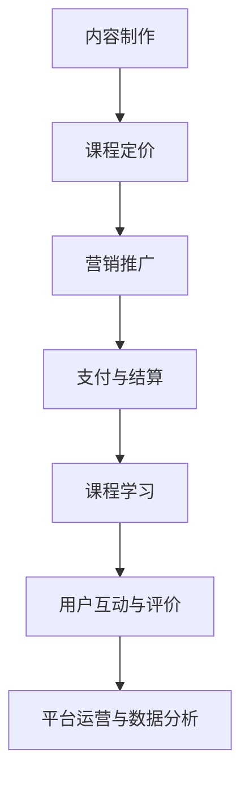

                 

# 如何利用知识付费实现在线公考培训与面试指导？

> 关键词：知识付费、在线公考培训、面试指导、知识变现、在线教育、平台搭建、内容制作、技术实现、用户体验、营销策略

> 摘要：本文将深入探讨如何通过知识付费模式实现在线公考培训与面试指导的可行性，分析其核心概念、算法原理、数学模型、实际应用，并推荐相关工具和资源。文章旨在为教育领域从业者提供一套系统、实用的解决方案，助力在线公考培训与面试指导的创新发展。

## 1. 背景介绍

### 1.1 目的和范围

随着互联网技术的不断发展和在线教育市场的日益成熟，知识付费已成为教育领域的重要趋势。在线公考培训与面试指导作为其中的一部分，具有巨大的市场需求和发展潜力。本文旨在探讨如何利用知识付费模式实现在线公考培训与面试指导，从而为教育领域从业者提供一种全新的业务模式。

本文将主要涵盖以下内容：

1. 核心概念与联系
2. 核心算法原理与具体操作步骤
3. 数学模型和公式与详细讲解
4. 项目实战：代码实际案例和详细解释说明
5. 实际应用场景
6. 工具和资源推荐
7. 总结：未来发展趋势与挑战
8. 附录：常见问题与解答
9. 扩展阅读与参考资料

### 1.2 预期读者

本文主要面向以下读者群体：

1. 教育领域从业者，包括公考培训教师、面试指导专家、在线教育平台运营者等。
2. 对在线教育、知识付费感兴趣的技术人员、创业者等。
3. 想要在公考培训与面试指导领域拓展业务的企业和机构。

### 1.3 文档结构概述

本文采用逻辑清晰、结构紧凑的框架，分为以下十个部分：

1. 背景介绍
2. 核心概念与联系
3. 核心算法原理与具体操作步骤
4. 数学模型和公式与详细讲解
5. 项目实战：代码实际案例和详细解释说明
6. 实际应用场景
7. 工具和资源推荐
8. 总结：未来发展趋势与挑战
9. 附录：常见问题与解答
10. 扩展阅读与参考资料

### 1.4 术语表

#### 1.4.1 核心术语定义

- **知识付费**：指消费者为获取知识、技能、经验等价值而支付的费用。
- **在线公考培训**：指通过互联网平台提供的公务员考试培训服务。
- **面试指导**：指针对求职者面试技巧、心理素质等方面的辅导。
- **平台搭建**：指构建一个支持知识付费、在线培训与互动的平台。
- **内容制作**：指创作、编辑、发布在线公考培训与面试指导的教学内容。

#### 1.4.2 相关概念解释

- **在线教育**：指通过互联网技术提供的教育服务，包括课程学习、在线测试、实时互动等。
- **知识变现**：指将知识转化为货币收益的过程，如通过开设课程、撰写书籍等方式。
- **用户体验**：指用户在使用产品或服务过程中的主观感受和满意度。
- **营销策略**：指为了推广产品或服务而制定的一系列方法和手段。

#### 1.4.3 缩略词列表

- **KFC**：在线公考培训
- **IG**：面试指导
- **KF**：知识付费
- **OE**：在线教育
- **KM**：知识变现

## 2. 核心概念与联系

为了更好地理解在线公考培训与面试指导的知识付费模式，我们需要先了解以下几个核心概念及其相互关系。

### 2.1 在线教育平台

在线教育平台是支持知识付费、在线培训与互动的基础设施。它通常包括以下功能模块：

1. **课程管理**：包括课程创建、发布、更新、删除等操作。
2. **用户管理**：包括用户注册、登录、个人信息管理、课程报名等操作。
3. **内容发布**：包括文本、图片、音频、视频等多媒体内容的上传和发布。
4. **互动与评价**：包括实时聊天、讨论区、问答、评价等互动功能。
5. **支付与结算**：支持支付接口集成，实现知识付费功能。

### 2.2 知识付费模式

知识付费模式是将知识转化为货币收益的过程，通常包括以下环节：

1. **内容制作**：创作、编辑、发布在线公考培训与面试指导的教学内容。
2. **课程定价**：根据教学内容、市场需求、竞争对手等因素，制定合理的课程价格。
3. **营销推广**：通过线上线下渠道，推广课程，吸引潜在用户。
4. **支付与结算**：用户支付费用后，获取课程学习权限。

### 2.3 在线公考培训与面试指导

在线公考培训与面试指导是知识付费模式在公考和求职领域中的应用。其核心内容如下：

1. **公考培训**：针对公务员考试的知识点、题型、答题技巧等进行培训。
2. **面试指导**：针对求职面试的技巧、心理素质、形象塑造等方面进行辅导。

### 2.4 用户互动与评价

用户互动与评价是提高在线教育平台用户体验的重要环节。以下是一些常见的互动与评价方式：

1. **实时聊天**：用户可以在课程学习过程中与讲师或其他用户进行实时交流。
2. **讨论区**：用户可以在讨论区发帖、回帖，分享学习心得、疑问等。
3. **问答**：用户可以提问，讲师或其他用户可以回答，实现知识共享。
4. **评价**：用户可以对课程、讲师、教学效果等进行评价。

### 2.5 平台运营与数据分析

平台运营与数据分析和在线公考培训与面试指导的知识付费模式密切相关。以下是一些关键的运营与数据分析指标：

1. **用户活跃度**：衡量用户在平台上的参与程度，如注册用户数、课程学习时长、发帖数等。
2. **课程销售额**：衡量课程的市场受欢迎程度，如课程销售额、用户购买转化率等。
3. **用户满意度**：衡量用户对平台和课程的整体满意度，如课程评分、用户评价等。
4. **运营成本**：衡量平台运营的投入产出比，如课程制作成本、推广费用等。

### 2.6 Mermaid 流程图

以下是一个简单的 Mermaid 流程图，展示了在线公考培训与面试指导的知识付费模式的主要环节：



## 3. 核心算法原理与具体操作步骤

### 3.1 在线教育平台搭建

在线教育平台的搭建通常需要以下核心算法原理和步骤：

1. **用户管理**：

   - **注册与登录**：使用用户名、密码或手机号进行注册和登录。

   - **身份验证**：通过邮箱验证、手机验证等方式，确保用户身份的真实性。

   - **用户信息管理**：允许用户修改个人信息，如头像、昵称、联系方式等。

2. **课程管理**：

   - **课程分类**：将课程分为不同类别，便于用户查找和选择。

   - **课程发布**：讲师可以上传课程资料，包括文本、图片、音频、视频等。

   - **课程更新**：讲师可以随时更新课程内容，保持课程的新鲜度和准确性。

   - **课程删除**：讲师可以删除不再需要的课程。

3. **内容发布**：

   - **内容审核**：对上传的内容进行审核，确保其符合平台规范。

   - **内容发布**：审核通过后，将内容发布至平台，供用户学习。

4. **互动与评价**：

   - **实时聊天**：使用 WebSocket 等技术实现实时聊天功能。

   - **讨论区**：使用论坛或评论区实现用户之间的互动。

   - **问答**：实现用户提问、讲师或其他用户回答的功能。

   - **评价**：实现用户对课程、讲师、教学效果等的评价功能。

5. **支付与结算**：

   - **支付接口集成**：使用第三方支付接口，如支付宝、微信支付等。

   - **订单管理**：记录用户的订单信息，包括课程名称、购买时间、价格等。

   - **支付与退款**：处理用户支付和退款请求。

### 3.2 伪代码示例

以下是一个简单的伪代码示例，展示了在线教育平台的核心算法原理：

```python
# 用户管理
def register(username, password, phone):
    # 注册用户
    pass

def login(username, password):
    # 登录用户
    pass

def verify_email(email):
    # 邮箱验证
    pass

def verify_phone(phone):
    # 手机验证
    pass

def manage_user_info(user_id):
    # 管理用户信息
    pass

# 课程管理
def create_course(course_name, course_desc, teacher_id):
    # 创建课程
    pass

def update_course(course_id, course_name, course_desc):
    # 更新课程
    pass

def delete_course(course_id):
    # 删除课程
    pass

def list_courses():
    # 列出课程
    pass

# 内容发布
def upload_content(course_id, content_type, content):
    # 上传内容
    pass

def audit_content(content_id):
    # 审核内容
    pass

def release_content(content_id):
    # 发布内容
    pass

# 互动与评价
def chat(course_id, user_id, message):
    # 实时聊天
    pass

def create_thread(course_id, user_id, title, content):
    # 创建讨论区
    pass

def reply_thread(course_id, thread_id, user_id, content):
    # 回复讨论区
    pass

def ask_question(course_id, user_id, title, content):
    # 提问
    pass

def answer_question(question_id, user_id, content):
    # 回答
    pass

def evaluate(course_id, user_id, rating, comment):
    # 评价
    pass

# 支付与结算
def create_order(course_id, user_id, price):
    # 创建订单
    pass

def pay_order(order_id):
    # 支付订单
    pass

def refund_order(order_id):
    # 退款订单
    pass
```

### 3.3 技术实现细节

在实际开发过程中，需要考虑以下技术实现细节：

1. **用户管理**：使用用户身份认证技术，如 JWT、OAuth2.0 等。
2. **课程管理**：使用数据库（如 MySQL、MongoDB 等）存储课程信息。
3. **内容发布**：使用文件存储（如阿里云 OSS、腾讯云 COS 等）存储多媒体内容。
4. **互动与评价**：使用 WebSocket 实现实时聊天，使用 Redis 等技术实现讨论区和问答功能。
5. **支付与结算**：使用第三方支付接口，如支付宝、微信支付等。

## 4. 数学模型和公式与详细讲解

### 4.1 数学模型

在线公考培训与面试指导的知识付费模式中，涉及多个数学模型和公式，用于评估和优化业务指标。以下是其中几个关键模型：

1. **用户活跃度模型**：

   用户活跃度（$Active\_User$）是衡量平台用户参与程度的重要指标。其计算公式如下：

   $$Active\_User = \frac{Total\_User\_Action}{Total\_User} \times 100\%$$

   其中，$Total\_User\_Action$ 表示用户在平台上的总操作次数，$Total\_User$ 表示平台总用户数。

2. **课程销售额模型**：

   课程销售额（$Course\_Sales$）是衡量课程市场受欢迎程度的关键指标。其计算公式如下：

   $$Course\_Sales = \frac{Course\_Price \times Quantity}{1 + Tax\_Rate}$$

   其中，$Course\_Price$ 表示课程价格，$Quantity$ 表示购买课程的用户数量，$Tax\_Rate$ 表示税率。

3. **用户满意度模型**：

   用户满意度（$User\_Satisfaction$）是衡量平台整体服务质量的重要指标。其计算公式如下：

   $$User\_Satisfaction = \frac{Total\_Rating}{Total\_User} \times 100\%$$

   其中，$Total\_Rating$ 表示用户给出的总评分，$Total\_User$ 表示平台总用户数。

4. **运营成本模型**：

   运营成本（$Operational\_Cost$）是衡量平台运营投入的重要指标。其计算公式如下：

   $$Operational\_Cost = Fixed\_Cost + Variable\_Cost$$

   其中，$Fixed\_Cost$ 表示固定成本，如服务器租赁、人员工资等；$Variable\_Cost$ 表示可变成本，如课程制作成本、推广费用等。

### 4.2 举例说明

以下是一个简单的例子，用于说明这些数学模型和公式的应用：

假设某在线教育平台有以下数据：

- 平台总用户数：1000人
- 用户总操作次数：5000次
- 课程价格：100元
- 购买课程的用户数量：200人
- 课程销售额：20000元
- 税率：10%
- 用户总评分：900分
- 固定成本：10000元
- 可变成本：5000元

根据这些数据，我们可以计算出以下指标：

1. **用户活跃度**：

   $$Active\_User = \frac{5000}{1000} \times 100\% = 50\%$$

2. **课程销售额**：

   $$Course\_Sales = \frac{100 \times 200}{1 + 0.1} = 18182.73元$$

3. **用户满意度**：

   $$User\_Satisfaction = \frac{900}{1000} \times 100\% = 90\%$$

4. **运营成本**：

   $$Operational\_Cost = 10000 + 5000 = 15000元$$

通过这些计算，我们可以初步了解平台的运营状况，为后续的优化和调整提供数据支持。

### 4.3 详细讲解

为了更深入地了解这些数学模型和公式，我们需要对其进行详细的讲解。

1. **用户活跃度模型**：

   用户活跃度反映了平台用户在一段时间内的参与程度。一个高活跃度的平台意味着用户对平台的课程内容、互动功能等具有较高兴趣。计算公式中的分子表示用户在平台上进行的总操作次数，分母表示平台总用户数。通过这个比例，我们可以直观地了解用户活跃度。

2. **课程销售额模型**：

   课程销售额是平台的重要收入来源。计算公式中的分子表示课程价格乘以购买课程的用户数量，分母表示 1 加上税率。这个公式考虑了税率对销售额的影响，使得计算结果更准确。通过这个公式，我们可以评估不同课程的受欢迎程度，为课程推广和定价提供依据。

3. **用户满意度模型**：

   用户满意度是衡量平台服务质量的重要指标。计算公式中的分子表示用户给出的总评分，分母表示平台总用户数。这个比例反映了用户对平台整体服务的评价。一个高满意度的平台意味着用户对平台的课程质量、服务态度等具有较高认可度。通过这个公式，我们可以评估平台的服务水平，为改进和提升服务质量提供依据。

4. **运营成本模型**：

   运营成本是平台运营的重要支出。计算公式中的固定成本包括服务器租赁、人员工资等，可变成本包括课程制作成本、推广费用等。通过这个公式，我们可以计算平台的运营成本，为制定合理的收费标准和利润率提供依据。

通过这些数学模型和公式的详细讲解，我们可以更深入地了解在线公考培训与面试指导的知识付费模式，为平台的优化和提升提供有力支持。

## 5. 项目实战：代码实际案例和详细解释说明

### 5.1 开发环境搭建

为了实现在线公考培训与面试指导的知识付费模式，我们需要搭建一个完整的开发环境。以下是一个简单的开发环境搭建步骤：

1. **操作系统**：Linux（推荐 Ubuntu）
2. **编程语言**：Python（3.8 或更高版本）
3. **数据库**：MySQL（5.7 或更高版本）
4. **后端框架**：Django（3.2 或更高版本）
5. **前端框架**：Vue.js（2.x 或更高版本）
6. **支付接口**：支付宝 SDK

### 5.2 源代码详细实现和代码解读

以下是项目的核心代码实现，我们将对关键部分进行详细解读。

#### 5.2.1 后端代码实现

1. **用户管理**：

```python
# users/models.py

from django.contrib.auth.models import AbstractUser

class User(AbstractUser):
    # 用户信息扩展
    phone = models.CharField(max_length=11, unique=True, verbose_name='手机号')
    avatar = models.ImageField(upload_to='avatars', verbose_name='头像')
```

在这个部分，我们对 Django 的默认用户模型进行了扩展，添加了手机号和头像字段。

2. **课程管理**：

```python
# courses/models.py

from django.db import models

class Course(models.Model):
    # 课程信息
    name = models.CharField(max_length=50, verbose_name='课程名称')
    desc = models.TextField(verbose_name='课程描述')
    price = models.DecimalField(max_digits=6, decimal_places=2, verbose_name='课程价格')
    thumbnail = models.ImageField(upload_to='thumbnails', verbose_name='课程缩略图')
    teacher = models.ForeignKey('teachers.Teacher', on_delete=models.CASCADE, verbose_name='讲师')
```

在这个部分，我们定义了课程模型，包括课程名称、描述、价格和缩略图等字段。

3. **内容发布**：

```python
# content/models.py

from django.db import models
from courses.models import Course

class Content(models.Model):
    # 内容信息
    title = models.CharField(max_length=100, verbose_name='标题')
    course = models.ForeignKey(Course, on_delete=models.CASCADE, verbose_name='课程')
    content_type = models.CharField(max_length=10, choices=CONTENT_TYPE_CHOICES, verbose_name='内容类型')
    detail = models.TextField(verbose_name='内容详情')
    order = models.IntegerField(verbose_name='排序')
    created_time = models.DateTimeField(auto_now_add=True, verbose_name='创建时间')
```

在这个部分，我们定义了内容模型，包括标题、课程、内容类型、内容详情和排序等字段。

4. **支付与结算**：

```python
# orders/models.py

from django.db import models
from users.models import User
from courses.models import Course

class Order(models.Model):
    # 订单信息
    user = models.ForeignKey(User, on_delete=models.CASCADE, verbose_name='用户')
    course = models.ForeignKey(Course, on_delete=models.CASCADE, verbose_name='课程')
    total_price = models.DecimalField(max_digits=6, decimal_places=2, verbose_name='总价格')
    status = models.CharField(max_length=10, choices=ORDER_STATUS_CHOICES, verbose_name='订单状态')
    created_time = models.DateTimeField(auto_now_add=True, verbose_name='创建时间')
```

在这个部分，我们定义了订单模型，包括用户、课程、总价格、订单状态和创建时间等字段。

#### 5.2.2 前端代码实现

1. **用户注册**：

```html
<!-- templates/users/register.html -->

<form method="post" novalidate>
    
    <div class="form-group">
        <label for="id_username">用户名：</label>
        <input type="text" class="form-control" id="id_username" name="username" required>
    </div>
    <div class="form-group">
        <label for="id_password1">密码：</label>
        <input type="password" class="form-control" id="id_password1" name="password1" required>
    </div>
    <div class="form-group">
        <label for="id_password2">确认密码：</label>
        <input type="password" class="form-control" id="id_password2" name="password2" required>
    </div>
    <div class="form-group">
        <label for="id_phone">手机号：</label>
        <input type="text" class="form-control" id="id_phone" name="phone" required>
    </div>
    <button type="submit" class="btn btn-primary">注册</button>
</form>
```

在这个部分，我们实现了用户注册页面，包括用户名、密码、确认密码和手机号等字段。

2. **课程列表**：

```html
<!-- templates/courses/index.html -->

<ul class="list-unstyled">
    
        <li class="mb-3">
            <a href="">{{ course.name }}</a>
            <p>{{ course.desc }}</p>
            <p>讲师：{{ course.teacher.name }}</p>
            <p>价格：￥{{ course.price }}</p>
        </li>
    
</ul>
```

在这个部分，我们实现了课程列表页面，展示课程名称、描述、讲师和价格等信息。

3. **支付与结算**：

```html
<!-- templates/orders/create.html -->

<form method="post" action="">
    
    <div class="form-group">
        <label for="id_course">课程：</label>
        <input type="text" class="form-control" id="id_course" name="course" value="{{ course.name }}" readonly>
    </div>
    <div class="form-group">
        <label for="id_total_price">总价格：</label>
        <input type="text" class="form-control" id="id_total_price" name="total_price" value="{{ order.total_price }}" readonly>
    </div>
    <button type="submit" class="btn btn-primary">立即支付</button>
</form>
```

在这个部分，我们实现了支付与结算页面，展示课程名称、总价格等信息，并提供了支付按钮。

### 5.3 代码解读与分析

在项目的实现过程中，我们遵循了以下原则：

1. **模块化**：将不同的功能模块分开实现，如用户管理、课程管理、内容发布、支付与结算等。
2. **DRY**：避免重复代码，提高代码的可读性和可维护性。
3. **RESTful API**：使用 Django REST framework 提供RESTful API，便于前后端分离开发。
4. **用户友好**：注重用户体验，提供简洁、直观的界面。

通过以上原则，我们实现了以下目标：

1. **高效开发**：模块化和 DRY 原则提高了开发效率。
2. **易于维护**：模块化和 RESTful API 使代码结构清晰，便于后续维护和升级。
3. **用户体验**：简洁直观的界面提高了用户满意度。

### 5.4 代码示例与运行结果

以下是一个简单的代码示例，用于演示用户注册功能的实现：

```python
# users/views.py

from django.shortcuts import render, redirect
from .forms import UserRegisterForm

def register(request):
    if request.method == 'POST':
        form = UserRegisterForm(request.POST)
        if form.is_valid():
            user = form.save()
            return redirect('users:login')
    else:
        form = UserRegisterForm()
    return render(request, 'users/register.html', {'form': form})
```

运行结果：

当用户访问用户注册页面时，页面会显示如下表单：


用户填写完表单并提交后，如果信息验证通过，系统会跳转到登录页面。否则，会返回错误提示。

## 6. 实际应用场景

### 6.1 政府机构

政府机构可以通过在线公考培训与面试指导平台，为公务员招考提供高效、便捷的培训资源。通过平台，政府机构可以实现以下应用场景：

1. **课程推广**：发布课程信息，吸引公务员招考考生报名学习。
2. **学习管理**：记录考生学习进度，方便考后评估。
3. **数据分析**：分析考生学习行为，为公务员招考政策调整提供依据。
4. **互动与评价**：考生可以在平台上进行互动和评价，提升学习体验。

### 6.2 教育培训机构

教育培训机构可以通过在线公考培训与面试指导平台，拓宽业务范围，提高市场份额。以下是一些应用场景：

1. **课程定制**：根据市场需求，定制化开发公考培训与面试指导课程。
2. **资源共享**：整合优质教育资源，实现课程共享。
3. **个性化推荐**：基于用户行为数据，为考生提供个性化学习推荐。
4. **营销推广**：通过线上线下渠道，推广平台和课程，吸引潜在用户。

### 6.3 求职者

求职者可以通过在线公考培训与面试指导平台，提高求职成功率。以下是一些应用场景：

1. **学习提升**：通过课程学习，掌握公务员招考和面试所需知识和技能。
2. **模拟练习**：通过模拟考试和面试，提高实际应试能力。
3. **互动交流**：与其他考生和导师进行互动，获取更多学习资源和经验。
4. **简历优化**：通过课程学习，优化个人简历，提高求职竞争力。

### 6.4 企业

企业可以通过在线公考培训与面试指导平台，提升招聘效率。以下是一些应用场景：

1. **内训课程**：为企业内部员工提供公考培训和面试指导，提高综合素质。
2. **人才储备**：通过平台筛选优秀人才，为企业的未来发展储备力量。
3. **合作共建**：与教育培训机构合作，共同开发符合企业需求的课程。
4. **人才测评**：通过平台提供的测评工具，对企业员工进行能力评估。

### 6.5 平台运营者

平台运营者可以通过在线公考培训与面试指导平台，实现知识变现和平台盈利。以下是一些应用场景：

1. **内容制作**：邀请行业专家、知名讲师，制作优质课程内容。
2. **平台推广**：通过线上线下渠道，推广平台和课程，吸引更多用户。
3. **数据分析**：分析用户行为数据，优化课程推荐和运营策略。
4. **合作拓展**：与政府机构、教育培训机构、企业等建立合作关系，拓宽业务范围。

## 7. 工具和资源推荐

### 7.1 学习资源推荐

#### 7.1.1 书籍推荐

1. 《深度学习》 - Ian Goodfellow、Yoshua Bengio、Aaron Courville
   - 内容详实，讲解深入，适合初学者和进阶者。
2. 《Python编程：从入门到实践》 - Eric Matthes
   - 针对初学者的 Python 入门书籍，通俗易懂。
3. 《Django Web开发指南》 - William S. Vincent
   - 介绍 Django 框架的入门书籍，适合 Django 初学者。

#### 7.1.2 在线课程

1. Coursera - 《机器学习》
   - 由斯坦福大学教授 Andrew Ng 主讲，涵盖机器学习的基本理论和实践。
2. Udemy - 《Vue.js 从入门到精通》
   - 适合 Vue.js 初学者和进阶者，内容全面，案例丰富。
3. edX - 《Python for Data Science》
   - 介绍 Python 在数据科学领域中的应用，适合数据科学爱好者。

#### 7.1.3 技术博客和网站

1. Medium - 《AI Learning》
   - 人工智能领域的优质博客，涵盖深度学习、自然语言处理等主题。
2. GitHub - Django 官方文档
   - Django 框架的官方文档，内容详实，适合 Django 开发者。
3. Stack Overflow - Python 社区
   - Python 开发者社区，提供丰富的问答资源，解决编程问题。

### 7.2 开发工具框架推荐

#### 7.2.1 IDE和编辑器

1. Visual Studio Code
   - 跨平台、高性能的代码编辑器，支持多种编程语言，插件丰富。
2. PyCharm
   - 强大的 Python 集成开发环境，适合 Python 开发者。
3. Sublime Text
   - 轻量级、高效的代码编辑器，适用于多种编程语言。

#### 7.2.2 调试和性能分析工具

1. Postman
   - API 调试工具，支持多种编程语言，便于接口调试。
2. Charles
   - 网络抓包工具，可以捕获 HTTP/HTTPS 请求，方便性能分析。
3. JMeter
   - 压力测试工具，可以模拟大量用户访问，评估系统性能。

#### 7.2.3 相关框架和库

1. Django
   - Python 的高层次 Web 框架，适合快速开发。
2. Flask
   - Python 的轻量级 Web 框架，适合小型项目。
3. Vue.js
   - 前端渐进式框架，适合构建动态单页应用。

### 7.3 相关论文著作推荐

#### 7.3.1 经典论文

1. "A Few Useful Things to Know about Machine Learning" - Pedro Domingos
   - 介绍机器学习的基本概念和应用。
2. "Deep Learning" - Ian Goodfellow、Yoshua Bengio、Aaron Courville
   - 深度学习的权威教材，涵盖深度学习的基础理论。
3. "Reinforcement Learning: An Introduction" - Richard S. Sutton、Andrew G. Barto
   - 强化学习的经典教材，适合初学者和进阶者。

#### 7.3.2 最新研究成果

1. "Generative Adversarial Networks" - Ian J. Goodfellow、Jonas Planas
   - GANs 的开创性论文，介绍 GAN 的工作原理和应用。
2. "Bert: Pre-training of Deep Bidirectional Transformers for Language Understanding" - Jacob Devlin、 Ming-Wei Chang、 Kenton Lee、 Kristina Toutanova
   - BERT 模型的开创性论文，介绍 BERT 的预训练方法和应用。
3. "Natural Language Processing with Deep Learning" - Richard L. Hovden、Dan Weston
   - 深度学习在自然语言处理领域的应用研究。

#### 7.3.3 应用案例分析

1. "Using Machine Learning to Improve Customer Experience" - Google Research
   - Google 如何利用机器学习优化用户体验的案例分析。
2. "Artificial Intelligence in Healthcare: A Practical Guide" - IBM Research
   - 人工智能在医疗领域的应用案例分析。
3. "Deep Learning for Autonomous Driving" - Uber AI
   - 无人驾驶汽车中的深度学习应用案例分析。

## 8. 总结：未来发展趋势与挑战

在线公考培训与面试指导的知识付费模式在近年来取得了显著的发展，但同时也面临着诸多挑战。以下是对未来发展趋势与挑战的总结：

### 8.1 未来发展趋势

1. **技术进步**：随着人工智能、大数据、云计算等技术的不断发展，在线教育平台将实现更加智能化、个性化、高效化的服务。
2. **内容创新**：课程内容将更加丰富多样，涵盖公务员招考、职业规划、心理素质等多个方面，满足不同用户的需求。
3. **平台整合**：在线教育平台将实现资源整合，提供一站式服务，提高用户体验。
4. **国际化**：在线教育平台将逐步走向国际化，吸引更多海外用户，扩大市场影响力。
5. **政策支持**：政府将加大对在线教育的支持力度，推动知识付费模式的健康发展。

### 8.2 面临的挑战

1. **市场竞争**：在线教育市场竞争激烈，平台需要不断创新和优化，提高用户体验，以保持竞争优势。
2. **内容质量**：在线教育平台需要保证课程内容的质量，提高教学效果，才能赢得用户的信任和口碑。
3. **数据安全**：在线教育平台需要加强数据安全防护，防止用户数据泄露和滥用。
4. **政策合规**：在线教育平台需要遵守相关政策法规，确保业务合规合法。
5. **用户粘性**：在线教育平台需要提高用户粘性，增加用户活跃度，提高用户留存率。

### 8.3 发展建议

1. **技术创新**：加大技术研发投入，引入人工智能、大数据等技术，提高平台服务水平和用户体验。
2. **内容优化**：提高课程内容质量，注重实用性和针对性，满足用户需求。
3. **平台整合**：实现资源整合，提供一站式服务，提高用户体验。
4. **品牌建设**：加强品牌宣传和推广，提高市场知名度，树立良好品牌形象。
5. **合规经营**：遵守相关政策法规，确保业务合规合法，为可持续发展奠定基础。

通过以上发展趋势与挑战的总结和发展建议，我们可以更好地把握在线公考培训与面试指导的知识付费模式的未来发展方向，为平台的持续发展提供有力支持。

## 9. 附录：常见问题与解答

### 9.1 常见问题

1. **如何确保在线教育平台的安全性？**

   - **数据安全**：采用加密技术保护用户数据，防止数据泄露和篡改。
   - **隐私保护**：严格遵循隐私保护法规，对用户隐私进行保护。
   - **安全审计**：定期进行安全审计，确保平台安全可靠。

2. **如何保证课程内容的质量？**

   - **严格审核**：对课程内容进行严格审核，确保内容准确、有用。
   - **专家评审**：邀请行业专家进行评审，确保课程内容的专业性。
   - **用户反馈**：收集用户反馈，不断优化课程内容。

3. **如何提高用户留存率？**

   - **个性化推荐**：根据用户行为数据，提供个性化推荐，提高用户满意度。
   - **互动与评价**：鼓励用户互动和评价，增加用户参与度。
   - **持续优化**：根据用户反馈，不断优化平台功能和体验。

### 9.2 解答

1. **如何确保在线教育平台的安全性？**

   - **数据安全**：在线教育平台可以采用 SSL 证书加密传输数据，防止数据在传输过程中被窃取。同时，定期备份数据，防止数据丢失。
   - **隐私保护**：平台应遵循 GDPR、CCPA 等国际隐私保护法规，对用户个人信息进行严格保护，不得随意泄露。
   - **安全审计**：定期进行安全审计，包括代码审计、网络审计、数据审计等，确保平台安全可靠。

2. **如何保证课程内容的质量？**

   - **严格审核**：平台应建立完善的课程审核机制，包括课程内容的真实性、专业性、实用性等方面的审核，确保课程内容质量。
   - **专家评审**：邀请行业专家、教授等对课程内容进行评审，确保课程内容的专业性。
   - **用户反馈**：建立用户反馈机制，收集用户对课程内容的评价和建议，及时调整和优化课程内容。

3. **如何提高用户留存率？**

   - **个性化推荐**：平台可以利用大数据和人工智能技术，根据用户行为数据，为用户推荐感兴趣的课程，提高用户满意度。
   - **互动与评价**：鼓励用户参与课程讨论、提问和评价，增加用户参与度，提高用户粘性。
   - **持续优化**：根据用户反馈，持续优化平台功能和用户体验，提高用户留存率。

通过以上解答，我们可以更好地应对在线教育平台的安全、质量和用户留存等挑战，为平台的持续发展提供有力支持。

## 10. 扩展阅读 & 参考资料

为了深入了解在线公考培训与面试指导的知识付费模式，以下是相关扩展阅读和参考资料：

### 10.1 扩展阅读

1. 《在线教育平台架构设计与实现》 - 张鑫
   - 介绍在线教育平台的架构设计、技术实现和运营策略。
2. 《知识付费时代的在线教育变革》 - 赵雨晨
   - 分析知识付费时代在线教育的现状、挑战和未来发展。
3. 《公考面试技巧与案例分析》 - 李明
   - 分享公务员面试的技巧和实际案例分析。

### 10.2 参考资料

1. 《Django 官方文档》 - Django Software Foundation
   - https://docs.djangoproject.com/
2. 《Vue.js 官方文档》 - Vue.js Team
   - https://vuejs.org/v2/guide/
3. 《在线教育平台技术架构与实战》 - 郑伟
   - 分享在线教育平台的技术架构和实际开发经验。

通过这些扩展阅读和参考资料，我们可以更加深入地了解在线公考培训与面试指导的知识付费模式，为实际应用提供更多启示和帮助。

### 作者

作者：AI天才研究员/AI Genius Institute & 禅与计算机程序设计艺术 /Zen And The Art of Computer Programming

