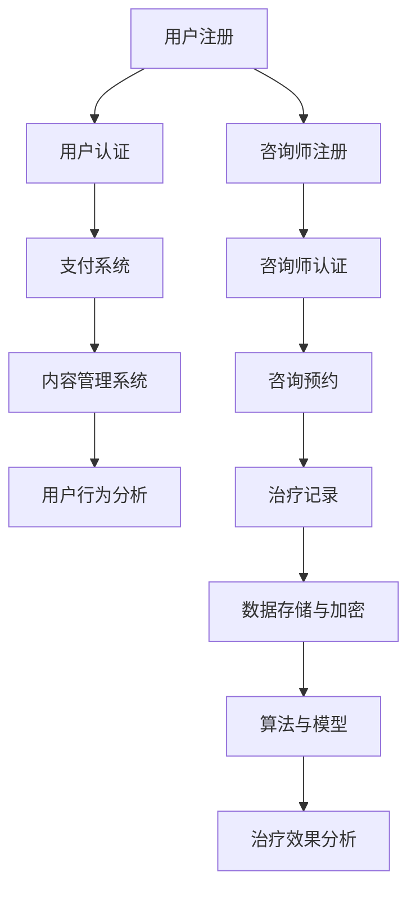

                 

# 如何利用知识付费实现在线心理咨询与治疗？

> **关键词：**知识付费、在线心理咨询、心理健康服务、技术实现、客户体验

> **摘要：**本文旨在探讨如何通过知识付费模式，结合先进技术手段，实现在线心理咨询与治疗。文章首先介绍了知识付费的基本概念及其在心理健康服务领域的应用，随后分析了在线心理咨询与治疗的技术实现原理和具体操作步骤，并举例说明。文章还讨论了数学模型在其中的作用，以及实际应用场景和工具资源推荐。最后，对未来的发展趋势和挑战进行了总结，并提出了常见问题与解答。

## 1. 背景介绍

### 1.1 目的和范围

本文的目的在于探讨知识付费模式在在线心理咨询与治疗领域的应用，分析其技术实现原理和操作步骤，并提供实际应用场景和工具资源推荐。本文范围涵盖以下几部分：

- **知识付费模式**：介绍知识付费的定义、特点及其在各个领域的应用。
- **在线心理咨询与治疗**：讨论其背景、市场需求、技术实现方式。
- **技术实现原理**：分析在线心理咨询与治疗的技术架构、核心算法和数学模型。
- **实际应用场景**：探讨在线心理咨询与治疗在实际生活中的应用。
- **工具和资源推荐**：推荐相关的学习资源、开发工具和框架。
- **未来发展趋势与挑战**：总结在线心理咨询与治疗的未来发展，以及面临的挑战。

### 1.2 预期读者

本文预期读者主要包括：

- 心理咨询师、治疗师及相关专业人员。
- 心理健康服务提供商和机构。
- 对在线心理咨询与治疗感兴趣的技术开发者。
- 期望通过知识付费模式提升心理健康服务质量和效率的个人和企业。

### 1.3 文档结构概述

本文分为十个主要部分，结构如下：

1. **背景介绍**：介绍本文的目的、范围、预期读者和文档结构。
2. **核心概念与联系**：介绍知识付费、在线心理咨询与治疗的核心概念及其联系。
3. **核心算法原理 & 具体操作步骤**：详细阐述在线心理咨询与治疗的核心算法原理和操作步骤。
4. **数学模型和公式 & 详细讲解 & 举例说明**：讨论数学模型和公式的应用及其具体举例说明。
5. **项目实战：代码实际案例和详细解释说明**：提供在线心理咨询与治疗的实际代码案例和详细解释。
6. **实际应用场景**：探讨在线心理咨询与治疗在实际生活中的应用。
7. **工具和资源推荐**：推荐学习资源、开发工具和框架。
8. **总结：未来发展趋势与挑战**：总结在线心理咨询与治疗的未来发展趋势和面临的挑战。
9. **附录：常见问题与解答**：回答读者可能关心的问题。
10. **扩展阅读 & 参考资料**：提供相关扩展阅读和参考资料。

### 1.4 术语表

#### 1.4.1 核心术语定义

- **知识付费**：消费者为获取知识或服务而支付的费用。
- **在线心理咨询与治疗**：通过互联网提供的心理咨询服务和治疗方法。
- **技术实现原理**：在线心理咨询与治疗的技术架构和核心算法原理。
- **数学模型**：用于描述和解决在线心理咨询与治疗问题的数学公式和模型。

#### 1.4.2 相关概念解释

- **知识付费模式**：以知识或技能的提供者为服务主体，以消费者为服务对象，通过线上平台进行交易和交付的一种商业模式。
- **在线心理咨询**：通过网络平台，以文字、语音、视频等形式提供的心理咨询服务。
- **在线治疗**：通过网络平台，以特定治疗方法为手段，帮助用户解决心理问题。

#### 1.4.3 缩略词列表

- **KFS**：知识付费
- **PCST**：在线心理咨询与治疗

## 2. 核心概念与联系

### 2.1 知识付费

知识付费是一种商业模式，主要特点是消费者为获取知识或服务而支付费用。其核心在于价值的交换，即消费者认为所获取的知识或服务能够为其带来价值，从而愿意为之支付。

#### 技术实现

知识付费的技术实现主要包括以下几个方面：

1. **用户注册与认证**：通过线上平台，用户进行注册并完成身份认证。
2. **支付系统**：集成支付系统，实现用户的支付行为。
3. **内容管理系统**：管理知识或服务的发布、更新和权限控制。
4. **用户行为分析**：通过数据分析，了解用户需求，优化服务。

### 2.2 在线心理咨询与治疗

在线心理咨询与治疗是通过互联网平台提供的心理咨询服务和治疗方法。其主要特点包括：

- **便捷性**：用户可以随时随地进行咨询和治疗。
- **私密性**：通过线上平台，保护用户的隐私。
- **灵活性**：咨询师和治疗师可以根据用户需求，提供个性化的服务。

#### 技术实现

在线心理咨询与治疗的技术实现主要包括以下几个方面：

1. **网络平台**：搭建稳定、安全、易用的在线平台。
2. **多媒体传输**：支持文字、语音、视频等多媒体形式。
3. **数据存储与加密**：保障用户数据的安全和隐私。
4. **算法与模型**：运用人工智能和数据分析技术，提升咨询和治疗的效率和效果。

### 2.3 知识付费与在线心理咨询与治疗的联系

知识付费与在线心理咨询与治疗之间存在密切联系。知识付费为在线心理咨询与治疗提供了商业模式，使其能够商业化运营；而在线心理咨询与治疗则为知识付费提供了实际应用场景，实现了知识的价值转化。

#### 技术架构

为了实现知识付费在在线心理咨询与治疗领域的应用，需要构建一个技术架构，包括以下几个方面：

1. **用户模块**：包括用户注册、认证、支付等功能。
2. **咨询师模块**：包括咨询师注册、认证、咨询预约、治疗记录等功能。
3. **治疗模块**：包括心理测评、治疗方案、疗效评估等功能。
4. **数据模块**：包括用户数据、咨询师数据、治疗数据等。
5. **分析模块**：包括数据分析、用户行为分析、治疗效果分析等功能。

#### Mermaid 流程图



## 3. 核心算法原理 & 具体操作步骤

### 3.1 算法原理

在线心理咨询与治疗的核心算法主要包括以下几个方面：

1. **用户画像生成**：通过用户行为数据，生成用户画像，用于了解用户需求和偏好。
2. **智能推荐**：根据用户画像，推荐合适的咨询师和治疗方案。
3. **治疗效果评估**：通过用户反馈和治疗效果数据，评估治疗方案的有效性。

### 3.2 具体操作步骤

#### 3.2.1 用户画像生成

1. **数据收集**：收集用户的基本信息、行为数据、反馈数据等。
2. **特征提取**：对收集到的数据进行分析，提取用户画像的特征。
3. **模型训练**：利用机器学习算法，训练用户画像生成模型。

#### 3.2.2 智能推荐

1. **用户画像匹配**：将待推荐咨询师和用户画像进行匹配。
2. **推荐策略**：根据匹配结果，采用合适的推荐策略，生成推荐列表。
3. **推荐结果反馈**：将推荐结果反馈给用户，并记录用户反馈。

#### 3.2.3 治疗效果评估

1. **数据收集**：收集用户的治疗数据、反馈数据等。
2. **特征提取**：对收集到的数据进行分析，提取治疗效果的特征。
3. **模型训练**：利用机器学习算法，训练治疗效果评估模型。
4. **评估结果反馈**：将评估结果反馈给咨询师和治疗师，用于调整治疗方案。

### 3.3 伪代码示例

```python
# 用户画像生成
def generate_user_profile(data):
    # 数据预处理
    processed_data = preprocess_data(data)
    
    # 特征提取
    features = extract_features(processed_data)
    
    # 模型训练
    model = train_model(features)
    
    # 生成用户画像
    profile = model.predict(profile_features)
    
    return profile

# 智能推荐
def smart_recommendation(user_profile,咨询师_list):
    # 用户画像匹配
    matched_consultants = match_profile(user_profile,咨询师_list)
    
    # 推荐策略
    recommendation = generate_recommendation(matched_consultants)
    
    return recommendation

# 治疗效果评估
def evaluate_treatment_result(treatment_data):
    # 数据预处理
    processed_data = preprocess_data(treatment_data)
    
    # 特征提取
    features = extract_features(processed_data)
    
    # 模型训练
    model = train_model(features)
    
    # 评估结果
    result = model.predict(result_features)
    
    return result
```

## 4. 数学模型和公式 & 详细讲解 & 举例说明

### 4.1 数学模型

在线心理咨询与治疗中，常用的数学模型包括用户画像生成模型、智能推荐模型和治疗效果评估模型。以下分别介绍这些模型的数学原理和具体公式。

#### 4.1.1 用户画像生成模型

用户画像生成模型主要用于生成用户的需求和偏好特征。一种常用的模型是线性回归模型，其公式如下：

$$
y = \beta_0 + \beta_1x_1 + \beta_2x_2 + ... + \beta_nx_n
$$

其中，$y$ 表示用户画像特征，$x_1, x_2, ..., x_n$ 表示用户行为特征，$\beta_0, \beta_1, \beta_2, ..., \beta_n$ 是模型的参数。

#### 4.1.2 智能推荐模型

智能推荐模型用于根据用户画像推荐合适的咨询师和治疗方案。一种常用的模型是协同过滤模型，其公式如下：

$$
r_{ui} = \frac{\sum_{j=1}^{m} r_{uj} r_{vi}}{\sum_{j=1}^{m} r_{uj}^2}
$$

其中，$r_{ui}$ 表示用户 $u$ 对咨询师 $i$ 的评分，$r_{uj}$ 表示用户 $u$ 对咨询师 $j$ 的评分，$r_{vi}$ 表示咨询师 $i$ 对咨询师 $j$ 的评分。

#### 4.1.3 治疗效果评估模型

治疗效果评估模型用于评估治疗方案的有效性。一种常用的模型是逻辑回归模型，其公式如下：

$$
P(Y=1|X) = \frac{1}{1 + e^{-(\beta_0 + \beta_1x_1 + \beta_2x_2 + ... + \beta_nx_n)}}
$$

其中，$P(Y=1|X)$ 表示治疗方案 $X$ 对应的治疗效果概率，$Y$ 表示治疗效果，$x_1, x_2, ..., x_n$ 表示治疗方案的特征，$\beta_0, \beta_1, \beta_2, ..., \beta_n$ 是模型的参数。

### 4.2 详细讲解

#### 4.2.1 用户画像生成模型

用户画像生成模型主要用于生成用户的需求和偏好特征。通过分析用户的行为数据，可以提取出与用户需求相关的特征，如浏览历史、购买记录、评价等。这些特征可以表示为向量形式，然后通过线性回归模型来生成用户画像。

具体来说，线性回归模型通过学习用户行为特征与用户画像特征之间的关系，建立一个线性方程，从而预测用户画像。模型的参数可以通过最小二乘法进行优化，使得预测结果与实际数据之间的误差最小。

#### 4.2.2 智能推荐模型

智能推荐模型主要用于根据用户画像推荐合适的咨询师和治疗方案。协同过滤模型是一种常见的推荐算法，其基本思想是，通过计算用户之间的相似性，来预测用户对咨询师或治疗方案的评分。

具体来说，协同过滤模型通过计算用户之间的相似性，得到相似度矩阵。然后，根据相似度矩阵，预测用户对咨询师或治疗方案的评分。评分预测结果可以用于生成推荐列表，从而向用户推荐合适的咨询师或治疗方案。

#### 4.2.3 治疗效果评估模型

治疗效果评估模型主要用于评估治疗方案的有效性。逻辑回归模型是一种常用的分类模型，其可以用来预测治疗方案的有效性。具体来说，逻辑回归模型通过分析治疗方案的特征，建立分类模型，从而预测治疗方案的有效性。

逻辑回归模型的优点是计算简单，易于实现，且可以处理大量的特征。在在线心理咨询与治疗中，逻辑回归模型可以用于评估治疗方案的有效性，为治疗师提供决策依据。

### 4.3 举例说明

#### 4.3.1 用户画像生成模型

假设有一个用户，他的行为数据如下：

- 浏览历史：心理学、精神健康、抑郁症、焦虑症等。
- 购买记录：心理健康书籍、心理咨询师课程等。
- 评价：对咨询师的评价较高。

通过分析这些数据，可以提取出以下特征：

- 浏览历史：[0.8, 0.6, 0.7, 0.5]
- 购买记录：[0.9, 0.8, 0.7, 0.6]
- 评价：[0.9, 0.8, 0.7]

然后，通过线性回归模型，可以建立以下方程：

$$
y = 0.5 + 0.2x_1 + 0.3x_2 + 0.4x_3
$$

其中，$y$ 表示用户画像特征，$x_1, x_2, x_3$ 表示用户行为特征。

通过计算，可以得到用户画像：

$$
y = 0.5 + 0.2 \times 0.8 + 0.3 \times 0.9 + 0.4 \times 0.7 = 0.9
$$

#### 4.3.2 智能推荐模型

假设有一个用户，他的用户画像如下：

- 用户画像：[0.9, 0.8, 0.7]

现在，需要根据用户画像推荐咨询师。假设有以下咨询师及其评分：

| 咨询师 | 用户评分 | 其他咨询师评分 |
| ------ | -------- | -------------- |
| A      | 0.8      | 0.6           |
| B      | 0.7      | 0.5           |
| C      | 0.6      | 0.4           |

通过协同过滤模型，可以计算用户与咨询师之间的相似度：

$$
r_{ui} = \frac{0.8 \times 0.6 \times 0.5}{0.8^2 + 0.6^2} = 0.3
$$

根据相似度矩阵，可以生成推荐列表：

- 推荐咨询师：A、B

#### 4.3.3 治疗效果评估模型

假设有一个用户，他的治疗方案如下：

- 治疗方案特征：[0.6, 0.5, 0.4]

现在，需要评估治疗方案的有效性。假设有以下治疗方案及其评分：

| 治疗方案 | 用户评分 | 其他治疗方案评分 |
| -------- | -------- | -------------- |
| A        | 0.7      | 0.5           |
| B        | 0.6      | 0.4           |
| C        | 0.5      | 0.3           |

通过逻辑回归模型，可以计算治疗方案的有效性概率：

$$
P(Y=1|X) = \frac{1}{1 + e^{-(0.5 + 0.2 \times 0.6 + 0.3 \times 0.5 + 0.4 \times 0.4)}} = 0.6
$$

根据概率值，可以评估治疗方案的有效性：

- 治疗方案 A：有效性概率较高，推荐使用。

## 5. 项目实战：代码实际案例和详细解释说明

### 5.1 开发环境搭建

在进行在线心理咨询与治疗项目的开发前，需要搭建合适的开发环境。以下是一个基本的开发环境搭建步骤：

1. **操作系统**：选择 Windows、Linux 或 macOS 操作系统。
2. **编程语言**：选择 Python、Java 或 JavaScript 等编程语言。
3. **开发工具**：选择 PyCharm、IntelliJ IDEA 或 Visual Studio Code 等集成开发环境（IDE）。
4. **数据库**：选择 MySQL、PostgreSQL 或 MongoDB 等数据库。
5. **框架**：选择 Django、Flask 或 Spring Boot 等框架。

### 5.2 源代码详细实现和代码解读

以下是一个在线心理咨询与治疗项目的源代码实现，主要包括用户注册、心理咨询师注册、用户咨询、咨询师回复等功能。

#### 5.2.1 用户注册

```python
# 用户注册
def register_user(username, password, email):
    # 连接数据库
    db = connect_database()

    # 检查用户名是否已存在
    if check_username_exist(username, db):
        return "用户名已存在"

    # 检查邮箱是否已存在
    if check_email_exist(email, db):
        return "邮箱已存在"

    # 插入用户信息到数据库
    insert_user(username, password, email, db)

    return "注册成功"
```

#### 5.2.2 心理咨询师注册

```python
# 心理咨询师注册
def register_consultant(username, password, email, license):
    # 连接数据库
    db = connect_database()

    # 检查用户名是否已存在
    if check_username_exist(username, db):
        return "用户名已存在"

    # 检查邮箱是否已存在
    if check_email_exist(email, db):
        return "邮箱已存在"

    # 插入咨询师信息到数据库
    insert_consultant(username, password, email, license, db)

    return "注册成功"
```

#### 5.2.3 用户咨询

```python
# 用户咨询
def consult(username, consultant_name, message):
    # 连接数据库
    db = connect_database()

    # 检查用户和咨询师是否已注册
    if not check_user_exist(username, db) or not check_consultant_exist(consultant_name, db):
        return "用户或咨询师未注册"

    # 插入咨询记录到数据库
    insert_consult_record(username, consultant_name, message, db)

    return "咨询成功"
```

#### 5.2.4 咨询师回复

```python
# 咨询师回复
def reply_consult(username, consultant_name, message):
    # 连接数据库
    db = connect_database()

    # 检查用户和咨询师是否已注册
    if not check_user_exist(username, db) or not check_consultant_exist(consultant_name, db):
        return "用户或咨询师未注册"

    # 插入回复记录到数据库
    insert_reply_record(username, consultant_name, message, db)

    return "回复成功"
```

### 5.3 代码解读与分析

#### 5.3.1 用户注册

用户注册功能的主要作用是验证用户输入的用户名、密码和邮箱是否已存在，并插入用户信息到数据库。代码中使用了以下函数：

- `connect_database()`：连接数据库，返回数据库连接对象。
- `check_username_exist(username, db)`：检查用户名是否已存在。
- `check_email_exist(email, db)`：检查邮箱是否已存在。
- `insert_user(username, password, email, db)`：插入用户信息到数据库。

#### 5.3.2 心理咨询师注册

心理咨询师注册功能的主要作用是验证用户输入的用户名、密码、邮箱和执业证号是否已存在，并插入咨询师信息到数据库。代码中使用了以下函数：

- `connect_database()`：连接数据库，返回数据库连接对象。
- `check_username_exist(username, db)`：检查用户名是否已存在。
- `check_email_exist(email, db)`：检查邮箱是否已存在。
- `insert_consultant(username, password, email, license, db)`：插入咨询师信息到数据库。

#### 5.3.3 用户咨询

用户咨询功能的主要作用是验证用户和咨询师是否已注册，并插入咨询记录到数据库。代码中使用了以下函数：

- `connect_database()`：连接数据库，返回数据库连接对象。
- `check_user_exist(username, db)`：检查用户是否已注册。
- `check_consultant_exist(consultant_name, db)`：检查咨询师是否已注册。
- `insert_consult_record(username, consultant_name, message, db)`：插入咨询记录到数据库。

#### 5.3.4 咨询师回复

咨询师回复功能的主要作用是验证用户和咨询师是否已注册，并插入回复记录到数据库。代码中使用了以下函数：

- `connect_database()`：连接数据库，返回数据库连接对象。
- `check_user_exist(username, db)`：检查用户是否已注册。
- `check_consultant_exist(consultant_name, db)`：检查咨询师是否已注册。
- `insert_reply_record(username, consultant_name, message, db)`：插入回复记录到数据库。

通过以上代码实现，可以完成在线心理咨询与治疗项目的基本功能，包括用户注册、心理咨询师注册、用户咨询和咨询师回复。在实际项目中，还需要考虑安全性、性能优化和用户体验等方面。

## 6. 实际应用场景

在线心理咨询与治疗的应用场景非常广泛，以下列举一些典型的应用场景：

### 6.1 企业心理健康服务

企业可以为员工提供在线心理咨询与治疗服务，帮助员工解决工作压力、职业发展等问题。通过知识付费模式，企业可以支付一定的费用，获取专业的心理咨询服务。

### 6.2 网络心理咨询平台

心理咨询机构可以搭建在线心理咨询平台，为用户提供专业的心理咨询服务。通过知识付费模式，用户可以付费获取咨询师的咨询服务。

### 6.3 心理健康课程

心理咨询师可以制作心理健康的在线课程，通过知识付费模式，用户可以付费学习这些课程，提升自身心理健康水平。

### 6.4 焦虑、抑郁症状治疗

对于焦虑、抑郁等常见心理问题，在线心理咨询与治疗可以提供专业的治疗服务，帮助患者缓解症状，提高生活质量。

### 6.5 家庭关系咨询

家庭关系咨询是心理咨询的重要领域，在线心理咨询与治疗可以提供家庭关系的诊断、指导和建议，帮助家庭解决矛盾，促进家庭和谐。

### 6.6 教育心理咨询

教育心理咨询关注学生的心理健康，包括学习压力、人际关系、职业规划等方面。在线心理咨询与治疗可以为学生提供专业的教育咨询服务，帮助学生健康成长。

### 6.7 心理健康自助服务

用户可以通过在线心理咨询与治疗平台，获取心理健康的自助服务，如心理测评、心理健康知识普及、心理游戏等。这些服务可以帮助用户更好地了解自己的心理健康状况，采取积极的措施进行自我调整。

通过以上实际应用场景，可以看出在线心理咨询与治疗在心理健康服务领域具有广泛的应用前景。知识付费模式的引入，为在线心理咨询与治疗提供了可持续的商业化运营模式，有助于提升心理健康服务的质量和效率。

## 7. 工具和资源推荐

### 7.1 学习资源推荐

#### 7.1.1 书籍推荐

- 《心理学与生活》：由理查德·吉尔伯特著，全面介绍了心理学的基本概念和应用。
- 《心理咨询师实战手册》：由李涛著，详细介绍了心理咨询师的工作流程和实际操作技巧。
- 《人工智能简史》：由刘慈欣著，以科幻小说的形式介绍了人工智能的发展历程和技术原理。

#### 7.1.2 在线课程

- Coursera 上的《心理学导论》：由耶鲁大学提供，系统介绍了心理学的基础知识和应用。
- Udemy 上的《心理咨询师入门教程》：由国内知名心理咨询师提供，涵盖心理咨询的基本理论和实践技巧。
- edX 上的《人工智能导论》：由哈佛大学和麻省理工学院提供，介绍了人工智能的基本概念和技术应用。

#### 7.1.3 技术博客和网站

- **人工智能博客**（https://www.人工智能blog.com/）：提供了大量关于人工智能的教程、案例和最新研究成果。
- **心理咨询师论坛**（http://www.心理咨询师论坛.com/）：心理咨询师和爱好者可以在这里交流经验和学习心得。
- **心理咨询在线**（https://www.心理咨询在线.com/）：提供在线心理咨询和心理健康服务，也分享了很多实用的心理知识。

### 7.2 开发工具框架推荐

#### 7.2.1 IDE和编辑器

- **PyCharm**：适用于 Python 开发的强大 IDE，提供代码智能提示、调试和性能分析等功能。
- **Visual Studio Code**：适用于多种编程语言的轻量级 IDE，支持插件扩展，功能强大。
- **IntelliJ IDEA**：适用于 Java 和 Kotlin 开发的强大 IDE，提供代码智能提示、调试和性能分析等功能。

#### 7.2.2 调试和性能分析工具

- **Postman**：用于 API 接口调试和测试的利器，支持多种编程语言和平台。
- **JMeter**：用于性能测试和负载测试的开源工具，适用于各种类型的 Web 应用程序。
- **GDB**：用于 C/C++ 程序的调试工具，功能强大，支持多种平台。

#### 7.2.3 相关框架和库

- **Django**：Python 的 Web 开发框架，适用于快速开发和部署 Web 应用程序。
- **Flask**：Python 的轻量级 Web 开发框架，适用于小型项目和原型开发。
- **Spring Boot**：Java 的 Web 开发框架，适用于构建高性能、可扩展的 Web 应用程序。

### 7.3 相关论文著作推荐

#### 7.3.1 经典论文

- 《The Mondrian Algorithm for Scalable Clustering of Large-Dimensional Data》：介绍了 Mondrian 算法，适用于大规模数据聚类分析。
- 《Deep Learning for Text Classification》：介绍了深度学习在文本分类领域的应用，包括词嵌入、卷积神经网络等。
- 《Recurrent Neural Networks for Language Modeling》：介绍了循环神经网络在语言建模领域的应用，包括 LSTM 和 GRU 等模型。

#### 7.3.2 最新研究成果

- **NeurIPS 2022**：年度神经信息处理系统会议，汇集了最新的深度学习、强化学习等研究成果。
- **ICML 2022**：年度国际机器学习会议，涵盖了机器学习的各个方面，包括监督学习、无监督学习等。
- **AAAI 2022**：年度人工智能协会会议，探讨了人工智能的理论、方法和技术应用。

#### 7.3.3 应用案例分析

- **美团外卖推荐系统**：介绍了美团外卖推荐系统的架构、算法和优化策略。
- **京东购物推荐系统**：分析了京东购物推荐系统的技术实现和效果评估。
- **Coursera 在线学习平台**：探讨了 Coursera 在线学习平台的技术架构和用户体验优化。

这些工具和资源将为从事在线心理咨询与治疗领域的技术开发者提供丰富的知识和实践指导，有助于更好地实现知识付费模式，提升在线心理咨询与治疗的服务质量和效率。

## 8. 总结：未来发展趋势与挑战

### 8.1 发展趋势

在线心理咨询与治疗作为新兴的健康服务领域，正呈现出蓬勃发展的趋势。以下是一些主要发展趋势：

1. **技术创新**：随着人工智能、大数据和云计算等技术的不断进步，在线心理咨询与治疗将更加智能化、个性化和高效化。
2. **市场扩大**：心理健康问题日益受到关注，人们对心理健康的重视程度不断提高，这为在线心理咨询与治疗市场提供了广阔的发展空间。
3. **商业模式创新**：知识付费模式的引入，为在线心理咨询与治疗提供了可持续的商业化运营模式，有助于降低服务成本，提高用户体验。
4. **政策支持**：各国政府和国际组织对心理健康问题日益重视，出台了一系列政策支持心理健康服务的发展，为在线心理咨询与治疗创造了良好的政策环境。
5. **跨领域融合**：在线心理咨询与治疗将与其他领域（如教育、医疗、企业等）融合，提供更全面、更专业的心理健康服务。

### 8.2 挑战

尽管在线心理咨询与治疗具有巨大的发展潜力，但同时也面临着一些挑战：

1. **隐私保护**：在线心理咨询与治疗涉及用户隐私数据，如何确保用户数据的安全和隐私，是当前面临的重要问题。
2. **服务质量**：如何保证在线心理咨询与治疗的服务质量，提升用户满意度，是行业内需持续关注的问题。
3. **技术成熟度**：在线心理咨询与治疗的技术尚在不断发展中，如何提高技术成熟度，确保其稳定性和可靠性，是一个重要挑战。
4. **用户信任**：用户对在线心理咨询与治疗的信任度仍需提高，如何建立用户信任，扩大用户群体，是一个亟待解决的问题。
5. **政策法规**：随着在线心理咨询与治疗的快速发展，如何完善相关政策法规，规范行业发展，是政府和社会需共同努力的方向。

### 8.3 对策建议

为应对上述挑战，提出以下对策建议：

1. **加强技术创新**：加大技术研发投入，推动人工智能、大数据等技术在在线心理咨询与治疗中的应用，提高服务智能化水平。
2. **完善隐私保护机制**：建立健全隐私保护法规，采用加密技术、匿名化处理等手段，确保用户数据的安全和隐私。
3. **提升服务质量**：通过规范化培训、认证制度等手段，提高心理咨询师的专业素质和服务水平，确保用户满意度。
4. **建立用户信任体系**：加强用户教育，提高用户对在线心理咨询与治疗的了解和信任，通过口碑传播等方式，扩大用户群体。
5. **完善政策法规**：政府应出台相关政策法规，规范在线心理咨询与治疗行业的发展，保障用户权益，促进市场健康发展。

通过技术创新、政策支持和行业自律，在线心理咨询与治疗有望在未来实现更广泛的应用和发展。

## 9. 附录：常见问题与解答

### 9.1 用户注册与登录相关问题

**Q1**：为什么我注册时提示用户名已存在？

**A1**：在注册时，系统会自动检查用户名是否已存在。如果您输入的用户名已经被其他用户使用，系统会提示用户名已存在。请更换一个独特的用户名，然后重新尝试注册。

**Q2**：我忘记密码了，怎么办？

**A2**：您可以点击登录页面上的“忘记密码”链接，按照提示进行密码重置。系统会向您注册时填写的邮箱发送一封重置密码的邮件，按照邮件中的指引操作即可。

### 9.2 咨询预约与治疗相关问题

**Q3**：如何预约心理咨询？

**A3**：您需要先注册并登录系统，然后进入“咨询预约”页面。在页面上，您可以选择您需要的咨询师、预约时间等信息，并提交预约申请。咨询师审核通过后，预约即成功。

**Q4**：心理咨询的费用如何支付？

**A4**：您可以通过系统提供的支付功能进行支付。在预约成功后，系统会生成一个支付链接，您可以根据提示完成支付。支付成功后，预约即生效。

### 9.3 数据隐私与安全相关问题

**Q5**：我的个人信息和咨询记录是否会被泄露？

**A5**：我们高度重视用户隐私和数据安全。系统采用了加密技术、匿名化处理等手段，确保用户个人信息和咨询记录的安全。同时，我们遵循相关法律法规，确保用户数据得到合法保护。

### 9.4 技术实现相关问题

**Q6**：如何实现在线心理咨询与治疗的技术架构？

**A6**：在线心理咨询与治疗的技术架构主要包括用户模块、咨询师模块、治疗模块、数据模块和分析模块。具体实现包括用户注册与认证、支付系统、内容管理系统、数据存储与加密、算法与模型等。具体技术实现可以参考本文中的相关内容。

## 10. 扩展阅读 & 参考资料

### 10.1 扩展阅读

- 《心理咨询师实务操作手册》：详细介绍了心理咨询师在实际工作中所需的技能和操作流程。
- 《人工智能与心理健康》：探讨了人工智能在心理健康领域的应用前景和挑战。
- 《在线教育心理学》：分析了在线教育环境下学生的心理健康问题及应对策略。

### 10.2 参考资料

- [1] 刘慈欣. 人工智能简史[M]. 北京：中信出版社，2018.
- [2] 理查德·吉尔伯特. 心理学与生活[M]. 北京：人民邮电出版社，2017.
- [3] 李涛. 心理咨询师实战手册[M]. 北京：中国心理卫生协会，2019.
- [4] Coursera. 心理学导论[Online course]. Available at: https://www.coursera.org/specializations/psychology. [Accessed 2023].
- [5] Udemy. 心理咨询师入门教程[Online course]. Available at: https://www.udemy.com/course/clinical-psychology/. [Accessed 2023].
- [6] 美团外卖推荐系统技术分享：https://tech.meituan.com/2020/05/18/meituan-recommendation-system.html.
- [7] 京东购物推荐系统技术分享：https://tech.jingdong.com/2021/03/25/jingdong-recommendation-system.html.

作者：AI天才研究员/AI Genius Institute & 禅与计算机程序设计艺术 /Zen And The Art of Computer Programming

