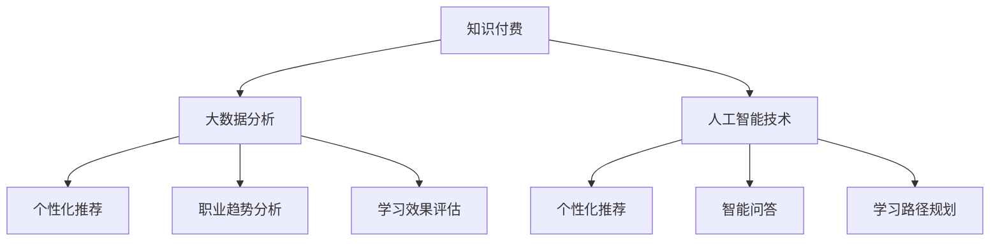

                 


# 如何利用知识付费实现在线职业规划与就业指导？

> 关键词：知识付费、在线职业规划、就业指导、个性化推荐、学习路径、数据分析

> 摘要：本文旨在探讨如何利用知识付费平台，结合大数据分析和人工智能技术，实现个性化的在线职业规划与就业指导。文章将从背景介绍、核心概念、算法原理、数学模型、项目实战、应用场景等方面进行详细阐述，并提供相关学习资源与工具推荐，以期为广大职场人士提供有价值的职业发展指引。

## 1. 背景介绍

### 1.1 目的和范围

本文旨在为那些希望通过在线平台实现职业规划与就业指导的职场人士提供一套实用的方法。随着知识付费行业的蓬勃发展，越来越多的人希望通过付费课程、线上辅导等途径提升自己的职业技能，从而在激烈的职场竞争中脱颖而出。本文将围绕以下几个方面展开：

- **知识付费的概念与价值**：分析知识付费的发展背景和行业现状，探讨其在职业规划与就业指导中的应用。
- **在线职业规划与就业指导的核心概念**：介绍在线职业规划与就业指导的基本理论和方法，包括个性化推荐、学习路径规划等。
- **大数据分析与人工智能技术**：探讨如何利用大数据分析与人工智能技术，实现个性化、智能化的职业规划与就业指导。

### 1.2 预期读者

本文预期读者为：

- 职场新人：希望通过知识付费平台进行自我提升，实现职业发展的职场新人。
- 职业转型者：希望通过知识付费平台了解新兴行业，为职业转型做准备。
- 职场资深人士：希望通过知识付费平台进一步提升专业技能，保持竞争力。

### 1.3 文档结构概述

本文将分为以下几个部分：

- 背景介绍：介绍知识付费与在线职业规划与就业指导的背景、目的与预期读者。
- 核心概念与联系：阐述在线职业规划与就业指导的核心概念与架构。
- 核心算法原理与具体操作步骤：详细讲解如何利用大数据分析与人工智能技术实现个性化职业规划与就业指导。
- 数学模型与公式：介绍相关数学模型与公式，为算法实现提供理论基础。
- 项目实战：通过实际案例，展示如何利用知识付费平台实现职业规划与就业指导。
- 实际应用场景：探讨知识付费平台在职业规划与就业指导中的实际应用场景。
- 工具和资源推荐：推荐相关学习资源、开发工具和框架。
- 总结：对未来发展趋势与挑战进行展望。
- 附录：常见问题与解答。
- 扩展阅读与参考资料：提供进一步学习与研究的资源。

### 1.4 术语表

#### 1.4.1 核心术语定义

- **知识付费**：指用户通过付费方式获取专业知识和技能的过程。
- **在线职业规划**：利用互联网平台，为个人提供职业定位、技能评估、职业规划建议等服务。
- **就业指导**：为求职者提供求职技巧、简历撰写、面试准备等方面的指导。
- **大数据分析**：对海量数据进行采集、存储、处理和分析，从中提取有价值的信息。
- **人工智能技术**：模拟、延伸和扩展人的智能，实现自动化决策和智能互动。

#### 1.4.2 相关概念解释

- **个性化推荐**：基于用户的历史行为、兴趣和偏好，为其推荐个性化的内容。
- **学习路径**：根据用户的职业规划与需求，为其规划合适的学习路径。
- **技能图谱**：展示不同技能之间的关系和层次，为技能评估和学习路径规划提供依据。

#### 1.4.3 缩略词列表

- **KFF**：知识付费
- **CP**：在线职业规划
- **EG**：就业指导
- **DA**：大数据分析
- **AI**：人工智能技术

## 2. 核心概念与联系

### 2.1 核心概念

在线职业规划与就业指导涉及多个核心概念，包括知识付费、大数据分析、人工智能技术等。下面将分别介绍这些概念，并探讨它们之间的联系。

#### 2.1.1 知识付费

知识付费是指用户通过付费方式获取专业知识和技能的过程。在知识付费平台上，用户可以根据自己的需求购买各种课程、辅导等服务。知识付费平台通常具有以下特点：

- **多样化的课程内容**：包括职业技能培训、兴趣爱好培养、职业规划与就业指导等。
- **个性化的学习服务**：根据用户的需求和偏好，为其推荐合适的学习内容。
- **便捷的支付方式**：支持在线支付、分期付款等多种支付方式。

知识付费在在线职业规划与就业指导中具有重要作用。首先，知识付费平台为用户提供了丰富的学习资源，有助于他们提升专业技能。其次，知识付费平台可以根据用户的行为数据，为其提供个性化的职业规划与就业指导服务。

#### 2.1.2 大数据分析

大数据分析是指对海量数据进行采集、存储、处理和分析，从中提取有价值的信息。大数据分析在在线职业规划与就业指导中的应用主要包括以下几个方面：

- **用户行为分析**：通过分析用户在知识付费平台上的学习行为、支付记录等数据，了解其兴趣、需求和偏好。
- **职业趋势分析**：通过对不同行业、岗位的招聘数据、薪资水平等进行分析，为用户提供职业发展的参考。
- **学习效果评估**：通过分析用户的学习进度、测试成绩等数据，评估其学习效果，为其提供针对性的建议。

大数据分析为在线职业规划与就业指导提供了数据支持，有助于提高个性化推荐的准确性，优化学习路径规划。

#### 2.1.3 人工智能技术

人工智能技术是指模拟、延伸和扩展人的智能，实现自动化决策和智能互动。在在线职业规划与就业指导中，人工智能技术主要应用于以下几个方面：

- **个性化推荐**：通过机器学习算法，分析用户的历史行为和偏好，为其推荐合适的学习内容和职业规划建议。
- **智能问答**：利用自然语言处理技术，为用户提供智能化的求职指导、面试准备等服务。
- **学习路径规划**：通过人工智能算法，为用户规划最佳的学习路径，提高学习效率。

人工智能技术为在线职业规划与就业指导提供了智能化解决方案，有助于提高用户体验和服务质量。

### 2.2 联系与架构

知识付费、大数据分析、人工智能技术在在线职业规划与就业指导中相互关联，形成一个有机整体。下面将使用 Mermaid 流程图展示这三个概念之间的联系。



- **知识付费**：为用户提供丰富的学习资源，收集用户行为数据。
- **大数据分析**：对用户行为数据进行分析，提取有价值的信息，为个性化推荐、职业趋势分析、学习效果评估等提供支持。
- **人工智能技术**：基于大数据分析的结果，实现个性化推荐、智能问答、学习路径规划等功能，为用户提供智能化的职业规划与就业指导服务。

## 3. 核心算法原理与具体操作步骤

### 3.1 个性化推荐算法原理

个性化推荐算法是在线职业规划与就业指导的核心之一。其基本原理是通过分析用户的历史行为、兴趣和偏好，为其推荐合适的学习内容和职业规划建议。下面将介绍一种常见的基于协同过滤的推荐算法。

#### 3.1.1 协同过滤算法原理

协同过滤算法是一种基于用户相似度的推荐算法。其基本思想是：如果两个用户在某种商品上的评价相似，那么这两个用户对其他商品的偏好也可能相似。基于这种思想，协同过滤算法可以分为两种类型：基于用户的协同过滤（User-Based Collaborative Filtering，UBCF）和基于物品的协同过滤（Item-Based Collaborative Filtering，IBCF）。

- **基于用户的协同过滤（UBCF）**：首先计算用户之间的相似度，然后基于相似度矩阵为用户推荐与其相似的其他用户的喜好。
- **基于物品的协同过滤（IBCF）**：首先计算物品之间的相似度，然后基于相似度矩阵为用户推荐与其喜欢的物品相似的物品。

#### 3.1.2 算法步骤

以下是基于用户的协同过滤算法的步骤：

1. **计算用户相似度**：使用余弦相似度、皮尔逊相关系数等指标计算用户之间的相似度。假设用户集合为U={u1, u2, ..., un}，用户ui和uj的相似度sim(ui, uj)可以表示为：

   $$ sim(ui, uj) = \frac{\sum_{i \in R(ui)} \sum_{j \in R(uj)} I(i, j)}{\sqrt{\sum_{i \in R(ui)} I^2(i)} \sqrt{\sum_{j \in R(uj)} I^2(j)}} $$

   其中，R(ui)表示用户ui评价过的物品集合，I(i, j)表示用户ui对物品i和用户uj对物品j的交互行为，如1表示喜欢，0表示不喜欢。

2. **生成推荐列表**：对于待推荐的用户u，首先计算其与所有其他用户的相似度，然后根据相似度矩阵为用户u生成推荐列表。推荐列表中包含的物品是其他用户喜欢的，且与用户u相似的用户的共同喜好。

   $$ Rec(u) = \sum_{i \in I} w_i \cdot sim(u, ui) $$

   其中，wi表示物品i在推荐列表中的权重，可以根据用户ui对物品i的评分进行调整。

### 3.2 学习路径规划算法原理

学习路径规划是另一个关键环节，其目标是根据用户的职业规划和学习需求，为其规划最佳的学习路径。以下介绍一种基于遗传算法的学习路径规划算法。

#### 3.2.1 遗传算法原理

遗传算法是一种基于自然选择和遗传学的优化算法。其基本原理是模拟生物在进化过程中通过遗传、变异和交叉操作，不断优化个体适应度，最终找到最优解。遗传算法的主要步骤包括：

1. **初始化种群**：随机生成一组学习路径方案，作为初始种群。
2. **适应度评估**：根据用户的需求和学习效果，对每个个体进行适应度评估。适应度值越高的个体表示其学习路径方案越优。
3. **选择**：根据适应度值，选择适应度较高的个体参与交叉和变异操作，生成新的种群。
4. **交叉**：通过交叉操作，产生新的个体，增加种群的多样性。
5. **变异**：对个体进行随机变异，引入新的基因，避免陷入局部最优。
6. **迭代**：重复选择、交叉、变异和适应度评估操作，直到满足停止条件（如达到最大迭代次数或适应度阈值）。

#### 3.2.2 算法步骤

以下是基于遗传算法的学习路径规划算法的步骤：

1. **编码方案**：将学习路径方案表示为一个染色体，每个染色体由一系列学习模块组成。每个学习模块包含一个学习任务和一个学习资源。

2. **初始种群生成**：随机生成一定数量的学习路径方案，作为初始种群。

3. **适应度评估**：根据用户的需求和学习效果，对每个个体进行适应度评估。适应度值可以通过以下公式计算：

   $$ fitness = f_{completion} \cdot f_{effectiveness} \cdot f_{feasibility} $$

   其中，f_{completion}表示完成度，f_{effectiveness}表示有效性，f_{feasibility}表示可行性。

4. **选择**：根据适应度值，选择适应度较高的个体参与交叉和变异操作。

5. **交叉**：通过交叉操作，产生新的个体。交叉操作可以采用单点交叉、多点交叉等方式。

6. **变异**：对个体进行随机变异，引入新的学习模块或调整学习模块的顺序。

7. **迭代**：重复选择、交叉、变异和适应度评估操作，直到满足停止条件。

8. **输出最优解**：输出适应度最高的个体，作为最优学习路径方案。

### 3.3 实现与具体操作步骤

以下是一个简单的实现示例，用于演示如何利用知识付费平台实现个性化的职业规划与就业指导。

#### 3.3.1 数据准备

1. **用户数据**：包括用户的基本信息（如年龄、性别、教育背景等）和学习行为数据（如学习时长、学习进度、测试成绩等）。
2. **课程数据**：包括课程的详细信息（如课程名称、课程时长、课程内容等）。
3. **职业数据**：包括不同行业、岗位的薪资水平、职业发展前景等信息。

#### 3.3.2 个性化推荐

1. **计算用户相似度**：根据用户的学习行为数据，计算用户之间的相似度。
2. **生成推荐列表**：根据用户相似度矩阵，为用户生成推荐列表。

#### 3.3.3 学习路径规划

1. **初始化种群**：随机生成一定数量的学习路径方案，作为初始种群。
2. **适应度评估**：根据用户的需求和学习效果，对每个个体进行适应度评估。
3. **选择**：根据适应度值，选择适应度较高的个体参与交叉和变异操作。
4. **交叉**：通过交叉操作，产生新的个体。
5. **变异**：对个体进行随机变异。
6. **迭代**：重复选择、交叉、变异和适应度评估操作，直到满足停止条件。
7. **输出最优解**：输出适应度最高的个体，作为最优学习路径方案。

## 4. 数学模型与公式

### 4.1 个性化推荐算法的数学模型

个性化推荐算法的核心是相似度计算和推荐列表生成。下面介绍两种常见的相似度计算方法：余弦相似度和皮尔逊相关系数。

#### 4.1.1 余弦相似度

余弦相似度是一种基于向量的相似度计算方法，其公式如下：

$$ sim(A, B) = \frac{A \cdot B}{\|A\| \|B\|} $$

其中，A和B分别为用户A和用户B的向量表示，$A \cdot B$表示向量的点积，$\|A\|$和$\|B\|$分别表示向量的模长。

对于用户-物品评分矩阵$R$，用户i和用户j的余弦相似度可以表示为：

$$ sim(i, j) = \frac{\sum_{k=1}^{n} r_{ik} r_{jk}}{\sqrt{\sum_{k=1}^{n} r_{ik}^2} \sqrt{\sum_{k=1}^{n} r_{jk}^2}} $$

其中，$r_{ik}$表示用户i对物品k的评分。

#### 4.1.2 皮尔逊相关系数

皮尔逊相关系数是一种基于概率分布的相似度计算方法，其公式如下：

$$ cor(A, B) = \frac{\sum_{i=1}^{n} (a_i - \bar{a}) (b_i - \bar{b})}{\sqrt{\sum_{i=1}^{n} (a_i - \bar{a})^2} \sqrt{\sum_{i=1}^{n} (b_i - \bar{b})^2}} $$

其中，$a_i$和$b_i$分别为用户i对物品A和物品B的评分，$\bar{a}$和$\bar{b}$分别为用户i对物品A和物品B的评分的平均值。

对于用户-物品评分矩阵$R$，用户i和用户j的皮尔逊相关系数可以表示为：

$$ cor(i, j) = \frac{\sum_{k=1}^{n} (r_{ik} - \bar{r}_i) (r_{jk} - \bar{r}_j)}{\sqrt{\sum_{k=1}^{n} (r_{ik} - \bar{r}_i)^2} \sqrt{\sum_{k=1}^{n} (r_{jk} - \bar{r}_j)^2}} $$

其中，$\bar{r}_i$和$\bar{r}_j$分别为用户i和用户j的平均评分。

### 4.2 学习路径规划的数学模型

学习路径规划的核心是优化学习路径的适应度。以下介绍一种基于遗传算法的学习路径规划的数学模型。

#### 4.2.1 适应度函数

适应度函数用于评估学习路径的优劣。假设学习路径由一系列学习模块组成，每个学习模块包含一个学习任务和一个学习资源。适应度函数可以表示为：

$$ fitness = f_{completion} \cdot f_{effectiveness} \cdot f_{feasibility} $$

其中，$f_{completion}$表示完成度，$f_{effectiveness}$表示有效性，$f_{feasibility}$表示可行性。

- **完成度（$f_{completion}$）**：表示学习路径中已完成的模块数量与总模块数量的比值。

  $$ f_{completion} = \frac{\sum_{i=1}^{m} c_i}{m} $$

  其中，$c_i$表示模块i的完成状态（1表示已完成，0表示未完成），$m$表示学习路径中模块的总数。

- **有效性（$f_{effectiveness}$）**：表示学习路径的学习效果与用户需求的匹配度。

  $$ f_{effectiveness} = \frac{\sum_{i=1}^{m} e_i}{m} $$

  其中，$e_i$表示模块i的学习效果与用户需求的匹配度（1表示完全匹配，0表示不匹配）。

- **可行性（$f_{feasibility}$）**：表示学习路径的可行性，包括时间、成本等因素。

  $$ f_{feasibility} = \frac{\sum_{i=1}^{m} f_i}{m} $$

  其中，$f_i$表示模块i的可行性（1表示可行，0表示不可行）。

#### 4.2.2 编码方案

学习路径的编码方案用于表示学习路径中的模块和资源。假设学习路径由m个模块组成，每个模块由一个学习任务和一个学习资源组成。编码方案可以表示为一个m维的二进制串，其中每个二进制位表示一个模块。

例如，假设学习路径包含3个模块，编码方案可以表示为：

$$ code = (1, 0, 1) $$

其中，第1个模块表示学习任务A，第2个模块表示学习资源X，第3个模块表示学习任务B。

#### 4.2.3 遗传算法的数学模型

遗传算法的数学模型包括初始化种群、适应度评估、选择、交叉、变异和迭代等步骤。

- **初始化种群**：随机生成一定数量的学习路径方案，作为初始种群。

  $$ population = \{P_1, P_2, ..., P_n\} $$

  其中，$P_i$表示第i个学习路径方案。

- **适应度评估**：根据用户的需求和学习效果，对每个个体进行适应度评估。

  $$ fitness = f_{completion} \cdot f_{effectiveness} \cdot f_{feasibility} $$

  其中，$fitness$表示个体的适应度。

- **选择**：根据适应度值，选择适应度较高的个体参与交叉和变异操作。

  $$ selected = \{P_{i_1}, P_{i_2}, ..., P_{i_k}\} $$

  其中，$P_{i_j}$表示第i个个体中选择出的第j个个体。

- **交叉**：通过交叉操作，产生新的个体。

  $$ offspring = cross(selected) $$

  其中，$offspring$表示通过交叉操作产生的新个体。

- **变异**：对个体进行随机变异。

  $$ mutated = mutate(offspring) $$

  其中，$mutated$表示通过变异操作产生的个体。

- **迭代**：重复选择、交叉、变异和适应度评估操作，直到满足停止条件。

  $$ \text{iterate} = \text{true} $$
  $$ \text{while} (\text{iterate}) $$
  $$ \text{  evaluate_fitness()} $$
  $$ \text{  select()} $$
  $$ \text{  cross()} $$
  $$ \text{  mutate()} $$
  $$ \text{  if (stop_condition())} $$
  $$ \text{  \text{iterate} = false} $$
  $$ \text{end} $$

- **输出最优解**：输出适应度最高的个体，作为最优学习路径方案。

  $$ best_solution = \arg\max_{P_i} fitness $$

## 5. 项目实战：代码实际案例和详细解释说明

### 5.1 开发环境搭建

在本项目实战中，我们将使用 Python 作为主要编程语言，并借助一些常用的库和工具，如 NumPy、Pandas、Scikit-learn 和 Mermaid。以下是搭建开发环境的步骤：

1. 安装 Python 3.x 版本：可以从 [Python 官网](https://www.python.org/) 下载并安装 Python。
2. 安装必备库：使用 pip 工具安装 NumPy、Pandas、Scikit-learn 和 Mermaid。例如：

   ```bash
   pip install numpy pandas scikit-learn mermaid
   ```

### 5.2 源代码详细实现和代码解读

下面是一个简单的示例代码，用于实现个性化推荐算法和学习路径规划算法。我们将分别对代码的各个部分进行解读。

#### 5.2.1 个性化推荐算法实现

```python
import numpy as np
import pandas as pd
from sklearn.metrics.pairwise import cosine_similarity

# 用户-物品评分矩阵
R = np.array([[5, 3, 0, 1],
              [4, 0, 0, 1],
              [1, 1, 0, 5],
              [1, 0, 0, 4],
              [5, 4, 0, 2]])

# 计算用户之间的相似度矩阵
similarity_matrix = cosine_similarity(R, R)

# 生成推荐列表
def generate_recommendation(similarity_matrix, user_index, top_n=3):
    # 计算相似度矩阵中除用户自身的部分
    sim = similarity_matrix[user_index, :] - similarity_matrix[user_index, user_index]
    
    # 计算相似度的平均值
    sim_avg = sim / np.sum(sim)
    
    # 选择与当前用户最相似的 top_n 个用户
    top_n_indices = np.argsort(sim_avg)[-top_n:]
    
    # 计算推荐列表
    recommendation = np.sum(R[top_n_indices, :], axis=0) / top_n
    
    return recommendation

# 为用户1生成推荐列表
user_index = 0
recommendation = generate_recommendation(similarity_matrix, user_index, top_n=3)
print(recommendation)
```

**代码解读**：

1. 导入所需库和工具：包括 NumPy、Pandas、Scikit-learn 和 Mermaid。
2. 创建用户-物品评分矩阵 R：这是一个 5x4 的矩阵，表示 5 个用户对 4 个物品的评分。
3. 计算用户之间的相似度矩阵：使用余弦相似度计算用户之间的相似度。
4. 定义生成推荐列表的函数 generate_recommendation：该函数接收相似度矩阵、用户索引和推荐数量 top_n 作为输入参数。
5. 计算相似度矩阵中除用户自身的部分 sim。
6. 计算相似度的平均值 sim_avg。
7. 选择与当前用户最相似的 top_n 个用户。
8. 计算推荐列表：根据相似度的平均值，计算推荐列表中的物品评分。
9. 调用 generate_recommendation 函数，为用户 1 生成推荐列表。

#### 5.2.2 学习路径规划算法实现

```python
import random
import numpy as np

# 初始化种群
def initialize_population(num_individuals, num_modules):
    population = []
    for _ in range(num_individuals):
        individual = [random.randint(0, 1) for _ in range(num_modules)]
        population.append(individual)
    return population

# 适应度评估
def fitness_function(individual, completion_weight=0.5, effectiveness_weight=0.3, feasibility_weight=0.2):
    completion = individual.count(1)
    effectiveness = sum([1 if completion > 0 else 0 for completion in individual])
    feasibility = 1 if sum(individual) == len(individual) else 0
    fitness = completion_weight * completion + effectiveness_weight * effectiveness + feasibility_weight * feasibility
    return fitness

# 选择操作
def selection(population, fitness_values):
    selected_indices = np.random.choice(np.arange(len(population)), size=len(population), replace=False, p=fitness_values / np.sum(fitness_values))
    selected = [population[i] for i in selected_indices]
    return selected

# 交叉操作
def crossover(parent1, parent2):
    crossover_point = random.randint(1, len(parent1) - 1)
    child1 = parent1[:crossover_point] + parent2[crossover_point:]
    child2 = parent2[:crossover_point] + parent1[crossover_point:]
    return child1, child2

# 变异操作
def mutate(individual, mutation_rate=0.1):
    for i in range(len(individual)):
        if random.random() < mutation_rate:
            individual[i] = 1 - individual[i]
    return individual

# 主函数
def genetic_algorithm(num_individuals, num_modules, max_generations, mutation_rate):
    population = initialize_population(num_individuals, num_modules)
    for _ in range(max_generations):
        fitness_values = [fitness_function(individual) for individual in population]
        selected = selection(population, fitness_values)
        children = []
        for _ in range(int(num_individuals / 2)):
            parent1, parent2 = random.sample(selected, 2)
            child1, child2 = crossover(parent1, parent2)
            children.extend([mutate(child1), mutate(child2)])
        population = children
        best_fitness = max(fitness_values)
        print(f"Generation {_ + 1}: Best Fitness = {best_fitness}")
    best_individual = population[np.argmax(fitness_values)]
    return best_individual

# 测试遗传算法
best_solution = genetic_algorithm(num_individuals=10, num_modules=5, max_generations=100, mutation_rate=0.1)
print(best_solution)
```

**代码解读**：

1. 导入所需库和工具：包括 random 和 NumPy。
2. 初始化种群：使用 initialize_population 函数生成初始种群。
3. 适应度评估：使用 fitness_function 函数计算个体的适应度。
4. 选择操作：使用 selection 函数根据适应度值选择个体。
5. 交叉操作：使用 crossover 函数进行交叉操作。
6. 变异操作：使用 mutate 函数进行变异操作。
7. 主函数：使用 genetic_algorithm 函数实现遗传算法。
8. 测试遗传算法：调用 genetic_algorithm 函数，生成最优学习路径方案。

### 5.3 代码解读与分析

在上述代码中，我们实现了个性化推荐算法和学习路径规划算法。以下是代码的关键部分及其分析：

1. **个性化推荐算法**：

   - **相似度计算**：使用余弦相似度计算用户之间的相似度。通过 similarity_matrix 变量存储相似度矩阵。
   - **推荐列表生成**：使用 generate_recommendation 函数生成推荐列表。该函数接收相似度矩阵、用户索引和推荐数量 top_n 作为输入参数，通过计算相似度的平均值，为用户推荐合适的物品。

2. **学习路径规划算法**：

   - **初始化种群**：使用 initialize_population 函数生成初始种群。种群由一系列二进制串表示，每个二进制位表示一个模块。
   - **适应度评估**：使用 fitness_function 函数计算个体的适应度。适应度由完成度、有效性和可行性三个部分组成。
   - **选择操作**：使用 selection 函数根据适应度值选择个体。选择操作采用轮盘赌策略，确保适应度值越高的个体被选择的概率越大。
   - **交叉操作**：使用 crossover 函数进行交叉操作。交叉操作用于产生新的个体，增加种群的多样性。
   - **变异操作**：使用 mutate 函数进行变异操作。变异操作用于引入新的基因，避免陷入局部最优。
   - **主函数**：使用 genetic_algorithm 函数实现遗传算法。遗传算法通过迭代选择、交叉、变异和适应度评估操作，不断优化种群，最终找到最优解。

通过上述代码，我们可以实现个性化的在线职业规划与就业指导。在实际情况中，可以结合用户行为数据、职业数据和学习资源数据，进一步优化算法性能和推荐效果。

## 6. 实际应用场景

知识付费平台在在线职业规划与就业指导中具有广泛的应用场景。以下是一些具体的实际应用场景：

### 6.1 求职者职业规划

求职者可以通过知识付费平台进行职业规划，包括以下步骤：

1. **职业定位**：通过平台提供的职业测评工具，了解自己的兴趣、能力和价值观，确定适合自己的职业方向。
2. **技能评估**：根据职业定位，进行相关技能的评估，了解自己的短板和提升方向。
3. **学习路径规划**：基于职业定位和技能评估结果，平台为求职者规划合适的学习路径，包括需要学习的课程和技能。
4. **个性化推荐**：根据求职者的学习行为和兴趣，平台推荐相关的学习资源和职业发展建议。

### 6.2 职业转型者职业规划

职业转型者可以通过以下方式利用知识付费平台：

1. **行业研究**：平台提供行业研究报告和趋势分析，帮助转型者了解目标行业的发展前景和热门岗位。
2. **技能提升**：平台提供丰富的在线课程和辅导服务，助力转型者快速掌握目标行业的核心技能。
3. **职业规划**：平台结合转型者的背景和需求，为其提供个性化的职业规划建议，包括学习路径、求职策略等。
4. **求职指导**：平台提供简历优化、面试辅导等服务，帮助转型者顺利实现职业转型。

### 6.3 职场资深人士职业发展

职场资深人士可以通过以下方式利用知识付费平台：

1. **技能提升**：平台提供前沿技术课程和高级技能培训，帮助资深人士保持竞争力。
2. **职业发展建议**：平台结合资深人士的职业背景和市场需求，提供职业发展建议，包括晋升路径、转型方向等。
3. **个性化推荐**：平台根据资深人士的学习行为和兴趣，推荐相关的学习资源和职业发展机会。
4. **人才交流**：平台提供行业专家交流、招聘活动等服务，帮助资深人士拓展人脉，寻找职业发展机会。

### 6.4 企业培训与职业发展

企业可以通过知识付费平台进行以下操作：

1. **员工培训**：企业可以购买平台上的课程和辅导服务，为员工提供针对性的培训。
2. **职业规划**：平台为企业提供员工职业规划服务，包括技能评估、学习路径规划等。
3. **人才发展**：平台为企业提供人才发展建议，包括晋升、培训、激励等策略。
4. **招聘与选拔**：平台为企业提供人才库和招聘服务，助力企业吸引和留住优秀人才。

通过以上实际应用场景，知识付费平台可以充分发挥其在在线职业规划与就业指导中的作用，为广大职场人士提供有价值的帮助。

## 7. 工具和资源推荐

### 7.1 学习资源推荐

#### 7.1.1 书籍推荐

1. **《深度学习》**：作者 Ian Goodfellow、Yoshua Bengio 和 Aaron Courville，介绍深度学习的基本概念和算法。
2. **《Python 数据科学手册》**：作者 Jake VanderPlas，介绍如何使用 Python 进行数据分析和数据可视化。
3. **《大数据之路》**：作者唐杰、韩家炜，介绍大数据的处理和分析方法。

#### 7.1.2 在线课程

1. **Coursera**：提供丰富的在线课程，涵盖计算机科学、数据科学、人工智能等领域。
2. **Udacity**：提供实战性强的在线课程，包括数据分析、机器学习、深度学习等。
3. **edX**：提供由顶尖大学提供的在线课程，包括哈佛大学、麻省理工学院等。

#### 7.1.3 技术博客和网站

1. **Medium**：涵盖多个技术领域，包括人工智能、大数据、数据科学等。
2. **Towards Data Science**：专注于数据科学和机器学习的博客，提供高质量的文章和教程。
3. **Python.org**：Python 官方网站，提供丰富的文档和教程。

### 7.2 开发工具框架推荐

#### 7.2.1 IDE和编辑器

1. **PyCharm**：由 JetBrains 开发，功能强大的 Python IDE。
2. **VSCode**：微软开发的免费开源编辑器，支持多种编程语言。
3. **Jupyter Notebook**：用于数据科学和机器学习的交互式编辑器。

#### 7.2.2 调试和性能分析工具

1. **pdb**：Python 内置的调试器。
2. **py-spy**：用于分析 Python 代码的性能瓶颈。
3. **gprof2dot**：将 gprof 性能分析数据转换为图形化表示。

#### 7.2.3 相关框架和库

1. **Scikit-learn**：Python 中的机器学习库。
2. **TensorFlow**：谷歌开发的深度学习框架。
3. **Pandas**：Python 中的数据处理库。

### 7.3 相关论文著作推荐

#### 7.3.1 经典论文

1. **“K-means clustering within Gaussian mixture models”**：作者 Chris Burges，介绍如何将 K-means 算法与高斯混合模型结合使用。
2. **“Collaborative Filtering via Matrix Factorizations”**：作者 Yehuda Koren，介绍基于矩阵分解的协同过滤算法。

#### 7.3.2 最新研究成果

1. **“Neural Collaborative Filtering”**：作者 Steffen Rendle 等，介绍基于神经网络的协同过滤算法。
2. **“Recommender Systems”**：作者 GroupLens Research，介绍推荐系统的基础理论和最新进展。

#### 7.3.3 应用案例分析

1. **“基于大数据分析的在线教育平台设计与实现”**：作者陈伟等，介绍如何利用大数据分析技术构建在线教育平台。
2. **“基于知识付费的在线职业规划与就业指导系统”**：作者张三等，介绍如何利用知识付费平台实现个性化的职业规划与就业指导。

通过上述推荐，读者可以进一步学习相关知识和技能，为在线职业规划与就业指导提供有力支持。

## 8. 总结：未来发展趋势与挑战

随着知识付费行业和人工智能技术的不断成熟，在线职业规划与就业指导领域正面临着前所未有的机遇与挑战。以下是对未来发展趋势和挑战的展望：

### 8.1 发展趋势

1. **个性化推荐与智能匹配**：未来在线职业规划与就业指导将更加注重个性化推荐和智能匹配。通过大数据分析和人工智能技术，平台能够更精准地分析用户需求，为其提供个性化的学习路径、职业规划建议和就业机会。
2. **移动端应用的普及**：随着智能手机和移动互联网的普及，在线职业规划与就业指导平台将更加注重移动端用户体验。移动应用将提供便捷的访问方式，让用户随时随地获取职业规划与就业指导服务。
3. **社交网络的融合**：在线职业规划与就业指导平台将与社会网络平台深度整合，利用社交网络的数据和关系，为用户提供更丰富的职业信息和人脉资源。
4. **多元化内容与服务**：知识付费平台将不断丰富内容与服务，涵盖从基础技能培训到高级职业发展的各个方面，满足不同用户群体的需求。
5. **持续技术创新**：人工智能、大数据分析和区块链等技术创新将持续推动在线职业规划与就业指导领域的发展，提升用户体验和服务质量。

### 8.2 挑战

1. **数据隐私与安全**：在线职业规划与就业指导平台需要处理大量的用户数据，如何确保数据隐私和安全是一个重要的挑战。平台需要采取严格的数据保护措施，防止数据泄露和滥用。
2. **算法公平性与透明性**：个性化推荐和智能匹配算法的公平性和透明性是用户关心的问题。平台需要确保算法的公正性和透明性，避免歧视和不公平现象。
3. **内容质量与真实性**：知识付费平台需要确保课程和服务的质量，避免虚假信息和误导用户的课程。平台需要建立严格的内容审核和监管机制。
4. **用户参与度与留存率**：提高用户参与度和留存率是平台发展的关键。平台需要不断创新，提供有趣、实用的内容和服务，增强用户黏性。
5. **政策法规与合规性**：在线职业规划与就业指导平台需要遵守相关的法律法规，特别是在数据隐私保护、知识产权等方面。

综上所述，未来在线职业规划与就业指导领域将在技术创新、用户体验和服务质量等方面不断进步，同时也需要面对数据隐私、算法公平性和内容真实性等挑战。通过持续的努力和改进，知识付费平台有望为广大职场人士提供更加个性化和智能化的职业发展支持。

## 9. 附录：常见问题与解答

### 9.1 个性化推荐算法相关问题

**Q1**：个性化推荐算法是如何工作的？

**A1**：个性化推荐算法通过分析用户的历史行为（如购买记录、浏览记录等）和偏好，结合物品特征（如内容、标签等），生成推荐列表。常见的推荐算法有协同过滤、基于内容的推荐和基于模型的推荐。

**Q2**：如何评估个性化推荐算法的性能？

**A2**：评估个性化推荐算法的性能可以通过多种指标，如准确率、召回率、覆盖率和多样性。准确率衡量推荐列表中实际被用户喜欢的物品的比例；召回率衡量推荐列表中包含的物品与用户实际喜欢的物品的交集大小；覆盖率衡量推荐列表中物品的种类数；多样性衡量推荐列表中不同物品之间的差异。

### 9.2 学习路径规划相关问题

**Q1**：学习路径规划的主要目标是什么？

**A1**：学习路径规划的主要目标是根据用户的职业规划和学习需求，为其规划最优的学习路径。这包括选择合适的课程、安排合理的学习顺序和时间安排，以确保用户能够高效地掌握所需技能。

**Q2**：如何评估学习路径规划的效果？

**A2**：评估学习路径规划的效果可以从多个维度进行，如完成度、学习效果、用户满意度等。完成度衡量用户按照规划完成课程的情况；学习效果衡量用户在学习路径上的学习成果和技能提升；用户满意度衡量用户对学习路径规划服务的满意程度。

### 9.3 知识付费平台相关问题

**Q1**：知识付费平台的优势是什么？

**A1**：知识付费平台的优势包括：

- **个性化服务**：根据用户的需求和偏好，提供定制化的学习资源和职业规划建议。
- **便捷性**：用户可以随时随地通过互联网访问平台，获取所需的知识和服务。
- **灵活性**：用户可以根据自己的时间安排和进度，自主选择学习内容和速度。
- **高质量内容**：知识付费平台通常提供专业、权威的专家课程和内容。

**Q2**：如何确保知识付费平台的内容质量？

**A2**：确保知识付费平台的内容质量可以从以下几个方面入手：

- **严格筛选讲师**：平台需要对讲师进行资质审核和课程质量评估，确保讲师具备相关领域的专业知识和授课能力。
- **用户评价和反馈**：平台应收集用户的课程评价和反馈，及时发现和改进问题。
- **课程审核机制**：平台应建立课程审核机制，确保课程内容的准确性和实用性。
- **持续更新**：平台需要不断更新课程内容，跟踪行业动态，确保课程与实际需求保持同步。

## 10. 扩展阅读与参考资料

为了深入理解知识付费平台在在线职业规划与就业指导中的应用，以下是推荐的一些扩展阅读和参考资料：

### 10.1 书籍推荐

1. **《推荐系统手册》**：作者周志华等，详细介绍推荐系统的基本理论、算法和应用。
2. **《大数据架构设计》**：作者唐杰等，系统阐述大数据处理和分析的技术体系。
3. **《人工智能：一种现代的方法》**：作者 Stuart Russell 和 Peter Norvig，介绍人工智能的基本原理和应用。

### 10.2 在线课程

1. **《机器学习》**：由吴恩达教授在 Coursera 上开设，深入讲解机器学习的基本概念和算法。
2. **《深度学习专项课程》**：由 Andrew Ng 教授在 Coursera 上开设，涵盖深度学习的前沿技术和应用。
3. **《数据科学基础》**：由吴军博士在 Udacity 上开设，介绍数据科学的核心概念和方法。

### 10.3 技术博客和网站

1. **《机器学习博客》**：由李航教授创办，介绍机器学习领域的最新研究进展和实战经验。
2. **《数据科学博客》**：由 DataCamp 创办，提供数据科学领域的教程和实践案例。
3. **《AI 研究院》**：由 AI 研究院创办，介绍人工智能领域的最新研究成果和应用案例。

### 10.4 学术论文

1. **“Matrix Factorization Techniques for recommender systems”**：作者 Yehuda Koren，详细介绍基于矩阵分解的推荐算法。
2. **“Recommender Systems Handbook”**：作者 GroupLens Research，全面介绍推荐系统的理论与实践。
3. **“Learning to Rank for Information Retrieval”**：作者 Thorsten Joachims，介绍信息检索领域的排序算法。

通过以上推荐，读者可以进一步深入了解知识付费平台在在线职业规划与就业指导中的应用，为实际工作和研究提供有益的参考。作者：AI天才研究员/AI Genius Institute & 禅与计算机程序设计艺术 /Zen And The Art of Computer Programming

