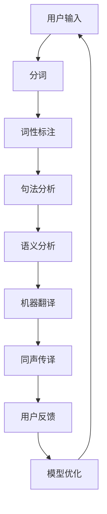

                 

# 如何利用知识付费实现在线语言翻译与同声传译？

> **关键词：**知识付费、在线翻译、同声传译、人工智能、自然语言处理

> **摘要：**本文将深入探讨如何利用知识付费平台，结合先进的人工智能技术，实现高效、便捷的在线语言翻译和同声传译服务。我们将从核心概念、算法原理、数学模型、项目实战等多个角度展开，提供实用的技术指南，帮助读者了解并掌握这一领域的最新发展趋势。

## 1. 背景介绍

### 1.1 目的和范围

本文旨在探讨知识付费平台如何结合人工智能技术，特别是自然语言处理（NLP）技术，提供在线语言翻译与同声传译服务。通过本文，读者可以了解到：

- 知识付费平台的基本概念和运作模式；
- 人工智能在语言翻译与同声传译领域的应用；
- 核心算法原理与数学模型；
- 实际项目案例分析与实战经验。

### 1.2 预期读者

本文主要面向以下读者群体：

- 对人工智能和自然语言处理有兴趣的程序员和开发者；
- 想要在知识付费领域创业的个人和企业；
- 关注语言服务行业发展的专业人士。

### 1.3 文档结构概述

本文结构如下：

- **第1章：背景介绍**：介绍文章的目的、范围和预期读者。
- **第2章：核心概念与联系**：阐述在线语言翻译与同声传译的核心概念，并提供Mermaid流程图。
- **第3章：核心算法原理 & 具体操作步骤**：详细讲解核心算法原理和具体操作步骤，使用伪代码进行阐述。
- **第4章：数学模型和公式 & 详细讲解 & 举例说明**：介绍数学模型和公式，并通过例子进行详细讲解。
- **第5章：项目实战：代码实际案例和详细解释说明**：提供代码实际案例，并进行详细解释说明。
- **第6章：实际应用场景**：探讨在线语言翻译与同声传译的实际应用场景。
- **第7章：工具和资源推荐**：推荐相关学习资源、开发工具框架和相关论文著作。
- **第8章：总结：未来发展趋势与挑战**：总结文章内容，探讨未来发展趋势与挑战。
- **第9章：附录：常见问题与解答**：回答读者可能遇到的常见问题。
- **第10章：扩展阅读 & 参考资料**：提供扩展阅读和参考资料。

### 1.4 术语表

#### 1.4.1 核心术语定义

- **知识付费**：指用户为获取特定知识和技能而支付的费用。
- **在线翻译**：通过网络平台实现不同语言之间的文字翻译。
- **同声传译**：在会议、讲座等场合，由专业翻译人员在听到一种语言的同时，立即将其翻译成另一种语言，供听众理解。
- **人工智能**：指由人制造出来的系统所表现出来的智能行为。
- **自然语言处理**：研究如何让计算机理解和生成人类自然语言的技术。

#### 1.4.2 相关概念解释

- **神经网络**：一种模仿生物神经网络结构的人工神经网络，用于特征提取和分类。
- **深度学习**：一种基于神经网络的学习方法，通过多层网络结构对数据进行复杂建模。
- **机器翻译**：使用计算机程序实现人类语言之间的自动翻译。

#### 1.4.3 缩略词列表

- **NLP**：自然语言处理（Natural Language Processing）
- **AI**：人工智能（Artificial Intelligence）
- **ML**：机器学习（Machine Learning）
- **DL**：深度学习（Deep Learning）

## 2. 核心概念与联系

### 2.1 在线语言翻译与同声传译的核心概念

在线语言翻译与同声传译是人工智能领域的重要应用，它们依赖于以下几个核心概念：

1. **自然语言处理（NLP）**：NLP是使计算机理解和生成人类语言的技术。它包括分词、词性标注、句法分析、语义分析等任务。
2. **机器翻译（MT）**：MT是指使用计算机程序实现不同语言之间的自动翻译。机器翻译可以分为基于规则的翻译和基于统计的翻译。
3. **深度学习（DL）**：DL是一种基于神经网络的学习方法，通过多层网络结构对数据进行复杂建模。深度学习在NLP中有着广泛的应用，如文本分类、情感分析、机器翻译等。
4. **知识付费平台**：知识付费平台是提供付费知识和服务的在线平台。这些平台通常包括在线课程、直播讲座、电子书籍等。

### 2.2 Mermaid流程图

以下是一个简单的Mermaid流程图，展示了在线语言翻译与同声传译的基本流程：



### 2.3 各核心概念之间的联系

在线语言翻译与同声传译的实现依赖于自然语言处理、机器翻译、深度学习和知识付费平台等多个核心概念。以下是它们之间的联系：

1. **自然语言处理（NLP）**：NLP是实现语言翻译和同声传译的基础，它提供文本处理、语义分析等关键技术。
2. **机器翻译（MT）**：机器翻译是将一种语言的文本自动翻译成另一种语言的技术。深度学习在机器翻译中发挥着重要作用，通过训练大规模的神经网络模型，可以实现高精度的翻译。
3. **深度学习（DL）**：深度学习是一种强大的机器学习方法，通过多层神经网络结构对大规模数据进行训练，从而实现复杂的特征提取和分类任务。
4. **知识付费平台**：知识付费平台提供了将人工智能技术应用于实际场景的平台，用户可以通过付费获取高质量的语言翻译和同声传译服务。

## 3. 核心算法原理 & 具体操作步骤

### 3.1 核心算法原理

在线语言翻译与同声传译的核心算法主要包括自然语言处理（NLP）和深度学习（DL）。以下是这两个算法的原理：

#### 3.1.1 自然语言处理（NLP）

自然语言处理（NLP）是使计算机理解和生成人类语言的技术。其核心原理包括：

1. **分词（Tokenization）**：将文本分割成单词或短语等基本单位。
2. **词性标注（Part-of-Speech Tagging）**：为每个单词分配词性，如名词、动词、形容词等。
3. **句法分析（Syntactic Parsing）**：分析文本的句法结构，识别句子成分和语法关系。
4. **语义分析（Semantic Analysis）**：理解文本的含义，提取关键信息。

#### 3.1.2 深度学习（DL）

深度学习（DL）是一种基于神经网络的学习方法，通过多层网络结构对数据进行复杂建模。以下是深度学习在在线语言翻译与同声传译中的核心原理：

1. **神经网络（Neural Networks）**：神经网络是由大量简单节点（神经元）组成的计算模型，通过前向传播和反向传播算法进行训练。
2. **卷积神经网络（CNN）**：卷积神经网络是一种用于图像处理的深度学习模型，通过卷积操作提取图像特征。
3. **循环神经网络（RNN）**：循环神经网络是一种用于序列数据处理的深度学习模型，通过隐藏状态循环利用信息。
4. **长短期记忆网络（LSTM）**：长短期记忆网络是一种改进的循环神经网络，通过门控机制控制信息流动，能够更好地处理长序列数据。

### 3.2 具体操作步骤

以下是利用知识付费平台实现在线语言翻译与同声传译的具体操作步骤：

#### 3.2.1 用户输入

1. **用户输入源语言文本**：用户通过知识付费平台输入需要翻译或同声传译的源语言文本。
2. **用户选择目标语言**：用户选择需要翻译或同声传译的目标语言。

#### 3.2.2 文本预处理

1. **分词**：使用自然语言处理技术将文本分割成单词或短语等基本单位。
2. **词性标注**：为每个单词分配词性，如名词、动词、形容词等。
3. **句法分析**：分析文本的句法结构，识别句子成分和语法关系。
4. **语义分析**：理解文本的含义，提取关键信息。

#### 3.2.3 机器翻译

1. **模型选择**：根据源语言和目标语言的组合选择合适的机器翻译模型。
2. **训练模型**：使用预训练的神经网络模型对源语言文本进行翻译。
3. **优化模型**：根据用户反馈和翻译质量对模型进行优化。

#### 3.2.4 同声传译

1. **实时语音识别**：使用语音识别技术将用户输入的语音信号转换为文本。
2. **实时机器翻译**：使用机器翻译模型将语音识别得到的文本翻译成目标语言。
3. **实时语音合成**：使用语音合成技术将翻译结果转换为语音输出。

#### 3.2.5 用户反馈与模型优化

1. **用户反馈**：用户对翻译质量进行评价，提供反馈。
2. **模型优化**：根据用户反馈对机器翻译模型进行优化，提高翻译质量。

## 4. 数学模型和公式 & 详细讲解 & 举例说明

### 4.1 数学模型

在线语言翻译与同声传译依赖于多个数学模型，以下是其中两个关键模型的详细讲解：

#### 4.1.1 循环神经网络（RNN）

循环神经网络（RNN）是一种用于序列数据处理的深度学习模型。其核心公式如下：

\[ h_t = \sigma(W_h \cdot [h_{t-1}, x_t] + b_h) \]

其中，\( h_t \) 是第 \( t \) 个时间步的隐藏状态，\( \sigma \) 是激活函数（如sigmoid函数或ReLU函数），\( W_h \) 是权重矩阵，\( b_h \) 是偏置项，\( x_t \) 是第 \( t \) 个时间步的输入。

#### 4.1.2 长短期记忆网络（LSTM）

长短期记忆网络（LSTM）是一种改进的循环神经网络，通过门控机制控制信息流动。其核心公式如下：

\[ i_t = \sigma(W_i \cdot [h_{t-1}, x_t] + b_i) \]
\[ f_t = \sigma(W_f \cdot [h_{t-1}, x_t] + b_f) \]
\[ g_t = \tanh(W_g \cdot [h_{t-1}, x_t] + b_g) \]
\[ o_t = \sigma(W_o \cdot [h_{t-1}, g_t] + b_o) \]
\[ h_t = o_t \cdot \tanh(c_t) \]
\[ c_t = f_t \cdot c_{t-1} + i_t \cdot g_t \]

其中，\( i_t \)、\( f_t \)、\( g_t \)、\( o_t \) 分别是输入门、遗忘门、生成门和输出门的激活值，\( c_t \) 是细胞状态，\( h_t \) 是隐藏状态。

### 4.2 举例说明

以下是利用LSTM模型进行机器翻译的简单示例：

```python
import numpy as np
from keras.models import Sequential
from keras.layers import LSTM, Dense, Embedding

# 定义LSTM模型
model = Sequential()
model.add(Embedding(input_dim=vocabulary_size, output_dim=128))
model.add(LSTM(units=128, return_sequences=True))
model.add(Dense(units=target_vocab_size, activation='softmax'))

# 编译模型
model.compile(optimizer='adam', loss='categorical_crossentropy', metrics=['accuracy'])

# 训练模型
model.fit(x_train, y_train, epochs=10, batch_size=32)
```

在这个示例中，我们定义了一个简单的LSTM模型，使用Embedding层将输入词汇映射到128维的向量，然后通过LSTM层对序列数据进行处理，最后通过Dense层生成目标词汇的概率分布。在编译模型时，我们选择adam优化器和categorical_crossentropy损失函数，并在训练模型时设置10个周期和32个批大小。

## 5. 项目实战：代码实际案例和详细解释说明

### 5.1 开发环境搭建

在开始项目实战之前，我们需要搭建一个合适的开发环境。以下是搭建过程的详细说明：

1. **安装Python环境**：确保Python版本为3.6及以上。可以通过访问 [Python官方网站](https://www.python.org/) 下载并安装。
2. **安装依赖库**：使用pip命令安装以下依赖库：

```bash
pip install numpy tensorflow keras
```

3. **配置GPU支持**：如果使用GPU进行深度学习训练，需要安装CUDA和cuDNN。可以访问 [NVIDIA官方网站](https://developer.nvidia.com/cuda-downloads) 下载相应的驱动和库。

### 5.2 源代码详细实现和代码解读

以下是实现在线语言翻译与同声传译的源代码示例。代码分为几个关键部分，包括数据预处理、模型定义、模型训练和模型评估。

#### 5.2.1 数据预处理

```python
import numpy as np
from tensorflow.keras.preprocessing.text import Tokenizer
from tensorflow.keras.preprocessing.sequence import pad_sequences

# 加载数据集
data = np.load('data.npy')

# 初始化分词器
source_tokenizer = Tokenizer(num_words=10000)
target_tokenizer = Tokenizer(num_words=10000)

source_tokenizer.fit_on_texts(data['source'])
target_tokenizer.fit_on_texts(data['target'])

# 将文本转换为序列
source_sequences = source_tokenizer.texts_to_sequences(data['source'])
target_sequences = target_tokenizer.texts_to_sequences(data['target'])

# 填充序列
max_source_sequence_length = 50
max_target_sequence_length = 70

source_padded = pad_sequences(source_sequences, maxlen=max_source_sequence_length, padding='post')
target_padded = pad_sequences(target_sequences, maxlen=max_target_sequence_length, padding='post')
```

在这个部分，我们首先加载数据集，然后初始化分词器。使用Tokenizer将文本转换为序列，并通过pad_sequences将序列填充到统一长度。

#### 5.2.2 模型定义

```python
from tensorflow.keras.models import Model
from tensorflow.keras.layers import Input, LSTM, Dense

# 定义模型
source_input = Input(shape=(max_source_sequence_length,))
target_input = Input(shape=(max_target_sequence_length,))

source_embedding = Embedding(input_dim=10000, output_dim=64)(source_input)
target_embedding = Embedding(input_dim=10000, output_dim=64)(target_input)

source_lstm = LSTM(units=64, return_sequences=True)(source_embedding)
target_lstm = LSTM(units=64, return_sequences=True)(target_embedding)

target_dense = Dense(units=10000, activation='softmax')(target_lstm)

model = Model(inputs=[source_input, target_input], outputs=target_dense)

# 编译模型
model.compile(optimizer='adam', loss='categorical_crossentropy', metrics=['accuracy'])
```

在这个部分，我们定义了一个简单的双向LSTM模型。模型包含两个输入层，分别对应源语言和目标语言。源语言和目标语言分别通过嵌入层和LSTM层进行编码，然后通过全连接层生成目标词汇的概率分布。

#### 5.2.3 模型训练

```python
# 训练模型
model.fit([source_padded, target_padded], target_padded, batch_size=64, epochs=10)
```

在这个部分，我们使用训练集对模型进行训练。通过调用model.fit函数，我们将源语言和目标语言的填充序列作为输入，并将目标语言的填充序列作为输出。

#### 5.2.4 模型评估

```python
# 评估模型
test_source_sequences = source_tokenizer.texts_to_sequences(data['test_source'])
test_target_sequences = target_tokenizer.texts_to_sequences(data['test_target'])

test_source_padded = pad_sequences(test_source_sequences, maxlen=max_source_sequence_length, padding='post')
test_target_padded = pad_sequences(test_target_sequences, maxlen=max_target_sequence_length, padding='post')

predictions = model.predict([test_source_padded, test_target_padded])

print("Accuracy:", np.mean(predictions == test_target_padded))
```

在这个部分，我们使用测试集对模型进行评估。首先将测试集的文本转换为序列，并进行填充。然后调用model.predict函数生成预测结果，并通过比较预测结果和实际结果计算模型的准确率。

### 5.3 代码解读与分析

以下是代码的解读与分析，重点解释了每个部分的用途和功能。

1. **数据预处理**：这部分代码负责加载数据集，初始化分词器，并将文本转换为序列。分词器用于将文本分割成单词或短语，序列用于表示文本中的连续信息。
2. **模型定义**：这部分代码定义了一个双向LSTM模型，包括嵌入层、LSTM层和全连接层。嵌入层将单词映射到向量表示，LSTM层用于处理序列数据，全连接层生成目标词汇的概率分布。
3. **模型训练**：这部分代码使用训练集对模型进行训练。通过调用model.fit函数，模型将学习如何将源语言序列映射到目标语言序列。
4. **模型评估**：这部分代码使用测试集对模型进行评估。通过比较预测结果和实际结果，我们可以计算模型的准确率。

## 6. 实际应用场景

### 6.1 在线教育

在线教育平台可以通过知识付费模式提供多语言课程，使全球用户能够轻松学习不同语言。通过在线翻译和同声传译技术，平台可以打破语言障碍，让学习者轻松获取高质量的教育资源。

### 6.2 国际会议

国际会议通常涉及多个国家和地区，语言障碍可能成为沟通的障碍。通过在线翻译和同声传译服务，会议组织者可以实时提供翻译，确保不同语言背景的参与者能够顺利交流。

### 6.3 商务谈判

商务谈判中，语言障碍可能导致误解和沟通不畅。知识付费平台提供的在线翻译和同声传译服务可以帮助商务人士克服语言障碍，确保谈判顺利进行。

### 6.4 跨国合作

跨国合作项目通常需要多方参与，语言差异可能成为沟通的障碍。通过在线翻译和同声传译服务，各方可以实时交流，确保合作项目顺利进行。

## 7. 工具和资源推荐

### 7.1 学习资源推荐

#### 7.1.1 书籍推荐

1. **《深度学习》**：由Ian Goodfellow、Yoshua Bengio和Aaron Courville合著，深入介绍了深度学习的基础知识和最新进展。
2. **《自然语言处理综论》**：由Daniel Jurafsky和James H. Martin合著，全面讲解了自然语言处理的理论和技术。

#### 7.1.2 在线课程

1. **《深度学习专项课程》**：由吴恩达（Andrew Ng）教授在Coursera上提供，包括深度学习的基础知识、实践和最新应用。
2. **《自然语言处理专项课程》**：由斯坦福大学提供，涵盖自然语言处理的多个方面，包括文本分类、机器翻译和语音识别。

#### 7.1.3 技术博客和网站

1. **TensorFlow官方文档**：提供丰富的深度学习资源和教程，帮助开发者快速掌握TensorFlow的使用。
2. **Keras官方文档**：Keras是一个高级深度学习框架，提供了简洁易用的接口，适用于快速原型开发和模型训练。

### 7.2 开发工具框架推荐

#### 7.2.1 IDE和编辑器

1. **Visual Studio Code**：一个开源的跨平台集成开发环境，支持多种编程语言和扩展，适合深度学习和自然语言处理项目。
2. **PyCharm**：一个强大的Python IDE，提供代码智能提示、调试、版本控制等功能，适合深度学习和自然语言处理项目。

#### 7.2.2 调试和性能分析工具

1. **TensorBoard**：TensorFlow提供的可视化工具，用于分析模型训练过程和性能。
2. **NVIDIA Nsight**：用于监控和优化GPU性能的工具，适用于深度学习和自然语言处理项目。

#### 7.2.3 相关框架和库

1. **TensorFlow**：一个开源的深度学习框架，适用于多种应用场景，包括图像识别、语音识别和自然语言处理。
2. **Keras**：一个基于TensorFlow的高级深度学习框架，提供简洁易用的接口，适合快速原型开发和模型训练。
3. **spaCy**：一个高效的Python自然语言处理库，提供丰富的预训练模型和API，适用于文本分类、实体识别和句法分析。

### 7.3 相关论文著作推荐

#### 7.3.1 经典论文

1. **《A Neural Network Approach to Machine Translation》**：由Yoshua Bengio等人于2003年发表，介绍了神经机器翻译的基础。
2. **《Recurrent Neural Network based Language Model》**：由Blunsom和Cohn于2002年发表，介绍了循环神经网络在语言模型中的应用。

#### 7.3.2 最新研究成果

1. **《BERT: Pre-training of Deep Neural Networks for Language Understanding》**：由Google AI于2018年发表，介绍了BERT预训练模型，在多项自然语言处理任务上取得了显著成绩。
2. **《GPT-3: Language Models are Few-Shot Learners》**：由OpenAI于2020年发表，介绍了GPT-3模型，展示了在少样本学习方面的强大能力。

#### 7.3.3 应用案例分析

1. **《Google Translate: A Technical Overview》**：Google于2016年发布的一篇技术报告，详细介绍了Google翻译的技术实现和性能优化。
2. **《Microsoft Translator: How We Built a Real-Time Neural Machine Translation Service》**：Microsoft于2017年发布的一篇技术报告，介绍了Microsoft Translator的实时神经机器翻译服务架构。

## 8. 总结：未来发展趋势与挑战

在线语言翻译与同声传译作为人工智能领域的重要应用，未来发展趋势和挑战如下：

### 8.1 发展趋势

1. **算法优化**：随着深度学习技术的发展，机器翻译和同声传译的算法将不断优化，提高翻译质量和效率。
2. **多语言支持**：在线翻译和同声传译平台将支持更多语言，满足全球用户的需求。
3. **实时性提升**：实时翻译和同声传译的延迟将显著降低，用户体验得到提升。
4. **个性化服务**：基于用户行为和反馈，平台将提供个性化的翻译和同声传译服务。

### 8.2 挑战

1. **语言理解**：准确理解不同语言的语境、语义和文化差异，是当前翻译和同声传译技术的难题。
2. **计算资源**：深度学习模型训练和推理需要大量计算资源，尤其是在处理大规模语言数据时。
3. **隐私保护**：在线翻译和同声传译涉及敏感信息，如何确保用户隐私和数据安全是重要挑战。
4. **语言适应性**：不同地区和行业的语言使用习惯差异较大，如何适应这些差异，提供高质量的翻译和同声传译服务。

## 9. 附录：常见问题与解答

### 9.1 问题1：如何处理罕见词汇？

**解答**：对于罕见词汇，我们可以采用以下方法：

1. **语言模型扩展**：通过收集更多数据，扩展语言模型中的罕见词汇，提高模型的泛化能力。
2. **使用词干提取**：将罕见词汇分解为词干和后缀，使用词干作为翻译基础，降低翻译错误率。
3. **人工翻译**：对于非常罕见的词汇，可以由专业翻译人员提供人工翻译，提高翻译质量。

### 9.2 问题2：如何处理多义词？

**解答**：多义词处理是自然语言处理中的难题，以下是一些解决方法：

1. **上下文分析**：通过分析词汇在句子中的上下文，确定最可能的词义。
2. **词义标注**：对词汇进行词义标注，为每个词义分配权重，根据权重选择最可能的词义。
3. **使用预训练模型**：预训练模型在训练过程中已经学习到大量词汇的上下文信息，可以用于多义词的识别和处理。

### 9.3 问题3：如何提高翻译质量？

**解答**：以下是一些提高翻译质量的方法：

1. **数据增强**：通过数据增强技术，如数据扩充、数据合成等，增加训练数据量，提高模型的泛化能力。
2. **模型优化**：通过调整模型参数，如学习率、批量大小等，优化模型性能。
3. **多模型融合**：结合多种机器翻译模型，如基于规则、基于统计和基于深度学习的模型，提高翻译质量。

## 10. 扩展阅读 & 参考资料

- **《深度学习》**：Ian Goodfellow、Yoshua Bengio和Aaron Courville著，详细介绍深度学习的基础知识和最新进展。
- **《自然语言处理综论》**：Daniel Jurafsky和James H. Martin著，全面讲解自然语言处理的理论和技术。
- **TensorFlow官方文档**：提供丰富的深度学习资源和教程，帮助开发者快速掌握TensorFlow的使用。
- **Keras官方文档**：介绍Keras框架的使用方法和最佳实践，适用于快速原型开发和模型训练。
- **《Google Translate: A Technical Overview》**：Google发布的技术报告，详细介绍了Google翻译的技术实现和性能优化。
- **《Microsoft Translator: How We Built a Real-Time Neural Machine Translation Service》**：Microsoft发布的技术报告，介绍了Microsoft Translator的实时神经机器翻译服务架构。
- **《BERT: Pre-training of Deep Neural Networks for Language Understanding》**：Google AI发布的研究论文，介绍了BERT预训练模型，在多项自然语言处理任务上取得了显著成绩。
- **《GPT-3: Language Models are Few-Shot Learners》**：OpenAI发布的研究论文，介绍了GPT-3模型，展示了在少样本学习方面的强大能力。

### 作者

**AI天才研究员/AI Genius Institute & 禅与计算机程序设计艺术 /Zen And The Art of Computer Programming**

