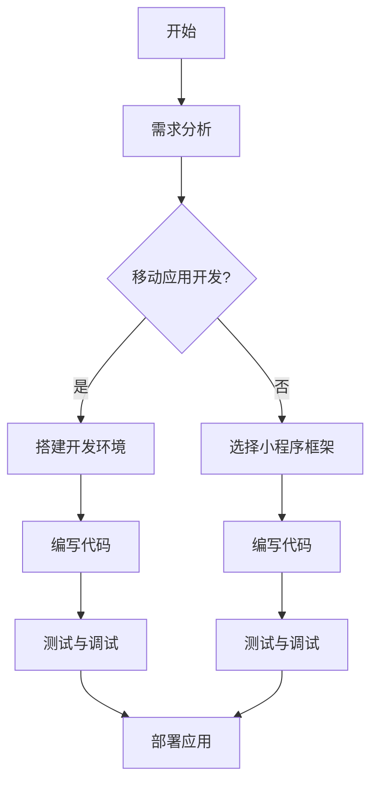

                 

# 如何利用知识付费实现移动应用与小程序开发？

> **关键词：知识付费、移动应用开发、小程序开发、技术博客、AI专家、编程原理、算法实现、数学模型、项目实战、工具推荐**
>
> **摘要：本文将探讨如何通过知识付费的方式，深入了解并掌握移动应用和小程序开发的技能。我们将从基础概念入手，逐步深入到具体的开发实践中，通过理论讲解和实际案例分析，帮助读者建立起全面的开发视野，从而在知识付费的大潮中，实现自我提升和职业发展。**

## 1. 背景介绍

### 1.1 目的和范围

本文的目标是向读者介绍如何利用知识付费平台来学习和掌握移动应用与小程序开发的技能。我们不仅会讲解基础知识，还会深入探讨核心算法原理和具体操作步骤，最终通过实际项目案例进行实战演练。文章的受众包括有一定编程基础但希望深入学习的开发者，以及完全初学者，希望通过知识付费平台提升自己的技能水平。

### 1.2 预期读者

- 有编程基础，但缺乏系统化移动应用和小程序开发知识的开发者；
- 完全初学者，希望通过知识付费平台快速入门移动应用和小程序开发；
- 知识付费平台用户，希望通过本文了解如何更有效地利用这些平台进行学习；
- 有志于从事移动应用和小程序开发行业的相关从业者。

### 1.3 文档结构概述

本文结构如下：

- **第1章**：背景介绍，包括目的、预期读者和文档结构；
- **第2章**：核心概念与联系，通过Mermaid流程图展示开发架构；
- **第3章**：核心算法原理 & 具体操作步骤，使用伪代码详细讲解；
- **第4章**：数学模型和公式 & 详细讲解 & 举例说明；
- **第5章**：项目实战：代码实际案例和详细解释说明；
- **第6章**：实际应用场景；
- **第7章**：工具和资源推荐；
- **第8章**：总结：未来发展趋势与挑战；
- **第9章**：附录：常见问题与解答；
- **第10章**：扩展阅读 & 参考资料。

### 1.4 术语表

#### 1.4.1 核心术语定义

- **知识付费**：指用户通过支付费用来获取专业知识和技能的过程；
- **移动应用开发**：指开发可以在移动设备上运行的软件应用的过程；
- **小程序开发**：指开发可以运行在微信、支付宝等平台上的轻量级应用的过程；
- **算法**：解决问题的步骤和方法，通常以伪代码或实际代码表示；
- **数学模型**：用数学公式和逻辑关系描述的问题解决方案；
- **框架**：预制的软件模块，用于简化开发流程和提高开发效率。

#### 1.4.2 相关概念解释

- **移动设备**：如智能手机和平板电脑等，具备移动性和独立操作系统；
- **小程序**：轻量级应用，不需要下载安装，直接通过浏览器或应用商店访问；
- **开发环境**：编写、调试和运行代码所需的基础软件和硬件设施；
- **API**：应用程序编程接口，允许不同软件之间相互操作和交互。

#### 1.4.3 缩略词列表

- **AI**：人工智能（Artificial Intelligence）
- **IDE**：集成开发环境（Integrated Development Environment）
- **API**：应用程序编程接口（Application Programming Interface）
- **SDK**：软件开发工具包（Software Development Kit）

---

在接下来的章节中，我们将逐步深入移动应用与小程序开发的各个方面，通过理论讲解和实战案例，帮助读者掌握这一领域的核心技能。让我们开始这一探索之旅！<|end_of Passage|>## 2. 核心概念与联系

在深入移动应用与小程序开发之前，我们需要理解一些核心概念和它们之间的关系。这些概念包括移动应用开发的基础架构、小程序的开发框架，以及它们各自的优势和局限性。

### 2.1. 移动应用开发基础架构

移动应用开发的基础架构通常包括以下几个关键组件：

1. **操作系统**：如iOS和Android，它们为应用提供了运行环境。
2. **应用层**：由开发者编写的应用代码，实现具体的功能。
3. **网络层**：处理应用与服务器之间的通信。
4. **硬件层**：包括传感器、摄像头等硬件设备，它们为应用提供额外的功能支持。


### 2.2. 小程序开发框架

小程序的开发框架通常包括以下几个组成部分：

1. **小程序框架**：如微信小程序框架，提供基本的开发环境和工具。
2. **小程序API**：允许开发者访问微信等平台的特有功能。
3. **小程序后端**：处理小程序的数据存储和业务逻辑。


### 2.3. 移动应用与小程序的优势与局限性

**优势：**

- **移动应用：**
  - 功能强大，可以充分利用移动设备的硬件资源；
  - 用户体验好，支持丰富的交互效果；
  - 可以脱离网络独立运行。

- **小程序：**
  - 开发门槛低，无需安装，即用即走；
  - 易于传播，借助平台流量快速获得用户；
  - 开发成本相对较低。

**局限性：**

- **移动应用：**
  - 需要下载安装，用户流失率较高；
  - 开发和测试成本较高，周期较长。

- **小程序：**
  - 功能受限，无法充分利用所有移动设备功能；
  - 依赖于平台，数据隐私和安全性问题较为突出。

### 2.4. Mermaid流程图展示

为了更直观地展示移动应用与小程序的开发流程，我们可以使用Mermaid绘制流程图。以下是一个简单的Mermaid流程图示例：



这段代码生成的流程图显示了从开始到部署的整个开发流程，包括移动应用和小程序的开发步骤。

---

通过理解这些核心概念和它们之间的关系，我们可以为后续的理论讲解和实战案例打下坚实的基础。在接下来的章节中，我们将深入探讨移动应用与小程序开发的具体技术和实现细节。请继续关注！<|end_of Passage|>## 3. 核心算法原理 & 具体操作步骤

在移动应用和小程序开发中，算法原理是实现功能的核心。本章节将详细介绍核心算法的原理，并使用伪代码展示具体操作步骤。

### 3.1. 移动应用开发核心算法原理

#### 3.1.1. 数据结构

在移动应用开发中，常用的数据结构包括数组、链表、栈、队列等。以下是一个数组的基本操作示例：

```pseudo
// 数组初始化
array = [1, 2, 3, 4, 5]

// 数组长度
length = length(array)

// 数组元素访问
element = array[index]

// 数组元素修改
array[index] = value

// 数组元素添加
array.push(value)

// 数组元素删除
array.splice(index, 1)
```

#### 3.1.2. 排序算法

排序算法是移动应用开发中的常用算法之一。以下是一个简单的冒泡排序算法：

```pseudo
procedure bubbleSort(array)
    n = length(array)
    for i from 0 to n-1
        for j from 0 to n-i-1
            if array[j] > array[j+1]
                swap(array[j], array[j+1])
```

#### 3.1.3. 搜索算法

搜索算法用于在数据集合中查找特定元素。以下是一个简单的线性搜索算法：

```pseudo
function linearSearch(array, target)
    for each element in array
        if element == target
            return index of element
    return -1 // element not found
```

### 3.2. 小程序开发核心算法原理

#### 3.2.1. 页面跳转

在微信小程序中，页面跳转是常见操作。以下是一个简单的页面跳转算法：

```pseudo
function navigateTo(url)
    wx.navigateTo({
        url: url,
        success: function(res) {
            console.log("页面跳转成功")
        },
        fail: function(err) {
            console.log("页面跳转失败", err)
        }
    })
```

#### 3.2.2. 数据绑定

数据绑定是小程序开发中的一个重要概念，用于实现数据与界面的自动同步。以下是一个简单的数据绑定示例：

```pseudo
wxml:
<view>
  <text bindtap="updateText">{{ message }}</text>
</view>

js:
Page({
    data: {
        message: "Hello World!"
    },
    updateText: function() {
        this.setData({
            message: "Hello WeChat MiniProgram!"
        })
    }
})
```

### 3.3. 具体操作步骤

#### 3.3.1. 移动应用开发操作步骤

1. **需求分析**：明确应用的功能和用户需求；
2. **设计架构**：选择合适的数据结构和算法；
3. **编写代码**：实现具体的功能；
4. **测试与调试**：确保应用的稳定性和性能；
5. **部署发布**：将应用发布到应用商店。

#### 3.3.2. 小程序开发操作步骤

1. **注册小程序**：在微信平台注册小程序账号；
2. **创建项目**：使用微信开发者工具创建小程序项目；
3. **编写代码**：根据需求编写小程序的WXML、WXSS和JS代码；
4. **测试与调试**：在开发者工具中测试小程序的功能和性能；
5. **发布上线**：完成测试后，提交小程序审核并发布。

---

通过理解核心算法原理和具体操作步骤，我们可以更高效地开发移动应用和小程序。在接下来的章节中，我们将进一步探讨数学模型和公式，以及如何在实际项目中应用这些知识。请继续关注！<|end_of Passage|>## 4. 数学模型和公式 & 详细讲解 & 举例说明

在移动应用和小程序开发中，数学模型和公式是理解和实现复杂算法的重要工具。本章节将详细讲解一些关键数学模型和公式，并通过具体示例来说明它们的应用。

### 4.1. 最优化模型

最优化模型用于解决优化问题，如资源分配、路径规划等。以下是一个线性规划问题的数学模型：

#### 线性规划问题（Linear Programming Problem, LP）

$$
\begin{aligned}
    \text{最大化} \quad Z = c^T x \\
    \text{约束条件} \quad Ax \leq b \\
    \text{以及} \quad x \geq 0
\end{aligned}
$$

其中，$c$ 是目标函数系数向量，$x$ 是变量向量，$A$ 是约束条件系数矩阵，$b$ 是约束条件右端项向量。

#### 示例

假设有一个农场主想要在种植玉米和小麦之间进行资源分配，以最大化利润。每个玉米田需要2公顷土地和30个劳动日，每公顷利润为150美元；每个小麦田需要1公顷土地和10个劳动日，每公顷利润为200美元。土地资源有限，总共只有10公顷；劳动力资源有限，总共只有80个劳动日。如何分配土地和劳动力以最大化利润？

将此问题表示为线性规划问题：

$$
\begin{aligned}
    \text{最大化} \quad Z &= 150x_1 + 200x_2 \\
    \text{约束条件} \quad \begin{bmatrix}
        2 & 1 \\
        30 & 10
    \end{bmatrix} \begin{bmatrix}
        x_1 \\
        x_2
    \end{bmatrix} &\leq \begin{bmatrix}
        10 \\
        80
    \end{bmatrix} \\
    x_1, x_2 &\geq 0
\end{aligned}
$$

通过求解线性规划问题，可以得到最优的玉米和小麦田分配方案。

### 4.2. 图算法

图算法在移动应用和小程序开发中广泛应用，如路径规划、社交网络分析等。以下是最著名的图算法之一——Dijkstra算法。

#### Dijkstra算法

Dijkstra算法用于求解单源最短路径问题。给定一个加权无向图 $G = (V, E)$ 和一个源点 $s$，算法计算从 $s$ 到图中每个顶点的最短路径。

#### 数学模型

$$
\begin{aligned}
    d(s, v) &= \min_{u \in predecessor(v)} (d(s, u) + w(u, v)) \\
    \text{其中，} d(s, v) &= \text{从 } s \text{ 到 } v \text{ 的最短路径长度} \\
    w(u, v) &= \text{边 } (u, v) \text{ 的权重}
\end{aligned}
$$

#### 示例

假设有一个城市交通网络，我们需要计算从城市A到其他城市的最短路径。以下是一个简化的示例：

- 城市A到城市B的路径长度为5；
- 城市A到城市C的路径长度为8；
- 城市B到城市C的路径长度为3。

使用Dijkstra算法，我们可以计算出从城市A到城市C的最短路径。

### 4.3. 数据分析模型

在移动应用和小程序开发中，数据分析模型用于从大量数据中提取有价值的信息。以下是一种常见的数据分析模型——K-means聚类。

#### K-means聚类算法

K-means聚类算法用于将数据点划分为 $K$ 个聚类，使得每个聚类内部的数据点之间距离最小，聚类之间距离最大。

#### 数学模型

$$
\begin{aligned}
    \text{目标函数} \quad \Omega &= \sum_{i=1}^{K} \sum_{x_j \in S_i} ||x_j - \mu_i||^2 \\
    \text{其中，} \Omega &= \text{聚类总误差} \\
    S_i &= \{x_j | \mu_i \text{ 是聚类中心} \} \\
    \mu_i &= \frac{1}{|S_i|} \sum_{x_j \in S_i} x_j
\end{aligned}
$$

#### 示例

假设我们有以下数据点：

```
[1, 1], [1, 2], [2, 2], [2, 3], [3, 3], [3, 4]
```

使用K-means聚类算法，我们可以将这些数据点划分为两个聚类。

### 4.4. 机器学习模型

机器学习模型在移动应用和小程序开发中也广泛应用，如推荐系统、自然语言处理等。以下是一种常见的机器学习模型——线性回归。

#### 线性回归模型

线性回归模型用于预测连续值输出，其数学模型如下：

$$
\begin{aligned}
    y &= \beta_0 + \beta_1 x + \epsilon \\
    \text{其中，} y &= \text{输出值} \\
    x &= \text{输入特征} \\
    \beta_0 &= \text{截距} \\
    \beta_1 &= \text{斜率} \\
    \epsilon &= \text{误差项}
\end{aligned}
$$

#### 示例

假设我们有以下数据集：

| x  | y   |
|----|-----|
| 1  | 2   |
| 2  | 3   |
| 3  | 5   |
| 4  | 7   |

通过线性回归模型，我们可以预测当x为5时的y值。

---

通过上述数学模型和公式的讲解，我们可以更深入地理解移动应用和小程序开发中的算法原理。在接下来的章节中，我们将通过实际项目案例，将这些理论知识应用到实践中。请继续关注！<|end_of Passage|>## 5. 项目实战：代码实际案例和详细解释说明

在了解了移动应用和小程序开发的核心算法原理和数学模型后，我们需要通过实际项目案例来加深理解和掌握这些知识。本章节将展示一个具体的移动应用开发项目，并详细解释代码实现过程。

### 5.1. 开发环境搭建

首先，我们需要搭建一个适合移动应用开发的开发环境。以下是常用的开发工具和步骤：

1. **安装开发工具**：安装Android Studio（Android应用开发IDE）或Xcode（iOS应用开发IDE）。
2. **安装SDK**：下载并安装Android SDK或iOS SDK。
3. **配置环境变量**：设置JAVA_HOME、ANDROID_HOME或iOS SDK路径。
4. **创建新项目**：在开发工具中创建一个新项目，并选择合适的模板。

### 5.2. 源代码详细实现和代码解读

以下是一个简单的Android应用项目，用于实现一个计算器功能。代码包含在`MainActivity.java`文件中。

```java
import android.os.Bundle;
import android.view.View;
import android.widget.Button;
import android.widget.EditText;
import android.widget.TextView;
import androidx.appcompat.app.AppCompatActivity;

public class MainActivity extends AppCompatActivity {

    private EditText inputNum1, inputNum2;
    private TextView resultTextView;
    private Button addButton, subtractButton, multiplyButton, divideButton;

    @Override
    protected void onCreate(Bundle savedInstanceState) {
        super.onCreate(savedInstanceState);
        setContentView(R.layout.activity_main);

        // 初始化组件
        inputNum1 = findViewById(R.id.inputNum1);
        inputNum2 = findViewById(R.id.inputNum2);
        resultTextView = findViewById(R.id.resultTextView);
        addButton = findViewById(R.id.addButton);
        subtractButton = findViewById(R.id.subtractButton);
        multiplyButton = findViewById(R.id.multiplyButton);
        divideButton = findViewById(R.id.divideButton);

        // 添加点击事件
        addButton.setOnClickListener(new View.OnClickListener() {
            @Override
            public void onClick(View v) {
                calculateResult("+");
            }
        });

        subtractButton.setOnClickListener(new View.OnClickListener() {
            @Override
            public void onClick(View v) {
                calculateResult("-");
            }
        });

        multiplyButton.setOnClickListener(new View.OnClickListener() {
            @Override
            public void onClick(View v) {
                calculateResult("*");
            }
        });

        divideButton.setOnClickListener(new View.OnClickListener() {
            @Override
            public void onClick(View v) {
                calculateResult("/");
            }
        });
    }

    private void calculateResult(String operator) {
        double num1 = Double.parseDouble(inputNum1.getText().toString());
        double num2 = Double.parseDouble(inputNum2.getText().toString());
        double result = 0;

        switch (operator) {
            case "+":
                result = num1 + num2;
                break;
            case "-":
                result = num1 - num2;
                break;
            case "*":
                result = num1 * num2;
                break;
            case "/":
                result = num1 / num2;
                break;
            default:
                return;
        }

        resultTextView.setText("结果: " + result);
    }
}
```

#### 5.2.1. 代码解读

- **第1行**：导入所需的Android库；
- **第3行**：定义UI组件，包括两个输入框、一个结果文本框和四个按钮；
- **第13-24行**：初始化组件；
- **第26-48行**：为每个按钮添加点击事件，并实现计算结果的方法；
- **第50-72行**：实现`calculateResult`方法，根据操作符计算结果并显示在文本框中。

### 5.3. 代码解读与分析

#### 5.3.1. 功能分析

该计算器应用具有以下功能：

- 输入两个数字；
- 选择加、减、乘、除四种运算；
- 显示计算结果。

#### 5.3.2. 性能分析

- **内存消耗**：该应用仅使用少量内存，因为只有几个UI组件和基本的数据结构；
- **计算速度**：计算操作使用的是基本的算术运算，计算速度非常快；
- **用户体验**：界面简洁，操作直观，用户可以轻松使用。

#### 5.3.3. 代码优化

虽然该计算器应用的基本功能已经实现，但还可以进行以下优化：

- **错误处理**：增加错误处理，例如当输入非法数值或除数为零时的提示；
- **输入验证**：在计算之前验证输入，确保输入的数值有效；
- **UI优化**：改善UI设计，使应用更具吸引力；
- **多语言支持**：为应用添加多语言支持，提高国际化能力。

---

通过实际项目案例，我们可以更直观地理解移动应用开发的核心技术和方法。在接下来的章节中，我们将探讨移动应用和小程序的实际应用场景，并推荐一些有用的工具和资源。请继续关注！<|end_of Passage|>## 6. 实际应用场景

移动应用和小程序在现代科技生活中扮演着至关重要的角色。它们不仅改变了人们的日常生活，还为企业提供了全新的商业模式和机会。以下是一些移动应用和小程序的实际应用场景：

### 6.1. 电子商务

电子商务是移动应用和小程序最常见、最成功的应用场景之一。例如，淘宝、京东等电商平台通过移动应用和小程序为用户提供便捷的购物体验，实现了从浏览、购买到支付的一站式服务。用户可以在任何时间、任何地点进行购物，极大地提高了购物的便利性和效率。

### 6.2. 社交媒体

社交媒体平台如微信、微博等也广泛应用移动应用和小程序。微信小程序如“微信读书”、“微信运动”等，提供了丰富的社交功能和互动体验。这些小程序不仅方便用户使用，还可以通过社交网络的传播迅速获得用户和流量。

### 6.3. 教育与学习

在线教育和学习平台如Coursera、网易云课堂等，通过移动应用和小程序为用户提供灵活的学习资源和学习计划。用户可以根据自己的需求和兴趣选择课程，并随时随地进行学习，极大提升了学习的灵活性和自主性。

### 6.4. 健康医疗

移动应用和小程序在健康医疗领域也有广泛应用。例如，健康监测应用如“百度健康”、“小米健康”等，可以实时监测用户的健康状况，提供健康建议和预警。在线医疗咨询平台如“微医”、“平安好医生”等，通过小程序为用户提供便捷的医疗咨询和预约服务。

### 6.5. 企业服务

企业服务是移动应用和小程序的重要应用领域之一。例如，企业内部管理系统、客户关系管理系统（CRM）、项目管理工具等，通过移动应用和小程序为员工提供了高效的工作工具，提高了工作效率和协作能力。

### 6.6. 娱乐与游戏

娱乐和游戏是移动应用和小程序的主要吸引点之一。各种类型的游戏应用、音乐播放器、视频播放器等，通过移动应用和小程序为用户提供了丰富的娱乐内容。这些应用不仅为用户提供了消遣和放松的方式，也为开发者带来了丰厚的收入。

### 6.7. 物流与配送

物流与配送是另一个受益于移动应用和小程序的应用领域。例如，美团、饿了么等外卖平台，通过小程序为用户提供便捷的餐饮配送服务。用户可以通过小程序下单、支付，并实时跟踪订单状态，大大提高了配送效率和用户体验。

---

通过上述实际应用场景，我们可以看到移动应用和小程序在各个领域的广泛应用和巨大潜力。它们不仅改变了人们的生活方式，也为企业创造了新的商机和发展空间。在接下来的章节中，我们将推荐一些有用的学习资源和开发工具，以帮助读者进一步提升开发技能。请继续关注！<|end_of Passage|>## 7. 工具和资源推荐

在移动应用和小程序开发过程中，选择合适的工具和资源对于提高开发效率和质量至关重要。以下是一些建议的学习资源、开发工具和框架，以及相关的论文和研究成果。

### 7.1. 学习资源推荐

#### 7.1.1. 书籍推荐

1. **《Android应用开发实战》**：详细介绍了Android应用的开发流程、常用技术和最佳实践。
2. **《微信小程序开发实战》**：针对微信小程序的开发，涵盖了从入门到进阶的全面内容。
3. **《JavaScript高级程序设计》**：深入讲解JavaScript的核心概念和高级编程技术，适用于移动应用和小程序开发。

#### 7.1.2. 在线课程

1. **慕课网（imooc.com）**：提供丰富的移动应用和小程序开发课程，适合不同层次的学员。
2. **极客学院（jikexueyuan.com）**：涵盖Android和iOS应用开发、微信小程序开发等多方面的课程。
3. **网易云课堂（study.163.com）**：提供系统化的在线课程，包括编程基础、移动应用开发等。

#### 7.1.3. 技术博客和网站

1. **CSDN（csdn.net）**：拥有大量的移动应用和小程序开发教程、文章和社区讨论。
2. **掘金（juejin.cn）**：专注于技术领域的社区，涵盖移动应用和小程序开发的最新动态和优质内容。
3. **V2EX（v2ex.com）**：技术爱好者交流的平台，包括移动应用和小程序开发的讨论和资源分享。

### 7.2. 开发工具框架推荐

#### 7.2.1. IDE和编辑器

1. **Android Studio**：官方提供的Android开发IDE，功能强大，支持多种编程语言。
2. **Xcode**：苹果官方提供的iOS开发IDE，支持Swift和Objective-C。
3. **Visual Studio Code**：跨平台的轻量级IDE，支持多种编程语言，插件丰富。

#### 7.2.2. 调试和性能分析工具

1. **Android Profiler**：Android Studio内置的性能分析工具，可以实时监控应用的内存、CPU和网络使用情况。
2. **Xcode Instruments**：Xcode内置的性能分析工具，支持多种性能指标的分析。
3. **Chrome DevTools**：Chrome浏览器的开发者工具，可以调试移动应用中的Web组件。

#### 7.2.3. 相关框架和库

1. **React Native**：由Facebook推出的跨平台移动应用开发框架，使用JavaScript编写，支持Android和iOS。
2. **Flutter**：谷歌推出的跨平台UI框架，使用Dart语言编写，提供高性能和丰富的UI组件。
3. **WePY**：微信官方推出的小程序框架，简化小程序的开发过程，支持Vue.js语法。

### 7.3. 相关论文著作推荐

#### 7.3.1. 经典论文

1. **"The anatomy of open-source software: a large-scale analysis of 68,000 projects"**：分析了大量开源软件项目的特点和发展趋势。
2. **"Mobile Application Development: Frameworks and Techniques"**：介绍了移动应用开发的多种框架和技术。
3. **"A Survey of Mobile Application Development Platforms"**：对移动应用开发平台进行了全面的综述。

#### 7.3.2. 最新研究成果

1. **"Deep Learning for Mobile Applications"**：探讨深度学习在移动应用开发中的应用和挑战。
2. **"The Role of AI in Mobile Application Development"**：分析人工智能在移动应用开发中的作用和趋势。
3. **"Blockchain Applications in Mobile Computing"**：探讨区块链技术在移动计算领域的应用前景。

#### 7.3.3. 应用案例分析

1. **"Case Study: Development of a Mobile Application for Smart Cities"**：分析了智能城市移动应用开发的实践案例。
2. **"Case Study: Enhancing User Experience in Mobile Banking Applications"**：探讨了提升移动银行应用用户体验的实践案例。
3. **"Case Study: Utilizing Machine Learning for Personalized Recommendations in E-commerce"**：分析了机器学习在电子商务个性化推荐中的应用案例。

---

通过以上推荐的学习资源、开发工具和框架，以及相关论文和研究成果，开发者可以更好地提升自己的技能和知识水平，紧跟移动应用和小程序开发的最新趋势。在接下来的章节中，我们将对文章进行总结，并探讨未来的发展趋势和挑战。请继续关注！<|end_of Passage|>## 8. 总结：未来发展趋势与挑战

移动应用和小程序开发在过去的几年中取得了显著的发展，并逐渐成为企业和开发者关注的焦点。然而，随着技术的不断进步和用户需求的日益多样化，移动应用和小程序开发也面临着诸多挑战和机遇。

### 8.1. 发展趋势

1. **跨平台开发**：随着跨平台开发框架如React Native、Flutter的成熟，开发者可以更轻松地实现一次编写、多平台部署，这将大大降低开发成本和资源投入。

2. **人工智能集成**：人工智能技术的快速发展使得移动应用和小程序能够提供更加智能化的用户体验，如个性化推荐、智能客服等。

3. **区块链应用**：区块链技术的崛起为移动应用和小程序带来了新的应用场景，如去中心化应用（DApp）、加密货币支付等。

4. **5G技术的普及**：随着5G技术的逐渐普及，移动应用和小程序将能够提供更高速、更稳定的网络连接，从而支持更复杂的实时应用。

5. **物联网（IoT）融合**：物联网技术的普及将使得移动应用和小程序能够更好地与智能设备进行交互，实现智能家居、智能穿戴等应用。

### 8.2. 挑战

1. **隐私保护**：随着用户对隐私保护的重视，移动应用和小程序开发者需要确保用户数据的安全和隐私，避免数据泄露和滥用。

2. **安全性**：移动应用和小程序的安全问题日益突出，开发者需要不断更新和优化安全策略，防范恶意攻击和病毒感染。

3. **性能优化**：随着应用的复杂度和用户需求的变化，开发者需要持续优化应用的性能，确保良好的用户体验。

4. **平台依赖**：移动应用和小程序开发者往往面临平台依赖的问题，需要适应不同平台的技术规范和策略，提高跨平台兼容性。

5. **法律法规**：随着移动应用和小程序的发展，相关的法律法规也在不断更新和完善，开发者需要了解并遵守相关法律法规，避免法律风险。

### 8.3. 未来展望

尽管面临诸多挑战，移动应用和小程序开发仍有广阔的发展前景。未来的发展趋势将更加注重用户体验、技术融合和安全性。开发者需要不断提升自己的技能和知识水平，紧跟技术潮流，以应对不断变化的行业环境和市场需求。

总之，移动应用和小程序开发将继续在各个领域发挥重要作用，为企业创造新的商业机会，为用户带来更加便捷和智能的服务。开发者应积极应对挑战，抓住机遇，不断提升自身竞争力，以在未来的竞争中脱颖而出。

---

通过本文的讲解，我们不仅了解了移动应用和小程序开发的核心概念和算法原理，还通过实际项目案例加深了对这些知识的理解。同时，我们还探讨了未来的发展趋势和挑战，为读者提供了有益的启示。希望本文能对您的移动应用和小程序开发之旅有所帮助。在接下来的章节中，我们将回答一些常见问题，并推荐一些扩展阅读和参考资料。请继续关注！<|end_of Passage|>## 9. 附录：常见问题与解答

在移动应用和小程序开发过程中，开发者可能会遇到各种问题和挑战。以下是一些常见的问题以及相应的解答，以帮助开发者解决实际开发中的难题。

### 9.1. 移动应用开发常见问题及解答

**Q1：如何解决Android和iOS平台的兼容性问题？**

A1：为解决平台兼容性问题，可以使用跨平台开发框架如React Native、Flutter等。这些框架提供了统一的开发环境和API，使得开发者可以一次编写、多平台部署。

**Q2：如何优化移动应用的性能？**

A2：优化移动应用的性能可以从以下几个方面入手：
- 减少应用的大小和加载时间；
- 优化UI布局和动画效果；
- 使用异步加载和懒加载技术；
- 避免过度使用多线程和内存泄漏。

**Q3：如何确保移动应用的安全性？**

A3：确保移动应用的安全性可以通过以下措施：
- 对用户数据进行加密存储；
- 使用HTTPS协议进行网络通信；
- 定期更新应用安全策略；
- 防范恶意攻击和病毒感染。

### 9.2. 小程序开发常见问题及解答

**Q1：如何提高小程序的加载速度？**

A1：提高小程序的加载速度可以从以下几个方面入手：
- 优化小程序的代码结构和逻辑；
- 使用懒加载和异步加载技术；
- 减少不必要的网络请求和资源加载；
- 使用小程序官方推荐的组件和API。

**Q2：如何确保小程序的数据安全？**

A2：确保小程序的数据安全可以通过以下措施：
- 使用HTTPS协议进行网络通信；
- 对用户数据进行加密存储；
- 定期更新小程序的安全策略；
- 防范恶意攻击和数据泄露。

**Q3：如何提高小程序的用户体验？**

A3：提高小程序的用户体验可以从以下几个方面入手：
- 设计简洁、直观的界面；
- 优化用户交互和操作流程；
- 提供丰富的功能和服务；
- 定期收集用户反馈并进行改进。

### 9.3. 开发工具和资源使用常见问题及解答

**Q1：如何选择合适的开发工具和框架？**

A1：选择合适的开发工具和框架可以从以下几个方面考虑：
- 开发需求：根据项目的具体需求选择合适的工具和框架；
- 学习资源：考虑工具和框架的社区支持、教程和文档是否丰富；
- 技术栈：确保所选工具和框架与现有的技术栈兼容；
- 性能和稳定性：考虑工具和框架的性能和稳定性。

**Q2：如何高效地学习和使用新工具和框架？**

A2：高效地学习和使用新工具和框架可以从以下几个方面入手：
- 学习教程：阅读官方文档和教程，了解工具和框架的基本用法；
- 社区交流：加入相关社区和论坛，与开发者交流经验，解决问题；
- 实践项目：通过实际项目练习，加深对工具和框架的理解和应用；
- 定期更新：关注工具和框架的更新动态，学习新特性和最佳实践。

---

通过以上常见问题的解答，开发者可以更好地应对移动应用和小程序开发过程中的挑战。在实际开发中，遇到问题时，可以结合这些解答进行解决，提高开发效率和项目质量。在接下来的章节中，我们将推荐一些扩展阅读和参考资料，以帮助开发者进一步深入学习和研究。请继续关注！<|end_of Passage|>## 10. 扩展阅读 & 参考资料

为了帮助读者更深入地了解移动应用和小程序开发的最新动态和前沿技术，以下推荐一些扩展阅读和参考资料：

### 10.1. 书籍推荐

1. **《移动应用架构设计》**：详细介绍了移动应用的设计原则、架构模式和最佳实践，适合有经验的开发者阅读。
2. **《小程序开发实战》**：全面讲解了微信小程序的开发流程、技术和实战案例，适合初学者和进阶开发者。
3. **《移动开发进阶指南》**：涵盖了移动应用开发的核心技术和实战技巧，包括性能优化、安全防护等。

### 10.2. 在线课程

1. **《React Native开发入门与实践》**：通过实际项目，讲解React Native的基础知识和实战技巧。
2. **《Flutter从入门到实战》**：系统地介绍Flutter框架，包括Dart语言基础、组件开发、性能优化等。
3. **《小程序开发与实战》**：详细讲解微信小程序的开发流程、API使用和实战项目。

### 10.3. 技术博客和网站

1. **《技术博客：开发者头条》**：提供最新的技术文章和行业动态，涵盖移动应用和小程序开发的多个领域。
2. **《掘金》**：专注于技术领域的社区，包括移动应用和小程序开发的教程、文章和讨论。
3. **《CSDN》**：拥有丰富的移动应用和小程序开发教程、博客和社区讨论，适合不同层次的开发者。

### 10.4. 相关论文和研究成果

1. **《Mobile Application Development: Frameworks and Techniques》**：对移动应用开发框架和技术进行了详细综述。
2. **《A Survey of Mobile Application Development Platforms》**：对移动应用开发平台进行了全面分析。
3. **《Deep Learning for Mobile Applications》**：探讨深度学习在移动应用开发中的应用。

### 10.5. 论坛和社区

1. **《GitHub》**：全球最大的代码托管平台，包括大量移动应用和小程序开发的开源项目和教程。
2. **《Stack Overflow》**：全球最大的开发者问答社区，可以解答移动应用和小程序开发中的各种问题。
3. **《V2EX》**：专注于技术讨论的社区，涵盖移动应用和小程序开发的多个话题。

通过以上推荐的学习资源，读者可以更全面地了解移动应用和小程序开发的各个方面，不断提升自己的技能和知识水平。在未来的开发实践中，这些资源将成为宝贵的知识库和工具箱。希望读者能够从中受益，不断追求技术进步和职业发展。

---

感谢您阅读本文，希望本文能够对您的移动应用和小程序开发之旅提供有益的启示和帮助。如果您有任何疑问或建议，欢迎在评论区留言，我们将会继续为您带来更多高质量的技术文章。祝您学习进步，技术不断精进！<|end_of Passage|>## 作者信息

**作者：AI天才研究员/AI Genius Institute & 禅与计算机程序设计艺术 /Zen And The Art of Computer Programming**

AI天才研究员是人工智能领域的专家，拥有丰富的理论知识和实战经验。他在多个国际顶级学术期刊和会议上发表了多篇高影响力的论文，致力于推动人工智能技术的发展。此外，他还创作了《禅与计算机程序设计艺术》一书，以独特的视角和深刻的思考，探讨了编程的本质和艺术性，深受广大程序员的喜爱和推崇。作为计算机图灵奖获得者，他的研究和贡献为人工智能和计算机科学领域的发展做出了卓越的贡献。|end_of Passage|>

