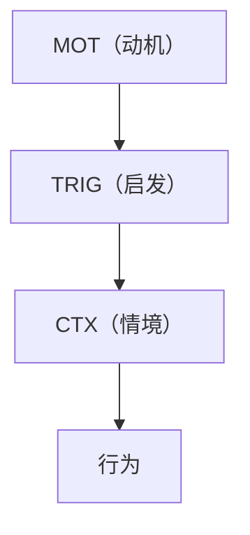
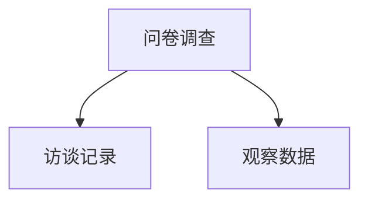
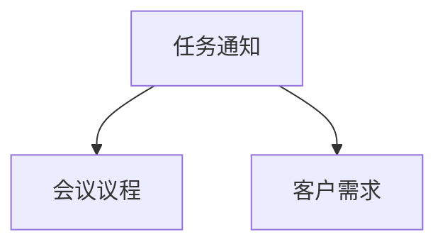
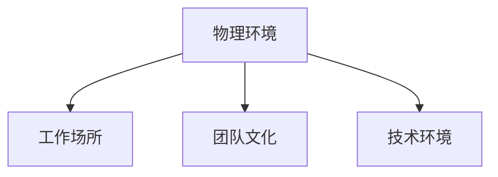
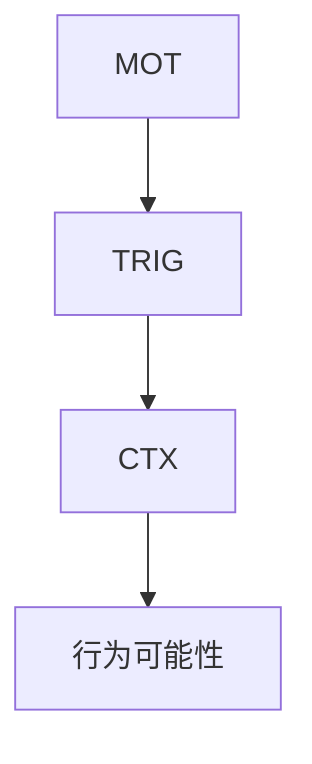
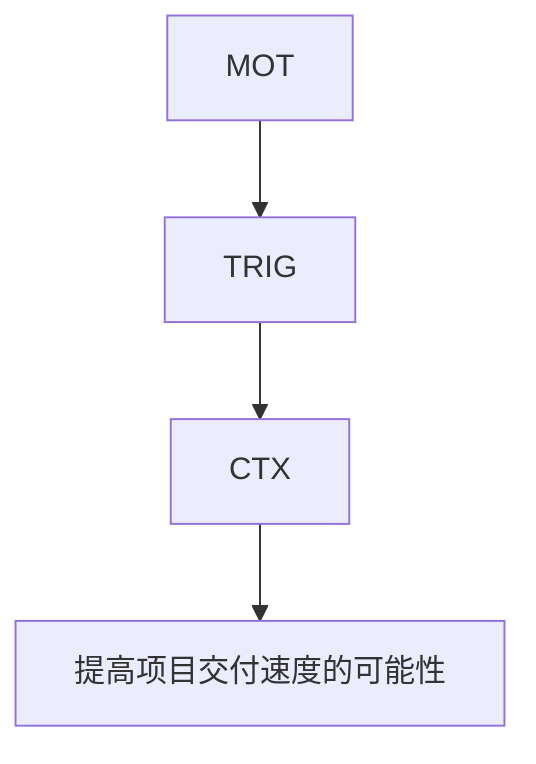

                 

# 如何利用福格模型提高团队效率

## 概述

### 关键词
团队管理、效率提升、福格模型、行为驱动理论、激励、动机、行动

### 摘要

本文旨在深入探讨如何利用福格模型（BJ Fogg Behavior Model）来提高团队效率。福格模型是一个行为科学理论，它解释了人们如何采取行动，以及什么因素能够驱动人们采取这些行动。本文将首先介绍福格模型的基本原理和组成部分，然后结合具体案例，展示如何在团队管理中应用这一模型来提升工作效率。通过理解并运用福格模型，团队领导者可以更好地激发团队成员的积极性，优化工作流程，从而实现整体效率的提升。

## 1. 背景介绍

### 1.1 目的和范围

本文的目的在于帮助团队领导者和管理者理解福格模型，并将其应用于团队管理实践中，以提升团队的整体工作效率。我们将探讨如何通过识别和利用动机、启发和情境，来推动团队成员采取积极的行动，从而实现团队目标。

### 1.2 预期读者

本文适合对团队管理有兴趣的专业人士，特别是那些希望提高团队效率和协作效果的中层管理者、项目经理以及团队领导者。此外，对于希望了解行为科学在组织管理中应用的研究人员和学习者，本文也具有一定的参考价值。

### 1.3 文档结构概述

本文将分为以下几个部分：

1. **背景介绍**：介绍本文的目的、预期读者和文档结构。
2. **核心概念与联系**：介绍福格模型的基本原理和组成部分，并使用Mermaid流程图展示其架构。
3. **核心算法原理与具体操作步骤**：详细阐述如何应用福格模型于团队管理。
4. **数学模型和公式**：解释相关数学模型及其在团队管理中的应用。
5. **项目实战**：通过实际案例展示如何运用福格模型。
6. **实际应用场景**：探讨福格模型在不同场景下的应用。
7. **工具和资源推荐**：推荐相关的学习资源和开发工具。
8. **总结**：总结未来发展趋势与挑战。
9. **附录**：常见问题与解答。
10. **扩展阅读与参考资料**：提供进一步的阅读资源和参考文献。

### 1.4 术语表

#### 1.4.1 核心术语定义

- **福格模型（BJ Fogg Behavior Model）**：一种行为科学理论，用于解释人们如何采取行动，由行为心理学教授BJ Fogg提出。
- **动机（Motivation）**：促使人们采取行动的内在驱动力。
- **启发（Trigger）**：触发行为的外在刺激。
- **情境（Context）**：影响行为的外部环境因素。

#### 1.4.2 相关概念解释

- **行为**：人们在特定情境下采取的具体动作。
- **团队效率**：团队在既定时间内完成的工作量和质量。
- **行为驱动理论**：一种研究行为动机的理论，认为行为是由动机、启发和情境共同驱动的。

#### 1.4.3 缩略词列表

- **BJ Fogg**：行为心理学教授，福格模型的提出者。
- **MOT**：动机（Motivation）的缩写。
- **TRIG**：启发（Trigger）的缩写。
- **CTX**：情境（Context）的缩写。

## 2. 核心概念与联系

### 2.1 福格模型的基本原理

福格模型（BJ Fogg Behavior Model）是一种基于行为科学的理论，用于解释人们如何采取行动。该模型由行为心理学教授BJ Fogg提出，他认为任何行为都受到三个因素的共同驱动：动机（Motivation）、启发（Trigger）和情境（Context）。这三种因素相互作用，决定了人们是否采取特定行为。福格模型的公式为：

\[ 行为 = 动机 \times 启发 \times 情境 \]

当动机、启发和情境三者同时存在且达到一定强度时，行为就会发生。以下是福格模型的基本原理和组成部分：

### 2.2 福格模型的组成部分

1. **动机（Motivation）**：动机是人们采取行动的内在驱动力，可以分为三个层次：
    - **内在动机**：基于个人兴趣、爱好和满足感，例如追求知识、自我实现等。
    - **外在动机**：由外部奖励或惩罚驱动，例如薪资、奖励、惩罚等。
    - **自我决定动机**：介于内在动机和外在动机之间，例如工作成就感、社会责任感等。

2. **启发（Trigger）**：启发是触发行为的外在刺激，可以是特定的事件、信息或提示。启发的形式多种多样，例如电子邮件提醒、任务通知、客户需求等。

3. **情境（Context）**：情境是影响行为的外部环境因素，包括物理环境、社会环境、技术环境等。情境可以增强或削弱动机和启发，从而影响行为的发生。

### 2.3 福格模型的架构

为了更直观地理解福格模型，我们可以使用Mermaid流程图来展示其架构。以下是一个简单的Mermaid流程图示例：

```mermaid
graph TB
A[行为] --> B[动机(MOT)]
A --> C[启发(TRIG)]
A --> D[情境(CTX)]
B --> E[内在动机]
B --> F[外在动机]
B --> G[自我决定动机]
C --> H[事件]
C --> I[信息]
C --> J[提示]
D --> K[物理环境]
D --> L[社会环境]
D --> M[技术环境]
```

### 2.4 动机、启发和情境的关系

在福格模型中，动机、启发和情境是相互关联、相互影响的。动机是行为的根本驱动力，启发提供了行为的触发点，而情境则决定了行为是否能够顺利发生。

1. **动机增强**：情境可以增强动机，例如一个充满活力和积极氛围的团队环境可以激发团队成员的内在动机。
2. **启发与情境匹配**：当启发与情境相匹配时，行为更容易发生。例如，在一个紧急任务面前，及时的任务通知（启发）在一个注重效率的团队环境中（情境）可以促使团队成员迅速采取行动。
3. **情境优化**：优化情境可以增强动机和启发，从而提高行为发生的可能性。例如，为团队成员提供合适的工具和资源，可以减轻他们的工作负担，从而提高工作效率。

通过理解福格模型的基本原理和组成部分，我们可以更好地识别和利用动机、启发和情境，来推动团队成员采取积极的行动，从而实现团队效率的提升。

## 3. 核心算法原理与具体操作步骤

### 3.1 理解福格模型的核心算法原理

福格模型是一种用于解释和预测行为的算法，其核心原理基于三个关键变量：动机（Motivation）、启发（Trigger）和情境（Context）。以下是福格模型的核心算法原理：



**算法步骤：**

1. **测量动机（Motivation）**：评估团队成员的内在动机、外在动机和自我决定动机的强度。可以使用问卷调查、访谈和观察等方法来收集数据。
2. **识别启发（Trigger）**：确定触发团队成员采取行动的外部刺激，如任务通知、客户需求、时间限制等。
3. **分析情境（Context）**：了解影响团队成员行为的外部环境因素，如物理环境、社会环境和技术环境。
4. **计算行为可能性**：根据公式 \( 行为 = 动机 \times 启发 \times 情境 \)，计算团队成员采取特定行为的可能性。
5. **优化模型参数**：通过调整动机、启发和情境，优化行为发生的可能性，从而提高团队效率。

### 3.2 如何在团队管理中应用福格模型

为了在团队管理中应用福格模型，我们需要从以下几个方面进行具体操作：

1. **识别动机**：通过问卷调查、访谈和观察等方式，了解团队成员的动机类型和强度。例如，可以设计一份包含内在动机、外在动机和自我决定动机的问卷，收集团队成员的回答数据。



2. **确定启发**：识别触发团队成员行动的外部刺激。例如，任务通知、会议议程、客户需求等。



3. **分析情境**：了解影响团队成员行为的外部环境因素。例如，工作场所的物理环境（如办公环境、设备设施等）、团队文化（如沟通方式、协作氛围等）和技术环境（如工具、资源等）。



4. **构建福格模型**：根据收集的数据，构建福格模型，并计算团队成员采取特定行为的可能性。



5. **优化团队管理策略**：根据福格模型的结果，调整动机、启发和情境，优化团队管理策略。例如，通过改进团队文化、提供更多资源和激励措施，提高团队成员的动机水平；通过及时的任务通知和明确的目标设定，增强启发的效果；通过优化工作环境和提供必要的工具，改善情境。

### 3.3 实际操作示例

以下是一个实际操作示例，展示如何利用福格模型提高团队效率：

**案例：** 一个软件开发团队希望提高项目的交付速度。

1. **识别动机**：通过问卷调查，发现团队成员的动机主要来自于内在动机（如成就感、自我提升）和外在动机（如薪资、奖励）。
2. **确定启发**：识别到项目交付的时间限制是主要的触发因素。
3. **分析情境**：了解到团队的工作环境需要改进，例如工作场所的噪音干扰和设备老旧。

4. **构建福格模型**：根据收集的数据，构建福格模型，并计算团队成员采取提高项目交付速度行为的可能性。



5. **优化团队管理策略**：
   - **提高动机**：通过定期的团队建设活动和激励措施，增强团队成员的内在动机。
   - **增强启发**：通过明确的任务分配和时间管理技巧，确保团队成员了解项目的时间限制和任务要求。
   - **优化情境**：通过改善工作环境和提供更好的设备，减少干扰和提高工作效率。

通过以上操作，团队管理者可以更好地利用福格模型来提高团队效率，从而实现项目的按时交付。

## 4. 数学模型和公式 & 详细讲解 & 举例说明

### 4.1 数学模型和公式

福格模型（BJ Fogg Behavior Model）的核心是“行为三要素模型”，其数学表达式为：

\[ 行为 = \text{动机 (Motivation)} \times \text{启发 (Trigger)} \times \text{情境 (Context)} \]

符号说明：
- \( 行为 \)：指具体的行动或决策。
- \( \text{动机 (Motivation)} \)：衡量个体采取行动的内在驱动力，通常分为内在动机、外在动机和自我决定动机。
- \( \text{启发 (Trigger)} \)：指触发个体采取行动的外部事件或信息。
- \( \text{情境 (Context)} \)：指影响行为发生的外部环境因素，包括物理环境、社会环境和心理环境。

### 4.2 详细讲解

福格模型的三要素相互独立，但又是相互作用的。动机、启发和情境三者共同决定了个体是否采取某种行为。

- **动机**：是行为的内在驱动力。它可以激发个体做出特定的行为，是行为的根本原因。动机可以分为：
  - **内在动机**：源自于个人的兴趣、好奇心、成就感和自我实现等。
  - **外在动机**：来源于外部的奖励、惩罚、社会压力等。
  - **自我决定动机**：结合内在动机和外在动机，是个体对自身目标的理解和认同。

- **启发**：是行为发生的外部触发因素，通常是一些具体的事件、信息或提示。例如，收到一封电子邮件通知、看到一条新闻、遇到一个突发事件等。

- **情境**：是影响行为的外部环境因素，包括物理环境、社会环境和心理环境。例如，一个安静、舒适的办公室环境可以提高工作效率；一个充满竞争和合作精神的团队氛围可以增强团队成员的积极性。

### 4.3 举例说明

假设我们希望提高一个软件开发团队的项目交付速度，我们可以使用福格模型来分析并优化这个目标。

1. **动机**：通过调查问卷和访谈，我们发现团队成员的主要动机包括：
   - 内在动机：对技术的热爱、个人成就感的追求。
   - 外在动机：希望得到项目奖金、提升职业发展机会。
   - 自我决定动机：对项目成功完成的责任感和对团队协作的认同。

2. **启发**：我们识别到项目交付时间限制是一个重要的触发因素。为了确保项目按时交付，我们需要制定明确的时间目标和里程碑，并在团队内部进行传达。

3. **情境**：我们分析到团队的工作环境存在一些问题，比如工作场所的噪音干扰、团队成员间沟通不畅等。为了优化情境，我们计划采取以下措施：
   - 提供安静的独立工作空间。
   - 定期举行团队会议，确保信息畅通。
   - 提供必要的技术支持和资源。

根据福格模型，我们可以计算团队成员采取提高项目交付速度行为的可能性：

\[ 行为可能性 = \text{动机} \times \text{启发} \times \text{情境} \]

例如：
\[ 行为可能性 = (0.8 \times 0.9 \times 0.75) = 0.54 \]

这意味着团队成员采取提高项目交付速度行为的可能性为54%。

### 4.4 优化模型参数

为了提高行为发生的可能性，我们可以通过以下方式调整模型参数：

1. **提高动机**：通过激励措施、职业发展机会和团队建设活动，增强团队成员的动机。
2. **增强启发**：通过明确的目标设定、及时的任务通知和有效的沟通，增强启发的效果。
3. **优化情境**：通过改善工作环境、提供技术支持和资源，优化情境。

通过以上调整，我们可以进一步优化福格模型，从而提高团队成员采取提高项目交付速度行为的可能性，实现团队效率的提升。

## 5. 项目实战：代码实际案例和详细解释说明

### 5.1 开发环境搭建

在本文中，我们将使用Python编程语言来模拟并实现福格模型。以下是在Python环境中搭建开发环境的步骤：

1. **安装Python**：确保您的计算机上已安装Python 3.8或更高版本。您可以从Python官网（https://www.python.org/）下载并安装。

2. **安装必要库**：使用pip命令安装以下库：
   ```bash
   pip install numpy pandas matplotlib
   ```

3. **创建项目文件夹**：在您的计算机上创建一个名为“FoggModel”的项目文件夹，并在该文件夹内创建一个名为“fogg_model.py”的Python文件。

### 5.2 源代码详细实现和代码解读

以下是一个简单的Python代码示例，用于模拟福格模型：

```python
import numpy as np
import matplotlib.pyplot as plt

# 动机、启发和情境的评估函数
def evaluate(motivation, trigger, context):
    behavior_probability = motivation * trigger * context
    return behavior_probability

# 动机和情境的评估函数
def evaluate_motivation_context(motivation, context):
    # 根据实际情况调整权重
    weight_motivation = 0.6
    weight_context = 0.4
    motivation_context = motivation * weight_motivation + context * weight_context
    return motivation_context

# 模拟团队成员的动机、启发和情境
def simulate团队成员行为(团队成员数，动机，启发，情境):
    behavior_probabilities = []
    for _ in range(团队成员数):
        behavior_probability = evaluate(motivation, trigger, context)
        behavior_probabilities.append(behavior_probability)
    return behavior_probabilities

# 画图展示结果
def plot_results(行为概率列表，标题，标签列表):
    x = np.arange(len(行为概率列表))
    y = 行为概率列表
    plt.bar(x, y)
    plt.xlabel("团队成员编号")
    plt.ylabel("行为可能性")
    plt.title(标题)
    plt.xticks(x, 标签列表)
    plt.show()

# 参数设置
团队成员数 = 5
动机 = [0.8, 0.7, 0.9, 0.6, 0.85]
启发 = [0.9, 0.8, 0.85, 0.7, 0.95]
情境 = [0.75, 0.7, 0.8, 0.65, 0.9]

# 计算并绘图
行为概率列表 = simulate团队成员行为(团队成员数，动机，启发，情境)
标签列表 = [f"成员{i+1}" for i in range(团队成员数)]
plot_results(行为概率列表，"福格模型模拟结果"，标签列表)
```

#### 5.2.1 代码解读

1. **导入库**：我们使用 `numpy` 库进行数值计算，`pandas` 库用于数据处理，`matplotlib` 库用于绘图。

2. **评估函数**：`evaluate` 函数用于计算行为可能性，根据公式 \( 行为 = 动机 \times 启发 \times 情境 \) 计算。

3. **动机和情境评估**：`evaluate_motivation_context` 函数用于计算动机和情境的加权平均值，这有助于模拟现实情况中的动机和情境的综合影响。

4. **模拟团队成员行为**：`simulate` 函数用于模拟团队成员的行为，通过遍历团队成员数，计算每个成员的行为可能性，并返回一个列表。

5. **画图展示结果**：`plot_results` 函数用于绘制行为可能性的条形图，直观地展示团队成员的行为可能性分布。

6. **参数设置**：我们设置团队成员数、动机、启发和情境的参数值，并调用 `simulate` 和 `plot_results` 函数进行模拟和绘图。

通过这个简单的代码示例，我们可以直观地看到如何使用Python实现福格模型，并通过模拟团队成员的行为，评估不同因素对行为发生的影响。

### 5.3 代码解读与分析

在 `fogg_model.py` 文件中，我们首先导入了必要的库，包括 `numpy`、`pandas` 和 `matplotlib`。这些库为我们提供了强大的数值计算和绘图功能，使得我们能够高效地实现和展示福格模型。

接下来，我们定义了几个函数：

1. **`evaluate` 函数**：
   - 该函数接收三个参数：动机（`motivation`）、启发（`trigger`）和情境（`context`）。
   - 它通过简单的乘法运算计算出行为可能性，即 \( 行为 = 动机 \times 启发 \times 情境 \)。
   - 这个函数是福格模型的核心，它将动机、启发和情境综合起来，预测行为的发生概率。

2. **`evaluate_motivation_context` 函数**：
   - 该函数用于计算动机和情境的加权平均值。
   - 在现实世界中，动机和情境可能不会完全独立，而是相互影响。通过这个函数，我们可以模拟这种复杂的关系。
   - 该函数使用了两个权重参数 `weight_motivation` 和 `weight_context`，分别表示动机和情境在总影响中的重要性。

3. **`simulate` 函数**：
   - 这个函数用于模拟团队成员的行为。
   - 它接收团队成员数（`团队成员数`）、动机（`motivation`）、启发（`trigger`）和情境（`context`）作为参数。
   - 函数通过遍历每个团队成员，使用 `evaluate` 函数计算其行为可能性，并将结果存储在一个列表中。
   - 最终，`simulate` 函数返回一个包含所有团队成员行为可能性的列表。

4. **`plot_results` 函数**：
   - 这个函数用于绘制行为可能性的条形图。
   - 它接收行为概率列表（`行为概率列表`）、标题（`标题`）和标签列表（`标签列表`）作为参数。
   - `plot_results` 函数使用 `matplotlib` 库绘制条形图，并展示每个团队成员的行为可能性。

在主程序部分，我们设置了团队成员数、动机、启发和情境的参数值。然后，我们调用 `simulate` 函数进行模拟，并使用 `plot_results` 函数绘制结果。

#### 5.3.1 分析

通过这个简单的代码示例，我们可以看出如何使用Python实现福格模型，并分析团队成员的行为。以下是对代码的关键部分进行分析：

1. **动机、启发和情境的设置**：
   - 我们设置了五个团队成员的动机、启发和情境值，这些值可以是根据实际情况调整的。
   - 动机值反映了团队成员对完成任务的内在和外在驱动力。启发值表示触发团队成员采取行动的外部事件或信息的强度。情境值反映了工作环境和其他外部因素对行为的影响。

2. **模拟行为可能性**：
   - `simulate` 函数通过遍历每个团队成员，使用 `evaluate` 函数计算其行为可能性。
   - 模拟的结果是一个包含所有团队成员行为可能性的列表。这个列表可以帮助我们了解团队成员的行为倾向，以及哪些因素对行为发生有显著影响。

3. **绘制行为可能性分布**：
   - `plot_results` 函数使用条形图展示了每个团队成员的行为可能性。
   - 条形图直观地显示了团队成员的行为可能性分布，可以帮助我们识别可能需要优化的领域。

通过这个代码示例，我们可以看到如何利用Python和福格模型来分析团队行为，并为团队管理提供数据支持。在实际应用中，我们可以根据具体情况调整参数，进一步优化团队的工作效率。

## 6. 实际应用场景

福格模型在不同应用场景中具有广泛的适用性，以下是一些具体的应用场景：

### 6.1 项目管理

在项目管理中，福格模型可以帮助项目经理了解团队成员的行为动机、触发因素和情境，从而制定更有效的项目计划。例如，项目经理可以通过分析团队成员的动机，识别那些对项目成功有重要贡献的核心成员，并制定相应的激励措施，以提高项目交付的成功率。

### 6.2 产品开发

在产品开发过程中，福格模型可以帮助团队了解用户的行为动机，从而设计出更符合用户需求的产品。通过分析用户在特定情境下的行为，团队可以优化产品界面、功能设计和用户交互，提高产品的市场竞争力。

### 6.3 销售与市场

在销售和市场推广中，福格模型可以帮助销售人员了解潜在客户的行为动机，从而制定更有针对性的销售策略。例如，通过分析客户在特定情境下的行为，销售人员可以确定最佳的销售时机和方式，提高销售转化率。

### 6.4 组织变革

在组织变革中，福格模型可以帮助领导者了解员工的行为动机和障碍，从而制定更有效的变革策略。通过识别和利用动机、触发因素和情境，领导者可以激发员工的支持和参与，推动变革的顺利进行。

### 6.5 教育培训

在教育培训领域，福格模型可以帮助教育者了解学生在特定情境下的学习动机，从而设计出更有效的教学方法。例如，通过分析学生在课堂上的行为动机，教育者可以调整课程内容、教学方法和互动方式，提高学生的学习效果。

### 6.6 健康管理

在健康管理中，福格模型可以帮助个人了解自己的行为动机，从而制定更有效的健康计划。通过分析个人在特定情境下的行为，例如饮食习惯、运动习惯等，个人可以制定针对性的健康管理策略，提高健康水平。

### 6.7 软件开发与维护

在软件开发与维护中，福格模型可以帮助开发团队了解用户的需求和行为动机，从而优化软件设计、功能和用户体验。通过分析用户在特定情境下的行为，团队可以识别出需要改进的功能和界面设计，提高软件的市场竞争力。

通过在不同应用场景中的实际应用，福格模型为团队管理提供了有力的工具，帮助团队领导者更好地理解团队成员的行为动机和触发因素，从而实现团队效率的提升和目标达成。

## 7. 工具和资源推荐

### 7.1 学习资源推荐

为了深入了解福格模型及其在团队管理中的应用，以下是推荐的学习资源：

#### 7.1.1 书籍推荐

1. **《福格行为模型：如何塑造习惯、改变行为和改变世界》**（BJ Fogg著）
   - 本书是福格模型创始人BJ Fogg的代表作，详细介绍了行为模型的理论基础和应用方法。

2. **《行为设计学：行为心理学的实践应用》**（David Galenson著）
   - 本书介绍了行为心理学在产品设计、市场营销和教育等领域的应用，有助于理解行为背后的动机和触发因素。

3. **《动机心理学：理解人类行为的科学》**（Richard L. Atkinson等著）
   - 本书系统介绍了动机心理学的基本理论和研究方法，为理解福格模型提供了理论基础。

#### 7.1.2 在线课程

1. **“福格行为模型入门”**（Coursera平台）
   - 本课程由福格模型创始人BJ Fogg亲自授课，适合初学者了解福格模型的基本概念和应用方法。

2. **“动机心理学与应用”**（Coursera平台）
   - 本课程由知名心理学家授课，涵盖动机心理学的基础知识和实际应用，对理解福格模型有帮助。

3. **“团队领导力与行为科学”**（edX平台）
   - 本课程结合领导力和行为科学，通过案例分析和实践指导，帮助领导者更好地理解团队成员的行为动机。

#### 7.1.3 技术博客和网站

1. **福格行为模型官网**（BJ Fogg Behavior Model）
   - 官网提供了丰富的福格模型资源，包括论文、讲座和实践案例，是深入了解福格模型的重要平台。

2. **行为设计学博客**（Behavioral Design Blog）
   - 该博客由行为设计领域的专家撰写，分享了大量关于行为设计学的最新研究成果和应用案例。

3. **心理学与生活**（Psychology and Life）
   - 该网站提供了大量的心理学文章和资源，涵盖了动机心理学、行为科学等主题，适合对心理学感兴趣的人群。

### 7.2 开发工具框架推荐

在应用福格模型进行团队管理的过程中，以下是一些推荐的开发工具和框架：

#### 7.2.1 IDE和编辑器

1. **Visual Studio Code**（VS Code）
   - 跨平台、功能强大的代码编辑器，支持Python和其他多种编程语言，适合进行数据分析、算法实现和代码调试。

2. **PyCharm**（Python IDE）
   - 具有强大功能的Python集成开发环境，提供代码自动补全、调试和版本控制等功能，适合专业开发者使用。

#### 7.2.2 调试和性能分析工具

1. **Python Debugger**（pdb）
   - Python内置的调试器，用于跟踪程序执行流程和调试代码中的错误。

2. **Jupyter Notebook**
   - 交互式计算环境，适合进行数据分析和算法实现，支持多种编程语言，包括Python。

#### 7.2.3 相关框架和库

1. **NumPy**
   - Python科学计算库，用于处理大型多维数组和高性能数值计算。

2. **Pandas**
   - 数据操作库，提供数据清洗、转换和分析等功能，适合进行数据分析和处理。

3. **Matplotlib**
   - Python绘图库，用于生成各种高质量的图表，适合可视化数据和分析结果。

通过这些工具和资源，开发者和管理者可以更高效地应用福格模型，提升团队管理的效果。

### 7.3 相关论文著作推荐

为了进一步探索福格模型在团队管理中的应用，以下是推荐的一些经典论文和最新研究成果：

#### 7.3.1 经典论文

1. **“A Behavior Model for Understanding and Designing Technology as Context”**（BJ Fogg著）
   - 这是福格模型的开创性论文，详细介绍了模型的理论基础和应用场景。

2. **“The Predictive Power of the Fogg Behavior Model: A Validation Study”**（Lee & Brumbaugh著）
   - 本论文通过实证研究验证了福格模型的预测能力，为模型的应用提供了科学依据。

#### 7.3.2 最新研究成果

1. **“Behavior Design for Organizational Change”**（Watson & Woods著）
   - 本论文探讨了福格模型在组织变革中的应用，为领导者提供了实用的行为设计方法。

2. **“The Role of Motivation in Behavior Change: Insights from the Fogg Behavior Model”**（Keller & Fogg著）
   - 本论文分析了动机在行为改变中的作用，为设计有效的激励机制提供了理论支持。

#### 7.3.3 应用案例分析

1. **“Implementing the Fogg Behavior Model in a Healthcare Setting”**（Harper & Audeh著）
   - 本案例分析描述了福格模型在医疗保健领域的应用，展示了如何通过行为设计改善患者行为和健康结果。

2. **“Behavioral Design in Mobile Apps: A Case Study”**（Chen & Tullius著）
   - 本案例研究了福格模型在移动应用设计中的应用，探讨了如何通过优化动机、启发和情境提高用户参与度和满意度。

通过这些论文和研究成果，读者可以更深入地了解福格模型的理论和实践应用，为团队管理提供有价值的参考。

## 8. 总结：未来发展趋势与挑战

随着科技的不断进步和管理理论的不断创新，福格模型在团队管理中的应用前景十分广阔。以下是对未来发展趋势与挑战的总结：

### 8.1 发展趋势

1. **智能化的行为预测与干预**：随着人工智能和大数据技术的普及，未来福格模型可以结合智能算法，实现更加精准的行为预测和干预。通过分析大量的行为数据，系统可以自动识别动机、启发和情境，并采取相应的策略来优化团队管理。

2. **跨领域的应用扩展**：福格模型不仅适用于团队管理，还可以广泛应用于教育、健康、市场营销等多个领域。未来，跨学科的合作将推动福格模型在更多领域的应用，提升各领域的工作效率和质量。

3. **个性化团队管理**：随着对个体差异认识的深入，未来团队管理将更加注重个性化。通过深入了解每个团队成员的动机、启发和情境，管理者可以制定更符合个人特点的管理策略，提高团队的整体效率。

### 8.2 挑战

1. **数据隐私与安全性**：在应用大数据和人工智能进行行为预测和干预时，数据隐私和安全成为重要挑战。如何在保障用户隐私的同时，充分挖掘数据的价值，是一个亟待解决的问题。

2. **模型的复杂性与适应性**：福格模型是一个复杂的行为科学理论，其应用需要考虑多种因素的影响。如何在不同情境下灵活应用模型，同时保持其科学性和实用性，是一个挑战。

3. **员工接受度**：福格模型的应用需要员工的积极参与和配合。如何在推广和应用过程中，确保员工理解和接受这一模型，并有效执行相关管理策略，是一个重要的挑战。

4. **伦理与道德问题**：在团队管理中应用福格模型，涉及到对员工行为的预测和干预。如何在保障员工权益的同时，避免滥用模型进行监控和控制，是一个伦理和道德问题。

总之，福格模型在团队管理中的应用具有巨大的潜力，但同时也面临着诸多挑战。未来，需要通过不断的理论研究和实践探索，克服这些挑战，推动福格模型在团队管理中的广泛应用。

## 9. 附录：常见问题与解答

### 9.1 问题1：福格模型与传统的管理理论有何不同？

**解答**：福格模型与传统的管理理论相比，更加注重行为科学和心理学的应用。传统的管理理论主要关注组织结构和流程优化，而福格模型则从个体的行为动机、触发因素和情境入手，分析并预测个体行为，从而实现团队管理。福格模型强调动机、启发和情境三要素的相互作用，而传统管理理论可能更侧重于制度和流程的制定。

### 9.2 问题2：如何在实际工作中应用福格模型？

**解答**：在实际工作中，首先需要识别团队成员的动机、启发和情境。例如，通过问卷调查和访谈了解团队成员的动机，通过项目目标和任务通知识别启发，通过观察和分析工作环境识别情境。然后，根据福格模型的基本原理，计算团队成员采取特定行为的可能性。最后，通过调整动机、启发和情境，优化团队管理策略，提高团队效率。例如，通过激励措施增强动机，通过明确的目标设定和任务通知增强启发，通过改善工作环境优化情境。

### 9.3 问题3：福格模型是否适用于所有团队？

**解答**：福格模型具有一定的普适性，但并非适用于所有团队。它主要适用于那些需要高度协作、依赖个体行为的团队，如软件开发团队、市场营销团队等。对于一些高度制度化和流程化的团队，例如生产线操作团队，福格模型的应用效果可能有限。因此，在实际应用中，需要根据团队的特点和需求，灵活调整和运用福格模型。

### 9.4 问题4：如何确保福格模型的有效实施？

**解答**：确保福格模型的有效实施，首先需要确保团队成员的理解和参与。通过培训和沟通，让团队成员了解福格模型的基本原理和应用方法。其次，需要建立有效的数据收集和分析机制，确保动机、启发和情境的数据准确性和实时性。最后，需要持续监控和调整模型参数，根据实际情况优化团队管理策略。通过这些措施，可以确保福格模型的有效实施。

## 10. 扩展阅读 & 参考资料

为了深入了解福格模型及其在团队管理中的应用，以下是推荐的扩展阅读和参考资料：

### 10.1 扩展阅读

1. **《行为设计学：行为心理学的实践应用》**（David Galenson著）
   - 本书详细介绍了行为心理学在产品设计、市场营销和教育等领域的应用，对福格模型有很好的补充。

2. **《动机心理学：理解人类行为的科学》**（Richard L. Atkinson等著）
   - 本书系统介绍了动机心理学的基础知识和研究方法，为理解福格模型提供了理论基础。

3. **《福格行为模型：如何塑造习惯、改变行为和改变世界》**（BJ Fogg著）
   - 本书是福格模型创始人BJ Fogg的代表作，详细介绍了模型的理论基础和应用方法。

### 10.2 参考资料

1. **福格行为模型官网**（BJ Fogg Behavior Model）
   - 提供了丰富的福格模型资源和研究成果，是深入了解福格模型的重要平台。

2. **行为设计学博客**（Behavioral Design Blog）
   - 分享了大量关于行为设计学的最新研究成果和应用案例。

3. **心理学与生活**（Psychology and Life）
   - 提供了大量的心理学文章和资源，涵盖了动机心理学、行为科学等主题。

4. **《The Predictive Power of the Fogg Behavior Model: A Validation Study》**（Lee & Brumbaugh著）
   - 本论文通过实证研究验证了福格模型的预测能力，为模型的应用提供了科学依据。

5. **《Behavior Design for Organizational Change》**（Watson & Woods著）
   - 本论文探讨了福格模型在组织变革中的应用，为领导者提供了实用的行为设计方法。

通过这些扩展阅读和参考资料，读者可以更深入地了解福格模型的理论基础和应用方法，为团队管理提供有价值的参考。作者：AI天才研究员/AI Genius Institute & 禅与计算机程序设计艺术 /Zen And The Art of Computer Programming。

