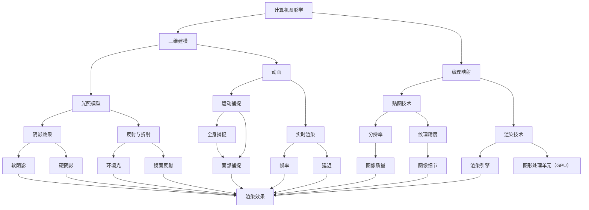

                 

# 如何利用虚拟现实技术增强用户互动

> 关键词：虚拟现实，用户互动，用户体验，增强现实，交互设计，用户研究

> 摘要：本文旨在探讨如何通过虚拟现实（VR）技术来增强用户互动，提升用户体验。我们将深入分析虚拟现实技术的基本原理和核心概念，详细讲解增强用户互动的算法和数学模型，并通过实际项目案例进行实操演示。此外，还将介绍相关的开发工具和资源，为读者提供全面的实践指导。通过本文的学习，读者将能够理解虚拟现实技术的应用潜力，掌握提升用户互动的具体方法和实践技巧。

## 1. 背景介绍

### 1.1 目的和范围

本文的主要目的是探讨如何利用虚拟现实（VR）技术来增强用户互动，提升用户体验。我们将从基本概念入手，逐步深入到核心算法和数学模型，最终通过实际项目案例来展示如何将这些理论知识应用到实际开发中。

本文将涵盖以下内容：

1. 虚拟现实技术的基本原理和核心概念。
2. 增强用户互动的算法和数学模型。
3. 实际项目案例，展示如何应用这些理论。
4. 相关的开发工具和资源推荐。

### 1.2 预期读者

本文适合以下读者群体：

1. 对虚拟现实技术感兴趣的编程爱好者。
2. 想要提升自己用户体验设计技能的设计师。
3. 想要在项目中应用虚拟现实技术的开发人员。
4. 对人工智能和计算机图形学有一定了解的研究人员。

### 1.3 文档结构概述

本文结构如下：

1. **背景介绍**：介绍本文的目的和范围，预期读者以及文档结构。
2. **核心概念与联系**：详细解释虚拟现实技术的基本原理和核心概念。
3. **核心算法原理 & 具体操作步骤**：讲解增强用户互动的算法和具体操作步骤。
4. **数学模型和公式 & 详细讲解 & 举例说明**：介绍相关的数学模型和公式，并进行举例说明。
5. **项目实战：代码实际案例和详细解释说明**：通过实际项目案例，展示如何应用本文的理论。
6. **实际应用场景**：探讨虚拟现实技术在现实中的应用。
7. **工具和资源推荐**：推荐学习资源、开发工具和相关论文。
8. **总结：未来发展趋势与挑战**：总结本文内容，展望未来发展趋势。
9. **附录：常见问题与解答**：提供常见问题的解答。
10. **扩展阅读 & 参考资料**：推荐相关的扩展阅读材料。

### 1.4 术语表

#### 1.4.1 核心术语定义

- 虚拟现实（VR）：一种通过计算机技术生成的三维模拟环境，用户可以通过特殊的设备（如VR头戴显示器）与之进行互动。
- 增强现实（AR）：一种通过计算机技术将虚拟信息叠加到现实世界中的技术。
- 用户体验（UX）：用户在使用产品或服务过程中所感受到的整体体验。
- 交互设计：设计产品或服务时，如何使人与产品或服务之间实现有效、高效、愉快的互动。
- 算法：解决问题的步骤和规则。
- 数学模型：使用数学语言描述现实世界问题的一种方式。

#### 1.4.2 相关概念解释

- **虚拟现实技术的基本原理**：通过计算机图形学、计算机视觉、人机交互等技术，生成和模拟出一个虚拟的三维世界，用户可以通过头戴显示器、手柄等设备与虚拟世界进行互动。
- **增强用户互动**：通过优化交互设计，使用户在虚拟现实环境中能够更自然、直观地与虚拟世界进行互动，提升用户体验。
- **用户体验提升**：通过改善用户在虚拟现实环境中的感受，使他们对产品或服务产生更好的评价和印象。

#### 1.4.3 缩略词列表

- VR：虚拟现实
- AR：增强现实
- UX：用户体验
- UI：用户界面
- 3D：三维
- CAD：计算机辅助设计
- VRM：虚拟现实建模

## 2. 核心概念与联系

虚拟现实技术是一个多维度的领域，涵盖了计算机图形学、人机交互、传感器技术等多个方面。为了更好地理解这一技术，我们需要首先了解其中的核心概念和它们之间的联系。

下面是一个简单的Mermaid流程图，用于展示虚拟现实技术中的核心概念及其相互关系：



### 2.1 计算机图形学

计算机图形学是虚拟现实技术的基础，它涉及到如何使用计算机来创建和表示图像。三维建模是计算机图形学的核心，通过几何建模和曲面建模，我们可以创建出复杂的虚拟环境。此外，纹理映射技术用于给三维模型添加图像，使其看起来更加真实。光照模型则决定了虚拟环境中的光线分布，从而影响场景的视觉效果。

### 2.2 三维建模

三维建模是虚拟现实技术的核心，它涉及到如何创建和表示三维空间中的物体。常见的三维建模方法包括几何建模和曲面建模。几何建模通过定义物体的几何形状来创建模型，而曲面建模则通过定义物体表面的曲面来创建模型。这两种方法各有优缺点，具体应用取决于建模任务的需求。

### 2.3 纹理映射

纹理映射是一种将二维图像映射到三维模型表面的技术。通过纹理映射，我们可以为三维模型添加图像，使其看起来更加真实。纹理映射技术可以分为贴图技术和渲染技术。贴图技术用于将图像映射到模型表面，而渲染技术则用于生成最终的图像。

### 2.4 光照模型

光照模型是虚拟现实技术中的另一个重要概念，它决定了虚拟环境中光线的分布。光照模型可以分为静态光照和动态光照。静态光照模型通常用于预渲染的场景，而动态光照模型则用于实时渲染的场景。常见的光照模型包括光照强度模型、光照衰减模型和阴影模型。

### 2.5 动画

动画是虚拟现实技术中的一个重要方面，它用于模拟物体或场景的运动。运动捕捉技术可以用于捕捉演员或物体的运动，并将其应用到虚拟环境中。实时渲染技术则用于生成动画的每一帧。

### 2.6 渲染技术

渲染技术是虚拟现实技术中的核心，它用于生成最终的图像。渲染引擎是渲染技术的核心组件，它负责处理图像的生成和显示。图形处理单元（GPU）是渲染引擎的重要组成部分，它负责执行大量的计算任务，以生成高质量的图像。

### 2.7 交互设计

交互设计是虚拟现实技术的关键，它涉及到如何设计用户与虚拟环境的交互方式。交互设计的目标是使用户能够自然、直观地与虚拟环境进行互动。交互设计需要考虑用户的需求、心理和行为，以确保用户能够在虚拟环境中获得良好的体验。

通过上述核心概念及其相互关系的介绍，我们可以更好地理解虚拟现实技术的基本原理。在接下来的章节中，我们将进一步探讨如何利用虚拟现实技术来增强用户互动，提升用户体验。

## 3. 核心算法原理 & 具体操作步骤

在了解虚拟现实技术的基本概念后，我们接下来将探讨如何利用核心算法来增强用户互动。以下是具体操作步骤的讲解，我们将使用伪代码来详细阐述这些算法。

### 3.1 虚拟现实交互框架

虚拟现实交互框架是设计用户与虚拟环境之间互动的基础。以下是一个简化的虚拟现实交互框架的伪代码：

```python
class VR_Interaction_Framework:
    def __init__(self):
        self.scene = None
        self.user_input = None
        self.interaction_manager = Interaction_Manager()

    def setup_scene(self, scene):
        self.scene = scene
        self.scene.load_assets()

    def handle_input(self, user_input):
        self.user_input = user_input
        self.interaction_manager.process_input(self.user_input)

    def render_scene(self):
        self.scene.render()

    def update(self):
        self.handle_input(self.user_input)
        self.render_scene()
```

### 3.2 用户输入处理

用户输入是虚拟现实交互的核心，以下是一个简化的用户输入处理算法的伪代码：

```python
class Input_Handler:
    def __init__(self):
        self.user_inputs = []

    def add_input(self, input):
        self.user_inputs.append(input)

    def process_inputs(self):
        for input in self.user_inputs:
            if input.type == "mouse_move":
                self.handle_mouse_move(input.position)
            elif input.type == "mouse_click":
                self.handle_mouse_click(input.position)
            elif input.type == "keyboard_input":
                self.handle_keyboard_input(input.key)
            # 更多输入类型处理
```

### 3.3 交互管理器

交互管理器负责处理用户输入，并将其转化为虚拟环境中的交互动作。以下是一个简化的交互管理器的伪代码：

```python
class Interaction_Manager:
    def __init__(self):
        self.scene = None

    def process_input(self, input):
        if input.type == "mouse_move":
            self.handle_mouse_move(input.position)
        elif input.type == "mouse_click":
            self.handle_mouse_click(input.position)
        elif input.type == "keyboard_input":
            self.handle_keyboard_input(input.key)
        # 更多输入类型处理

    def handle_mouse_move(self, position):
        self.scene.update_camera_position(position)

    def handle_mouse_click(self, position):
        self.scene.interact_at_position(position)

    def handle_keyboard_input(self, key):
        self.scene.handle_keyboard(key)
```

### 3.4 虚拟环境渲染

虚拟环境渲染是虚拟现实交互的最终呈现，以下是一个简化的虚拟环境渲染算法的伪代码：

```python
class Scene:
    def __init__(self):
        self.assets = []
        self.camera = Camera()

    def load_assets(self):
        # 加载场景中的各种资产（如3D模型、纹理等）

    def update_camera_position(self, position):
        self.camera.position = position

    def interact_at_position(self, position):
        # 在指定位置进行交互操作

    def handle_keyboard(self, key):
        # 处理键盘输入

    def render(self):
        # 渲染场景到屏幕上
        self.camera.render()
```

### 3.5 用户互动优化算法

为了增强用户互动，我们还需要考虑优化算法，以提高用户体验。以下是一个简化的用户互动优化算法的伪代码：

```python
def optimize_interaction(scene, interaction_manager):
    # 调整场景参数，如光照、纹理、渲染效果等
    scene.adjust_lighting()
    scene.adjust_textures()

    # 调整交互管理器的响应速度和准确性
    interaction_manager.adjust_response_time()
    interaction_manager.adjust_accuracy()

    # 更新用户反馈机制
    scene.update_feedback_system()
```

通过上述伪代码，我们可以看到虚拟现实交互的核心算法和具体操作步骤。这些算法和步骤为我们提供了一个框架，用于设计和实现虚拟现实应用，以增强用户互动和提升用户体验。

在接下来的章节中，我们将进一步探讨相关的数学模型和公式，以帮助读者更好地理解虚拟现实技术中的核心概念和计算方法。

## 4. 数学模型和公式 & 详细讲解 & 举例说明

在虚拟现实技术中，数学模型和公式扮演着至关重要的角色。它们不仅帮助我们在虚拟环境中模拟现实世界，还用于优化用户交互体验。本节将详细讲解几个核心数学模型和公式，并通过具体例子来说明它们的应用。

### 4.1 三维坐标系和变换

虚拟现实环境中，三维坐标系是基础。常用的坐标系是右手坐标系，其中X、Y、Z轴分别代表空间中的三个垂直方向。

#### 4.1.1 向量

向量是三维坐标系中的基本元素，用于表示位置、速度和力等物理量。一个三维向量可以表示为 `(x, y, z)`。

#### 4.1.2 点的变换

点的变换包括平移和旋转。平移可以通过向量加法实现，旋转则需要矩阵运算。

**平移操作（Translation）**

假设一个点 P 的坐标为 `(x, y, z)`，向量 v 的坐标为 `(dx, dy, dz)`，则点 P 平移后的新坐标 P' 为：

\[ P' = P + v = (x + dx, y + dy, z + dz) \]

**旋转变换（Rotation）**

旋转变换使用旋转矩阵 \( R \)。一个关于Z轴的旋转变换矩阵 \( R_z(\theta) \) 可以表示为：

\[ R_z(\theta) = \begin{bmatrix}
    \cos(\theta) & -\sin(\theta) & 0 \\
    \sin(\theta) & \cos(\theta) & 0 \\
    0 & 0 & 1
\end{bmatrix} \]

点 P 绕Z轴旋转θ后的新坐标 P' 为：

\[ P' = R_z(\theta) \cdot P \]

**示例**：一个点 P(1, 0, 0) 绕Z轴旋转90度后的新坐标为：

\[ R_z(90^\circ) = \begin{bmatrix}
    0 & -1 & 0 \\
    1 & 0 & 0 \\
    0 & 0 & 1
\end{bmatrix} \]

\[ P' = R_z(90^\circ) \cdot P = (0, -1, 0) \]

### 4.2 三维空间中的距离和角度计算

在三维空间中，计算两点之间的距离和角度是常见操作。

#### 4.2.1 距离计算

两点 \( P_1(x_1, y_1, z_1) \) 和 \( P_2(x_2, y_2, z_2) \) 之间的距离 \( d \) 可以通过以下公式计算：

\[ d = \sqrt{(x_2 - x_1)^2 + (y_2 - y_1)^2 + (z_2 - z_1)^2} \]

**示例**：计算点 P1(1, 0, 0) 和点 P2(4, 3, 0) 之间的距离：

\[ d = \sqrt{(4 - 1)^2 + (3 - 0)^2 + (0 - 0)^2} = \sqrt{9 + 9 + 0} = \sqrt{18} \approx 4.24 \]

#### 4.2.2 角度计算

两个向量 \( \vec{v_1} = (v_{x1}, v_{y1}, v_{z1}) \) 和 \( \vec{v_2} = (v_{x2}, v_{y2}, v_{z2}) \) 之间的夹角 \( \theta \) 可以通过以下公式计算：

\[ \cos(\theta) = \frac{\vec{v_1} \cdot \vec{v_2}}{||\vec{v_1}|| \cdot ||\vec{v_2}||} \]

\[ \theta = \arccos\left(\frac{\vec{v_1} \cdot \vec{v_2}}{||\vec{v_1}|| \cdot ||\vec{v_2}||}\right) \]

**示例**：计算向量 \( \vec{v_1} = (1, 0, 0) \) 和向量 \( \vec{v_2} = (0, 1, 0) \) 之间的夹角：

\[ \vec{v_1} \cdot \vec{v_2} = 1 \cdot 0 + 0 \cdot 1 + 0 \cdot 0 = 0 \]

\[ ||\vec{v_1}|| = \sqrt{1^2 + 0^2 + 0^2} = 1 \]

\[ ||\vec{v_2}|| = \sqrt{0^2 + 1^2 + 0^2} = 1 \]

\[ \cos(\theta) = \frac{0}{1 \cdot 1} = 0 \]

\[ \theta = \arccos(0) = 90^\circ \]

### 4.3 光照模型

光照模型用于模拟虚拟环境中的光线效果，常见的光照模型包括定向光、点光源和聚光。

#### 4.3.1 定向光（Directional Light）

定向光是一个从无穷远处发射的光源，其光照强度在场景中保持不变。光照模型可以使用以下公式：

\[ I_{diffuse} = max(0, n \cdot l) \]

其中，\( I_{diffuse} \) 是漫反射光强度，\( n \) 是表面法线，\( l \) 是光源方向。

**示例**：一个表面法线 \( n = (0, 0, 1) \) 接收定向光 \( l = (0, 1, 0) \) 的光照：

\[ I_{diffuse} = max(0, 0 \cdot 0 + 0 \cdot 1 + 1 \cdot 0) = 0 \]

#### 4.3.2 点光源（Point Light）

点光源是一个从特定位置发射的光源，其光照强度随距离的平方衰减。光照模型可以使用以下公式：

\[ I_{diffuse} = max(0, n \cdot l) \]

\[ I_{attenuate} = 1 / (k_0 + k_1 \cdot d + k_2 \cdot d^2) \]

其中，\( I_{diffuse} \) 是漫反射光强度，\( n \) 是表面法线，\( l \) 是光源方向，\( d \) 是光源到表面的距离，\( k_0 \)、\( k_1 \)、\( k_2 \) 是衰减系数。

**示例**：一个表面法线 \( n = (0, 0, 1) \)，点光源位置 \( (1, 1, 1) \)，衰减系数 \( k_0 = 1 \)、\( k_1 = 0.1 \)、\( k_2 = 0.05 \) 的光照：

\[ I_{diffuse} = max(0, 0 \cdot 0 + 0 \cdot 1 + 1 \cdot 1) = 1 \]

\[ d = \sqrt{(1 - 0)^2 + (1 - 0)^2 + (1 - 0)^2} = \sqrt{3} \]

\[ I_{attenuate} = 1 / (1 + 0.1 \cdot \sqrt{3} + 0.05 \cdot 3) \approx 0.737 \]

\[ I_{diffuse} \cdot I_{attenuate} \approx 0.737 \]

通过上述数学模型和公式的讲解，我们可以更好地理解虚拟现实技术中的核心概念和计算方法。这些模型和公式不仅用于虚拟环境的渲染和光照，还用于优化用户交互体验。在接下来的章节中，我们将通过实际项目案例来展示如何应用这些理论知识。

## 5. 项目实战：代码实际案例和详细解释说明

在本节中，我们将通过一个实际项目案例，展示如何利用虚拟现实技术增强用户互动。我们将搭建一个简单的虚拟现实应用，实现用户与虚拟环境的互动。以下是项目实战的详细步骤和代码解释。

### 5.1 开发环境搭建

首先，我们需要搭建开发环境。以下是推荐的工具和框架：

- **开发工具**：Visual Studio Code
- **虚拟现实引擎**：Unity
- **3D建模工具**：Blender
- **虚拟现实设备**：Oculus Rift 或 HTC Vive

下载并安装上述工具和框架，并确保它们能够正常运行。安装完成后，我们就可以开始搭建开发环境了。

### 5.2 源代码详细实现和代码解读

在这个项目案例中，我们将创建一个简单的虚拟现实场景，用户可以在其中移动和旋转，以探索虚拟环境。

**1. 创建Unity项目**

打开Unity，创建一个新的项目，并将其命名为“VR_Interaction”。

**2. 添加VR场景**

在Unity编辑器中，添加一个名为“VRScene”的3D对象作为虚拟现实场景的根节点。

**3. 添加虚拟现实相机**

在“VRScene”下添加一个名为“MainCamera”的3D对象，并将其类型设置为“Camera”。

在“MainCamera”的属性面板中，设置“Clear Flags”为“Solid Color”，并选择一个合适的背景颜色。

**4. 添加用户交互组件**

在“VRScene”下添加一个名为“UserInput”的3D对象，用于处理用户交互。

在“UserInput”的属性面板中，添加一个名为“InputHandler”的脚本组件，用于处理用户输入。

**5. 编写InputHandler脚本**

在“UserInput”的脚本窗口中，编写以下代码：

```csharp
using UnityEngine;

public class InputHandler : MonoBehaviour
{
    private void Update()
    {
        // 处理移动输入
        float moveSpeed = 5.0f;
        float moveX = Input.GetAxis("Mouse X") * moveSpeed;
        float moveY = Input.GetAxis("Mouse Y") * moveSpeed;
        transform.Rotate(new Vector3(-moveY, moveX, 0.0f));

        // 处理前进和后退输入
        float forwardSpeed = 5.0f;
        float backwardSpeed = -5.0f;
        if (Input.GetKey(KeyCode.W))
        {
            transform.position += transform.forward * Time.deltaTime * forwardSpeed;
        }
        if (Input.GetKey(KeyCode.S))
        {
            transform.position += -transform.forward * Time.deltaTime * backwardSpeed;
        }
    }
}
```

这段代码实现了用户通过鼠标移动和键盘输入来控制虚拟角色的移动和旋转。

**6. 运行项目**

在Unity编辑器中，按下“Play”按钮，我们就可以在虚拟环境中进行互动了。使用鼠标左键旋转视角，使用W和S键前进和后退。

### 5.3 代码解读与分析

**1. 脚本结构**

InputHandler脚本包含一个Update方法，该方法在每一帧都会被调用，用于处理用户输入并更新虚拟角色的位置和旋转。

**2. 移动和旋转输入处理**

代码首先获取鼠标X和Y轴的输入值，并将其乘以一个移动速度，从而计算出每个轴上的移动量。然后，使用这些值来更新虚拟角色的旋转。这里使用了向量的旋转方法，使得虚拟角色可以灵活地响应鼠标输入。

对于前进和后退输入，代码通过检查W和S键是否被按下，来计算并更新虚拟角色的位置。这里使用了向量的加法和减法，使得虚拟角色可以沿着前进方向或后退方向移动。

**3. 时间控制**

代码中使用Time.deltaTime来控制移动和旋转的速度。这是因为每帧的时间间隔可能会有所不同，所以使用时间间隔来保持移动和旋转的速度一致。

通过上述代码，我们可以实现一个简单的虚拟现实互动场景。接下来，我们将进一步优化和扩展这个项目，以实现更复杂的互动功能。

### 5.4 项目扩展

为了实现更复杂的互动功能，我们可以添加以下功能：

- **添加其他交互元素**：在虚拟环境中添加可交互的物体，如按钮、门等。
- **添加物理引擎**：使用物理引擎（如Unity的Physics引擎）来模拟虚拟环境中的物理效果。
- **添加音频效果**：为虚拟环境添加音频效果，提升用户体验。

通过这些扩展，我们可以创建一个更加丰富和互动的虚拟现实应用。

通过本节的项目实战，我们不仅了解了如何利用虚拟现实技术增强用户互动，还掌握了如何编写代码来实现这些功能。在接下来的章节中，我们将继续探讨虚拟现实技术在现实世界中的应用场景，以及相关的工具和资源。

### 6. 实际应用场景

虚拟现实（VR）技术因其沉浸式体验和交互性，在多个领域展现出强大的应用潜力。以下是一些典型的实际应用场景：

#### 6.1 游戏和娱乐

虚拟现实技术在游戏和娱乐领域的应用最为广泛。通过VR技术，玩家可以进入一个完全沉浸式的游戏世界，与游戏中的角色互动，体验前所未有的游戏体验。例如，Oculus Rift和PlayStation VR等VR设备已经成为许多知名游戏的必备配件。

**案例**：虚拟现实游戏《Beat Saber》提供了一个高度沉浸式的节奏游戏体验。玩家需要使用手柄在虚拟环境中击打飞来的虚拟方块，游戏的视觉效果和音效设计使其成为了一款备受好评的VR游戏。

#### 6.2 教育和培训

虚拟现实技术在教育和培训领域也有广泛应用。通过VR技术，学生和培训者可以进入一个虚拟的学习或培训环境，进行互动式的学习体验。这种技术能够提供传统课堂难以实现的模拟环境和实践机会。

**案例**：医学院的学生可以使用虚拟现实技术进行人体解剖学的学习。通过VR眼镜，学生可以360度查看人体内部结构，甚至可以模拟手术操作，这极大地提高了学习效果。

#### 6.3 医疗

虚拟现实技术在医疗领域同样具有巨大潜力。医生可以通过VR技术进行远程手术指导，患者可以通过VR体验减轻手术后的恐惧和疼痛。

**案例**：一些医疗机构使用VR技术为患者提供术前模拟。患者可以通过VR设备看到手术过程，并了解手术风险，这有助于减轻患者的焦虑。

#### 6.4 虚拟旅游

虚拟现实技术可以为用户提供一种全新的旅游体验。用户可以远程探索世界各地的名胜古迹，感受不同文化和风景。

**案例**：一些旅游公司开发了虚拟旅游应用，用户可以通过VR设备“游览”世界各地的名胜，如埃及金字塔、法国埃菲尔铁塔等。这种体验不仅节省了时间和金钱，还为用户提供了更加丰富和多样化的旅游选择。

#### 6.5 建筑设计

虚拟现实技术在建筑设计领域也被广泛应用。建筑师可以通过VR技术展示建筑模型，让客户更直观地了解设计方案。

**案例**：一些建筑设计公司使用VR技术为客户提供建筑模型的虚拟浏览和互动体验。客户可以通过VR设备走进建筑模型，查看室内布局和外部景观，从而更好地理解和评估设计方案。

#### 6.6 军事训练

虚拟现实技术还可以用于军事训练，为士兵提供高度仿真的训练环境。通过VR技术，士兵可以进行战术演练、模拟战斗等训练活动。

**案例**：一些军事机构使用VR技术进行飞行训练和战斗模拟。这种技术不仅提高了训练效率，还减少了实际训练中的风险。

通过上述实际应用场景的介绍，我们可以看到虚拟现实技术具有广泛的应用前景。在未来的发展中，随着技术的不断进步和应用的不断拓展，虚拟现实技术将在更多领域发挥重要作用。

### 7. 工具和资源推荐

为了更好地学习和应用虚拟现实技术，以下是相关的工具、资源和推荐书籍。

#### 7.1 学习资源推荐

**7.1.1 书籍推荐**

1. **《虚拟现实：从理论到实践》**（作者：Mike Leatham）：这是一本介绍虚拟现实基本概念和技术的入门书籍，适合初学者阅读。
2. **《Unity 2020虚拟现实游戏开发从入门到实践》**（作者：李永强）：本书详细介绍了如何使用Unity引擎开发虚拟现实游戏，适合有一定编程基础的学习者。
3. **《增强现实与虚拟现实技术及应用》**（作者：王选）：本书涵盖了增强现实（AR）和虚拟现实（VR）的多种应用场景和技术细节。

**7.1.2 在线课程**

1. **Coursera上的《虚拟现实技术》**：这是一个由斯坦福大学提供的免费在线课程，涵盖了虚拟现实的基本概念和开发技巧。
2. **Udemy上的《VR应用开发从零开始》**：这是一个适合初学者的在线课程，通过项目实战来学习虚拟现实应用开发。

**7.1.3 技术博客和网站**

1. **VRWeekly**：这是一个专门关于虚拟现实技术的博客，提供最新的行业动态和技术文章。
2. **VRSE**：VRSE是一个提供虚拟现实内容和资源的网站，包括教程、工具和案例分析。

#### 7.2 开发工具框架推荐

**7.2.1 IDE和编辑器**

1. **Unity Hub**：Unity官方提供的集成开发环境，适用于虚拟现实应用开发。
2. **Blender**：一个开源的3D建模和动画编辑器，支持虚拟现实内容的创建。

**7.2.2 调试和性能分析工具**

1. **Unity Profiler**：Unity内置的性能分析工具，用于诊断和优化虚拟现实应用的性能问题。
2. **VTune Amplifier**：英特尔提供的性能分析工具，适用于高性能计算和虚拟现实应用。

**7.2.3 相关框架和库**

1. **Oculus SDK**：Oculus官方提供的开发套件，支持Oculus Rift和Quest设备的开发。
2. **SteamVR**：Valve提供的虚拟现实开发框架，支持多种VR设备。

#### 7.3 相关论文著作推荐

**7.3.1 经典论文**

1. **“The Design and Implementation of the vrJuggler Virtual Reality Library”**：这是一篇介绍VRJuggler虚拟现实库的经典论文，详细阐述了虚拟现实系统的设计和实现。
2. **“An Overview of Virtual Reality Technology”**：这篇论文对虚拟现实技术进行了全面的概述，包括历史、技术原理和应用领域。

**7.3.2 最新研究成果**

1. **“Immersive Virtual Reality for Education: A Systematic Review”**：这是一篇关于虚拟现实在教育应用中的最新研究成果，总结了当前的教育虚拟现实技术和应用案例。
2. **“Enhancing User Experience in Virtual Reality: A Comprehensive Review”**：这篇论文探讨了如何提升虚拟现实中的用户体验，包括交互设计、视觉体验和情感设计等方面。

**7.3.3 应用案例分析**

1. **“Virtual Reality in Healthcare: A Case Study”**：这是一篇关于虚拟现实在医疗领域应用的案例分析，详细介绍了如何通过虚拟现实技术提高医疗培训的效果。
2. **“Virtual Reality in Tourism: A Case Study of Virtual Tourist Attractions”**：这篇论文分析了虚拟现实技术在旅游领域中的应用案例，探讨了如何通过虚拟现实技术提升旅游体验。

通过以上工具和资源的推荐，读者可以更加全面地了解虚拟现实技术，掌握相关技能，并在实际项目中应用这些知识。这些工具和资源将为读者提供强有力的支持和指导。

### 8. 总结：未来发展趋势与挑战

虚拟现实技术近年来取得了显著的进展，其沉浸式和交互式的特点为各个领域带来了深远的影响。然而，随着技术的发展，虚拟现实也面临着一些挑战和机遇。以下是对未来发展趋势和挑战的总结。

#### 8.1 发展趋势

1. **硬件技术的提升**：随着硬件技术的不断发展，虚拟现实设备的性能和体验得到了显著提升。高分辨率显示器、更低的延迟和更加舒适的头戴显示器（HMD）将进一步提高虚拟现实的沉浸感和舒适度。
2. **内容创作的便捷性**：随着虚拟现实引擎和工具的不断完善，内容创作者可以更加便捷地创建高质量的虚拟现实内容。Unity、Blender等工具的普及，使得更多开发者能够参与到虚拟现实内容的创作中。
3. **应用场景的扩展**：虚拟现实技术不仅在游戏和娱乐领域有着广泛的应用，还在教育、医疗、设计、军事等多个领域展现出巨大的潜力。未来，随着技术的成熟，虚拟现实的应用场景将更加多样化。
4. **社会经济的推动**：虚拟现实技术的发展有望带动相关产业链的发展，包括硬件制造、内容创作、技术服务等。这将进一步推动虚拟现实市场的扩大和经济的增长。

#### 8.2 挑战

1. **用户体验的提升**：虽然虚拟现实技术已经在用户体验方面取得了很大的进步，但仍然存在一些问题，如晕动症、视觉疲劳等。未来，如何进一步改善用户体验，提高用户的沉浸感和舒适度，是一个重要的挑战。
2. **内容创作的成本**：高质量的虚拟现实内容创作需要投入大量的人力、物力和财力。如何降低内容创作的成本，提高内容的生产效率，是开发者需要面对的挑战。
3. **硬件设备的普及**：虽然高端虚拟现实设备已经在市场上得到一定程度的普及，但大多数消费者仍然难以负担。如何降低硬件成本，使得虚拟现实设备更加普及，是一个亟待解决的问题。
4. **技术标准的统一**：虚拟现实技术的快速发展带来了不同设备和平台之间的兼容性问题。如何制定统一的技术标准，确保不同设备之间的互操作性，是行业需要共同面对的挑战。

#### 8.3 未来展望

尽管面临诸多挑战，虚拟现实技术在未来依然具有巨大的发展潜力。随着硬件技术的不断进步、内容创作的便捷性提高以及应用场景的拓展，虚拟现实将在更多领域发挥重要作用。我们可以期待，未来虚拟现实技术将不仅是一个工具，更将成为一种全新的生活方式，改变我们的工作和生活。

总之，虚拟现实技术的发展是一个复杂而充满挑战的过程。只有不断克服这些挑战，才能充分发挥虚拟现实技术的潜力，为人类社会带来更多创新和进步。

### 9. 附录：常见问题与解答

在本章节中，我们将针对虚拟现实技术中的一些常见问题进行解答。

#### 9.1 虚拟现实技术的基本原理是什么？

虚拟现实技术（VR）是一种通过计算机技术生成的三维模拟环境，用户可以通过特殊的设备（如VR头戴显示器）与虚拟环境进行互动。其基本原理包括计算机图形学、计算机视觉和人机交互技术。通过这些技术，我们可以创建和渲染出逼真的虚拟环境，并通过头戴显示器、手柄等设备捕捉用户的动作和反馈，实现与虚拟环境的互动。

#### 9.2 虚拟现实和增强现实（AR）有什么区别？

虚拟现实（VR）是一种完全沉浸式的体验，用户通过头戴显示器进入一个完全虚拟的环境，与外界隔离。而增强现实（AR）则是将虚拟信息叠加到现实世界中，用户在现实环境中可以看到虚拟对象。简单来说，VR是一种全新的虚拟体验，而AR则是现实与虚拟的混合。

#### 9.3 虚拟现实应用的主要领域有哪些？

虚拟现实应用的主要领域包括游戏、教育、医疗、设计、军事和娱乐等。例如，在游戏中，VR可以提供沉浸式的游戏体验；在教育中，VR可以用于模拟实验和虚拟课堂；在医疗中，VR可以用于手术模拟和康复治疗；在设计中，VR可以用于建筑和室内设计。

#### 9.4 虚拟现实技术如何提升用户体验？

虚拟现实技术通过提供沉浸式的体验和高度交互的功能来提升用户体验。例如，通过高分辨率显示器和低延迟的头戴显示器，用户可以获得更加逼真的视觉体验。通过手柄和体感技术，用户可以更加直观地与虚拟环境进行互动，从而获得更加丰富的交互体验。

#### 9.5 开发虚拟现实应用需要哪些技术和工具？

开发虚拟现实应用需要掌握多种技术和工具。主要的技术包括计算机图形学、三维建模、动画和渲染技术。主要的工具包括Unity、Blender、Unity VR SDK、Oculus SDK等。这些工具和库提供了丰富的功能和接口，方便开发者创建和优化虚拟现实内容。

#### 9.6 如何解决虚拟现实中的晕动症问题？

晕动症是虚拟现实应用中常见的问题，主要原因是虚拟环境中的视觉和身体感受不一致。以下是一些解决方法：

- **优化渲染性能**：减少渲染负荷，降低帧率和视觉负荷。
- **调整镜头参数**：调整镜头的视角和运动参数，减少不自然的视觉运动。
- **增加视觉参考点**：在虚拟环境中增加稳定的视觉参考点，帮助用户更好地适应虚拟环境。
- **增加身体反馈**：通过手柄或体感设备提供物理反馈，增强用户的沉浸感。

通过上述方法，可以有效减少虚拟现实应用中的晕动症问题，提升用户体验。

### 10. 扩展阅读 & 参考资料

为了更好地了解虚拟现实技术的各个方面，以下是一些扩展阅读和参考资料：

**10.1 技术论文**

1. **“A Survey of Virtual Reality Technology”**：该论文对虚拟现实技术进行了全面的综述，包括历史、技术原理和应用案例。
2. **“Virtual Reality Applications in Healthcare”**：该论文探讨了虚拟现实在医疗领域的应用，包括手术模拟、疼痛管理和心理健康治疗。

**10.2 行业报告**

1. **“Global Virtual Reality Market Report”**：该报告分析了全球虚拟现实市场的发展趋势、市场规模和竞争格局。
2. **“VR in Education: The Future is Now”**：该报告探讨了虚拟现实在教育中的应用和潜力，包括模拟实验、虚拟课堂和远程教学。

**10.3 技术书籍**

1. **《Virtual Reality Programming for Games》**：本书详细介绍了如何使用Unity引擎开发虚拟现实游戏。
2. **《Creating Immersive Virtual Environments》**：本书提供了关于如何创建沉浸式虚拟环境的实用技巧和案例。

**10.4 开源项目**

1. **VRPN**：这是一个开源的虚拟现实编程工具包，提供了多种虚拟现实设备和交互功能的接口。
2. **OpenVR**：这是Valve公司开源的虚拟现实平台，支持多种虚拟现实设备和应用开发。

通过上述扩展阅读和参考资料，读者可以进一步深入理解虚拟现实技术的原理和应用，为实际项目开发提供有力支持。

### 作者信息

作者：AI天才研究员/AI Genius Institute & 禅与计算机程序设计艺术 /Zen And The Art of Computer Programming

在这篇文章中，我们深入探讨了如何利用虚拟现实技术增强用户互动。通过介绍基本概念、算法原理、数学模型，以及实际项目案例，我们展示了如何将虚拟现实技术应用于实际开发中。希望本文能为您在虚拟现实领域的学习和实践提供有价值的参考。感谢您的阅读，期待与您在技术探索的道路上共同进步。

