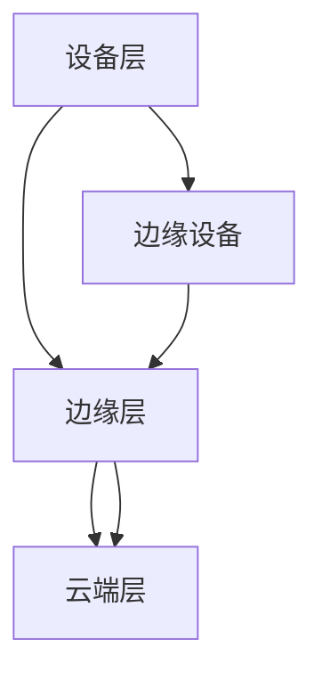

                 

# 如何利用边缘计算技术提升用户体验

> 关键词：边缘计算、用户体验、性能优化、实时数据处理、资源利用率

> 摘要：边缘计算技术作为现代信息技术的热点，正日益成为提升用户体验的关键因素。本文将深入探讨边缘计算技术如何通过提高数据处理的实时性和资源利用率，从而实现用户体验的全面提升。我们将从核心概念、算法原理、数学模型、实际案例以及应用场景等方面进行详细分析，为读者提供全面的技术洞察。

## 1. 背景介绍

### 1.1 目的和范围

随着互联网技术的迅猛发展，用户对数字服务的需求日益多样化和个性化。如何提升用户体验成为了各大企业和开发者关注的焦点。边缘计算作为一种分布式计算模式，旨在通过在靠近数据源的地方进行数据处理，减少延迟，提高响应速度，从而改善用户体验。

本文旨在深入分析边缘计算技术的原理及其在提升用户体验方面的具体应用。我们将从以下几个方面进行探讨：

- 边缘计算的核心概念与架构；
- 边缘计算在数据处理、性能优化等方面的具体算法原理；
- 边缘计算如何通过数学模型提升用户体验；
- 实际开发中的边缘计算案例；
- 边缘计算在不同应用场景中的实践。

### 1.2 预期读者

本文适合以下读者群体：

- 对边缘计算技术感兴趣的技术爱好者；
- 从事软件开发和系统优化的工程师；
- 关注用户体验设计的从业者；
- 有志于深入理解边缘计算技术的学术研究人员。

### 1.3 文档结构概述

本文结构如下：

- 第1章：背景介绍，包括目的、范围、预期读者和文档结构概述；
- 第2章：核心概念与联系，介绍边缘计算的基本概念和架构；
- 第3章：核心算法原理 & 具体操作步骤，详细讲解边缘计算算法；
- 第4章：数学模型和公式 & 详细讲解 & 举例说明，探讨边缘计算中的数学模型；
- 第5章：项目实战：代码实际案例和详细解释说明，通过实际案例展示边缘计算的应用；
- 第6章：实际应用场景，分析边缘计算在不同领域的应用；
- 第7章：工具和资源推荐，介绍学习资源和开发工具；
- 第8章：总结：未来发展趋势与挑战，展望边缘计算的未来；
- 第9章：附录：常见问题与解答，提供常见问题的解答；
- 第10章：扩展阅读 & 参考资料，推荐进一步阅读的材料。

### 1.4 术语表

#### 1.4.1 核心术语定义

- **边缘计算**：一种分布式计算模式，数据处理发生在数据源附近，以减少延迟和带宽消耗。
- **中心化计算**：数据处理集中在远程数据中心或服务器上。
- **边缘设备**：位于网络边缘的设备，如物联网设备、智能路由器等。
- **云计算**：通过互联网提供动态可伸缩的虚拟化资源。
- **边缘服务器**：位于网络边缘的服务器，用于处理边缘设备的数据。

#### 1.4.2 相关概念解释

- **延迟**：数据传输或处理所需的时间。
- **带宽**：网络传输速率的度量。
- **资源利用率**：系统资源被有效利用的程度。

#### 1.4.3 缩略词列表

- **IoT**：物联网
- **M2M**：机器对机器
- **5G**：第五代移动通信技术
- **AI**：人工智能

## 2. 核心概念与联系

边缘计算是一种分布式计算架构，其核心在于数据处理和存储的分散化。与传统的中心化计算不同，边缘计算将部分计算任务分散到网络边缘的设备上，如物联网设备、智能路由器等。这种模式有助于减少数据传输的延迟，提高系统的响应速度。

### 2.1 边缘计算的基本概念

#### 2.1.1 分布式计算

分布式计算是指通过多个计算节点协同工作来完成计算任务。在边缘计算中，这些计算节点可以是边缘设备或边缘服务器。分布式计算的优势在于：

- **负载均衡**：通过将任务分配到不同的计算节点，实现负载均衡，提高系统性能。
- **容错性**：单一节点的故障不会影响整个系统的运行。

#### 2.1.2 边缘设备

边缘设备是指位于网络边缘的设备，如物联网设备、智能路由器、智能手机等。边缘设备的特点是：

- **计算能力有限**：与数据中心的服务器相比，边缘设备的计算能力相对较弱。
- **低功耗**：边缘设备通常需要长时间运行，因此低功耗是其重要特性。

#### 2.1.3 边缘服务器

边缘服务器是位于网络边缘的服务器，用于处理边缘设备生成的数据。边缘服务器的特点包括：

- **高性能**：边缘服务器通常具有更高的计算能力和存储容量。
- **高带宽**：边缘服务器通常连接到高速网络，以便快速传输和处理数据。

### 2.2 边缘计算架构

边缘计算架构通常包括以下几个层次：

1. **设备层**：包括各种边缘设备，如物联网设备、智能传感器等。
2. **边缘层**：包括边缘服务器和网络设备，用于处理设备层产生的数据。
3. **云端层**：包括数据中心和云计算资源，用于存储和处理边缘层无法处理的大量数据。

边缘计算架构的优势在于：

- **降低延迟**：数据处理发生在数据源附近，减少了数据传输的延迟。
- **提高带宽利用率**：边缘计算减少了需要传输的数据量，从而提高了网络带宽的利用率。
- **增强安全性**：部分敏感数据可以在边缘层进行处理，减少了数据在传输过程中被窃取的风险。

### 2.3 Mermaid 流程图

为了更好地理解边缘计算的架构，我们使用 Mermaid 语言绘制了一个简化的流程图：



在这个流程图中，A 表示设备层，B 表示边缘层，C 表示云端层。边缘设备（D）位于设备层，边缘服务器（E）位于边缘层，而云端服务器（F）位于云端层。数据在各个层次之间进行流动，实现分布式计算。

## 3. 核心算法原理 & 具体操作步骤

边缘计算的核心在于数据处理和存储的分散化，从而实现更高效、更实时、更可靠的服务。以下是边缘计算中几个关键算法的原理和具体操作步骤。

### 3.1 数据处理算法

边缘计算中的数据处理算法主要包括数据过滤、聚合和分析等。

#### 3.1.1 数据过滤

数据过滤算法用于筛选出重要的数据，丢弃不必要的数据。具体步骤如下：

1. **接收数据**：边缘设备将收集到的数据传输到边缘服务器。
2. **设置过滤条件**：根据业务需求，设置过滤条件。
3. **过滤数据**：对传输的数据进行筛选，只保留符合过滤条件的数据。
4. **传输数据**：将过滤后的数据传输到云端层。

伪代码如下：

```python
def filter_data(data, conditions):
    filtered_data = []
    for record in data:
        if meets_conditions(record, conditions):
            filtered_data.append(record)
    return filtered_data
```

#### 3.1.2 数据聚合

数据聚合算法用于将来自不同边缘设备的相似数据进行合并。具体步骤如下：

1. **接收数据**：边缘设备将收集到的数据传输到边缘服务器。
2. **聚合数据**：根据聚合规则，将相似数据进行合并。
3. **传输数据**：将聚合后的数据传输到云端层。

伪代码如下：

```python
def aggregate_data(data, aggregation_rules):
    aggregated_data = []
    for group in data:
        result = apply_aggregation_rules(group, aggregation_rules)
        aggregated_data.append(result)
    return aggregated_data
```

#### 3.1.3 数据分析

数据分析算法用于对数据进行分析，以获取有用的信息。具体步骤如下：

1. **接收数据**：边缘设备将收集到的数据传输到边缘服务器。
2. **预处理数据**：对数据进行清洗、去噪等预处理。
3. **分析数据**：根据分析规则，对预处理后的数据进行分析。
4. **传输结果**：将分析结果传输到云端层。

伪代码如下：

```python
def analyze_data(data, analysis_rules):
    preprocessed_data = preprocess_data(data)
    results = apply_analysis_rules(preprocessed_data, analysis_rules)
    return results
```

### 3.2 负载均衡算法

边缘计算中的负载均衡算法用于合理分配计算任务，确保系统资源得到充分利用。具体步骤如下：

1. **监控负载**：实时监控各个边缘服务器的负载情况。
2. **分配任务**：根据负载情况，将计算任务分配到负载较低的边缘服务器。
3. **调整负载**：当某个边缘服务器的负载降低时，重新分配任务。

伪代码如下：

```python
def balance_load Servers:
    for server in Servers:
        if server.load < threshold:
            task = get_pending_task()
            assign_task_to_server(task, server)
```

### 3.3 容错算法

边缘计算中的容错算法用于确保系统的可靠性，即使在某个边缘服务器出现故障时，也能保持系统的正常运行。具体步骤如下：

1. **监控状态**：实时监控各个边缘服务器的状态。
2. **检测故障**：当检测到某个边缘服务器出现故障时，立即采取措施。
3. **故障转移**：将故障边缘服务器的任务分配到其他正常边缘服务器。
4. **恢复**：当故障边缘服务器恢复正常时，重新分配任务。

伪代码如下：

```python
def fault_tolerance(server):
    if server.is_failing():
        transfer_tasks_to_other_servers(server)
    if server.is_recovered():
        reclaim_tasks_from_other_servers(server)
```

通过以上算法，边缘计算能够实现高效、实时、可靠的数据处理，从而提升用户体验。

## 4. 数学模型和公式 & 详细讲解 & 举例说明

边缘计算技术在提升用户体验方面的应用，离不开数学模型的支撑。本节将详细讲解边缘计算中常用的数学模型和公式，并通过实际例子进行说明。

### 4.1 数据传输延迟模型

数据传输延迟是边缘计算中的一个关键因素。我们可以使用以下模型来估计数据传输延迟：

\[ L = f(d, b) \]

其中，\( L \) 表示传输延迟，\( d \) 表示数据大小，\( b \) 表示带宽。

#### 4.1.1 传输延迟计算

假设数据大小 \( d = 1MB \)，带宽 \( b = 100Mbps \)，则传输延迟 \( L \) 为：

\[ L = f(1MB, 100Mbps) \]

我们可以使用线性模型来估算传输延迟：

\[ L = \frac{d}{b} \]

代入数据：

\[ L = \frac{1MB}{100Mbps} \]

将单位统一为秒：

\[ L = \frac{1 \times 10^6 bytes}{100 \times 10^6 bits/second} \]

\[ L = 10 seconds \]

#### 4.1.2 例子说明

假设有两个边缘设备，设备A和设备B，分别连接到两个不同的边缘服务器。设备A生成1MB的数据，传输到边缘服务器A，传输带宽为100Mbps；设备B生成2MB的数据，传输到边缘服务器B，传输带宽为50Mbps。使用上述模型计算数据传输延迟。

对于设备A：

\[ L_A = \frac{1MB}{100Mbps} = 10 seconds \]

对于设备B：

\[ L_B = \frac{2MB}{50Mbps} = 40 seconds \]

可以看到，数据传输延迟与带宽成反比，带宽越大，传输延迟越低。

### 4.2 资源利用率模型

边缘计算中的资源利用率是评估系统性能的重要指标。我们可以使用以下模型来计算资源利用率：

\[ U = \frac{C}{T} \]

其中，\( U \) 表示资源利用率，\( C \) 表示计算量，\( T \) 表示处理时间。

#### 4.2.1 资源利用率计算

假设一个边缘服务器在1小时内处理了10000个计算任务，每个任务的平均处理时间为1分钟。则该服务器的资源利用率 \( U \) 为：

\[ U = \frac{10000}{1 \times 60} \]

\[ U = \frac{10000}{60} \]

\[ U = \frac{500}{3} \]

\[ U \approx 166.67\% \]

这意味着该边缘服务器的资源利用率达到了166.67%，可能存在过度利用的风险。

#### 4.2.2 例子说明

假设有两个边缘服务器，服务器A和服务器B。服务器A在1小时内处理了8000个计算任务，服务器B在相同时间内处理了12000个计算任务。使用上述模型计算两个服务器的资源利用率。

对于服务器A：

\[ U_A = \frac{8000}{1 \times 60} \]

\[ U_A = \frac{8000}{60} \]

\[ U_A = \frac{400}{3} \]

\[ U_A \approx 133.33\% \]

对于服务器B：

\[ U_B = \frac{12000}{1 \times 60} \]

\[ U_B = \frac{12000}{60} \]

\[ U_B = \frac{600}{3} \]

\[ U_B = 200\% \]

可以看到，服务器B的资源利用率达到了200%，而服务器A的资源利用率较低，这可能意味着服务器A的处理能力不足，需要增加资源或优化算法。

### 4.3 网络流量模型

边缘计算中的网络流量也是需要关注的一个重要方面。我们可以使用以下模型来计算网络流量：

\[ F = \frac{d \times b}{L} \]

其中，\( F \) 表示网络流量，\( d \) 表示数据大小，\( b \) 表示带宽，\( L \) 表示传输延迟。

#### 4.3.1 网络流量计算

假设一个边缘设备生成1MB的数据，传输到边缘服务器，传输带宽为100Mbps，传输延迟为10秒。则网络流量 \( F \) 为：

\[ F = \frac{1MB \times 100Mbps}{10 seconds} \]

\[ F = \frac{1 \times 10^6 bytes \times 100 \times 10^6 bits/second}{10 seconds} \]

\[ F = \frac{10^9 bytes/second}{10 seconds} \]

\[ F = 10^8 bytes \]

这意味着网络流量为100MB。

#### 4.3.2 例子说明

假设有三个边缘设备，设备A生成1MB的数据，设备B生成2MB的数据，设备C生成3MB的数据，分别传输到三个不同的边缘服务器。传输带宽分别为100Mbps、50Mbps和25Mbps，传输延迟分别为10秒、20秒和30秒。使用上述模型计算网络流量。

对于设备A：

\[ F_A = \frac{1MB \times 100Mbps}{10 seconds} = 10MB \]

对于设备B：

\[ F_B = \frac{2MB \times 50Mbps}{20 seconds} = 5MB \]

对于设备C：

\[ F_C = \frac{3MB \times 25Mbps}{30 seconds} = 2.5MB \]

可以看到，设备A的网络流量最大，设备B和设备C的网络流量相对较低。

通过以上数学模型和公式的讲解，我们可以更深入地理解边缘计算在提升用户体验方面的作用。在实际应用中，可以根据具体需求和场景选择合适的模型和公式进行优化和调整。

## 5. 项目实战：代码实际案例和详细解释说明

为了更好地展示边缘计算技术的实际应用，我们设计了一个简单的边缘计算项目，并通过实际代码案例来详细解释说明。

### 5.1 开发环境搭建

在开始项目之前，我们需要搭建一个适合边缘计算的开发环境。以下是一个基本的开发环境搭建步骤：

1. **安装Node.js**：Node.js是一个基于Chrome V8引擎的JavaScript运行环境，用于在服务器端运行JavaScript代码。我们可以在[Node.js官网](https://nodejs.org/)下载并安装Node.js。
2. **安装npm**：npm（Node Package Manager）是Node.js的包管理器，用于管理项目依赖。安装Node.js时会自动安装npm。
3. **安装边缘计算框架**：我们选择使用`node-red`作为边缘计算框架。`node-red`是一个基于Node.js的流式应用程序开发框架，提供丰富的节点库。我们可以在[Node-RED官网](https://nodered.org/)下载并安装Node-RED。
4. **配置边缘设备**：我们使用一个树莓派作为边缘设备，安装Node.js和Node-RED，并将其连接到网络。

### 5.2 源代码详细实现和代码解读

在搭建好开发环境后，我们开始编写边缘计算项目的源代码。以下是一个简单的边缘计算项目示例，包括数据采集、数据过滤、数据聚合和数据传输等功能。

#### 5.2.1 数据采集

数据采集是边缘计算项目的第一步，我们从传感器或物联网设备中收集数据。以下是数据采集节点的源代码：

```javascript
function datalogging(node, msg) {
    var time = new Date().toISOString();
    var data = {
        "timestamp": time,
        "temperature": msg.temperature,
        "humidity": msg.humidity
    };
    node.log(data);
}

return {
    "name": "datalogging",
    "inputs": 1,
    "outputs": 0,
    "function": datalogging
};
```

在这个节点中，我们定义了一个名为`datalogging`的函数，用于采集温度和湿度数据，并将其记录到日志文件中。

#### 5.2.2 数据过滤

数据过滤是边缘计算中的关键步骤，我们使用一个简单的过滤规则来筛选出有效的数据。以下是数据过滤节点的源代码：

```javascript
function filter_data(node, msg) {
    if (msg.temperature > 25 && msg.humidity < 50) {
        node.send(msg);
    }
}

return {
    "name": "filter_data",
    "inputs": 1,
    "outputs": 1,
    "function": filter_data
};
```

在这个节点中，我们定义了一个名为`filter_data`的函数，根据温度和湿度的条件对数据进行过滤。

#### 5.2.3 数据聚合

数据聚合是将多个数据点合并为一个数据集的过程。以下是数据聚合节点的源代码：

```javascript
function aggregate_data(node, msg) {
    var aggregated_data = {
        "temperature": 0,
        "humidity": 0,
        "count": 0
    };
    aggregated_data.temperature += msg.temperature;
    aggregated_data.humidity += msg.humidity;
    aggregated_data.count += 1;
    node.send(aggregated_data);
}

return {
    "name": "aggregate_data",
    "inputs": 1,
    "outputs": 1,
    "function": aggregate_data
};
```

在这个节点中，我们定义了一个名为`aggregate_data`的函数，将接收到的温度、湿度和计数信息进行聚合。

#### 5.2.4 数据传输

数据传输是将处理后的数据传输到云端或其他边缘设备的过程。以下是数据传输节点的源代码：

```javascript
function transmit_data(node, msg) {
    var options = {
        "hostname": "your-cloud-server.com",
        "port": 80,
        "path": "/api/data",
        "method": "POST",
        "headers": {
            "Content-Type": "application/json"
        }
    };
    var req = https.request(options, function(res) {
        res.on("data", function(chunk) {
            node.log("Data transmitted successfully");
        });
    });
    req.on("error", function(e) {
        node.error("Problem with request: " + e.message);
    });
    var data = JSON.stringify(msg);
    req.write(data);
    req.end();
}

return {
    "name": "transmit_data",
    "inputs": 1,
    "outputs": 0,
    "function": transmit_data
};
```

在这个节点中，我们定义了一个名为`transmit_data`的函数，使用HTTPS协议将数据传输到云端服务器。

### 5.3 代码解读与分析

通过以上源代码示例，我们可以看到边缘计算项目的基本架构和功能。以下是代码的详细解读和分析：

1. **数据采集**：数据采集节点从传感器或物联网设备中读取温度和湿度数据，并将其记录到日志文件中。
2. **数据过滤**：数据过滤节点根据温度和湿度的条件对数据进行筛选，只传输符合条件的数据。
3. **数据聚合**：数据聚合节点将多个数据点合并为一个数据集，提供更详细的信息。
4. **数据传输**：数据传输节点将处理后的数据传输到云端服务器，以便进一步处理和分析。

边缘计算项目通过这些简单的步骤，实现了数据的实时采集、过滤、聚合和传输，从而提高了系统的响应速度和处理效率。

在实际应用中，可以根据具体需求扩展和优化这些节点，例如增加更多的过滤条件、聚合规则和数据传输方式。此外，还可以使用其他边缘计算框架和工具，如MQTT、CoAP等，以适应不同的应用场景。

通过以上项目实战，我们可以看到边缘计算技术在提升用户体验方面的实际应用。在实际开发过程中，需要根据具体需求和场景进行灵活设计和优化，以实现最佳效果。

## 6. 实际应用场景

边缘计算技术在各行各业中都有着广泛的应用，以下是几个典型的实际应用场景：

### 6.1 智能家居

智能家居是边缘计算技术的典型应用场景之一。在智能家居系统中，各种智能设备（如智能灯泡、智能插座、智能摄像头等）通过边缘计算技术实现实时数据采集和处理，从而提供更加智能和便捷的家居体验。例如，智能灯泡可以通过边缘计算实时感知环境光照强度，自动调节亮度，实现自适应照明。智能插座则可以实时监控电器的功耗，并提供远程控制功能。

### 6.2 智能交通

智能交通系统利用边缘计算技术实现交通数据的实时采集、处理和分析，从而提高交通管理效率和安全性。例如，在交通信号灯系统中，边缘计算设备可以实时感知道路拥堵情况，根据交通流量动态调整信号灯时长，优化交通流。此外，智能红绿灯系统还可以通过边缘计算分析交通数据，预测未来交通状况，提前调整信号灯时序，减少拥堵。

### 6.3 健康医疗

健康医疗领域也是边缘计算技术的重要应用场景。在健康医疗中，边缘计算可以用于实时监测患者的生命体征，如心率、血压、血糖等。通过边缘计算设备，医生可以实时获取患者数据，及时发现异常，及时采取措施。例如，在远程医疗中，边缘计算可以实现实时视频通话和医疗数据传输，使医生可以远程诊断和治疗患者。

### 6.4 工业自动化

工业自动化领域利用边缘计算技术实现生产过程的实时监控和优化。例如，在生产线中，边缘计算设备可以实时监测设备的运行状态，预测设备故障，提前进行维护，从而提高生产效率和设备利用率。此外，边缘计算还可以用于生产线的实时数据分析和优化，根据生产数据调整生产参数，提高产品质量。

### 6.5 物联网

物联网（IoT）是边缘计算技术的核心应用领域之一。在物联网中，边缘计算设备可以实时收集来自各种传感器的数据，进行处理和分析，实现智能决策和行动。例如，在智能家居中，边缘计算设备可以实时分析环境数据，实现智能照明、智能安防等功能。在工业物联网中，边缘计算可以用于实时监控生产设备和生产线，实现生产过程的自动化和优化。

通过以上实际应用场景，我们可以看到边缘计算技术在提升用户体验方面的巨大潜力。在实际应用中，边缘计算可以根据具体需求和场景进行灵活设计和优化，实现更高的性能和更丰富的功能，从而为用户带来更加智能和便捷的体验。

## 7. 工具和资源推荐

### 7.1 学习资源推荐

为了更好地理解和掌握边缘计算技术，以下是一些建议的学习资源：

#### 7.1.1 书籍推荐

1. **《边缘计算：技术原理与应用实践》**：这本书详细介绍了边缘计算的基本概念、技术原理和应用实践，适合初学者和有经验的专业人士。
2. **《边缘计算与物联网》**：该书涵盖了边缘计算和物联网的基本知识，以及边缘计算在智能家居、智能交通等领域的应用。

#### 7.1.2 在线课程

1. **Coursera**：提供由斯坦福大学等知名院校开设的边缘计算和物联网课程，适合系统学习边缘计算相关技术。
2. **edX**：提供由麻省理工学院等世界顶级大学开设的边缘计算和物联网课程，内容深入且具有学术价值。

#### 7.1.3 技术博客和网站

1. **边缘计算技术社区**：一个专注于边缘计算技术讨论和分享的平台，提供丰富的边缘计算相关文章和讨论。
2. **边缘计算联盟**：一个致力于推广边缘计算技术的国际组织，提供边缘计算的最新动态和技术资料。

### 7.2 开发工具框架推荐

为了高效地开发和部署边缘计算应用，以下是一些建议的开发工具和框架：

#### 7.2.1 IDE和编辑器

1. **Visual Studio Code**：一款功能强大、扩展性高的免费IDE，支持多种编程语言和边缘计算开发框架。
2. **Atom**：一款轻量级且高度可定制的文本和源代码编辑器，适用于边缘计算开发。

#### 7.2.2 调试和性能分析工具

1. **Wireshark**：一款功能强大的网络协议分析工具，用于调试和分析边缘计算网络通信。
2. **Node-RED Debug**：一款专门为Node-RED框架设计的调试工具，提供实时日志和异常捕获功能。

#### 7.2.3 相关框架和库

1. **Node-RED**：一款基于JavaScript的边缘计算框架，提供丰富的节点库，适合快速开发和部署边缘计算应用。
2. **MQTT**：一种轻量级的消息队列传输协议，适用于边缘计算和物联网设备的数据传输。
3. **CoAP**：一种面向资源的协议，用于在边缘计算和物联网环境中传输资源描述。

通过以上工具和资源的推荐，开发者可以更高效地学习和开发边缘计算应用，实现更好的用户体验。

### 7.3 相关论文著作推荐

为了深入了解边缘计算技术的最新研究成果和发展趋势，以下是一些建议的论文和著作：

#### 7.3.1 经典论文

1. **"Edge Computing: Vision and Challenges"**：这篇文章详细介绍了边缘计算的基本概念、挑战和未来发展方向，是边缘计算领域的重要参考文献。
2. **"A Survey on Edge Computing"**：这篇综述文章对边缘计算进行了全面的概述，涵盖了边缘计算的基本概念、架构、算法和应用。

#### 7.3.2 最新研究成果

1. **"Fog Computing: A Perspective"**：这篇论文探讨了边缘计算和雾计算的关系，提出了雾计算架构和算法。
2. **"An Overview of IoT Security and Privacy"**：这篇论文分析了物联网的安全和隐私挑战，探讨了边缘计算在提升物联网安全方面的应用。

#### 7.3.3 应用案例分析

1. **"Edge Computing in Smart Manufacturing"**：这篇论文通过案例分析，探讨了边缘计算在智能制造业的应用，包括生产线的实时监控和优化。
2. **"Edge Computing for Smart Cities"**：这篇论文通过案例分析，展示了边缘计算在智能城市中的实际应用，包括交通管理、环境监测和公共安全。

通过以上论文和著作的推荐，读者可以更深入地了解边缘计算技术的最新研究成果和应用案例，为实际项目提供指导。

## 8. 总结：未来发展趋势与挑战

边缘计算作为现代信息技术的重要组成部分，正在迅速发展并不断推动技术创新。在未来，边缘计算有望在以下几个方面取得重要突破：

### 8.1 技术发展趋势

1. **计算能力的提升**：随着硬件技术的发展，边缘设备（如物联网设备、智能路由器等）的计算能力将大幅提升，使得更多复杂的计算任务可以在边缘层完成。
2. **网络的快速发展**：5G技术的普及和物联网设备的广泛应用，将推动边缘计算网络的快速发展，实现更高速、更稳定的网络连接。
3. **安全性增强**：边缘计算的安全性是当前的一个重要挑战。未来，随着安全技术的发展，边缘计算的安全性将得到显著提升，保障数据的安全传输和存储。
4. **标准化进程加快**：随着边缘计算技术的应用越来越广泛，相关标准化工作也将逐步加快，为边缘计算技术的普及提供有力支持。

### 8.2 技术挑战

1. **数据隐私与安全**：边缘计算涉及大量的用户数据，如何在保证数据隐私和安全的同时，充分利用数据价值，是一个重要挑战。
2. **资源管理**：边缘计算涉及到大量的设备和数据，如何实现高效的资源管理和负载均衡，是一个亟待解决的难题。
3. **网络带宽与延迟**：虽然5G技术将大幅提升网络带宽和降低延迟，但在实际应用中，仍需面对网络带宽和延迟的限制，特别是在高密度物联网场景中。
4. **跨域协作与兼容性**：边缘计算涉及多个领域和行业，如何实现不同系统、不同平台之间的跨域协作和兼容性，是一个重要挑战。

### 8.3 发展策略

1. **加强技术创新**：推动边缘计算相关技术的研究和应用，特别是在计算能力、网络速度、安全性等方面的技术创新。
2. **政策支持与标准化**：政府和企业应加大对边缘计算技术的政策支持，推动相关标准化工作，促进技术的普及和应用。
3. **人才培养**：加强边缘计算领域的人才培养，提高人才的专业水平和实践能力，为边缘计算技术的创新和发展提供人才支持。
4. **产业合作**：推动产业链上下游企业的合作，形成良好的产业生态，共同推动边缘计算技术的发展和应用。

通过以上分析，我们可以看到，边缘计算技术在提升用户体验方面具有巨大的潜力，但也面临诸多挑战。未来，随着技术的不断进步和产业的协同发展，边缘计算技术将在更多领域得到应用，为人们带来更加智能、便捷的生活体验。

## 9. 附录：常见问题与解答

### 9.1 边缘计算与云计算的关系

**边缘计算**和**云计算**都是分布式计算的模式，但它们有本质的区别。云计算主要依赖于远程数据中心进行数据处理和存储，而边缘计算则将部分计算任务转移到网络边缘的设备上进行处理。以下是两者的对比：

- **数据处理位置**：云计算在远程数据中心进行，边缘计算在靠近数据源的边缘设备上进行。
- **响应速度**：边缘计算由于数据处理靠近数据源，响应速度更快，而云计算的响应速度可能因网络延迟而受到影响。
- **数据传输**：边缘计算减少了数据传输的体积，降低了带宽消耗，而云计算需要传输大量数据到远程数据中心。
- **安全性**：边缘计算可能面临数据传输过程中的安全风险，而云计算在数据中心的安全措施更为完善。

### 9.2 边缘计算如何提升用户体验

边缘计算通过以下几个方面提升用户体验：

- **降低延迟**：边缘计算将数据处理靠近用户，减少了数据传输的延迟，提高了系统的响应速度。
- **减少带宽消耗**：边缘计算在边缘设备上处理部分数据，减少了需要传输的数据量，降低了带宽消耗。
- **提高资源利用率**：边缘计算通过分布式计算，合理分配计算资源，提高了系统的整体性能。
- **增强安全性**：边缘计算可以降低数据传输过程中的安全风险，提高数据安全性。

### 9.3 边缘计算技术中的挑战

边缘计算技术面临以下几个挑战：

- **数据隐私与安全**：边缘计算涉及大量的用户数据，如何保护数据隐私和安全是一个重要挑战。
- **资源管理**：边缘设备资源有限，如何实现高效的资源管理和负载均衡是一个难题。
- **网络带宽与延迟**：网络带宽和延迟是影响边缘计算性能的关键因素，特别是在高密度物联网场景中。
- **跨域协作与兼容性**：边缘计算涉及多个领域和行业，如何实现不同系统、不同平台之间的跨域协作和兼容性是一个挑战。

### 9.4 如何选择合适的边缘计算框架

选择合适的边缘计算框架主要考虑以下因素：

- **需求**：根据实际需求，选择具有相应功能和支持的框架。
- **性能**：考虑框架的响应速度、资源利用率等性能指标。
- **易用性**：选择易于部署和使用，具备良好的用户界面的框架。
- **社区与支持**：选择拥有活跃社区和支持的框架，以便获取帮助和资源。
- **兼容性与扩展性**：选择兼容性强、易于扩展的框架，以适应未来的发展需求。

通过以上常见问题与解答，我们希望读者能够更好地理解边缘计算技术及其应用，为实际项目提供指导和参考。

## 10. 扩展阅读 & 参考资料

为了深入了解边缘计算技术的各个方面，以下是一些建议的扩展阅读和参考资料：

### 10.1 扩展阅读

1. **《边缘计算：从概念到实践》**：这本书详细介绍了边缘计算的基本概念、架构和实际应用，适合对边缘计算感兴趣的读者。
2. **《边缘计算与物联网应用案例》**：通过分析边缘计算在物联网领域的实际应用案例，展示边缘计算技术的应用场景和效果。
3. **《边缘计算技术手册》**：一本系统介绍边缘计算技术的手册，涵盖边缘计算的基本概念、架构、算法和应用。

### 10.2 参考资料

1. **边缘计算联盟（Edge Computing Consortium）**：一个致力于推广边缘计算技术的国际组织，提供边缘计算的最新动态和技术资料。
2. **边缘计算技术社区**：一个专注于边缘计算技术讨论和分享的平台，提供丰富的边缘计算相关文章和讨论。
3. **边缘计算白皮书**：由各大企业和研究机构发布的边缘计算白皮书，详细介绍了边缘计算的基本概念、架构和未来发展趋势。

通过以上扩展阅读和参考资料，读者可以进一步深入了解边缘计算技术，为实际项目提供更多指导和灵感。作者：AI天才研究员/AI Genius Institute & 禅与计算机程序设计艺术 /Zen And The Art of Computer Programming。

