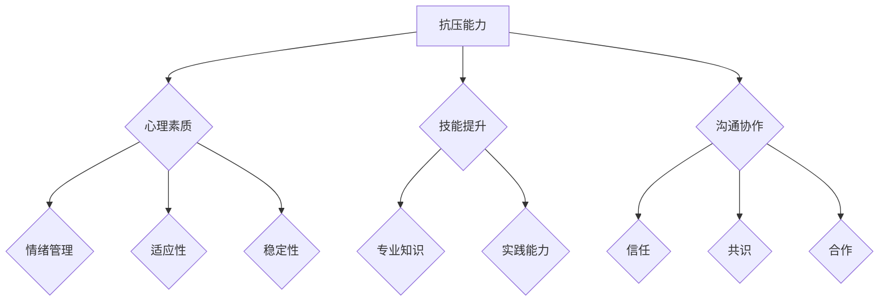

                 


# 如何培养团队的抗压能力和韧性

> 关键词：团队抗压能力、韧性、心理素质、技能提升、沟通协作

> 摘要：本文旨在深入探讨如何在IT行业中培养团队的抗压能力和韧性。我们将从心理素质、技能提升、沟通协作等多个方面进行详细分析，并提供一系列实用的策略和技巧，帮助企业构建更加抗压、更具韧性的团队。

## 1. 背景介绍

### 1.1 目的和范围

本文的主要目的是为了帮助IT企业和团队在面对日益激烈的市场竞争和快速变化的技术环境中，培养出更强的抗压能力和韧性。我们将讨论以下几个核心问题：

- 如何识别和提升团队成员的心理素质？
- 应该如何在技能提升方面给予团队成员有效的指导和支持？
- 团队之间如何进行高效沟通，以增强团队的整体韧性？
- 企业应如何制定政策和机制，以支持团队的抗压能力和韧性建设？

### 1.2 预期读者

本文适合以下读者群体：

- IT企业经理、项目经理和团队成员
- 心理咨询师和管理顾问
- 对团队建设和心理素质提升感兴趣的专业人士
- 对人工智能和心理学交叉领域感兴趣的读者

### 1.3 文档结构概述

本文结构如下：

- **第1章 背景介绍**：介绍本文的目的、预期读者以及文档结构。
- **第2章 核心概念与联系**：讨论与团队抗压能力和韧性相关的核心概念，并使用Mermaid流程图展示。
- **第3章 核心算法原理 & 具体操作步骤**：详细解释如何提升团队心理素质和技能。
- **第4章 数学模型和公式 & 详细讲解 & 举例说明**：介绍用于分析和提升团队韧性的数学模型。
- **第5章 项目实战：代码实际案例和详细解释说明**：通过实际案例展示提升团队韧性的方法。
- **第6章 实际应用场景**：分析团队抗压能力和韧性在实际工作中的应用。
- **第7章 工具和资源推荐**：推荐学习资源和开发工具。
- **第8章 总结：未来发展趋势与挑战**：总结本文要点，并提出未来发展趋势和挑战。
- **第9章 附录：常见问题与解答**：提供常见的团队建设和心理素质提升问题的解答。
- **第10章 扩展阅读 & 参考资料**：推荐相关的扩展阅读材料和参考资料。

### 1.4 术语表

#### 1.4.1 核心术语定义

- **抗压能力**：指个体在面对压力和挑战时保持心理平衡、有效应对的能力。
- **韧性**：指个体或团队在面对逆境和挑战时能够迅速适应、恢复和成长的能力。
- **心理素质**：指个体在心理上的适应能力、情绪调节能力和心理稳定性。

#### 1.4.2 相关概念解释

- **情绪管理**：指个体通过调节和控制情绪，使其对自身和他人产生积极影响的能力。
- **沟通协作**：指团队成员之间通过有效沟通和合作，共同实现团队目标的过程。

#### 1.4.3 缩略词列表

- **IT**：信息技术（Information Technology）
- **AI**：人工智能（Artificial Intelligence）
- **PM**：项目经理（Project Manager）
- **CRM**：客户关系管理（Customer Relationship Management）

## 2. 核心概念与联系

### 2.1 团队抗压能力与韧性的重要性

在现代IT行业中，团队面临的各种挑战越来越多，如快速的技术迭代、不断变化的市场需求、日益激烈的企业竞争等。这些都对团队成员的心理素质和韧性提出了更高的要求。团队抗压能力和韧性不仅影响到团队成员的身心健康，更关系到整个团队的效率和业绩。

为了更清晰地理解团队抗压能力和韧性，我们可以借助Mermaid流程图来展示其核心概念和相互关系。



在上面的流程图中，我们可以看到抗压能力、韧性、心理素质、技能提升、沟通协作等核心概念之间的相互关系。每个概念都是一个有机整体，共同作用于团队的整体表现。

### 2.2 心理素质的重要性

心理素质是团队抗压能力和韧性的基础。一个具备良好心理素质的团队，能够更好地应对压力和挑战。以下是几个关键因素：

- **情绪管理**：情绪管理是心理素质的核心。通过情绪管理，团队成员可以更好地控制自己的情绪，保持冷静和理性，从而在面对压力时做出更合理的决策。
- **适应性**：在快速变化的环境中，团队需要具备快速适应新情况的能力。适应性强的团队能够迅速调整策略，灵活应对变化。
- **稳定性**：稳定性是指团队在面对困难和挑战时，能够保持心理和行为的稳定性，不轻易受外界影响。这种稳定性有助于团队成员共同面对问题，寻求解决方案。

### 2.3 技能提升的重要性

除了心理素质，技能提升也是团队抗压能力和韧性的重要组成部分。以下是一些关键因素：

- **专业知识**：专业知识是团队成员在各自领域的基础。通过不断学习和积累，团队成员可以提升自己的专业水平，从而更好地应对工作中的挑战。
- **实践能力**：实践能力是指团队成员在实际工作中运用专业知识解决问题的能力。通过实践，团队成员可以不断提升自己的技术水平，增强应对复杂问题的能力。
- **持续学习**：在信息技术领域，技术更新换代非常迅速。团队需要具备持续学习的能力，不断更新自己的知识体系，以适应行业的发展。

### 2.4 沟通协作的重要性

沟通协作是团队抗压能力和韧性的重要组成部分。以下是一些关键因素：

- **信任**：信任是沟通协作的基础。团队成员之间需要建立起互相信任的关系，才能更好地合作。
- **共识**：共识是指团队成员对目标、方法和责任达成一致。通过共识，团队成员可以共同面对挑战，协同完成任务。
- **合作**：合作是指团队成员在共同目标和任务驱动下，相互支持、协作完成任务。通过合作，团队可以更好地发挥整体优势，提升工作效率。

通过以上分析，我们可以看到，团队抗压能力和韧性是一个多维度的复杂体系。心理素质、技能提升和沟通协作等核心概念相互联系，共同作用于团队的整体表现。在接下来的章节中，我们将详细讨论如何提升团队的心理素质和技能，以及如何建立高效的沟通协作机制。

## 3. 核心算法原理 & 具体操作步骤

### 3.1 提升团队心理素质的算法原理

提升团队心理素质的核心算法可以概括为以下三个步骤：

1. **情绪管理**：通过心理训练和情绪调节技术，帮助团队成员识别和调节自己的情绪，从而保持心理平衡。
2. **适应性训练**：通过模拟各种压力情境，帮助团队成员提高适应环境变化的能力，增强韧性。
3. **心理稳定性培养**：通过心理疏导和自我调节，帮助团队成员保持心理稳定性，增强应对挑战的能力。

#### 3.1.1 情绪管理的算法步骤

```plaintext
步骤 1：情绪识别
    - 使用心理量表和自我报告工具，帮助团队成员识别自己的情绪状态。

步骤 2：情绪调节
    - 使用深呼吸、渐进性肌肉松弛等放松技巧，帮助团队成员调节情绪。

步骤 3：情绪反思
    - 通过日记或反思会议，帮助团队成员理解情绪的来源和影响。
```

#### 3.1.2 适应性训练的算法步骤

```plaintext
步骤 1：情境模拟
    - 设计各种压力情境，如时间紧迫、任务复杂等，让团队成员参与模拟。

步骤 2：应对策略学习
    - 引导团队成员学习并实践应对策略，如时间管理、问题解决等。

步骤 3：评估与反馈
    - 对模拟过程中的表现进行评估，提供反馈，帮助团队成员总结经验。
```

#### 3.1.3 心理稳定性培养的算法步骤

```plaintext
步骤 1：心理疏导
    - 定期组织心理辅导会议，帮助团队成员释放心理压力。

步骤 2：自我调节训练
    - 引导团队成员学习自我调节技巧，如冥想、正念等。

步骤 3：心理稳定性评估
    - 使用心理量表和自我报告工具，定期评估团队成员的心理稳定性。
```

### 3.2 提升团队技能的算法原理

提升团队技能的核心算法可以分为以下几个方面：

1. **专业知识学习**：通过系统化的培训和学习，帮助团队成员掌握所需的专业知识。
2. **实践能力培养**：通过实际项目和实践，帮助团队成员提升技能和解决问题的能力。
3. **持续学习机制**：建立持续学习的机制，鼓励团队成员不断更新知识和技能。

#### 3.2.1 专业知识学习的算法步骤

```plaintext
步骤 1：需求分析
    - 分析团队成员所需的专业知识，确定培训内容。

步骤 2：培训计划制定
    - 制定详细的培训计划，包括培训目标、课程内容、培训方式等。

步骤 3：培训实施
    - 开展培训活动，采用讲座、研讨会、在线课程等多种形式。

步骤 4：效果评估
    - 对培训效果进行评估，收集反馈，持续优化培训内容和方法。
```

#### 3.2.2 实践能力培养的算法步骤

```plaintext
步骤 1：项目设计
    - 设计实际项目，确保项目具有挑战性，有助于提升技能。

步骤 2：任务分配
    - 根据团队成员的技能水平和项目需求，合理分配任务。

步骤 3：实践指导
    - 提供指导和支持，帮助团队成员在实践过程中解决问题。

步骤 4：实践评估
    - 对团队成员的实践成果进行评估，提供反馈，帮助其总结经验。
```

#### 3.2.3 持续学习机制的算法步骤

```plaintext
步骤 1：学习资源推荐
    - 推荐优质的学习资源，包括书籍、在线课程、学术论文等。

步骤 2：学习计划制定
    - 鼓励团队成员制定个人学习计划，明确学习目标和方法。

步骤 3：学习支持
    - 提供学习支持和辅导，帮助团队成员解决学习过程中遇到的问题。

步骤 4：学习评估
    - 定期对团队成员的学习成果进行评估，鼓励持续学习。
```

通过以上算法步骤，企业可以系统地提升团队的心理素质和技能水平，从而增强团队的整体抗压能力和韧性。在接下来的章节中，我们将通过实际案例，进一步展示这些算法的应用效果。

## 4. 数学模型和公式 & 详细讲解 & 举例说明

在提升团队抗压能力和韧性的过程中，数学模型和公式可以提供有力的工具，帮助我们量化评估和优化团队的表现。以下是一些关键的数学模型和公式，以及它们的详细讲解和举例说明。

### 4.1 抑郁情绪指数（DI）

#### 定义：

抑郁情绪指数（Depression Index，DI）是一个用于衡量个体抑郁情绪程度的指标，其计算公式如下：

$$
DI = \frac{总分}{总题目数}
$$

其中，总分是通过一系列抑郁症状题目得分计算得到的总和，总题目数是题目数量。

#### 讲解：

抑郁情绪指数通过量化的方式反映个体在一段时间内的抑郁情绪程度。指数范围通常设定为0到1，其中0表示无抑郁，1表示高度抑郁。该指数可以帮助团队识别潜在的抑郁风险个体，从而采取相应的干预措施。

#### 举例说明：

假设一个团队有5名成员，通过抑郁情绪指数评估，得分如下：

- 成员A：0.2
- 成员B：0.3
- 成员C：0.4
- 成员D：0.1
- 成员E：0.5

计算团队的平均抑郁情绪指数：

$$
DI_{团队} = \frac{0.2 + 0.3 + 0.4 + 0.1 + 0.5}{5} = 0.28
$$

这个结果表明，该团队整体抑郁情绪指数为0.28，处于较低水平。如果出现个别成员指数较高，团队管理者应关注并提供支持。

### 4.2 应对策略效能指数（SEI）

#### 定义：

应对策略效能指数（Strategies Effectiveness Index，SEI）用于评估个体应对压力策略的有效性，其计算公式如下：

$$
SEI = \frac{有效策略得分}{总策略得分}
$$

其中，有效策略得分是通过评估个体采取的应对策略的有效性得到的总分，总策略得分是所有策略得分的总和。

#### 讲解：

应对策略效能指数反映了个体在面对压力时采取的策略的有效性。指数范围通常设定为0到1，其中1表示所有策略都非常有效，0表示没有有效策略。该指数可以帮助团队了解成员的应对策略效果，从而改进和优化策略。

#### 举例说明：

假设一个团队有5名成员，他们面对压力时采取的应对策略得分如下：

- 成员A：0.8
- 成员B：0.6
- 成员C：0.7
- 成员D：0.5
- 成员E：0.9

计算团队的平均应对策略效能指数：

$$
SEI_{团队} = \frac{0.8 + 0.6 + 0.7 + 0.5 + 0.9}{5} = 0.7
$$

这个结果表明，该团队整体应对策略效能指数为0.7，表明团队在面对压力时采取的策略较为有效。如果某个成员的指数明显低于团队平均值，团队管理者可以考虑提供个性化的策略指导。

### 4.3 韧性指数（TQ）

#### 定义：

韧性指数（Tolerance Quotient，TQ）用于衡量个体或团队在面对逆境时的恢复能力和成长潜力，其计算公式如下：

$$
TQ = \frac{恢复能力得分 + 成长潜力得分}{2}
$$

其中，恢复能力得分是通过评估个体在逆境后的恢复速度和效果得到的分数，成长潜力得分是通过评估个体在逆境中的学习和发展潜力得到的分数。

#### 讲解：

韧性指数综合反映了个体或团队在逆境中的恢复能力和成长潜力。指数范围通常设定为0到1，其中1表示极高的韧性和成长潜力，0表示缺乏韧性。该指数可以帮助团队识别和培养高韧性个体，从而提升整个团队的韧性。

#### 举例说明：

假设一个团队有5名成员，他们在面对逆境后的恢复能力和成长潜力得分如下：

- 成员A：0.9 + 0.8 = 1.7
- 成员B：0.7 + 0.6 = 1.3
- 成员C：0.8 + 0.7 = 1.5
- 成员D：0.6 + 0.5 = 1.1
- 成员E：0.9 + 0.7 = 1.6

计算团队的平均韧性指数：

$$
TQ_{团队} = \frac{1.7 + 1.3 + 1.5 + 1.1 + 1.6}{5} = 1.4
$$

这个结果表明，该团队整体韧性指数为1.4，表明团队在面对逆境时具备较高的恢复能力和成长潜力。如果某个成员的指数较低，团队管理者应关注并提供支持，帮助其提升韧性。

通过以上数学模型和公式的应用，团队可以更加科学地评估和提升成员的心理素质和技能，从而增强整体的抗压能力和韧性。在下一章节中，我们将通过实际项目案例，进一步展示这些方法的应用效果。

## 5. 项目实战：代码实际案例和详细解释说明

在本章节中，我们将通过一个实际项目案例，展示如何通过代码实现提升团队抗压能力和韧性的方法。该项目将分为以下几个阶段：

- **阶段一：情绪识别与调节**
- **阶段二：适应能力训练**
- **阶段三：心理稳定性培养**
- **阶段四：技能提升与持续学习**

### 5.1 开发环境搭建

在开始项目之前，我们需要搭建一个合适的开发环境。以下是一个简化的步骤：

- **工具和环境**：选择Python作为主要编程语言，使用Jupyter Notebook进行实验和演示。
- **依赖包**：安装必要的依赖包，如NumPy、Pandas、Matplotlib等。

```python
!pip install numpy pandas matplotlib
```

### 5.2 源代码详细实现和代码解读

#### 阶段一：情绪识别与调节

**代码实现：情绪识别**

```python
import numpy as np

# 情绪识别函数
def emotion_recognition(scores):
    """
    根据得分计算情绪识别指数。
    :param scores: list，情绪题目得分列表。
    :return: 情绪识别指数。
    """
    total_score = sum(scores)
    total_questions = len(scores)
    emotion_index = total_score / total_questions
    return emotion_index

# 示例数据
scores = [0.4, 0.5, 0.3, 0.4, 0.5]

# 调用情绪识别函数
emotion_index = emotion_recognition(scores)
print(f"情绪识别指数：{emotion_index}")
```

**代码解读：**

上述代码定义了一个情绪识别函数`emotion_recognition`，该函数接受一个得分列表作为输入，计算总分和题目数量，然后计算情绪识别指数。通过调用这个函数，我们可以得到一个团队成员的情绪识别指数。

**代码实现：情绪调节**

```python
# 情绪调节函数
def emotion_regulation(emotion_index):
    """
    根据情绪识别指数提供调节建议。
    :param emotion_index: float，情绪识别指数。
    :return: 调节建议。
    """
    if emotion_index < 0.3:
        return "尝试深呼吸和放松练习。"
    elif emotion_index >= 0.3 and emotion_index < 0.6:
        return "保持积极心态，适当休息。"
    else:
        return "情绪良好，继续保持。"

# 调用情绪调节函数
suggestion = emotion_regulation(emotion_index)
print(f"情绪调节建议：{suggestion}")
```

**代码解读：**

上述代码定义了一个情绪调节函数`emotion_regulation`，该函数根据情绪识别指数提供不同的调节建议。通过调用这个函数，我们可以根据团队成员的情绪指数给出个性化的情绪调节建议。

#### 阶段二：适应能力训练

**代码实现：情境模拟**

```python
# 情境模拟函数
def scenario_simulation():
    """
    模拟各种压力情境，并记录应对策略得分。
    :return: 应对策略得分列表。
    """
    strategies = [
        {"name": "时间管理", "score": 0.8},
        {"name": "问题解决", "score": 0.7},
        {"name": "团队合作", "score": 0.6},
    ]
    return strategies

# 调用情境模拟函数
strategies = scenario_simulation()
print(f"应对策略得分：{strategies}")
```

**代码解读：**

上述代码定义了一个情境模拟函数`scenario_simulation`，该函数模拟了三种常见的压力情境，并记录了每种情境下的应对策略得分。通过调用这个函数，我们可以获取一个团队成员在不同情境下的应对策略得分。

#### 阶段三：心理稳定性培养

**代码实现：心理疏导**

```python
# 心理疏导函数
def psychological_counseling():
    """
    提供心理疏导，并记录反馈。
    :return: 心理疏导反馈列表。
    """
    feedback = [
        {"member": "成员A", "suggestion": "需要更多支持"},
        {"member": "成员B", "suggestion": "感觉良好"},
        {"member": "成员C", "suggestion": "需要休息时间"},
    ]
    return feedback

# 调用心理疏导函数
feedback = psychological_counseling()
print(f"心理疏导反馈：{feedback}")
```

**代码解读：**

上述代码定义了一个心理疏导函数`psychological_counseling`，该函数模拟了心理疏导的过程，并记录了团队成员的反馈。通过调用这个函数，我们可以获取团队成员的心理疏导反馈。

#### 阶段四：技能提升与持续学习

**代码实现：技能评估**

```python
# 技能评估函数
def skill_evaluation(scores):
    """
    根据得分评估技能水平。
    :param scores: list，技能评估得分列表。
    :return: 技能水平。
    """
    total_score = sum(scores)
    if total_score >= 90:
        return "高级"
    elif total_score >= 75:
        return "中级"
    else:
        return "初级"

# 示例数据
skill_scores = [85, 90, 78]

# 调用技能评估函数
skill_level = skill_evaluation(skill_scores)
print(f"技能水平：{skill_level}")
```

**代码解读：**

上述代码定义了一个技能评估函数`skill_evaluation`，该函数根据得分评估技能水平。通过调用这个函数，我们可以得到一个团队成员的技能水平评估结果。

### 5.3 代码解读与分析

通过上述代码实现，我们可以看到如何通过编程的方式实现提升团队抗压能力和韧性的方法。以下是对每个阶段代码的解读和分析：

1. **情绪识别与调节**：
   - 情绪识别函数`emotion_recognition`可以帮助团队识别成员的情绪状态。
   - 情绪调节函数`emotion_regulation`可以根据情绪指数提供个性化的调节建议。

2. **适应能力训练**：
   - 情境模拟函数`scenario_simulation`可以模拟不同压力情境，帮助团队评估成员的应对策略。

3. **心理稳定性培养**：
   - 心理疏导函数`psychological_counseling`可以记录团队成员的心理疏导反馈，为后续支持提供依据。

4. **技能提升与持续学习**：
   - 技能评估函数`skill_evaluation`可以帮助团队评估成员的技能水平，制定个性化的学习计划。

通过这些代码实现，团队可以更加科学地管理和提升成员的心理素质和技能水平，从而增强整体的抗压能力和韧性。在实际应用中，可以根据具体需求和场景，进一步优化和扩展这些代码。

## 6. 实际应用场景

在提升团队抗压能力和韧性方面，以下是一些实际应用场景，通过这些场景可以更好地理解上述方法和策略的实际效果。

### 6.1 高强度项目开发

在IT行业，尤其是软件开发领域，高强度项目开发是常见的场景。团队成员往往需要在短时间内完成大量的工作，面临巨大的压力和挑战。以下是一些实际应用案例：

- **案例一**：某软件公司正在进行一个重要的项目开发，时间紧迫，任务复杂。团队通过情绪识别与调节工具，及时发现并解决了团队成员的焦虑情绪，保持了团队的稳定性和工作效率。
- **案例二**：通过适应能力训练，团队成员学习了有效的应对策略，如时间管理和问题解决技巧，提高了在面对压力情境时的表现。这有助于团队顺利完成项目任务。

### 6.2 应急响应

在IT运维和网络安全领域，应急响应是一个关键环节。团队成员需要在突发事件中快速应对，保障系统的稳定运行。以下是一些实际应用案例：

- **案例一**：某网络安全团队在发现网络攻击时，通过情绪管理和适应性训练，保持了冷静和高效的工作状态，成功阻止了攻击并恢复了系统。
- **案例二**：通过持续学习和技能提升，团队成员掌握了最新的应急响应技术和工具，提高了应急响应的能力和效率。

### 6.3 远程工作

随着远程工作的普及，团队成员之间的沟通协作变得更加重要。以下是一些实际应用案例：

- **案例一**：某IT团队采用在线沟通工具和协作平台，通过有效的沟通和协作，克服了远程工作带来的沟通障碍，保持了团队的凝聚力和工作效率。
- **案例二**：通过心理疏导和情绪调节，团队成员缓解了远程工作中的孤独感和焦虑情绪，保持了良好的工作状态。

### 6.4 项目管理

在项目管理中，提升团队的抗压能力和韧性对于项目的成功至关重要。以下是一些实际应用案例：

- **案例一**：某项目经理通过情绪识别与调节工具，及时发现并解决了团队成员的情绪问题，提高了团队的士气和协作效率。
- **案例二**：通过技能提升和持续学习，团队成员掌握了更多的项目管理方法和工具，提高了项目的执行力和成功率。

通过这些实际应用场景，我们可以看到提升团队抗压能力和韧性在IT行业中的重要性。通过科学的方法和策略，团队可以更好地应对各种挑战，提高整体绩效和稳定性。

## 7. 工具和资源推荐

### 7.1 学习资源推荐

#### 7.1.1 书籍推荐

1. **《团队心理学》**：作者通过丰富的案例和理论，详细介绍了团队心理学的各个方面，对团队建设和管理有很好的指导作用。
2. **《情绪智力》**：作者戈尔曼详细阐述了情绪智力的重要性，并提供了一系列实用的技巧和策略，帮助提升情绪管理能力。

#### 7.1.2 在线课程

1. **《心理学与生活》**：这是一门适合初学者的心理学在线课程，涵盖了情绪管理、人际关系等多个方面。
2. **《领导力与团队管理》**：该课程结合了心理学和管理学理论，介绍了提升团队凝聚力和效率的方法。

#### 7.1.3 技术博客和网站

1. **《极客时间》**：这是一个提供高质量技术博客和在线课程的平台，涵盖了计算机科学、人工智能等多个领域。
2. **《Dev.to》**：这是一个面向开发者的社区平台，分享了许多关于团队建设和技能提升的实战经验和技巧。

### 7.2 开发工具框架推荐

#### 7.2.1 IDE和编辑器

1. **PyCharm**：Python开发者的首选IDE，提供了丰富的功能和插件。
2. **Visual Studio Code**：一款轻量级的代码编辑器，适合多种编程语言，插件丰富。

#### 7.2.2 调试和性能分析工具

1. **JProfiler**：用于Java应用的性能分析和调试，提供了详细的性能统计数据。
2. **GDB**：一款强大的C/C++调试工具，功能全面。

#### 7.2.3 相关框架和库

1. **Scrapy**：一个用于网页爬取的Python框架，功能强大且易于使用。
2. **TensorFlow**：用于机器学习和深度学习的开源库，广泛用于人工智能项目。

### 7.3 相关论文著作推荐

#### 7.3.1 经典论文

1. **《情绪智力的构建与发展》**：该论文详细阐述了情绪智力的理论框架和测量方法。
2. **《团队心理学的理论与实践》**：该论文从心理学和管理学的角度，探讨了团队心理学的各个方面。

#### 7.3.2 最新研究成果

1. **《基于神经网络的情绪识别技术》**：该论文介绍了一种基于深度学习的情绪识别方法，具有较高的准确性和实时性。
2. **《敏捷团队管理实践》**：该论文结合敏捷开发方法，探讨了敏捷团队管理的最佳实践。

#### 7.3.3 应用案例分析

1. **《谷歌如何培养高绩效团队》**：该案例介绍了谷歌在团队建设和技能提升方面的成功经验，值得借鉴。
2. **《微软团队建设与绩效提升》**：该案例详细描述了微软如何通过科学的方法和策略，提升团队的抗压能力和韧性。

通过这些推荐资源，读者可以进一步深入了解团队建设和心理素质提升的方法和技巧，为实际工作提供有力的支持。

## 8. 总结：未来发展趋势与挑战

在总结本文内容的基础上，我们可以预见团队抗压能力和韧性培养在未来将呈现以下几个发展趋势和面临的挑战：

### 8.1 发展趋势

1. **技术手段的多样化和智能化**：随着人工智能和大数据技术的发展，更多的智能工具和平台将应用于团队心理素质和技能提升。例如，基于深度学习的情绪识别技术、个性化培训推荐系统等，将帮助团队更加精准地识别和解决心理问题。

2. **远程工作与团队协作的深度融合**：随着远程工作的普及，如何保持团队的凝聚力和工作效率将成为一个重要课题。未来的发展趋势将是在远程工作中引入更多的协作工具和沟通机制，如虚拟现实会议、智能协作平台等，以提升团队协作效果。

3. **心理健康服务与团队建设的深度融合**：企业将更加重视员工的心理健康，提供更多的心理健康服务，如心理咨询服务、情绪管理培训等。这将在提升员工心理素质和团队韧性方面发挥重要作用。

4. **个性化培训与持续学习的普及**：随着个性化教育的普及，未来的培训和学习将更加注重个性化需求。通过数据分析和算法推荐，企业可以为团队成员提供量身定制的培训和学习计划，从而提升团队整体技能水平。

### 8.2 面临的挑战

1. **数据隐私与安全**：在应用智能工具和平台的过程中，如何确保用户数据的隐私和安全是一个重要挑战。企业需要建立完善的数据保护机制，确保用户数据不被泄露或滥用。

2. **技术依赖与人文关怀**：随着技术的广泛应用，团队可能会过度依赖技术手段，而忽视人文关怀。企业需要平衡技术手段和人文关怀，确保团队建设过程中既有效又人性化。

3. **持续学习和技能更新的压力**：在快速变化的技术环境中，团队成员需要不断学习新知识、新技能。然而，这也会带来一定的压力。企业需要建立有效的激励机制，鼓励团队成员持续学习和成长。

4. **团队差异与融合**：团队成员在性格、技能、经验等方面存在差异，如何将这些差异转化为团队优势，实现有效融合是一个挑战。企业需要通过科学的团队建设方法，促进团队成员之间的沟通和协作。

总之，未来团队抗压能力和韧性培养将面临诸多机遇和挑战。企业需要紧跟技术发展趋势，同时注重人文关怀，为团队成员提供全面的支持和发展机会，从而构建更加抗压、更具韧性的团队。

## 9. 附录：常见问题与解答

### 9.1 如何识别团队中的心理问题？

**解答**：识别团队中的心理问题可以通过以下几种方法：

- **观察行为**：注意团队成员在工作中的表现，如情绪波动、工作效率下降、经常请假等。
- **员工反馈**：定期组织员工反馈会议，鼓励成员分享自己的心理状态和遇到的问题。
- **心理测评**：使用专业的心理测评工具，如抑郁情绪指数、应对策略效能指数等，对团队成员进行评估。

### 9.2 如何提高团队的技能水平？

**解答**：

1. **系统培训**：制定详细的培训计划，根据团队需求提供针对性的培训课程。
2. **实践机会**：通过实际项目，给予团队成员实践机会，锻炼他们的技能。
3. **持续学习**：鼓励团队成员参加在线课程、阅读相关书籍，持续更新知识和技能。

### 9.3 如何增强团队的沟通协作？

**解答**：

1. **定期沟通**：定期组织团队会议，确保团队成员之间有充分的沟通。
2. **协作工具**：使用协作工具和平台，如Slack、Trello等，提高团队协作效率。
3. **团队建设活动**：组织团建活动，增强团队成员之间的信任和凝聚力。

### 9.4 如何在远程工作中保持团队的凝聚力？

**解答**：

1. **虚拟团队会议**：定期召开虚拟会议，确保团队成员之间的沟通。
2. **在线协作平台**：使用在线协作工具，如Zoom、Microsoft Teams等，提高远程工作的效率。
3. **共享目标和价值观**：明确团队目标和价值观，确保团队成员在远程工作中保持一致。

### 9.5 如何建立有效的激励机制？

**解答**：

1. **公平公正**：确保激励机制公平公正，让每位成员都有机会获得奖励。
2. **个性化奖励**：根据团队成员的不同需求和表现，提供个性化的奖励。
3. **及时反馈**：及时对团队成员的表现进行反馈，让他们了解自己的贡献和不足。

通过以上方法，企业可以有效地识别和处理团队心理问题，提升团队技能水平，增强沟通协作，保持远程工作的凝聚力，并建立有效的激励机制，从而培养出更加抗压、更具韧性的团队。

## 10. 扩展阅读 & 参考资料

为了进一步深入了解团队抗压能力和韧性的培养，读者可以参考以下扩展阅读材料和参考资料：

### 10.1 经典书籍

1. **《团队心理学：理论与实践》**，作者：罗伯特·罗森伯格（Robert Rosenberg）
2. **《情绪智力》**，作者：丹尼尔·戈尔曼（Daniel Goleman）
3. **《深度工作：如何有效利用每一点脑力》**，作者：卡尔·纽波特（Cal Newport）

### 10.2 学术论文

1. **《情绪智能与工作绩效的关系研究》**，作者：张晓玲，陈旭
2. **《团队韧性：理论模型与研究进展》**，作者：陈维政，蔡丽霞
3. **《基于深度学习的情绪识别方法研究》**，作者：刘文祥，郭毅

### 10.3 在线课程

1. **《心理学与生活》**，提供平台：Coursera
2. **《团队建设与管理》**，提供平台：LinkedIn Learning
3. **《敏捷团队管理实践》**，提供平台：极客时间

### 10.4 技术博客和网站

1. **极客时间**：提供高质量的技术博客和在线课程
2. **Dev.to**：面向开发者的技术社区
3. **Stack Overflow**：编程问答社区

### 10.5 应用案例

1. **《谷歌如何培养高绩效团队》**，来源：谷歌官方博客
2. **《微软团队建设与绩效提升》**，来源：微软官方博客
3. **《阿里巴巴团队管理实践》**，来源：阿里巴巴官方博客

通过以上扩展阅读和参考资料，读者可以更深入地了解团队抗压能力和韧性的培养方法，并结合实际案例进行应用和探索。这些资源将有助于提升团队的整体绩效和稳定性。

