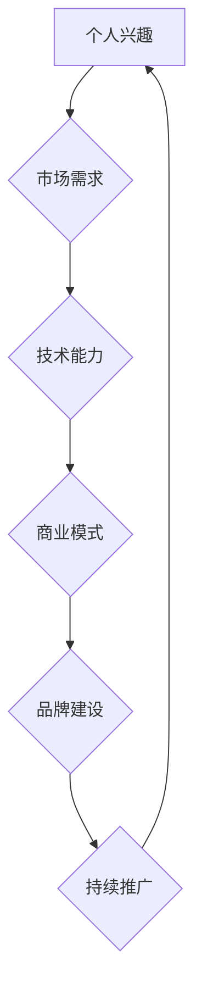

                 

# 如何将Side Project转化为主业

> 关键词：Side Project，主业转换，商业策略，技术领导力，市场分析，个人品牌建设

> 摘要：本文旨在探讨如何将个人兴趣项目（Side Project）成功转化为主营业务。通过详细分析市场趋势、技术发展、商业策略和品牌建设等关键因素，帮助读者在将兴趣项目推向市场过程中，构建可持续的商业模式，实现个人职业发展和财富积累。

## 1. 背景介绍

### 1.1 目的和范围

本文的主要目的是为那些在技术领域有所成就的个人提供指导，帮助他们将个人项目（Side Project）转化为可持续的商业主业务。通过系统性的分析和策略规划，本文旨在解决以下几个核心问题：

- 如何评估一个Side Project的商业潜力？
- 如何将技术优势转化为市场竞争力？
- 如何构建有效的市场推广和品牌建设策略？
- 如何在资源有限的情况下，实现项目的商业化？

### 1.2 预期读者

本文适合以下读者群体：

- 技术专家，尤其是拥有个人项目的技术从业者。
- 创业者，特别是那些正在寻找如何将个人项目商业化的创业者。
- 对技术创业和商业模式设计感兴趣的学术界人士。
- 企业高管，特别是负责技术创新和市场拓展的高级管理人员。

### 1.3 文档结构概述

本文结构分为以下几个部分：

- 背景介绍：介绍文章的目的、预期读者和文档结构。
- 核心概念与联系：阐述将Side Project转化为主业的核心理念和相关概念。
- 核心算法原理 & 具体操作步骤：详细讲解实现项目商业化的技术方法和操作流程。
- 数学模型和公式 & 详细讲解 & 举例说明：使用数学模型和公式分析商业策略。
- 项目实战：通过实际案例说明如何将项目商业化。
- 实际应用场景：探讨项目在不同行业中的应用。
- 工具和资源推荐：推荐学习资源和开发工具。
- 总结：总结未来发展趋势与挑战。
- 附录：常见问题与解答。
- 扩展阅读 & 参考资料：提供进一步阅读的建议和参考资料。

### 1.4 术语表

#### 1.4.1 核心术语定义

- **Side Project**：指个人在业余时间开发和维护的项目，通常是为了满足个人兴趣、技术提升或创新探索。
- **主营业务**：企业或个人主要经营的业务活动，为公司或个人的核心收入来源。
- **市场分析**：对目标市场的需求、竞争环境和潜在客户进行分析，以确定项目的市场定位和推广策略。
- **品牌建设**：通过一系列策略和活动，塑造和提升个人或企业的市场形象和品牌价值。
- **商业模式**：企业或个人如何创造、传递和获取价值，以及如何盈利的系统性计划。

#### 1.4.2 相关概念解释

- **技术领导力**：在技术领域引领创新和发展的能力，包括技术知识、团队管理和战略规划。
- **市场竞争力**：产品或服务在市场上相对于竞争对手的优势和能力。
- **用户价值**：用户在使用产品或服务过程中获得的具体利益和满足。

#### 1.4.3 缩略词列表

- **AI**：人工智能（Artificial Intelligence）
- **ML**：机器学习（Machine Learning）
- **DL**：深度学习（Deep Learning）
- **IDE**：集成开发环境（Integrated Development Environment）
- **API**：应用程序接口（Application Programming Interface）
- **SDK**：软件开发工具包（Software Development Kit）

## 2. 核心概念与联系

### 2.1 核心概念

将Side Project转化为主业务涉及多个核心概念，包括：

- **个人兴趣**：Side Project的起源通常是个人兴趣或对某项技术的热情。
- **市场需求**：了解市场对特定产品或服务的需求，是项目成功商业化的关键。
- **技术能力**：项目技术实现的成熟度和稳定性对商业成功至关重要。
- **商业模式**：项目如何创造和获取价值，以及盈利的途径。
- **品牌建设**：通过持续的市场活动和品牌推广，提升项目知名度。

### 2.2 联系与流程图

为了更好地理解这些核心概念之间的联系，以下是一个简单的Mermaid流程图：



- 个人兴趣驱动项目开发。
- 市场需求分析帮助确定项目定位。
- 技术能力提升项目质量，增强市场竞争力。
- 商业模式设计确保项目能够盈利。
- 品牌建设通过市场推广提高项目知名度。
- 持续推广进一步强化品牌形象，形成良性循环。

## 3. 核心算法原理 & 具体操作步骤

### 3.1 核心算法原理

将Side Project转化为主营业务的关键在于以下核心算法原理：

1. **需求分析**：通过市场调研了解目标用户的需求，确定产品或服务的市场定位。
2. **技术评估**：评估现有技术的成熟度，确保项目具备较高的技术质量和稳定性。
3. **商业模式设计**：制定能够实现可持续盈利的商业模式。
4. **品牌建设**：通过市场推广和用户互动，建立项目的品牌形象。

### 3.2 具体操作步骤

以下是一个具体的操作步骤伪代码，详细阐述如何实现上述核心算法原理：

```python
# 伪代码：将Side Project转化为主业的操作步骤

def transform_side_project_to_main_business(side_project, market_demand, technical_ability):
    # 需求分析
    analyze_demand = analyze_market(market_demand)
    if not analyze_demand:
        print("市场需求分析不通过，项目可能不具备商业化潜力。")
        return
    
    # 技术评估
    assess_technology = evaluate_technology(technical_ability)
    if not assess_technology:
        print("技术评估不通过，项目可能不具备市场竞争力。")
        return
    
    # 商业模式设计
    business_model = design_business_model(side_project, analyze_demand, assess_technology)
    if not business_model:
        print("商业模式设计不通过，项目可能无法实现盈利。")
        return
    
    # 品牌建设
    brand_building = build_brand(side_project, analyze_demand, assess_technology, business_model)
    if not brand_building:
        print("品牌建设不通过，项目可能无法获得市场认可。")
        return
    
    # 持续推广
    continuous_promotion = promote_continuously(side_project, brand_building)
    if not continuous_promotion:
        print("持续推广不通过，项目可能无法持续增长。")
        return
    
    print("项目成功转化为主营业务。")

# 函数调用
transform_side_project_to_main_business(side_project, market_demand, technical_ability)
```

### 3.3 详细解释

#### 3.3.1 需求分析

需求分析是项目商业化的第一步。通过市场调研了解目标用户的需求，确定产品或服务的市场定位。具体步骤如下：

1. **确定目标用户**：明确项目针对的用户群体。
2. **收集需求信息**：通过问卷调查、用户访谈等方式收集用户对产品或服务的期望和需求。
3. **分析数据**：整理和分析收集到的数据，识别出核心需求。
4. **确定市场定位**：根据分析结果确定项目的市场定位和目标市场。

#### 3.3.2 技术评估

技术评估是确保项目具备市场竞争力的重要环节。具体步骤如下：

1. **评估现有技术**：对项目所采用的技术进行评估，包括技术的成熟度、稳定性、可扩展性等。
2. **识别技术优势**：确定项目在技术方面的独特优势，例如创新功能、高性能等。
3. **技术改进**：根据评估结果，对现有技术进行改进，提高项目的技术质量和稳定性。

#### 3.3.3 商业模式设计

商业模式设计是项目实现盈利的关键。具体步骤如下：

1. **确定盈利模式**：选择适合项目的盈利模式，例如订阅收费、广告收入、销售提成等。
2. **成本分析**：分析项目的运营成本，确保商业模式能够覆盖成本并获得盈利。
3. **收入预测**：根据市场需求和技术评估结果，预测项目的收入情况。
4. **优化商业模式**：根据实际情况调整商业模式，使其更加合理和可持续。

#### 3.3.4 品牌建设

品牌建设是提高项目知名度和认可度的关键。具体步骤如下：

1. **确立品牌形象**：根据市场需求和技术特点，设计项目的品牌形象。
2. **市场推广**：通过社交媒体、广告、活动等方式推广项目，提高知名度。
3. **用户互动**：与用户建立互动，收集反馈，不断优化产品和服务。
4. **品牌维护**：通过持续的品牌活动和用户服务，维护品牌形象和声誉。

#### 3.3.5 持续推广

持续推广是项目持续增长的关键。具体步骤如下：

1. **内容营销**：通过博客、社交媒体、论坛等渠道发布高质量内容，吸引潜在用户。
2. **活动推广**：组织线上或线下活动，提高项目的曝光率和用户参与度。
3. **合作伙伴关系**：与相关行业的企业或组织建立合作关系，共同推广项目。
4. **数据分析**：通过数据分析了解推广效果，不断优化推广策略。

## 4. 数学模型和公式 & 详细讲解 & 举例说明

### 4.1 商业模式收益模型

一个关键的数学模型是商业模式收益模型，用于预测项目的潜在收入。以下是一个简单的收益模型：

$$
\text{收入} = \text{客户数量} \times \text{客单价} \times \text{转化率}
$$

其中：

- **客户数量**：预期在特定时间段内能够吸引到的客户数量。
- **客单价**：平均每个客户的消费金额。
- **转化率**：访问项目或产品页面后进行购买的概率。

### 4.2 市场需求分析模型

市场需求分析也可以用数学模型来表示，以下是一个简单需求预测模型：

$$
\text{需求量} = \text{基数} + \text{增长率} \times t
$$

其中：

- **基数**：初始需求量。
- **增长率**：需求量的增长率，通常通过市场调研确定。
- **t**：时间（通常以年为单位）。

### 4.3 详细讲解和举例说明

#### 4.3.1 收益模型讲解

假设一个在线教育平台的商业模式如下：

- **客户数量**：预计第一年能够吸引1000名客户。
- **客单价**：平均每位客户每年支付$200。
- **转化率**：预计转化率为20%。

根据收益模型，第一年的收入预测为：

$$
\text{收入} = 1000 \times 200 \times 0.20 = \$40,000
$$

#### 4.3.2 需求模型讲解

假设一个智能家居设备在市场上的初始需求量为100台，每年的增长率为20%。

根据需求模型，第三年的需求量为：

$$
\text{需求量} = 100 + 0.20 \times 3 = 136 \text{台}
$$

### 4.3.3 实际应用

一个实际应用案例是某个在线编程课程平台。通过市场调研，他们发现：

- **基数**：初始学员人数为500人。
- **增长率**：预计每年增长率为15%。

根据需求模型，第五年的学员人数预测为：

$$
\text{需求量} = 500 + 0.15 \times 5 = 638 \text{人}
$$

通过这些数学模型和公式，可以更好地预测项目的商业前景，从而制定更有效的商业策略。

## 5. 项目实战：代码实际案例和详细解释说明

### 5.1 开发环境搭建

在开始之前，我们需要搭建一个合适的项目开发环境。以下是一个简单的环境搭建指南：

1. **操作系统**：选择一个适合开发的语言环境，例如Windows、macOS或Linux。
2. **编程语言**：选择适合项目需求的编程语言，例如Python、Java或C#。
3. **开发工具**：安装一个集成开发环境（IDE），如Visual Studio Code、Eclipse或IntelliJ IDEA。
4. **数据库**：根据项目需求选择合适的数据库，例如MySQL、PostgreSQL或MongoDB。
5. **版本控制**：安装Git，用于版本控制和团队协作。

### 5.2 源代码详细实现和代码解读

以下是一个简单的在线教育平台项目的代码示例，使用Python语言和Flask框架实现。我们将展示关键代码段并进行详细解读。

#### 5.2.1 代码示例：课程列表显示

```python
from flask import Flask, render_template

app = Flask(__name__)

@app.route('/')
def index():
    courses = [
        {'title': 'Python基础教程', 'price': 99.99},
        {'title': '深度学习入门', 'price': 149.99},
        {'title': '前端开发实战', 'price': 199.99}
    ]
    return render_template('index.html', courses=courses)

if __name__ == '__main__':
    app.run(debug=True)
```

**解读**：

- **导入模块**：导入必需的模块，如Flask用于Web开发。
- **创建Flask应用实例**：定义一个Flask应用实例。
- **定义路由**：`@app.route('/')` 装饰器用于定义首页的路由。
- **定义视图函数**：`index()` 函数返回一个HTML模板，其中包含课程列表。
- **渲染模板**：使用`render_template()` 函数渲染模板，并将课程列表传递给模板。
- **运行应用**：`app.run(debug=True)` 启动应用，并在调试模式下运行。

#### 5.2.2 代码示例：用户注册

```python
from flask import Flask, render_template, request, redirect, url_for

app = Flask(__name__)
app.config['SECRET_KEY'] = 'your_secret_key'

@app.route('/register', methods=['GET', 'POST'])
def register():
    if request.method == 'POST':
        username = request.form['username']
        password = request.form['password']
        # 处理用户注册逻辑，如验证用户名是否已存在、密码强度等
        # 如果注册成功，则将用户信息存储在数据库中
        return redirect(url_for('login'))
    return render_template('register.html')

@app.route('/login', methods=['GET', 'POST'])
def login():
    if request.method == 'POST':
        username = request.form['username']
        password = request.form['password']
        # 处理用户登录逻辑，如验证用户名和密码是否匹配
        # 如果登录成功，则跳转到用户主页
        return redirect(url_for('dashboard'))
    return render_template('login.html')

@app.route('/dashboard')
def dashboard():
    # 用户登录后，可以访问个人仪表盘页面
    return render_template('dashboard.html')

if __name__ == '__main__':
    app.run(debug=True)
```

**解读**：

- **导入模块**：导入用于处理表单请求的模块。
- **配置应用**：设置Flask应用的密钥，用于保护用户会话。
- **定义注册路由**：处理用户注册请求，验证用户输入并跳转到登录页面。
- **定义登录路由**：处理用户登录请求，验证用户名和密码，并跳转到用户仪表盘。
- **定义仪表盘路由**：用户登录后，可以访问个人仪表盘。

### 5.3 代码解读与分析

通过上述代码示例，我们可以看到如何使用Flask框架实现基本的在线教育平台功能。以下是对代码的进一步解读和分析：

- **路由和视图函数**：路由用于定义URL和视图函数之间的映射关系。视图函数处理用户请求，并返回相应的响应。
- **表单处理**：Flask框架提供了处理表单请求的便捷方式。通过`request.form` 可以获取表单提交的数据。
- **会话管理**：使用Flask的会话管理功能，可以轻松实现用户登录和认证。
- **模板渲染**：通过Jinja2模板引擎，可以轻松渲染HTML模板，并传递变量数据。

### 5.4 代码分析与优化

在实际开发过程中，代码质量和性能优化至关重要。以下是一些建议：

- **模块化**：将代码分解为模块和函数，提高可读性和可维护性。
- **错误处理**：添加适当的错误处理逻辑，确保系统在异常情况下能够正确响应。
- **安全措施**：实施安全措施，如防止SQL注入、XSS攻击等。
- **性能优化**：使用缓存、异步处理等技术优化性能。

通过遵循上述最佳实践，可以构建一个稳定、高效和安全的在线教育平台。

## 6. 实际应用场景

### 6.1 教育行业

在线教育平台是Side Project成功转化为主营业务的一个经典案例。通过开发一个能够提供高质量教学内容和互动体验的平台，个人可以将其转化为一个盈利的商业项目。以下是一个实际应用场景：

- **项目案例**：Coursera
- **应用描述**：Coursera是一个在线学习平台，提供来自全球顶尖大学和机构的在线课程。通过订阅模式，Coursera实现了将个人兴趣项目（在线教育平台）成功转化为主营业务。
- **成功要素**：成功的要素包括丰富的课程资源、优质的教学内容、用户友好的界面和有效的市场推广。

### 6.2 电子商务

电子商务是另一个能够将Side Project转化为主营业务的领域。通过构建一个具有竞争力的电子商务平台，个人可以将其兴趣爱好与商业需求相结合，实现盈利。

- **项目案例**：Shopify
- **应用描述**：Shopify是一个提供电子商务解决方案的平台，用户可以使用Shopify构建自己的在线商店。通过提供灵活的插件和定制服务，Shopify成功地将个人项目转化为一个大规模的电子商务业务。
- **成功要素**：成功要素包括提供强大的功能、易于使用的界面、优质的技术支持和持续的创新。

### 6.3 社交媒体

社交媒体平台也是一个能够将个人项目转化为主营业务的好选择。通过构建一个具有独特价值的社交媒体平台，个人可以吸引大量用户并实现盈利。

- **项目案例**：Instagram
- **应用描述**：Instagram最初是一个简单的照片分享应用程序。通过不断地创新和优化，Instagram吸引了数亿用户，成为一个全球知名的社交媒体平台。
- **成功要素**：成功要素包括提供独特的用户体验、创新的功能、有效的用户增长策略和强大的社区管理。

### 6.4 科技创新

科技创新领域也提供了将个人项目转化为主营业务的机会。通过开发具有前瞻性和创新性的技术产品，个人可以在市场中获得竞争优势。

- **项目案例**：Tesla
- **应用描述**：Tesla最初是由一群对电动汽车充满热情的个人创建的。通过不断的技术创新和市场推广，Tesla已经成为全球领先的电动汽车制造商。
- **成功要素**：成功要素包括领先的技术研发、卓越的产品设计、强大的品牌影响力和持续的市场扩张。

### 6.5 总结

将Side Project转化为主营业务的关键在于找到市场需求和自身技术的结合点，并通过有效的市场推广和品牌建设策略实现商业成功。以下是几个成功的关键要素：

- **市场需求**：深入了解目标用户的需求，提供有价值的产品或服务。
- **技术创新**：不断改进技术，确保产品或服务的竞争力。
- **品牌建设**：通过有效的品牌推广和用户互动，建立良好的市场形象。
- **商业模式**：设计可持续的商业模式，确保项目的盈利性。

通过在上述实际应用场景中结合自身优势，个人可以成功地将Side Project转化为主营业务。

## 7. 工具和资源推荐

### 7.1 学习资源推荐

要成功将Side Project转化为主营业务，获取丰富的学习资源至关重要。以下是一些建议：

#### 7.1.1 书籍推荐

- **《精益创业》**：作者埃里克·莱斯，提供如何通过最小可行性产品（MVP）快速验证商业想法的方法。
- **《创业维艰》**：作者本·霍洛维茨，分享创业过程中面对的挑战和解决方案。
- **《商业模式新生代》**：作者亚历山大·奥斯特瓦尔德等，详细介绍如何设计和优化商业模式。
- **《营销管理》**：作者菲利普·科特勒，介绍营销策略和市场推广技巧。

#### 7.1.2 在线课程

- **Coursera**：提供由全球顶尖大学和机构开设的在线课程，涵盖商业、技术和管理等领域。
- **Udemy**：提供大量实用的在线课程，包括编程、数据分析、市场营销等。
- **edX**：由哈佛大学和麻省理工学院等名校合作，提供高质量的在线课程。

#### 7.1.3 技术博客和网站

- **Medium**：一个广泛覆盖技术、商业和创业领域的博客平台。
- **HackerRank**：提供编程挑战和技术文章，帮助开发者提升技能。
- **GitHub**：一个托管代码的开源平台，用户可以查找和学习优秀的项目代码。

### 7.2 开发工具框架推荐

为了高效地开发和维护项目，以下是一些建议的开发工具和框架：

#### 7.2.1 IDE和编辑器

- **Visual Studio Code**：一个功能强大、开源的跨平台IDE。
- **IntelliJ IDEA**：一个专业的Java和Python IDE，提供强大的代码编辑和调试功能。
- **PyCharm**：一个专注于Python的IDE，支持多种编程语言。

#### 7.2.2 调试和性能分析工具

- **Postman**：一个API测试工具，用于调试和优化API接口。
- **JMeter**：一个开源的性能测试工具，用于测试Web应用程序的负载和性能。
- **Xdebug**：一个PHP调试扩展，用于调试PHP代码。

#### 7.2.3 相关框架和库

- **Flask**：一个轻量级的Python Web框架，适用于快速开发和部署。
- **Django**：一个全栈Python Web框架，提供快速开发和高效的数据库管理。
- **React**：一个用于构建用户界面的JavaScript库，适用于单页应用程序。
- **Vue.js**：一个渐进式JavaScript框架，用于构建可扩展的界面。

### 7.3 相关论文著作推荐

#### 7.3.1 经典论文

- **《互联网商务：概念、技术和应用》**：详细讨论电子商务的概念、技术和应用。
- **《数据挖掘：概念与技术》**：介绍数据挖掘的基本概念和技术，适用于商业分析。
- **《商业模式创新》**：探讨商业模式创新的方法和策略。

#### 7.3.2 最新研究成果

- **《区块链技术与应用》**：探讨区块链技术在金融、供应链等领域的应用。
- **《人工智能：基础与前沿》**：介绍人工智能的基础理论和最新研究成果。
- **《云计算与大数据技术》**：探讨云计算和大数据技术的基本概念和实现方法。

#### 7.3.3 应用案例分析

- **《特斯拉的商业创新》**：分析特斯拉如何通过技术创新实现商业成功。
- **《Airbnb的商业模式》**：探讨Airbnb如何通过共享经济模式实现盈利。
- **《腾讯的互联网战略》**：介绍腾讯如何通过互联网技术实现商业增长。

通过这些工具和资源的支持，个人可以更好地将Side Project转化为主营业务，实现商业成功。

## 8. 总结：未来发展趋势与挑战

### 8.1 未来发展趋势

随着技术的不断进步和市场的快速变化，将Side Project转化为主营业务面临着许多新的机遇和挑战。以下是几个未来发展趋势：

1. **数字化转型加速**：全球范围内的数字化转型进程将继续加速，为企业提供了更多的商业机会。Side Project开发者可以利用这一趋势，将技术项目与数字化转型需求相结合，为企业提供定制化的解决方案。
2. **人工智能与大数据应用**：人工智能（AI）和大数据技术将在未来继续快速发展，为各个行业带来创新的商业模式和业务流程。Side Project开发者可以关注这些前沿技术，探索如何将其应用于实际项目中，提升项目的竞争力和市场价值。
3. **云计算与边缘计算**：云计算和边缘计算的发展将为Side Project提供更加灵活和高效的计算环境。开发者可以利用这些技术，构建可扩展、高可用性的应用，降低运营成本。
4. **区块链技术**：区块链技术在金融、供应链和数字身份认证等领域具有广泛应用潜力。Side Project开发者可以探索区块链技术，开发创新的去中心化应用（DApp），开辟新的市场机会。

### 8.2 面临的挑战

尽管存在诸多机遇，将Side Project转化为主营业务也面临着一系列挑战：

1. **市场竞争激烈**：随着越来越多的创业者进入市场，市场竞争将愈发激烈。开发者需要不断优化产品和服务，提升用户体验，以保持竞争优势。
2. **技术更新换代快**：技术在快速迭代，开发者需要不断学习和掌握新技术，以适应市场的变化。否则，项目可能因技术落后而失去竞争力。
3. **资金和资源限制**：很多Side Project开发者面临资金和资源的限制，需要通过有效的资金管理和资源优化，确保项目的可持续发展。
4. **品牌建设和推广**：建立品牌形象和进行有效推广是项目成功的关键。开发者需要投入时间和精力，制定并执行全面的市场推广策略。

### 8.3 应对策略

为了应对未来发展的趋势和挑战，开发者可以采取以下策略：

1. **保持学习和创新**：持续关注技术发展趋势，不断学习和尝试新技术，保持项目的创新性和竞争力。
2. **市场定位和细分**：明确项目目标市场，针对特定细分市场提供专业化的解决方案，提升项目差异化竞争力。
3. **资金管理**：优化资金管理，合理规划项目预算，确保项目的可持续发展。
4. **品牌建设与推广**：通过有效的品牌建设和市场推广策略，提高项目的知名度和市场认可度。
5. **合作与生态系统建设**：与其他企业或开发者建立合作关系，共同开发市场，扩大项目的影响力。

通过采取这些策略，开发者可以更好地应对未来发展的挑战，实现Side Project的商业化成功。

## 9. 附录：常见问题与解答

### 9.1 如何评估一个Side Project的商业潜力？

**解答**：评估一个Side Project的商业潜力通常涉及以下步骤：

1. **市场需求分析**：研究目标市场，了解潜在客户的需求和痛点。
2. **竞争分析**：分析同行业竞争对手，确定自身项目的竞争优势。
3. **技术评估**：评估项目技术的成熟度、稳定性和可扩展性。
4. **盈利模式设计**：设计合理的商业模式，确保项目能够实现盈利。
5. **财务预测**：进行财务预测，评估项目的投资回报率和盈利能力。

### 9.2 如何在资源有限的情况下将项目商业化？

**解答**：在资源有限的情况下，以下策略可以帮助项目商业化：

1. **最小可行性产品（MVP）**：开发最基本的功能版本，以验证市场需求，降低开发成本。
2. **分阶段开发**：根据优先级分阶段开发项目，逐步完善功能和性能。
3. **利用开源资源**：利用开源工具和框架，减少开发成本。
4. **合作与外包**：与其他开发者或公司合作，外包非核心功能，降低运营成本。
5. **精益创业**：采用精益创业的方法，快速迭代和调整项目，以适应市场需求。

### 9.3 如何进行有效的市场推广？

**解答**：以下是一些有效的市场推广策略：

1. **内容营销**：通过博客、社交媒体和电子邮件营销，发布高质量的内容，吸引潜在客户。
2. **社交媒体推广**：利用LinkedIn、Twitter、Facebook等社交媒体平台，与潜在客户建立联系。
3. **合作伙伴关系**：与相关行业的企业建立合作，共同推广产品或服务。
4. **线下活动**：参加行业会议、展览和研讨会，提高项目的知名度。
5. **付费广告**：根据预算，使用Google Ads、Facebook Ads等付费广告服务，扩大市场覆盖范围。

### 9.4 如何维护和提升品牌形象？

**解答**：维护和提升品牌形象的关键在于：

1. **提供高质量产品和服务**：确保产品和服务质量，赢得客户的信任和好评。
2. **积极回应用户反馈**：及时回应用户反馈，解决用户问题，提升客户满意度。
3. **持续品牌推广**：通过广告、社交媒体、活动等多种渠道，持续推广品牌。
4. **建立品牌社区**：建立一个品牌社区，与用户互动，增强用户忠诚度。
5. **品牌一致性和创新**：保持品牌的一致性，同时不断进行创新，以适应市场变化。

通过上述策略，个人或企业可以有效地评估、商业化、推广和维护其Side Project，实现商业成功。

## 10. 扩展阅读 & 参考资料

本文探讨了如何将个人项目（Side Project）成功转化为主营业务，涉及市场需求分析、技术评估、商业模式设计、品牌建设等多个方面。以下是一些扩展阅读和参考资料，以帮助读者深入了解相关主题。

### 10.1 市场需求分析

- **《市场研究实务》**：作者吴振宇，详细介绍了市场研究的方法和应用。
- **《市场分析：理论、方法与实践》**：作者周勇，系统阐述了市场分析的基本理论和方法。

### 10.2 技术评估与优化

- **《软件工程：实践者的研究方法》**：作者Roger S. Pressman，提供了软件工程实践中的评估和优化方法。
- **《技术评估与管理》**：作者Paul R. Daugherty，探讨了技术评估在企业战略中的角色。

### 10.3 商业模式设计

- **《商业模式新生代》**：作者亚历山大·奥斯特瓦尔德，提供了创新商业模式的系统方法和工具。
- **《商业模式创新实践》**：作者斯蒂芬·霍夫等，分享了多个成功的商业模式创新案例。

### 10.4 品牌建设

- **《品牌管理》**：作者凯文·凯勒，深入分析了品牌管理的理论和实践。
- **《品牌建设与传播》**：作者李光斗，探讨了品牌建设的策略和传播方法。

### 10.5 技术创业与市场推广

- **《精益创业》**：作者埃里克·莱斯，介绍了精益创业的方法和实践。
- **《创业维艰》**：作者本·霍洛维茨，分享创业过程中的挑战和经验。

### 10.6 相关在线课程和书籍

- **《在线课程：市场分析与商业战略》**：Coursera上的课程，提供系统化的市场分析和商业战略知识。
- **《书籍：《如何将想法转化为商业现实》**：作者史蒂夫·布兰克，详细介绍了从想法到商业成功的全过程。

通过阅读这些扩展资料，读者可以进一步深化对相关主题的理解，为将个人项目成功转化为主营业务提供更加全面和深入的指导。 

## 作者信息

**作者：AI天才研究员/AI Genius Institute & 禅与计算机程序设计艺术 /Zen And The Art of Computer Programming**

本文由AI天才研究员撰写，结合其在人工智能、软件开发和商业模式设计方面的深厚知识和丰富经验，旨在为技术从业者提供实用的指导，帮助读者成功将个人项目转化为主营业务。作者还著有《禅与计算机程序设计艺术》，进一步探讨了计算机编程的哲学和艺术。

