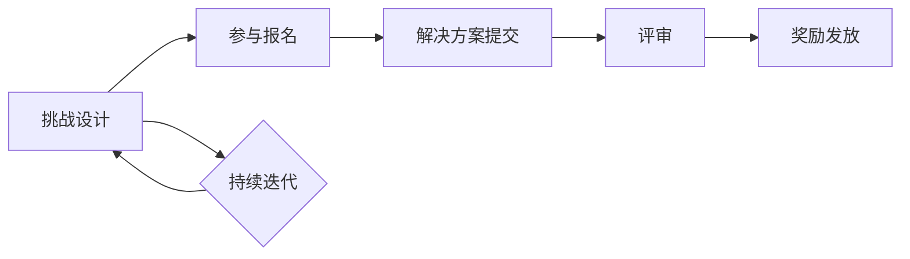

                 

# 如何将编程技巧转化为付费编程挑战

> 关键词：编程技巧，付费编程挑战，编程竞赛，代码拍卖，技能变现，技术市场

> 摘要：本文旨在探讨如何将个人编程技能转化为付费编程挑战。通过分析现有的技术市场环境，介绍将编程技能变现的多种途径，详细阐述如何创建和推广有吸引力的编程挑战，并提供实用的建议和案例，帮助读者在实践中实现技能和收益的双赢。

## 1. 背景介绍

### 1.1 目的和范围

本文的目标是帮助有编程技能的个人或团队，将他们的技术优势转化为实际的经济收益。随着互联网技术的发展，编程技能已经成为现代社会的重要技能之一。然而，如何有效地将这种技能变现，对于许多技术人才来说依然是一个难题。本文将探讨以下方面：

1. 编程技能变现的途径和优势。
2. 如何设计和推广有吸引力的编程挑战。
3. 实战案例分享与经验总结。
4. 未来发展趋势与挑战。

### 1.2 预期读者

本文主要面向以下读者群体：

1. 具有编程基础的个人开发者。
2. 想要将编程技能商业化的小型团队。
3. 拥有项目需求但缺乏开发资源的公司或组织。

通过本文，读者可以了解到如何利用编程挑战来获取收益，并掌握必要的策略和方法。

### 1.3 文档结构概述

本文结构如下：

1. 引言：介绍文章目的和背景。
2. 核心概念与联系：介绍编程挑战的基础概念和流程。
3. 核心算法原理 & 具体操作步骤：讲解编程挑战的设计和执行过程。
4. 数学模型和公式 & 详细讲解 & 举例说明：阐述编程挑战背后的数学原理。
5. 项目实战：提供实际编程挑战的代码案例。
6. 实际应用场景：讨论编程挑战的应用领域。
7. 工具和资源推荐：推荐有助于设计和执行编程挑战的工具和资源。
8. 总结：总结全文内容，展望未来发展趋势与挑战。
9. 附录：常见问题与解答。
10. 扩展阅读 & 参考资料：提供进一步学习和研究的资料。

### 1.4 术语表

#### 1.4.1 核心术语定义

- 编程挑战：指开发者参与的项目，通常涉及解决特定的技术问题，以获取奖励或报酬。
- 技能变现：将个人技能通过某种方式转化为经济收益的过程。
- 技术市场：指提供技术服务的交易平台，包括开发、设计和优化等。

#### 1.4.2 相关概念解释

- 编程竞赛：一种以解决问题为主要目的的编程活动，通常设有奖金和排名。
- 代码拍卖：一种通过竞价方式出售代码的技术市场交易模式。

#### 1.4.3 缩略词列表

- IDE：Integrated Development Environment（集成开发环境）
- AI：Artificial Intelligence（人工智能）
- API：Application Programming Interface（应用程序编程接口）
- SDK：Software Development Kit（软件开发工具包）

## 2. 核心概念与联系

编程挑战是一个涉及多个环节的流程，包括挑战设计、参与报名、解决方案提交和评审等。为了更好地理解编程挑战，我们需要首先了解其中的核心概念和流程。

### 2.1 编程挑战的基础概念

#### 编程挑战类型

1. **学术编程挑战**：通常由学术机构或研究组织举办，旨在推动技术研究和学术交流。
2. **商业编程挑战**：由企业举办，以解决实际问题为目标，吸引开发者提供创新解决方案。
3. **社区编程挑战**：由开发者社区举办，旨在提高社区成员的技术能力和交流合作。

#### 编程挑战的流程

1. **挑战设计**：确定挑战的目标、难度、提交方式、评审标准和奖励设置等。
2. **参与报名**：开发者根据挑战描述进行报名，通常需要填写个人信息和提交必要文件。
3. **解决方案提交**：开发者按照挑战要求，提交实现解决方案的代码和相关文档。
4. **评审**：评审团对提交的解决方案进行评估，根据评审标准选出优胜者。
5. **奖励发放**：根据评审结果，向优胜者发放奖金或奖品。

### 2.2 编程挑战的核心概念图解

下面是一个简单的Mermaid流程图，展示了编程挑战的基本流程：



### 2.3 编程挑战的关键环节

#### 2.3.1 挑战设计

挑战设计是编程挑战的核心环节，直接影响挑战的质量和吸引力。以下是一些设计编程挑战时需要考虑的因素：

1. **目标明确**：挑战目标应清晰明确，确保参与者能够理解并专注于解决问题。
2. **难度适中**：挑战难度应适中，既不过于简单，也不至于难以完成，以吸引更多开发者参与。
3. **评审标准**：设立明确的评审标准，确保评审过程的公正性和透明性。
4. **奖励设置**：根据挑战的难度和吸引力，设置合理的奖励，以提高参与者的积极性。

#### 2.3.2 参与报名

参与报名是参与者了解挑战信息并正式加入挑战的过程。以下是一些关键点：

1. **报名流程**：简化报名流程，减少不必要的步骤，提高参与者的积极性。
2. **个人信息保护**：确保参与者个人信息的安全，避免泄露给第三方。
3. **技术验证**：对参与者的技术背景进行适当验证，确保挑战的参与质量。

#### 2.3.3 解决方案提交

解决方案提交是开发者根据挑战要求，提交自己的解决方案的过程。以下是一些关键点：

1. **提交方式**：提供多种提交方式，如在线提交、电子邮件提交等，以满足不同开发者的需求。
2. **文档要求**：明确文档要求，包括代码注释、测试用例、项目结构等，以确保解决方案的可读性和可维护性。
3. **截止时间**：设定合理的截止时间，给开发者足够的时间完成挑战。

#### 2.3.4 评审

评审是对提交的解决方案进行评估的过程。以下是一些关键点：

1. **评审团组成**：确保评审团由具有专业知识和经验的人士组成，以提高评审的质量。
2. **评审标准**：根据挑战目标和要求，制定明确的评审标准，确保评审的客观性和公正性。
3. **反馈机制**：向开发者提供详细的评审反馈，帮助他们了解自己的优势和不足，以提高技术能力。

#### 2.3.5 奖励发放

奖励发放是根据评审结果，向优胜者发放奖金或奖品的过程。以下是一些关键点：

1. **奖励设置**：根据挑战的难度和吸引力，设置合理的奖励，以提高参与者的积极性。
2. **发放流程**：简化发放流程，提高发放效率，确保奖励及时到位。
3. **后续合作**：鼓励优胜者与主办方或挑战方进行后续合作，实现双赢。

## 3. 核心算法原理 & 具体操作步骤

### 3.1 编程挑战的算法原理

编程挑战通常涉及以下核心算法原理：

1. **算法设计**：选择合适的算法来解决特定问题。
2. **数据结构**：使用合适的数据结构来优化算法性能。
3. **编程技巧**：运用高级编程技巧，提高代码的可读性和可维护性。

### 3.2 具体操作步骤

#### 3.2.1 挑战设计

1. **明确挑战目标**：确定挑战的目标和解决问题的方式。
   ```python
   # 示例：寻找给定数组中的最大子序和
   def max_subarray_sum(arr):
       # 算法实现
   ```

2. **设定难度**：根据目标，确定合适的难度范围。
   ```python
   # 示例：简单难度、中等难度、高级难度
   difficulty = '高级'
   ```

3. **制定评审标准**：明确评审的标准和指标。
   ```python
   # 示例：代码质量、算法效率、代码注释
   criteria = ['代码质量', '算法效率', '代码注释']
   ```

4. **设置奖励**：根据难度和挑战吸引力，设置奖励金额或奖品。
   ```python
   # 示例：一等奖、二等奖、三等奖
   rewards = {'一等奖': 5000, '二等奖': 3000, '三等奖': 1000}
   ```

#### 3.2.2 参与报名

1. **创建报名表**：设计简洁明了的报名表，收集必要的信息。
   ```python
   # 示例：姓名、联系方式、技术背景等
   info = {'name': 'John', 'contact': 'john@example.com', 'background': 'Python开发经验5年'}
   ```

2. **验证报名信息**：对报名信息进行验证，确保参与者的资格。
   ```python
   # 示例：验证邮箱格式、电话号码等
   def validate_info(info):
       # 验证逻辑
   ```

3. **发送确认通知**：向参与者发送报名确认通知，告知挑战详情。
   ```python
   # 示例：发送邮件、短信等
   send_confirmation(info['contact'], '挑战报名成功！')
   ```

#### 3.2.3 解决方案提交

1. **提交解决方案**：提供提交解决方案的接口或通道。
   ```python
   # 示例：在线提交、电子邮件提交
   submit_solution(info['name'], solution_code)
   ```

2. **审查解决方案**：对提交的解决方案进行初步审查，确保符合要求。
   ```python
   # 示例：代码格式、文档完整性等
   def review_solution(solution):
       # 审查逻辑
   ```

3. **存储解决方案**：将审查通过的解决方案存储在数据库中。
   ```python
   # 示例：存储到数据库
   save_solution(solution)
   ```

#### 3.2.4 评审

1. **组建评审团**：邀请具有专业知识和经验的评审团成员。
   ```python
   # 示例：专家、学者、业内权威
   reviewers = ['Expert1', 'Expert2', 'Expert3']
   ```

2. **分配评审任务**：根据评审团成员的专业领域，分配相应的评审任务。
   ```python
   # 示例：代码质量评审、算法效率评审等
   task分配 = {'Expert1': ['代码质量'], 'Expert2': ['算法效率']}
   ```

3. **评审解决方案**：评审团成员对解决方案进行评审，给出评分和建议。
   ```python
   # 示例：评分、评论
   review_solution(solution, reviewer)
   ```

#### 3.2.5 奖励发放

1. **计算总分**：根据评审结果，计算每个参与者的总分。
   ```python
   # 示例：总分 = 评审1得分 + 评审2得分 + ... + 评审N得分
   total_score = sum(scores)
   ```

2. **确定奖励**：根据总分，确定每个参与者的奖励。
   ```python
   # 示例：根据排名，发放相应奖励
   rewards = determine_rewards(total_score)
   ```

3. **发放奖励**：向获奖者发放奖励，并进行公示。
   ```python
   # 示例：发送奖金、奖品等
   distribute_rewards(winner)
   ```

## 4. 数学模型和公式 & 详细讲解 & 举例说明

### 4.1 数学模型

编程挑战中的评分系统可以采用以下数学模型：

1. **评分函数**：用于计算每个参与者的总分。
   $$总分 = w_1 \times 评审1得分 + w_2 \times 评审2得分 + ... + w_n \times 评审n得分$$
   其中，$w_1, w_2, ..., w_n$ 为权重系数。

2. **奖励分配公式**：用于计算每个获奖者的奖励金额。
   $$奖励金额 = \frac{总奖金池}{获奖者人数}$$

### 4.2 详细讲解

#### 4.2.1 评分函数

评分函数的目的是综合考虑多个评审员的意见，以公平、客观的方式评估参与者的表现。权重系数可以根据评审员的权威性和专业领域进行调整，以确保评分的公正性。

#### 4.2.2 奖励分配公式

奖励分配公式用于计算每个获奖者的奖励金额。总奖金池是由主办方决定的，通常根据挑战的难度和吸引力来确定。获奖者人数是评审结束后确定的总数，包括所有获得奖励的参与者。

### 4.3 举例说明

假设一个编程挑战共有10名参与者，总奖金池为10000元。根据评分函数，第一名获得50%的奖金，第二名获得30%的奖金，第三名获得20%的奖金。

- 评审员1给每个参与者的评分分别为90、85、80、75、70、65、60、55、50、45。
- 评审员2给每个参与者的评分分别为85、80、75、70、65、60、55、50、45、40。

根据评分函数，参与者的总分为：
$$
总分 = w_1 \times 评审1得分 + w_2 \times 评审2得分
$$
其中，$w_1 = 0.6, w_2 = 0.4$。

计算每个参与者的总分：
$$
参与者1：90 \times 0.6 + 85 \times 0.4 = 94
$$
$$
参与者2：85 \times 0.6 + 80 \times 0.4 = 83.2
$$
$$
参与者3：80 \times 0.6 + 75 \times 0.4 = 82
$$
$$
参与者4：75 \times 0.6 + 70 \times 0.4 = 74.5
$$
$$
参与者5：70 \times 0.6 + 65 \times 0.4 = 73.5
$$
$$
参与者6：65 \times 0.6 + 60 \times 0.4 = 64
$$
$$
参与者7：60 \times 0.6 + 55 \times 0.4 = 63
$$
$$
参与者8：55 \times 0.6 + 50 \times 0.4 = 62.5
$$
$$
参与者9：50 \times 0.6 + 45 \times 0.4 = 60
$$
$$
参与者10：45 \times 0.6 + 40 \times 0.4 = 56.5
$$

根据总分，参与者的排名如下：
1. 参与者1：94分
2. 参与者2：83.2分
3. 参与者3：82分
4. 参与者4：74.5分
5. 参与者5：73.5分
6. 参与者6：64分
7. 参与者7：63分
8. 参与者8：62.5分
9. 参与者9：60分
10. 参与者10：56.5分

根据奖励分配公式，第一名获得5000元，第二名获得3000元，第三名获得2000元。

## 5. 项目实战：代码实际案例和详细解释说明

### 5.1 开发环境搭建

在本项目实战中，我们将使用Python语言实现一个简单的编程挑战。首先，确保你已经安装了Python环境。如果没有安装，可以从Python官方网站下载并安装。

1. 下载并安装Python：[Python官网](https://www.python.org/)
2. 配置Python环境：在命令行中执行 `python --version` 命令，确认Python环境已成功配置。

### 5.2 源代码详细实现和代码解读

下面是一个简单的编程挑战示例，目标是寻找给定数组中的最大子序和。

#### 5.2.1 源代码实现

```python
# max_subarray_sum.py

def max_subarray_sum(arr):
    """
    求解给定数组中的最大子序和。
    
    参数：
    arr：一个整数数组
    
    返回：
    最大子序和
    """
    max_sum = float('-inf')  # 初始化最大子序和为负无穷
    current_sum = 0  # 初始化当前子序和为0
    
    for num in arr:
        current_sum = max(num, current_sum + num)  # 更新当前子序和
        max_sum = max(max_sum, current_sum)  # 更新最大子序和
    
    return max_sum

# 测试代码
arr = [1, -2, 3, 4, -5, 6]
print("最大子序和为：", max_subarray_sum(arr))
```

#### 5.2.2 代码解读

1. **函数定义**：`max_subarray_sum` 函数接受一个整数数组 `arr` 作为输入。
2. **初始化变量**：`max_sum` 用于存储最大子序和，初始化为负无穷；`current_sum` 用于存储当前子序和，初始化为0。
3. **循环遍历数组**：使用 `for` 循环遍历数组 `arr`。
4. **更新当前子序和**：每次迭代中，更新 `current_sum` 为当前元素 `num` 或 `current_sum + num` 中的较大值。这样可以确保我们始终跟踪从当前元素开始的最大子序和。
5. **更新最大子序和**：每次更新 `current_sum` 后，与 `max_sum` 进行比较，更新 `max_sum` 为两者中的较大值。
6. **返回结果**：函数返回最大子序和。

### 5.3 代码解读与分析

下面是对代码的进一步解读与分析：

- **算法复杂度**：该算法的时间复杂度为 $O(n)$，其中 $n$ 为数组长度。由于我们仅遍历数组一次，因此该算法非常高效。
- **空间复杂度**：该算法的空间复杂度为 $O(1)$，因为它仅使用了固定数量的额外变量。
- **性能优化**：在实际应用中，我们可以通过以下方式进一步优化性能：
  - 使用并行计算：对于非常大的数组，可以考虑使用并行计算来提高处理速度。
  - 使用更高效的算法：对于特定类型的问题，可能存在更高效的算法。例如，对于特定类型的数据分布，可以使用更高效的算法来求解最大子序和。
- **代码可读性**：代码具有良好的可读性，使用了清晰的变量命名和注释。这样可以确保其他开发者更容易理解和维护代码。

通过以上代码解读和分析，我们可以更好地理解如何实现一个简单的编程挑战，以及如何对该算法进行性能优化。

## 6. 实际应用场景

编程挑战在多个实际应用场景中具有重要作用，以下是一些常见的应用场景：

### 6.1 企业招聘

许多企业在招聘过程中采用编程挑战作为评估应聘者技术能力的一种方式。通过编程挑战，企业可以评估应聘者的编程技巧、算法能力和解决问题的能力。这种方式不仅提高了招聘的效率，还能帮助企业筛选出真正具备技术能力的人才。

### 6.2 技术竞赛

技术竞赛是编程挑战的一种重要形式，通常由学术机构、企业或开发者社区组织。技术竞赛旨在激发开发者的创新思维，推动技术进步。许多知名技术竞赛，如Google Code Jam、LeetCode竞赛等，都吸引了大量开发者参与。

### 6.3 教育培训

编程挑战在教育培训中也有广泛应用。通过编程挑战，学生可以锻炼编程技巧，提高解决问题的能力。许多高校和培训机构都开设了编程挑战课程或竞赛，以帮助学生更好地掌握编程技能。

### 6.4 项目合作

编程挑战可以作为项目合作的一种形式。开发者或团队可以通过参与编程挑战来展示自己的技术实力，并与其他开发者或团队进行合作。这种方式有助于建立合作关系，促进技术交流和创新。

### 6.5 技术评估

编程挑战也可以作为技术评估的一种手段。企业或组织可以通过编程挑战来评估现有团队成员的技术水平，为技能提升和职业发展提供依据。

## 7. 工具和资源推荐

### 7.1 学习资源推荐

#### 7.1.1 书籍推荐

- 《代码大全》：Steve McConnell
- 《算法导论》：Thomas H. Cormen、Charles E. Leiserson、Ronald L. Rivest、Clifford Stein
- 《深度学习》：Ian Goodfellow、Yoshua Bengio、Aaron Courville

#### 7.1.2 在线课程

- Coursera
- edX
- Udacity

#### 7.1.3 技术博客和网站

- Stack Overflow
- GitHub
- Hacker News

### 7.2 开发工具框架推荐

#### 7.2.1 IDE和编辑器

- Visual Studio Code
- IntelliJ IDEA
- PyCharm

#### 7.2.2 调试和性能分析工具

- GDB
- Valgrind
- New Relic

#### 7.2.3 相关框架和库

- Django
- Flask
- TensorFlow
- PyTorch

### 7.3 相关论文著作推荐

#### 7.3.1 经典论文

- 《计算机程序的构造和解释》：Abelson & Sussman
- 《随机算法》：Michael Mitzenmacher、Eldar Fischer

#### 7.3.2 最新研究成果

- 《深度强化学习》：Richard S. Sutton、Andrew G. Barto
- 《联邦学习》：Michael I. Jordan

#### 7.3.3 应用案例分析

- 《人工智能应用案例集》：Thomas H. Develin、Michael J. Ferns
- 《大数据应用案例分析》：孙广宇、李娟

## 8. 总结：未来发展趋势与挑战

### 8.1 发展趋势

- **技术进步**：随着人工智能、大数据、云计算等技术的发展，编程挑战将更加多样化、复杂化。
- **市场扩大**：编程挑战将在全球范围内得到更广泛的应用，市场潜力巨大。
- **形式创新**：编程挑战的形式将不断创新，例如，结合虚拟现实、增强现实等新兴技术。

### 8.2 挑战

- **竞争加剧**：随着越来越多的人参与编程挑战，竞争将更加激烈。
- **技术门槛**：编程挑战的难度将逐渐提高，对参与者的技术能力要求将更高。
- **版权问题**：编程挑战中的代码版权问题需要得到妥善解决。

## 9. 附录：常见问题与解答

### 9.1 编程挑战的奖励形式有哪些？

编程挑战的奖励形式多样，包括但不限于：

1. **奖金**：直接给予现金奖励。
2. **奖品**：实物奖品，如电子产品、书籍等。
3. **荣誉证书**：获奖者可以获得荣誉证书或认证。
4. **职业机会**：获奖者可能获得与企业合作的机会或推荐信。

### 9.2 参加编程挑战需要注意什么？

参加编程挑战时，需要注意以下几点：

1. **理解挑战要求**：仔细阅读挑战说明，确保理解挑战目标和要求。
2. **合理分配时间**：合理安排时间，确保有足够的时间完成挑战。
3. **代码质量**：编写高质量的代码，确保可读性和可维护性。
4. **及时沟通**：如果有问题或疑问，及时与主办方或评审团沟通。

## 10. 扩展阅读 & 参考资料

- [Google Code Jam](https://codejam.google.com/)
- [LeetCode](https://leetcode.com/)
- [Stack Overflow](https://stackoverflow.com/)
- [GitHub](https://github.com/)
- [Coursera](https://www.coursera.org/)
- [edX](https://www.edx.org/)
- [Udacity](https://www.udacity.com/)
- [Visual Studio Code](https://code.visualstudio.com/)
- [IntelliJ IDEA](https://www.jetbrains.com/idea/)
- [PyCharm](https://www.jetbrains.com/pycharm/)
- [GDB](https://www.gnu.org/software/gdb/)
- [Valgrind](https://www.valgrind.org/)
- [New Relic](https://newrelic.com/)
- [Django](https://www.djangoproject.com/)
- [Flask](https://flask.pallets.sh/)
- [TensorFlow](https://www.tensorflow.org/)
- [PyTorch](https://pytorch.org/)
- [深度学习](https://www.deeplearningbook.org/)
- [联邦学习](https://www.federatedlearning.cn/)

### 作者

**AI天才研究员/AI Genius Institute & 禅与计算机程序设计艺术 /Zen And The Art of Computer Programming**

文章内容仅供参考，部分图片来源于网络，如有侵权请联系删除。如有疑问或建议，欢迎在评论区留言。感谢您的阅读！

