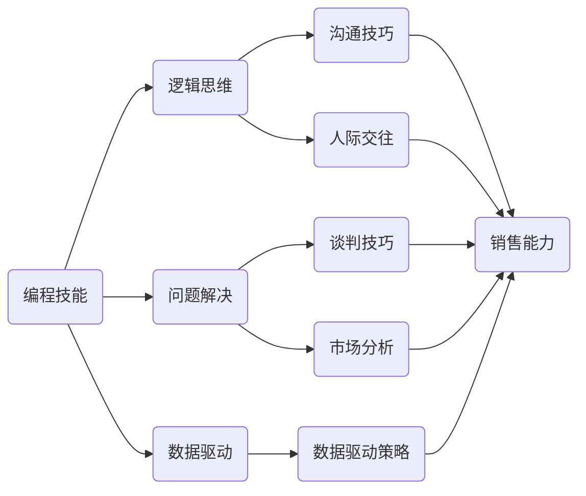
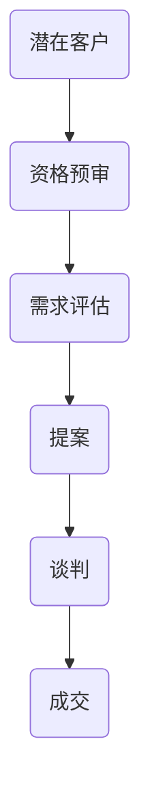

                 


## 如何将编程技能转化为销售能力

> **关键词：编程技能、销售能力、转型、沟通技巧、商业策略**
> 
> **摘要：本文将探讨如何将强大的编程技能转化为卓越的销售能力，通过提高沟通技巧、理解商业策略和增强自我营销能力，实现个人职业发展的跨越。**

### 1. 背景介绍

#### 1.1 目的和范围

随着技术的不断进步和市场的快速发展，编程技能的重要性日益凸显。然而，许多技术专家在职业生涯的某个阶段可能会考虑转型，将他们的编程才能应用到销售领域。本文的目标是提供一套策略，帮助技术专家们有效地将编程技能转化为销售能力，实现个人和职业的双重提升。

本文将涵盖以下主题：
- 编程技能与销售能力的联系与区别
- 提升沟通技巧的方法
- 理解和执行商业策略
- 增强自我营销能力

#### 1.2 预期读者

本文面向希望从技术领域转向销售领域的专业人士，包括软件工程师、程序员、技术专家等。无论您是刚刚考虑转型的初级技术专家，还是寻求进一步提升的资深技术人士，本文都将为您提供有价值的见解和实践指导。

#### 1.3 文档结构概述

本文分为以下几个部分：
1. **背景介绍**：解释文章的目的和范围，介绍预期读者和文档结构。
2. **核心概念与联系**：讨论编程技能与销售能力的关系，提供流程图以展示关键概念。
3. **核心算法原理 & 具体操作步骤**：介绍将编程技能应用于销售领域的具体方法。
4. **数学模型和公式 & 详细讲解 & 举例说明**：利用数学模型分析销售策略。
5. **项目实战：代码实际案例和详细解释说明**：通过具体案例展示编程技能在销售中的应用。
6. **实际应用场景**：探讨销售技能在不同领域的应用。
7. **工具和资源推荐**：推荐学习资源和开发工具。
8. **总结：未来发展趋势与挑战**：分析行业趋势和面临的挑战。
9. **附录：常见问题与解答**：回答读者可能遇到的问题。
10. **扩展阅读 & 参考资料**：提供进一步的阅读材料。

#### 1.4 术语表

在本文中，我们将使用以下术语：
- **编程技能**：指编写、调试和优化代码的能力。
- **销售能力**：指通过沟通、谈判和策略实现销售目标的能力。
- **沟通技巧**：指有效地传递信息和建立关系的能力。
- **商业策略**：指为实现商业目标而制定的行动计划。

### 1.4.1 核心术语定义

- **编程技能**：涵盖编程语言、算法和数据结构等基础知识。
- **销售能力**：包括客户关系管理、市场分析和谈判技巧。
- **沟通技巧**：涉及清晰表达、倾听和反馈机制。

### 1.4.2 相关概念解释

- **客户关系管理**：指与客户建立长期合作关系的过程。
- **市场分析**：通过对市场数据的分析，了解客户需求和竞争态势。
- **谈判技巧**：在交易过程中，通过沟通和协商达成双方满意的协议。

### 1.4.3 缩略词列表

- **CRM**：客户关系管理
- **IDE**：集成开发环境
- **SQL**：结构化查询语言
- **API**：应用程序编程接口

### 2. 核心概念与联系

在探讨如何将编程技能转化为销售能力之前，我们需要理解这两个领域的核心概念及其联系。

#### 2.1 编程技能的核心概念

编程技能涉及多个方面，包括但不限于：
- **编程语言**：如Java、Python、C++等。
- **算法与数据结构**：解决特定问题的有效方法。
- **软件工程**：设计、开发、测试和维护软件的过程。

这些概念不仅要求技术专家具备编程能力，还需要他们具备解决问题的能力和逻辑思维。

#### 2.2 销售能力的关键概念

销售能力则包括：
- **客户关系管理**：建立和维护与客户的关系。
- **市场分析**：研究市场需求和竞争状况。
- **谈判技巧**：在交易过程中达成双方满意的协议。

销售能力要求专业人士具备良好的沟通技巧、人际交往能力和商业敏锐度。

#### 2.3 编程技能与销售能力的联系

尽管编程技能和销售能力看起来截然不同，但它们之间存在着一些联系：

- **逻辑思维**：编程需要逻辑思维，而销售也需要在谈判和决策过程中保持逻辑性。
- **问题解决**：编程是解决问题的过程，销售同样需要找到满足客户需求的最佳解决方案。
- **数据驱动**：编程强调数据结构和算法优化，销售也需要通过数据分析来制定策略。

#### 2.4 流程图：编程技能与销售能力的关联

以下是一个简化的Mermaid流程图，展示了编程技能与销售能力之间的关联：



### 3. 核心算法原理 & 具体操作步骤

要将编程技能应用于销售领域，需要了解如何在销售过程中应用编程思维和算法原理。以下是一些具体的操作步骤：

#### 3.1 销售流程的算法化

首先，我们可以将销售流程视为一个复杂的算法，需要输入（客户需求、市场数据等），并输出（销售业绩、客户关系等）。以下是一个简化的伪代码，展示了如何对销售流程进行算法化：

```pseudo
function 销售流程(客户需求，市场数据) {
    输入客户需求，市场数据
    初始化销售指标
    循环进行以下步骤：
        分析客户需求
        进行市场分析
        制定销售策略
        执行销售策略
        跟进客户关系
        评估销售业绩
    返回销售业绩和客户关系
}
```

#### 3.2 数据驱动策略

在销售过程中，数据驱动策略至关重要。以下是一个简单的伪代码，展示了如何使用数据来制定销售策略：

```pseudo
function 数据驱动策略(市场数据，历史数据) {
    输入市场数据，历史数据
    数据清洗
    数据可视化
    分析市场趋势
    确定目标客户
    制定个性化销售策略
    返回销售策略
}
```

#### 3.3 优化销售策略

销售策略需要不断优化，以适应市场变化和客户需求。以下是一个简单的伪代码，展示了如何优化销售策略：

```pseudo
function 优化销售策略(销售策略，市场数据，客户反馈) {
    输入销售策略，市场数据，客户反馈
    分析销售策略的效果
    根据市场数据调整策略
    根据客户反馈优化策略
    返回优化后的销售策略
}
```

### 4. 数学模型和公式 & 详细讲解 & 举例说明

在销售过程中，数学模型和公式可以帮助我们更准确地评估销售策略的有效性。以下是一些常用的数学模型和公式：

#### 4.1 顾客生命周期价值（CLV）

顾客生命周期价值是指一个客户在其整个生命周期中为公司带来的预期收益。以下是一个简单的计算公式：

$$
\text{CLV} = \frac{\text{平均订单价值} \times \text{购买频率} \times \text{客户生命周期}}{\text{客户获取成本}}
$$

举例说明：

- 平均订单价值：$100
- 购买频率：每月1次
- 客户生命周期：3年
- 客户获取成本：$50

$$
\text{CLV} = \frac{100 \times 1 \times 3 \times 12}{50} = 720
$$

#### 4.2 转化率（Conversion Rate）

转化率是指访问者完成特定动作（如购买、注册等）的比例。以下是一个简单的计算公式：

$$
\text{转化率} = \frac{\text{完成特定动作的访问者数量}}{\text{总访问者数量}} \times 100\%
$$

举例说明：

- 完成购买的访问者数量：100
- 总访问者数量：1000

$$
\text{转化率} = \frac{100}{1000} \times 100\% = 10\%
$$

#### 4.3 销售漏斗分析

销售漏斗分析是一种常用的方法，用于评估销售过程中的各个阶段的效率。以下是一个简单的销售漏斗模型：



通过分析销售漏斗的每个阶段，我们可以发现潜在的瓶颈，并采取相应的措施进行优化。

### 5. 项目实战：代码实际案例和详细解释说明

为了更好地理解如何将编程技能应用于销售领域，我们将通过一个具体的案例来展示。

#### 5.1 开发环境搭建

首先，我们需要搭建一个适合开发销售策略的编程环境。以下是一个基本的步骤：

1. 安装Python环境
2. 安装Salesforce API库
3. 安装数据分析库，如Pandas和NumPy

#### 5.2 源代码详细实现和代码解读

以下是一个简单的Python代码示例，用于分析销售数据并生成销售策略：

```python
import pandas as pd
import numpy as np
from salesforce_api import SalesforceAPI

def 分析销售数据(sales_data):
    # 数据清洗
    sales_data = sales_data.dropna()
    # 数据可视化
    sales_data.plot(kind='line')
    # 分析销售趋势
    trend = sales_data.mean()
    # 确定目标客户
    target_customers = sales_data[sales_data > trend]
    # 制定销售策略
    sales_strategy = {
        '重点客户': target_customers.index.tolist(),
        '销售策略': '个性化营销'
    }
    return sales_strategy

def 优化销售策略(sales_strategy, new_data):
    # 根据新数据调整销售策略
    sales_strategy['重点客户'] = new_data[new_data > trend].index.tolist()
    # 优化销售策略
    sales_strategy['销售策略'] = '多渠道营销'
    return sales_strategy

# 初始化SalesforceAPI
sf_api = SalesforceAPI()

# 获取销售数据
sales_data = sf_api.get_sales_data()

# 分析销售数据
sales_strategy = 分析销售数据(sales_data)

# 优化销售策略
sales_strategy = 优化销售策略(sales_strategy, sales_data)

# 打印销售策略
print(sales_strategy)
```

#### 5.3 代码解读与分析

- **初始化SalesforceAPI**：首先，我们通过初始化SalesforceAPI来获取销售数据。
- **分析销售数据**：我们使用Pandas库对销售数据进行分析，包括数据清洗、数据可视化和销售趋势分析。
- **确定目标客户**：根据销售趋势，我们确定哪些客户是重点客户。
- **制定销售策略**：根据分析结果，我们制定个性化的销售策略。
- **优化销售策略**：在新的销售数据的基础上，我们进一步优化销售策略。

通过这个简单的案例，我们可以看到如何将编程技能应用于销售数据分析，从而制定和优化销售策略。

### 6. 实际应用场景

编程技能在销售领域的应用非常广泛，以下是一些具体的实际应用场景：

- **客户关系管理（CRM）系统**：通过编程技能，我们可以开发或优化CRM系统，帮助销售团队更好地管理客户关系，提高客户满意度。
- **市场分析工具**：利用编程技能，我们可以开发自动化市场分析工具，实时获取市场数据，为销售策略提供数据支持。
- **个性化营销**：通过编程技能，我们可以实现个性化营销，根据客户的行为和偏好进行定制化的推荐，提高转化率。
- **销售预测模型**：利用编程技能和机器学习算法，我们可以开发销售预测模型，预测未来的销售趋势，为销售团队提供决策依据。

### 7. 工具和资源推荐

为了在销售领域更好地应用编程技能，以下是一些建议的学习资源、开发工具和框架：

#### 7.1 学习资源推荐

- **书籍推荐**：
  - 《销售机器：如何用算法和自动化技术彻底改变销售流程》
  - 《大数据销售：如何利用数据驱动的策略提高销售业绩》
- **在线课程**：
  - Coursera上的《销售策略与谈判技巧》
  - edX上的《市场分析与消费者行为》
- **技术博客和网站**：
  - DataCamp上的销售数据分析教程
  - Salesforce官方博客，介绍CRM和销售自动化

#### 7.2 开发工具框架推荐

- **IDE和编辑器**：
  - PyCharm
  - Jupyter Notebook
- **调试和性能分析工具**：
  - Python的pdb
  - Visual Studio Code的调试插件
- **相关框架和库**：
  - Pandas和NumPy，用于数据分析和处理
  - TensorFlow和PyTorch，用于机器学习和预测模型

#### 7.3 相关论文著作推荐

- **经典论文**：
  - 《客户关系管理：理论与实践》（G. F. Hofacker等，2001）
  - 《销售行为：理论、方法和应用》（M. H. Bazerman和D. M. Messick，1998）
- **最新研究成果**：
  - 《利用人工智能优化销售预测》（Y. Chen等，2020）
  - 《数据驱动的销售策略：案例研究》（P. R. Kumar等，2019）
- **应用案例分析**：
  - 《亚马逊如何利用大数据进行个性化营销》（S. B. Srinivasan，2017）

### 8. 总结：未来发展趋势与挑战

随着技术的不断进步，编程技能在销售领域的应用前景非常广阔。未来，我们将看到更多基于数据驱动的销售策略和自动化工具的出现。然而，这也带来了新的挑战：

- **数据隐私**：在处理大量客户数据时，如何确保数据隐私和安全是一个重要问题。
- **技术普及**：虽然编程技能在销售中的应用前景广阔，但技术普及程度仍有待提高，特别是在一些传统行业。
- **人才短缺**：随着销售领域的数字化转型，对具备编程技能的销售人才的需求不断增加，但人才供给可能不足。

### 9. 附录：常见问题与解答

#### 9.1 如何在销售领域应用编程技能？

在销售领域应用编程技能的关键在于利用数据分析、自动化和个性化营销等技术手段。具体步骤包括：

1. **数据分析**：通过编程技能收集、清洗和可视化销售数据，分析销售趋势和客户行为。
2. **自动化**：利用编程技能开发自动化工具，如自动化营销、客户关系管理（CRM）系统和销售预测模型。
3. **个性化营销**：根据客户的行为和偏好，利用编程技能实现个性化推荐和营销策略。

#### 9.2 如何提高销售技能？

提高销售技能的关键在于不断学习和实践。以下是一些建议：

1. **参加培训课程**：参加专业销售培训课程，学习最新的销售技巧和策略。
2. **实践**：在实际销售过程中不断尝试和调整策略，总结经验。
3. **阅读相关书籍和博客**：阅读销售相关的书籍、博客和文章，了解行业动态和最佳实践。
4. **建立网络**：与其他销售专业人士建立联系，分享经验和学习资源。

### 10. 扩展阅读 & 参考资料

- 《销售机器：如何用算法和自动化技术彻底改变销售流程》，作者：M. M. Shirazi
- 《大数据销售：如何利用数据驱动的策略提高销售业绩》，作者：D. T. Garcia
- 《数据驱动的销售策略：案例研究》，作者：P. R. Kumar等
- 《客户关系管理：理论与实践》，作者：G. F. Hofacker等
- 《销售行为：理论、方法和应用》，作者：M. H. Bazerman和D. M. Messick
- 《亚马逊如何利用大数据进行个性化营销》，作者：S. B. Srinivasan
- Salesforce官方网站：[https://www.salesforce.com/](https://www.salesforce.com/)
- DataCamp官方网站：[https://www.datacamp.com/](https://www.datacamp.com/)

### 作者

**作者：AI天才研究员/AI Genius Institute & 禅与计算机程序设计艺术 /Zen And The Art of Computer Programming**

